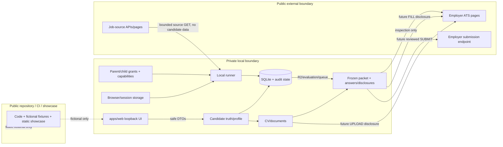

# ApplyPilot Production Verification Project Plan

Last updated: 2026-09-22
Owner: `adeel1608`
Repository: `adeel1608/applypilot`
Expected current main: `2b9e44f7633b3fb17a705a799e9b12482d2d1fb7`
Workflow: `PROJECT_PLAN.md -> one scoped Codex prompt -> execution/evidence -> updated PROJECT_PLAN.md -> technical review -> next prompt`

> This is the active production-readiness checklist. Historical evidence must be preserved separately and never rewritten as current state.

## 1. Resume here

### Current checkpoint (read-only reconciled 2026-09-22)

- Repository `adeel1608/applypilot` is on clean `main` at `2b9e44f7633b3fb17a705a799e9b12482d2d1fb7`; `origin/main` matches.
- PR #45 was approved and squash-merged as `2b9e44f7633b3fb17a705a799e9b12482d2d1fb7`; its merged tree
  equals reviewed head `41c12123fab1a044aec765040cd3eb90aa78aa91` and P1 is now `VERIFIED` against this baseline.
- PR #44 was approved and squash-merged normally. Reviewed head `77dd2cf4b9c10ff9e3f3f2e2535257a692b1ffb5`
  and merged main have the same Git tree; strict commit ancestry is intentionally absent for the squash merge.
- Squash verification rule: expected reviewed head + exact-head CI + approved squash merge + merged parent equal
  pre-merge main + merged tree equal reviewed head tree + approved scope + archive digest preservation.
- PR #42 merged as `467e288959edd6983c5086bbee979aad23e434d8`; PR #43 and PR #45 are merged into the current main baseline.
- Private runtime read-only checks: schema 9, pending migrations 0, integrity `PASS`, foreign-key issues 0.
- Historical lifetime action counters reconcile to source/employer/upload/submission = `14/9/0/0`; this iteration adds `1/0/0/0` (one bounded public-provider GET, no employer/application actions).
- Active source capability count: 0. Active target capability count: 0. The historical parent grant is unchanged and submit-excluded; the ordinary P2-001 source capability completed its documented create/use/revoke lifecycle, and no active authority remains.
- First real employer target validation is historically proven; the selected role's later inspection is passive evidence only.
- Source-enabled Personal Beta: `READY`. Personal Live V1: `NOT_READY`.
- No final-submit consent has been issued and no real application has been submitted.
- Pre-rebase active-plan blob: `9ad8a46ded3205fee063dae0bbaa3162fd5d905b`; SHA-256 `51BE6553983760CAB1AD8C39F29EC444006F7B5983C7150AE8DB6BCD4B44DC93`; archived losslessly at `docs/project-history/PROJECT_PLAN.before-production-rebaseline.md`.

### Reconciliation result

The earlier statement that only owner facts remained was too broad. Code review proves that the
green-banner operation enum is an authority vocabulary, not a production executor. `RunnerTargetCapabilitySchema`
rejects every `REAL_TARGET` capability whose operations are not exactly `[OPEN_AND_INSPECT_ONLY]`;
`freezeRunnerBinding` and `TargetIndependentApplicationRunner` therefore cannot bind a real application
capability. The runner adapter interface has `open`, `map`, `fill`, and `submit`, but no `upload`,
`verify`, or `fillPreview` entry point, and there is no real-target persistence/audit lifecycle for
those operations. Synthetic tests cover map/fill/one-use synthetic submit and unknown outcomes only.
Consequently real `MAP_FOR_FILL`, `FILL`, `UPLOAD`, `VERIFY`, and `FILL_PREVIEW` are `ENGINEERING` /
`MISSING_VERIFICATION`, not owner-fact blockers.

### Latest selected target evidence

Latest recorded Melbourne target:
`Computer Vision Engineer (C++) (R4633)`

Recorded evidence:

- fact-bound engineering CV generated privately as PDF/DOCX;
- locally validated/approved;
- review-only packet frozen;
- packet reportedly used a legacy evaluation binding;
- passive employer inspection completed;
- 46 controls inventoried;
- 27 unsupported controls;
- 1 document-required control;
- zero candidate values;
- zero writes;
- zero uploads;
- zero submissions.

This proves passive compatibility only, not fill/upload/submission readiness. The packet binds legacy
evaluation `b0110c9e-dc20-41a4-b8a5-51cfd5010dbc`, while the current R2 evaluation is
`a95c2f2f-8175-4602-92c2-667f04a099b5`; the packet is therefore stale for any application operation.
The current CV artifacts remain approved, non-stale, private-only, and bound to the current job/profile:
PDF digest `28e64de248ff757a247ba789baea7692aae92372f3dd6ebac6019a9ad241b0e8` and DOCX digest
`d83d607cf9ae3d9bdadc468660d942d86f14b1394be4c678d5f413406f2139ca`.

### Source accounting reconciliation

Run `0dba8b34-fb59-4cc8-a7ef-c3b97e8d5bbf` is durably `COMPLETE`: 4 requests, 4 pages, 100 provider
records (25 per page), 100 accepted, 0 unusable, 83 newly persisted observations/job versions,
83 current R2 evaluations, and 83 queue decisions. The 17-record difference is not silent loss:
`persistLeverObservation` deterministically returns `created: false` when the observation identity
already exists; the page audit records accepted and persisted counts, while the repository does not
retain a per-record duplicate disposition. The redacted evidence therefore supports exactly
`100 accepted = 83 created + 17 deterministic duplicate/no-op dispositions`, but cannot identify those
17 records individually without the discarded provider payload. No rejected/unusable records are
present in this run, and replay remained idempotent.

### Candidate evidence correction

The private profile contains verified C++, OpenCV/stereo-vision and related robotics skills, verified
engineering education/employment/certification/licence evidence, and verified restricted Australian
work-right evidence. The selected role is still `REVIEW_REQUIRED` because provider
evidence is incomplete: `datePosted`/expiry is absent, extracted requirements are empty, and job-level
work-rights, vehicle, hours, schedule, licence/certification and extraction-coverage dimensions remain
unknown. These are not equivalent to missing candidate experience or skills; classify them as
`PROVIDER_EVIDENCE`/`MISSING_VERIFICATION` unless a later owner fact is genuinely required by a concrete
form question.

## 2. Final production objective

ApplyPilot must support a safe, reproducible, single-owner production workflow:

`discover -> normalize -> deduplicate -> evaluate -> shortlist -> generate/freeze documents -> inspect -> map -> fill -> upload -> human review -> fresh submit consent -> submit once -> track outcome`

### Green banner

`# 🟢 **WE ARE READY**`

means:

- ready for the first supervised real submission;
- suitable current role selected;
- candidate facts supported;
- current CV and packets frozen;
- actual target inspected;
- real map/fill/upload verified;
- filled preview reviewed;
- exact submit control identified;
- one-use consent mechanism verified;
- no unresolved material blocker.

It does NOT mean an application has already been submitted.

### Permanent safety boundaries

- Unknown facts remain unknown.
- Never infer citizenship, visa/work rights, sponsorship, clearance, experience, education, certifications, licences, availability, or other material application facts.
- Never bypass CAPTCHA, MFA, authentication, bot controls, rate limits, access controls, or website restrictions.
- No blind retry after ambiguous submission.
- Final submit always requires fresh one-use owner consent.
- Private profile, documents, DB, cookies, sessions, secrets, and live payloads remain local/ignored.
- Public showcase is not operational production.

## 3. Working agreement

For every future Codex iteration:

1. Read `AGENTS.md`, this plan, and relevant history.
2. Verify branch, HEAD, origin/main, worktree, DB/schema compatibility, and dependencies.
3. Select only the authorized task.
4. Update the task blueprint before application/runtime code changes.
5. Implement only within scope.
6. Run acceptance checks.
7. Record evidence, failures, blockers, and decisions.
8. Update current state and next dependency.
9. Return the updated plan and handoff.
10. Wait for review where required.

### Status values

`NOT_STARTED`, `IN_PROGRESS`, `IMPLEMENTED_UNVERIFIED`, `BLOCKED`, `VERIFIED`, `DEFERRED`, `NOT_APPLICABLE`

### Evidence values

`REPORTED`, `CODE_REVIEWED`, `SYNTHETICALLY_VERIFIED`, `LOCAL_RUNTIME_VERIFIED`, `LIVE_VERIFIED`, `DEPLOYMENT_VERIFIED`

Every verified task must record revision, environment, command/observation, timestamp, result, evidence location, and invalidation conditions.

## 4. Verified-state ledger

### BASE-001 — Repository baseline

Status: `VERIFIED`
Owner: Codex

Checklist:

- [x] Verify local HEAD, `origin/main`, and clean worktree.
- [x] Verify PR #42/#43 ancestry and merge commits.
- [x] Record current draft blob/hash and archive it losslessly.
- [x] No repository file named `PROJECT_PLAN(7).md` was supplied or present; comparison is `NOT_AVAILABLE`, not assumed equal.
- [x] Preserve unresolved historical work in the archive.

Acceptance: one non-contradictory baseline.

### BASE-002 — Private runtime baseline

Status: `VERIFIED`
Depends on: `BASE-001`

Read-only checks:

- [x] schema version 9, pending migrations 0, integrity `PASS`, foreign keys 0;
- [x] migrations `0000`-`0008` unchanged and `0009` additive;
- [x] parent/child ledger, active authority counts, and historical action counters;
- [x] selected role, current profile/evaluation/document/packet bindings, and inspection evidence.

Acceptance: safe current-state summary with no private values printed.

### BASE-003 — Source accounting

Status: `VERIFIED`
Depends on: `BASE-002`

Latest recorded run:

- 4 requests;
- 4 pages;
- 100 provider records;
- 100 accepted;
- 83 persisted/evaluated/queued.

Checklist:

- [x] Account for all 100 records and four 25-record pages.
- [x] Explain the 17-record difference as deterministic duplicate/no-op dispositions; individual identities are not retained.
- [x] Confirm zero unusable/rejected records in this run and no silent persistence failure.
- [x] Verify current R2/evaluation/queue counts are 83/83/83 and replay is idempotent.

Acceptance: every provider record has a deterministic disposition.

## 5. Architecture and trust boundaries

Document actual ownership for:

- `apps/web`;
- `apps/showcase`;
- candidate profile/truth store;
- job sources;
- importer;
- R2 normalization/evidence;
- eligibility/fit;
- duplicate/queue/corrections;
- documents;
- application runner;
- tracker;
- database;
- green-banner parent/child authority.

### Parent grant

Current operation ceiling includes:

- `SOURCE_LIST_JOBS`
- `OPEN_AND_INSPECT_ONLY`
- `MAP_FOR_FILL`
- `FILL`
- `UPLOAD`
- `VERIFY`
- `FILL_PREVIEW`

`SUBMIT` remains excluded.

Audit:

- [x] parent persistence/digest;
- [x] child derivation/scope;
- [x] child expiry/replay;
- [x] code SHA binding (the persisted parent is bound to the pre-merge implementation SHA; no child was created after the merge);
- [x] parent submit exclusion and terminal child evidence;
- [x] source-run restart/replay evidence;
- [ ] cumulative cross-run action budget (not implemented; `ENGINEERING`).

### Runner authority

Audit result (revision `010cbe909b7d7b2b4ed88c413f270f7ff1ff75ac`, code reviewed 2026-09-22):

| Operation               | Authority enforcement                           | Adapter/runtime entry point                                               | Packet binding                  | Persistence/audit                           | Verification/tests            | Current evidence       |
| ----------------------- | ----------------------------------------------- | ------------------------------------------------------------------------- | ------------------------------- | ------------------------------------------- | ----------------------------- | ---------------------- |
| `OPEN_AND_INSPECT_ONLY` | `REAL_TARGET` schema + inspection identity      | Lever passive inspection adapter + `TargetInspectionRunner`               | `FrozenInspectionBinding`       | `runner_inspection_bindings` + audit events | live validated; synthetic/E2E | `LIVE_VERIFIED`        |
| `MAP_FOR_FILL`          | enum/parent only; real target schema rejects it | no real adapter; synthetic `TargetIndependentApplicationRunner.map` only  | synthetic `FrozenRunnerBinding` | no real operation lifecycle                 | unit synthetic only           | `ENGINEERING`          |
| `FILL`                  | enum/parent only; real target schema rejects it | no real adapter; synthetic `TargetIndependentApplicationRunner.fill` only | synthetic binding only          | no real operation lifecycle                 | unit synthetic only           | `ENGINEERING`          |
| `UPLOAD`                | enum/parent only; real target schema rejects it | no `upload` adapter method                                                | none                            | none                                        | no upload-stage test          | `MISSING_VERIFICATION` |
| `VERIFY`                | parent enum only                                | no runner method or adapter method                                        | none                            | none                                        | none                          | `MISSING_VERIFICATION` |
| `FILL_PREVIEW`          | parent enum only                                | no runner method or adapter method                                        | none                            | none                                        | none                          | `MISSING_VERIFICATION` |

The existing synthetic runner does have a frozen binding, protection stops, document digest check,
one-use synthetic consent, and `OUTCOME_UNKNOWN` behavior. Those proofs do not establish a production
real-target operation path. The next engineering task must address this gap before any owner-fact
question can be treated as the sole blocker.

## 6. Environment/configuration/secrets

### ENV-001 — Supported host

Verify:

- Windows/PowerShell;
- Node/npm;
- native SQLite;
- Playwright Chromium;
- filesystem permissions;
- loopback ports;
- timezone/DST;
- sleep/reboot;
- disk space;
- process concurrency.

### ENV-002 — Configuration inventory

Create:
`variable | purpose | environment | default | secret? | owner | validation | rotation/recovery`

Never record secret values.

### ENV-003 — Secrets

Verify:

- ignored env files;
- no credentials in Git/history;
- no secrets in CI artifacts;
- cookies/browser state local only;
- documented provisioning, rotation, revocation, leak response.

## 7. Dependency-ordered implementation plan

### P0 — Baseline reconciliation and plan rebase

Status: `VERIFIED`

- [x] Archive old plan at `docs/project-history/PROJECT_PLAN.before-production-rebaseline.md`.
- [x] Record source commit/blob/hash.
- [x] Replace stale front-page state.
- [x] Add stable task IDs.
- [x] Add old-to-new crosswalk.
- [x] Separate reported vs verified evidence.
- [x] Open documentation-only PR #44; exact-head CI passed, review approved, and squash merge recorded
      at `3cc75dfd3dcaf35f09b857ab5c42a52d923bc1fc` (https://github.com/adeel1608/applypilot/pull/44).

#### P0-004 — Historical archive formatting-policy closure

Status: `VERIFIED`
Owner: Codex
Depends on: P0 baseline archive and exact-head repository CI
Objective: preserve the byte-identical historical snapshot while allowing repository-wide formatting
checks to cover all active files.
Root cause: `prettier --check .` correctly rejected the immutable historical snapshot even though
the active plan was formatted. Formatting, editing, regenerating, or line-ending-normalizing the
archive would destroy its evidence value.
Authorized change: add exactly this `.prettierignore` entry and no broader pattern:
`docs/project-history/PROJECT_PLAN.before-production-rebaseline.md`
Acceptance: archive Git blob remains `9ad8a46ded3205fee063dae0bbaa3162fd5d905b` and SHA-256 remains
`51BE6553983760CAB1AD8C39F29EC444006F7B5983C7150AE8DB6BCD4B44DC93`; active `PROJECT_PLAN.md`
continues to pass normal Prettier checks; exact-head GitHub CI is the final external P0 gate.
Local verification: archive hash/blob checked before and after; active-plan formatting, privacy,
diff, and fsck checks run.
Evidence: exact-head GitHub Actions quality passed at reviewed head `77dd2cf4b9c10ff9e3f3f2e2535257a692b1ffb5`
(runs `35681958007` and `35681961078`); PR #44 was accepted and squash-merged as
`3cc75dfd3dcaf35f09b857ab5c42a52d923bc1fc`. Archive blob/SHA are preserved on merged main.
Failure/recovery: if the archive hash changes, stop and restore it from the committed PR state;
if CI fails for another reason, investigate only that exact failure and stop before unrelated fixes.
Invalidation: any archive content change or base/head drift invalidates this record.

Exit: one consistent active plan.

### P1 — Production scope and architecture verification

Status: `VERIFIED`

Evidence: architecture work and local/code evidence were accepted on PR #45; exact-head CI passed,
the reviewed tree equals the squash-merged tree, and merged main is
`2b9e44f7633b3fb17a705a799e9b12482d2d1fb7`. This verifies architecture only; it does not make P2/P3/P4
or Personal Live V1 ready.

- [x] Component capability matrix (read-only code review).
- [x] End-to-end data-flow map (source/R2/document/packet/runner boundaries recorded).
- [x] Private app vs showcase boundary.
- [x] Real `MAP_FOR_FILL/FILL/UPLOAD/VERIFY/FILL_PREVIEW` architecture audit.
- [x] Parent/child authority enforcement audit.
- [x] Runner target capability enforcement audit.
- [x] Deployment topology decision: `LOCAL_SINGLE_OWNER_V1`.
- [x] Trust-boundary review of current local-first implementation.

Exit: explicit implemented-vs-proposed capability map.

#### P1-001 execution blueprint and evidence

Objective: document the narrowest supported Personal Live V1 architecture, ownership, trust
boundaries, authority limits, and future P4 design inputs without changing runtime behavior.

Scope/components: `apps/web`, `apps/showcase`, candidate profile/runtime, source readers and
transport, source/R2 repositories, eligibility/fit, documents/packets, target inspection and
synthetic runner, tracker/outcomes, SQLite/migrations, backup/restore, and browser/private roots.

Steps completed: inspect merged code and existing architecture/security/runbook docs; trace data and
authority flow; classify each capability as implemented, synthetic-only, locally verified, live
verified, engineering, or missing verification; select `LOCAL_SINGLE_OWNER_V1`; record failure
ownership and P2/P3/P4 dependencies; run non-mutating checks.

Acceptance: component and capability matrices complete; private/public boundary explicit; parent/child
authority and real-target restriction documented; failure model assigned; topology selected; no P1
unknown remains that would force P4 to guess. No source/employer/runtime action or database mutation
was performed.

Rollback: documentation-only branch; revert the P1 documentation commit before review if evidence is
incorrect. No runtime rollback or migration is applicable.

Invalidation: code, migration, authority, deployment, or trust-boundary changes invalidate this
P1 evidence and require a new architecture review.

#### P1-002 execution blueprint and evidence

Objective: correct active-plan release-marker wording and phase-status semantics without changing the
architecture evidence, runtime behavior, authority, data, migrations, tests, workflow, or dependencies.

Required corrections: restore the exact green-banner phrase at both active-plan definition/emission
locations; keep overall P1 `IMPLEMENTED_UNVERIFIED` until PR #45 is reviewed, merged, and its merged
tree is verified; keep overall P5 blocked by P4 while preserving its verified synthetic safety evidence
as `P5-SYN-001`.

Scope: `PROJECT_PLAN.md` only. The immutable historical archive remains untouched. No source,
employer, browser, document, packet, database, capability, grant, candidate-profile, deployment, or
application action is permitted.

Acceptance: zero obsolete placeholder-marker occurrences; exact phrase appears in both intended
active-plan locations; P1 is `IMPLEMENTED_UNVERIFIED`; P5 is `BLOCKED`; `P5-SYN-001` is `VERIFIED`;
P4 remains `BLOCKED`; Personal Live V1 remains `NOT_READY`; exact-head CI independently passes.

Rollback: revert this documentation-only commit on `docs/p1-production-architecture`; no runtime
rollback or migration is applicable. Invalidation: any runtime/architecture change or merged-main
drift requires a fresh P1 review.

### P1 production topology decision

Selected topology: `LOCAL_SINGLE_OWNER_V1` on an owner-controlled Windows host.

```text
OWNER WINDOWS HOST (private, loopback-first)
├── apps/web — private operational UI, loopback/local access
├── local Node/TypeScript runner — scoped source and target orchestration
│   └── Playwright Chromium only when an approved browser capability requires it
├── local SQLite — profile versions, jobs/evidence, R2, queue, grants, capabilities, audits
├── data/private — profile, generated documents, packets, reports, backups, browser/session state
└── local recovery storage — verified SQLite-safe backups and restore runbook

SEPARATE PUBLIC SYSTEM
└── apps/showcase — static fictional demo only; no private DB/profile/session/authority/network
```

Personal Live V1 requires no hosted database, cloud browser, remote worker, multi-tenancy,
multi-user authentication, SaaS queue, Kubernetes, Redis, cloud document storage, or paid AI API.
The local runner is the only place permitted to hold private candidate data, authenticated state, or
future employer interaction. External actions remain default-deny and require operation-scoped,
short-lived authority. `apps/showcase` is not Personal Live V1 and cannot trigger actions.

### P1 component ownership and maturity matrix

| Component / path                                                                            | Responsibility; inputs → outputs; state                                                   | Trust / side effects / authority                                                              | Maturity and remaining work                                                                          |
| ------------------------------------------------------------------------------------------- | ----------------------------------------------------------------------------------------- | --------------------------------------------------------------------------------------------- | ---------------------------------------------------------------------------------------------------- |
| `packages/candidate-profile`, `apps/web/lib/candidate-profile-provider.ts`                  | Zod profile truth store; private/demo resolution → verified facts/status DTO              | Private local boundary; no network; profile context gate prevents demo facts for real imports | `LOCAL_RUNTIME_VERIFIED`; owner facts remain P2-scoped                                               |
| `packages/job-model`                                                                        | Canonical job, source, eligibility, application enums → typed domain objects              | Untrusted boundary after schema validation; no side effect                                    | `LOCAL_RUNTIME_VERIFIED`; provider freshness remains P2                                              |
| `packages/job-sources/src/source-capability.ts`, `private-allowlist.ts`                     | Source capability schema/digest/readiness → approved source scope                         | Private authority; no call by itself; exact host/path/operation/budget/expiry                 | `LOCAL_RUNTIME_VERIFIED`; cumulative cross-run budget remains engineering                            |
| `packages/job-sources/src/secure-source-transport.ts`, `source-runner.ts`, Lever readers    | Approved source capability → bounded HTTPS requests, inert records, stop diagnostics      | Public source boundary; GET only through capability, HTTPS/SSRF/query/redirect/retry guards   | `LIVE_VERIFIED` for bounded Lever list evidence; no new live action in P1                            |
| `apps/web/lib/source-workspace.ts`, `packages/database/src/source-enablement-repository.ts` | Owner source view/orchestration; runs/pages/observations/audits → R2 handoff              | Private UI + DB; capability currentness checked before pages and completion                   | `LOCAL_RUNTIME_VERIFIED`/bounded beta live evidence; restart per-record audit gap is P3              |
| `packages/job-importer`                                                                     | User-supplied content, inert HTML/text, URL policy → validated import batches             | Private import boundary; no source fetch; explicit confirmation before canonical writes       | `LOCAL_RUNTIME_VERIFIED`; no architecture gap for P1                                                 |
| `packages/job-normalizer`, source observation tables                                        | Raw source record → normalized job version, conservative identity/dedup candidates        | Untrusted data becomes immutable provenance; no external side effect                          | `LOCAL_RUNTIME_VERIFIED`; changed/duplicate/restart tests remain P3                                  |
| `packages/eligibility-engine`, `packages/fit-scorer`                                        | Current profile + evidence/job → eligibility, fit, explanations, coverage                 | Deterministic local computation; unknown stays review; no external side effect                | `LOCAL_RUNTIME_VERIFIED`; calibration remains uncalibrated and P2/P3 evidence-gated                  |
| `packages/database/src/r2-repository.ts`, `r2a-repository.ts`                               | Immutable evidence/evaluation/queue/correction records → currentness and audit events     | Private SQLite; transactions/FKs and stale invalidation; no network                           | `LOCAL_RUNTIME_VERIFIED`; current packet/evaluation alignment remains P2                             |
| `packages/resume-engine`, `cover-letter-engine`, `apps/web/lib/private-document.ts`         | Verified profile/job → private PDF/DOCX artifacts and digests                             | Private filesystem; no outbound transfer; approval binds content digest                       | `LOCAL_RUNTIME_VERIFIED`; regeneration remains P2-gated                                              |
| `packages/database/src/beta-repository.ts` packet functions                                 | Current job/profile/evaluation/docs/answers → frozen packet/readiness                     | Private DB; rejects stale versions and invalidates on material changes                        | `LOCAL_RUNTIME_VERIFIED` synthetic/private; selected packet is stale for application operations (P2) |
| `packages/application-runner/src/inspection-runner.ts`, `lever-inspection-adapter.ts`       | Frozen packet + real inspection capability → passive DOM field inventory                  | Employer boundary; one navigation/evaluation, zero writes/data; target capability required    | `LIVE_VERIFIED` for inspection history; no mutation API                                              |
| `packages/application-runner/src/target-runner.ts`                                          | Target capability schema; synthetic packet binding/map/fill/consent/outcome → checkpoints | Real target schema permits only `OPEN_AND_INSPECT_ONLY`; synthetic adapter is loopback        | Inspection `LIVE_VERIFIED`; real MAP/FILL `ENGINEERING`, real UPLOAD/VERIFY/PREVIEW missing          |
| `apps/web/lib/runner-workspace.ts`, `runner-enablement-repository.ts`                       | Private target proposal/allowlist, capability persistence, inspection/recovery views      | Private authority + DB; digest/packet/currentness checks; no automatic approval               | `LOCAL_RUNTIME_VERIFIED` for inspection; future P4 lifecycle required                                |
| `packages/application-runner/src/green-banner-grant.ts`, green-banner repository            | Parent grant digest/scope → source/target child capabilities and terminal events          | Private authority; child TTL, scope, main SHA, packet/document bindings; SUBMIT excluded      | `LOCAL_RUNTIME_VERIFIED`; cumulative cross-run budget unresolved                                     |
| `packages/application-tracker` and `application_events`                                     | Validated lifecycle events → append-only timeline/outcome projection                      | Private DB; no network; ambiguous outcome modeled                                             | `LOCAL_RUNTIME_VERIFIED` synthetic; real operation events await P4/P7                                |
| `packages/database/src/schema.ts`, migrations `0000`–`0009`                                 | SQLite schema, FKs, immutable migration history → durable local state                     | Private local boundary; no auto-migrate in production                                         | `LOCAL_RUNTIME_VERIFIED`; backup/restore rehearsal is P11                                            |
| `scripts/backup.ts`, `scripts/restore.ts`, database maintenance                             | SQLite-safe backup manifest/preview/confirmed restore → recovery state                    | Private filesystem; restore requires explicit confirmation and recovery backup                | `IMPLEMENTED_UNVERIFIED`; operational rehearsal deferred P11                                         |
| `apps/web`                                                                                  | Loopback operational UI/server actions; safe DTOs → local views/mutations                 | Loopback Host/Origin/session/nonce gate; private profile server-only                          | `LOCAL_RUNTIME_VERIFIED`; deployment topology selected, no hosted exposure                           |
| `apps/showcase`, `scripts/audit-public-showcase.ts`                                         | Static fictional pages/assets → public demo export                                        | Public boundary; audit rejects private imports, DB/fs/network/server actions                  | `LOCAL_RUNTIME_VERIFIED`; independently deployable, never operational                                |
| Playwright/browser lifecycle (`start-e2e-server.ts`, inspection adapter)                    | Synthetic server or approved inspection session → bounded browser observations            | Browser/session private; protection/auth/CAPTCHA/MFA stop; no bypass                          | Synthetic + inspection live evidence; real mutation lifecycle is P4                                  |
| Private filesystem roots (`scripts/lib/runtime-safety.ts`, ignored `data/private`)          | Profile, DB, documents, packets, backups, sessions → local artifacts                      | Outside Git/CI; secrets/cookies never logged or committed                                     | `LOCAL_RUNTIME_VERIFIED`; permissions/recovery thresholds remain P6/P11                              |

### P1 capability matrix

| Operation                       | Exists / evidence                                                                  | Authority, persistence, adapter                                                         | Personal Live V1 status                                             |
| ------------------------------- | ---------------------------------------------------------------------------------- | --------------------------------------------------------------------------------------- | ------------------------------------------------------------------- |
| `DISCOVER` / `SOURCE_LIST_JOBS` | Lever source runner and source UI; bounded live run evidence                       | SourceCapabilityV2 + private allowlist + source pages/observations/audits; Lever reader | `READY_BOUNDED_PERSONAL_BETA`, not unattended                       |
| `NORMALIZE`                     | Source/import normalizers and immutable job versions; local/live source evidence   | Schema boundary and source repository; no external side effect                          | `LOCAL_RUNTIME_VERIFIED`                                            |
| `EVALUATE`                      | R2 eligibility/fit/evidence engines and persisted evaluations                      | Current private profile/evidence; R2 audit; no external side effect                     | `LOCAL_RUNTIME_VERIFIED`, calibration not production-calibrated     |
| `QUEUE`                         | Queue decisions and PREPARING currentness gates                                    | R2 repository + audit; no external side effect                                          | `LOCAL_RUNTIME_VERIFIED`                                            |
| `DOCUMENT_GENERATE`             | Resume/cover-letter engines and private artifact digests                           | Private filesystem and profile provenance; no authority/network                         | `LOCAL_RUNTIME_VERIFIED`                                            |
| `PACKET_FREEZE`                 | ApplicationPacket schema/repository, digest/currentness/readiness                  | Private DB, document approvals, current job/profile/evaluation bindings                 | `LOCAL_RUNTIME_VERIFIED`; selected packet stale for application use |
| `OPEN_AND_INSPECT_ONLY`         | TargetInspectionRunner + Lever passive adapter; real inspection history            | REAL_TARGET capability, FrozenInspectionBinding, inspection persistence/audits          | `LIVE_VERIFIED` for bounded inspection only                         |
| `MAP_FOR_FILL`                  | Synthetic `TargetIndependentApplicationRunner.map`; real capability schema rejects | Synthetic binding only; no real lifecycle persistence                                   | `ENGINEERING`                                                       |
| `FILL`                          | Synthetic runner fill path; real capability schema rejects                         | Synthetic binding only; disclosure boundary not real-enabled                            | `ENGINEERING`                                                       |
| `UPLOAD`                        | Parent enum and synthetic document checks only; no adapter method                  | No real runtime/persistence path                                                        | `MISSING_VERIFICATION`                                              |
| `VERIFY`                        | Parent vocabulary only; no runner/adapter method                                   | No real runtime/persistence path                                                        | `MISSING_VERIFICATION`                                              |
| `FILL_PREVIEW`                  | Parent vocabulary only; no runner/adapter method                                   | No real runtime/persistence path                                                        | `MISSING_VERIFICATION`                                              |
| `FINAL_REVIEW`                  | Synthetic `readyForFinalReview` checkpoint                                         | Frozen synthetic binding and packet readiness                                           | `SYNTHETICALLY_VERIFIED`, real preview absent                       |
| `SUBMIT_CONSENT`                | Synthetic one-use final consent and concurrent-use tests                           | Binding digest/token/expiry/used state; parent grant excludes SUBMIT                    | `SYNTHETICALLY_VERIFIED`, real submit unavailable                   |
| `SUBMIT`                        | Synthetic adapter outcome model only; no real-target capability                    | Real schema rejects application scope; ambiguous result becomes `OUTCOME_UNKNOWN`       | `DISABLED_REAL`                                                     |
| `OUTCOME_TRACKING`              | Application tracker and append-only events                                         | Private SQLite; no external side effect                                                 | `LOCAL_RUNTIME_VERIFIED` model, real action evidence absent         |

Implemented is not production-ready: only bounded source ingestion and passive inspection have live
evidence; real application mutation remains blocked.

### P1 trust-boundary and data-flow model



Candidate data first crosses the private boundary at target `FILL` (answers), `UPLOAD` (documents),
or `SUBMIT`; all three are disclosure operations, and FILL/UPLOAD require their own authority and
auditable verification even though they precede final submission. Source discovery sends no candidate
data. The showcase never receives profile, DB, session, grant, or runner authority.

### P1 parent/child authority findings

- Parent `GREEN_BANNER_SESSION_GRANT_V1` is persisted with canonical digest, immutable scope,
  `mainSha`, and submit excluded from its operation vocabulary.
- Child derivation persists deterministic child digest and parent digest; source children require
  provider/tenant/host/path and `SOURCE_LIST_JOBS`; target children require origin/path/packet.
- `assertGreenBannerChildWithinParent` enforces parent scope, operation ceiling, main SHA equality,
  expiry, and maximum child TTL. Packet binding is mandatory for MAP/FILL/FILL_PREVIEW/VERIFY; packet
  plus document digest is mandatory for UPLOAD.
- Database repositories persist parent/child events, reject duplicate digests, reject inactive or
  mismatched parents, and expose active-child/recovery state. Target/source repositories separately
  recheck current capability digest/version before execution.
- Target inspection has its own immutable binding and lifecycle/audit tables. Real application
  operations remain rejected by `RunnerTargetCapabilitySchema`; parent vocabulary alone is not an
  executor.
- Restart semantics are durable for source runs and inspection/recovery checkpoints. A cumulative
  cross-run action budget is not implemented and remains engineering work.

### P1 external-boundary failure ownership

| Failure / signal                                                         | Required behavior now                                                                    | Owning future phase |
| ------------------------------------------------------------------------ | ---------------------------------------------------------------------------------------- | ------------------- |
| Network timeout, DNS/TLS/connection failure                              | bounded stop with safe code and lifecycle stage; no blind retry beyond capability budget | P3/P6               |
| Redirect, destination drift, SSRF/host/path/query mismatch               | reject/stop before or at transport; never mutate approved semantics                      | P3/P4               |
| Popup/new window or browser context loss                                 | inspection/runner stop with diagnostic; no unmanaged navigation                          | P4/P7               |
| Form/schema drift or unsupported control                                 | fail closed, retain safe diagnostic only, require review                                 | P4/P7               |
| Browser/process crash or partial write                                   | durable checkpoint/recovery; reconcile authority before resume                           | P6/P11              |
| Stale packet/form/document/profile/evaluation                            | reject binding and invalidate dependent state; regenerate only after gates               | P2/P4               |
| Expired/revoked/changed capability or duplicate invocation               | reject currentness check; consume/revoke terminal child; no replay                       | P4/P7               |
| CAPTCHA, MFA, authentication, bot protection, rate limit, access control | stop immediately; no bypass, retry, or credential action                                 | P4/P7               |
| Ambiguous submission/lost response                                       | terminal `OUTCOME_UNKNOWN`; never blind retry                                            | P5/P10              |

### P1 deployment and security requirements

`LOCAL_SINGLE_OWNER_V1` uses an owner-controlled Windows host, pinned Node/npm and Playwright where
needed, local SQLite, ignored private document/browser roots, verified local backups, loopback-first
web access, and no public private-dashboard exposure. Source requests require source authority;
employer actions require target/application authority. The public showcase is separately static and
fictional.

P4/P6/P9 must preserve: least-privilege filesystem access; private data outside Git; secrets outside
Git; no cookies/raw candidate values in generic telemetry; operation-specific short-lived authorities;
fail-closed stale/changed bindings; immutable/auditable external-action history; no SUBMIT under the
parent grant; no protection bypass; `OUTCOME_UNKNOWN` for ambiguity; and no blind retry.

### P1 exit and dependency review

P1 architecture work is complete and `VERIFIED` against merged main
`2b9e44f7633b3fb17a705a799e9b12482d2d1fb7`: component/capability/data-flow matrices, private/public
boundary, parent/child authority path, real-runner limitation, topology, trust model, and
implemented-vs-proposed distinction are explicit. P1 does not complete P2, P3, P4, Personal Live V1,
or the green banner.

Next dependency order (read-only decision, not execution): P2 provider freshness/current role and
packet evidence must be resolved before P4; P3 restart/replay, changed/duplicate handling, and
staleness propagation must be verified before P4. Therefore the next implementation task is P2, not
P4. P4 remains blocked by BLK-001, BLK-002, BLK-004, BLK-005, BLK-007, and BLK-008.

#### P2-001 execution blueprint and evidence

Objective: verify the selected Melbourne role against one owner-authorized, bounded public-provider
freshness operation; preserve truthful unknowns; refresh R2 and packet bindings only when currentness
gates pass; otherwise reject/defer the role with a precise blocker.

Starting state: merged main `2b9e44f7633b3fb17a705a799e9b12482d2d1fb7`; selected role
`Computer Vision Engineer (C++) (R4633)`; old packet evaluation binding is stale and historical only.

Allowed boundary: existing safe Lever transport, exact Shield AI tenant/host/path, HTTPS GET-only,
no login/cookies/candidate data, concurrency 1, no redirect, smallest practical request budget, no
employer/browser interaction. The standing parent grant must remain immutable; its `mainSha` must match
the current main before any child derivation. If it does not, use only the normal ordinary
`SourceCapabilityV2` owner-approval path or record a blocker; never bypass the check.

Evidence rules: provider date/expiry absent means `CURRENTLY_OBSERVED`, not `EXPIRY_VERIFIED`; missing
extraction is `PROVIDER_REQUIREMENT_UNKNOWN`, not an owner-fact gap; restricted work-right evidence is
not unrestricted work rights; unknown candidate facts remain `REVIEW_REQUIRED`.

Steps: inspect private evidence and current authority; perform at most the exact bounded provider
freshness request(s) required; persist any changed observation/job version immutably; run current R2;
check document digests/currentness; reject the legacy packet; freeze a new private packet only if every
prerequisite is current; otherwise record `PACKET_REFRESH_BLOCKED`; classify retained unsupported
controls without revisiting the employer; run non-destructive privacy/currentness checks.

Acceptance: either a fresh internally consistent private packet bound to current job/profile/evaluation/
documents, or a precise `NOT_CURRENT / RESELECT_REQUIRED` or `PACKET_REFRESH_BLOCKED` outcome with the
exact remaining dependency. No P3/P4 work, migration, code fix, employer action, or application action.

Rollback: source capability/run terminalization and immutable historical evidence; no runtime rollback
or migration. Invalidation: provider drift, profile/evaluation/document change, stale packet binding,
or main-SHA mismatch requires re-evaluation.

### P2 — Candidate, role, and evidence readiness

Status: `IMPLEMENTED_UNVERIFIED`

- [x] Inventory existing candidate evidence before asking owner.
- [x] Classify verified/stale/conflicting/unknown facts.
- [x] Verify work-right evidence and temporal bounds.
- [x] Verify selected-role suitability against available provider evidence.
- [x] Keep Shield AI London validation role excluded.
- [x] Verify provider presence/currentness via one bounded Shield AI Lever LIST_JOBS run; provider supplied no
      temporal date/expiry, so role state remains `CURRENTLY_OBSERVED`, not `EXPIRY_VERIFIED`.
- [x] Verify current R2/evaluation/duplicate/queue state.
- [x] Verify engineering CV provenance, digests, approval, currentness.
- [x] Classify each unsupported form control at the available evidence level.
- [x] No owner questionnaire at P2: missing requirements/eligibility fields remain provider or candidate
      `UNKNOWN` and are not converted into owner assertions.

Exit: evidence-backed suitable role and current packet, or precise blocker register. This execution is the
blocker path: the role was observed in the fresh page, but `JOB_EXPIRY_UNKNOWN` and the stale packet
evaluation binding prevent a new application packet.

#### P2-001 validation record (2026-09-22)

- Starting main: `2b9e44f7633b3fb17a705a799e9b12482d2d1fb7`; branch:
  `chore/p2-current-role-readiness`.
- Parent compatibility: the immutable `GREEN_BANNER_SESSION_GRANT_V1` remains bound to main SHA
  `227df70175f6beed75e4812fa0aee6668216de2f`, so no child was derived and the parent was not mutated.
  The ordinary `SourceCapabilityV2` path was used instead.
- Capability: `lever_p2_r4633_20260922` v1, `LEVER/shieldai/GLOBAL`, host `api.lever.co`, path
  `/v0/postings/shieldai`, `LIST_JOBS` only, parser `lever-v2:2b9e44f7633b3fb17a705a799e9b12482d2d1fb7`,
  one request/25-record cap/25-page cap/2 MB response/30 s request/60 s run/zero redirects/zero retries/
  concurrency 1. Configuration digest:
  `237f84e73577c16ac0f5b380de77350e7fae6dc9507384a04e5bb3a3be4b6fe3`.
- Source run: `d45a752f-641b-49d6-ad43-b28b0b445694`, terminal `COMPLETE`; exactly 1 GET, 1 page,
  25 provider records, 25 accepted, 0 unusable, 364692 response bytes. Page digest
  `79e8b9957204a1fa5bf23d9bfee30f91fbd6ec55945214ff3dd2406229bad6fc` matched the prior page containing
  the selected provider identity. Twenty nonfatal provider workplace-enum drift warnings were retained.
  The selected external ID `2cfe6692-a266-4d27-8832-ef652fa57ee4` was present in that exact page identity;
  no alternate role was selected and no provider expiry was invented.
- Source persistence: unchanged records safely no-op under the immutable content identity, so this run
  created no duplicate observations or job versions. The capability was terminally revoked as v2 at
  `2026-09-22T08:45:42.908Z`; active source capabilities returned to 0.
- Selected role: `Computer Vision Engineer (C++) (R4633)`, Melbourne, Shield AI; role state
  `CURRENTLY_OBSERVED` only. Provider dates remain absent; `JOB_EXPIRY_UNKNOWN` remains binding.
- Current R2: job version
  `source-job-version-b34532ce88c17481a34be569a9ccd0cabea49926efc2018caf1c650580936953`, profile
  `6cd565c1-552b-436c-941c-2cd49d228123`, evaluation `a95c2f2f-8175-4602-92c2-667f04a099b5`,
  `REVIEW_REQUIRED`, not recommended, `UNCALIBRATED`, current queue `REVIEWING/CURRENT` with the same
  evaluation. Unknown work-right/vehicle/hours evidence remains unknown; no inference was made.
- Documents: existing engineering CV artifacts remain the private, previously reviewed digests
  `28e64de248ff757a247ba789baea7692aae92372f3dd6ebac6019a9ad241b0e8` (PDF) and
  `d83d607cf9ae3d9bdadc468660d942d86f14b1394be4c678d5f413406f2139ca` (DOCX); no regeneration occurred.
- Packet: old `inspection_packet_30b9ccd8be182240003401c7` remains immutable historical state and is
  rejected for application use because it binds evaluation `b0110c9e-dc20-41a4-b8a5-51cfd5010dbc`.
  No new packet was created: `PACKET_REFRESH_BLOCKED` (`JOB_EXPIRY_UNKNOWN` plus stale evaluation
  binding). Retained passive inspection has 46 controls, including 27 unsupported and 1 document-required;
  no employer revisit occurred. Questionnaire: `NONE AT P2`.
- Result: P2 remains `IMPLEMENTED_UNVERIFIED`, not artificially promoted to `VERIFIED`; the precise
  remaining dependency is provider temporal evidence (or owner reselecting a role with such evidence),
  followed by a fresh current evaluation and packet binding.

### P3 — Source-to-application integrity

Status: `IMPLEMENTED_UNVERIFIED`

- [x] Reconcile 100/83.
- [ ] Test partial-page restart/replay.
- [ ] Test unchanged/changed/duplicate records.
- [x] Verify current R2 linkage for the selected role.
- [ ] Verify staleness/invalidation propagation.
- [x] Verify demo/private separation.

Exit: deterministic traceability with no silent loss or stale shortcut.

### P4 — Real map/fill/upload implementation

Status: `BLOCKED`

- [ ] Prove concrete real-target authority path (current schema intentionally rejects real application operations).
- [ ] Separate MAP/FILL/UPLOAD/VERIFY.
- [ ] Keep SUBMIT unavailable.
- [ ] Bind target/form/adapter/packet/answers/disclosures/document digests.
- [ ] Support only known controls.
- [ ] Block unknown required controls.
- [ ] Verify post-fill values.
- [ ] Verify exact uploaded document.
- [ ] Test stale bindings, replay, changed form, wrong document, interruption, redirect, popup, protection signals.

Exit: real non-submit engine implemented and synthetically/integration verified.

### P5 — Final review and submission safety

Status: `BLOCKED`

Reason: production P5 integration cannot complete until P4 provides the real non-submit execution
path, real preview, and current target/packet bindings. The synthetic safety evidence is retained and
verified below, but it does not satisfy the overall P5 production phase.

#### P5-SYN-001 — Synthetic final-review / consent / outcome safety

Status: `VERIFIED`

Evidence scope: frozen synthetic final-review state; one-use consent; material-change invalidation;
concurrent/double-consumption prevention; synthetic submit-control binding; `SUBMITTED`;
`FAILED_PRE_SUBMIT`; `OUTCOME_UNKNOWN`; and no blind retry after ambiguous outcome.

- [x] Freeze exact final-review state (synthetic runner).
- [x] Fresh one-use consent (synthetic runner).
- [x] Invalidate consent after material change (synthetic runner).
- [x] Prevent concurrent/double consumption (synthetic runner).
- [x] Bind exact submit control (synthetic runner).
- [x] Define `SUBMITTED`, `FAILED_PRE_SUBMIT`, `OUTCOME_UNKNOWN`.
- [x] No retry after ambiguous result.

This synthetic subtask is reusable evidence for P5 but does not satisfy the overall P5 production
phase while P4 is incomplete.

Exit: synthetic submit lifecycle verified; production P5 remains blocked by P4.

### Phase task-record index

Each P0-P11 checklist above is an actionable task record. The following fields apply to every
checklist item; item-specific exceptions are recorded in the phase evidence and blocker register.

| Task       | Owner                             | Dependencies                  | Objective/components                          | Steps and acceptance                                                                                   | Tests/failure-recovery                                                  | Evidence/revision                                         | Blockers/invalidation                                        |
| ---------- | --------------------------------- | ----------------------------- | --------------------------------------------- | ------------------------------------------------------------------------------------------------------ | ----------------------------------------------------------------------- | --------------------------------------------------------- | ------------------------------------------------------------ |
| P0         | Codex                             | repository baseline           | reconcile plan/history/docs                   | archive losslessly, reconcile facts, open one docs PR                                                  | diff/privacy checks; restore from archive if mismatch                   | verified, merged revision `3cc75df` + archive hash        | invalidated by baseline drift                                |
| P1         | Codex + owner review              | P0                            | architecture, trust boundaries, authority     | map implemented/proposed paths; acceptance is explicit capability matrix                               | code review; stop on unproven path                                      | VERIFIED on merged main `2b9e44f`                         | P2/P3 evidence and P4 operation gaps remain                  |
| P2         | Codex + owner facts when concrete | P1, current provider evidence | profile/role/docs/packet readiness            | classify facts, currentness, controls; acceptance is a current reviewable packet                       | privacy and stale-binding checks; retain REVIEW_REQUIRED on uncertainty | P2-001 run `d45a752f`; blocker path recorded above        | BLK-003/004/005                                              |
| P3         | Codex                             | P1/P2                         | source-to-R2 traceability                     | reconcile accepted/persisted, restart/replay, staleness; acceptance is no silent loss                  | replay/idempotency tests; quarantine uncertain dispositions             | local evidence, revision `010cbe9`                        | BLK-006; partial restart test pending                        |
| P4         | Codex + security review           | P1/P2/P3                      | real non-submit operation lane                | implement separately scoped MAP/FILL/UPLOAD/VERIFY/FILL_PREVIEW; SUBMIT excluded                       | synthetic/integration/protection-stop tests; default-deny rollback      | not implemented; current code review                      | BLK-001/002/005/007/008                                      |
| P5         | Codex + owner review              | P4                            | final review/consent/outcome                  | production phase remains blocked until P4 real non-submit execution and real final-review integration  | concurrency/ambiguous-outcome tests; invalidate on change               | overall BLOCKED; `P5-SYN-001` synthetic evidence VERIFIED | P4 real non-submit execution + real final-review integration |
| P5-SYN-001 | Codex + owner review              | P5                            | synthetic final-review/consent/outcome safety | frozen state, one-use consent, invalidation, double-consumption prevention, outcome taxonomy           | synthetic concurrency and ambiguous-outcome tests; no blind retry       | VERIFIED synthetic evidence                               | does not unblock production P5; P4 remains required          |
| P6         | Codex + owner decision            | P1-P5                         | reproducible release candidate                | isolated staging/release artifact and recovery thresholds                                              | clean checkout/build/backup rehearsal; abort on drift                   | not started                                               | deployment/configuration decision                            |
| P7         | Codex + owner-start gate          | P2/P4/P6                      | one controlled real non-submit validation     | inspect current target then run approved bounded operations; acceptance is durable zero-submit preview | stop on protection/uncertainty; revoke authority                        | not started                                               | P4 and current packet required                               |
| P8         | Owner + Codex                     | P2/P4/P5/P7                   | green-banner review                           | verify all measurable gates; acceptance is no material blocker                                         | release check and independent review; no banner on any failure          | not started                                               | P4/P7/P5 gaps                                                |
| P9         | Owner + operations                | P6/P8                         | approved deployment                           | deploy exact artifact with default-deny actions and rollback                                           | backup/restore/health checks; rollback on trigger                       | not started                                               | topology/secrets/security policy                             |
| P10        | Owner + Codex                     | P8/P9                         | first supervised submission                   | fresh review and one-use consent; acceptance is truthful durable outcome                               | no retry after ambiguity; kill switch on uncertainty                    | not started                                               | explicit owner final approval                                |
| P11        | Codex + operations                | P9/P10                        | recovery and handover                         | prove rollback/restore cannot resurrect authority or duplicate action                                  | incident drills and provider-drift tests; isolate/restore safely        | not started                                               | deployment and real-operation evidence                       |

### P6 — Reproducible staging/release candidate

Status: `NOT_STARTED`

- [ ] Clean checkout install/build/test.
- [ ] Separate staging DB/grants/docs/browser/ports.
- [ ] Same production build/config model.
- [ ] No real external actions in CI.
- [ ] Record release artifact digest, SHA, schema/config versions.
- [ ] Define and verify stability/recovery thresholds.

Exit: identifiable release candidate.

### P7 — Controlled live non-submit validation

Status: `BLOCKED`

Requires P2/P4/P6.

- [ ] Revalidate suitable live role.
- [ ] Revalidate target/form.
- [ ] Run one bounded real mapping.
- [ ] Run controlled fill.
- [ ] Upload exact approved document if required.
- [ ] Verify all material fields/documents.
- [ ] Freeze reviewable preview.
- [ ] Stop on protection/uncertainty.

Exit: verified real non-submit preview.

### P8 — Green-banner review

Status: `BLOCKED`

Require all:

- [ ] suitable current role;
- [ ] supported material facts;
- [ ] current approved CV;
- [ ] frozen answer/disclosure packets;
- [ ] current target inspection;
- [ ] real mapping;
- [ ] real fill;
- [ ] required upload;
- [ ] verified fill preview;
- [ ] exact submit control;
- [ ] one-use consent mechanism;
- [ ] outcome handling;
- [ ] no release blocker.

Only then emit:
`# 🟢 **WE ARE READY**`

### P9 — Production deployment

Status: `NOT_STARTED`

- [ ] Approve topology.
- [ ] Disable overlapping runners.
- [ ] Verify consistent backup.
- [ ] Apply migration only if required.
- [ ] Install/start approved artifact.
- [ ] Verify version/schema/config.
- [ ] Keep external actions default-deny until checks pass.
- [ ] Verify browser runtime/private storage.
- [ ] Define monitoring and rollback triggers.

Exit: production runtime deployed reproducibly.

### P10 — First real submission

Status: `BLOCKED`

- [ ] Recheck target/job/profile/docs/form/preview.
- [ ] Owner reviews exact application.
- [ ] Generate fresh one-use final consent.
- [ ] Submit exactly once.
- [ ] Record truthful outcome.
- [ ] Verify consent consumed/capability terminal/tracker updated.
- [ ] Verify runtime health.

Exit: first supervised production application has durable outcome evidence.

### P11 — Recovery, maintenance, handover

Status: `NOT_STARTED`

- [ ] Code rollback test.
- [ ] Config rollback test.
- [ ] Isolated DB restore test.
- [ ] Prove restore cannot resurrect consumed consent/authority.
- [ ] Prove restore cannot cause duplicate submission.
- [ ] Incident response/kill switch.
- [ ] Credential/session revocation.
- [ ] Provider drift procedure.
- [ ] Operator install/start/stop/check/backup/restore/rollback guide.

Exit: another engineer can operate/recover the system safely.

## 8. Testing and verification matrix

Repository commands to map to tasks:

- `npm run format:check`
- `npm run lint`
- `npm run typecheck`
- `npm test`
- `npm run test:integration`
- `npm run build`
- `npm run test:e2e`
- `npm run privacy:audit`
- `npm audit`
- `npm run audit:production`
- `npm run db:status`
- `npm run preflight`
- `npm run release:check`
- backup/restore commands
- `git diff --check`
- `git fsck --strict`

Integration path:
`profile -> source -> observation -> normalization -> R2 -> queue -> document -> packet -> inspection -> map -> fill -> upload -> review -> consent -> outcome`

Regression must cover:

- source drift;
- inert content;
- page/request budgets;
- restart/replay;
- accepted-to-persistence boundary;
- source accounting;
- current R2;
- packet staleness;
- capability identity;
- parent/child scope;
- destination/popup/write-request behavior;
- unsupported controls;
- document mismatch;
- duplicate external action;
- ambiguous outcome.

Security/privacy must cover:

- SSRF/DNS/host/path/query;
- target origin/path;
- redirects;
- no secret logs;
- no candidate data in source discovery;
- parent revocation;
- child expiry/replay;
- unauthorized operations;
- submit exclusion;
- candidate isolation;
- upload disclosure;
- private artifact exclusion from Git/CI/build/showcase.

Host/device:

- Windows/PowerShell;
- Node/npm;
- SQLite;
- Chromium;
- headless/headful assumptions;
- PDF fonts/rendering;
- disk exhaustion;
- interrupted process;
- reboot/sleep;
- connectivity loss;
- timezone/DST;
- concurrent processes.

Robotics hardware: `NOT_APPLICABLE` unless a real dependency is introduced.

## 9. Safety/failure handling

- Unknown facts stay unknown.
- Protection signal => stop.
- Ambiguous submit => `OUTCOME_UNKNOWN`.
- No blind retry.
- Typing/upload are external disclosure operations before final submit and must be scoped/audited.
- Persist only minimal safe evidence needed for audit/recovery.

## 10. Database/migration/backup/recovery

Expected current state to verify:

- schema 9;
- pending 0;
- integrity PASS;
- FK issues 0;
- migrations 0000-0008 immutable;
- 0009 additive.

Checklist:

- [ ] migration hashes/status;
- [ ] future-schema refusal;
- [ ] transaction boundaries;
- [ ] WAL-aware backup correctness;
- [ ] isolated restore;
- [ ] authority reconciliation after restore;
- [ ] restore cannot resurrect consumed submit consent or cause duplicate external actions.

## 11. Staging/pre-production

- separate DB;
- separate grants;
- separate documents;
- separate browser state;
- separate ports;
- synthetic external targets only;
- release artifact digest;
- release SHA;
- schema compatibility;
- config version;
- recovery rehearsal.

## 12. Deployment procedure

Production runbook must include:

1. stop writers;
2. verify approved artifact;
3. verify config/secrets without printing;
4. verify schema;
5. create/verify backup;
6. migrate only if required;
7. install/start;
8. health/version/schema checks;
9. verify external actions default-deny;
10. verify authority state;
11. verify browser runtime/private storage;
12. enable only approved scope;
13. monitor;
14. roll back on defined trigger.

## 13. Blocker register

Use:
`ID | category | affected task | evidence | impact | resolver | next action | unblock condition`

Categories:

- `OWNER_FACT`
- `OWNER_DECISION`
- `ENGINEERING`
- `PROVIDER_EVIDENCE`
- `CONFIGURATION`
- `SECURITY_POLICY`
- `MISSING_VERIFICATION`

Initial blockers:

| ID      | Category             | Affected task | Evidence                                                                                                                                                  | Impact                                                                                                         | Resolver / next action                                                                           | Unblock condition                                                                     |
| ------- | -------------------- | ------------- | --------------------------------------------------------------------------------------------------------------------------------------------------------- | -------------------------------------------------------------------------------------------------------------- | ------------------------------------------------------------------------------------------------ | ------------------------------------------------------------------------------------- |
| BLK-001 | ENGINEERING          | P4            | Real-target capability schema rejects application operations; only inspection is allowed.                                                                 | No real MAP/FILL lane exists.                                                                                  | Implement a separately scoped, non-submit real operation lane with frozen authority and audits.  | Synthetic and integration tests prove exact target/form/packet binding and no submit. |
| BLK-002 | MISSING_VERIFICATION | P4            | No real upload, verify, or fill-preview adapter method, runner method, persistence, or lifecycle audit.                                                   | UPLOAD/VERIFY/FILL_PREVIEW cannot be claimed ready.                                                            | Add explicit operation entry points and durable lifecycle evidence, or keep them disabled.       | Positive and negative tests cover each operation and protection stop.                 |
| BLK-003 | PROVIDER_EVIDENCE    | P2/P7         | Selected provider record has no datePosted/expiry and empty extracted requirements.                                                                       | Role freshness and job-level requirements remain unknown; packet cannot be current for application operations. | Obtain a fresh bounded provider record or retain REVIEW_REQUIRED.                                | Provider evidence supplies temporal bounds and material requirements.                 |
| BLK-004 | MISSING_VERIFICATION | P2/P4         | Current R2 evaluation `a95c2f2f-8175-4602-92c2-667f04a099b5` differs from packet's legacy evaluation `b0110c9e-dc20-41a4-b8a5-51cfd5010dbc`.              | Existing packet is stale for any application operation.                                                        | Regenerate/rebind a private packet only after current role/evaluation gates pass.                | Packet job/profile/evaluation/document digests are all current and audited.           |
| BLK-005 | ENGINEERING          | P4/P7         | Inspection recorded 27 unsupported controls and 1 document-required control.                                                                              | Unknown controls must fail closed; no fill/upload readiness.                                                   | Classify supported controls and implement conservative handling; stop on uncertainty.            | Every material control has a tested supported or safe-stop disposition.               |
| BLK-006 | MISSING_VERIFICATION | P3            | Run accounting proves `100 accepted = 83 created + 17 deterministic duplicate/no-op dispositions`, but individual duplicate identities were not retained. | Aggregate accounting is sound; per-record audit cannot be independently reconstructed.                         | Add per-record disposition audit in a future integrity task if required.                         | Restart/replay and per-record disposition tests provide durable evidence.             |
| BLK-007 | SECURITY_POLICY      | P4/P7         | Current policy permits real passive inspection only; SUBMIT is excluded and real application operations are rejected.                                     | No real fill/upload/submit action may run under current authority.                                             | Require a future reviewed policy and code change before enabling any real application operation. | Explicit policy approval plus exact-head reviewed implementation.                     |
| BLK-008 | MISSING_VERIFICATION | P4/P7         | Form inspection evidence is passive and target-specific; no real non-submit execution proof exists.                                                       | Personal Live V1 remains NOT_READY.                                                                            | Complete P4, then run one separately approved non-submit validation.                             | Durable real MAP/FILL/UPLOAD/VERIFY/FILL_PREVIEW evidence with zero submit.           |

Do not classify every unresolved item as owner-only.

## 14. Risk and decision logs

Risk register must include:

- repeated live debugging;
- fixture bias;
- uncalibrated scoring;
- stale grants/packets;
- unsupported controls;
- private-data exposure;
- cumulative parent authority;
- recovery-induced duplicate action;
- provider/ATS drift.

Decision format:
`ID | date | context | options | selected | rationale | evidence/approval | consequences | supersedes`

Do not estimate deadlines, percentages, or prompt counts without defensible evidence.

## 15. Historical preservation

Archive:
`docs/project-history/PROJECT_PLAN.before-production-rebaseline.md`

Record:

- source commit;
- source blob/hash;
- major checkpoint index.

Historical index should include:

- Phase 0/1 bootstrap;
- SEEK work;
- real-world intake;
- R2A/B/C/D;
- source-enabled beta;
- public showcase;
- Personal Live V1 enablement;
- real source runs;
- target inspection v1-v7;
- first real target validation;
- persistent green-banner grant;
- bounded source discovery;
- engineering CV generation;
- selected Melbourne target inspection;
- PR #42/#43 checkpoint.

## 16. Old-to-new crosswalk

Map every unresolved old roadmap item into P0-P11.

Examples:

- truth store -> P2
- sources -> P1/P3
- normalization/R2 -> P3
- documents -> P2
- application preparation -> P2/P4
- assisted filling -> P4/P7
- final review -> P5/P8
- submit -> P5/P10
- deployment -> P6/P9
- security/recovery -> P6/P9/P11
- optional scheduling/notifications/analytics/AI -> DEFERRED unless needed for narrow production scope

## 17. Historical P1-002 handoff

Current task:
`P1-002 — active plan release-contract/status correction`

Scope:
active-plan documentation and status semantics only; no architecture/runtime implementation.

No:

- source fetch;
- employer visit;
- fill;
- upload;
- submission;
- capability mutation;
- migration;
- deployment;
- secret/config mutation;
- application-code change.
- historical-archive edit;
- database/capability/grant mutation;
- candidate, document, packet, source, or employer state change.

Required PR:
`docs: verify Personal Live V1 production architecture` (existing PR #45)

PR #45 remains OPEN / UNMERGED at its reviewed branch. P1 remains `IMPLEMENTED_UNVERIFIED` pending
technical review, merge, and merged-baseline verification. P5 remains `BLOCKED`, with
`P5-SYN-001 VERIFIED` retained as synthetic evidence. Personal Live V1 remains `NOT_READY`.

Baseline: PR #44 is approved and squash-merged as `3cc75dfd3dcaf35f09b857ab5c42a52d923bc1fc`.
P0 is `VERIFIED` under the documented squash-tree equivalence rule. No runtime or capability
mutation is part of this correction.

This iteration corrects active-plan semantics only. No source/employer request, browser or target
visit, fill, upload, submission, capability/grant mutation, candidate-fact mutation, document/packet
generation, migration, restore, deployment, secret/config change, application-code change, test,
dependency/workflow change, or historical-archive edit was performed.

### P1-002 validation record (2026-09-22)

| Check                                                  | Result                                                           |
| ------------------------------------------------------ | ---------------------------------------------------------------- |
| obsolete placeholder-marker search                     | PASS — 0 matches                                                 |
| exact green-banner phrase locations                    | PASS — 2 active-plan matches                                     |
| P1/P5/P5-SYN-001/P4/Personal Live V1 status assertions | PASS — IMPLEMENTED_UNVERIFIED/BLOCKED/VERIFIED/BLOCKED/NOT_READY |
| `npx.cmd prettier --check PROJECT_PLAN.md`             | PASS — all matched files use Prettier code style                 |
| `npm.cmd run privacy:audit`                            | PASS — tracked/history/build-private-data audit completed        |
| `git diff --check`                                     | PASS — only Git LF/CRLF normalization warning                    |
| `git fsck --strict`                                    | PASS — known dangling historical objects only; no fsck errors    |
| diff scope                                             | PASS — PROJECT_PLAN.md only                                      |

These checks are read-only; known historical dangling objects and Git's LF/CRLF normalization warning
were unchanged and non-fatal.

P0 archive evidence remains immutable: reviewed PR #44 head `77dd2cf4b9c10ff9e3f3f2e2535257a692b1ffb5`,
exact-head CI runs `35681958007` and `35681961078`, merged commit
`3cc75dfd3dcaf35f09b857ab5c42a52d923bc1fc`, archive blob
`9ad8a46ded3205fee063dae0bbaa3162fd5d905b`, SHA-256
`51BE6553983760CAB1AD8C39F29EC444006F7B5983C7150AE8DB6BCD4B44DC93`.

No backup, restore, migration, source request, employer request, browser session, document generation,
packet generation, capability mutation, deployment, or application action was performed in this
iteration. Historical action counters remain source/employer/upload/submission `13/9/0/0`; this
iteration adds `0/0/0/0`.

Exactly one recommended next action:

`PROJECT REVIEW — PR #45 merge decision`

Dependencies: corrected active-plan contract; exact-head CI green; technical review acceptance; PR #45
merge and merged-tree verification. Do not start P2/P3/P4 or merge PR #45 in this task.

Acceptance: reviewer confirms the exact readiness phrase, P1/P5 semantics, retained P5-SYN-001 evidence,
P4 blocker, and clean exact-head CI before deciding whether to merge PR #45.

## 18. Current iteration handoff

Current task:
`P2-002 - verify currentness and R2 packet contracts offline`

Scope: offline provider temporal guarantees, unchanged-content currentness evidence, R2-to-packet
contract alignment, and fictional characterization tests only. No P3/P4 work and no application
operation.

This iteration used the ordinary `SourceCapabilityV2` owner-authorisation path because the immutable
green-banner parent is bound to an older main SHA. It executed exactly one bounded Shield AI Lever
`LIST_JOBS` GET under a fresh v1 capability, then revoked that capability as v2. No employer page,
browser, form, fill, upload, submission, candidate-data transmission, migration, dependency change,
application-code change, or historical-archive edit occurred.

Baseline: PR #45 is merged as `2b9e44f7633b3fb17a705a799e9b12482d2d1fb7`; P1 is `VERIFIED` against
that merged tree. P2 remains `IMPLEMENTED_UNVERIFIED` because the selected role is only
`CURRENTLY_OBSERVED` (`JOB_EXPIRY_UNKNOWN`) and the historical packet binds stale evaluation
`b0110c9e-dc20-41a4-b8a5-51cfd5010dbc`. P3 remains `IMPLEMENTED_UNVERIFIED`; P4/P5 remain `BLOCKED`;
`P5-SYN-001` remains `VERIFIED`; Personal Live V1 remains `NOT_READY`.

### P2-001 validation gates (2026-09-22)

| Check                                      | Result                                                                                                   |
| ------------------------------------------ | -------------------------------------------------------------------------------------------------------- |
| `npm.cmd run db:status`                    | PASS — schema 9, pending 0, integrity PASS, FK issues 0                                                  |
| `npm.cmd run privacy:audit`                | PASS — tracked/history/build-private-data audit completed                                                |
| `npm.cmd run preflight`                    | PASS — profile valid, source capability active count 0 after revocation, runner target approval required |
| `npx.cmd prettier --check PROJECT_PLAN.md` | PASS                                                                                                     |
| `git diff --check`                         | PASS — only the known LF/CRLF normalization warning                                                      |
| `git fsck --strict`                        | PASS — known dangling historical objects only; no fsck errors                                            |
| focused source/capability tests            | PASS — 2 files, 124 tests                                                                                |
| full regression/build/E2E/release suite    | Not run; no claim of full regression coverage                                                            |

PR #46 is OPEN / UNMERGED at its pre-review exact head `49b2db732f4dce1cc572d385ce1b20036255e9f9`;
that earlier checkpoint's exact-head GitHub Quality checks passed (runs `35707471505` and
`35707507468`). The current P2-002 head and CI are recorded in Section 19 below.

Historical lifetime counters are now source/employer/upload/submission `14/9/0/0`; this iteration adds
`1/0/0/0`. Exact source run and packet/readiness evidence are recorded in the P2 section above.

Required PR:
`chore: verify current role and packet readiness`

Acceptance: reviewer confirms the one-request source run, role `CURRENTLY_OBSERVED` outcome,
`PACKET_REFRESH_BLOCKED` dependency, unchanged private documents, active-capability count 0, and
zero employer/application actions. Do not start P3/P4 or merge this PR in this task.

#### P2-002 execution blueprint: currentness and R2 packet contract review

Objective: determine offline whether the P2-001 provider verification proves a bounded current role,
and whether the current R2 evaluation/queue records can safely feed the existing private packet
contract. This is an investigation and characterization pass only. It must not activate a policy,
create a packet, mutate real SQLite state, or broaden source/target authority.

Starting state: PR #46 branch `chore/p2-current-role-readiness`, expected reviewed head
`8606d8aefa8c2142d87b986d15cf327f370ce84f`, merged main
`2b9e44f7633b3fb17a705a799e9b12482d2d1fb7`, and the P2-001 evidence recorded above.

Questions and evidence to resolve:

1. Compare the supported Lever public Postings contract with the parser and persistence path. The
   official contract documents posting content, lists, URLs, and `workplaceType`, but does not
   provide a documented posting/closing timestamp in the supported response contract. The parser
   therefore preserves the role as `CURRENTLY_OBSERVED`; it must not invent `expires_at` or turn
   page observation time into an employer closing date.
2. Trace `LeverPostingV2Schema` -> source observation/job version -> R2A normalization/evaluation
   -> R2 queue -> `getBetaJob`/`preparePrivatePacket` -> expiry/readiness -> packet persistence.
   Characterize missing, stale, legacy, duplicate, failed, and partial evidence with fictional
   tests only.
3. Verify what P2-001 actually proves about currentness. A complete run and page digest provide an
   ordered accepted-record identity/content summary; they do not provide durable per-record page
   membership, a fresh observation timestamp for unchanged content, or an independently queryable
   latest-verification relation. A failed or partial run must never be treated as a completed
   verification; absence from one limited page is inconclusive.
4. Verify the packet boundary. The current R2 evaluation/queue row is separate from the legacy
   `evaluation_versions` row consumed by `persistApplicationPacket` and document-generation tuple
   checks. Copying an R2 UUID into the legacy field is invalid; no typed R2-to-packet bridge exists.

Proposed remediation (design only; do not implement here): use a finite, explicitly labelled local
verification freshness window as a verification assertion, never as an inferred employer closing
date; persist provenance for exact run/capability/page digest/external ID/content hash; revalidate
that ledger immediately before packet preparation or any external action; represent closure/expiry,
conflict, partial, failed, and unchanged-content outcomes explicitly; and add a typed additive
R2-to-packet compatibility projection that enforces the same job/profile/job-version/eligibility,
current queue/preparing, document, and expiry gates. Unchanged content needs either an immutable
re-observation or a separate verification relation so freshness is not silently conflated with a
new source observation. No migration is required or authorized in this review.

Acceptance: provider guarantees, currentness evidence limits, and the R2/legacy packet mismatch are
documented with file/function evidence; focused fictional characterization tests pass; privacy and
action counters remain unchanged; P2 stays `IMPLEMENTED_UNVERIFIED`; and exactly one next
implementation task is recommended. Rollback is limited to reverting this documentation/tests
commit; no runtime or database rollback is needed.

Exactly one recommended next action:

`P2-003 - implement the typed R2-to-packet compatibility projection and durable successful-verification freshness ledger (fictional tests first)`

Acceptance for P2-003: no real provider/employer activity; additive migration only if demonstrably
required and never a rewrite of 0000-0008; packet preparation validates a typed current R2 bridge
instead of copying IDs; the verification ledger distinguishes completed fresh exact-record evidence
from page-only, unchanged, partial, and failed runs; unknown expiry remains `JOB_EXPIRY_UNKNOWN`;
and focused/full local gates plus exact-head CI are green.

#### P2-002 validation record (2026-09-22)

Provider contract result: the official Lever Postings API documentation
(`https://hire.lever.co/developer/documentation`) supports posting content/lists, URLs, and the
`workplaceType` enum. The supported `LeverPostingV2Schema` and mapper preserve those fields, freeze
the raw payload, inert HTML to text, and intentionally map undocumented `createdAt`/temporal values
to `postedAt: null`; the persistence path therefore stores `posted_at`/`expires_at` as unknown rather
than deriving an employer closing date. Existing fictional tests cover all official workplace values,
country string/null, absent optionals, lists evidence, inert HTML, and malformed structural values.

Offline source evidence: read-only inspection of `data/applypilot.local.sqlite` found P2-001 run
`d45a752f-641b-49d6-ad43-b28b0b445694` `COMPLETE`, one request, one page, and 25 records. Its page
digest is `79e8b9957204a1fa5bf23d9bfee30f91fbd6ec55945214ff3dd2406229bad6fc`. The selected external
ID `2cfe6692-a266-4d27-8832-ef652fa57ee4` has one immutable observation with `posted_at` and
`expires_at` both null; the observation is linked to the prior successful run, not the unchanged
P2-001 run. The schema has no durable per-record page-membership relation or latest-verification
relation, so page-digest equivalence is evidence of an ordered page summary, not proof of a fresh
record timestamp. A failed/partial run remains incomplete; absence from a bounded page is
inconclusive. Historical local action counters remain `14/9/0/0`; this review adds `0/0/0/0`.

R2/packet contract result: current R2 evaluation `a95c2f2f-8175-4602-92c2-667f04a099b5` is
`REVIEW_REQUIRED`, not recommended, `UNCALIBRATED`, and its queue projection is `REVIEWING/CURRENT`.
The same identifier is absent from legacy `evaluation_versions`. `apps/web/lib/beta-workspace.ts`
keeps both `evaluationVersionId` (R2) and `legacyEvaluationVersionId`, but
`preparePrivatePacket`/`packages/database/src/beta-repository.ts::persistApplicationPacket` and
document tuple checks consume the legacy identifier. The characterization test proves an R2 UUID
cannot be copied into that legacy field: it fails closed with `PACKET_VERSION_STATE_MISMATCH`.
`packages/database/src/r2-repository.ts::assertCurrentPreparing` separately enforces the exact
current R2 PREPARING decision; no typed bridge exists between those contracts. The existing packet
remains immutable historical state and no packet/database/profile/document was changed.

Focused fictional characterization tests: `150 passed` across the application-runner, source
capability, source-enablement, and beta-repository suites. They cover unknown/expired expiry,
undocumented provider timestamps, official workplace/country variants, partial page failure then
restart/replay, unchanged-content idempotency without a fresh observation timestamp, and the R2
identifier/legacy packet boundary. No production source, schema, migration, dependency, or CI file
was changed; no real source/employer request occurred.

Local read-only gates: schema 9, pending migrations 0, integrity `PASS`, foreign-key issues 0.
The proposed freshness ledger and typed R2 projection remain design-only. P2 stays
`IMPLEMENTED_UNVERIFIED`; P3/P4 remain incomplete or blocked as recorded above.

## 19. P2-002 current iteration handoff

Branch: `chore/p2-current-role-readiness`. Starting reviewed head: `8606d8aefa8c2142d87b986d15cf327f370ce84f`.
Ending head: `f9b384f2eb3b343fa05bcbdc229ab33820d2e7a8`. PR #46 is OPEN / UNMERGED, base `main`,
mergeable `MERGEABLE`, and merge state `CLEAN` after exact-head verification. Push CI run
`35710981929` and pull-request CI run `35710985969` both passed for this exact head.
No live provider request, employer visit, capability/grant mutation, packet/evaluation/profile/document
mutation, application operation, migration, dependency change, production-code change, or archive edit
was performed. Historical action counters remain `14/9/0/0`; this iteration adds `0/0/0/0`.

The only changed implementation artifacts are this plan and fictional characterization tests. The
provider contract and packet findings are recorded in the P2-002 validation record above. PR #46
remains OPEN and UNMERGED; it must not be merged in this task. Local focused tests passed; full
regression/build/E2E/release checks are listed in the execution report and must be distinguished from
exact-head GitHub CI.

Execution gates for this head:

- Focused characterization: PASS, 4 files / 150 tests.
- Unit regression: PASS, 52 files / 576 tests.
- Integration: PASS, 3 files / 21 tests.
- Typecheck and lint: PASS.
- Production local + public showcase build and showcase audit: PASS.
- E2E: PASS, 44 tests (synthetic/local only).
- Privacy audit, doctor, preflight, schema/integrity/FK checks: PASS (schema 9, pending 0,
  integrity `PASS`, foreign-key issues 0).
- Dependency audits: PASS (`npm audit` and production audit both report 0 vulnerabilities).
- Migration immutability: PASS; no `packages/database/drizzle` file changed.
- `git diff --check`: PASS with the repository's known LF/CRLF normalization warning.
- `git fsck --strict`: PASS; only known dangling historical objects are reported.
- Repository-wide `format:check`: baseline FAIL in 21 pre-existing files; all three files changed
  by this task pass targeted Prettier checks. No unrelated formatting was applied.
- Real database backup/restore and migration were not run because this review forbids modifying the
  real local database; in-memory/synthetic backup/restore coverage remains in the passing test suite.

Exactly one recommended next action remains P2-003: implement the typed R2-to-packet compatibility
projection and durable successful-verification freshness ledger, fictional tests first. Do not
obtain another live provider request until that design is reviewed and the owner authorizes a new
bounded operation.
