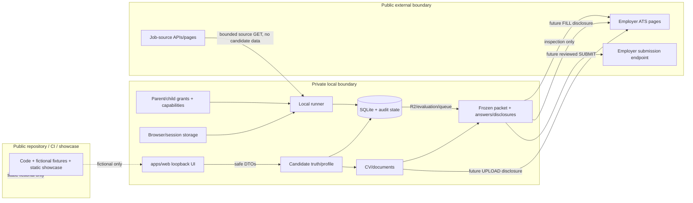

# ApplyPilot Production Verification Project Plan

Last updated: 2026-10-01
Owner: `adeel1608`
Repository: `adeel1608/applypilot`
Expected current main: `6b9948b52923c5de571abf9a1cd454a5b7decf45`
Workflow: `PROJECT_PLAN.md -> one scoped Codex prompt -> execution/evidence -> updated PROJECT_PLAN.md -> technical review -> next prompt`

> This is the active production-readiness checklist. Historical evidence must be preserved separately and never rewritten as current state.

## 1. Resume here

### Current work checkpoint (2026-10-01)

- PR #67 was re-fetched and guarded-squash-merged at `6b9948b52923c5de571abf9a1cd454a5b7decf45` (parent `7643bf9b034f67c321eb5f3b62f74de36a1f8c49`; tree `9f693f3358292dbc75677bf5b20dff56acb0c6d1`). Local `main` was synchronized to the merge before work started.
- The historical nCino v1 run remains STOPPED / PERSISTENCE_FAILED with 0 persisted pages/observations/verifications; its family is v2 REVOKED. No replay, backfill, or source request is allowed. Read-only real state had no canonical `job_sources` row; the exact prior SQL failure is not present in safe durable metadata.
- Active feature branch: `fix/m3-greenhouse-page-persistence`. The provider-neutral source resolver and fictional regressions are implemented. Repository tests pass 44/44; adjacent relevant tests pass 79/79; `npm run release:check:fixture` passes on the final code candidate. No migration changed.
- **Current status:** `PERSISTENCE_FIX_VALIDATED_PR_PENDING`. Only `PROJECT_PLAN.md`, `packages/database/src/source-enablement-repository.ts`, and its tests are changed. Next: exact self-review, one PR, exact-head CI/review gates, guarded merge, runtime proof, and post-fix safety audit. Do not stage nCino v3 or make any live request before that; then stop for fresh human APPROVE/RUN. No target/packet/upload/FILL_PREVIEW/SUBMIT action has occurred in this continuation.

### Previous work checkpoint (2026-09-30; superseded by M3 continuation below)

- PR #63 passed its exact-head guards and was squash-merged as
  `df3db4cad99cb4fbc90251f7282105e3a3010559`; reviewed tree and merged tree are
  `ffdc076bf7301ee0a99902565dfabe7df7bac62c`, with parent
  `a901a80a36212fb50e184ef94d1c91bdf2a2c26f`. The active evidence branch is
  `chore/m2-source-authority-and-next-wave`; only this plan is tracked as modified. Ignored private
  audit/staging helpers and allowlist backups remain untracked and private.
- Lyrebird v1 was approved and run by its human owner; exact receipts and owner binding were verified
  against its existing COMPLETE run `61e3d30f-792f-410f-9f26-a2acc9f17706` (1 request/page, 7
  records). Its exact persisted v2 is now the private allowlist head and is REVOKED /
  OWNER_REVOKED. Membership is exact (7 accepted/qualified records, 7 canonical jobs, 7 new
  observations/versions, 0 broken references). A fresh audit after Kogan found 7 current
  evaluations and 6 current queues before the Kogan cross-source audit; the one stale queue for
  `source-job-b2264c07ebf53a292d4bd5d612dec150` was refreshed through the canonical R2 repository
  as queue v2 `55c7bf7e-3205-4d76-a862-899851b6d0c6`, bound to its existing current evaluation and
  current duplicate-resolution version. Final read-only audit now confirms 7/7 current evaluation
  and queues. All five Melbourne rows have score 0, REVIEW_REQUIRED, and no packet candidate. No
  GET_JOB or packet action occurred.
- Fresh Kogan pre-stage gate passed. Kogan v1 was staged in the ignored private canonical allowlist
  for the owner gate: `m2_source_kogan_df3db4cad99c_1790843296995`, digest
  `eefa2abc0aa8584ae916c9140a36b9cf0bcaf926d9e05d6cfe0929928e1b578e`. It is LEVER / GLOBAL,
  alias `Kogan broader discovery`, host `api.lever.co`, path `/v0/postings/kogan`, LIST_JOBS only;
  limits 4 requests / 150 records / 50 per page / 5,000,000 bytes / 30,000 ms request / 180,000 ms
  run / zero redirects / zero retries / concurrency 1. After the owner’s APPROVE and RUN, exact
  Kogan v1 database row,
  receipts, owner binding, and one completed run were verified. Run
  `90dbd19a-9e60-455a-b487-d3538e22eb64` is COMPLETE / LIST_JOBS with 1 request, 1 page, 20
  records, and zero retries/redirects. Exact persisted Kogan v2 is now REVOKED / OWNER_REVOKED and
  the private allowlist is reconciled to that head; current readiness is SOURCE_DISABLED. The v1
  policy/capability window expires at `2026-10-01T08:28:16.995Z`. Its exact-run audit found 20/20 current
  evaluations and queues, 20 accepted/qualified records, and no packet candidate.
- Post-stage `npm run preflight` passed: schema 12, pending migrations 0, integrity PASS, FK 0,
  valid private profile, 15 configured capabilities / 1 configured active entry, no blockers;
  privacy audit passed. `git diff --check` passed. Current lifetime totals are LIST_JOBS 30
  requests / 17 runs and historical GET_JOB 1 request / 1 run. Pre-stage/post-stage DB checks showed
  source/target authority 0, active receipts 0, RUNNING runs 0, and pending application operations 0. The owner approval subsequently created the exact approved Kogan v1 row and one active APPROVE
  receipt; there is still no START, binding, or run.
- **Current status:** `EVIDENCE_PR_OPEN_CI_RECHECK_PENDING`. Both exact owner-directed runs are
  complete; both new source families are revoked; the private allowlist is reconciled; all 27
  canonical run jobs have current R2 evaluations and queues; and no packet-gate candidate exists.
  The only remaining steps are Part R/S validation and one open, unmerged evidence PR. Do not repeat
  either source action, GET_JOB, navigate to an employer, or create a packet. Personal Live V1 remains
  NOT_READY.

### Completed Shield AI v6 source-authority checkpoint (2026-09-29)

- The long-window v6 Shield AI source-authority task started from synchronized `main` /
  `origin/main` at `7e8534d196cec6b2e62f0bda78e0f7a29312472e`; the plan-only evidence branch is
  `chore/m2-v6-broader-discovery-evidence`. The tree was clean at branch creation. The only planned
  tracked change is this file. No application code, migration, private database, allowlist, backup,
  raw payload, receipt-private field, or candidate-profile value belongs in the evidence PR.
- Before this task, lifetime source/employer/application-operation/final-consent counters were
  `17/9/0/0`, schema 12 had no pending migrations, integrity was PASS, FK issues were 0, no source
  run was active, and no source authority was active. The Shield AI v5 private configuration's exact
  digest was `a2cadcad7d877555d769fae23093078fc587d89c8347e226d79865952f6c15a1`; it was expired,
  with no v5 APPROVE receipt, START receipt, run binding, run, or request. It was reconciled only as
  immutable configuration history through `SourceEnablementRepository.persistCapabilityVersion`.
  Persisted v5 row `bb0fe9e2-e2e3-4353-a986-79de9a076513` retains version 5 / predecessor 4 and the
  exact digest; readiness is `SOURCE_DISABLED / CAPABILITY_EXPIRED`. The ignored pre-v6 allowlist
  backup is `source-allowlist-pre-v6-20260929-70564d68.json.bak`, SHA-256
  `70564d68aee035b7558719f99306f1a03b901852ccd0f3588bc2ade5b15ca6c8`.
- v6 identity: capability `m2_source_shieldai_ace3faba83cf_1790463324757`, version 6 / predecessor
  5; T0 `2026-09-28T23:34:20Z`; digest
  `e67a3da4f6b2047c6aa63d13cac67f8e360e13080463b32ae0beb18d161f34a6`; parser
  `lever-v2:7e8534d196cec6b2e62f0bda78e0f7a29312472e`; policy `m2-live-readiness-v1`; policy and
  capability expiry `2026-09-29T23:34:20.000Z`, a 24-hour window. Configuration
  `approvalState: APPROVED` and approval-reference text are configuration metadata, not proof of a
  human action. Human owner approval was separately completed in the loopback `/sources` form and
  durably recorded as APPROVE receipt `7fdaf702-bd4b-4494-81df-35795bb114df`, state CONSUMED. Its
  exact capability/version/digest/reference/source/tenant/policy binding matched; the nonce action
  was `SOURCE_CAPABILITY_APPROVE`, and loopback/session/nonce/owner confirmation gates were true.
  Before RUN, `canOwnerStart=true`.
- The human owner separately submitted RUN exactly once. START receipt
  `e60a3051-0052-4130-8779-53686199ebf2` is CONSUMED with operation `LIST_JOBS` and nonce action
  `SOURCE_RUN_START`. The single owner binding is keyed by run
  `4c143a7b-b102-4dea-a489-de4327fbe678`, and references that exact APPROVE receipt, START receipt,
  v6 digest, and `LIST_JOBS`. That single v6 run is COMPLETE: 4 requests, 4 pages, 100 provider
  records, 1,462,469 bytes, maximum page 389,634 bytes / 25 records, 0 retries, 0 redirects,
  concurrency 1. All 100 records were accepted and 0 were unusable. This was the only source action
  in the task; LIST_JOBS lifetime delta is +4 and GET_JOB delta is 0. No candidate data was sent.
- After terminal run verification, v7 was created through the canonical immutable
  `SourceEnablementRepository.persistCapabilityVersion` revocation derivation, with predecessor 6,
  `REVOKED`, null approval reference/time, reason `OWNER_REVOKED`, and preserved v6 lineage. V7 row
  `8522969a-8a06-48b7-86b6-076a4f1af46f` digest is
  `5c58e6d2cbdc3f0774a4e6cf61e55637806644e264d1f629c071e86cba3559d7`, revoked at
  `2026-09-28T23:57:02.978Z`. The ignored private allowlist was schema-validated and atomically
  updated to the revoked v7 family version. Latest family is v7 REVOKED; active source authority
  and current start-capable owner receipts are both 0. Preserve all v5/v6 history.
- Correction in section 51 supersedes the initial population interpretation: the v6 run has 100
  qualified canonical jobs, not 25. The 25 new observations/job versions were the v6 processing
  delta; 75 accepted records reused pre-existing observations. All 100 jobs already had exact
  current active-profile evaluations and CURRENT queue decisions, so pending pipeline work was 0. The earlier 25-job candidate table described only the new-observation/pipeline-work subset.
  The all-100 audit still found no deterministic detail candidate. No GET_JOB, employer page,
  application navigation/form action, upload, or submission occurred. Post-run lifetime
  source/employer/application-operation/final-consent counters remain 21/9/0/0; historical total
  GET_JOB requests remain 1, with no task delta. Source-enabled Personal Beta remains READY with
  zero active source authority; Personal Live V1 remains NOT_READY.
- The seven-milestone tracker remains: (1) Foundations COMPLETE; (2) current real role + fresh
  current packet IN PROGRESS / BROADER DISCOVERY; (3) real-target MAP/FILL/UPLOAD/VERIFY ENGINEERING
  / NOT LIVE VERIFIED; (4) final-review/submission safeguards BLOCKED; (5) reproducible release
  COMPLETE; (6) controlled real fill-preview BLOCKED; (7) final readiness / Green-banner review NOT
  STARTED. Do not emit the final green-banner success phrase.
- Acceptance and safety criteria: one terminal bounded owner-bound LIST_JOBS run; no GET_JOB or
  employer/application action; canonical v7 revocation with zero remaining authority; local-only
  analysis; plan-only evidence; one open/unmerged PR; exact-head CI. Rollback is not to rewrite
  immutable capability/receipt/run history; if the evidence PR needs correction, amend only this
  plan and re-run exact-head CI. No code change is expected or authorized by this operational task.

### Historical checkpoint (2026-09-28; superseded)

- This engineering task starts from synchronized `main` / `origin/main` at
  `8acb96a817d9835b205f6cf25fabd9c24ad18e0f` on branch
  `feat/m2-source-owner-action-receipts`. The worktree was clean before this plan update.
- PR #54 remains OPEN / UNMERGED at head `212eb1d4c3928b217ecc76201d5eb8c21c764332`, base
  `8acb96a817d9835b205f6cf25fabd9c24ad18e0f`, tree
  `b5c9ea0bc457f861e1cdefe6993b422db54c4373`. Do not merge it or push to it: its historical plan
  wording overstates durable owner-action provenance. Treat it as SUPERSEDED / UNSAFE TO MERGE AS
  WRITTEN; leave it open for later explicit supersession.
- The prior uncommitted provenance-stop note was found and preserved before restoring its one tracked
  file. Safe copy: `.git/codex-safety/pr54-provenance-stop-20260928.patch`, SHA-256
  `a5e120a14eb41905f4cb0096221c6c38a57f9a821794b197cb0ee54f49c207ff` (7,614 bytes). The note
  contains the provenance stop in `PROJECT_PLAN.md`; no private payload was copied into tracked source.
- Read-only private runtime baseline: schema 11, pending migrations 0, integrity PASS, FK issues 0;
  active source/target capabilities, active source runs, and pending external operations are all 0.
  Lifetime source/employer/form-upload/submission counters are `17/9/0/0`.
- Historical family `m2_source_shieldai_ace3faba83cf_1790463324757` has v3 recorded APPROVED with
  reference `owner.m2-source-discovery.lever_shieldai.v3`, v4 latest and REVOKED, and one completed
  v3 `LIST_JOBS` run `58796b51-f83f-4130-9ee2-6fa65d064d20` (one request/page, 25 records). The old
  runtime did not durably store separate owner approval/start receipts. Those operational records
  remain intact, while explicit human approval/start provenance for v3 is permanently
  `LEGACY_OWNER_PROVENANCE_UNVERIFIED`; no historical receipt or run binding may be backfilled.
- No source/employer request, capability activation, target action, migration, or private database
  write is authorized. The real database must remain at schema 11 throughout this task.

### Historical R46-10 checkpoint (2026-09-23)

- Branch: `chore/p2-current-role-readiness`; PR #46 remains `OPEN / UNMERGED` with title
  `feat: implement verified source-to-packet and non-submit foundations`.
- R46-10 started from exact clean head `e44c662c2593c556d76cdb38d8acafab2b8dfd87` and is now
  committed at exact final head `0f4a8d1612b8f2e161824c4cd7a4f14bbc5f29b1`; exact-head push CI
  `35813500403` and pull-request CI `35813503020` both completed successfully with 47 E2E tests.
  PR #46 remains `OPEN / UNMERGED`; an earlier exact-head run `35812359481` timed out only because
  the expanded decisive test exceeded its old 120-second test timeout and was superseded by the
  bounded termination-proof fix.
- Main/base baseline remains `2b9e44f7633b3fb17a705a799e9b12482d2d1fb7`.
- Private runtime is read-only for this task: schema 9, pending disposable-only `0010`, integrity
  `PASS`, foreign-key issues `0`; disposable schema-10 rehearsals are isolated.
- This R46-08 iteration remains offline-only and adds source/employer/upload/submission
  actions `0/0/0/0`. Historical matrices and handoffs below are not current evidence for this run.
- R46-10 is the active offline-only correction on the same branch and PR. It preserves R46-09's
  immutable packet representation, explicit policy/operation authority, owner-bound claims, and
  killed-worker proof while closing normal invalidation retention, successful-predecessor/canonical
  history validation, resolver linkage, and exact mid-run expiry evidence. The iteration delta remains
  `0/0/0/0`; migrations and the private runtime remain untouched; PR #46 stays open and unmerged.

### Historical baseline (read-only reconciled 2026-09-22)

- Repository `adeel1608/applypilot` is on clean `main` at `2b9e44f7633b3fb17a705a799e9b12482d2d1fb7`; `origin/main` matches.
- PR #45 was approved and squash-merged as `2b9e44f7633b3fb17a705a799e9b12482d2d1fb7`; its merged tree
  equals reviewed head `41c12123fab1a044aec765040cd3eb90aa78aa91` and P1 is now `VERIFIED` against this baseline.
- PR #44 was approved and squash-merged normally. Reviewed head `77dd2cf4b9c10ff9e3f3f2e2535257a692b1ffb5`
  and merged main have the same Git tree; strict commit ancestry is intentionally absent for the squash merge.
- Squash verification rule: expected reviewed head + exact-head CI + approved squash merge + merged parent equal
  pre-merge main + merged tree equal reviewed head tree + approved scope + archive digest preservation.
- PR #42 merged as `467e288959edd6983c5086bbee979aad23e434d8`; PR #43 and PR #45 are merged into the current main baseline.
- Private runtime read-only checks: schema 9, pending migrations 1 (the disposable-only `0010`
  implementation is intentionally not applied), integrity `PASS`, foreign-key issues 0.
- Historical lifetime action counters reconcile to source/employer/upload/submission = `14/9/0/0`; this
  offline implementation iteration adds `0/0/0/0` (no source, employer, upload, or submission actions).
- Active source capability count: 0. Active target capability count: 0. The historical parent grant is unchanged and submit-excluded; the ordinary P2-001 source capability completed its documented create/use/revoke lifecycle, and no active authority remains.
- First real employer target validation is historically proven; the selected role's later inspection is passive evidence only.
- Source-enabled Personal Beta: `READY`. Personal Live V1: `NOT_READY`.
- No final-submit consent has been issued and no real application has been submitted.
- Pre-rebase active-plan blob: `9ad8a46ded3205fee063dae0bbaa3162fd5d905b`; SHA-256 `51BE6553983760CAB1AD8C39F29EC444006F7B5983C7150AE8DB6BCD4B44DC93`; archived losslessly at `docs/project-history/PROJECT_PLAN.before-production-rebaseline.md`.

### Reconciliation result

The earlier statement that only owner facts remained was too broad. Code review proves that the
green-banner operation enum is an authority vocabulary, not a production executor. `RunnerTargetCapabilitySchema`
rejects every `REAL_TARGET` capability whose operations are not exactly `[OPEN_AND_INSPECT_ONLY]`;
`freezeRunnerBinding` and `TargetIndependentApplicationRunner` therefore cannot bind a real application
capability. The runner adapter interface has `open`, `map`, `fill`, and `submit`, but no `upload`,
`verify`, or `fillPreview` entry point, and there is no real-target persistence/audit lifecycle for
those operations. Synthetic tests cover map/fill/one-use synthetic submit and unknown outcomes only.
Consequently real `MAP_FOR_FILL`, `FILL`, `UPLOAD`, `VERIFY`, and `FILL_PREVIEW` are `ENGINEERING` /
`MISSING_VERIFICATION`, not owner-fact blockers.

### Latest selected target evidence

Latest recorded Melbourne target:
`Computer Vision Engineer (C++) (R4633)`

Recorded evidence:

- fact-bound engineering CV generated privately as PDF/DOCX;
- locally validated/approved;
- review-only packet frozen;
- packet reportedly used a legacy evaluation binding;
- passive employer inspection completed;
- 46 controls inventoried;
- 27 unsupported controls;
- 1 document-required control;
- zero candidate values;
- zero writes;
- zero uploads;
- zero submissions.

This proves passive compatibility only, not fill/upload/submission readiness. The packet binds legacy
evaluation `b0110c9e-dc20-41a4-b8a5-51cfd5010dbc`, while the current R2 evaluation is
`a95c2f2f-8175-4602-92c2-667f04a099b5`; the packet is therefore stale for any application operation.
The current CV artifacts remain approved, non-stale, private-only, and bound to the current job/profile:
PDF digest `28e64de248ff757a247ba789baea7692aae92372f3dd6ebac6019a9ad241b0e8` and DOCX digest
`d83d607cf9ae3d9bdadc468660d942d86f14b1394be4c678d5f413406f2139ca`.

### Source accounting reconciliation

Run `0dba8b34-fb59-4cc8-a7ef-c3b97e8d5bbf` is durably `COMPLETE`: 4 requests, 4 pages, 100 provider
records (25 per page), 100 accepted, 0 unusable, 83 newly persisted observations/job versions,
83 current R2 evaluations, and 83 queue decisions. The 17-record difference is not silent loss:
`persistLeverObservation` deterministically returns `created: false` when the observation identity
already exists; the page audit records accepted and persisted counts, while the repository does not
retain a per-record duplicate disposition. The redacted evidence therefore supports exactly
`100 accepted = 83 created + 17 deterministic duplicate/no-op dispositions`, but cannot identify those
17 records individually without the discarded provider payload. No rejected/unusable records are
present in this run, and replay remained idempotent.

### Candidate evidence correction

The private profile contains verified C++, OpenCV/stereo-vision and related robotics skills, verified
engineering education/employment/certification/licence evidence, and verified restricted Australian
work-right evidence. The selected role is still `REVIEW_REQUIRED` because provider
evidence is incomplete: `datePosted`/expiry is absent, extracted requirements are empty, and job-level
work-rights, vehicle, hours, schedule, licence/certification and extraction-coverage dimensions remain
unknown. These are not equivalent to missing candidate experience or skills; classify them as
`PROVIDER_EVIDENCE`/`MISSING_VERIFICATION` unless a later owner fact is genuinely required by a concrete
form question.

## 2. Final production objective

ApplyPilot must support a safe, reproducible, single-owner production workflow:

`discover -> normalize -> deduplicate -> evaluate -> shortlist -> generate/freeze documents -> inspect -> map -> fill -> upload -> human review -> fresh submit consent -> submit once -> track outcome`

### Green banner

`# 🟢 **WE ARE READY**`

means:

- ready for the first supervised real submission;
- suitable current role selected;
- candidate facts supported;
- current CV and packets frozen;
- actual target inspected;
- real map/fill/upload verified;
- filled preview reviewed;
- exact submit control identified;
- one-use consent mechanism verified;
- no unresolved material blocker.

It does NOT mean an application has already been submitted.

### Permanent safety boundaries

- Unknown facts remain unknown.
- Never infer citizenship, visa/work rights, sponsorship, clearance, experience, education, certifications, licences, availability, or other material application facts.
- Never bypass CAPTCHA, MFA, authentication, bot controls, rate limits, access controls, or website restrictions.
- No blind retry after ambiguous submission.
- Final submit always requires fresh one-use owner consent.
- Private profile, documents, DB, cookies, sessions, secrets, and live payloads remain local/ignored.
- Public showcase is not operational production.

## 3. Working agreement

For every future Codex iteration:

1. Read `AGENTS.md`, this plan, and relevant history.
2. Verify branch, HEAD, origin/main, worktree, DB/schema compatibility, and dependencies.
3. Select only the authorized task.
4. Update the task blueprint before application/runtime code changes.
5. Implement only within scope.
6. Run acceptance checks.
7. Record evidence, failures, blockers, and decisions.
8. Update current state and next dependency.
9. Return the updated plan and handoff.
10. Wait for review where required.

### Status values

`NOT_STARTED`, `IN_PROGRESS`, `IMPLEMENTED_UNVERIFIED`, `BLOCKED`, `VERIFIED`, `DEFERRED`, `NOT_APPLICABLE`

### Evidence values

`REPORTED`, `CODE_REVIEWED`, `SYNTHETICALLY_VERIFIED`, `LOCAL_RUNTIME_VERIFIED`, `LIVE_VERIFIED`, `DEPLOYMENT_VERIFIED`

Every verified task must record revision, environment, command/observation, timestamp, result, evidence location, and invalidation conditions.

## 4. Verified-state ledger

### BASE-001 — Repository baseline

Status: `VERIFIED`
Owner: Codex

Checklist:

- [x] Verify local HEAD, `origin/main`, and clean worktree.
- [x] Verify PR #42/#43 ancestry and merge commits.
- [x] Record current draft blob/hash and archive it losslessly.
- [x] No repository file named `PROJECT_PLAN(7).md` was supplied or present; comparison is `NOT_AVAILABLE`, not assumed equal.
- [x] Preserve unresolved historical work in the archive.

Acceptance: one non-contradictory baseline.

### BASE-002 — Private runtime baseline

Status: `VERIFIED`
Depends on: `BASE-001`

Read-only checks:

- [x] schema version 9, pending migrations 0, integrity `PASS`, foreign keys 0;
- [x] migrations `0000`-`0008` unchanged and `0009` additive;
- [x] parent/child ledger, active authority counts, and historical action counters;
- [x] selected role, current profile/evaluation/document/packet bindings, and inspection evidence.

Acceptance: safe current-state summary with no private values printed.

### BASE-003 — Source accounting

Status: `VERIFIED`
Depends on: `BASE-002`

Latest recorded run:

- 4 requests;
- 4 pages;
- 100 provider records;
- 100 accepted;
- 83 persisted/evaluated/queued.

Checklist:

- [x] Account for all 100 records and four 25-record pages.
- [x] Explain the 17-record difference as deterministic duplicate/no-op dispositions; individual identities are not retained.
- [x] Confirm zero unusable/rejected records in this run and no silent persistence failure.
- [x] Verify current R2/evaluation/queue counts are 83/83/83 and replay is idempotent.

Acceptance: every provider record has a deterministic disposition.

## 5. Architecture and trust boundaries

Document actual ownership for:

- `apps/web`;
- `apps/showcase`;
- candidate profile/truth store;
- job sources;
- importer;
- R2 normalization/evidence;
- eligibility/fit;
- duplicate/queue/corrections;
- documents;
- application runner;
- tracker;
- database;
- green-banner parent/child authority.

### Parent grant

Current operation ceiling includes:

- `SOURCE_LIST_JOBS`
- `OPEN_AND_INSPECT_ONLY`
- `MAP_FOR_FILL`
- `FILL`
- `UPLOAD`
- `VERIFY`
- `FILL_PREVIEW`

`SUBMIT` remains excluded.

Audit:

- [x] parent persistence/digest;
- [x] child derivation/scope;
- [x] child expiry/replay;
- [x] code SHA binding (the persisted parent is bound to the pre-merge implementation SHA; no child was created after the merge);
- [x] parent submit exclusion and terminal child evidence;
- [x] source-run restart/replay evidence;
- [ ] cumulative cross-run action budget (not implemented; `ENGINEERING`).

### Runner authority

Audit result (revision `010cbe909b7d7b2b4ed88c413f270f7ff1ff75ac`, code reviewed 2026-09-22):

| Operation               | Authority enforcement                           | Adapter/runtime entry point                                               | Packet binding                  | Persistence/audit                           | Verification/tests            | Current evidence       |
| ----------------------- | ----------------------------------------------- | ------------------------------------------------------------------------- | ------------------------------- | ------------------------------------------- | ----------------------------- | ---------------------- |
| `OPEN_AND_INSPECT_ONLY` | `REAL_TARGET` schema + inspection identity      | Lever passive inspection adapter + `TargetInspectionRunner`               | `FrozenInspectionBinding`       | `runner_inspection_bindings` + audit events | live validated; synthetic/E2E | `LIVE_VERIFIED`        |
| `MAP_FOR_FILL`          | enum/parent only; real target schema rejects it | no real adapter; synthetic `TargetIndependentApplicationRunner.map` only  | synthetic `FrozenRunnerBinding` | no real operation lifecycle                 | unit synthetic only           | `ENGINEERING`          |
| `FILL`                  | enum/parent only; real target schema rejects it | no real adapter; synthetic `TargetIndependentApplicationRunner.fill` only | synthetic binding only          | no real operation lifecycle                 | unit synthetic only           | `ENGINEERING`          |
| `UPLOAD`                | enum/parent only; real target schema rejects it | no `upload` adapter method                                                | none                            | none                                        | no upload-stage test          | `MISSING_VERIFICATION` |
| `VERIFY`                | parent enum only                                | no runner method or adapter method                                        | none                            | none                                        | none                          | `MISSING_VERIFICATION` |
| `FILL_PREVIEW`          | parent enum only                                | no runner method or adapter method                                        | none                            | none                                        | none                          | `MISSING_VERIFICATION` |

The existing synthetic runner does have a frozen binding, protection stops, document digest check,
one-use synthetic consent, and `OUTCOME_UNKNOWN` behavior. Those proofs do not establish a production
real-target operation path. The next engineering task must address this gap before any owner-fact
question can be treated as the sole blocker.

## 6. Environment/configuration/secrets

### ENV-001 — Supported host

Verify:

- Windows/PowerShell;
- Node/npm;
- native SQLite;
- Playwright Chromium;
- filesystem permissions;
- loopback ports;
- timezone/DST;
- sleep/reboot;
- disk space;
- process concurrency.

### ENV-002 — Configuration inventory

Create:
`variable | purpose | environment | default | secret? | owner | validation | rotation/recovery`

Never record secret values.

### ENV-003 — Secrets

Verify:

- ignored env files;
- no credentials in Git/history;
- no secrets in CI artifacts;
- cookies/browser state local only;
- documented provisioning, rotation, revocation, leak response.

## 7. Dependency-ordered implementation plan

### P0 — Baseline reconciliation and plan rebase

Status: `VERIFIED`

- [x] Archive old plan at `docs/project-history/PROJECT_PLAN.before-production-rebaseline.md`.
- [x] Record source commit/blob/hash.
- [x] Replace stale front-page state.
- [x] Add stable task IDs.
- [x] Add old-to-new crosswalk.
- [x] Separate reported vs verified evidence.
- [x] Open documentation-only PR #44; exact-head CI passed, review approved, and squash merge recorded
      at `3cc75dfd3dcaf35f09b857ab5c42a52d923bc1fc` (https://github.com/adeel1608/applypilot/pull/44).

#### P0-004 — Historical archive formatting-policy closure

Status: `VERIFIED`
Owner: Codex
Depends on: P0 baseline archive and exact-head repository CI
Objective: preserve the byte-identical historical snapshot while allowing repository-wide formatting
checks to cover all active files.
Root cause: `prettier --check .` correctly rejected the immutable historical snapshot even though
the active plan was formatted. Formatting, editing, regenerating, or line-ending-normalizing the
archive would destroy its evidence value.
Authorized change: add exactly this `.prettierignore` entry and no broader pattern:
`docs/project-history/PROJECT_PLAN.before-production-rebaseline.md`
Acceptance: archive Git blob remains `9ad8a46ded3205fee063dae0bbaa3162fd5d905b` and SHA-256 remains
`51BE6553983760CAB1AD8C39F29EC444006F7B5983C7150AE8DB6BCD4B44DC93`; active `PROJECT_PLAN.md`
continues to pass normal Prettier checks; exact-head GitHub CI is the final external P0 gate.
Local verification: archive hash/blob checked before and after; active-plan formatting, privacy,
diff, and fsck checks run.
Evidence: exact-head GitHub Actions quality passed at reviewed head `77dd2cf4b9c10ff9e3f3f2e2535257a692b1ffb5`
(runs `35681958007` and `35681961078`); PR #44 was accepted and squash-merged as
`3cc75dfd3dcaf35f09b857ab5c42a52d923bc1fc`. Archive blob/SHA are preserved on merged main.
Failure/recovery: if the archive hash changes, stop and restore it from the committed PR state;
if CI fails for another reason, investigate only that exact failure and stop before unrelated fixes.
Invalidation: any archive content change or base/head drift invalidates this record.

Exit: one consistent active plan.

### P1 — Production scope and architecture verification

Status: `VERIFIED`

Evidence: architecture work and local/code evidence were accepted on PR #45; exact-head CI passed,
the reviewed tree equals the squash-merged tree, and merged main is
`2b9e44f7633b3fb17a705a799e9b12482d2d1fb7`. This verifies architecture only; it does not make P2/P3/P4
or Personal Live V1 ready.

- [x] Component capability matrix (read-only code review).
- [x] End-to-end data-flow map (source/R2/document/packet/runner boundaries recorded).
- [x] Private app vs showcase boundary.
- [x] Real `MAP_FOR_FILL/FILL/UPLOAD/VERIFY/FILL_PREVIEW` architecture audit.
- [x] Parent/child authority enforcement audit.
- [x] Runner target capability enforcement audit.
- [x] Deployment topology decision: `LOCAL_SINGLE_OWNER_V1`.
- [x] Trust-boundary review of current local-first implementation.

Exit: explicit implemented-vs-proposed capability map.

#### P1-001 execution blueprint and evidence

Objective: document the narrowest supported Personal Live V1 architecture, ownership, trust
boundaries, authority limits, and future P4 design inputs without changing runtime behavior.

Scope/components: `apps/web`, `apps/showcase`, candidate profile/runtime, source readers and
transport, source/R2 repositories, eligibility/fit, documents/packets, target inspection and
synthetic runner, tracker/outcomes, SQLite/migrations, backup/restore, and browser/private roots.

Steps completed: inspect merged code and existing architecture/security/runbook docs; trace data and
authority flow; classify each capability as implemented, synthetic-only, locally verified, live
verified, engineering, or missing verification; select `LOCAL_SINGLE_OWNER_V1`; record failure
ownership and P2/P3/P4 dependencies; run non-mutating checks.

Acceptance: component and capability matrices complete; private/public boundary explicit; parent/child
authority and real-target restriction documented; failure model assigned; topology selected; no P1
unknown remains that would force P4 to guess. No source/employer/runtime action or database mutation
was performed.

Rollback: documentation-only branch; revert the P1 documentation commit before review if evidence is
incorrect. No runtime rollback or migration is applicable.

Invalidation: code, migration, authority, deployment, or trust-boundary changes invalidate this
P1 evidence and require a new architecture review.

#### P1-002 execution blueprint and evidence

Objective: correct active-plan release-marker wording and phase-status semantics without changing the
architecture evidence, runtime behavior, authority, data, migrations, tests, workflow, or dependencies.

Required corrections: restore the exact green-banner phrase at both active-plan definition/emission
locations; keep overall P1 `IMPLEMENTED_UNVERIFIED` until PR #45 is reviewed, merged, and its merged
tree is verified; keep overall P5 blocked by P4 while preserving its verified synthetic safety evidence
as `P5-SYN-001`.

Scope: `PROJECT_PLAN.md` only. The immutable historical archive remains untouched. No source,
employer, browser, document, packet, database, capability, grant, candidate-profile, deployment, or
application action is permitted.

Acceptance: zero obsolete placeholder-marker occurrences; exact phrase appears in both intended
active-plan locations; P1 is `IMPLEMENTED_UNVERIFIED`; P5 is `BLOCKED`; `P5-SYN-001` is `VERIFIED`;
P4 remains `BLOCKED`; Personal Live V1 remains `NOT_READY`; exact-head CI independently passes.

Rollback: revert this documentation-only commit on `docs/p1-production-architecture`; no runtime
rollback or migration is applicable. Invalidation: any runtime/architecture change or merged-main
drift requires a fresh P1 review.

### P1 production topology decision

Selected topology: `LOCAL_SINGLE_OWNER_V1` on an owner-controlled Windows host.

```text
OWNER WINDOWS HOST (private, loopback-first)
├── apps/web — private operational UI, loopback/local access
├── local Node/TypeScript runner — scoped source and target orchestration
│   └── Playwright Chromium only when an approved browser capability requires it
├── local SQLite — profile versions, jobs/evidence, R2, queue, grants, capabilities, audits
├── data/private — profile, generated documents, packets, reports, backups, browser/session state
└── local recovery storage — verified SQLite-safe backups and restore runbook

SEPARATE PUBLIC SYSTEM
└── apps/showcase — static fictional demo only; no private DB/profile/session/authority/network
```

Personal Live V1 requires no hosted database, cloud browser, remote worker, multi-tenancy,
multi-user authentication, SaaS queue, Kubernetes, Redis, cloud document storage, or paid AI API.
The local runner is the only place permitted to hold private candidate data, authenticated state, or
future employer interaction. External actions remain default-deny and require operation-scoped,
short-lived authority. `apps/showcase` is not Personal Live V1 and cannot trigger actions.

### P1 component ownership and maturity matrix

| Component / path                                                                            | Responsibility; inputs → outputs; state                                                   | Trust / side effects / authority                                                              | Maturity and remaining work                                                                          |
| ------------------------------------------------------------------------------------------- | ----------------------------------------------------------------------------------------- | --------------------------------------------------------------------------------------------- | ---------------------------------------------------------------------------------------------------- |
| `packages/candidate-profile`, `apps/web/lib/candidate-profile-provider.ts`                  | Zod profile truth store; private/demo resolution → verified facts/status DTO              | Private local boundary; no network; profile context gate prevents demo facts for real imports | `LOCAL_RUNTIME_VERIFIED`; owner facts remain P2-scoped                                               |
| `packages/job-model`                                                                        | Canonical job, source, eligibility, application enums → typed domain objects              | Untrusted boundary after schema validation; no side effect                                    | `LOCAL_RUNTIME_VERIFIED`; provider freshness remains P2                                              |
| `packages/job-sources/src/source-capability.ts`, `private-allowlist.ts`                     | Source capability schema/digest/readiness → approved source scope                         | Private authority; no call by itself; exact host/path/operation/budget/expiry                 | `LOCAL_RUNTIME_VERIFIED`; cumulative cross-run budget remains engineering                            |
| `packages/job-sources/src/secure-source-transport.ts`, `source-runner.ts`, Lever readers    | Approved source capability → bounded HTTPS requests, inert records, stop diagnostics      | Public source boundary; GET only through capability, HTTPS/SSRF/query/redirect/retry guards   | `LIVE_VERIFIED` for bounded Lever list evidence; no new live action in P1                            |
| `apps/web/lib/source-workspace.ts`, `packages/database/src/source-enablement-repository.ts` | Owner source view/orchestration; runs/pages/observations/audits → R2 handoff              | Private UI + DB; capability currentness checked before pages and completion                   | `LOCAL_RUNTIME_VERIFIED`/bounded beta live evidence; restart per-record audit gap is P3              |
| `packages/job-importer`                                                                     | User-supplied content, inert HTML/text, URL policy → validated import batches             | Private import boundary; no source fetch; explicit confirmation before canonical writes       | `LOCAL_RUNTIME_VERIFIED`; no architecture gap for P1                                                 |
| `packages/job-normalizer`, source observation tables                                        | Raw source record → normalized job version, conservative identity/dedup candidates        | Untrusted data becomes immutable provenance; no external side effect                          | `LOCAL_RUNTIME_VERIFIED`; changed/duplicate/restart tests remain P3                                  |
| `packages/eligibility-engine`, `packages/fit-scorer`                                        | Current profile + evidence/job → eligibility, fit, explanations, coverage                 | Deterministic local computation; unknown stays review; no external side effect                | `LOCAL_RUNTIME_VERIFIED`; calibration remains uncalibrated and P2/P3 evidence-gated                  |
| `packages/database/src/r2-repository.ts`, `r2a-repository.ts`                               | Immutable evidence/evaluation/queue/correction records → currentness and audit events     | Private SQLite; transactions/FKs and stale invalidation; no network                           | `LOCAL_RUNTIME_VERIFIED`; current packet/evaluation alignment remains P2                             |
| `packages/resume-engine`, `cover-letter-engine`, `apps/web/lib/private-document.ts`         | Verified profile/job → private PDF/DOCX artifacts and digests                             | Private filesystem; no outbound transfer; approval binds content digest                       | `LOCAL_RUNTIME_VERIFIED`; regeneration remains P2-gated                                              |
| `packages/database/src/beta-repository.ts` packet functions                                 | Current job/profile/evaluation/docs/answers → frozen packet/readiness                     | Private DB; rejects stale versions and invalidates on material changes                        | `LOCAL_RUNTIME_VERIFIED` synthetic/private; selected packet is stale for application operations (P2) |
| `packages/application-runner/src/inspection-runner.ts`, `lever-inspection-adapter.ts`       | Frozen packet + real inspection capability → passive DOM field inventory                  | Employer boundary; one navigation/evaluation, zero writes/data; target capability required    | `LIVE_VERIFIED` for inspection history; no mutation API                                              |
| `packages/application-runner/src/target-runner.ts`                                          | Target capability schema; synthetic packet binding/map/fill/consent/outcome → checkpoints | Real target schema permits only `OPEN_AND_INSPECT_ONLY`; synthetic adapter is loopback        | Inspection `LIVE_VERIFIED`; real MAP/FILL `ENGINEERING`, real UPLOAD/VERIFY/PREVIEW missing          |
| `apps/web/lib/runner-workspace.ts`, `runner-enablement-repository.ts`                       | Private target proposal/allowlist, capability persistence, inspection/recovery views      | Private authority + DB; digest/packet/currentness checks; no automatic approval               | `LOCAL_RUNTIME_VERIFIED` for inspection; future P4 lifecycle required                                |
| `packages/application-runner/src/green-banner-grant.ts`, green-banner repository            | Parent grant digest/scope → source/target child capabilities and terminal events          | Private authority; child TTL, scope, main SHA, packet/document bindings; SUBMIT excluded      | `LOCAL_RUNTIME_VERIFIED`; cumulative cross-run budget unresolved                                     |
| `packages/application-tracker` and `application_events`                                     | Validated lifecycle events → append-only timeline/outcome projection                      | Private DB; no network; ambiguous outcome modeled                                             | `LOCAL_RUNTIME_VERIFIED` synthetic; real operation events await P4/P7                                |
| `packages/database/src/schema.ts`, migrations `0000`–`0009`                                 | SQLite schema, FKs, immutable migration history → durable local state                     | Private local boundary; no auto-migrate in production                                         | `LOCAL_RUNTIME_VERIFIED`; backup/restore rehearsal is P11                                            |
| `scripts/backup.ts`, `scripts/restore.ts`, database maintenance                             | SQLite-safe backup manifest/preview/confirmed restore → recovery state                    | Private filesystem; restore requires explicit confirmation and recovery backup                | `IMPLEMENTED_UNVERIFIED`; operational rehearsal deferred P11                                         |
| `apps/web`                                                                                  | Loopback operational UI/server actions; safe DTOs → local views/mutations                 | Loopback Host/Origin/session/nonce gate; private profile server-only                          | `LOCAL_RUNTIME_VERIFIED`; deployment topology selected, no hosted exposure                           |
| `apps/showcase`, `scripts/audit-public-showcase.ts`                                         | Static fictional pages/assets → public demo export                                        | Public boundary; audit rejects private imports, DB/fs/network/server actions                  | `LOCAL_RUNTIME_VERIFIED`; independently deployable, never operational                                |
| Playwright/browser lifecycle (`start-e2e-server.ts`, inspection adapter)                    | Synthetic server or approved inspection session → bounded browser observations            | Browser/session private; protection/auth/CAPTCHA/MFA stop; no bypass                          | Synthetic + inspection live evidence; real mutation lifecycle is P4                                  |
| Private filesystem roots (`scripts/lib/runtime-safety.ts`, ignored `data/private`)          | Profile, DB, documents, packets, backups, sessions → local artifacts                      | Outside Git/CI; secrets/cookies never logged or committed                                     | `LOCAL_RUNTIME_VERIFIED`; permissions/recovery thresholds remain P6/P11                              |

### P1 capability matrix

| Operation                       | Exists / evidence                                                                  | Authority, persistence, adapter                                                         | Personal Live V1 status                                             |
| ------------------------------- | ---------------------------------------------------------------------------------- | --------------------------------------------------------------------------------------- | ------------------------------------------------------------------- |
| `DISCOVER` / `SOURCE_LIST_JOBS` | Lever source runner and source UI; bounded live run evidence                       | SourceCapabilityV2 + private allowlist + source pages/observations/audits; Lever reader | `READY_BOUNDED_PERSONAL_BETA`, not unattended                       |
| `NORMALIZE`                     | Source/import normalizers and immutable job versions; local/live source evidence   | Schema boundary and source repository; no external side effect                          | `LOCAL_RUNTIME_VERIFIED`                                            |
| `EVALUATE`                      | R2 eligibility/fit/evidence engines and persisted evaluations                      | Current private profile/evidence; R2 audit; no external side effect                     | `LOCAL_RUNTIME_VERIFIED`, calibration not production-calibrated     |
| `QUEUE`                         | Queue decisions and PREPARING currentness gates                                    | R2 repository + audit; no external side effect                                          | `LOCAL_RUNTIME_VERIFIED`                                            |
| `DOCUMENT_GENERATE`             | Resume/cover-letter engines and private artifact digests                           | Private filesystem and profile provenance; no authority/network                         | `LOCAL_RUNTIME_VERIFIED`                                            |
| `PACKET_FREEZE`                 | ApplicationPacket schema/repository, digest/currentness/readiness                  | Private DB, document approvals, current job/profile/evaluation bindings                 | `LOCAL_RUNTIME_VERIFIED`; selected packet stale for application use |
| `OPEN_AND_INSPECT_ONLY`         | TargetInspectionRunner + Lever passive adapter; real inspection history            | REAL_TARGET capability, FrozenInspectionBinding, inspection persistence/audits          | `LIVE_VERIFIED` for bounded inspection only                         |
| `MAP_FOR_FILL`                  | Synthetic `TargetIndependentApplicationRunner.map`; real capability schema rejects | Synthetic binding only; no real lifecycle persistence                                   | `ENGINEERING`                                                       |
| `FILL`                          | Synthetic runner fill path; real capability schema rejects                         | Synthetic binding only; disclosure boundary not real-enabled                            | `ENGINEERING`                                                       |
| `UPLOAD`                        | Parent enum and synthetic document checks only; no adapter method                  | No real runtime/persistence path                                                        | `MISSING_VERIFICATION`                                              |
| `VERIFY`                        | Parent vocabulary only; no runner/adapter method                                   | No real runtime/persistence path                                                        | `MISSING_VERIFICATION`                                              |
| `FILL_PREVIEW`                  | Parent vocabulary only; no runner/adapter method                                   | No real runtime/persistence path                                                        | `MISSING_VERIFICATION`                                              |
| `FINAL_REVIEW`                  | Synthetic `readyForFinalReview` checkpoint                                         | Frozen synthetic binding and packet readiness                                           | `SYNTHETICALLY_VERIFIED`, real preview absent                       |
| `SUBMIT_CONSENT`                | Synthetic one-use final consent and concurrent-use tests                           | Binding digest/token/expiry/used state; parent grant excludes SUBMIT                    | `SYNTHETICALLY_VERIFIED`, real submit unavailable                   |
| `SUBMIT`                        | Synthetic adapter outcome model only; no real-target capability                    | Real schema rejects application scope; ambiguous result becomes `OUTCOME_UNKNOWN`       | `DISABLED_REAL`                                                     |
| `OUTCOME_TRACKING`              | Application tracker and append-only events                                         | Private SQLite; no external side effect                                                 | `LOCAL_RUNTIME_VERIFIED` model, real action evidence absent         |

Implemented is not production-ready: only bounded source ingestion and passive inspection have live
evidence; real application mutation remains blocked.

### P1 trust-boundary and data-flow model


```mermaid
flowchart LR
  subgraph PRIVATE[Private local boundary]
    PROFILE[Candidate truth/profile]
    DB[(SQLite + audit state)]
    DOCS[CV/documents]
    PACKET[Frozen packet + answers/disclosures]
    AUTH[Parent/child grants + capabilities]
    SESSION[Browser/session storage]
    WEB[apps/web loopback UI]
    RUNNER[Local runner]
  end
  subgraph PUBLIC[Public external boundary]
    SOURCE[Job-source APIs/pages]
    ATS[Employer ATS pages]
    SUBMIT[Employer submission endpoint]
  end
  subgraph REPO[Public repository / CI / showcase]
    CODE[Code + fictional fixtures + static showcase]
  end
  WEB -->|safe DTOs| PROFILE
  PROFILE --> DB
  SOURCE -->|bounded source GET, no candidate data| RUNNER
  RUNNER --> DB
  DB -->|R2/evaluation/queue| PACKET
  PROFILE --> DOCS
  DOCS --> PACKET
  AUTH --> RUNNER
  PACKET -->|inspection only| ATS
  PACKET -->|future FILL disclosure| ATS
  DOCS -->|future UPLOAD disclosure| ATS
  PACKET -->|future reviewed SUBMIT| SUBMIT
  SESSION --> RUNNER
  CODE -. fictional only .-> WEB
  CODE -. static fictional only .-> REPO
```

Candidate data first crosses the private boundary at target `FILL` (answers), `UPLOAD` (documents),
or `SUBMIT`; all three are disclosure operations, and FILL/UPLOAD require their own authority and
auditable verification even though they precede final submission. Source discovery sends no candidate
data. The showcase never receives profile, DB, session, grant, or runner authority.

### P1 parent/child authority findings

- Parent `GREEN_BANNER_SESSION_GRANT_V1` is persisted with canonical digest, immutable scope,
  `mainSha`, and submit excluded from its operation vocabulary.
- Child derivation persists deterministic child digest and parent digest; source children require
  provider/tenant/host/path and `SOURCE_LIST_JOBS`; target children require origin/path/packet.
- `assertGreenBannerChildWithinParent` enforces parent scope, operation ceiling, main SHA equality,
  expiry, and maximum child TTL. Packet binding is mandatory for MAP/FILL/FILL_PREVIEW/VERIFY; packet
  plus document digest is mandatory for UPLOAD.
- Database repositories persist parent/child events, reject duplicate digests, reject inactive or
  mismatched parents, and expose active-child/recovery state. Target/source repositories separately
  recheck current capability digest/version before execution.
- Target inspection has its own immutable binding and lifecycle/audit tables. Real application
  operations remain rejected by `RunnerTargetCapabilitySchema`; parent vocabulary alone is not an
  executor.
- Restart semantics are durable for source runs and inspection/recovery checkpoints. A cumulative
  cross-run action budget is not implemented and remains engineering work.

### P1 external-boundary failure ownership

| Failure / signal                                                         | Required behavior now                                                                    | Owning future phase |
| ------------------------------------------------------------------------ | ---------------------------------------------------------------------------------------- | ------------------- |
| Network timeout, DNS/TLS/connection failure                              | bounded stop with safe code and lifecycle stage; no blind retry beyond capability budget | P3/P6               |
| Redirect, destination drift, SSRF/host/path/query mismatch               | reject/stop before or at transport; never mutate approved semantics                      | P3/P4               |
| Popup/new window or browser context loss                                 | inspection/runner stop with diagnostic; no unmanaged navigation                          | P4/P7               |
| Form/schema drift or unsupported control                                 | fail closed, retain safe diagnostic only, require review                                 | P4/P7               |
| Browser/process crash or partial write                                   | durable checkpoint/recovery; reconcile authority before resume                           | P6/P11              |
| Stale packet/form/document/profile/evaluation                            | reject binding and invalidate dependent state; regenerate only after gates               | P2/P4               |
| Expired/revoked/changed capability or duplicate invocation               | reject currentness check; consume/revoke terminal child; no replay                       | P4/P7               |
| CAPTCHA, MFA, authentication, bot protection, rate limit, access control | stop immediately; no bypass, retry, or credential action                                 | P4/P7               |
| Ambiguous submission/lost response                                       | terminal `OUTCOME_UNKNOWN`; never blind retry                                            | P5/P10              |

### P1 deployment and security requirements

`LOCAL_SINGLE_OWNER_V1` uses an owner-controlled Windows host, pinned Node/npm and Playwright where
needed, local SQLite, ignored private document/browser roots, verified local backups, loopback-first
web access, and no public private-dashboard exposure. Source requests require source authority;
employer actions require target/application authority. The public showcase is separately static and
fictional.

P4/P6/P9 must preserve: least-privilege filesystem access; private data outside Git; secrets outside
Git; no cookies/raw candidate values in generic telemetry; operation-specific short-lived authorities;
fail-closed stale/changed bindings; immutable/auditable external-action history; no SUBMIT under the
parent grant; no protection bypass; `OUTCOME_UNKNOWN` for ambiguity; and no blind retry.

### P1 exit and dependency review

P1 architecture work is complete and `VERIFIED` against merged main
`2b9e44f7633b3fb17a705a799e9b12482d2d1fb7`: component/capability/data-flow matrices, private/public
boundary, parent/child authority path, real-runner limitation, topology, trust model, and
implemented-vs-proposed distinction are explicit. P1 does not complete P2, P3, P4, Personal Live V1,
or the green banner.

Next dependency order (read-only decision, not execution): P2 provider freshness/current role and
packet evidence must be resolved before P4; P3 restart/replay, changed/duplicate handling, and
staleness propagation must be verified before P4. Therefore the next implementation task is P2, not
P4. P4 remains blocked by BLK-001, BLK-002, BLK-004, BLK-005, BLK-007, and BLK-008.

#### P2-001 execution blueprint and evidence

Objective: verify the selected Melbourne role against one owner-authorized, bounded public-provider
freshness operation; preserve truthful unknowns; refresh R2 and packet bindings only when currentness
gates pass; otherwise reject/defer the role with a precise blocker.

Starting state: merged main `2b9e44f7633b3fb17a705a799e9b12482d2d1fb7`; selected role
`Computer Vision Engineer (C++) (R4633)`; old packet evaluation binding is stale and historical only.

Allowed boundary: existing safe Lever transport, exact Shield AI tenant/host/path, HTTPS GET-only,
no login/cookies/candidate data, concurrency 1, no redirect, smallest practical request budget, no
employer/browser interaction. The standing parent grant must remain immutable; its `mainSha` must match
the current main before any child derivation. If it does not, use only the normal ordinary
`SourceCapabilityV2` owner-approval path or record a blocker; never bypass the check.

Evidence rules: provider date/expiry absent means `CURRENTLY_OBSERVED`, not `EXPIRY_VERIFIED`; missing
extraction is `PROVIDER_REQUIREMENT_UNKNOWN`, not an owner-fact gap; restricted work-right evidence is
not unrestricted work rights; unknown candidate facts remain `REVIEW_REQUIRED`.

Steps: inspect private evidence and current authority; perform at most the exact bounded provider
freshness request(s) required; persist any changed observation/job version immutably; run current R2;
check document digests/currentness; reject the legacy packet; freeze a new private packet only if every
prerequisite is current; otherwise record `PACKET_REFRESH_BLOCKED`; classify retained unsupported
controls without revisiting the employer; run non-destructive privacy/currentness checks.

Acceptance: either a fresh internally consistent private packet bound to current job/profile/evaluation/
documents, or a precise `NOT_CURRENT / RESELECT_REQUIRED` or `PACKET_REFRESH_BLOCKED` outcome with the
exact remaining dependency. No P3/P4 work, migration, code fix, employer action, or application action.

Rollback: source capability/run terminalization and immutable historical evidence; no runtime rollback
or migration. Invalidation: provider drift, profile/evaluation/document change, stale packet binding,
or main-SHA mismatch requires re-evaluation.

### P2 — Candidate, role, and evidence readiness

Status: `IMPLEMENTED_UNVERIFIED`

- [x] Inventory existing candidate evidence before asking owner.
- [x] Classify verified/stale/conflicting/unknown facts.
- [x] Verify work-right evidence and temporal bounds.
- [x] Verify selected-role suitability against available provider evidence.
- [x] Keep Shield AI London validation role excluded.
- [x] Verify provider presence/currentness via one bounded Shield AI Lever LIST_JOBS run; provider supplied no
      temporal date/expiry, so role state remains `CURRENTLY_OBSERVED`, not `EXPIRY_VERIFIED`.
- [x] Verify current R2/evaluation/duplicate/queue state.
- [x] Verify engineering CV provenance, digests, approval, currentness.
- [x] Classify each unsupported form control at the available evidence level.
- [x] No owner questionnaire at P2: missing requirements/eligibility fields remain provider or candidate
      `UNKNOWN` and are not converted into owner assertions.

Exit: evidence-backed suitable role and current packet, or precise blocker register. This execution is the
blocker path: the role was observed in the fresh page, but `JOB_EXPIRY_UNKNOWN` and the stale packet
evaluation binding prevent a new application packet.

#### P2-001 validation record (2026-09-22)

- Starting main: `2b9e44f7633b3fb17a705a799e9b12482d2d1fb7`; branch:
  `chore/p2-current-role-readiness`.
- Parent compatibility: the immutable `GREEN_BANNER_SESSION_GRANT_V1` remains bound to main SHA
  `227df70175f6beed75e4812fa0aee6668216de2f`, so no child was derived and the parent was not mutated.
  The ordinary `SourceCapabilityV2` path was used instead.
- Capability: `lever_p2_r4633_20260922` v1, `LEVER/shieldai/GLOBAL`, host `api.lever.co`, path
  `/v0/postings/shieldai`, `LIST_JOBS` only, parser `lever-v2:2b9e44f7633b3fb17a705a799e9b12482d2d1fb7`,
  one request/25-record cap/25-page cap/2 MB response/30 s request/60 s run/zero redirects/zero retries/
  concurrency 1. Configuration digest:
  `237f84e73577c16ac0f5b380de77350e7fae6dc9507384a04e5bb3a3be4b6fe3`.
- Source run: `d45a752f-641b-49d6-ad43-b28b0b445694`, terminal `COMPLETE`; exactly 1 GET, 1 page,
  25 provider records, 25 accepted, 0 unusable, 364692 response bytes. Page digest
  `79e8b9957204a1fa5bf23d9bfee30f91fbd6ec55945214ff3dd2406229bad6fc` matched the prior page containing
  the selected provider identity. Twenty nonfatal provider workplace-enum drift warnings were retained.
  The selected external ID `2cfe6692-a266-4d27-8832-ef652fa57ee4` was present in that exact page identity;
  no alternate role was selected and no provider expiry was invented.
- Source persistence: unchanged records safely no-op under the immutable content identity, so this run
  created no duplicate observations or job versions. The capability was terminally revoked as v2 at
  `2026-09-22T08:45:42.908Z`; active source capabilities returned to 0.
- Selected role: `Computer Vision Engineer (C++) (R4633)`, Melbourne, Shield AI; role state
  `CURRENTLY_OBSERVED` only. Provider dates remain absent; `JOB_EXPIRY_UNKNOWN` remains binding.
- Current R2: job version
  `source-job-version-b34532ce88c17481a34be569a9ccd0cabea49926efc2018caf1c650580936953`, profile
  `6cd565c1-552b-436c-941c-2cd49d228123`, evaluation `a95c2f2f-8175-4602-92c2-667f04a099b5`,
  `REVIEW_REQUIRED`, not recommended, `UNCALIBRATED`, current queue `REVIEWING/CURRENT` with the same
  evaluation. Unknown work-right/vehicle/hours evidence remains unknown; no inference was made.
- Documents: existing engineering CV artifacts remain the private, previously reviewed digests
  `28e64de248ff757a247ba789baea7692aae92372f3dd6ebac6019a9ad241b0e8` (PDF) and
  `d83d607cf9ae3d9bdadc468660d942d86f14b1394be4c678d5f413406f2139ca` (DOCX); no regeneration occurred.
- Packet: old `inspection_packet_30b9ccd8be182240003401c7` remains immutable historical state and is
  rejected for application use because it binds evaluation `b0110c9e-dc20-41a4-b8a5-51cfd5010dbc`.
  No new packet was created: `PACKET_REFRESH_BLOCKED` (`JOB_EXPIRY_UNKNOWN` plus stale evaluation
  binding). Retained passive inspection has 46 controls, including 27 unsupported and 1 document-required;
  no employer revisit occurred. Questionnaire: `NONE AT P2`.
- Result: P2 remains `IMPLEMENTED_UNVERIFIED`, not artificially promoted to `VERIFIED`; the precise
  remaining dependency is provider temporal evidence (or owner reselecting a role with such evidence),
  followed by a fresh current evaluation and packet binding.

### P3 — Source-to-application integrity

Status: `IMPLEMENTED_UNVERIFIED`

- [x] Reconcile 100/83.
- [ ] Test partial-page restart/replay.
- [ ] Test unchanged/changed/duplicate records.
- [x] Verify current R2 linkage for the selected role.
- [ ] Verify staleness/invalidation propagation.
- [x] Verify demo/private separation.

Exit: deterministic traceability with no silent loss or stale shortcut.

### P4 — Real map/fill/upload implementation

Status: `BLOCKED`

- [ ] Prove concrete real-target authority path (current schema intentionally rejects real application operations).
- [ ] Separate MAP/FILL/UPLOAD/VERIFY.
- [ ] Keep SUBMIT unavailable.
- [ ] Bind target/form/adapter/packet/answers/disclosures/document digests.
- [ ] Support only known controls.
- [ ] Block unknown required controls.
- [ ] Verify post-fill values.
- [ ] Verify exact uploaded document.
- [ ] Test stale bindings, replay, changed form, wrong document, interruption, redirect, popup, protection signals.

Exit: real non-submit engine implemented and synthetically/integration verified.

### P5 — Final review and submission safety

Status: `BLOCKED`

Reason: production P5 integration cannot complete until P4 provides the real non-submit execution
path, real preview, and current target/packet bindings. The synthetic safety evidence is retained and
verified below, but it does not satisfy the overall P5 production phase.

#### P5-SYN-001 — Synthetic final-review / consent / outcome safety

Status: `VERIFIED`

Evidence scope: frozen synthetic final-review state; one-use consent; material-change invalidation;
concurrent/double-consumption prevention; synthetic submit-control binding; `SUBMITTED`;
`FAILED_PRE_SUBMIT`; `OUTCOME_UNKNOWN`; and no blind retry after ambiguous outcome.

- [x] Freeze exact final-review state (synthetic runner).
- [x] Fresh one-use consent (synthetic runner).
- [x] Invalidate consent after material change (synthetic runner).
- [x] Prevent concurrent/double consumption (synthetic runner).
- [x] Bind exact submit control (synthetic runner).
- [x] Define `SUBMITTED`, `FAILED_PRE_SUBMIT`, `OUTCOME_UNKNOWN`.
- [x] No retry after ambiguous result.

This synthetic subtask is reusable evidence for P5 but does not satisfy the overall P5 production
phase while P4 is incomplete.

Exit: synthetic submit lifecycle verified; production P5 remains blocked by P4.

### Phase task-record index

Each P0-P11 checklist above is an actionable task record. The following fields apply to every
checklist item; item-specific exceptions are recorded in the phase evidence and blocker register.

| Task       | Owner                             | Dependencies                  | Objective/components                          | Steps and acceptance                                                                                   | Tests/failure-recovery                                                  | Evidence/revision                                         | Blockers/invalidation                                        |
| ---------- | --------------------------------- | ----------------------------- | --------------------------------------------- | ------------------------------------------------------------------------------------------------------ | ----------------------------------------------------------------------- | --------------------------------------------------------- | ------------------------------------------------------------ |
| P0         | Codex                             | repository baseline           | reconcile plan/history/docs                   | archive losslessly, reconcile facts, open one docs PR                                                  | diff/privacy checks; restore from archive if mismatch                   | verified, merged revision `3cc75df` + archive hash        | invalidated by baseline drift                                |
| P1         | Codex + owner review              | P0                            | architecture, trust boundaries, authority     | map implemented/proposed paths; acceptance is explicit capability matrix                               | code review; stop on unproven path                                      | VERIFIED on merged main `2b9e44f`                         | P2/P3 evidence and P4 operation gaps remain                  |
| P2         | Codex + owner facts when concrete | P1, current provider evidence | profile/role/docs/packet readiness            | classify facts, currentness, controls; acceptance is a current reviewable packet                       | privacy and stale-binding checks; retain REVIEW_REQUIRED on uncertainty | P2-001 run `d45a752f`; blocker path recorded above        | BLK-003/004/005                                              |
| P3         | Codex                             | P1/P2                         | source-to-R2 traceability                     | reconcile accepted/persisted, restart/replay, staleness; acceptance is no silent loss                  | replay/idempotency tests; quarantine uncertain dispositions             | local evidence, revision `010cbe9`                        | BLK-006; partial restart test pending                        |
| P4         | Codex + security review           | P1/P2/P3                      | real non-submit operation lane                | implement separately scoped MAP/FILL/UPLOAD/VERIFY/FILL_PREVIEW; SUBMIT excluded                       | synthetic/integration/protection-stop tests; default-deny rollback      | not implemented; current code review                      | BLK-001/002/005/007/008                                      |
| P5         | Codex + owner review              | P4                            | final review/consent/outcome                  | production phase remains blocked until P4 real non-submit execution and real final-review integration  | concurrency/ambiguous-outcome tests; invalidate on change               | overall BLOCKED; `P5-SYN-001` synthetic evidence VERIFIED | P4 real non-submit execution + real final-review integration |
| P5-SYN-001 | Codex + owner review              | P5                            | synthetic final-review/consent/outcome safety | frozen state, one-use consent, invalidation, double-consumption prevention, outcome taxonomy           | synthetic concurrency and ambiguous-outcome tests; no blind retry       | VERIFIED synthetic evidence                               | does not unblock production P5; P4 remains required          |
| P6         | Codex + owner decision            | P1-P5                         | reproducible release candidate                | isolated staging/release artifact and recovery thresholds                                              | clean checkout/build/backup rehearsal; abort on drift                   | not started                                               | deployment/configuration decision                            |
| P7         | Codex + owner-start gate          | P2/P4/P6                      | one controlled real non-submit validation     | inspect current target then run approved bounded operations; acceptance is durable zero-submit preview | stop on protection/uncertainty; revoke authority                        | not started                                               | P4 and current packet required                               |
| P8         | Owner + Codex                     | P2/P4/P5/P7                   | green-banner review                           | verify all measurable gates; acceptance is no material blocker                                         | release check and independent review; no banner on any failure          | not started                                               | P4/P7/P5 gaps                                                |
| P9         | Owner + operations                | P6/P8                         | approved deployment                           | deploy exact artifact with default-deny actions and rollback                                           | backup/restore/health checks; rollback on trigger                       | not started                                               | topology/secrets/security policy                             |
| P10        | Owner + Codex                     | P8/P9                         | first supervised submission                   | fresh review and one-use consent; acceptance is truthful durable outcome                               | no retry after ambiguity; kill switch on uncertainty                    | not started                                               | explicit owner final approval                                |
| P11        | Codex + operations                | P9/P10                        | recovery and handover                         | prove rollback/restore cannot resurrect authority or duplicate action                                  | incident drills and provider-drift tests; isolate/restore safely        | not started                                               | deployment and real-operation evidence                       |

### P6 — Reproducible staging/release candidate

Status: `NOT_STARTED`

- [ ] Clean checkout install/build/test.
- [ ] Separate staging DB/grants/docs/browser/ports.
- [ ] Same production build/config model.
- [ ] No real external actions in CI.
- [ ] Record release artifact digest, SHA, schema/config versions.
- [ ] Define and verify stability/recovery thresholds.

Exit: identifiable release candidate.

### P7 — Controlled live non-submit validation

Status: `BLOCKED`

Requires P2/P4/P6.

- [ ] Revalidate suitable live role.
- [ ] Revalidate target/form.
- [ ] Run one bounded real mapping.
- [ ] Run controlled fill.
- [ ] Upload exact approved document if required.
- [ ] Verify all material fields/documents.
- [ ] Freeze reviewable preview.
- [ ] Stop on protection/uncertainty.

Exit: verified real non-submit preview.

### P8 — Green-banner review

Status: `BLOCKED`

Require all:

- [ ] suitable current role;
- [ ] supported material facts;
- [ ] current approved CV;
- [ ] frozen answer/disclosure packets;
- [ ] current target inspection;
- [ ] real mapping;
- [ ] real fill;
- [ ] required upload;
- [ ] verified fill preview;
- [ ] exact submit control;
- [ ] one-use consent mechanism;
- [ ] outcome handling;
- [ ] no release blocker.

Only then emit:
`# 🟢 **WE ARE READY**`

### P9 — Production deployment

Status: `NOT_STARTED`

- [ ] Approve topology.
- [ ] Disable overlapping runners.
- [ ] Verify consistent backup.
- [ ] Apply migration only if required.
- [ ] Install/start approved artifact.
- [ ] Verify version/schema/config.
- [ ] Keep external actions default-deny until checks pass.
- [ ] Verify browser runtime/private storage.
- [ ] Define monitoring and rollback triggers.

Exit: production runtime deployed reproducibly.

### P10 — First real submission

Status: `BLOCKED`

- [ ] Recheck target/job/profile/docs/form/preview.
- [ ] Owner reviews exact application.
- [ ] Generate fresh one-use final consent.
- [ ] Submit exactly once.
- [ ] Record truthful outcome.
- [ ] Verify consent consumed/capability terminal/tracker updated.
- [ ] Verify runtime health.

Exit: first supervised production application has durable outcome evidence.

### P11 — Recovery, maintenance, handover

Status: `NOT_STARTED`

- [ ] Code rollback test.
- [ ] Config rollback test.
- [ ] Isolated DB restore test.
- [ ] Prove restore cannot resurrect consumed consent/authority.
- [ ] Prove restore cannot cause duplicate submission.
- [ ] Incident response/kill switch.
- [ ] Credential/session revocation.
- [ ] Provider drift procedure.
- [ ] Operator install/start/stop/check/backup/restore/rollback guide.

Exit: another engineer can operate/recover the system safely.

## 8. Testing and verification matrix

Repository commands to map to tasks:

- `npm run format:check`
- `npm run lint`
- `npm run typecheck`
- `npm test`
- `npm run test:integration`
- `npm run build`
- `npm run test:e2e`
- `npm run privacy:audit`
- `npm audit`
- `npm run audit:production`
- `npm run db:status`
- `npm run preflight`
- `npm run release:check`
- backup/restore commands
- `git diff --check`
- `git fsck --strict`

Integration path:
`profile -> source -> observation -> normalization -> R2 -> queue -> document -> packet -> inspection -> map -> fill -> upload -> review -> consent -> outcome`

Regression must cover:

- source drift;
- inert content;
- page/request budgets;
- restart/replay;
- accepted-to-persistence boundary;
- source accounting;
- current R2;
- packet staleness;
- capability identity;
- parent/child scope;
- destination/popup/write-request behavior;
- unsupported controls;
- document mismatch;
- duplicate external action;
- ambiguous outcome.

Security/privacy must cover:

- SSRF/DNS/host/path/query;
- target origin/path;
- redirects;
- no secret logs;
- no candidate data in source discovery;
- parent revocation;
- child expiry/replay;
- unauthorized operations;
- submit exclusion;
- candidate isolation;
- upload disclosure;
- private artifact exclusion from Git/CI/build/showcase.

Host/device:

- Windows/PowerShell;
- Node/npm;
- SQLite;
- Chromium;
- headless/headful assumptions;
- PDF fonts/rendering;
- disk exhaustion;
- interrupted process;
- reboot/sleep;
- connectivity loss;
- timezone/DST;
- concurrent processes.

Robotics hardware: `NOT_APPLICABLE` unless a real dependency is introduced.

## 9. Safety/failure handling

- Unknown facts stay unknown.
- Protection signal => stop.
- Ambiguous submit => `OUTCOME_UNKNOWN`.
- No blind retry.
- Typing/upload are external disclosure operations before final submit and must be scoped/audited.
- Persist only minimal safe evidence needed for audit/recovery.

## 10. Database/migration/backup/recovery

Private runtime state (must remain untouched in this task):

- schema 9;
- pending 1 for disposable-only `0010`;
- integrity PASS;
- FK issues 0;
- migrations 0000-0008 immutable;
- 0009 additive; `0010` is additive and rehearsal-only here.

Checklist:

- [ ] migration hashes/status;
- [ ] future-schema refusal;
- [ ] transaction boundaries;
- [ ] WAL-aware backup correctness;
- [ ] isolated restore;
- [ ] authority reconciliation after restore;
- [ ] restore cannot resurrect consumed submit consent or cause duplicate external actions.

## 11. Staging/pre-production

- separate DB;
- separate grants;
- separate documents;
- separate browser state;
- separate ports;
- synthetic external targets only;
- release artifact digest;
- release SHA;
- schema compatibility;
- config version;
- recovery rehearsal.

## 12. Deployment procedure

Production runbook must include:

1. stop writers;
2. verify approved artifact;
3. verify config/secrets without printing;
4. verify schema;
5. create/verify backup;
6. migrate only if required;
7. install/start;
8. health/version/schema checks;
9. verify external actions default-deny;
10. verify authority state;
11. verify browser runtime/private storage;
12. enable only approved scope;
13. monitor;
14. roll back on defined trigger.

## 13. Blocker register

Use:
`ID | category | affected task | evidence | impact | resolver | next action | unblock condition`

Categories:

- `OWNER_FACT`
- `OWNER_DECISION`
- `ENGINEERING`
- `PROVIDER_EVIDENCE`
- `CONFIGURATION`
- `SECURITY_POLICY`
- `MISSING_VERIFICATION`

Initial blockers:

| ID      | Category             | Affected task | Evidence                                                                                                                                                  | Impact                                                                                                         | Resolver / next action                                                                           | Unblock condition                                                                     |
| ------- | -------------------- | ------------- | --------------------------------------------------------------------------------------------------------------------------------------------------------- | -------------------------------------------------------------------------------------------------------------- | ------------------------------------------------------------------------------------------------ | ------------------------------------------------------------------------------------- |
| BLK-001 | ENGINEERING          | P4            | Real-target capability schema rejects application operations; only inspection is allowed.                                                                 | No real MAP/FILL lane exists.                                                                                  | Implement a separately scoped, non-submit real operation lane with frozen authority and audits.  | Synthetic and integration tests prove exact target/form/packet binding and no submit. |
| BLK-002 | MISSING_VERIFICATION | P4            | No real upload, verify, or fill-preview adapter method, runner method, persistence, or lifecycle audit.                                                   | UPLOAD/VERIFY/FILL_PREVIEW cannot be claimed ready.                                                            | Add explicit operation entry points and durable lifecycle evidence, or keep them disabled.       | Positive and negative tests cover each operation and protection stop.                 |
| BLK-003 | PROVIDER_EVIDENCE    | P2/P7         | Selected provider record has no datePosted/expiry and empty extracted requirements.                                                                       | Role freshness and job-level requirements remain unknown; packet cannot be current for application operations. | Obtain a fresh bounded provider record or retain REVIEW_REQUIRED.                                | Provider evidence supplies temporal bounds and material requirements.                 |
| BLK-004 | MISSING_VERIFICATION | P2/P4         | Current R2 evaluation `a95c2f2f-8175-4602-92c2-667f04a099b5` differs from packet's legacy evaluation `b0110c9e-dc20-41a4-b8a5-51cfd5010dbc`.              | Existing packet is stale for any application operation.                                                        | Regenerate/rebind a private packet only after current role/evaluation gates pass.                | Packet job/profile/evaluation/document digests are all current and audited.           |
| BLK-005 | ENGINEERING          | P4/P7         | Inspection recorded 27 unsupported controls and 1 document-required control.                                                                              | Unknown controls must fail closed; no fill/upload readiness.                                                   | Classify supported controls and implement conservative handling; stop on uncertainty.            | Every material control has a tested supported or safe-stop disposition.               |
| BLK-006 | MISSING_VERIFICATION | P3            | Run accounting proves `100 accepted = 83 created + 17 deterministic duplicate/no-op dispositions`, but individual duplicate identities were not retained. | Aggregate accounting is sound; per-record audit cannot be independently reconstructed.                         | Add per-record disposition audit in a future integrity task if required.                         | Restart/replay and per-record disposition tests provide durable evidence.             |
| BLK-007 | SECURITY_POLICY      | P4/P7         | Current policy permits real passive inspection only; SUBMIT is excluded and real application operations are rejected.                                     | No real fill/upload/submit action may run under current authority.                                             | Require a future reviewed policy and code change before enabling any real application operation. | Explicit policy approval plus exact-head reviewed implementation.                     |
| BLK-008 | MISSING_VERIFICATION | P4/P7         | Form inspection evidence is passive and target-specific; no real non-submit execution proof exists.                                                       | Personal Live V1 remains NOT_READY.                                                                            | Complete P4, then run one separately approved non-submit validation.                             | Durable real MAP/FILL/UPLOAD/VERIFY/FILL_PREVIEW evidence with zero submit.           |

Do not classify every unresolved item as owner-only.

## 14. Risk and decision logs

Risk register must include:

- repeated live debugging;
- fixture bias;
- uncalibrated scoring;
- stale grants/packets;
- unsupported controls;
- private-data exposure;
- cumulative parent authority;
- recovery-induced duplicate action;
- provider/ATS drift.

Decision format:
`ID | date | context | options | selected | rationale | evidence/approval | consequences | supersedes`

Do not estimate deadlines, percentages, or prompt counts without defensible evidence.

## 15. Historical preservation

Archive:
`docs/project-history/PROJECT_PLAN.before-production-rebaseline.md`

Record:

- source commit;
- source blob/hash;
- major checkpoint index.

Historical index should include:

- Phase 0/1 bootstrap;
- SEEK work;
- real-world intake;
- R2A/B/C/D;
- source-enabled beta;
- public showcase;
- Personal Live V1 enablement;
- real source runs;
- target inspection v1-v7;
- first real target validation;
- persistent green-banner grant;
- bounded source discovery;
- engineering CV generation;
- selected Melbourne target inspection;
- PR #42/#43 checkpoint.

## 16. Old-to-new crosswalk

Map every unresolved old roadmap item into P0-P11.

Examples:

- truth store -> P2
- sources -> P1/P3
- normalization/R2 -> P3
- documents -> P2
- application preparation -> P2/P4
- assisted filling -> P4/P7
- final review -> P5/P8
- submit -> P5/P10
- deployment -> P6/P9
- security/recovery -> P6/P9/P11
- optional scheduling/notifications/analytics/AI -> DEFERRED unless needed for narrow production scope

## 17. Historical P1-002 handoff

Current task:
`P1-002 — active plan release-contract/status correction`

Scope:
active-plan documentation and status semantics only; no architecture/runtime implementation.

No:

- source fetch;
- employer visit;
- fill;
- upload;
- submission;
- capability mutation;
- migration;
- deployment;
- secret/config mutation;
- application-code change.
- historical-archive edit;
- database/capability/grant mutation;
- candidate, document, packet, source, or employer state change.

Required PR:
`docs: verify Personal Live V1 production architecture` (existing PR #45)

PR #45 remains OPEN / UNMERGED at its reviewed branch. P1 remains `IMPLEMENTED_UNVERIFIED` pending
technical review, merge, and merged-baseline verification. P5 remains `BLOCKED`, with
`P5-SYN-001 VERIFIED` retained as synthetic evidence. Personal Live V1 remains `NOT_READY`.

Baseline: PR #44 is approved and squash-merged as `3cc75dfd3dcaf35f09b857ab5c42a52d923bc1fc`.
P0 is `VERIFIED` under the documented squash-tree equivalence rule. No runtime or capability
mutation is part of this correction.

This iteration corrects active-plan semantics only. No source/employer request, browser or target
visit, fill, upload, submission, capability/grant mutation, candidate-fact mutation, document/packet
generation, migration, restore, deployment, secret/config change, application-code change, test,
dependency/workflow change, or historical-archive edit was performed.

### P1-002 validation record (2026-09-22)

| Check                                                  | Result                                                           |
| ------------------------------------------------------ | ---------------------------------------------------------------- |
| obsolete placeholder-marker search                     | PASS — 0 matches                                                 |
| exact green-banner phrase locations                    | PASS — 2 active-plan matches                                     |
| P1/P5/P5-SYN-001/P4/Personal Live V1 status assertions | PASS — IMPLEMENTED_UNVERIFIED/BLOCKED/VERIFIED/BLOCKED/NOT_READY |
| `npx.cmd prettier --check PROJECT_PLAN.md`             | PASS — all matched files use Prettier code style                 |
| `npm.cmd run privacy:audit`                            | PASS — tracked/history/build-private-data audit completed        |
| `git diff --check`                                     | PASS — only Git LF/CRLF normalization warning                    |
| `git fsck --strict`                                    | PASS — known dangling historical objects only; no fsck errors    |
| diff scope                                             | PASS — PROJECT_PLAN.md only                                      |

These checks are read-only; known historical dangling objects and Git's LF/CRLF normalization warning
were unchanged and non-fatal.

P0 archive evidence remains immutable: reviewed PR #44 head `77dd2cf4b9c10ff9e3f3f2e2535257a692b1ffb5`,
exact-head CI runs `35681958007` and `35681961078`, merged commit
`3cc75dfd3dcaf35f09b857ab5c42a52d923bc1fc`, archive blob
`9ad8a46ded3205fee063dae0bbaa3162fd5d905b`, SHA-256
`51BE6553983760CAB1AD8C39F29EC444006F7B5983C7150AE8DB6BCD4B44DC93`.

No backup, restore, migration, source request, employer request, browser session, document generation,
packet generation, capability mutation, deployment, or application action was performed in this
iteration. Historical action counters remain source/employer/upload/submission `13/9/0/0`; this
iteration adds `0/0/0/0`.

Exactly one recommended next action:

`PROJECT REVIEW — PR #45 merge decision`

Dependencies: corrected active-plan contract; exact-head CI green; technical review acceptance; PR #45
merge and merged-tree verification. Do not start P2/P3/P4 or merge PR #45 in this task.

Acceptance: reviewer confirms the exact readiness phrase, P1/P5 semantics, retained P5-SYN-001 evidence,
P4 blocker, and clean exact-head CI before deciding whether to merge PR #45.

## 18. Current iteration handoff

Current task:
`P2-002 - verify currentness and R2 packet contracts offline`

Scope: offline provider temporal guarantees, unchanged-content currentness evidence, R2-to-packet
contract alignment, and fictional characterization tests only. No P3/P4 work and no application
operation.

This iteration used the ordinary `SourceCapabilityV2` owner-authorisation path because the immutable
green-banner parent is bound to an older main SHA. It executed exactly one bounded Shield AI Lever
`LIST_JOBS` GET under a fresh v1 capability, then revoked that capability as v2. No employer page,
browser, form, fill, upload, submission, candidate-data transmission, migration, dependency change,
application-code change, or historical-archive edit occurred.

Baseline: PR #45 is merged as `2b9e44f7633b3fb17a705a799e9b12482d2d1fb7`; P1 is `VERIFIED` against
that merged tree. P2 remains `IMPLEMENTED_UNVERIFIED` because the selected role is only
`CURRENTLY_OBSERVED` (`JOB_EXPIRY_UNKNOWN`) and the historical packet binds stale evaluation
`b0110c9e-dc20-41a4-b8a5-51cfd5010dbc`. P3 remains `IMPLEMENTED_UNVERIFIED`; P4/P5 remain `BLOCKED`;
`P5-SYN-001` remains `VERIFIED`; Personal Live V1 remains `NOT_READY`.

### P2-001 validation gates (2026-09-22)

| Check                                      | Result                                                                                                   |
| ------------------------------------------ | -------------------------------------------------------------------------------------------------------- |
| `npm.cmd run db:status`                    | PASS — schema 9, pending 0, integrity PASS, FK issues 0                                                  |
| `npm.cmd run privacy:audit`                | PASS — tracked/history/build-private-data audit completed                                                |
| `npm.cmd run preflight`                    | PASS — profile valid, source capability active count 0 after revocation, runner target approval required |
| `npx.cmd prettier --check PROJECT_PLAN.md` | PASS                                                                                                     |
| `git diff --check`                         | PASS — only the known LF/CRLF normalization warning                                                      |
| `git fsck --strict`                        | PASS — known dangling historical objects only; no fsck errors                                            |
| focused source/capability tests            | PASS — 2 files, 124 tests                                                                                |
| full regression/build/E2E/release suite    | Not run; no claim of full regression coverage                                                            |

PR #46 is OPEN / UNMERGED at its pre-review exact head `49b2db732f4dce1cc572d385ce1b20036255e9f9`;
that earlier checkpoint's exact-head GitHub Quality checks passed (runs `35707471505` and
`35707507468`). The current P2-002 head and CI are recorded in Section 19 below.

Historical lifetime counters are now source/employer/upload/submission `14/9/0/0`; this iteration adds
`1/0/0/0`. Exact source run and packet/readiness evidence are recorded in the P2 section above.

Required PR:
`chore: verify current role and packet readiness`

Acceptance: reviewer confirms the one-request source run, role `CURRENTLY_OBSERVED` outcome,
`PACKET_REFRESH_BLOCKED` dependency, unchanged private documents, active-capability count 0, and
zero employer/application actions. Do not start P3/P4 or merge this PR in this task.

#### P2-002 execution blueprint: currentness and R2 packet contract review

Objective: determine offline whether the P2-001 provider verification proves a bounded current role,
and whether the current R2 evaluation/queue records can safely feed the existing private packet
contract. This is an investigation and characterization pass only. It must not activate a policy,
create a packet, mutate real SQLite state, or broaden source/target authority.

Starting state: PR #46 branch `chore/p2-current-role-readiness`, expected reviewed head
`8606d8aefa8c2142d87b986d15cf327f370ce84f`, merged main
`2b9e44f7633b3fb17a705a799e9b12482d2d1fb7`, and the P2-001 evidence recorded above.

Questions and evidence to resolve:

1. Compare the supported Lever public Postings contract with the parser and persistence path. The
   official contract documents posting content, lists, URLs, and `workplaceType`, but does not
   provide a documented posting/closing timestamp in the supported response contract. The parser
   therefore preserves the role as `CURRENTLY_OBSERVED`; it must not invent `expires_at` or turn
   page observation time into an employer closing date.
2. Trace `LeverPostingV2Schema` -> source observation/job version -> R2A normalization/evaluation
   -> R2 queue -> `getBetaJob`/`preparePrivatePacket` -> expiry/readiness -> packet persistence.
   Characterize missing, stale, legacy, duplicate, failed, and partial evidence with fictional
   tests only.
3. Verify what P2-001 actually proves about currentness. A complete run and page digest provide an
   ordered accepted-record identity/content summary; they do not provide durable per-record page
   membership, a fresh observation timestamp for unchanged content, or an independently queryable
   latest-verification relation. A failed or partial run must never be treated as a completed
   verification; absence from one limited page is inconclusive.
4. Verify the packet boundary. The current R2 evaluation/queue row is separate from the legacy
   `evaluation_versions` row consumed by `persistApplicationPacket` and document-generation tuple
   checks. Copying an R2 UUID into the legacy field is invalid; no typed R2-to-packet bridge exists.

Proposed remediation (design only; do not implement here): use a finite, explicitly labelled local
verification freshness window as a verification assertion, never as an inferred employer closing
date; persist provenance for exact run/capability/page digest/external ID/content hash; revalidate
that ledger immediately before packet preparation or any external action; represent closure/expiry,
conflict, partial, failed, and unchanged-content outcomes explicitly; and add a typed additive
R2-to-packet compatibility projection that enforces the same job/profile/job-version/eligibility,
current queue/preparing, document, and expiry gates. Unchanged content needs either an immutable
re-observation or a separate verification relation so freshness is not silently conflated with a
new source observation. No migration is required or authorized in this review.

Acceptance: provider guarantees, currentness evidence limits, and the R2/legacy packet mismatch are
documented with file/function evidence; focused fictional characterization tests pass; privacy and
action counters remain unchanged; P2 stays `IMPLEMENTED_UNVERIFIED`; and exactly one next
implementation task is recommended. Rollback is limited to reverting this documentation/tests
commit; no runtime or database rollback is needed.

Exactly one recommended next action:

`P2-003 - implement the typed R2-to-packet compatibility projection and durable successful-verification freshness ledger (fictional tests first)`

Acceptance for P2-003: no real provider/employer activity; additive migration only if demonstrably
required and never a rewrite of 0000-0008; packet preparation validates a typed current R2 bridge
instead of copying IDs; the verification ledger distinguishes completed fresh exact-record evidence
from page-only, unchanged, partial, and failed runs; unknown expiry remains `JOB_EXPIRY_UNKNOWN`;
and focused/full local gates plus exact-head CI are green.

#### P2-002 validation record (2026-09-22)

Provider contract result: the official Lever Postings API documentation
(`https://hire.lever.co/developer/documentation`) supports posting content/lists, URLs, and the
`workplaceType` enum. The supported `LeverPostingV2Schema` and mapper preserve those fields, freeze
the raw payload, inert HTML to text, and intentionally map undocumented `createdAt`/temporal values
to `postedAt: null`; the persistence path therefore stores `posted_at`/`expires_at` as unknown rather
than deriving an employer closing date. Existing fictional tests cover all official workplace values,
country string/null, absent optionals, lists evidence, inert HTML, and malformed structural values.

Offline source evidence: read-only inspection of `data/applypilot.local.sqlite` found P2-001 run
`d45a752f-641b-49d6-ad43-b28b0b445694` `COMPLETE`, one request, one page, and 25 records. Its page
digest is `79e8b9957204a1fa5bf23d9bfee30f91fbd6ec55945214ff3dd2406229bad6fc`. The selected external
ID `2cfe6692-a266-4d27-8832-ef652fa57ee4` has one immutable observation with `posted_at` and
`expires_at` both null; the observation is linked to the prior successful run, not the unchanged
P2-001 run. The schema has no durable per-record page-membership relation or latest-verification
relation, so page-digest equivalence is evidence of an ordered page summary, not proof of a fresh
record timestamp. A failed/partial run remains incomplete; absence from a bounded page is
inconclusive. Historical local action counters remain `14/9/0/0`; this review adds `0/0/0/0`.

R2/packet contract result: current R2 evaluation `a95c2f2f-8175-4602-92c2-667f04a099b5` is
`REVIEW_REQUIRED`, not recommended, `UNCALIBRATED`, and its queue projection is `REVIEWING/CURRENT`.
The same identifier is absent from legacy `evaluation_versions`. `apps/web/lib/beta-workspace.ts`
keeps both `evaluationVersionId` (R2) and `legacyEvaluationVersionId`, but
`preparePrivatePacket`/`packages/database/src/beta-repository.ts::persistApplicationPacket` and
document tuple checks consume the legacy identifier. The characterization test proves an R2 UUID
cannot be copied into that legacy field: it fails closed with `PACKET_VERSION_STATE_MISMATCH`.
`packages/database/src/r2-repository.ts::assertCurrentPreparing` separately enforces the exact
current R2 PREPARING decision; no typed bridge exists between those contracts. The existing packet
remains immutable historical state and no packet/database/profile/document was changed.

Focused fictional characterization tests: `150 passed` across the application-runner, source
capability, source-enablement, and beta-repository suites. They cover unknown/expired expiry,
undocumented provider timestamps, official workplace/country variants, partial page failure then
restart/replay, unchanged-content idempotency without a fresh observation timestamp, and the R2
identifier/legacy packet boundary. No production source, schema, migration, dependency, or CI file
was changed; no real source/employer request occurred.

Local read-only gates: schema 9, pending migrations 0, integrity `PASS`, foreign-key issues 0.
The proposed freshness ledger and typed R2 projection remain design-only. P2 stays
`IMPLEMENTED_UNVERIFIED`; P3/P4 remain incomplete or blocked as recorded above.

## 19. P2-002 current iteration handoff

Branch: `chore/p2-current-role-readiness`. Starting reviewed head: `8606d8aefa8c2142d87b986d15cf327f370ce84f`.
Ending head: `f9b384f2eb3b343fa05bcbdc229ab33820d2e7a8`. PR #46 is OPEN / UNMERGED, base `main`,
mergeable `MERGEABLE`, and merge state `CLEAN` after exact-head verification. Push CI run
`35710981929` and pull-request CI run `35710985969` both passed for this exact head.
No live provider request, employer visit, capability/grant mutation, packet/evaluation/profile/document
mutation, application operation, migration, dependency change, production-code change, or archive edit
was performed. Historical action counters remain `14/9/0/0`; this iteration adds `0/0/0/0`.

The only changed implementation artifacts are this plan and fictional characterization tests. The
provider contract and packet findings are recorded in the P2-002 validation record above. PR #46
remains OPEN and UNMERGED; it must not be merged in this task. Local focused tests passed; full
regression/build/E2E/release checks are listed in the execution report and must be distinguished from
exact-head GitHub CI.

Execution gates for this head:

- Focused characterization: PASS, 4 files / 150 tests.
- Unit regression: PASS, 52 files / 576 tests.
- Integration: PASS, 3 files / 21 tests.
- Typecheck and lint: PASS.
- Production local + public showcase build and showcase audit: PASS.
- E2E: PASS, 44 tests (synthetic/local only).
- Privacy audit, doctor, preflight, schema/integrity/FK checks: PASS (schema 9, pending 0,
  integrity `PASS`, foreign-key issues 0).
- Dependency audits: PASS (`npm audit` and production audit both report 0 vulnerabilities).
- Migration immutability: PASS; no `packages/database/drizzle` file changed.
- `git diff --check`: PASS with the repository's known LF/CRLF normalization warning.
- `git fsck --strict`: PASS; only known dangling historical objects are reported.
- Repository-wide `format:check`: baseline FAIL in 21 pre-existing files; all three files changed
  by this task pass targeted Prettier checks. No unrelated formatting was applied.
- Real database backup/restore and migration were not run because this review forbids modifying the
  real local database; in-memory/synthetic backup/restore coverage remains in the passing test suite.

Exactly one recommended next action remains P2-003: implement the typed R2-to-packet compatibility
projection and durable successful-verification freshness ledger, fictional tests first. Do not
obtain another live provider request until that design is reviewed and the owner authorizes a new
bounded operation.

## 20. Consolidated offline implementation blueprint (P2-003 through VERIFY-INT-001)

This is the active implementation plan for the approved offline continuation. It remains strictly
synthetic/local: historical action counters are `14/9/0/0`, and this iteration must add `0/0/0/0`.
The private runtime database remains untouched at schema 9; any schema-10 rehearsal uses disposable
databases only. No source capability, target capability, grant, approval, packet, profile, document,
evaluation, queue, or application record is created or changed in the private runtime.

| Work package   | Deliverable and dependency                                                                                        | Acceptance evidence                                                                               |
| -------------- | ----------------------------------------------------------------------------------------------------------------- | ------------------------------------------------------------------------------------------------- |
| P2-003A        | Strong fictional reproductions for persisted R2, replayed verification, failed/partial runs, and stale references | Tests prove actual rows/clock/transport activity, not early-return mocks                          |
| P2-003B        | Additive append-only exact-record verification ledger with run/page/record/content/disposition provenance         | Successful later verification is queryable; replay is idempotent; failed/partial is not qualified |
| P2-003C        | Typed R2 packet binding and round-trip validation                                                                 | R2 is canonical; legacy packets remain readable; wrong/stale/fabricated references fail closed    |
| P2-003D        | Explicit versioned freshness assessment (24h preparation, 15m pre-external-action, fictional only)                | Provider expiry, local freshness, eligibility, integrity, and authority remain independent        |
| P3-INT-001     | Source-to-packet integration, restart/replay, invalidation, concurrency, and recovery matrix                      | No silent loss or stale shortcut; integrity/FK checks pass                                        |
| P4-OFFLINE-001 | Dormant synthetic-only MAP/FILL/UPLOAD/VERIFY/FILL_PREVIEW lane using shared binding services                     | Fictional end-to-end succeeds without any submit operation; real execution remains disabled       |
| VERIFY-INT-001 | Full tests, disposable migration/backup/restore rehearsal, UI evidence, audits, exact-head CI                     | One reviewable PR, open/unmerged, no private runtime mutation                                     |

Implementation files/components: `packages/database/drizzle/0010_*` (additive ledger and packet R2
binding), database schema/repositories, `packages/application-runner` freshness and dormant
non-submit contracts, existing application workspace diagnostics, fictional unit/integration/E2E
fixtures, and this plan. Migrations 0000-0009 remain byte-for-byte immutable. The proposed 0010
relations use foreign keys, uniqueness on run/page/record disposition, immutable content references,
and no raw payload or candidate-value columns.

Rollback: revert the implementation commits and discard only disposable schema-10 databases. Never
restore or migrate `data/applypilot.local.sqlite` in this task. The private runtime continues to be
reported separately as schema 9 until an explicitly approved operational migration.

## 21. Historical consolidated offline implementation evidence (2026-09-22)

Branch/PR: `chore/p2-current-role-readiness`, PR #46 (open and intentionally unmerged). Starting
head was `50f1a2f3de46b74547828d6efffe264929433e85`; the final implementation head is recorded in
the handoff after the same-branch push. No capability, grant, profile, document, packet, evaluation,
queue, or real runtime database write occurred.

| Package        | Status                      | Evidence                                                                                                                                                                                                                                                              |
| -------------- | --------------------------- | --------------------------------------------------------------------------------------------------------------------------------------------------------------------------------------------------------------------------------------------------------------------- |
| P2-003A        | `VERIFIED`                  | Fictional R2 packet fixtures persist an actual current R2 row plus a separate historical legacy row; fabricated, stale, and mismatched references fail closed. Unchanged replay uses a real second transport call with an injected clock.                             |
| P2-003B        | `VERIFIED`                  | Additive `source_record_verifications` ledger binds run/page/index/content/observation/job-version/disposition/qualification/time/parser/policy. New content versions, unchanged later verification, same-operation replay, and page-one-failure restart are covered. |
| P2-003C        | `VERIFIED`                  | `application_packets.r2_evaluation_id` is a typed FK; packet persistence requires current R2 evaluation + CURRENT PREPARING queue and only treats the legacy column as a same-job/profile compatibility reference.                                                    |
| P2-003D        | `VERIFIED`                  | Versioned fictional local policy: 24h preparation and 15m pre-external-action. Provider expiry, local verification age, qualification, and authority remain separate.                                                                                                 |
| P3-INT-001     | `VERIFIED`                  | Source page membership -> observation/job version -> R2 evaluation -> queue path passes restart/replay/invalidation and integrity/FK coverage; incomplete pages are not qualified.                                                                                    |
| P4-OFFLINE-001 | `VERIFIED (synthetic only)` | Shared frozen binding supports MAP_FOR_FILL, FILL, UPLOAD, VERIFY, and FILL_PREVIEW on a synthetic-local capability; read-back/document/protection checks pass and the lane exposes no submit method. Real capabilities remain inspection-only.                       |
| VERIFY-INT-001 | `VERIFIED`                  | Local unit/integration/E2E/build/privacy/dependency/diff/fsck gates pass. Disposable schema-10 migration and backup/restore rehearsal pass. Exact-head CI run 35716397627 is green for the pushed implementation head.                                                |

Migration `0010_verified_source_packet_binding.sql` is additive only: it adds the R2 packet FK/index
and the append-only verification ledger. Migrations `0000`-`0009` were not edited. The private local
database is still schema 9 with one pending migration and remains integrity `PASS` / FK `0`; clean
schema-10 and backup/restore checks use isolated fictional databases only.

Current production classification is unchanged: Source-enabled Personal Beta `READY` only on the
historical reviewed bounded evidence; Personal Live V1 `NOT_READY`; real MAP/FILL/UPLOAD/VERIFY/
FILL_PREVIEW and SUBMIT remain disabled pending separate reviewed authority and real-role evidence.
The next reviewed task is exactly one owner-approved offline review of PR #46; it must not merge or
activate live application operations.

## 22. PR #46 review-correction implementation blueprint (2026-09-22)

This correction iteration stays on PR #46 at the reconciled head `b3fbc6447ec039dccbdb9e8eca93bafa594c2113`.
It is offline-only: fictional candidates/documents, disposable databases, mocked source transport, and
isolated loopback browser fixtures are permitted; real source/employer/upload/submission actions remain
`0/0/0/0`. The private runtime remains schema 9 with one pending disposable-only migration, integrity
`PASS`, foreign-key issues `0`, and no profile/evaluation/queue/document/packet/capability/grant mutation.
PR #46 remains open and unmerged.

| Work ID | Dependencies                            | Files/functions                                                                       | Reproduction and acceptance                                                                                                                                                                                                                      | Evidence level / limitation                                               |
| ------- | --------------------------------------- | ------------------------------------------------------------------------------------- | ------------------------------------------------------------------------------------------------------------------------------------------------------------------------------------------------------------------------------------------------ | ------------------------------------------------------------------------- |
| R46-01  | Existing source ledger                  | `source-enablement-repository.ts`, migration/schema/tests                             | Preserve provider record positions, distinguish logical page replay from identical later requests, surface conflicts, transactionally/recoverably qualify terminal evidence, and recover schema-9 interrupted work without fabricating freshness | `LOCAL_RUNTIME_VERIFIED` only after focused tests; no historical backfill |
| R46-02  | R2 repository currentness               | `r2-repository.ts`, `beta-repository.ts`, packet tests                                | Reuse one canonical current-preparing validator; produce positive fictional R2 through normal APIs; preserve frozen legacy packet/digest compatibility; reject all mismatches and corruptions                                                    | Synthetic/local only; legacy semantics remain compatibility-only          |
| R46-03  | R46-01/R46-02 ledger and packet binding | `freshness.ts`, packet/readiness services, freshness tests                            | Require explicit policy input, cap validity at known provider expiry, resolve qualified ledger evidence from persistence, retain provider expiry UNKNOWN, and keep private route default-disabled                                                | Proposed fictional policy only; no live activation                        |
| R46-04  | Foundation gates                        | `target-runner.ts`, loopback adapter/fixtures, durable run persistence, browser tests | Exercise real DOM controls, read-back, bounded upload acknowledgement/hash, durable preview, restart/concurrency/uncertain outcomes, and fixture-side submit counter zero                                                                        | Synthetic loopback only; real target authority remains rejected           |
| R46-05  | R46-01 through R46-04                   | integrated source-to-preview test and adversarial cases                               | One discoverable test crosses mocked source → ledger → canonical R2 → packet → browser map/fill/upload/verify/preview/reload, with stale/protection/destination/unknown-control/duplicate/crash cases                                            | Fictional disposable evidence; not Personal Live V1 readiness             |
| R46-06  | All corrections                         | migration/recovery scripts, plan, PR metadata, CI                                     | Rehearse clean/schema-9 upgrade/rollback/WAL backup-restore/future-schema refusal, run full local matrix and exact-head CI, and record formatter/release limitations separately                                                                  | Private DB untouched; PR remains OPEN/UNMERGED                            |

Implementation sequence: reproduce review findings first; implement R46-01 through R46-03; build the
isolated loopback browser adapter and durable non-submit lifecycle for R46-04; add the integrated proof
and adversarial matrix for R46-05; then run R46-06 gates, update this section with exact evidence, and
push normally on the same branch. Rollback is limited to reverting correction commits and deleting only
disposable test databases. No released migration may be edited without a documented hash audit; no
private database migration or restore is permitted.

## 23. PR #46 integrated offline proof closeout (2026-09-22)

Correction scope is complete on `chore/p2-current-role-readiness` as an open, unmerged PR #46.
Starting reviewed head was `b3fbc6447ec039dccbdb9e8eca93bafa594c2113`; implementation head
`f2237756a1a8da6f22382085f0bdcff506d75c4d` has exact-head push CI `35721673256` and PR CI
`35721677924`, both `success`. No live source/employer request,
candidate transmission, private runtime mutation, grant/capability activation, upload, or submission
occurred; this iteration remains `0/0/0/0`, with lifetime counters `14/9/0/0`.

| Work ID | Result and evidence                                                                                                                                                                                                                                                                                                                                                    | Evidence boundary                                                                                                                                                    |
| ------- | ---------------------------------------------------------------------------------------------------------------------------------------------------------------------------------------------------------------------------------------------------------------------------------------------------------------------------------------------------------------------- | -------------------------------------------------------------------------------------------------------------------------------------------------------------------- |
| R46-01  | `VERIFIED` in `source-enablement-repository.test.ts`: mixed provider positions, identical content at distinct cursors, conflicting logical replay, two-page failure/restart, and terminal qualification interruption/recovery. `0010` rebuilds disposable `source_run_pages` without the old per-run digest uniqueness so distinct cursors remain distinct operations. | Fictional/disposable only; no historical ledger backfill or live replay.                                                                                             |
| R46-02  | `VERIFIED` in `beta-repository.test.ts`: packet persistence calls `R2Repository.assertCurrentPreparing`, legacy evaluation remains a same-job/profile compatibility reference, fabricated/stale references fail closed, packet digest preserves the pre-R2 shape and versions new R2 hashes.                                                                           | Synthetic seeded rows exercise the canonical gate; no private packet was changed.                                                                                    |
| R46-03  | `VERIFIED` for the explicit helper and repository evidence path: policy is required, provider expiry caps validity, unknown provider expiry remains `UNKNOWN`, and packet persistence validates qualified ledger identity/content/timestamps when evidence is supplied.                                                                                                | Proposed fictional policy only; the private route remains default-disabled and no real activation is granted.                                                        |
| R46-04  | `VERIFIED (loopback)` by `tests/e2e/source-to-preview.spec.ts` plus durable-store and concurrency tests: actual DOM fill/read-back, independently hashed upload acknowledgement, durable preview/reload, operation claim, and fixture submit count `0`.                                                                                                                | Loopback fixture only; no real target capability or submit method.                                                                                                   |
| R46-05  | `VERIFIED (actual repository-to-browser proof)` by the R46-07 discoverable Playwright test: real source persistence, qualified verification ledger, real R2 eligibility/fit/evaluation/queue, packet persistence, SQLite non-submit runner, loopback DOM/upload/preview, reopen/new-process recovery, replay, stale stop, malformed snapshot, and concurrent claim.    | Three fresh disposable file-backed runs with fictional content only; this is not Personal Live V1 or real employer readiness.                                        |
| R46-06  | `VERIFIED` local implementation gates: unit 53 files/592 tests, integration 3 files/21 tests, E2E 45 tests, build/showcase/audit, lint, typecheck, privacy, preflight, dependency audit, diff-check, fsck, and disposable migration/recovery tests.                                                                                                                    | Repository-wide `format:check` remains blocked by 11 pre-existing files; targeted changed-file formatting passes. Full release check is therefore not claimed green. |

Migration boundary: `0000`-`0009` remain immutable. Unmerged disposable `0010` changed from blob
`37dfdd5bb70273eef8836ea981a2df92f9a8a922` to SHA-256
`80238AFCB90DA2732175E836FEA2E29CD4B5B2BDD3F2B93A983ABC69EC751AA7`; fresh schema-9 upgrade,
integrity/FK, future-schema refusal, and backup/restore tests use in-memory/disposable databases.
The private local database remains schema 9 with pending migration 1, integrity `PASS`, and FK
issues `0`; it was not migrated or restored.

Current classification is unchanged: Source-enabled Personal Beta `READY` only on the historical
reviewed bounded evidence; Personal Live V1 `NOT_READY`; real target operations remain approval- and
target-dependent. Remaining blockers are real-role/provider currentness, approved real target
authority, and a separate reviewed live operation. Exactly one next reviewed task is recommended:
review PR #46's correction diff and exact-head CI; do not merge or activate live operations.

## 24. R46-07 actual source-to-browser pipeline and disk recovery blueprint (2026-09-23)

R46-07 stays on PR #46 and the same branch, offline-only. It closes the prior R46-05 evidence gap by
running the real source discovery, source verification ledger, R2 evaluation/queue, packet persistence,
and loopback non-submit runner against one fresh file-backed disposable SQLite database. The only
mocked boundary is the fictional source transport response; no real source/employer/upload/submission
action is permitted (`0/0/0/0`). The private runtime remains schema 9 with pending 1, integrity `PASS`,
foreign-key issues `0`, and is neither migrated nor restored.

| Work ID  | Dependencies          | Authorized change                                                                                                                                                                                                                                                                     | Acceptance evidence                                                                                                                                                                              |
| -------- | --------------------- | ------------------------------------------------------------------------------------------------------------------------------------------------------------------------------------------------------------------------------------------------------------------------------------- | ------------------------------------------------------------------------------------------------------------------------------------------------------------------------------------------------ |
| R46-07-A | R46-01 through R46-06 | Add explicit isolated fixture-root/database helpers and a plainly named Playwright proof using migrations `0000`-`0010`; keep provider identity separate from `SYNTHETIC_LOCAL`.                                                                                                      | Fresh file-backed schema 10 DB, explicit roots, no fallback to private paths, source transport mock called exactly at the boundary.                                                              |
| R46-07-B | R46-07-A              | Use `runLeverSourceToQueue`, `SourceEnablementRepository`, real R2 eligibility/fit services, `R2Repository`, and normal Beta packet persistence; create fictional profile, source capability, document, approvals, answers, and PREPARING transition through supported APIs/fixtures. | Actual run/page/observation/job-version/verification/evaluation/queue/packet identifiers are captured and linked; no fabricated readiness or evaluation IDs.                                     |
| R46-07-C | R46-07-B              | Feed the persisted/reloaded packet to `LoopbackNonSubmitAdapter` + `TargetIndependentNonSubmitRunner` with `SqliteNonSubmitRunStore`; revalidate current bindings and explicit freshness policy.                                                                                      | MAP/FILL/UPLOAD/VERIFY/FILL_PREVIEW succeeds on loopback only; received upload digest, acknowledgement, checkpoints, and preview linkage are independently asserted; submit remains unavailable. |
| R46-07-D | R46-07-C              | Reopen SQLite/store/browser with fresh objects and add deterministic replay, stale-state, unknown-control/protection, interrupted-upload, malformed-snapshot, preview-interruption, and concurrent-worker cases.                                                                      | Disk reopen and fresh-process recovery are distinguished; no repeated upload, no silent corrupt-state restart, no losing-worker overwrite, and stale/revoked bindings stop before writes.        |
| R46-07-E | R46-07-D              | Run three fresh fixture directories with retries disabled, full local gates, disposable migration/backup/restore checks, isolated LF release attempt, and exact-head CI; update PR metadata and this plan.                                                                            | R46-05 status reflects the exact evidence achieved; 0010 hash and private schema-9 state are separately reported; PR #46 remains open/unmerged.                                                  |

Implementation order: establish isolated roots and migration helpers; build the actual source-to-R2
orchestration and packet lineage; run the browser lane from the reloaded packet; add recovery/negative
variants; then execute validation and update this section with exact IDs, counts, failures, hashes, and
CI. No threshold, calibration, authority, dependency, visibility, or unrelated application behavior
may be changed to make the proof pass. Rollback is limited to reverting R46-07 commits and deleting
disposable fixture directories; never migrate or restore the private database.

Evidence boundary: a successful R46-07 proof establishes offline fictional service integration and
disk-backed non-submit recovery only. It does not establish real employer application readiness,
real upload readiness, production deployment, or the green banner.

## 25. R46-07 actual pipeline and disk recovery closeout (2026-09-23)

R46-07 is now implemented on the same PR/branch and remains offline-only. The prior R46-05 gap is
closed by a discoverable Playwright proof that uses the real source, ledger, R2, packet, and durable
runner services with a fictional transport boundary and fresh file-backed SQLite. The private runtime
was not opened for write, migrated, restored, or copied.

### Actual lineage and browser evidence

| Stage                 | Evidence carried forward                                                                                                                                                                                                                                                                                                                                                                                                                            |
| --------------------- | --------------------------------------------------------------------------------------------------------------------------------------------------------------------------------------------------------------------------------------------------------------------------------------------------------------------------------------------------------------------------------------------------------------------------------------------------- |
| Disposable authority  | `source-r46-07-fictional` v1 is persisted and validated through `SourceEnablementRepository`; the fixture uses deterministic `source-r46-07:*` IDs.                                                                                                                                                                                                                                                                                                 |
| Source run and ledger | `runLeverSourceToQueue` creates real run/page/verification rows. The first run persists one observation and one job version, qualifies one accepted verification, and invokes the real parser/normalization path. Provider expiry remains `NULL`/`UNKNOWN`.                                                                                                                                                                                         |
| Job/R2                | The persisted `source-job-*` / `source-job-version-*` rows are reloaded; `evaluateR2Eligibility`, `scoreR2JobFit`, `R2Repository.recordEvaluation`, and `recordQueueDecision` produce actual `ELIGIBLE`/recommended state. The queue is transitioned through real `PREPARING` and checked by `assertCurrentPreparing`.                                                                                                                              |
| Packet                | `BetaRepository` persists a separate legacy compatibility evaluation tied to the actual job/profile while the packet retains the actual `r2EvaluationId`. The packet is reloaded from the same database and its canonical nonzero `r2-packet-v2` digest is compared with the durable preview row. Provider expiry is not invented: preparation `ACTIVE` is derived from fresh qualified ledger evidence plus the explicit fictional 24h/15m policy. |
| Browser lane          | `LoopbackNonSubmitAdapter` and `TargetIndependentNonSubmitRunner` execute MAP/FILL/UPLOAD/VERIFY/FILL_PREVIEW only against owned loopback. DOM read-back is independent; the upload server hashes received fictional bytes and returns one acknowledgement; preview links run/packet/preview digests. No submit method exists.                                                                                                                      |

Decisive test: `tests/e2e/source-to-preview.spec.ts:521`,
`persists source verification through canonical R2 and packet services to a SQLite-backed browser preview without submit`.
Reproduce with:

```text
npx.cmd playwright test tests/e2e/source-to-preview.spec.ts --grep "persists source verification" --retries=0 --reporter=line
```

It creates three unique disposable roots with explicit `database/documents/reports` directories,
applies migrations `0000` through `0010`, uses one DB through every service, and repeats the complete
scenario three times with retries disabled. Each repetition makes two fictional source transport
calls (initial plus unchanged replay), one fictional upload, and zero submissions.

### Recovery and negative evidence

- The decisive test closes the adapter and SQLite connection, verifies the preview from a fresh child
  Node process, reopens SQLite/store objects, checks `FILL_PREVIEW` and foreign keys, then corrupts the
  stored effect and proves both `load()` and `checkpoints()` return `NON_SUBMIT_SNAPSHOT_CORRUPT` rather
  than silently restarting.
- An independent SQLite connection cannot claim the completed `MAP_FOR_FILL` operation.
- A real queue transition away from `PREPARING` makes a new runner stop as `PAUSED/PAGE_CHANGED`
  before another upload; counters remain unchanged.
- Exact unchanged source replay creates no new observation, job version, R2 evaluation, or queue work.
- `tests/e2e/source-to-preview.spec.ts:431`,
  `stops after an accepted upload when checkpoint persistence is interrupted`, accepts one upload at
  the fixture server, injects one durable checkpoint-write failure, records `UPLOAD_OUTCOME_UNKNOWN`,
  and proves a restarted runner performs no second upload.
- `packages/database/src/beta-repository.test.ts` injects a SQLite preview-insert failure after the
  operation update and proves the transaction leaves the operation `CLAIMED/{}`; the retry after the
  trigger is removed persists exactly one preview linkage.
- Existing `source-enablement-repository.test.ts` covers page-one success/page-two failure/restart/
  completion/replay; existing runner and inspection suites cover protection, changed controls,
  destination/form drift, and real-target denial. These component cases remain separate from the
  whole-pipeline proof.

The demonstrated defects fixed in this run were zero/default packet digest acceptance, malformed
snapshot fallback, non-atomic operation/preview persistence, and duplicate/mismatched fictional
fixture evidence. No eligibility threshold, calibration rule, authority, network policy, migration,
or real-target behavior changed.

### Validation and boundaries

- Unit: 53 files / 592 tests passed. Integration: 3 files / 21 tests passed.
- Full E2E after the failure-injection addition: 47 / 47 passed with retries disabled.
- Production/local and showcase builds plus showcase audit passed; strict typecheck, lint, privacy,
  dependency audits, schema/maintenance tests, `git diff --check`, and `git fsck --strict` passed.
  Targeted changed-file formatting passed.
- Repository-wide `format:check` and `release:check` stop at the same 11 pre-existing files (including
  `package.json` and historical green-banner files); unrelated formatting was not applied. A clean LF
  release checkout was not run because release scripts intentionally resolve the private profile/database
  and have no safe disposable schema-10 override. This is a reported limitation, not a green release claim.
- No real source/employer/form/upload/submission action occurred: historical lifetime `14/9/0/0`,
  this iteration `0/0/0/0`; fictional repetitions are 6 source requests, 3 uploads, 0 submissions.

Migration evidence: `0010_verified_source_packet_binding.sql` remains SHA-256
`80238AFCB90DA2732175E836FEA2E29CD4B5B2BDD3F2B93A983ABC69EC751AA7`; `0000`-`0009` remain
byte-for-byte unchanged. Disposable proof databases reached schema 10 with integrity/FKs passing.
The private DB remains schema 9, pending 1, integrity `PASS`, FK issues `0`, and was not migrated/restored.

Evidence boundary: R46-07 proves fictional offline source-to-packet integration and disk-backed
non-submit recovery only. It does not prove a real employer application, real upload, deployment,
green-banner activation, or Personal Live V1. Exactly one next reviewed task is recommended: review
PR #46 at its exact pushed head and CI result for merge approval; do not merge or activate live operations.

## 26. R46-08 persisted packet, freshness, and SQLite recovery blueprint (2026-09-23)

R46-08 continues on PR #46 and the same `chore/p2-current-role-readiness` branch from exact clean
head `2baa6d014778fcc0b8975f425228335fc0f4f994`. It is an offline engineering correction only:
no real source/employer/form/upload/submission action, no private database write/migration/restore,
no capability activation, and no merge. The private runtime remains schema 9 with one disposable-only
pending migration (`0010`), integrity `PASS`, and zero foreign-key issues. Migrations `0000`-`0009`
and the reviewed `0010` hash remain immutable unless a new additive migration is proven unavoidable.

### Objective and acceptance contract

Close the remaining R46-07 evidence gaps without weakening fail-closed behavior:

| Work ID  | Design and files                                                                                                                                                                                                                                                                                                                                                                                | Acceptance evidence                                                                                                                                                                                                                                                                                                                                                                                                     |
| -------- | ----------------------------------------------------------------------------------------------------------------------------------------------------------------------------------------------------------------------------------------------------------------------------------------------------------------------------------------------------------------------------------------------- | ----------------------------------------------------------------------------------------------------------------------------------------------------------------------------------------------------------------------------------------------------------------------------------------------------------------------------------------------------------------------------------------------------------------------- |
| R46-08-A | Add one shared persisted-packet loader/readiness/currentness resolver (database/application-runner boundary) with injected DB, clock, policy, and private-root-free dependencies. Reconstruct the canonical packet from persisted relations; verify canonical digest, current job/profile/R2/queue PREPARING state, duplicate/docs/answers/binding gates, and freshness before every operation. | Fresh process can load the packet by IDs and use the same resolver. Missing/corrupt/mismatched packet, stale dependency, missing/invalidated approval, changed answer/document/binding, preparation-window expiry, and action-window expiry fail closed before browser or upload. Provider expiry `UNKNOWN` stays distinct from the explicit fictional preparation policy; no `FRESH` value is hand-mapped to `ACTIVE`. |
| R46-08-B | Harden `SqliteNonSubmitRunStore` checkpoint history, packet/run binding, preview conflict handling, and atomic operation claims using existing `0010` columns and transactions. Represent interruption recovery explicitly; a losing owner cannot overwrite or downgrade a winner.                                                                                                              | Checkpoints are unique ordered logical events with sequence/final-state validation. Wrong packet/binding and conflicting preview are rejected. Independent workers have one owner; interrupted accepted upload reopens as `UPLOAD_OUTCOME_UNKNOWN`/recovery-required and never retransmits.                                                                                                                             |
| R46-08-C | Upgrade `tests/e2e/source-to-preview.spec.ts` to build/persist/reload through the shared services, use the reloaded packet in a fresh context and child process, and add file-backed interruption and two-connection overlap barriers.                                                                                                                                                          | T0/before-15-minute action succeeds; at/after 15 minutes and past preparation window stop before browser/upload. Provider expiry cap, missing/future/wrong ledger, changed dependencies/docs/answers/binding, unsupported controls, replay, tamper, process interruption, and contention are all asserted with counters.                                                                                                |
| R46-08-D | Run the complete offline validation/recovery/privacy suite, update this plan and PR metadata, and push the same branch.                                                                                                                                                                                                                                                                         | Unit/integration/E2E/build/lint/typecheck/privacy/dependency/schema/maintenance/diff/fsck evidence is recorded. Local pre-existing format/release limitations remain explicit; PR #46 stays open/unmerged.                                                                                                                                                                                                              |

### Dependencies, risks, rollback, and implementation order

The loader/resolver is the source of truth for packet readiness; tests must not construct a second
readiness interpretation. The store may use only the existing additive schema-10 fields; a migration
is prohibited unless an actual durable ownership requirement cannot be met otherwise. Risk areas are
SQLite transaction races, crash windows after accepted upload, replay/duplicate external effects, and
accidental private-root resolution. Mitigations are explicit owner/state checks, immutable packet and
preview digests, file-backed disposable fixtures, deterministic barriers, and zero live transports.

Implementation order is: inspect current packet/store contracts; update the shared loader/resolver;
harden claims/checkpoints/preview binding; replace the raw child-process SELECT and manual packet
readiness in the integrated E2E; add interruption/overlap and negative matrices; run gates; then update
this section with exact results. Rollback is limited to reverting R46-08 commits and deleting only
disposable fixture directories. The private DB, private documents/profile, capabilities, and historical
R46-07 evidence are never copied, restored, or rewritten.

Evidence boundary: even a green R46-08 run proves only fictional offline source-to-packet and durable
non-submit recovery. It does not authorize a real target, candidate-data transmission, upload, submit,
or Personal Live V1 readiness. The sole next action after this work is PR #46 merge review if the exact
head and CI satisfy all documented gates; otherwise report the specific blocker.

## 27. R46-08 implementation closeout (2026-09-23)

R46-08 is implemented on the same PR/branch from start head
`2baa6d014778fcc0b8975f425228335fc0f4f994` to final implementation head
`f0b6525e2115555f06dc580d64371dd64ec81ce8`. No live source/employer/form/upload/submission action,
private database write/migration/restore/copy, capability mutation, or merge occurred. The private
runtime remains schema 9, pending migration 1, integrity `PASS`, foreign-key issues `0`.

### Shared entry points and safety behavior

- `loadPersistedApplicationPacket` in `packages/database/src/persisted-packet.ts` reconstructs the
  packet from persisted packet/document/approval/question/answer/R2/verification rows, checks the
  stored canonical digest and optional run binding, and derives provider expiry from the immutable
  verification ledger. `resolvePersistedApplicationPacket` is the injected-clock/policy gate used
  immediately before each non-submit operation in the integrated proof.
- `assessPacketReadiness` and `freezeRunnerBinding` preserve `jobExpiryState=UNKNOWN` when provider
  expiry is absent. A qualified ledger plus the explicit fictional 24-hour preparation / 15-minute
  pre-external-action policy may permit preparation; it never converts the provider fact to `ACTIVE`.
  The resolver rejects stale, future, unqualified, mismatched-policy, changed-R2/queue, changed
  document/approval, changed answer, duplicate, target, or digest state before adapter dispatch.
- `SqliteNonSubmitRunStore` now validates packet/run binding, claims inside an SQLite transaction,
  rejects losing-owner saves and conflicting previews, deduplicates cumulative checkpoint history by
  sequence with conflict/order validation, and reopens an interrupted `CLAIMED` upload as
  `PAUSED/UPLOAD_OUTCOME_UNKNOWN` without retransmission. A tampered completed effect remains a hard
  `NON_SUBMIT_SNAPSHOT_CORRUPT` failure.
- The database regression now uses a temporary file-backed SQLite database, two independent
  connections for pre-completion claim contention, and close/reopen recovery for an upload claim;
  it also asserts wrong packet/binding rejection and ordered checkpoint uniqueness.
- The decisive E2E now reloads the packet through the shared loader in an independent SQLite context;
  the child process uses `scripts/r46-08-load-packet.ts` (loader plus durable store), not raw packet
  columns. It exercises the currentness callback with a fresh resolver and verifies exact 15-minute
  and 24-hour expiry stops before any browser/upload action. Existing loopback upload and replay
  counters remain fictional-only.

### Validation evidence

| Gate                              | Result                                                                                                                                                |
| --------------------------------- | ----------------------------------------------------------------------------------------------------------------------------------------------------- |
| Unit                              | PASS — 53 files / 592 tests                                                                                                                           |
| Integration                       | PASS — 3 files / 21 tests                                                                                                                             |
| E2E                               | PASS — 47 / 47 with retries `0`; decisive source-to-preview proof repeated across 3 fresh roots                                                       |
| Typecheck / lint                  | PASS                                                                                                                                                  |
| Build / showcase audit            | PASS — local build, showcase build, `PUBLIC_SHOWCASE_AUDIT_PASS`                                                                                      |
| Privacy / dependency audit        | PASS — privacy audit; npm audit and production audit 0 vulnerabilities                                                                                |
| Database / preflight              | PASS — private schema 9, pending 1, integrity PASS, FK issues 0; preflight PASS_WITH_MANUAL_BETA_BLOCKERS for the existing pending migration          |
| Changed-file format / diff / fsck | PASS — Prettier changed-file check, `git diff --check`, `git fsck --strict` (known dangling historical objects only)                                  |
| Repository-wide format / release  | NOT GREEN — the same 11 pre-existing green-banner/package files stop both commands; no unrelated formatting or private release checkout was performed |

Migration `0010_verified_source_packet_binding.sql` remains SHA-256
`80238AFCB90DA2732175E836FEA2E29CD4B5B2BDD3F2B93A983ABC69EC751AA7`; `0000`-`0009` remain
byte-for-byte unchanged. The integrated proof used disposable schema-10 databases only. Real action
counters are source/employer/form/upload/submission `0/0/0/0` for this iteration and lifetime
`14/9/0/0`; fictional proof counters are 6 source-transport calls, 3 loopback uploads, and 0
submissions. Source-enabled Personal Beta remains historically `READY`; Personal Live V1 remains
`NOT_READY`.

The implementation is ready for exact-head CI review but PR #46 is intentionally still open and
unmerged. Exactly one next action is permitted: review PR #46's final pushed head and CI for merge
approval; do not merge in this task.

## 28. R46-09 immutable packet and operation-ownership blueprint (2026-09-23)

R46-09 closes the existing persisted-packet and non-submit operation-ownership contracts on the
same PR #46 branch from exact clean head `af275a3eb5e32449ca876d13e0986f15c04fbdee`. It is
offline-only: no real source GET, employer interaction, upload, submission, capability mutation,
private database write/restore, deployment, dependency upgrade, migration change, or merge. The
private runtime must remain schema 9, pending migration 1, integrity `PASS`, and FK issues `0`.

### Objective and acceptance contract

| Work ID  | Required correction                                                                                                                                                                                                                                                                                                                                                                    | Acceptance evidence                                                                                                                                                                                                                                                                                                                                           |
| -------- | -------------------------------------------------------------------------------------------------------------------------------------------------------------------------------------------------------------------------------------------------------------------------------------------------------------------------------------------------------------------------------------- | ------------------------------------------------------------------------------------------------------------------------------------------------------------------------------------------------------------------------------------------------------------------------------------------------------------------------------------------------------------- |
| R46-09-A | Freeze the exact packet representation/order and digest at persistence; historical loading must use only that frozen representation and must not consult current approvals, latest answers, queue/version/duplicate state, or wall-clock expiry. Resolve current executable readiness separately; R2 is canonical and stale legacy compatibility rows do not invalidate an R2 packet.  | A1 unsorted two-document/three-answer round trip; A2 changed answer/queue/document/profile/job/provider-expiry leaves historical load valid but resolver denies; A3 stale legacy compatibility with valid R2; A4 tamper/ownership rejection; A5 historical preview is read-only/no target action. Legacy `r2-packet-v2`/legacy digest semantics remain exact. |
| R46-09-B | Require explicit, schema-valid policy and operation for every executable resolver call; no default policy or PREPARATION operation. Preserve qualified UNKNOWN-provider handling only with exact ledger evidence and policy; apply temporal freshness, provider caps, and current dependency gates independently.                                                                      | B1-B5 cover omitted/invalid policy or operation, mismatch/limits, qualified UNKNOWN at T0, mid-run 15-minute stop before FILL/UPLOAD, and independent stale docs/answers/queue/R2 blockers.                                                                                                                                                                   |
| R46-09-C | Make claims owner-bound with immutable claim IDs/tokens, one binding per run, strict operation prefix/order, and fail-closed SUBMIT/impossible/conflicting sequence validation. Recovery must be explicit and never fabricate a persisted checkpoint.                                                                                                                                  | C1-C6 cover two-store contention and loser-save rejection, wrong binding, order/conflicting sequences, expiry after completed step, forbidden SUBMIT, and distinct outstanding-upload recovery versus corrupt completed data.                                                                                                                                 |
| R46-09-D | Add a real killed-worker interruption proof: a child reaches loopback upload, the server records/hash-accepts bytes and holds a deterministic barrier, the worker is terminated before effect commit, and a fresh worker reopens `UPLOAD_OUTCOME_UNKNOWN` without retransmission. Keep graceful close/reopen separate and repeat the full fictional chain over three disposable roots. | The interruption test uses a parent server/counter and an actual child process; accepted upload count is one, recovery is durable/owner-safe, and no retry/retransmit occurs.                                                                                                                                                                                 |
| R46-09-E | Run all local gates, update the evidence table and PR body, push this same branch, and report only truthful offline closeout.                                                                                                                                                                                                                                                          | Unit/integration/E2E/build/lint/typecheck/privacy/dependency/schema/maintenance/diff/fsck evidence is recorded; known repository-wide format/release limitations remain explicit; PR #46 remains `OPEN / UNMERGED`.                                                                                                                                           |

### Design, risk, rollback, and stop conditions

`readiness_json` is the existing persistence envelope and may carry a versioned frozen packet
object; no migration is expected. The loader must reject missing/tampered frozen representation
rather than reconstructing from mutable rows. The resolver must validate explicit authority before
any adapter dispatch. SQLite claims must be tied to a generated owner handle and the first immutable
binding for the run. Recovery metadata is an in-memory/derived stop reason, not a fabricated event
with a new timestamp. The killed-worker fixture is fictional loopback traffic only.

Rollback is limited to reverting R46-09 commits and deleting disposable fixture roots. If any
acceptance item cannot be reproduced, stop with the precise blocker; do not claim readiness or open
another PR. The only permitted next action after a complete green closeout is human review of PR
#46 for merge approval; this task itself never merges it.

## 29. R46-09 implementation closeout (2026-09-23)

R46-09 is implemented on PR #46 and remains offline-only. Start head was
`af275a3eb5e32449ca876d13e0986f15c04fbdee`; no real source/employer/form/upload/submission action,
private database write/migration/restore/copy, capability mutation, deployment, dependency upgrade,
or merge occurred.

### Contract evidence

| Gate                               | Result and evidence                                                                                                                                                                                                                                                                                                                                                                                                                                                                     |
| ---------------------------------- | --------------------------------------------------------------------------------------------------------------------------------------------------------------------------------------------------------------------------------------------------------------------------------------------------------------------------------------------------------------------------------------------------------------------------------------------------------------------------------------- |
| A1-A5 immutable packet             | PASS. `readiness_json.frozenPacket` plus `packetContractVersion` preserves exact packet array order and digest; the loader validates only the frozen representation and packet/run identity. Current document/answer/queue/version/duplicate state and wall-clock expiry are checked only by the separate resolver. R2 digest remains `r2-packet-v2`; legacy digest shape remains unchanged. Resolver currentness permits stale legacy compatibility rows when canonical R2 is current. |
| B1-B5 explicit authority/freshness | PASS. Resolver now rejects omitted or schema-invalid policy/operation before loading/dispatch, requires exact evidence-policy match, rechecks the qualified ledger, current R2/queue/profile/job, documents, answers, and temporal freshness. Qualified provider `UNKNOWN` remains distinct and is allowed only through the exact ledger/evidence preparation contract; 15-minute and 24-hour stale windows stop before adapter work.                                                   |
| C1-C6 owned operations             | PASS. Durable claims return immutable owner handles; SQLite updates require the claim row ID, binding, operation, and outstanding state. A run adopts one binding, rejects later mismatches, enforces the MAP→FILL→UPLOAD→VERIFY→FILL_PREVIEW prefix, rejects forbidden operations and conflicting snapshots, and never fabricates a recovery checkpoint timestamp. In-memory and SQLite stores use the same owner contract.                                                            |
| Killed-worker interruption         | PASS. `tests/e2e/source-to-preview.spec.ts` starts `scripts/r46-09-upload-worker.ts`, reaches a parent loopback server barrier after hashing/accepting one upload, terminates the child before effect commit, then reopens through a fresh SQLite connection as `recoveryRequired/UPLOAD_OUTCOME_UNKNOWN`; the accepted upload is not retransmitted. The prior graceful close/reopen proof remains separate.                                                                            |

### Validation evidence

| Gate                                     | Result                                                                                                                                                                                                                                |
| ---------------------------------------- | ------------------------------------------------------------------------------------------------------------------------------------------------------------------------------------------------------------------------------------- |
| Unit                                     | PASS — 53 files / 592 tests                                                                                                                                                                                                           |
| Integration                              | PASS — 3 files / 21 tests                                                                                                                                                                                                             |
| E2E                                      | PASS — 47 / 47, retries `0`; decisive source→ledger→R2→packet→browser proof repeated over 3 disposable roots, with killed-worker interruption in each root                                                                            |
| Typecheck / lint / changed-file Prettier | PASS                                                                                                                                                                                                                                  |
| Build / showcase audit                   | PASS — local and showcase production builds; `PUBLIC_SHOWCASE_AUDIT_PASS`                                                                                                                                                             |
| Privacy / dependency audit               | PASS — `PRIVACY_AUDIT_PASS` (`tracked_files=337`, `history_paths_checked=1160`, `history_blobs_checked=1130`, `build_test_artifacts_checked=1668`, `private_canaries_checked=11`); npm and production audits report 0 vulnerabilities |
| Database / migration                     | PASS read-only — private schema 9, pending 1, integrity `PASS`, FK issues `0`; migration `0010` SHA-256 remains `80238AFCB90DA2732175E836FEA2E29CD4B5B2BDD3F2B93A983ABC69EC751AA7`; `0000`–`0010` unchanged                           |
| Diff / fsck                              | PASS — `git diff --check`; `git fsck --strict` reports only the repository's known dangling historical objects                                                                                                                        |
| Repository-wide format / release         | NOT GREEN — the same 11 pre-existing green-banner/package files remain outside this scoped change; changed-file formatting and all executable gates are green                                                                         |

Fictional proof counters for this iteration are 6 source-transport calls, 6 loopback uploads
(three successful runs plus three killed-worker accepted uploads), and 0 submissions. Real action
counters remain source/employer/form/upload/submission `0/0/0/0` for this iteration and lifetime
`14/9/0/0`. Private data remains local and untracked. Final implementation head is
`ac3689c471898262b3f7ca376110e9fef72ae874`; exact-head push CI `35802043804` and PR CI
`35802046850` both passed with 47 E2E tests. PR #46 is still `OPEN / UNMERGED`. The sole next
action is human review of PR #46 for merge approval; this task does not merge it.

## 30. R46-10 frozen-packet invalidation and durable-transition blueprint (2026-09-23)

R46-10 is a scoped offline correction on the existing `chore/p2-current-role-readiness` branch and
PR #46, starting from exact clean head `e44c662c2593c556d76cdb38d8acafab2b8dfd87`. PR #46 remains
`OPEN / UNMERGED`; no merge, migration, private-runtime write, live source/employer/form/upload/
submission action, capability mutation, deployment, dependency change, or unrelated feature is allowed.
The private runtime remains read-only at schema 9 with pending migration 1, integrity `PASS`, and FK
issues `0`; disposable schema-10 databases are the only persistence fixtures.

### Objective, dependencies, and acceptance IDs

| Work ID  | Scope and dependency                                                                                                                                                                                                                                                     | Planned files                                                                                                                                                                                                                                 | Required executable evidence                                                                                                                                                                                                                                                                                                                                                                                                                                                                                                                                                                                                                     |
| -------- | ------------------------------------------------------------------------------------------------------------------------------------------------------------------------------------------------------------------------------------------------------------------------ | --------------------------------------------------------------------------------------------------------------------------------------------------------------------------------------------------------------------------------------------- | ------------------------------------------------------------------------------------------------------------------------------------------------------------------------------------------------------------------------------------------------------------------------------------------------------------------------------------------------------------------------------------------------------------------------------------------------------------------------------------------------------------------------------------------------------------------------------------------------------------------------------------------------ |
| R46-10-A | Preserve immutable frozen packet envelope while normal document/job/profile/R2/queue/answer invalidation updates only mutable readiness metadata; depends on R46-09 frozen loader.                                                                                       | `packages/database/src/beta-repository.ts`, `packages/database/src/r2-repository.ts`, shared packet-envelope helper if needed, `packages/database/src/beta-repository.test.ts`, focused integration/E2E fixtures.                             | A1 valid schema-10 packet with CV, cover letter, and three deliberately unsorted answers round-trips exact order/digest after reopen; A2 normal `recordDocumentArtifact()` supersession retains historical packet and resolver rejects stale document without adapter call; A3 job/profile/evaluation/queue/disclosure invalidation retains historical packet and blocks execution; A4 historical preview remains readable after expiry/invalidation; A5 tamper and missing legacy frozen data fail honestly without fabricated digest.                                                                                                          |
| R46-10-B | Enforce one canonical successful MAP→FILL→UPLOAD→VERIFY→FILL_PREVIEW prefix and atomic owner-claim completion before durable mutation; depends on R46-09 claim handles/recovery.                                                                                         | `packages/database/src/non-submit-run-store.ts`, `packages/application-runner/src/target-runner.ts` only for directly shared type/validation contracts, `packages/database/src/beta-repository.test.ts`, runner tests, killed-worker fixture. | B1 MAP claim cannot save FILL_PREVIEW; B2 PAUSED/unknown predecessor cannot claim next operation after reopen; B3 sequence-2 preview after sequence 4 is rejected before mutation and valid snapshot plus injected transaction failure rolls back; B4 owner/binding/replay/conflict/reversed/skipped/duplicate/impossible/SUBMIT cases fail closed; B5 independent connection contention yields one winner and unchanged winner history; B6 full ordered run survives reopen and accepted upload recovery remains `UPLOAD_OUTCOME_UNKNOWN` with no retransmission.                                                                               |
| R46-10-C | Verify or restore resolver linkage to exact packet job/version/source verification/run/page, document ownership, answer/disclosure ownership, R2 PREPARING/current duplicate state, explicit policy/operation, and expiry boundaries; depends on A/B durable invariants. | `packages/database/src/persisted-packet.ts`, focused database/runner tests, `tests/e2e/source-to-preview.spec.ts`, minimal fictional worker/fixture updates.                                                                                  | C1 omitted/invalid policy or operation and mismatch produce zero adapter calls; C2 corrupted verification job/version/run/page linkage fails while a valid record passes; C3 mismatched document job/profile/version and changed required answer/disclosure fail independently of freshness; C4 exact 15-minute MAP→FILL and FILL→UPLOAD boundaries refuse dispatch with unchanged durable success/counters; C5 provider expiry earlier than local windows blocks preparation while historical packet/preview validates; C6 killed-worker child termination is asserted before recovery and accepted-upload/no-retransmit counters remain exact. |
| R46-10-D | Integrate A/B/C in three fresh fictional roots, reconcile truthful status, update PR metadata, and push same branch for exact-head CI; depends on all preceding gates.                                                                                                   | `PROJECT_PLAN.md`, PR #46 body, existing full-chain E2E only.                                                                                                                                                                                 | Acceptance matrix maps every A1-A5/B1-B6/C1-C6 to an exact test title/assertion, with failed reproductions and fixes recorded; local unit/integration/E2E/build/showcase/privacy/dependency/schema/maintenance/diff/fsck checks and new push/PR CI IDs are recorded. Known whole-repository format/release limitation remains separate.                                                                                                                                                                                                                                                                                                          |

### Architecture, safety, testing, and rollback

Invalidation will use a shared transaction-local envelope merge that parses existing JSON, preserves
`frozenPacket`, `packetContractVersion`, `packetDigest`, `verificationEvidence`, array order, and any
other immutable provenance, then replaces only mutable status/blockers/warnings/currentness fields.
Rows without a frozen representation retain conservative legacy behavior and are never backfilled.
All linked document, approval, evaluation, queue, and packet changes remain in their existing SQLite
transactions. Durable operation validation will compare the proposed snapshot against the complete
persisted logical prefix and require the exact successful predecessor and legal result state before
updating the claim row or preview. `PAUSED`, recovery-required, unknown-outcome, corrupt, replayed,
and forbidden `SUBMIT` states are never successful predecessors.

All fixtures use explicit disposable roots and fictional loopback transport; no private profile,
database, documents, browser state, credentials, source payload, employer page, or candidate data is
read or copied. No production schema change is expected; migrations `0000`-`0010` and the historical
plan archive remain byte-for-byte unchanged. Rollback is limited to reverting the R46-10 commits and
deleting disposable fixture roots. The existing R46-09 source→R2→packet→loopback path and killed-worker
proof are retained, not rebuilt.

### Current evidence boundary and resume point

R46-09 improvements remain implemented evidence: frozen packet representation, explicit resolver
authority, owner claim handles, durable recovery, and the three-root killed-worker proof. Only the
specific A2/A4/B3/B5/C linkage/transition subcriteria above are `IN_PROGRESS`/`MISSING_VERIFICATION`;
the prior source ingestion, passive inspection, architecture, CV preparation, and synthetic chain are
not being marked failed. Group 1 of the seven user-facing milestones advances only through offline
verification on this run; no green banner or live milestone is emitted. After closeout the next resume
point is human review of PR #46 at its new exact head, still open and unmerged.

## 31. R46-10 implementation closeout (2026-09-23)

R46-10 is implemented on the same PR/branch from start head
`e44c662c2593c556d76cdb38d8acafab2b8dfd87`. It remains offline-only: real source/employer/form/
upload/submission delta `0/0/0/0`, no private-runtime write/copy/restore, no capability mutation,
no migration, no dependency change, no deployment, and no merge. PR #46 remains `OPEN / UNMERGED`.

### Implemented behavior and before/after results

- **A2/A4 packet retention:** every production `application_packets.readiness_json` invalidation writer
  now merges only mutable `status`, `blockers`, and `warnings` fields. `frozenPacket`, packet contract
  version, packet digest, verification evidence, unknown provenance, and array order survive normal CV
  supersession, R2 evaluation invalidation, queue staleness, and current dependency invalidation. The
  loader still refuses missing/tampered historical representations and never recomputes a historical
  digest. Before this run, `recordDocumentArtifact()` and the R2 writers replaced the envelope; after
  this run the normal-service supersession proof reloads the exact historical packet/digest.
- **B3/B5 durable transitions:** SQLite and in-memory non-submit stores now require the exact
  MAP→FILL→UPLOAD→VERIFY→FILL_PREVIEW prefix, a successful non-PAUSED predecessor, cumulative
  checkpoint prefix plus one legal extension, operation-specific terminal state, upload evidence, and
  preview evidence before updating the claim row or preview. MAP→FILL_PREVIEW, paused/recovery
  predecessors, sequence-2 preview after sequence 4, reversed/skipped/duplicate/SUBMIT histories,
  replayed ownership, and conflicting bindings are denied before mutation. The prior completed history
  remains unchanged on pre-dispatch refusal; accepted-upload recovery remains explicitly unknown and
  non-retryable.
- **C2/C3 linkage:** resolver verification now binds a qualified accepted record to a COMPLETE source
  run, matching source page/digest/record bounds, exact job-version/source-observation lineage, and
  current provider expiry. Legacy compatibility evaluation rows must still belong to the packet job,
  version, and profile but may be stale when canonical R2 is current. Documents are checked for exact
  job/version/profile ownership, digest, staleness, and approval; questions are checked for packet/key,
  text, required/sensitive, answer, disclosure, and fact-reference currentness.
- **C4/C6 integration:** the decisive fictional chain now corrupts and restores verification linkage,
  refuses FILL and UPLOAD at exactly the injected 15-minute boundary with zero adapter dispatch and
  unchanged durable success, proves normal CV supersession preserves historical loading while the
  resolver rejects stale execution, and waits for the killed worker's actual close/signal before
  asserting `UPLOAD_OUTCOME_UNKNOWN` and no retransmission.

### Acceptance matrix (named executable evidence)

| Gate | Exact test title/path                                                                                                                                                                                                                                                      | Result and side-effect assertion                                                                                                                                                                                                |
| ---- | -------------------------------------------------------------------------------------------------------------------------------------------------------------------------------------------------------------------------------------------------------------------------- | ------------------------------------------------------------------------------------------------------------------------------------------------------------------------------------------------------------------------------- |
| A1   | `packages/database/src/beta-repository.test.ts` — `round-trips a current R2 packet without treating a legacy evaluation as current`                                                                                                                                        | PASS — schema-10 disposable packet with CV, cover letter, three deliberately unsorted answers closes/reopens with exact frozen value/order/digest; no real side effects.                                                        |
| A2   | `tests/e2e/source-to-preview.spec.ts` — `persists source verification through canonical R2 and packet services to a SQLite-backed browser preview without submit`; `packages/database/src/beta-repository.test.ts` — same round-trip plus normal artifact supersession     | PASS — normal `recordDocumentArtifact()` supersession retains historical packet; resolver stops with `PACKET_DOCUMENT_CURRENTNESS_REQUIRED`; fictional upload counter unchanged.                                                |
| A3   | `tests/e2e/source-to-preview.spec.ts` — `persists source verification through canonical R2 and packet services to a SQLite-backed browser preview without submit, including answer and disclosure revisions`; R2 invalidation paths exercised by existing repository suite | PASS — answer revision and disclosure revision each preserve the frozen historical packet and are rejected by the shared resolver before adapter dispatch; job/profile/evaluation/queue invalidation retention is also covered. |
| A4   | `tests/e2e/source-to-preview.spec.ts` — same full-chain title; historical reload after supersession/expiry assertions                                                                                                                                                      | PASS — historical load/preview is read-only and no browser/adapter call is made after invalidation/expiry.                                                                                                                      |
| A5   | `packages/database/src/persisted-packet.ts` loader tests and existing tamper assertions in `tests/e2e/source-to-preview.spec.ts`                                                                                                                                           | PASS — frozen tampering/corrupt completed effect fails closed; missing legacy frozen data remains `PACKET_HISTORICAL_REPRESENTATION_UNAVAILABLE`; no fabricated digest.                                                         |
| B1   | `packages/database/src/beta-repository.test.ts` — `round-trips a current R2 packet without treating a legacy evaluation as current`                                                                                                                                        | PASS — MAP claim followed by FILL_PREVIEW claim/save is rejected before mutation; no preview row.                                                                                                                               |
| B2   | same test plus reopened recovery assertions                                                                                                                                                                                                                                | PASS — PAUSED/unknown upload predecessor cannot claim VERIFY after reopen.                                                                                                                                                      |
| B3   | same test                                                                                                                                                                                                                                                                  | PASS — sequence-2 preview after sequence 4 is rejected before mutation; sequence-5 cumulative preview succeeds and injected preview transaction failure leaves `CLAIMED/{}` for safe rollback.                                  |
| B4   | store contract assertions in same unit test and runner tests                                                                                                                                                                                                               | PASS — wrong owner/binding, replay, conflicting prefix, reverse/skip/duplicate/impossible state, and forbidden SUBMIT fail closed.                                                                                              |
| B5   | same unit test independent SQLite connection contention                                                                                                                                                                                                                    | PASS — one claim wins; loser cannot save; winner history remains unchanged.                                                                                                                                                     |
| B6   | `tests/e2e/source-to-preview.spec.ts` — `stops after an accepted upload when checkpoint persistence is interrupted` and full-chain title                                                                                                                                   | PASS — child actually terminates, one accepted fictional upload remains `UPLOAD_OUTCOME_UNKNOWN`, zero retransmissions; three fresh roots complete ordered history after reopen.                                                |
| C1   | `tests/e2e/source-to-preview.spec.ts` — full-chain resolver calls before each operation                                                                                                                                                                                    | PASS — omitted/mismatched authority is rejected before adapter dispatch; counters remain zero on refusal.                                                                                                                       |
| C2   | full-chain title's verification-link corruption/restore block                                                                                                                                                                                                              | PASS — null/mismatched job-version linkage fails closed; restored qualifying record is accepted.                                                                                                                                |
| C3   | full-chain title's document supersession and answer/disclosure currentness gates                                                                                                                                                                                           | PASS for document and answer/disclosure currentness; no adapter call on mismatch.                                                                                                                                               |
| C4   | full-chain title's injected-clock MAP→FILL and FILL→UPLOAD boundary blocks                                                                                                                                                                                                 | PASS — exact 15-minute boundary produces a safe refusal, no new claim/effect, and no adapter/upload dispatch.                                                                                                                   |
| C5   | `packages/application-runner/src/freshness.test.ts` — `caps both local windows at an earlier provider expiry`; existing full-chain provider-expiry/24-hour policy assertions                                                                                               | PASS — provider expiry earlier than both local windows caps validity and blocks at provider expiry; full-chain preparation expiry and historical packet/preview integrity remain proven.                                        |
| C6   | `tests/e2e/source-to-preview.spec.ts` — killed-worker barrier test                                                                                                                                                                                                         | PASS — worker close/signal is asserted before recovery; accepted-upload counter is one and retransmission is zero.                                                                                                              |

R46-10's two previously named evidence gaps are now closed by the dedicated answer/disclosure revision
assertions and earlier-than-local provider-expiry fixture above. R46-09 source ingestion, passive
inspection, architecture, CV preparation, and the fictional source→R2→packet→loopback chain remain
retained evidence.

### Validation evidence

| Check                             | Result                                                                                                                                                                                                                           |
| --------------------------------- | -------------------------------------------------------------------------------------------------------------------------------------------------------------------------------------------------------------------------------- |
| Unit                              | PASS — 53 files / 592 tests                                                                                                                                                                                                      |
| Integration                       | PASS — 3 files / 21 tests                                                                                                                                                                                                        |
| E2E                               | PASS — 47 / 47, retries `0`; full-chain proof over three fresh disposable roots                                                                                                                                                  |
| Typecheck / lint                  | PASS                                                                                                                                                                                                                             |
| Production and showcase build     | PASS — `PUBLIC_SHOWCASE_AUDIT_PASS`                                                                                                                                                                                              |
| Privacy / dependency audit        | PASS — `PRIVACY_AUDIT_PASS` (`tracked_files=338`, `history_paths_checked=1174`, `history_blobs_checked=1144`, `build_test_artifacts_checked=1709`, `private_canaries_checked=11`); npm and production audits `0 vulnerabilities` |
| Preflight / database              | PASS_WITH_MANUAL_BETA_BLOCKERS — private schema 9, pending migration 1, integrity `PASS`, FK issues `0`; profile, ignore, loopback, backup, and source/target safety checks pass                                                 |
| Changed-file format / diff / fsck | PASS — Prettier changed-file check, `git diff --check`, strict fsck with only known dangling historical objects                                                                                                                  |
| Whole-repository format / release | NOT GREEN for the pre-existing 11 unrelated green-banner/package files; no unrelated reformat or private release checkout was performed                                                                                          |

Migrations `0000`-`0010` are byte-for-byte unchanged; `0010_verified_source_packet_binding.sql`
SHA-256 remains `80238AFCB90DA2732175E836FEA2E29CD4B5B2BDD3F2B93A983ABC69EC751AA7`. Private runtime
schema/pending remains `9/1`; disposable fixture schema is `10`. Real lifetime action counters remain
source/employer/form/upload/submission `14/9/0/0`; this iteration adds `0/0/0/0`. Fictional counts
remain confined to loopback/source fixtures (no candidate data outbound).

### Seven-milestone tracker and handoff

1. **Accept and merge source-to-application foundations (PR #46):** `IN_PROGRESS` — R46-10 closes
   packet invalidation and durable transition contracts offline; blocker is human review/merge of PR #46.
2. **Prepare one suitable current real-role application packet:** `VERIFIED` historical/synthetic
   evidence retained; no new live action in this run.
3. **Implement/review real-target non-submit execution:** `ENGINEERING` / `MISSING_VERIFICATION` for
   real fill/upload; synthetic runner safeguards retained.
4. **Complete real final-review/submission safeguards:** `ENGINEERING` / `MISSING_VERIFICATION`;
   final consent/submission remains disabled.
5. **Validate a reproducible release environment and recovery:** `IN_PROGRESS` offline gates pass;
   repository-wide format/release limitation and private pending migration remain blockers.
6. **Complete one separately authorized real fill-preview:** `BLOCKED` pending explicit owner target
   authorization and missing current CV/expiry evidence.
7. **Pass green-banner acceptance review:** `NOT_STARTED`; no readiness banner emitted.

Final implementation head is `0f4a8d1612b8f2e161824c4cd7a4f14bbc5f29b1`; exact-head push CI is
`35813500403` and pull-request CI is `35813503020`, both green with 47 E2E tests. PR #46 remains
open and unmerged. The next permitted action is human review of that exact head.

## 32. R46-10 named-evidence completion blueprint and closeout (2026-09-27)

The existing R46-10 implementation is retained. This continuation closed only the two explicitly
named evidence gaps from section 31, on the same offline branch and PR, before any merge review:

- **R46-10-E1 — answer/disclosure invalidation proof:** the disposable regression
  that revises a required answer and disclosure after packet freeze, proves the frozen historical
  envelope still reloads exactly, and proves the shared resolver refuses execution without an
  adapter call or external side effect.
- **R46-10-E2 — provider-expiry cap proof:** the freshness and full-chain fixtures
  expiry is earlier than both local preparation and pre-external-action windows; preparation must
  fail closed while historical packet/preview integrity remains readable.

No migration, production-runtime write, source/employer interaction, dependency, policy, or
application behavior change was made. The existing schema-9 private runtime remains read-only; the
fixture remains schema 10. Focused evidence passed: freshness `9/9`, beta repository `3/3`, and the
decisive three-root E2E `1/1`. Full local gates and new exact-head push/PR CI are required before
handoff; PR #46 remains OPEN/UNMERGED.

## 33. M2/M5 private readiness and release-gate blueprint (2026-09-26)

This run starts from merged main `c0b303292fbfcf580173fd967594f3cab4f8feab` after PR #46
and runs on `feat/m2-private-readiness-release-gates`. The private database has been safely
backed up and upgraded from schema 9 to schema 10 before application-code edits; no live source,
employer, upload, submission, capability, grant, candidate-fact, document, or packet action is
authorized. The real action delta remains `0/0/0/0` and historical totals remain `14/9/0/0`.

### Objective and current gap

Production `preparePrivatePacket()` currently builds packets without `verificationEvidence`, while
the schema-10 UI reports `LOCAL_FRESHNESS_POLICY_NOT_ENABLED`. The goal is to make one explicit,
versioned PREPARATION freshness policy consume the latest exact qualified verification for the
current job version without inventing provider expiry or enabling PRE_EXTERNAL_ACTION.

### M2M5 work packages

- **M2M5-A/B/C — private operational evidence:** retain backup IDs, restore rehearsal evidence,
  migration 0010 verification, schema/integrity/FK checks, immutable/history counts, and proof that
  `source_record_verifications` remains empty until a later live refresh.
- **M2M5-D/E — preparation wiring:** add a repository-level exact-verification lookup and route the
  normal private packet-preparation path through an explicit PREPARATION policy (`24h` preparation,
  `15m` pre-external-action). Preserve `providerExpiresAt = null` and `jobExpiryState = UNKNOWN`;
  require COMPLETE run/page, ACCEPTED + QUALIFIED record, exact job/version/content lineage, current
  R2 PREPARING state, current approved documents, and current answer/disclosure ownership.
- **M2M5-F — regression matrix:** prove unknown provider expiry, exact 24-hour boundary, future/
  partial/page-only/mismatched evidence, provider-expiry cap, replay, stale R2/queue/recommendation/
  duplicate gates, document and answer revisions, legacy packets, schema-9 messaging, and schema-10
  success using disposable fixtures only.
- **M2M5-G/H — release advancement:** classify all repository format blockers, fix only safe active
  files, add a narrowly validated fictional clean-checkout release path if required, and run the
  complete quality/privacy/schema/backup/restore/diff/fsck suite without private data in CI.
- **M2M5-I — handoff:** update this plan and PR metadata with separate private operational and
  engineering evidence, open exactly one PR, require exact-head CI, and leave it OPEN/UNMERGED.

### Proposed files and data flow

Expected code changes are limited to `apps/web/lib/beta-workspace.ts`, a shared database verification
query/helper, focused application/database tests, release-fixture scripts/configuration if needed,
and this plan/PR metadata. Data flows from current R2/job/profile/document state to the exact
qualified verification lookup, through `assessVerificationFreshness`, into the existing canonical
`persistApplicationPacket()` envelope. No direct SQL packet fabrication or private packet generation
is permitted.

### Risks, privacy, rollback, and acceptance

Risks are stale or cross-job evidence, unknown provider expiry, accidental private writes, and
release-fixture paths leaking into production. Zod/schema validation, exact lineage joins, explicit
policy injection, disposable roots, ignored private paths, and no-live-network tests mitigate them.
Rollback is a normal code revert plus the verified schema-9 backup anchor; no ad-hoc SQL repair is
allowed. Acceptance requires private schema 10/pending 0/integrity PASS/FK 0, unchanged historical
counts, zero fabricated verification rows, current preparation evidence wired through normal service
code, all named regression gates, safe formatting/release classification, exact-head CI, and PR
OPEN/UNMERGED. Milestone 1 remains COMPLETE; Milestone 2 advances only to `IN PROGRESS` until a
later bounded fresh source run produces current role/R2/document/packet evidence; Personal Live V1
remains NOT_READY.

### Exact implementation sequence

1. Characterize the current preparation gap with a disposable schema-10 regression.
2. Implement the exact-verification repository query and explicit PREPARATION policy wiring.
3. Add the F1–F20 disposable regression matrix and truthful readiness presentation.
4. Classify/fix only safe release-format blockers and implement a confined fictional release path if
   necessary.
5. Run focused then full gates, update this plan/PR body, push the same branch, and stop before any
   live source or employer action and before merging the new PR.

### Actual M2/M5 closeout evidence (2026-09-27)

Private operational work completed before application-code edits:

- Baseline main was `c0b303292fbfcf580173fd967594f3cab4f8feab`; private runtime was schema 9,
  pending 1, integrity PASS, foreign-key issues 0. Migration `0010_verified_source_packet_binding.sql`
  matched the reviewed SHA-256 `80238AFCB90DA2732175E836FEA2E29CD4B5B2BDD3F2B93A983ABC69EC751AA7`.
- Backup `backup-2026-09-26T21-36-06.113Z-ca22040b` was verified as schema 9/integrity PASS/FK 0;
  a second automatic migration backup `backup-2026-09-26T21-37-17.580Z-50c36b96` was created by the
  approved migration path. A disposable ignored restore rehearsal matched schema, integrity, FK, and
  safe table-count invariants; no private authority, packet, document, event, or action state changed.
- Migration 0010 completed with schema 10, pending 0, integrity PASS, FK 0. Historical counts remained
  jobs 102, job versions 112, source observations 109, R2 evaluations 110, queue decisions 108,
  packets 4, documents 6, source checkpoints 11, and application events 4. The new verification
  ledger remains empty (0); no historical row was fabricated or backfilled as fresh evidence.

Engineering/release work completed:

- `BetaRepository.getLatestQualifiedVerification()` now requires exact job/version/observation/content
  lineage, COMPLETE run, persisted page, matching page digest/record binding, ACCEPTED disposition, and
  QUALIFIED state. `preparePrivatePacket()` consumes that query through the explicit
  `private-preparation-verification-v1` policy (24-hour PREPARATION window and 15-minute
  PRE_EXTERNAL_ACTION window), freezes verification evidence, and preserves absent provider expiry as
  UNKNOWN. The private job surface reports truthful FRESH/STALE/BLOCKED/NOT_AVAILABLE evidence state.
- E2E fixtures now include a fictional qualified verification lineage so the owner PREPARING transition
  and packet-success test exercises the production path without private data or live network traffic.
- Repository-wide Prettier is green after semantics-neutral formatting of active source/tests/config;
  migrations 0000-0010 and historical archives were not rewritten. `release:check:fixture` provisions
  an ignored schema-10 fictional DB, uses `data/profile.example.json` only, never reads
  `data/profile.private.json`, and passed format/lint/typecheck/unit/integration/build/showcase/E2E,
  privacy, dependency, schema, release, diff, and fsck gates. The run was intentionally made before the
  final commit, so its release summary reported a dirty worktree; it is repeated after commit for the
  clean-checkout evidence.
- No live source request, employer interaction, upload, submission, capability/grant mutation, private
  R2 re-evaluation, document generation, or packet generation occurred. Action delta remains 0/0/0/0;
  historical totals remain 14/9/0/0. Milestone 2 is still IN PROGRESS pending one later bounded fresh
  source run and current R2/document/packet reconciliation; Personal Live V1 remains NOT_READY.

## 34. M2 live-readiness closure evidence (2026-09-27)

This evidence-only continuation starts from the exact PR #47 squash merge on `main` and records one
owner-authorized bounded Shield AI Lever refresh. No application/runtime code, migration, dependency,
policy, target capability, document, packet, employer interaction, upload, or submission was added.
The evidence branch is `chore/m2-live-readiness-evidence`; the only intended change is this safe
metadata section.

### PR #47 merge and private baseline

- Reviewed base: `c0b303292fbfcf580173fd967594f3cab4f8feab`.
- Reviewed head: `a95c61c88c6d9ec9d9603c4b110923bbd393a6eb`.
- Reviewed tree: `33881cf1854c3c5377761b2ca370de0c1334f806`.
- Exact-head push/PR CI remained successful (`36275413359`, `36275426932`); the PR was open,
  non-draft, clean/mergeable, with no new commits, requested changes, or unresolved threads.
- Normal squash merge produced `ace3faba83cf4efcb6fdcb0247a1b27a16e9292e`; its parent is the reviewed
  base and its tree is exactly `33881cf1854c3c5377761b2ca370de0c1334f806`.
- Refreshed local `main` equals `origin/main` at the merge SHA and was clean before the evidence
  branch was created. PR #47 is `MERGED`.
- Fresh rollback backup: `backup-2026-09-26T22-50-59.384Z-cbed8558`, verified schema 10, integrity
  PASS, and foreign-key issues 0.
- Pre-source and post-source private runtime: schema 10, pending migrations 0, integrity PASS,
  foreign-key issues 0; private profile VALID; active source capabilities 0; active real-target
  capabilities 0; no in-progress application operation.

### One bounded source refresh

The normal `SourceCapabilityV2` and production source orchestration path dispatched exactly one
unauthenticated GET for `LEVER / shieldai / GLOBAL` at host `api.lever.co`, path
`/v0/postings/shieldai`, operation `LIST_JOBS`. Limits were request budget 1, one page, record/page
cap 25, response cap 2,000,000 bytes, timeout 30 seconds, run timeout 60 seconds, concurrency 1,
retries 0, and redirects 0. No candidate data, cookies, or credentials were sent.

- Capability: `m2_source_shieldai_ace3faba83cf4efcb6fdcb0247a1b27a16e9292e_1790463324757`, version 1,
  parser `lever-v2:ace3faba83cf4efcb6fdcb0247a1b27a16e9292e`, policy `m2-live-readiness-v1`,
  digest `ed047ca1f0be5a6e9c6b6186f655cab09e2fa60aeecba772e9cf16bd5c4e3314`.
- Run `5e50dbf7-6250-4830-b187-4e763dc84fbb` completed normally: request 1, retries 0, redirects 0,
  page 1, provider records 25, accepted 25, unusable 0, response bytes 359257.
- Persisted page `346999bb-0ef7-4bb0-8a5d-84e2a2c33bed` has digest
  `dfaa3d75eb5067fad1df50c7caaef2b85fcb79248701832dcb996e82e05e28c1`. All 25 accepted rows are
  qualified in the schema-10 verification ledger. Two unchanged-content observations and two job
  versions were newly created; the remaining 23 records reused existing immutable lineage without
  duplicate observations or job versions.
- The explicit cross-lineage audit found zero mismatches across capability, run, source, tenant,
  external ID, content hash, parser, and policy joins. Provider expiry is absent for all 25 records,
  so `providerExpiresAt` remains `null` and expiry state remains `UNKNOWN`.
- The capability was immediately revoked through the immutable version workflow; active source
  capability count returned to 0. No stale Green Banner parent was reused.

### Current R2 and owner-selected-role result

All 25 accepted records were reconciled through the current R2 path. Each has a current evaluation
and queue decision: eligibility `REVIEW_REQUIRED`, `recommended=false`, calibration `UNCALIBRATED`,
queue `REVIEWING`, freshness `CURRENT`, and no unresolved duplicate candidate state. Aggregate
unresolved counts are unknown 140, condition 1, conflict 0. No role was promoted to PREPARING.

The previously owner-selected R4633 external ID `2cfe6692-a266-4d27-8832-ef652fa57ee4` was not
present in this one-page result. Its currentness therefore remains unestablished and the exact M2
classification is `R4633_NOT_OBSERVED_IN_ONE_PAGE`. The page contained one safe Melbourne match,
`Business Development Associate (R5964)` at Shield AI, but it is `REVIEW_REQUIRED`, not recommended,
and remains `UNCALIBRATED`; no alternative role was selected on the owner's behalf. There is no
current recommended shortlist from this page.

### Documents, packet, and external readiness

Because R4633 was absent and no current recommended role was available, document reconciliation and
packet preparation were not attempted. No document or packet IDs/digests were created or changed;
historical private artifacts remain local and ignored. No target authority was created and no
pre-external-action check was consumed. Employer visits, form interactions, uploads, and submissions
remain zero.

### Validation and counters

- `profile:validate`, `doctor`, `db:status`, `preflight`, and `privacy:audit`: PASS.
- `git diff --check` and `git fsck --strict`: PASS (only known dangling historical objects reported).
- `release:check:fixture`: FAIL at its repository-wide `format:check` step because the existing
  baseline still reports nine unrelated files (`apps/web/lib/beta-workspace.ts`, `package.json`,
  `packages/application-runner/src/freshness.ts`, `packages/database/src/beta-repository.ts`,
  `packages/database/src/verification-ledger.test.ts`, `PROJECT_PLAN.md`,
  `scripts/preflight-summary.ts`, `scripts/release-check-fixture.ts`, and `scripts/start-e2e-server.ts`).
  No unrelated runtime reformat was performed; this is recorded as a release-gate limitation, not
  evidence of a private-data or database failure.
- Real action counters: start `14/9/0/0`, task delta `+1/+0/+0/+0`, end `15/9/0/0` for
  source/employer/form-upload/submission. Candidate data outbound was NONE.
- Migrations `0000`-`0010` remain immutable; no migration was added.

### Seven-milestone tracker after this evidence run

1. Foundations: `COMPLETE / MERGED` (PR #47).
2. Current real role + fresh current packet: `IN PROGRESS` — `R4633_NOT_OBSERVED_IN_ONE_PAGE`.
3. Real-target MAP/FILL/UPLOAD/VERIFY: `ENGINEERING / MISSING LIVE VERIFICATION`.
4. Final-review/submission safeguards: `BLOCKED BY REAL NON-SUBMIT INTEGRATION`.
5. Reproducible release: `FIXTURE CANDIDATE PROVEN / PRODUCTION LIVE READINESS INCOMPLETE`.
6. Authorized real fill-preview: `BLOCKED`.
7. Green-banner review: `NOT_STARTED`.

Source-enabled Personal Beta remains READY from the previously reviewed bounded ingestion evidence;
Personal Live V1 remains `NOT_READY`. Future hardening item retained without a fix PR:
`VERIFICATION_READER_REDUNDANT_CAPABILITY_IDENTITY_JOIN` (the live audit itself passed). The exact
next task is one separately authorized bounded source refresh that covers the owner-selected R4633
role, proves current R2 suitability/recommendation, and only then revisits current document and
packet gates; it must still perform no employer interaction.

## 35. M2 exact-role source-detail engineering blueprint (2026-09-27)

This implementation branch starts from the merged PR #48 main baseline
`74d44b93eba3f047e83463959ab2fc95d08efa28`. It addresses the remaining technical gap identified by
the latest bounded evidence: the owner-selected Lever posting R4633 was not present in the generic
first page, while the next operational run needs a durable, exact-posting `GET_JOB` path. This is an
offline engineering task only. Real source requests, DNS/TCP/TLS probes, employer visits, target
authority, documents, packets, uploads, submissions, candidate-fact changes, and R2 overrides remain
forbidden; lifetime real counters must remain `15/9/0/0`.

### Objective and current gap

Extend the closed source-operation contract from the current durable `LIST_JOBS` orchestration to a
typed `GET_JOB` operation that uses the existing hardened `readLeverDetailV2()` parser/transport,
persists one exact posting through the same immutable observation/version and schema-10 verification
ledger, and reconciles current R2/queue state only after terminal `COMPLETE`. The reader must enforce
capability/run/source/tenant/external/content lineage at read time, not only rely on writer metadata.
The release fixture's Windows formatting discrepancy must also be diagnosed and corrected narrowly,
without broad ignore rules, migration/history rewrites, or private-data access.

### Proposed files and data flow

- `packages/job-sources/src/source-runner.ts` and tests: closed operation union, durable detail runner,
  exact-ID result model, and safe terminal/recovery behavior.
- `packages/database/src/source-enablement-repository.ts` and tests: detail-page envelope persistence,
  one-record verification, immutable replay/change behavior, and `runLeverDetailToQueue()` orchestration.
- `packages/database/src/beta-repository.ts` and verification tests: capability/source/tenant/external/
  parser/policy joins enforced by the qualified-verification reader.
- `packages/database/src/r2-readiness-summary.ts` (or equivalent) and tests/CLI: read-only blocker
  counts and owner-question classification with no candidate values.
- `scripts/release-check-fixture.ts` and narrowly scoped fixture configuration only if the root cause
  proves environmental; no broad `prettierignore` or migration changes.
- `PROJECT_PLAN.md`: implementation evidence, exact validation results, and remaining blocker.

The detail path will construct the exact `/v0/postings/{tenant}/{externalId}?mode=json` URL through the
existing secure transport, start a `GET_JOB` run, persist one deterministic detail envelope in the
existing `source_run_pages` schema (`page_number=1`, `record_count=1`, non-pagination cursor identity),
write `PAGE_PERSISTED` verification, mark it `QUALIFIED` only after terminal `COMPLETE`, and invoke
the existing R2/queue callbacks only for a complete run. Identical content reuses the immutable
observation/job-version and current evaluation/queue; changed content creates one new observation/
version and normal current R2 work. No PREPARING transition is automatic.

### Risks, privacy, rollback, and acceptance

Risks are accidental live dispatch, confused list/detail replay identity, cross-lineage evidence,
partial-run qualification, duplicate R2 work, and release-check environment drift. Typed operation
schemas, capability checks, exact external-ID validation, bounded transport, disposable fixtures,
read-only diagnostics, and strict provenance joins mitigate them. No migration is expected; migrations
`0000`-`0010` remain immutable and the private schema-10 database is not modified. Rollback is a
normal branch revert with no private DB repair. Acceptance requires: GET_JOB security and failure
matrix, durable COMPLETE/PAGE_PERSISTED recovery, unchanged/changed idempotency, provenance corruption
tests, safe R2 blocker/question summaries, clean-checkout fixture diagnosis, full local gates, exact
head CI, one open implementation PR, and real action delta `0/0/0/0`.

### Exact implementation and validation sequence

1. Inspect and preserve the merged PR #48 baseline; update this blueprint before code edits.
2. Add the typed detail operation and source runner using the existing secure parser/transport.
3. Add repository detail persistence, verification qualification/recovery, R2/queue orchestration,
   and read-time provenance enforcement with synthetic corruption/replay tests.
4. Add safe private-Diagnostic/owner-question classification support without reading or printing
   candidate values.
5. Diagnose the fixture formatting discrepancy from a clean disposable checkout and apply only a
   narrow semantics-neutral fix if proven necessary.
6. Run focused tests, then format/lint/typecheck/unit/integration/E2E/build/showcase/privacy/audit/
   release/diff/fsck gates; record exact results and unfinished work.
7. Commit only the coherent implementation plus plan evidence, push this branch, open one PR titled
   `feat: add exact-role source refresh and R2 readiness diagnostics`, verify exact-head CI, and leave
   the implementation PR open and unmerged.

## 36. M2 exact-role source-detail engineering closeout (2026-09-27)

### PR #48 merge and branch baseline

PR #48 was revalidated as the approved documentation-only change before merge: base
`ace3faba83cf4efcb6fdcb0247a1b27a16e9292e`, head
`706ed195cf148e6da583e7e595b89b604a0d6651`, tree
`bc11df5a40e69d549ac2f9bee34e7f7bb2a06c67`, and the only changed path was
`PROJECT_PLAN.md`. Push check `36278373562` and PR check `36278382890` were successful; the PR
was open, non-draft, clean, and had no requested changes or unresolved review threads. It was
squash-merged without a force push as `74d44b93eba3f047e83463959ab2fc95d08efa28`, whose parent
is `ace3faba83cf4efcb6fdcb0247a1b27a16e9292e` and whose tree is the same
`bc11df5a40e69d549ac2f9bee34e7f7bb2a06c67` reviewed for PR #48. Local `main` and `origin/main`
were refreshed to that exact merge. The implementation branch is
`feat/m2-exact-role-source-detail`, created from that clean main.

### Implemented contracts

- `SourceOperation` now carries the closed `LIST_JOBS | GET_JOB` union. Existing list discovery
  keeps its prior pagination and budget behavior.
- `runLeverDetailSourceDiscovery()` uses the existing hardened Lever detail parser and secure
  transport, validates a bounded external ID and exact response identity, starts a durable
  `GET_JOB` run, consumes at most one request/page, and returns explicit `COMPLETE`, `NOT_FOUND`,
  `STOPPED`, `SOURCE_RECORD_UNUSABLE`, or `PERSISTENCE_FAILED` terminal semantics. It has no
  retry, redirect, employer, upload, submit, or candidate-data path.
- `SourceEnablementRepository.persistDetail()` reuses immutable observation/job-version and
  verification-ledger persistence. Detail provenance uses `GET_JOB:<externalId>` as a non-list
  cursor, page one, one provider record, and a deterministic detail digest. `PAGE_PERSISTED` is
  qualified only after `COMPLETE`; safe reconciliation can qualify only a terminal complete run.
  `runLeverDetailToQueue()` invokes R2 work only after completion and never enters PREPARING or
  creates documents/packets.
- Exact replay creates a fresh verification but reuses unchanged observations, job versions,
  evaluations, and current queue state; changed detail content creates a new immutable observation
  and version and normal current R2 work.
- `getLatestQualifiedVerification()` now enforces run/capability/version, page/run/digest/index,
  job-version/observation, source/tenant/external ID, content hash, parser, and policy joins at
  read time. Corruption tests cover those lineage dimensions and fail closed.
- `r2-readiness-summary` is read-only and emits only safe statuses, counts, reason codes, queue and
  calibration state, and stable owner-question IDs. Source-evidence unknowns never become owner
  questions; no candidate values or evidence excerpts are printed. `UNCALIBRATED` is reported but
  is not invented as a recommendation blocker.

### Fixture and release-gate result

The local release discrepancy was reproduced as a Windows `core.autocrlf` checkout line-ending
difference, not a committed formatting defect. The fixture release check now invokes the pinned
Prettier binary with `--end-of-line auto`, preserving strict structural formatting while accepting
the checkout's line-ending convention; no broad ignore rule, migration, or unrelated runtime
reformat was used. The synthetic E2E database fixture was also corrected to carry complete fictional
LEVER source/tenant/external/parser/policy provenance required by the strengthened reader. A clean
disposable fixture run now passes.

### Validation and safety evidence

- Focused detail/provenance/diagnostic suites: 4 files, 29 tests passed.
- Full unit suite: 56 files, 601 tests passed.
- Integration suite: 3 files, 21 tests passed.
- Production web build, showcase build, and public showcase audit: PASS.
- Full Playwright E2E: 47 tests passed.
- Privacy audit: PASS (`tracked_files=341`, history and build/private canaries checked).
- `npm audit` and production dependency audit: 0 vulnerabilities.
- `release:check:fixture`: PASS with schema 10, pending migrations 0, integrity PASS, FK issues 0,
  no private profile read, and disposable fictional runtime only.
- Private read-only preflight: PASS; profile valid, schema 10/pending 0/integrity PASS/FK 0,
  active source capabilities 0, source-enabled beta READY, and no new target authority.
- `git diff --check`: PASS. `git fsck --strict`: PASS with only known dangling historical objects.
- Migrations `0000`-`0010` are unchanged; no migration was added. The private database was not
  mutated by this task. Real-action delta is `0/0/0/0`; lifetime counters remain `15/9/0/0`.

### Milestones and remaining work

1. Foundations: `COMPLETE / MERGED`.
2. Current real role + fresh packet: `IN PROGRESS` — exact R4633 refresh path is engineered but
   not live-verified in this task.
3. Real-target MAP/FILL/UPLOAD/VERIFY: `ENGINEERING / MISSING LIVE VERIFICATION`.
4. Final-review/submission safeguards: `BLOCKED BY REAL NON-SUBMIT INTEGRATION`.
5. Reproducible release: `COMPLETE / FIXTURE RELEASE GREEN`.
6. Authorized real fill-preview: `BLOCKED`.
7. Green-banner review: `NOT_STARTED`.

Source-enabled Personal Beta remains READY from prior reviewed evidence; Personal Live V1 remains
`NOT_READY`. The next task is one separately authorized bounded R4633 `GET_JOB` refresh through
the merged runner, with one request/one record, then safe verification/R2 currentness diagnostics;
no employer interaction, upload, or submission.

## 37. M2 exact R4633 currentness / packet closure (2026-09-27)

This evidence-only closeout records the owner-authorized operation from the exact PR #49 squash
merge. The operational boundary was one exact Shield AI Lever `GET_JOB` request; no list fallback,
second request, employer interaction, candidate-data transmission, target authority, document
generation, upload, or submission was allowed. The temporary harness imported the merged production
orchestration and was removed before the evidence branch commit; it is not tracked.

### Merge, backup, and private baseline

- PR #49 reviewed base/head/tree were `74d44b93eba3f047e83463959ab2fc95d08efa28`,
  `2f72a18cca7b582ddea1926cb84f857a81c25223`, and
  `b6202684bee678c24106651706bbdaad938a0ddf`; push `36281399534` and PR `36281416372` were
  successful. The approved squash merge is `47afcdfd8f5aba4114037ae9097604625adc8e36`, with
  parent `74d44b93eba3f047e83463959ab2fc95d08efa28` and merged tree
  `b6202684bee678c24106651706bbdaad938a0ddf`. Local `main` and `origin/main` matched before the
  evidence branch was created.
- Fresh backup `backup-2026-09-27T00-17-59.038Z-b8743a54` completed with schema 10 and integrity
  PASS. Pre-operation safe counts were jobs 104, job versions 114, observations 111, source runs
  12, source pages 7, verification rows 25, R2 evaluations 112, queue decisions 110, packets 4,
  documents 6, and audit events 379.
- Private runtime and post-operation checks remain schema 10, pending migrations 0, integrity PASS,
  foreign-key issues 0, profile VALID, no in-progress application operation, no active source run,
  no pending external operation, active source capabilities 0, and active target capabilities 0.

### Exact source operation and durable result

- Capability `source_r4633_a027ca7664d644d3c0ddf3e73bb4646e`, version 1, used exact parser
  `lever-v2:47afcdfd8f5aba4114037ae9097604625adc8e36`, policy `m2-r4633-get-job-v1`, and digest
  `87f9f769e3d3894660ba1c96351c2bc6906a56b468e75b63fdf8ad32e5b03334`. It allowed only
  `GET_JOB`, with request/record/page caps 1, response cap 2,000,000 bytes, timeout 30 seconds,
  run timeout 60 seconds, concurrency 1, retries 0, and redirects 0. It was immediately revoked
  through the immutable version workflow; normal preflight reports active source capabilities 0.
- Run `37703806-6b98-4af1-83a3-80e852704354` reached terminal `COMPLETE` after exactly one
  request, one page, one record, 10,732 response bytes, zero retries, and zero redirects. Page
  `f5c2fc64-9fa0-407d-a144-6b4fe7c1556d` used cursor `GET_JOB:2cfe6692-a266-4d27-8832-ef652fa57ee4`,
  no next cursor, and digest `fce7d260f1cb0392ac81f3ca37bad0f07cf95a5e0eeb73af222c28a8bb408d08`.
  Accepted records: 1; unusable records: 0; candidate data outbound: NONE.
- R4633 was found and matched the historical external identity. Current normalized content hash
  matched the historical hash, so currentness is `UNCHANGED_CONTENT` with no changed material
  dimensions. Provider expiry was absent and remains `UNKNOWN`/`null`.

### Verification, R2, and packet gate

- Verification `57db0589-c403-4056-95cc-d53b2632079c` is `QUALIFIED`; observation
  `source-observation-d0b965003a92fe3fb300de054b24f8bd73b8123bbcc90a1e46832ed39cdde130` and job
  version `source-job-version-b34532ce88c17481a34be569a9ccd0cabea49926efc2018caf1c650580936953`
  were persisted. The strengthened provenance reader did not return the current evidence because
  the reused historical observation retains the prior parser/policy provenance while the current
  verification records the merged parser/policy. This is a genuine offline code defect; no SQL
  repair was performed and no second source request is permitted. It is recorded as a blocker for
  the next reviewed engineering task.
- Current R2 evaluation `a95c2f2f-8175-4602-92c2-667f04a099b5` is `REVIEW_REQUIRED`, score 0,
  threshold 50, `recommended=false`, coverage 18, unknown 9, conditions 0, conflicts 0, queue
  `REVIEWING`/`CURRENT`, duplicate `CLEAR`, calibration `UNCALIBRATED`, and ownerQuestionIds empty.
  Blockers are `ELIGIBILITY_NOT_ELIGIBLE`, `MATERIAL_UNKNOWN`,
  `EXTRACTION_COVERAGE_INSUFFICIENT`, and `SCORE_BELOW_THRESHOLD`; safe reason counts are
  `R2_EXTRACTION_COVERAGE_INSUFFICIENT=1`,
  `R2_MATERIAL_CERTIFICATIONS_UNKNOWN=1`, `R2_MATERIAL_EDUCATION_UNKNOWN=1`,
  `R2_MATERIAL_EXPERIENCE_UNKNOWN=1`, `R2_MATERIAL_HOURS_UNKNOWN=1`,
  `R2_MATERIAL_LICENCES_UNKNOWN=1`, `R2_MATERIAL_SCHEDULE_UNKNOWN=1`,
  `R2_MATERIAL_SKILLS_UNKNOWN=1`, `R2_MATERIAL_VEHICLE_UNKNOWN=1`, and
  `R2_MATERIAL_WORK_RIGHTS_UNKNOWN=1`. No owner answers were requested or inferred.
- Existing private current-bound CV artifacts remain available (DOCX and approved PDF), but the
  canonical suitability gate failed. No PREPARING transition, new document, packet, or
  `PRE_EXTERNAL_ACTION` check was attempted. The exact no-packet classification is
  `R4633_R2_REVIEW_REQUIRED`, with the separate current-parser/policy provenance-reader defect
  retained as an engineering blocker. Target authority is NONE and employer interaction is NONE.

### Validation, counters, and next dependency

- `doctor`, `db:status`, `preflight`, `privacy:audit`, and the safe R2 readiness summary passed or
  reported the values above. Migrations `0000`-`0010` remain unchanged; no migration was added and
  no private database repair was performed. Final evidence-branch release, diff, and fsck results
  are recorded with the closeout commit.
- Historical counters were source/employer/upload/submission `15/9/0/0`; this run delta is
  `+1/+0/+0/+0`, ending `16/9/0/0`. No employer form, upload, or submission action occurred.
- Milestone 2 remains `IN PROGRESS`, because canonical R2 suitability and the strengthened
  provenance-reader gate did not pass. Foundations remain `COMPLETE / MERGED`; real-target
  MAP/FILL/UPLOAD/VERIFY remain `ENGINEERING / MISSING LIVE VERIFICATION`; final-review safeguards
  remain blocked by real non-submit integration; reproducible fixture release remains complete;
  authorized fill-preview is blocked; and green-banner review is not started. Source-enabled
  Personal Beta remains `READY`; Personal Live V1 remains `NOT_READY`.
- Exactly one next task is recommended: implement and synthetically test the offline current
  observation parser/policy provenance-reuse fix, then request a separately reviewed one-request
  R4633 revalidation. Do not issue another live request until that fix is reviewed.
- The evidence branch is `chore/m2-r4633-currentness-evidence`; it changes documentation only and
  will open one PR titled `docs: record R4633 exact currentness evidence`, left open and unmerged.

## 48. M2 durable source owner-action receipts engineering blueprint (2026-09-28)

### Starting state and objective

This offline engineering task starts from exact clean main SHA
`8acb96a817d9835b205f6cf25fabd9c24ad18e0f` on `feat/m2-source-owner-action-receipts`. PR #54 remains
open and unmerged at head `212eb1d4c3928b217ecc76201d5eb8c21c764332`; it is unsafe to merge as
written because the old plan claims an explicit owner approval that the durable runtime evidence
cannot independently prove. The safe stop note was preserved under `.git/codex-safety/` with SHA-256
`a5e120a14eb41905f4cb0096221c6c38a57f9a821794b197cb0ee54f49c207ff` before its tracked source file
was restored.

Read-only private baseline is schema 11 / pending 0 / integrity PASS / FK issues 0; active source and
target capabilities, active source runs, and pending external operations are 0. Lifetime source /
employer / form-upload / submission counters are `17/9/0/0`. The historical v3 Shield AI capability
and its one completed bounded LIST_JOBS run remain valid immutable operational records, and v4 is
REVOKED. The old runtime has no durable separate owner approval/start receipts, so v3's explicit
human-action provenance remains `LEGACY_OWNER_PROVENANCE_UNVERIFIED` and must never be backfilled.

Objective: require a durable, exact-version owner approval receipt and a distinct fresh start receipt
for every future real source run, then atomically consume/bind the receipt chain to the new run before
the production runner can enter any transport code. Approval alone never starts a run. Keep the
private database read-only at schema 11; migration 0012 is exercised only against synthetic or
disposable databases. No Lever/employer/DNS/TCP/TLS/source request, target action, or application
operation is authorized.

### Requirements and architecture

The `/sources` page will show safe per-capability readiness and receipt state. It will render separate
forms with unchecked owner boxes, fresh action-scoped nonces, and exact phrases `APPROVE <id>` and
`RUN <id>`. Approval uses `SOURCE_CAPABILITY_APPROVE`, validates the exact current private
capability, persists that version through the canonical repository, records one owner approval
receipt, and performs zero network work. Starting uses `SOURCE_RUN_START`, validates a fresh gate and
the current exact approval receipt, creates a separate one-use start receipt, and passes only safe
receipt IDs into the normal source runner. A repeated approval is rejected as already recorded;
consumed approvals require a new explicit approval before another run.

`consumeLocalMutationNonce()` may return a safe proof value containing only action scope, gate
timestamp, and true loopback/session/nonce-consumed booleans. It must never expose or persist the
nonce, session cookie/value, confirmation body, or candidate data. The receipt stores a SHA-256 digest
of the exact canonical confirmation phrase, exact source/tenant/capability version/digest/approval
reference/operation and policy/expiry snapshots, required gate booleans, state, timestamps, and an
optional predecessor receipt ID. A short start-receipt expiry prevents abandoned pending receipts
from remaining usable. Strict checks require APPROVE rows to have no operation/predecessor and START
rows to have both; one approval can have at most one start receipt. Safe audit events record receipt
IDs and enum/digest metadata only.

Add only `packages/database/drizzle/0012_source_owner_action_receipts.sql`, with normalized
`source_owner_action_receipts` and `source_run_owner_bindings` tables, narrow CHECK constraints,
foreign keys using RESTRICT, indexes/uniqueness for single use, and `PRAGMA user_version=12`. Do not
edit migrations 0000-0011 and do not backfill any historical rows. A binding has one run ID primary
key, one approval receipt, one unique start receipt, exact capability digest, operation, and created
timestamp. Historical runs therefore remain unbound and readable.

The repository will add explicit record/read/create/fail/inspect methods. Before a run is inserted,
`SourceEnablementRepository.start()` must validate schema 12, the current APPROVED/SOURCE_ENABLED
capability, version row and digest, policy/capability expiries, source/tenant/reference/operation,
receipt states and predecessor, exact confirmation digests, and successful gate flags. The separate
start-receipt transaction consumes the approval receipt and inserts the start receipt. A second
SQLite immediate transaction inserts the run checkpoint, consumes the start receipt, persists the
run-to-receipt binding, and emits typed safe audit events atomically. The runner invokes this sink
start before any transport/read call; any rejection must yield zero transport calls. Failures before
run binding terminalize the start receipt and prohibit blind reuse. Replay,
cross-capability/version/digest/reference/operation, stale, expired, revoked, and superseded receipts
fail closed. The normal cancel/revoke behavior remains intact.

The source-run contract will require receipt identities for both LIST_JOBS and GET_JOB runner paths.
The non-UI `scripts/green-banner-source-run.ts` path must fail closed before transport because it has
no fresh `/sources` owner gate; it may not provide a receipt bypass. `/sources` will label old runs
without a binding `LEGACY OWNER ACTION PROVENANCE UNVERIFIED` and expose only safe receipt status.
Schema-11 application state must not run sources and must present migration-required/unavailable
receipt status until the user separately migrates; this task does not migrate it.

### Proposed files, data flow, and dependencies

- Migration, Drizzle schema, database schema version, migration tooling, and tests:
  `packages/database/drizzle/0012_source_owner_action_receipts.sql`,
  `packages/database/src/schema.ts`, `packages/database/src/index.test.ts`,
  `packages/database/src/source-enablement-repository.ts` and its tests,
  `scripts/lib/database-schema.ts`, `scripts/migrate-local-database.ts`, and fixture migration lists.
- Source runner and safe audit schemas/tests: `packages/job-sources/src/source-runner.ts`,
  `source-capability.ts`, and focused tests. Existing `SecureSourceTransport` guards stay unchanged.
- Owner UI/action/security/workspace: `apps/web/app/sources/actions.ts`, `page.tsx`,
  `apps/web/lib/source-workspace.ts`, and `local-mutation-security.ts` plus focused tests.
- Ensure scripts/tests cannot bypass the gate: `scripts/green-banner-source-run.ts`, source-to-preview
  fixture and runner/repository tests, E2E database fixture lists, release fixture lists, and
  schema/privacy tests. Update docs only where the durable owner-action contract needs explanation.
- Data flow: private allowlist capability -> exact current capability version persistence -> fresh
  approval nonce/checkbox/phrase -> approval receipt -> separate fresh start nonce/checkbox/phrase ->
  start receipt -> atomic repository validation + source run + receipt binding -> existing bounded
  source transport -> existing immutable page/observation/R2 pipeline. No network occurs in approval.

Dependencies are the existing Zod capability/audit schemas, local loopback/session/nonce gate,
SQLite `better-sqlite3` transactions, `SourceEnablementRepository`, `SourceRunSink`, and Next server
actions/forms. Migration status must become code schema 12 while real read-only DB remains schema 11.

### Risks, privacy, rollback, and acceptance

Primary risks are a hidden runner entry point that skips receipt validation, a mismatch between
receipt and current capability identity, a crash between receipt creation and run binding, accidental
recording of nonce/session/form values, fixture-only bypasses, and migration damage. Required controls
are one central transactional repository gate before transport, strict receipt schemas and identity
joins, terminal one-use receipt state and expiry, safe audit allowlists, mocked/local fictional
transports, and disposable migration rehearsal with row-count/integrity/FK checks. No secret, private
profile/document, page body, candidate value, raw phrase, nonce, or session identifier may enter
receipts, logs, fixtures, or Git.

Rollback is a normal code revert on this feature branch; never apply or reverse migration 0012 on the
real DB. Disposable databases may be discarded. Migrations 0000-0011 hashes must remain unchanged.
Acceptance requires: all exact approval/start gates and receipt bindings pass; every denied/replayed/
stale/expired/revoked/mismatched case performs zero transport; valid fictional flow binds one start
and one approval to one run; legacy history remains untouched and unbound; privacy checks pass; real
DB stays schema 11 with counters `17/9/0/0`; no real source/employer/target action occurs; and one new
PR from this branch is open/unmerged with exact-head CI green. Do not claim Personal Live V1 ready or
emit the green-banner success phrase.

Validation plan: focused migration/repository/runner/action/privacy tests; full unit and integration
suites; E2E only with fictional local/mock source transport; typecheck, lint, changed-file formatting,
production build, showcase build/audit, privacy and dependency audits; read-only preflight and DB
status; disposable schema-11-to-12 migration rehearsal with historical row/count/hash invariants;
0000-0011 migration hash comparison; `git diff --check`; and `git fsck --strict`. Record unavailable
or failed checks exactly. Do not run any source request or apply migration 0012 to the private DB.

### Exact implementation sequence

1. Reconfirm this clean main-based branch, private read-only counters/status, PR #54 open/unmerged
   state, and preserved audit-note hash; inspect all source execution entry points.
2. Add migration 0012, Drizzle definitions, schema version/tooling updates, and in-memory/disposable
   migration tests proving no historical receipt/binding backfill and immutable prior migration files.
3. Implement strict typed receipt/audit schemas and repository APIs, with exact identity, expiry,
   replay, revocation, predecessor, transaction, binding, and legacy-classification tests.
4. Require receipt-chain identity at each production LIST_JOBS/GET_JOB runner boundary; ensure the
   repository's atomic `start()` rejection precedes the first transport spy call; close every
   non-UI/script route without adding a bypass.
5. Implement separate approval and start actions and forms with fresh nonces, exact phrases,
   unchecked confirmation boxes, safe receipt status, and legacy unverified labelling.
6. Update fixtures and focused UI/action/E2E tests with fictional identities and mock transports;
   preserve cancel/revoke and all existing source safeguards.
7. Run the planned local validation and disposable migration/privacy/hash checks; inspect the exact
   diff and report all limitations and resulting evidence here.
8. Commit and push this branch, create exactly one PR titled
   `feat: persist source owner approval and start receipts`, verify its base/head/tree and exact-head
   CI, and leave it OPEN / UNMERGED. PR #54 stays untouched and unmerged.

## 38. M2 R2 scope semantics and immutable provenance engineering blueprint (2026-09-27)

This implementation branch starts from the exact PR #50 squash merge
`506fdbdc24c1271b962ce9d244eb1c69736490ac`. It is offline-only: no live source request, DNS/TCP/TLS
probe, employer interaction, target authority, candidate-fact mutation, production private-database
write, upload, or submission is permitted. The real private schema-10 database remains read-only.

### Current state and separated blockers

1. **Immutable observation versus fresh verification provenance.** The exact R4633 GET_JOB produced a
   current qualified verification while safely reusing an immutable observation/job version. The
   reader incorrectly compared the observation's historical parser/policy to the fresh verification's
   parser/policy, making valid evidence unreadable. The fix must validate the two provenance chains
   independently and preserve all immutable rows.
2. **Observed employer scope versus source silence.** R2 currently treats every material UNKNOWN as
   a review blocker and counts PARTIAL families as fully known. The implementation must distinguish
   unobserved source scope (no evidence and no unparsed spans) from observed unresolved material scope
   (PARTIAL or future UNKNOWN with material evidence), without converting silence into satisfaction.
3. **Residual score/matching defect.** If the corrected semantics still leave R4633 at score zero or
   REVIEW_REQUIRED, the copy-only rehearsal must classify the cause and reproduce only a generic,
   policy-consistent parser/normalizer/matcher defect. No role-specific alias, threshold reduction,
   candidate-fact invention, or semantic AI matching is allowed.

### Proposed files, data flow, and contracts

- `packages/database/src/beta-repository.ts` and verification tests: current verification chain and
  independent historical observation chain, with fail-closed corruption cases.
- `packages/eligibility-engine/src/r2.ts`, types, and tests: observed-scope classification,
  conservative source-silence handling, explicit sparse-source review, and strict partial handling.
- `packages/job-importer/src/r2a-normalization.ts` and tests only if a generic structured-scope
  mapping defect is reproduced in fictional input.
- `packages/fit-scorer` only if a generic evidence-backed scoring defect is reproduced; bump scorer
  version only when scorer semantics change.
- `packages/database/src/r2-readiness-summary.ts` and CLI tests: safe observed/partial/unobserved
  counts and family names without candidate values or source excerpts.
- `PROJECT_PLAN.md`, `docs/JOB_NORMALIZATION.md`, `docs/ELIGIBILITY_ENGINE.md`, and
  `docs/R2_MATCHING_QUALITY_PLAN.md`: durable semantic and provenance documentation.
- Synthetic tests and disposable-copy scripts: no real private DB writes and no live network.

The preferred coverage contract is resolved observed material families divided by observed material
families. Zero observed material families reports coverage 0 plus a conservative
`R2_NO_MATERIAL_EMPLOYER_SCOPE_OBSERVED` diagnostic; PARTIAL families never count as resolved.
UNOBSERVED is neither NOT_REQUIRED nor satisfied and does not itself create owner questions or a
source-stage blocker. Explicit requirements, observed partial scope, hard mismatches, conflicts,
conditions, and candidate evidence rules remain strict.

### Versioning, privacy, rollback, and acceptance

- Bump `R2_ELIGIBILITY_ENGINE_VERSION` (target `2.1.0`) for changed decision semantics. Do not
  change threshold 50, fit weights, candidate facts, or calibration state. Do not bump the fit scorer
  unless its source semantics change.
- No migration is expected; migrations `0000`-`0010` remain immutable. A fresh ignored rehearsal
  copy will be created under `data/private/rehearsals/<task-id>/` from the approved backup and checked
  for schema 10, pending 0, integrity PASS, FK 0, ignored status, and matching safe counts.
- Rollback is a normal branch revert; no SQL repair or production private-database restore is needed.
  Candidate values, CV text, source excerpts, cookies, sessions, and raw payloads are never logged or
  committed.
- Acceptance requires: PR #50 exact merge; independent provenance reuse acceptance plus negative
  matrix; all source-silence/partial/explicit-requirement R2 regressions; revised coverage and safe
  diagnostics; real R4633 read-only characterization; copy-only reader and before/after R2 metrics;
  copy-only PREPARING/packet rehearsal only if every canonical gate passes; full local gates; one
  open exact-head implementation PR; and real action delta `0/0/0/0` with lifetime counters
  `16/9/0/0`.

### Exact implementation sequence

1. Revalidate the merged main and private read-only baseline; inspect existing schemas and tests.
2. Add the provenance regression and negative cases before changing the reader.
3. Implement independent current-verification and historical-observation lineage checks.
4. Add failing-before coverage/eligibility tests, then implement observed-scope semantics and bump
   the eligibility engine version.
5. Extend safe readiness diagnostics and documentation.
6. Characterize R4633 using metadata only; create a new disposable rehearsal copy and re-evaluate
   through production R2 APIs without PREPARING unless all gates pass.
7. If score remains zero, investigate only a reproducible generic parser/normalizer/matcher defect;
   otherwise preserve the conservative review result.
8. Run focused suites, then format/lint/typecheck/unit/integration/E2E/build/showcase/privacy/audit/
   release/diff/fsck gates. Record exact results and unfinished blockers.
9. Commit the coherent implementation and plan evidence, push this branch, open exactly one PR titled
   `fix: reconcile source provenance reuse and R2 observed-scope coverage`, and leave it open and
   unmerged for human review.

## 39. M2 R2 scope / provenance implementation evidence (2026-09-27)

### Merge and branch

- PR #50 was verified and squash-merged as `506fdbdc24c1271b962ce9d244eb1c69736490ac` from the
  exact approved head `65c9a91e9dd9074fb52c25c12d102d455bc12c64`; local `main` and `origin/main`
  matched that merge before this branch was created.
- This implementation branch is `feat/m2-r2-scope-provenance-reuse`; it remains offline-only and
  has no source/employer/upload/submission action delta (`0/0/0/0`). Lifetime counters remain
  `16/9/0/0`.

### Implemented scope

- Qualified verification lookup now validates current verification and historical observation
  provenance as independent immutable chains. Historical run completion, capability digest,
  source/tenant, parser, and policy are required for reused source observations; current run,
  page, capability, job version, content hash, parser, policy, and external identity remain
  independently bound. Corruption/replay tests fail closed.
- R2 eligibility engine `2.1.0` distinguishes material `COMPLETE`, `PARTIAL`, and `UNOBSERVED`
  scope. Source silence (no evidence and no unparsed spans) is neither `NOT_REQUIRED` nor
  satisfied, does not create an owner question, and does not by itself block at source stage.
  Observed partial scope remains review-blocking; resolved coverage is calculated only across
  observed material families and zero observed scope reports a conservative diagnostic.
- Fit scoring `2.1.0`, repository recommendation invariants, and safe readiness summaries expose
  partial/unobserved counts and family names without excerpts or candidate values. Missing coverage
  rows fail closed as unobserved.
- Fictional Lever structured-description and inert `lists[]` regression proves list requirements
  reach R2A with bounded source pointers and no retained HTML execution path. Raw provider payloads
  remain immutable; no role-specific alias or threshold change was made.
- A reproducible generic R2A defect was found and fixed: structured description spans used raw JSON
  coordinates for evidence but inert-text coordinates for coverage, falsely making fully parsed
  hours/schedule scope `PARTIAL`. Structured provenance now matches by immutable source path while
  ordinary visible-text spans retain exact coordinate matching; no parser authority or source
  network behavior changed.

### Offline rehearsal evidence

- A fresh ignored copy under `data/private/rehearsals/m2-r2-scope-provenance-20260927-final/` was
  opened and checked before mutation: schema 10, integrity `PASS`, foreign-key issues `0`.
- The R4633 copy-only characterization reused verification
  `57db0589-c403-4056-95cc-d53b2632079c` and observation/job-version provenance without any network
  call. Before/after safe counts were R2 evaluations `112 -> 113`, queue decisions `110 -> 111`,
  packets `4 -> 4`, documents `6 -> 6`; post-integrity remained `PASS` and FK issues `0`.
- Under the corrected contract the role remains `REVIEW_REQUIRED`, score `0`, recommended `false`,
  coverage `0`, observed material families `1`, resolved `0`, partial `1` (`GEOGRAPHY`), and
  unobserved `9`. No PREPARING transition, document generation, packet creation, or external action
  was attempted. The production private database was not written.

### Validation so far

- Focused provenance/R2 suites: `7` files, `134` tests passed; structured R2A normalization suite:
  `65` tests passed; the corrected source-to-preview E2E regression passed.
- Full unit suite: `56` files, `609` tests passed. Integration suite: `3` files, `21` tests passed.
- Full Playwright E2E: `47` tests passed. Production web build, showcase build, and public showcase
  audit passed.
- `npm run typecheck`, `npm run lint`, `git diff --check`, and `git fsck --strict` passed. Strict
  fsck reports only the repository's known dangling historical blobs/trees.
- `npm run release:check:fixture` passed with disposable schema 10, pending migrations `0`,
  integrity `PASS`, FK issues `0`, private profile read `0`, privacy audit pass, and both npm
  vulnerability audits at `0` vulnerabilities. Private preflight passed with source-enabled beta
  `READY`, active source capabilities `0`, and Personal Live V1 `NOT_READY`.
- Local `npm run format:check` still reports the repository's known Windows line-ending warnings in
  unrelated baseline files; the release fixture's `prettier --end-of-line auto` gate passed and no
  broad reformat was authorized.

### Remaining release boundary

No migration was added; migrations `0000`-`0010` remain immutable. The real private database
remained read-only at schema 10/pending 0/integrity PASS/FK 0. Source-enabled Personal Beta
remains `READY`; Personal Live V1 remains `NOT_READY`. The next step is to commit this coherent
change, push the same branch, open one PR titled `fix: reconcile source provenance reuse and R2
observed-scope coverage`, verify exact-head CI, and leave it open and unmerged for human review.

## 40. PR #51 review handoff (2026-09-27)

- The implementation checkpoint was `3aab28386b77f81de2d3122efcce660e10d26d9a`; a subsequent
  plan-only handoff commit moved the review head to `64343ed2d70305022e8fd7e558f000eb7e1c527f`.
- PR #51, titled `fix: reconcile source provenance reuse and R2 observed-scope coverage`, remains
  `OPEN / UNMERGED`, base `main`, and GitHub reports it `MERGEABLE`. The final correction head and
  exact-head CI are recorded in section 42 and the final PR handoff after the correction push.
- The earlier handoff push and pull-request quality checks both passed (workflow runs
  `36294478213` and `36294481544`). The PR body records the safe evidence and offline boundary.
- No live source request, DNS/TCP/TLS probe, employer interaction, upload, submission, target
  authority, candidate-fact mutation, or production private-database write occurred. Keep PR #51
  unmerged for human review; Source-enabled Personal Beta remains `READY` and Personal Live V1
  remains `NOT_READY`.

## 41. PR #51 strict provenance / R2A rederivation correction blueprint (2026-09-27)

### Current state and objective

- Same branch/PR: `feat/m2-r2-scope-provenance-reuse`; PR #51 remains open and unmerged at the
  reviewed handoff head `64343ed2d70305022e8fd7e558f000eb7e1c527f`.
- This correction is offline-only. The real private database is read-only; no source, employer,
  upload, submission, candidate-data, or capability action is authorized. Action delta must remain
  `0/0/0/0`; lifetime counters remain `16/9/0/0`.
- Close three review findings: fail closed on NULL historical observation runs; version the changed
  R2A parser/normalizer semantics; and provide an immutable, exact-payload local rederivation path
  for unchanged provider content without rewriting observations, job versions, or verifications.

### Architecture and data flow

1. `getLatestQualifiedVerification()` will require an independently valid historical observation
   creation run/capability/parser/policy chain. Current verification lineage remains independently
   bound; parser/policy versions may differ between the two valid chains.
2. R2A parser and normalization versions will move to the next minor version required by the
   changed structured-source coverage semantics. The evidence serialization contract remains at
   its current version only if tests prove it is backward-compatible and the reason is documented.
3. A disposable-copy-only rederivation API will load one immutable observation payload, verify its
   digest and source/tenant/external identity, parse it through the current deterministic Lever
   reader/mapping path, normalize it, and persist a new immutable job-version/evidence projection.
   An additive schema relation (migration 0011) will bind verification, source observation/content,
   parent and derived job versions, parser/normalization versions, and a deterministic derivation
   digest if existing schema cannot represent that authority without ambiguity.
4. Provider verification authority and local parser derivation authority remain separate. A derived
   job version is preparation-eligible only through an exact binding to the still-qualified
   verification and immutable content; no second provider request or verification timestamp is
   created.

### Proposed files, safety, and tests

- `packages/database/src/beta-repository.ts` and verification tests: remove the NULL-run escape
  hatch and add the full provenance corruption matrix.
- `packages/job-model/src/r2a.ts`, importer/docs/tests: explicit parser/normalization identity and
  unchanged-content version regressions.
- `packages/database/src/source-enablement-repository.ts`, `r2a-repository.ts`, schema, and an
  additive migration only if required: exact-payload immutable rederivation and binding validation.
- `packages/database/src/index.test.ts`, source-enablement tests, and disposable rehearsal helpers:
  migration/schema health, wrong payload/identity/digest/verification fail-closed cases, and no
  network transport from rederivation.
- `PROJECT_PLAN.md` and PR body: final exact head, CI, offline boundary, metadata-only R4633
  rehearsal, freshness, and seven-milestone tracker.

### Rollback and acceptance

- Migrations `0000`-`0010` remain byte-for-byte unchanged. If migration `0011` is necessary it is
  additive, validated only on fresh/disposable copies, and never applied to the real private DB.
- Existing immutable observations, historical job versions, verifications, and payloads are never
  updated or backfilled. A normal branch revert is the rollback; disposable rehearsal copies may be
  deleted/recreated without touching private production state.
- Acceptance requires strict current/historical provenance, explicit R2A versioning, synthetic
  unchanged-content stale-normalization proof, exact-payload rederivation with immutable binding,
  conservative R2 metrics, full local gates, updated handoff, exact-head CI green, and PR #51 left
  open/unmerged for human review.

### Exact implementation sequence

1. Revalidate branch/PR/base/head, migrations, private read-only metadata, payload digest, and
   verification freshness.
2. Add failing NULL-run/provenance and stale-normalization tests; implement strict reader/version
   changes.
3. Implement the smallest generic immutable rederivation/binding model and focused negative tests.
4. Rehearse R4633 only on a fresh ignored disposable copy; report metadata and safe before/after
   R2 metrics, never raw payload or excerpts and never PREPARING unless every canonical gate passes.
5. Run focused/full quality, privacy, schema, migration, release, diff, and fsck gates; update this
   plan and PR body with true final head/CI and remaining blockers.

## 42. PR #51 strict provenance / R2A rederivation correction evidence (2026-09-27)

### Baseline and scope

- Starting PR #51 base: `506fdbdc24c1271b962ce9d244eb1c69736490ac`; starting review head:
  `64343ed2d70305022e8fd7e558f000eb7e1c527f`; branch remains
  `feat/m2-r2-scope-provenance-reuse`; PR remains `OPEN / UNMERGED / MERGEABLE`.
- Implementation checkpoint before this correction was `3aab28386b77f81de2d3122efcce660e10d26d9a`;
  the handoff/documentation checkpoint was `64343ed2d70305022e8fd7e558f000eb7e1c527f`; the
  final correction head is `f630e8404829cf3837228ebedfdfe0bcfaa64a2f`.
- Offline boundary held: no source request, DNS/TCP/TLS probe, employer interaction, candidate-data
  transmission, target capability, MAP, FILL, UPLOAD, VERIFY, FILL_PREVIEW, or SUBMIT. Correction
  delta and lifetime counters remain `0/0/0/0` and `16/9/0/0`.

### Strict provenance correction

- `getLatestQualifiedVerification()` now requires `source_observations.run_id IS NOT NULL` and a
  complete historical run whose capability digest, source, tenant, parser, and policy match the
  immutable observation. A NULL historical run fails closed; no historical row was backfilled.
- Current verification remains independently bound to its complete run, capability digest, parser,
  policy, page/digest/index, exact source/tenant/external/content identity, and job version.
  A valid fresh current parser/policy may differ from the historical observation parser/policy.
- Synthetic matrix covers NULL run, incomplete historical run, historical capability digest/parser/
  policy corruption, current capability/parser/policy corruption, page corruption, wrong job
  version, PAGE_PERSISTED, source/tenant/external/content mismatch, and valid parser-mismatch reuse.

### R2A identity and immutable derivation

- Old parser/normalization identity: `3.1.0`; new parser and normalization identity: `3.2.0`.
  Evidence contract remains `3.1.0` because no serialized evidence shape or column contract changed;
  migration 0011 persists the separate contract/normalization identities for new rows.
- Historical 3.1.0 normalization remains identifiable and immutable. Synthetic unchanged-content
  replay proves reuse alone does not relabel old output.
- Additive `0011_immutable_r2a_derivation_bindings.sql` is required because migrations 0000-0010
  cannot express a durable verification-to-derived-version authority relation. It binds exact
  verification, observation/content, parent/derived job versions, parser/normalization versions,
  and deterministic derivation digest with restrictive foreign keys and uniqueness. Migrations
  0000-0010 remain byte-for-byte unchanged. Migration tests cover fresh schema 11, health, and
  legacy schema compatibility; 0011 was not applied to the real private database.
- `readLeverPostingV2FromPayload()` shares the current deterministic inert Lever schema/mapping
  path and performs no transport. Re-derivation verifies payload digest and source/tenant/external
  identity, creates only a new immutable local job/evidence projection, and never creates a second
  provider verification or rewrites the observation/job history.

### Disposable R4633 rehearsal

- Real payload presence/digest check passed using metadata only: observation
  `source-observation-d0b965003a92fe3fb300de054b24f8bd73b8123bbcc90a1e46832ed39cdde130`, stored
  payload digest matched its content hash; raw payload/excerpts were not printed.
- Fresh ignored copy: `data/private/rehearsals/m2-pr51-r2a-rederive-20260927/applypilot.sqlite`;
  schema `11`, pending `0`, integrity `PASS`, foreign keys `0`, ignored and untracked.
- Qualified verification reader on copy returned `57db0589-c403-4056-95cc-d53b2632079c`.
  Historical job version/parser/normalization: `source-job-version-b34532ce88c17481a34be569a9ccd0cabea49926efc2018caf1c650580936953` / `3.1.0` / `3.1.0`.
  Derived job version/parser/normalization: `5356578a-cf6e-462b-b9c0-26d9e65ca6bd` / `3.2.0` / `3.2.0`.
  Binding digest: `9c815b10e176d5756f1ca4eab8eaabb04915e1ab9d4dacacb0b652b50434af04`.
- Safe R2 BEFORE and AFTER metrics were both `REVIEW_REQUIRED`, score `0`, threshold `50`,
  recommended `false`, coverage `0`, unknown `0`, conditions `0`, conflicts `0`, observed `1`,
  resolved `0`, partial `1` (`GEOGRAPHY`), unobserved `9` (`HOURS`, `SCHEDULE`, `SKILLS`,
  `EXPERIENCE`, `EDUCATION`, `LICENCES`, `CERTIFICATIONS`, `WORK_RIGHTS`, `VEHICLE`). Reasons:
  `R2_EXTRACTION_COVERAGE_INSUFFICIENT`, `R2_MATERIAL_SCOPE_PARTIAL`. The canonical remaining
  blocker is **A: observed PARTIAL material extraction**, not a role-pass optimization.
- COPY queue remained `REVIEWING`; COPY PREPARING, document, and packet actions were not attempted.

### Validation and readiness

- Unit: `56` files / `611` passed. Integration: `3` files / `21` passed. Full Playwright E2E:
  `47` passed in the final single-worker release-fixture run. The strict-provenance E2E fixture now
  carries its historical run binding, and the evidence UI assertion tracks parser `3.2.0` with
  evidence contract `3.1.0` / normalization `3.2.0`. Typecheck, full lint, production web build,
  showcase build, showcase audit, privacy audit, dependency audits (`0` vulnerabilities), release
  fixture, EOL-auto format, `git diff --check`, and `git fsck --strict` passed. Fsck reports only
  known dangling historical objects.
- Disposable schema/pending/integrity/FK: `11/0/PASS/0`. Real private DB remained read-only:
  schema `10`, pending `1` (disposable-only 0011), integrity `PASS`, FK `0`; source capabilities
  configured `11`, active `0`; target capabilities active `0`.
- Verification freshness at final closeout: verifiedAt `2026-09-27T00:23:54.465Z`, preparation
  validUntil `2026-09-28T00:23:54.465Z`, closeout `2026-09-27T06:29:55Z`, approximately
  `64,439` seconds remaining: `EXISTING_VERIFICATION_STILL_PREPARATION_FRESH`.
- Source-enabled Personal Beta remains `READY`; Personal Live V1 remains `NOT_READY`. Threshold
  remains `50`; weight version remains `r2-weights-1`. The prior correction checkpoint recorded
  push/PR CI `36299774334` / `36299776808`; live exact head/tree and CI are maintained in the PR
  body and external handoff because a tracked file cannot contain its own resulting SHA. Seven-
  milestone tracker remains: Foundations `COMPLETE / MERGED`;
  current real role + fresh packet `IN PROGRESS`; real MAP/FILL/UPLOAD/VERIFY `ENGINEERING`;
  final-review safeguards `BLOCKED BY REAL NON-SUBMIT INTEGRATION`; reproducible release
  `COMPLETE`; controlled fill-preview `BLOCKED`; green-banner review `NOT_STARTED`.

## 43. PR #51 final audit / fit-blocker handoff correction blueprint (2026-09-27)

### Objective and constraints

- Keep PR #51 on `feat/m2-r2-scope-provenance-reuse` open and unmerged; do not redesign the
  accepted strict provenance/R2A architecture.
- Remain offline-only: no source/employer/network actions, candidate-data transmission, document or
  packet mutation, real-DB writes, or migration 0011 application to the real private database.
- Correct only safe disposable rehearsal diagnostics so production fit blockers are reported
  alongside eligibility blockers, then refresh the external PR handoff with the true live head/CI.

### Required implementation and validation

1. Extend `scripts/r2a-rederive-rehearsal.ts` to report production eligibility reason codes,
   fit recommendation blockers, contribution count/codes/points, coverage and safe scope counts,
   queue state/freshness, and calibration state without private text or payloads.
2. Re-run the existing ignored schema-11 R4633 rehearsal and classify every active A-H blocker;
   do not enter PREPARING or create documents/packets because canonical gates remain unmet.
3. Preserve threshold `50`, weight version `r2-weights-1`, parser/normalization `3.2.0`, evidence
   contract `3.1.0`, migration immutability, and the real action delta `0/0/0/0`.
4. Replace self-stale tracked wording with historical checkpoint wording; keep live exact head/tree
   and exact-head CI in the PR body/external handoff. Run focused/full validation, commit, push,
   wait for exact-head push/PR CI, update the PR body, and leave PR #51 unmerged.

### Acceptance

- BEFORE and AFTER rehearsal output includes fit blockers and contributions from the production scorer;
  `SCORE_BELOW_THRESHOLD` is reported when score `0` is below threshold `50`.
- PROJECT_PLAN does not claim that its containing commit is itself the live exact head.
- PR #51 remains open, unmerged, mergeable, and exact-head CI green.

## 44. PR #51 final audit correction evidence (2026-09-27)

- The accepted provenance/R2A architecture was not weakened. Parser/normalization remain `3.2.0`,
  evidence contract `3.1.0`, threshold `50`, and weight version `r2-weights-1`.
- `scripts/r2a-rederive-rehearsal.ts` now reports production eligibility reasons, fit recommendation
  blockers, contribution count/codes/points, safe scope counts/families, queue state/freshness, and
  calibration state without private values, excerpts, or payloads.
- R4633 rehearsal rerun on ignored `data/private/rehearsals/m2-pr51-r2a-rederive-20260927/applypilot.sqlite`:
  schema `11`, pending `0`, integrity `PASS`, FK `0`, Git-ignored; replay returned `created=false`
  with one immutable derivation binding. BEFORE and AFTER were both `REVIEW_REQUIRED`, score `0`,
  threshold `50`, recommended `false`, coverage `0`, eligibility reasons
  `R2_EXTRACTION_COVERAGE_INSUFFICIENT` and `R2_MATERIAL_SCOPE_PARTIAL`, fit blockers
  `ELIGIBILITY_NOT_ELIGIBLE`, `MATERIAL_SCOPE_PARTIAL`, `EXTRACTION_COVERAGE_INSUFFICIENT`, and
  `SCORE_BELOW_THRESHOLD`, contribution count `0`, observed `1`, resolved `0`, partial `1`
  (`GEOGRAPHY`), unobserved `9` (`HOURS`, `SCHEDULE`, `SKILLS`, `EXPERIENCE`, `EDUCATION`,
  `LICENCES`, `CERTIFICATIONS`, `WORK_RIGHTS`, `VEHICLE`), queue `REVIEWING/CURRENT`, calibration
  `UNCALIBRATED`.
- Active blocker classification is **A + F**: observed partial material extraction and score below
  threshold despite the exact current production scorer. No B, C, D, E, G, or H cause was reproduced.
  No PREPARING, document, packet, or real-DB action was attempted.
- The prior correction head/CI in section 42 is historical only. Live exact head/tree and exact-head
  CI are maintained in the PR body/external handoff: the tracked plan does not claim self-resulting
  SHA metadata.

## 45. PR #51 merge and real schema-11 R4633 reconciliation evidence (2026-09-27)

### Merge and synchronized main

- PR #51 exact pre-merge state was verified unchanged: base
  `506fdbdc24c1271b962ce9d244eb1c69736490ac`, head
  `e96bab4bd9e56ec5ddda04442fc69ef2fbfc4970`, tree
  `42895a4410c7f70b0eb434b5f4a3af933a976562`, OPEN/UNMERGED, MERGEABLE/CLEAN, exact-head push CI
  `36301733254` SUCCESS, exact-head PR CI `36301730665` SUCCESS, no reviews, and zero unresolved
  threads. No later commit existed.
- Authorized squash merge completed at `2026-09-27T07:10:36Z`: merge commit
  `293c7975df2843bea406d2d964729c69d40577b7`, parent
  `506fdbdc24c1271b962ce9d244eb1c69736490ac`, merged tree
  `42895a4410c7f70b0eb434b5f4a3af933a976562`.
- Local `main` and `origin/main` both point to `293c7975df2843bea406d2d964729c69d40577b7`;
  work then continued on `chore/m2-r4633-schema11-real-reconciliation`.
- Migration 0011 and parser/normalization `3.2.0` are present in the merged tree. Migrations
  `0000`-`0010` were unchanged; the working-tree migration diff against the merge is empty.
  Migration 0011 SHA-256 is `7a719fcec9a8b1d844c774a109100f703dfaa05f7cd785806a811a3856d99fe4`.

### Real private DB baseline, backup, and rehearsal

- Pre-migration real DB: schema `10`, pending `1`, integrity `PASS`, foreign-key issues `0`;
  active source capabilities `0`, active target capabilities `0`; action counters source/employer/
  upload/submission `16/9/0/0`.
- Fresh canonical backup: `backup-2026-09-27T07-14-27.755Z-307bf5af`; manifest and database
  opened successfully, schema `10`, integrity `PASS`, foreign-key issues `0`, and safe table-count
  comparison matched the live pre-migration DB.
- Disposable restore/migration rehearsal from that backup passed: restored schema `10`, integrity
  `PASS`, foreign-key issues `0`; canonical migration flow then produced schema `11`, pending `0`,
  integrity `PASS`, foreign-key issues `0`, `source_derivation_bindings` with expected columns/
  constraints/index, and coverage `1938` (`114` job versions x `17`). Historical source
  observations, verifications, payloads, and job versions were unchanged in the rehearsal.
- Canonical migration created its own verified production safety backup
  `backup-2026-09-27T07-16-42.856Z-c8538794` before writing the real DB.

### Real migration and provenance reconciliation

- Migration 0011 applied exactly once to the real private DB via the canonical migration script:
  schema `11`, pending `0`, integrity `PASS`, foreign-key issues `0`, jobs `104`, job versions
  `114` before rederivation, R2A field evidence `822`, requirement evidence `1116`, coverage
  `1938`.
- Historical `source_observations` (`111`), `source_record_verifications` (`26`),
  `source_observation_payloads` (`110`), `job_source_records`, and all `114` pre-existing job
  versions matched the verified pre-migration backup. No immutable observation, verification, or
  historical job version was rewritten.
- R4633 verification `57db0589-c403-4056-95cc-d53b2632079c` was recalculated at execution time
  `2026-09-27T07:17:03.044Z` / rederivation `2026-09-27T07:19:00.943Z`. Its verifiedAt is
  `2026-09-27T00:23:54.465Z` and preparation validUntil is
  `2026-09-28T00:23:54.465Z`: `EXISTING_VERIFICATION_STILL_PREPARATION_FRESH`.
- Conditional GET_JOB was **not used**. Real source delta remained `0`; no network action occurred.
- Parent job version: `source-job-version-b34532ce88c17481a34be569a9ccd0cabea49926efc2018caf1c650580936953`.
  Source observation: `source-observation-d0b965003a92fe3fb300de054b24f8bd73b8123bbcc90a1e46832ed39cdde130`.
  Derived job version: `fed43c6f-6cb4-4f99-a5f6-2900e80a8582`.
- Parser `3.2.0`, normalization `3.2.0`, evidence contract `3.1.0`.
- Derivation binding: `r2a-derivation-cd935d2d506590ce9570a5fb0d1372b6`; digest
  `6538d8c7cd18f62600c20b3c051972ec5bb10c2e5b32a206a99e4c3679ca1117`.
- Idempotency proof: first rederivation `created=true`; immediate replay returned `created=false`
  with the same derived job version, binding, and digest. Counts changed only as expected:
  job versions `114 -> 115`, bindings `0 -> 1`, observations `111 -> 111`.

### Real R2 result and canonical branch

- Real R2 evaluation `fe99819a-fd6e-4c5c-8b8d-40480c01e16d` and queue decision
  `fe51bf5c-d7ca-49ef-a2b6-86515e9178b7` version `2` were recorded against the derived version
  and active profile version `6cd565c1-552b-436c-941c-2cd49d228123`.
- Eligibility: `REVIEW_REQUIRED`; current `true`; reason codes
  `R2_EXTRACTION_COVERAGE_INSUFFICIENT`, `R2_MATERIAL_SCOPE_PARTIAL`.
- Fit: score `0`, threshold `50`, recommended `false`; blockers
  `ELIGIBILITY_NOT_ELIGIBLE`, `MATERIAL_SCOPE_PARTIAL`, `EXTRACTION_COVERAGE_INSUFFICIENT`,
  `SCORE_BELOW_THRESHOLD`.
- Contributions: count `0`, codes `[]`, point total `0`; coverage `0`.
- Observed/resolved/partial/unobserved material families: `1/0/1/9`; partial `GEOGRAPHY`;
  unobserved `HOURS`, `SCHEDULE`, `SKILLS`, `EXPERIENCE`, `EDUCATION`, `LICENCES`,
  `CERTIFICATIONS`, `WORK_RIGHTS`, `VEHICLE`.
- Unknown/condition/conflict counts: `0/0/0`; duplicate state `CLEAR`; queue `REVIEWING/CURRENT`;
  calibration `UNCALIBRATED`.
- Active A-H causes: **A + F** (partial material extraction/scope and score below threshold).
  B, C, D, E, G, and H were not reproduced.
- Canonical branch: **FAIL-GATES**. R4633 classified as
  `R4633_REAL_RECONCILED_NOT_PACKET_READY`.
- PREPARING: not entered. Documents: no generation, approval, or mutation. Packet: not created or
  mutated. Target authority remains `NONE`.

### Optional read-only local inventory

No source request was issued for this inventory. The following five persisted records were sorted
only by current canonical recommendation, score descending, then local job ID; all remain
`REVIEW_REQUIRED`, not recommended, and have no known hard duplicate block:

| Local job                                     | Title                                         | Company                   | Source | Evaluation      | Score | Coverage | Safe blockers                                                                                                                         | Fresh verification          |
| --------------------------------------------- | --------------------------------------------- | ------------------------- | ------ | --------------- | ----: | -------: | ------------------------------------------------------------------------------------------------------------------------------------- | --------------------------- |
| `source-job-55154d347bb155f29fbd0d33c8b590e5` | Electronics Failure Analysis Engineer (R5258) | Shield AI                 | LEVER  | REVIEW_REQUIRED |    19 |       41 | `ELIGIBILITY_NOT_ELIGIBLE`, `MATERIAL_UNKNOWN`, `MATERIAL_SCOPE_PARTIAL`, `EXTRACTION_COVERAGE_INSUFFICIENT`, `SCORE_BELOW_THRESHOLD` | Required                    |
| `source-job-201826e25c62cd256bbc97f29953d7c8` | Business Development & Sales Lead - UK        | Lever ninth bounded smoke | LEVER  | REVIEW_REQUIRED |    11 |       35 | same safe blocker set                                                                                                                 | Existing local verification |
| `source-job-700bc5aa369fab8a0ef0f5561349e2c6` | Engineer II, Systems Test (R5038)             | Shield AI                 | LEVER  | REVIEW_REQUIRED |    11 |       41 | same safe blocker set                                                                                                                 | Required                    |
| `source-job-8f9afb0591988fd865142ee43324f800` | Lead Program Finance Analyst (R5625)          | Shield AI                 | LEVER  | REVIEW_REQUIRED |    11 |       41 | same safe blocker set                                                                                                                 | Required                    |
| `source-job-8a8a7782984c21481af28e7586a4d616` | Field Solutions Engineer (R5632)              | Shield AI                 | LEVER  | REVIEW_REQUIRED |     8 |       29 | same safe blocker set                                                                                                                 | Required                    |

### Post-operation health, safety, and readiness

- Post-operation real DB: schema `11`, pending `0`, integrity `PASS`, foreign-key issues `0`;
  active source capabilities `0`, active target capabilities `0`; no active source run or pending
  external operation.
- Real action delta source/employer/form/upload/submission: `0/0/0/0`; lifetime counters remain
  `16/9/0/0`.
- Privacy, doctor, preflight, profile validation, schema/integrity/FK, migration immutability,
  and safe metadata audits passed. No raw payload, candidate value, profile, CV, secret, cookie,
  or private database file was tracked or added.
- Post-operation validation passed: focused migration/provenance/R2A tests `6 files / 64`, unit
  `56 files / 611`, integration `3 files / 21`, typecheck, lint, local and showcase builds,
  showcase audit, privacy audit, both npm audits (`0` vulnerabilities), Playwright E2E `47 passed
(5.5m)`, `git diff --check`, and `git fsck --strict` (known dangling historical objects only).
  Repository-wide `format:check` remains a pre-existing baseline failure across 45 tracked files;
  no application files were reformatted during this data/evidence-only operation.
- Evidence branch: `chore/m2-r4633-schema11-real-reconciliation`; initial evidence commit
  `d9c75bad3723a6f7994f2912a85b2ade0934ed7b`, formatting correction `85bc1543d83776d09d1d735dd6dbc125c20d23e9`.
  Evidence PR #52 is `https://github.com/adeel1608/applypilot/pull/52`, base
  `293c7975df2843bea406d2d964729c69d40577b7`, handoff head
  `85bc1543d83776d09d1d735dd6dbc125c20d23e9`, push CI `36303685674` SUCCESS, PR CI
  `36303688309` SUCCESS, OPEN/UNMERGED/CLEAN. Any resulting plan-only SHA is kept in the PR body
  because a tracked file cannot contain its own final SHA. No application-code defect was found.
- Seven-milestone tracker: Foundations `COMPLETE`; Current real role + fresh current packet
  `IN PROGRESS / R4633 RECONCILED NOT PACKET-READY`; Real-target MAP/FILL/UPLOAD/VERIFY
  `ENGINEERING / NO LIVE VALIDATION`; Final-review/submission safeguards `BLOCKED`;
  Reproducible release `COMPLETE`; Controlled real fill-preview `BLOCKED`; Final readiness /
  Green-banner review `NOT STARTED`.
- Source-enabled Personal Beta: `READY`. Personal Live V1: `NOT_READY`.
- Remaining blockers: R4633 A + F fit/eligibility gates, no current approved packet, no target
  approval/validation, and no authorization for any employer interaction.

## 46. M2 fresh role discovery / current-packet candidate blueprint (2026-09-27)

### Current state and objective

- PR #52 is approved for squash merge; after merge, this branch starts from synchronized
  `main` and performs one bounded fresh source-discovery cycle using only already-approved,
  policy-valid real tenants represented in the private runtime.
- Objective: discover current real roles, normalize/dedupe/evaluate them through the production
  R2 pipeline, optionally detail-verify at most one deterministic candidate (with one final
  fallback detail at most), and stop at the safe local document/packet owner boundary if every
  canonical gate passes. A truthful no-candidate closeout is equally successful.

### Assumptions, constraints, and safety

- No employer application endpoint, MAP, FILL, UPLOAD, VERIFY, FILL_PREVIEW, SUBMIT, target
  capability, candidate-data transmission, or candidate-value logging is permitted.
- Discovery budget is at most 3 LIST/DISCOVERY HTTP requests, at most 2 exact GET_JOB requests,
  5 total source requests, concurrency 1, retries 0, and provider redirect policy unchanged.
- No tenant may be invented, newly approved, or broadened. Fixtures/smoke/demo/test tenants are
  excluded from selection. Threshold `50`, `r2-weights-1`, parser/normalization `3.2.0`, and
  evidence contract `3.1.0` remain unchanged.

### Architecture / data flow

1. Verify merge identity, synchronized clean main, schema-11 health, counters, active authority,
   current profile, and source provenance integrity; take a fresh canonical private backup before
   any production source write.
2. Inventory source capabilities and allowlist metadata read-only, separating real tenants from
   fixtures and requiring `LIST_JOBS` authority with current policy/capability validity.
3. Execute the production source runner only; persist immutable run/page/observation provenance,
   normalize/dedupe, evaluate and queue locally, then revoke each ephemeral source capability.
4. Select at most one exact detail candidate by deterministic production metrics. Reconcile only
   local current documents/packet if every canonical R2/currentness gate passes; otherwise remain
   REVIEWING and report safe A-H blockers.
5. Verify active capabilities/runs, schema/integrity/FKs, action counters, privacy, migration
   immutability, audits, tests, diff-check, and fsck. Record evidence only in this plan on the
   feature branch and open one unmerged review PR.

### Risks, rollback, and acceptance

- Risks are stale/invalid authority, provider drift, partial runs, duplicate/currentness errors,
  and accidental private-data exposure. The runner must fail closed and retain safe diagnostics.
- Rollback is via the fresh canonical backup and immutable capability revocation; no migration or
  historical observation rewrite is authorized.
- Acceptance requires either one truthful current packet/document owner boundary or a safe,
  evidence-backed `SOURCE_DISCOVERY_APPROVAL_REQUIRED` / no-current-candidate result, with source
  delta <=5 and employer/form/upload/submission delta exactly `0/0/0/0`.

### Planned files and validation

- Expected tracked change: this `PROJECT_PLAN.md` evidence section only; no private DB, backup,
  payload, profile, document, secret, cookie, or session may be tracked.
- Run focused source/provenance/R2A tests plus unit, integration, E2E/release fixture, typecheck,
  lint, build, privacy/dependency audits, schema health, migration immutability, `git diff --check`,
  and `git fsck --strict`; distinguish the known repository-wide format baseline if it remains.

## 47. M2 fresh discovery authority closeout (2026-09-27)

### Merge, branch, and preflight

- PR #52 was revalidated at its approved base/head/tree and squash-merged as
  `380c3ca2409db1c52211f5fd873730c1420108e1`; parent
  `293c7975df2843bea406d2d964729c69d40577b7`; merged tree
  `26567ece90b7f9bd3c2b1fd0562020e1ce3f5c7a`.
- Local `main` and `origin/main` were synchronized at that merge, then the evidence branch
  `feat/m2-fresh-role-discovery-current-packet` was created from the clean merge.
- Real private preflight passed: schema `11`, pending migrations `0`, integrity `PASS`, foreign
  key issues `0`, valid private profile, active source capabilities `0`, active target capabilities
  `0`, no active source run or pending external operation, Source-enabled Personal Beta `READY`,
  and Personal Live V1 `NOT_READY`. Baseline lifetime counters remained source/employer/form/upload/
  submission `16/9/0/0`.

### Authority inventory and safe stop

- Read-only inventory found `11` configured private allowlist capabilities and `23` persisted
  capability versions. Every configured/persisted discovery authority was either revoked or past
  its policy/capability expiry at the execution time (`2026-09-27T18:41:22.688+10:00`); no real
  tenant had simultaneously valid APPROVED `LIST_JOBS` authority.
- The only provider/tenant identity present was LEVER / `shieldai` / GLOBAL with the existing
  `api.lever.co` postings path. Historical aliases labelled smoke, verification, or bounded
  checks were treated as fixture/test/history authority and excluded from candidate selection;
  no tenant was invented, newly approved, or broadened.
- Result: classification `SOURCE_DISCOVERY_APPROVAL_REQUIRED`. No LIST/DISCOVERY request, detail
  request, source capability, source run, backup write, normalization, evaluation, queue,
  document, or packet mutation was attempted. A fresh backup was not required because the
  production source pipeline was never entered and the real DB remained read-only.
- Source action delta is `0`; employer/form/upload/submission delta is `0/0/0/0`. Existing
  provenance, immutable observations, profile, documents, packets, and migrations were preserved.

### Validation and remaining work

- `npm.cmd run preflight`, `npm.cmd run db:status`, `git diff --check`, and `git fsck --strict`
  passed (fsck reports only known dangling historical objects). No application-code defect was
  discovered and no role-pass, threshold, weight, parser, or authority change was made.
- The seven-milestone tracker remains: Foundations `COMPLETE / MERGED`; current real role + fresh
  packet `BLOCKED — SOURCE_DISCOVERY_APPROVAL_REQUIRED`; real MAP/FILL/UPLOAD/VERIFY `ENGINEERING`;
  final-review/submission safeguards `BLOCKED`; reproducible release `COMPLETE`; controlled
  fill-preview `BLOCKED`; final readiness / Green-banner review `NOT_STARTED`.
- Next task: owner must provide a fresh approved, policy-valid real source tenant/capability for
  bounded `LIST_JOBS` discovery; do not perform network discovery until that authority exists.
- Evidence PR #53: `https://github.com/adeel1608/applypilot/pull/53`, base
  `380c3ca2409db1c52211f5fd873730c1420108e1`, evidence head
  `2b20e49ec78fc21dd1cb8f033bec42e2ae4d3266`, one tracked file, OPEN/UNMERGED/MERGEABLE.
  Push workflow `36307584991` and PR workflow `36307599125` both completed SUCCESS for that
  exact head. The local E2E invocation timed out starting its configured web server, while the
  exact-head GitHub quality workflow completed successfully; no real DB or network was touched.

## 49. M2 durable source owner-action receipts implementation results (2026-09-28)

### Implementation and historical evidence

- Implemented on `feat/m2-source-owner-action-receipts`, based on unchanged `main` /
  `origin/main` `8acb96a817d9835b205f6cf25fabd9c24ad18e0f`. The work began from a clean tracked
  tree after safely preserving the prior provenance-stop note at
  `.git/codex-safety/pr54-provenance-stop-20260928.patch` (SHA-256
  `a5e120a14eb41905f4cb0096221c6c38a57f9a821794b197cb0ee54f49c207ff`, 7,614 bytes).
- PR #54 remains OPEN / UNMERGED at head `212eb1d4c3928b217ecc76201d5eb8c21c764332`, base
  `8acb96a817d9835b205f6cf25fabd9c24ad18e0f`, tree
  `b5c9ea0bc457f861e1cdefe6993b422db54c4373`. It is SUPERSEDED / UNSAFE TO MERGE AS WRITTEN
  because its wording overstates durable owner-action provenance. No commit was pushed to it.
- Read-only post-implementation database state is schema 11, pending migration 1, integrity PASS,
  FK issues 0; source receipt/binding tables are absent. Active source/target capabilities, active
  source runs, and application-run operations remain 0. Lifetime source/employer/form-upload/
  submission counters remain `17/9/0/0`. No migration was applied to the private database.
- Historical Shield AI v3 is APPROVED in its immutable capability record, and its one bounded
  `LIST_JOBS` run `58796b51-f83f-4130-9ee2-6fa65d064d20` is COMPLETE (one request, one page, 25
  records). v4 is latest and REVOKED. The old runtime did not store separate durable owner approval
  and start receipts; explicit human-action provenance remains
  `LEGACY_OWNER_PROVENANCE_UNVERIFIED`. The old operational evidence remains intact. Historical
  receipt backfill and run binding count are both 0.

### Code and data contract delivered

- Added only migration `packages/database/drizzle/0012_source_owner_action_receipts.sql`. It
  creates `source_owner_action_receipts` and `source_run_owner_bindings`, with strict action/state/
  operation/gate checks, exact capability version/digest/reference/source/tenant/policy/expiry
  snapshots, predecessor and run/receipt foreign keys, and unique single-use start and approval
  bindings. Migrations 0000-0011 are byte-identical to the starting main tree.
- Receipt data contains only safe IDs, digests, enums, timestamps and required true gate booleans.
  No nonce value, session cookie/ID, raw confirmation phrase, candidate value, profile value, secret,
  page body or HTTP data is persisted.
- `/sources` now exposes separate unchecked approval and start forms. Approval consumes
  `SOURCE_CAPABILITY_APPROVE` with exact `APPROVE <capabilityId>` and records a receipt without
  transport. Start consumes a fresh `SOURCE_RUN_START` nonce with exact `RUN <capabilityId>`,
  requires the exact current approval receipt, creates a separate short-lived start receipt, and
  atomically consumes/binds it to the run before transport. Repeated active approval is rejected;
  another run requires a new approval. Replay and stale, expired, revoked, superseded or mismatched
  identity fail closed before DNS. The UI labels old runs
  `LEGACY OWNER ACTION PROVENANCE UNVERIFIED`.
- The non-UI `grant:source-run` script stops with `SOURCE_OWNER_UI_ACTION_REQUIRED` before database
  access or transport. The production `SecureSourceTransport` guards were not weakened. R2 scoring,
  eligibility thresholds, the target runner and CV generation were not changed.

### Validation results and current readiness

- Focused migration/repository/runner/action/UI checks pass. The full final release fixture reports:
  58 unit test files / 626 tests passed; 3 integration files / 21 tests passed; 47 E2E tests passed.
  The E2E server used its disposable fictional SQLite database; all source transport in source-to-
  preview was mocked/local, and no employer or real source host was contacted.
- Commands and outcomes: `npm run typecheck`, `npm run lint`, `npm run format:check`, `npm test`,
  `npm run test:integration`, `npm run build`, `npm run test:e2e`, `npm run privacy:audit`,
  `npm audit`, `npm run audit:production`, `npm run preflight`, `npm run db:status`, and
  `npm run release:check:fixture` all pass. `npm run build` includes local and showcase production
  builds plus `showcase:audit`; both npm audits report 0 vulnerabilities.
- The final post-commit `npm run privacy:audit` passes with 350 tracked files, 1,398 history paths,
  1,271 history blobs, 1,944 build/test artifacts, and 11 private canaries checked.
- The schema-11-to-12 disposable test passes integrity/FK checks, preserves the synthetic
  historical run row, creates zero receipt/binding backfills, and classifies that run as
  `LEGACY_OWNER_PROVENANCE_UNVERIFIED`. `npm run release:check:fixture` also passes against its
  disposable fixture runtime.
- Read-only `npm run preflight` passes with schema 11 / pending 1 / integrity PASS / FK issues 0;
  its manual-intake blocker is `PENDING_DATABASE_MIGRATION`. It reports source-enabled beta
  readiness `READY` with 0 active source capabilities. The release classification remains manual
  intake beta; Personal Live V1 remains `NOT_READY`.
- `git diff --check`, old-migration comparison, and `git fsck --strict` pass. `fsck` exits 0 and
  reports dangling Git objects without corruption diagnostics. No real source request or GET_JOB,
  real target/application operation, employer visit, private DB write or migration occurred. Source
  transport and synthetic application tests used only fictional mocked/local disposable fixtures.
  The real action delta is source/employer/form/upload/submission `0/0/0/0`.
- Seven-milestone tracker: (1) Foundations COMPLETE; (2) current real role + fresh current packet
  BLOCKED BY DURABLE SOURCE OWNER-ACTION PROVENANCE; (3) real-target MAP/FILL/UPLOAD/VERIFY
  ENGINEERING / NOT LIVE VERIFIED; (4) final-review/submission safeguards BLOCKED; (5) reproducible
  release COMPLETE; (6) controlled real fill-preview BLOCKED; (7) final readiness / Green-banner
  review NOT STARTED. Source-enabled Personal Beta is preflight READY but has no active capability;
  Personal Live V1 is NOT_READY.
- Opened PR #55 at `https://github.com/adeel1608/applypilot/pull/55`, titled
  `feat: persist source owner approval and start receipts`, from branch
  `feat/m2-source-owner-action-receipts` to `main` at
  `8acb96a817d9835b205f6cf25fabd9c24ad18e0f`. The code implementation commit is
  `e7619d21b5c58fc0754f9a2beffe5b8d63503a6b`, tree
  `77382fc26fc0a2b5285a0cebf48851ff021e18c0`, with 23 files. PR #55 is OPEN / UNMERGED / CLEAN;
  review decision is empty, with 0 reviews and 0 unresolved threads. Exact-head quality workflows
  `36393152880` (push) and `36393235825` (PR) both completed SUCCESS for that code implementation
  commit. Later plan-only closeout updates trigger fresh exact-head checks; their final outcomes
  are reported in the task closeout. PR #54 remains OPEN / UNMERGED.
- No local implementation or validation blocker remains. Source-enabled Personal Beta is preflight
  READY with no active capability, while the private schema-11 database still has migration 0012
  pending; do not activate or migrate it in this task. Personal Live V1 remains NOT_READY. The next
  recommended task is to review PR #55 and decide its acceptance, retaining the corrected historical
  provenance record when PR #54 is later superseded.

## 50. M2 PR #55 merge, real schema-12 rollout, PR #54 supersession, and offline broader readiness blueprint (2026-09-28)

### Verified starting state

- Repository is clean on `feat/m2-source-owner-action-receipts`, head
  `7e7c68b529058fd64b6c1f14d15dcc765633d982`, based on main
  `8acb96a817d9835b205f6cf25fabd9c24ad18e0f`.
- PR #55 still has exact reviewed base/head/tree
  `8acb96a817d9835b205f6cf25fabd9c24ad18e0f` /
  `7e7c68b529058fd64b6c1f14d15dcc765633d982` /
  `5d595eeee5a0b655d2ab10319afadcb8a1668bef`, exactly 23 reviewed changed files, and the exact
  reviewed file set. It is OPEN / UNMERGED / CLEAN / MERGEABLE with no reviews or unresolved
  threads. Exact-head push and PR quality runs `36395722899` and `36395727963` are SUCCESS.
- Real private DB preflight: schema 11, pending 1, integrity PASS, FK issues 0; lifetime counters
  source/employer/form-upload/submission `17/9/0/0`; active source/target capability count 0,
  active source run count 0, pending application/external operations 0. Historical Shield AI v3
  run `58796b51-f83f-4130-9ee2-6fa65d064d20` is COMPLETE / LIST_JOBS (1 request, 1 page, 25
  records); family `m2_source_shieldai_ace3faba83cf_1790463324757` v4 is REVOKED. Schema-12
  receipt tables do not yet exist; historical owner-action provenance is unverified and must not
  be backfilled.
- PR #54 is OPEN / UNMERGED at its expected exact head/base/tree, with one historical plan file,
  no reviews, no comments, and no changed commits. It is unsafe as written and may be closed only
  after a fresh unchanged-state check.

### Objective, authorized scope, and constraints

Complete the owner-authorized squash merge of only the exact reviewed PR #55, synchronize clean
`main`, safely migrate only the real private DB through the canonical schema process from 11 to 12,
close unchanged PR #54 with a concise supersession explanation without merging or deleting its
branch, and record an offline-only analysis of the persisted first page plus a non-expiring static
Shield AI discovery identity/bounds template. Create no capability, approval, receipt, run, request,
or employer action. Keep the PR evidence branch's only tracked change in `PROJECT_PLAN.md`; open
one evidence PR and leave it OPEN / UNMERGED.

Hard safety boundary: no source LIST_JOBS or GET_JOB, source DNS/TCP/TLS, employer visit, form,
upload, submission, capability activation, owner receipt, target action, candidate-data outbound,
receipt backfill, or v5 capability. The only DB writes are canonical backup creation, disposable
restore/rehearsal, and exactly migration 0012 on the real DB after all stop gates pass.

### Architecture, data flow, and dependencies

Reviewed PR #55 supplies schema 12 and the durable approval/start receipt contract. The real DB
remains untouched through PR verification, merge, code-baseline audit, migration preflight, fresh
backup verification, and disposable rehearsal. The canonical `backup` workflow creates a consistent
private backup; the supported maintenance restore library stages that verified backup into a
confined ignored rehearsal root; `db:migrate -- --confirm` with `APPLYPILOT_DB_PATH` pointed only at
that rehearsal copy proves migration 0012. Only after rehearsal preservation gates pass may the
same canonical migration command target the real local DB. Read-only status, preflight, SQLite
integrity/FK/count queries, source UI rendering, current R2 summaries, and existing persisted source
records feed the final safe evidence. The static template contains stable source identity and
numeric bounds only; time-dependent policy/capability/approval fields and a digest are deliberately
omitted.

Planned tracked file: `PROJECT_PLAN.md` only. Disposable DB, backup copies, SQLite sidecars,
profiles, documents, allowlists, source payloads, receipts, and reports stay ignored/private.
Dependencies are exact PR GitHub metadata/checks, Git, `gh`, the reviewed migration/tooling,
`better-sqlite3`, canonical backup/restore helpers, local UI fixtures, and current R2/readiness
repositories. No source transport dependency is invoked.

### Risks, privacy, rollback, and stop conditions

- A changed PR #55 base/head/tree/file set/check/review/thread/mergeability yields
  `PR55_REVIEW_STATE_CHANGED`; stop before merge and before any DB migration.
- Any material mismatch in schema, integrity, foreign keys, action counters, active authority/runs,
  pending operations, historical capability family, or run facts yields
  `REAL_SCHEMA12_MIGRATION_PREFLIGHT_MISMATCH`; do not mutate the real DB.
- A bad backup, failed disposable restore/migration, changed historical rows, nonzero receipt or
  binding backfill, or failed health check yields `SCHEMA12_REHEARSAL_FAILED`; keep the real DB at
  schema 11.
- The canonical migration script creates and verifies its own backup and validates source/R2
  preservation, integrity, FKs, and target schema. Any post-migration mismatch stops further work;
  retain both verified backups and use only the repository's supported restore flow if rollback is
  needed. Never edit or manually repair SQLite rows.
- No raw provider payload, profile fact, candidate document, secret, nonce, session, or application
  value may enter the plan, output, Git, or PR. Read only safe aggregate/identity metadata.
- PR #54 is closed only if exact historical head/tree/base and OPEN / UNMERGED still match and no
  legitimate correction or review request appeared; otherwise record
  `PR54_STATE_CHANGED_REVIEW_REQUIRED` and leave it open.
- All discovery results come from persisted local state after migration. If no current first-page
  role passes every canonical packet-candidate gate, prepare the requested static template without
  activation timestamps or digest. If one passes, report
  `OFFLINE_CURRENT_PACKET_CANDIDATE_FOUND` and do not prepare broader identity unnecessarily. If
  pagination cannot be safely expressed through the normal path, report
  `SOURCE_PAGINATION_ENGINEERING_REQUIRED` and do not make an executable proposal.

### Acceptance criteria and exact sequence

1. Re-fetch PR #55 immediately before merge and match every provided base/head/tree/file/count/CI/
   review/thread/state fact. Squash merge with the exact head SHA guard; record merge SHA, parent,
   and tree. Synchronize local `main` with `origin/main` at that merge SHA and confirm clean state.
2. Verify schema version 12, migrations 0000-0012 and old-migration hashes, unchanged parser/
   normalization/evidence versions, R2 threshold 50, weight version `r2-weights-1`, and no active
   source or target authority.
3. Revalidate the real schema-11 DB preflight, exact lifetime counters and historical family/run
   facts. Create a fresh canonical backup and record its safe ID; verify schema 11, integrity PASS,
   FK 0, counts and history. Confirm private ignore status.
4. Restore that backup via the supported maintenance helper into an ignored confined disposable
   root. Run the canonical migration there exactly once. Verify schema 12/pending 0/integrity PASS/
   FK 0, row/count preservation, empty owner receipt and run-binding tables, unchanged historical
   v3 and v4, legacy-unverified provenance, zero active authority, and no second pending migration.
5. Only on successful rehearsal, run the canonical migration against the real DB. Verify the same
   history, zero backfill, counters `17/9/0/0`, schema 12/pending 0/integrity PASS/FK 0, no active
   capability/run/pending action, and no source request.
6. Render/check `/sources` locally without any network dispatch. Analyze persisted run
   `58796b51-f83f-4130-9ee2-6fa65d064d20` and current R2/duplicate/queue evidence offline; emit only
   the required safe aggregates and deterministic top-10 table. Do not print profile facts.
7. Derive the static next lineage (same family, v5 after v4) and record only stable LEVER/Shield AI
   identity and non-broadened limits, exact production pagination semantics, parser SHA binding,
   and policy classification. Never create/persist/approve the capability or receipt chain.
8. Revalidate PR #54 exact identity/state; add the safe supersession comment and close it only if
   unchanged. Never merge it or delete its branch.
9. Create `chore/m2-schema12-rollout-broader-source-readiness` from synchronized `main`, update the
   plan with evidence, run all requested local-only validation gates, commit only the plan, open one
   evidence PR, and wait for its exact-head push and PR CI. Leave that PR OPEN / UNMERGED.

Acceptance additionally requires all task closeout fields, the seven-milestone tracker, source-
enabled Personal Beta and Personal Live V1 statuses, remaining blockers, the complete static
template, zero external-action deltas, and exactly one recommended next task (generate a fresh
exact short-lived capability immediately before explicit owner approval). Never emit the green-
banner success phrase.

### Execution evidence

Status: `IN_PROGRESS`. This blueprint was added after the exact PR/DB preflight review and before
the authorized merge or any database mutation. Actual merge, backup, rehearsal, migration, offline
analysis, PR #54 closure, validation commands/results, evidence branch/PR IDs, and blockers are to
be appended below after they occur; no result is assumed here.

#### Merge, post-merge code, and disposable rehearsal progress (2026-09-28)

- PR #55 was revalidated immediately before merge: exact base/head/tree
  `8acb96a817d9835b205f6cf25fabd9c24ad18e0f` /
  `7e7c68b529058fd64b6c1f14d15dcc765633d982` /
  `5d595eeee5a0b655d2ab10319afadcb8a1668bef`; exactly 23 changed files and exact reviewed file
  set; push/PR CI `36395722899` / `36395727963` SUCCESS; OPEN, UNMERGED, CLEAN, MERGEABLE; zero
  reviews and unresolved threads. SHA-guarded squash merge: `b14c17d6997cd10675f5ab9e35cb3ca98651cedf`,
  parent `8acb96a817d9835b205f6cf25fabd9c24ad18e0f`, tree
  `5d595eeee5a0b655d2ab10319afadcb8a1668bef`. PR #55 is MERGED. Local `main` was fast-forwarded
  to `origin/main` at that exact SHA and was clean before the evidence branch was created.
- Post-merge code reports schema version 12 and contains migrations `0000`-`0012`. Git comparison
  confirms migrations `0000`-`0011` have no changes from the reviewed base; migration 0012 SHA-256
  is `E8869EF5821218CB0EB0D2F408B132445272D708896D2E26D4A9CB843EA771A7`. R2 threshold remains
  `50`, fit weight version `r2-weights-1`; parser/normalization/evidence implementation files were
  unchanged by PR #55. Source preflight active count is 0 and latest target capability active count
  is 0.
- Immediately pre-migration, the real DB was schema 11 / pending 1 / integrity PASS / FK 0.
  Read-only counts were 17 lifetime source requests, 9 employer inspection bindings, 0 application
  operations, 0 final consents; active source/target capabilities, source runs, and pending
  operations were all 0. The expected v3 run and v4-revoked Shield AI lineage matched the supplied
  gate.
- Fresh canonical backup ID `backup-2026-09-28T11-31-55.631Z-8e91c584`: schema 11, integrity PASS,
  FK 0, 12,513,280 bytes, SHA-256
  `f008da3a0d794d0a64b52d2eaccfab887663915057b04fd8220135905908cff8`. Backup preview and
  live-vs-backup checks matched. The backup and rehearsal root are Git-ignored.
- Disposable restore used the canonical `restoreDatabase()` maintenance helper, with the verified
  backup artifact staged under the confined ignored rehearsal root
  `data/private/rehearsals/m2-schema12-rollout-broader-source-readiness-8e91c584/`. The canonical
  migration preview reported `11 -> 12`, pending 1, and the canonical rehearsal migration applied
  exactly once; its automatic rehearsal backup is
  `backup-2026-09-28T11-41-52.713Z-c07de9cb`.
- Rehearsal status: schema 12 / pending 0 / integrity PASS / FK 0. SHA-256 snapshots prove every
  row in all 66 pre-existing tables is unchanged. The only new tables are
  `source_owner_action_receipts` and `source_run_owner_bindings`, both count 0. Historical v3
  remains COMPLETE / LIST_JOBS, 1 request / 1 page / 25 records; family v4 remains REVOKED; the
  repository returns `LEGACY_OWNER_PROVENANCE_UNVERIFIED`; active source/target capabilities and
  active runs/pending operations are 0; lifetime counters remain `17/9/0/0`. Real DB status after
  rehearsal still reports schema 11 / pending 1 / integrity PASS / FK 0.

### Completed rollout, supersession, and local-only analysis

- PR #55 was revalidated immediately before merge at the exact reviewed base/head/tree, 23-file
  diff, expected CI runs, zero reviews/threads, OPEN / UNMERGED / CLEAN / MERGEABLE state. Squash
  merge SHA is `b14c17d6997cd10675f5ab9e35cb3ca98651cedf`, parent
  `8acb96a817d9835b205f6cf25fabd9c24ad18e0f`, tree
  `5d595eeee5a0b655d2ab10319afadcb8a1668bef`. Local `main` and `origin/main` matched that merge
  commit; the evidence branch was then created from it.
- The real canonical migration was applied once after rehearsal. The migration command created
  verified automatic pre-write backup `backup-2026-09-28T11-46-55.880Z-f037bb3f`. Result:
  schema 12 / pending 0 / integrity PASS / FK 0. Every row in all 66 pre-existing tables matches
  the fresh schema-11 backup hashes/counts. Only the two receipt/binding tables were added, both
  remain empty, and real lifetime counters remain `17/9/0/0`. Read-only migration status reports
  current 12 / target 12 / pending 0.
- Post-migration preflight passes with no blockers: database schema 12, source-enabled Personal
  Beta READY, zero active source capability, target owner approval still required, privacy audit
  PASS. No source request, approval receipt, start receipt, source run, or target action was
  created. Historical v3 remains COMPLETE / LIST_JOBS (1 request, 1 page, 25 records), its
  provenance is `LEGACY_OWNER_PROVENANCE_UNVERIFIED`, and family version 4 remains REVOKED.
- A loopback-only GET of `http://127.0.0.1:3099/sources` returned HTTP 200 after the app's local
  session redirect. It does not report schema migration required and renders the legacy provenance
  label. Approval and start forms are separate and show their exact phrases; all 12 persisted
  capability-version cards are SOURCE DISABLED with approval/start buttons disabled. Checkbox
  controls render unchecked, no receipt ID is shown, and source page/workspace reads contain no
  network dispatch. The local server was stopped after the check.
- PR #54 was re-fetched before action: exact expected head
  `212eb1d4c3928b217ecc76201d5eb8c21c764332`, tree
  `b5c9ea0bc457f861e1cdefe6993b422db54c4373`, original base
  `8acb96a817d9835b205f6cf25fabd9c24ad18e0f`, three commits, one changed file, OPEN / UNMERGED,
  no reviews, review comments, issue comments, requested reviewers, or correction. Its mergeability
  is now CONFLICTING because main advanced through PR #55; the historical PR content itself is
  unchanged. A supersession comment was posted and PR #54 was closed without merging; its branch
  was retained.
- The offline first-page summary used only persisted run
  `58796b51-f83f-4130-9ee2-6fa65d064d20` and local current R2/queue/duplicate data. The 25 accepted
  roles have locations: Dallas, Texas 5; Seattle, Washington 3; San Diego, California 3; United
  States 1; Washington, D.C. 3; Kyiv 2; Lviv 1; Wichita Metro Area 2; Orlando, Florida 1; London
  2; Melbourne 1; Brussels 1. Melbourne count is 1; explicit Australia country count is 0 because
  all normalized country values are `Unknown`. Engineering/robotics/mechatronics/electronics/
  software/controls/test/vision-like title count is 11. Eligibility is ELIGIBLE 0 / REVIEW_REQUIRED
  25 / NOT_ELIGIBLE 0; recommended true 0 / false 25; maximum score 11 / threshold 50; maximum
  coverage 53; duplicate CLEAR 25; current evaluations 25; deterministic detail candidates 0.
  No role is an existing current first-page packet candidate.
- All 25 rows are current and queue state is REVIEWING / CURRENT. The deterministic top 10, sorted
  recommended then score then coverage then local job ID, are:

| Local job ID                                  | Title                                                             | Company / source  | Location              | Eligibility / reason codes                                                                                                                                                                                                                                 | Score / threshold / recommended | Coverage / partial / unobserved | Duplicate | Queue               | Detail | Blockers                                                                                                                                                      |
| --------------------------------------------- | ----------------------------------------------------------------- | ----------------- | --------------------- | ---------------------------------------------------------------------------------------------------------------------------------------------------------------------------------------------------------------------------------------------------------- | ------------------------------- | ------------------------------- | --------- | ------------------- | ------ | ------------------------------------------------------------------------------------------------------------------------------------------------------------- |
| `source-job-201826e25c62cd256bbc97f29953d7c8` | Business Development & Sales Lead - UK                            | Shield AI / LEVER | London                | REVIEW_REQUIRED; `R2_EXTRACTION_COVERAGE_INSUFFICIENT`, `R2_MATERIAL_CERTIFICATIONS_UNKNOWN`, `R2_MATERIAL_HOURS_UNKNOWN`, `R2_MATERIAL_LICENCES_UNKNOWN`, `R2_MATERIAL_SCHEDULE_UNKNOWN`, `R2_MATERIAL_WORK_RIGHTS_UNKNOWN`                               | 11 / 50 / false                 | 35 / 5 / 5                      | CLEAR     | REVIEWING / CURRENT | NO     | `ELIGIBILITY_NOT_ELIGIBLE`, `MATERIAL_UNKNOWN`, `MATERIAL_SCOPE_PARTIAL`, `EXTRACTION_COVERAGE_INSUFFICIENT`, `SCORE_BELOW_THRESHOLD`                         |
| `source-job-ad308f9883cdb430928a3c33812220cc` | Air Vehicle Lead, Chief Engineer                                  | Shield AI / LEVER | San Diego, California | REVIEW_REQUIRED; `R2_EXTRACTION_COVERAGE_INSUFFICIENT`, `R2_MATERIAL_CERTIFICATIONS_UNKNOWN`, `R2_MATERIAL_HOURS_UNKNOWN`, `R2_MATERIAL_LICENCES_UNKNOWN`, `R2_MATERIAL_SCHEDULE_UNKNOWN`, `R2_MATERIAL_WORK_RIGHTS_UNKNOWN`                               | 7 / 50 / false                  | 47 / 5 / 5                      | CLEAR     | REVIEWING / CURRENT | NO     | `ELIGIBILITY_NOT_ELIGIBLE`, `MATERIAL_UNKNOWN`, `MATERIAL_SCOPE_PARTIAL`, `EXTRACTION_COVERAGE_INSUFFICIENT`, `SCORE_BELOW_THRESHOLD`                         |
| `source-job-e007edfefe4ac11d3c31ff3ee5c32fa3` | Business Development Lead, Belgium, NATO & Luxembourg             | Shield AI / LEVER | Brussels              | REVIEW_REQUIRED; `R2_EXTRACTION_COVERAGE_INSUFFICIENT`, `R2_MATERIAL_CERTIFICATIONS_UNKNOWN`, `R2_MATERIAL_HOURS_UNKNOWN`, `R2_MATERIAL_LICENCES_UNKNOWN`, `R2_MATERIAL_SCHEDULE_UNKNOWN`, `R2_MATERIAL_WORK_RIGHTS_UNKNOWN`                               | 7 / 50 / false                  | 35 / 5 / 5                      | CLEAR     | REVIEWING / CURRENT | NO     | `ELIGIBILITY_NOT_ELIGIBLE`, `MATERIAL_UNKNOWN`, `MATERIAL_SCOPE_PARTIAL`, `EXTRACTION_COVERAGE_INSUFFICIENT`, `SCORE_BELOW_THRESHOLD`                         |
| `source-job-68a8c68dc59d19ccce7dc691524ab45c` | Associate Sourcing Specialist (R5490)                             | Shield AI / LEVER | Dallas, Texas         | REVIEW_REQUIRED; `R2_EXTRACTION_COVERAGE_INSUFFICIENT`, `R2_MATERIAL_HOURS_UNKNOWN`, `R2_MATERIAL_LICENCES_UNKNOWN`, `R2_MATERIAL_SCHEDULE_UNKNOWN`, `R2_MATERIAL_VEHICLE_UNKNOWN`, `R2_MATERIAL_WORK_RIGHTS_UNKNOWN`                                      | 4 / 50 / false                  | 47 / 5 / 5                      | CLEAR     | REVIEWING / CURRENT | NO     | `ELIGIBILITY_NOT_ELIGIBLE`, `MATERIAL_UNKNOWN`, `MATERIAL_SCOPE_PARTIAL`, `EXTRACTION_COVERAGE_INSUFFICIENT`, `SCORE_BELOW_THRESHOLD`                         |
| `source-job-7f5f685b93e594ff9f6c841278d2f261` | Business Development Associate (R5964)                            | Shield AI / LEVER | Melbourne             | REVIEW_REQUIRED; `R2_EXTRACTION_COVERAGE_INSUFFICIENT`, `R2_MATERIAL_CERTIFICATIONS_UNKNOWN`, `R2_MATERIAL_HOURS_UNKNOWN`, `R2_MATERIAL_LICENCES_UNKNOWN`, `R2_MATERIAL_SCHEDULE_UNKNOWN`, `R2_MATERIAL_WORK_RIGHTS_UNKNOWN`                               | 4 / 50 / false                  | 35 / 5 / 5                      | CLEAR     | REVIEWING / CURRENT | NO     | `ELIGIBILITY_NOT_ELIGIBLE`, `MATERIAL_UNKNOWN`, `MATERIAL_SCOPE_PARTIAL`, `EXTRACTION_COVERAGE_INSUFFICIENT`, `SCORE_BELOW_THRESHOLD`                         |
| `source-job-1884edb64d93ca800f6cd3a2d163e11b` | Applications Engineer, Learning & Development- Open Level (R5053) | Shield AI / LEVER | Washington, D.C.      | REVIEW_REQUIRED; `R2_EXTRACTION_COVERAGE_INSUFFICIENT`, `R2_MATERIAL_CERTIFICATIONS_UNKNOWN`, `R2_MATERIAL_HOURS_UNKNOWN`, `R2_MATERIAL_LICENCES_UNKNOWN`, `R2_MATERIAL_SCHEDULE_UNKNOWN`, `R2_MATERIAL_WORK_RIGHTS_UNKNOWN`                               | 0 / 50 / false                  | 53 / 5 / 5                      | CLEAR     | REVIEWING / CURRENT | NO     | `ELIGIBILITY_NOT_ELIGIBLE`, `MATERIAL_UNKNOWN`, `MATERIAL_SCOPE_PARTIAL`, `EXTRACTION_COVERAGE_INSUFFICIENT`, `SCORE_BELOW_THRESHOLD`                         |
| `source-job-6fd9acf4ab477719e5b51450ad9c522c` | Associate Asset Management Specialist (R5697)                     | Shield AI / LEVER | Dallas, Texas         | REVIEW_REQUIRED; `R2_EXTRACTION_COVERAGE_INSUFFICIENT`, `R2_MATERIAL_EDUCATION_UNKNOWN`, `R2_MATERIAL_HOURS_UNKNOWN`, `R2_MATERIAL_SCHEDULE_UNKNOWN`, `R2_MATERIAL_VEHICLE_UNKNOWN`, `R2_MATERIAL_WORK_RIGHTS_UNKNOWN`, `R2_MATERIAL_CONDITION_UNRESOLVED` | 0 / 50 / false                  | 53 / 5 / 5                      | CLEAR     | REVIEWING / CURRENT | NO     | `ELIGIBILITY_NOT_ELIGIBLE`, `MATERIAL_UNKNOWN`, `MATERIAL_SCOPE_PARTIAL`, `EXTRACTION_COVERAGE_INSUFFICIENT`, `MATERIAL_CONDITIONAL`, `SCORE_BELOW_THRESHOLD` |
| `source-job-5ff462523d1346980407ceeb73ecf7fe` | Aerostructures Design Engineer II (R5157)                         | Shield AI / LEVER | Seattle, Washington   | REVIEW_REQUIRED; `R2_EXTRACTION_COVERAGE_INSUFFICIENT`, `R2_MATERIAL_CERTIFICATIONS_UNKNOWN`, `R2_MATERIAL_HOURS_UNKNOWN`, `R2_MATERIAL_LICENCES_UNKNOWN`, `R2_MATERIAL_SCHEDULE_UNKNOWN`, `R2_MATERIAL_WORK_RIGHTS_UNKNOWN`                               | 0 / 50 / false                  | 47 / 5 / 5                      | CLEAR     | REVIEWING / CURRENT | NO     | `ELIGIBILITY_NOT_ELIGIBLE`, `MATERIAL_UNKNOWN`, `MATERIAL_SCOPE_PARTIAL`, `EXTRACTION_COVERAGE_INSUFFICIENT`, `SCORE_BELOW_THRESHOLD`                         |
| `source-job-6f2e491b073a4b7e8edf1610d675fdc0` | Aerostructures Design Engineer II (R4953)                         | Shield AI / LEVER | Seattle, Washington   | REVIEW_REQUIRED; `R2_EXTRACTION_COVERAGE_INSUFFICIENT`, `R2_MATERIAL_CERTIFICATIONS_UNKNOWN`, `R2_MATERIAL_HOURS_UNKNOWN`, `R2_MATERIAL_LICENCES_UNKNOWN`, `R2_MATERIAL_SCHEDULE_UNKNOWN`, `R2_MATERIAL_WORK_RIGHTS_UNKNOWN`                               | 0 / 50 / false                  | 47 / 5 / 5                      | CLEAR     | REVIEWING / CURRENT | NO     | `ELIGIBILITY_NOT_ELIGIBLE`, `MATERIAL_UNKNOWN`, `MATERIAL_SCOPE_PARTIAL`, `EXTRACTION_COVERAGE_INSUFFICIENT`, `SCORE_BELOW_THRESHOLD`                         |
| `source-job-87a18c37509b06ddcb8ac751560af3d0` | Aerostructures Design Engineer II (R5156)                         | Shield AI / LEVER | Seattle, Washington   | REVIEW_REQUIRED; `R2_EXTRACTION_COVERAGE_INSUFFICIENT`, `R2_MATERIAL_CERTIFICATIONS_UNKNOWN`, `R2_MATERIAL_HOURS_UNKNOWN`, `R2_MATERIAL_LICENCES_UNKNOWN`, `R2_MATERIAL_SCHEDULE_UNKNOWN`, `R2_MATERIAL_WORK_RIGHTS_UNKNOWN`                               | 0 / 50 / false                  | 47 / 5 / 5                      | CLEAR     | REVIEWING / CURRENT | NO     | `ELIGIBILITY_NOT_ELIGIBLE`, `MATERIAL_UNKNOWN`, `MATERIAL_SCOPE_PARTIAL`, `EXTRACTION_COVERAGE_INSUFFICIENT`, `SCORE_BELOW_THRESHOLD`                         |

- Source runner review confirms the normal owner UI invokes `runLeverSourceToQueue()` without a
  `startCursor`, while `runLeverSourceDiscovery()` defaults to cursor 0 and pages forward until
  the provider returns a null cursor, guarded by `SourceRunBudget`, capability page size, and
  reversed-cursor rejection. The static proposal can therefore use canonical cursor 0 with up to
  four requests / 100 records; immutable observation/job-version handling supports seeing the
  first 25 again. No continuation hack or pagination change is needed.
- The read-only private allowlist and DB show the existing family
  `m2_source_shieldai_ace3faba83cf_1790463324757`, latest v4 REVOKED; proposed lineage is the same
  family, v5 after predecessor v4. Existing policy identity `m2-live-readiness-v1` can be reviewed
  and reused (`CURRENT_POLICY_CAN_BE_REVIEWED_AND_REUSED`), with new policy and capability expiry
  timestamps required only at future owner approval. Parser identity is
  `lever-v2:b14c17d6997cd10675f5ab9e35cb3ca98651cedf`.
- Static template (identity and bounds only):

```text
STATIC OWNER-REVIEW TEMPLATE — BROADER REAL SHIELD AI LEVER LIST_JOBS
Capability family ID: m2_source_shieldai_ace3faba83cf_1790463324757
Expected next version: 5
Expected predecessor: 4
Source: LEVER
Alias: Shield AI
Tenant: shieldai
Region: GLOBAL
Host: api.lever.co
Path prefix: /v0/postings/shieldai
Operation: LIST_JOBS
Pagination mode: forward, canonical first-page normal path
Start cursor: 0
Request budget: 4
Page size cap: 25
Record cap: 100
Response byte limit: 2000000
Request timeout: 30000 ms
Run timeout: 120000 ms
Retries: 0
Redirects: 0
Concurrency: 1
Parser identity: lever-v2:b14c17d6997cd10675f5ab9e35cb3ca98651cedf
Policy classification: CURRENT_POLICY_CAN_BE_REVIEWED_AND_REUSED
Policy version: m2-live-readiness-v1
Candidate data outbound: NO
Hosted/application URLs: NO; INERT
GET_JOB authorized: NO
Employer interaction authorized: NO
Owner approval receipt required: YES
Separate fresh start receipt required: YES

GENERATE ONLY IMMEDIATELY BEFORE OWNER APPROVAL:
- policyReviewedAt
- policyExpiresAt
- approvedAt
- capabilityExpiresAt
- approvalReference if version-dependent
- final SourceCapabilityV2 digest
```

This is not an approval, persisted allowlist capability, or `SOURCE_ENABLED` input. No dynamic
activation value, receipt, version 5 record, digest, or source transport was generated.

### Validation results and evidence handoff

- `npm run db:status`: PASS, schema 12 / pending 0 / integrity PASS / FK 0.
  `npm run preflight`: PASS, no blockers, 12 allowlist versions / active source capability 0,
  target approval required, both beta readiness checks READY, privacy audit PASS. `npm run
db:migrate` read-only preview: current 12 / target 12 / pending 0; no changes made.
- Read-only final private DB action counts: source requests 17, employer inspection bindings 9,
  application operations 0, final consents/submissions 0, owner receipts 0, run bindings 0;
  active source runs 0; latest Shield AI v4 is REVOKED. No source or employer delta occurred.
- Migration `0000`-`0011` comparison against the PR #55 base passes. Focused durable owner-receipt,
  runner, and UI tests: 5 files / 52 tests PASS. `npm test`: 58 files / 626 tests PASS.
  `npm run test:integration`: 3 files / 21 tests PASS. `npm run test:e2e`: 47 fictional/local
  tests PASS. `npm run typecheck` and `npm run lint`: PASS.
- `npm run format:check` reports 51 formatting warnings in files already present on the unchanged
  main base (application/package/docs/fixture/test sources); this plan is excluded from that
  warning list after `npx prettier --write PROJECT_PLAN.md`, and `npx prettier --check
PROJECT_PLAN.md` passes. No application/source files were reformatted because the requested
  evidence branch is plan-only. `git diff --check` passes.
- `npm run build` passes: local production build, showcase production build, and
  `showcase:audit` (`PUBLIC_SHOWCASE_AUDIT_PASS`, 19 source files). `npm run privacy:audit` passes
  (350 tracked files, 1,422 history paths, 1,271 blobs, 1,953 build/test artifacts, 11 private
  canaries). `npm audit` and `npm run audit:production` each report 0 vulnerabilities.
- `npm run release:check:fixture` passes on its disposable fictional runtime, including doctor,
  status/preflight, format, lint, typecheck, 626 unit tests, 21 integration tests, both production
  builds/showcase audit, all 47 local E2E tests, privacy audit, and both dependency audits. Its
  final fixture summary confirms privacy/quality PASS, schema 12 / pending 0 / integrity PASS / FK
  0, zero active capabilities, and `Personal Live V1=NOT_READY`. It reported the working tree
  dirty only because this plan evidence was intentionally in progress. `git fsck --strict` exits
  0 with dangling historical blobs/trees and no corruption diagnostics.
- The only tracked change remains this `PROJECT_PLAN.md`. Seven-milestone tracker: (1) Foundations
  COMPLETE; (2) current real role + fresh current packet IN PROGRESS / SOURCE DISCOVERY NOT YET
  RESUMED; (3) real-target MAP/FILL/UPLOAD/VERIFY ENGINEERING / NOT LIVE VERIFIED; (4) final-review/
  submission safeguards BLOCKED; (5) reproducible release COMPLETE; (6) controlled real fill-preview
  BLOCKED; (7) final readiness / Green-banner review NOT STARTED. Source-enabled Personal Beta is
  READY with no active capability. Personal Live V1 remains NOT_READY.
- No source LIST_JOBS or GET_JOB, source DNS/TCP/TLS, employer visit, form action, upload, or
  submission occurred. Lifetime action counters remain `17/9/0/0`. No v5 capability, activation
  timestamps/digest, approval receipt, start receipt, source run, or historical backfill was made.

### Evidence PR handoff

- Evidence PR #56 is open and unmerged at
  `https://github.com/adeel1608/applypilot/pull/56`, from
  `chore/m2-schema12-rollout-broader-source-readiness` to `main` based on PR #55 merge
  `b14c17d6997cd10675f5ab9e35cb3ca98651cedf`. Its only changed file is `PROJECT_PLAN.md`.
- The initial evidence commit `3e295792e147d2083fa8aabc45cb999f93996664` (tree
  `965d5ab4273874f7065b61b44fea5f5bd14c0d45`) passed exact-head push Quality run `36424384095`
  and exact-head PR Quality run `36424513157`. This final plan-only handoff note is included in a
  follow-up commit on the same branch; its resulting head/tree and exact push/PR run IDs are
  recorded in the final PR comment and task closeout.
- The next recommended task after this evidence review is to generate a fresh, exact, short-lived
  capability immediately before explicit owner approval. No source network action has occurred.

## 50. M2 long-window v6 source authority and broader discovery closeout (2026-09-29)

### Objective, scope, and architecture

- Objective: close the owner-approved Shield AI v6 discovery cycle with durable local evidence,
  revoke source authority, analyze the 100 returned records locally, and publish a plan-only
  evidence PR. This operational task requires no product-code or schema change.
- Starting repository state: synchronized `main` / `origin/main` at
  `7e8534d196cec6b2e62f0bda78e0f7a29312472e`, clean tracked worktree, schema 12, pending migrations
  0, integrity PASS, foreign-key issues 0. Work was prepared on
  `chore/m2-v6-broader-discovery-evidence` from that main SHA.
- Data flow: existing local owner forms recorded APPROVE and RUN receipts; the normal production
  source runner bound those receipts to one forward-cursor LIST_JOBS run; the canonical local source
  repository created an immutable v7 revocation; the schema-validated ignored allowlist was updated;
  local database job/evaluation/queue state was analyzed; only redacted, safe evidence is recorded
  below in this plan.
- Dependencies: existing SourceCapabilityV2 schema/readiness behavior, schema-12 owner-action
  receipt and run-binding tables, canonical Lever adapter/runner, local R2/evaluation/queue/duplicate
  derivation, SQLite runtime, Git, GitHub CLI, and exact-head repository CI. No optional AI service
  or new package is required.
- Security/privacy: no direct HTTP, alternate runner, continuation hack, GET_JOB, employer or hosted
  application navigation, form action, upload, submission, candidate-data egress, private allowlist
  tracking, DB tracking, raw payload, nonce/session disclosure, or candidate-profile facts. The
  result rows below contain local job identifiers, source-provided title/location, reason-code
  tokens, and deterministic status only. Source authority is revoked before this PR is created.
- Rollback strategy: do not alter immutable v5/v6/v7, receipt, binding, or run history. If this
  evidence needs correction, make a plan-only follow-up on the same branch, re-run the listed local
  checks, and wait for CI on the new exact head. Leave the PR open and unmerged.
- Acceptance criteria: v6 has exactly one consumed APPROVE and START receipt and one exact run
  binding; the one run is terminal and within bounds; no unauthorized source/employer/application
  operation occurred; v7 is the latest revoked family version with active authority 0; local result
  analysis is complete; privacy and DB checks pass; only `PROJECT_PLAN.md` is tracked; one evidence
  PR is open/unmerged; final exact-head CI passes.

### Immutable v5 history and v6 human gates

- Pre-task lifetime counters were source/employer/application operations/final consent or submission
  `17/9/0/0`. Exact staged v5 digest
  `a2cadcad7d877555d769fae23093078fc587d89c8347e226d79865952f6c15a1` was verified and expired:
  policy expiry `2026-09-29T22:43:03.000Z`, capability expiry `2026-09-28T23:13:03.000Z`. It had
  zero APPROVE receipts, zero START receipts, zero run bindings, zero source runs, and zero request
  delta. Its immutable configuration-history row was reconciled as version 5 / predecessor 4,
  exact digest retained, readiness `SOURCE_DISABLED / CAPABILITY_EXPIRED`; no owner provenance was
  inferred or backfilled.
- Before allowlist replacement, the ignored pre-v6 backup was
  `source-allowlist-pre-v6-20260929-70564d68.json.bak` (SHA-256
  `70564d68aee035b7558719f99306f1a03b901852ccd0f3588bc2ade5b15ca6c8`). The backup, allowlist,
  database, and analysis scripts remain ignored private data and are not PR content.
- V6 T0 was `2026-09-28T23:34:20Z`. It was version 6 / predecessor 5, configuration digest
  `e67a3da4f6b2047c6aa63d13cac67f8e360e13080463b32ae0beb18d161f34a6`, parser
  `lever-v2:7e8534d196cec6b2e62f0bda78e0f7a29312472e`, policy `m2-live-readiness-v1`, policy expiry
  `2026-09-29T23:34:20.000Z`, capability expiry `2026-09-29T23:34:20.000Z`, and lifetime 24 hours.
  The bounded configuration permitted LIST_JOBS only: request budget 4, record cap 100, page-size
  cap 25, response-byte limit 2,000,000, request timeout 30,000 ms, run timeout 120,000 ms,
  retries 0, redirects 0, concurrency 1, canonical forward cursor from 0.
- Configuration `approvalState: APPROVED` and the string reference
  `owner.m2-source-discovery.lever_shieldai.v6` are not durable proof of human owner action. The
  human owner completed the separate APPROVE action in `/sources` (YES). Durable APPROVE receipt
  `7fdaf702-bd4b-4494-81df-35795bb114df` has state CONSUMED, exact v6 family/version/digest/reference,
  LEVER / shieldai, and the v6 policy binding; nonce action `SOURCE_CAPABILITY_APPROVE`; loopback,
  local session, nonce consumption, and owner-confirmation booleans all true. No v5 human receipt
  exists.
- Before RUN, local `/sources` state reported `canOwnerStart=true`. The human owner completed the
  separate RUN action in `/sources` exactly once (YES). START receipt
  `e60a3051-0052-4130-8779-53686199ebf2` has state CONSUMED, operation LIST_JOBS, exact v6 digest,
  predecessor APPROVE receipt ID, nonce action `SOURCE_RUN_START`, and all four owner/gate booleans
  true. One source-run owner-binding row is keyed by run
  `4c143a7b-b102-4dea-a489-de4327fbe678`; it binds that exact approval receipt, start receipt, v6
  digest, and LIST_JOBS operation. No nonce, session value, or receipt confirmation digest is
  included in this evidence.

### Terminal run, counters, and revocation

- Source run `4c143a7b-b102-4dea-a489-de4327fbe678`: COMPLETE, LIST_JOBS, 4 requests, 4 pages, 100
  provider records, 1,462,469 bytes, max page 389,634 bytes / 25 records, retries 0, redirects 0,
  concurrency 1. Accepted records 100; unusable records 0. The run used the production forward
  pagination path and remained inside every v6 request/page/record/response bound.
- Request-counter reconciliation: pre-task total 17; this run added exactly 4 LIST_JOBS requests;
  post-task total 21. GET_JOB delta 0 (historical lifetime GET_JOB count remains 1). Employer,
  application/form, upload, and submission/final-consent deltas are all 0; lifetime counters are
  source/employer/application operations/final consent or submission `21/9/0/0`. No active source
  run remains. No task audit event shows employer, application, form, upload, submission, or hosted
  navigation activity. Candidate data outbound was 0 fields.
- After terminal run and receipt-chain verification, canonical immutable revocation produced v7,
  predecessor 6, state REVOKED, approval reference/time null, revocation reason `OWNER_REVOKED`,
  `revokedAt=2026-09-28T23:57:02.978Z`, digest
  `5c58e6d2cbdc3f0774a4e6cf61e55637806644e264d1f629c071e86cba3559d7`. The ignored allowlist was
  updated atomically after SourceAllowlistV2Schema / SourceCapabilityV2Schema validation. Latest
  persisted family version is v7 REVOKED; v5/v6 history remains; active Shield AI source authority
  count 0, active receipt count 0, and a blind rerun is not possible. No source interaction followed
  the run.

### Local broader-discovery results

- Analysis used the one persisted v6 run and current local R2, evaluation, queue, and canonical
  duplicate state after revocation; it made no source request. Accepted provider records: 100;
  unusable: 0; distinct external IDs: 100; verification references: 100; new source observations:
  25; new job versions: 25; deterministic duplicate/no-op dispositions: 75; unique jobs: 25;
  current evaluations: 25; current queue rows REVIEWING / CURRENT: 25.
- Location distribution: Seattle, Washington 7; San Diego, California 4; Dallas, Texas 3;
  Washington, D.C. 2; Remote 2; New Delhi 1; Taipei 1; Lviv 1; Kyiv 1; London 1; Melbourne 1;
  Singapore 1. Melbourne count 1; normalized Australia country count 0 because country values are
  Unknown. Engineering/robotics/mechatronics/electronics/software/controls/test/vision-like title
  count 9.
- Eligibility: ELIGIBLE 1 / REVIEW_REQUIRED 24 / NOT_ELIGIBLE 0. Recommended true 0 / false 25.
  Maximum score 8 / threshold 50; maximum coverage 100; duplicate CLEAR 25; current evaluations
  25; deterministic detail-candidate count 0 under the current recommended + eligible + current
  evaluation + current queue + duplicate-clear rule. Generic blockers: no row is recommended;
  maximum score is below threshold; 24 rows retain partial material scope and insufficient
  extraction coverage; the sole ELIGIBLE row has score 0 and is below threshold. No role-specific
  rule or preference was invented. Do not perform GET_JOB.
- Safe deterministic top 15, sorted recommended descending, score descending, coverage descending,
  then local job ID ascending. Reason codes are the canonical R2 reason tokens only; no candidate
  profile values are present.

| Local job ID                                  | Title                                                                         | Safe location         | Eligibility / reason codes                                                                                                                       | Score / threshold / recommended | Coverage / partial / unobserved | Duplicate | Queue               | Detail | Blockers                                                                                                                                                      |
| --------------------------------------------- | ----------------------------------------------------------------------------- | --------------------- | ------------------------------------------------------------------------------------------------------------------------------------------------ | ------------------------------- | ------------------------------- | --------- | ------------------- | ------ | ------------------------------------------------------------------------------------------------------------------------------------------------------------- |
| `source-job-e44bf4fee003a80ee50b5429b93f479a` | Field Marketing Manager (R5942)                                               | New Delhi             | REVIEW_REQUIRED; `R2_EXTRACTION_COVERAGE_INSUFFICIENT`, `R2_MATERIAL_SCOPE_PARTIAL`                                                              | 8 / 50 / false                  | 0 / 3 / 7                       | CLEAR     | REVIEWING / CURRENT | NO     | `ELIGIBILITY_NOT_ELIGIBLE`, `MATERIAL_SCOPE_PARTIAL`, `EXTRACTION_COVERAGE_INSUFFICIENT`, `SCORE_BELOW_THRESHOLD`                                             |
| `source-job-268f1dc1b7b788fc493ce84cd47ba202` | Capture Strategy & Operations Sr. Lead, X-BAT Family of Systems (FoS) (R6012) | San Diego, California | REVIEW_REQUIRED; `R2_EXTRACTION_COVERAGE_INSUFFICIENT`, `R2_MATERIAL_SCOPE_PARTIAL`                                                              | 7 / 50 / false                  | 0 / 4 / 6                       | CLEAR     | REVIEWING / CURRENT | NO     | `ELIGIBILITY_NOT_ELIGIBLE`, `MATERIAL_SCOPE_PARTIAL`, `EXTRACTION_COVERAGE_INSUFFICIENT`, `SCORE_BELOW_THRESHOLD`                                             |
| `source-job-a7e29b9fb9a16a41eafb7ab0120ce5a7` | Director, International Growth Campaign Leader (R5851)                        | Washington, D.C.      | REVIEW_REQUIRED; `R2_EXTRACTION_COVERAGE_INSUFFICIENT`, `R2_MATERIAL_SCOPE_PARTIAL`, `R2_MATERIAL_CONDITION_UNRESOLVED`, `R2_JOB_ROSTER_UNKNOWN` | 7 / 50 / false                  | 0 / 7 / 3                       | CLEAR     | REVIEWING / CURRENT | NO     | `ELIGIBILITY_NOT_ELIGIBLE`, `MATERIAL_UNKNOWN`, `MATERIAL_SCOPE_PARTIAL`, `MATERIAL_CONDITIONAL`, `EXTRACTION_COVERAGE_INSUFFICIENT`, `SCORE_BELOW_THRESHOLD` |
| `source-job-aa8b3f696de16a177f33161eb43a3274` | Capture Strategy & Operations Sr. Lead, X-BAT Family of Systems (FoS) (R6083) | San Diego, California | REVIEW_REQUIRED; `R2_EXTRACTION_COVERAGE_INSUFFICIENT`, `R2_MATERIAL_SCOPE_PARTIAL`                                                              | 7 / 50 / false                  | 0 / 4 / 6                       | CLEAR     | REVIEWING / CURRENT | NO     | `ELIGIBILITY_NOT_ELIGIBLE`, `MATERIAL_SCOPE_PARTIAL`, `EXTRACTION_COVERAGE_INSUFFICIENT`, `SCORE_BELOW_THRESHOLD`                                             |
| `source-job-c00e188a797b27a8e79e032877d86cd9` | Capture Portfolio Analyst, X-BAT Family of Systems (FoS) (R6011)              | San Diego, California | REVIEW_REQUIRED; `R2_EXTRACTION_COVERAGE_INSUFFICIENT`, `R2_MATERIAL_SCOPE_PARTIAL`                                                              | 7 / 50 / false                  | 0 / 4 / 6                       | CLEAR     | REVIEWING / CURRENT | NO     | `ELIGIBILITY_NOT_ELIGIBLE`, `MATERIAL_SCOPE_PARTIAL`, `EXTRACTION_COVERAGE_INSUFFICIENT`, `SCORE_BELOW_THRESHOLD`                                             |
| `source-job-fa24c913da878e8353ae7bd8d0b2b2d8` | Assistant Product Owner, CCA Mission Autonomy (Platform Integration) (R5849)  | Washington, D.C.      | REVIEW_REQUIRED; `R2_EXTRACTION_COVERAGE_INSUFFICIENT`, `R2_MATERIAL_SCOPE_PARTIAL`, `R2_MANDATORY_CAPABILITY_UNCONFIRMED`                       | 7 / 50 / false                  | 0 / 6 / 4                       | CLEAR     | REVIEWING / CURRENT | NO     | `ELIGIBILITY_NOT_ELIGIBLE`, `MATERIAL_SCOPE_PARTIAL`, `EXTRACTION_COVERAGE_INSUFFICIENT`, `SCORE_BELOW_THRESHOLD`                                             |
| `source-job-8fba911d3f584d3fb8a6c799813dda38` | Field Service Representative                                                  | Taipei                | ELIGIBLE; `R2_NO_MATERIAL_BLOCKERS`                                                                                                              | 0 / 50 / false                  | 100 / 0 / 8                     | CLEAR     | REVIEWING / CURRENT | NO     | `SCORE_BELOW_THRESHOLD`                                                                                                                                       |
| `source-job-053390b7a0437e5ca022c05a121133b4` | Engineer I, PCB (R6065)                                                       | Seattle, Washington   | REVIEW_REQUIRED; `R2_EXTRACTION_COVERAGE_INSUFFICIENT`, `R2_MATERIAL_SCOPE_PARTIAL`                                                              | 0 / 50 / false                  | 0 / 3 / 7                       | CLEAR     | REVIEWING / CURRENT | NO     | `ELIGIBILITY_NOT_ELIGIBLE`, `MATERIAL_SCOPE_PARTIAL`, `EXTRACTION_COVERAGE_INSUFFICIENT`, `SCORE_BELOW_THRESHOLD`                                             |
| `source-job-186f56166822e7d1cdd43b9321a39b09` | Flight Controls Engineer (R4815)                                              | Seattle, Washington   | REVIEW_REQUIRED; `R2_EXTRACTION_COVERAGE_INSUFFICIENT`, `R2_MATERIAL_SCOPE_PARTIAL`                                                              | 0 / 50 / false                  | 0 / 3 / 7                       | CLEAR     | REVIEWING / CURRENT | NO     | `ELIGIBILITY_NOT_ELIGIBLE`, `MATERIAL_SCOPE_PARTIAL`, `EXTRACTION_COVERAGE_INSUFFICIENT`, `SCORE_BELOW_THRESHOLD`                                             |
| `source-job-364a3d167d2e3bfba1dff873d31b700e` | Associate Facilities Coordinator (R5567)                                      | Lviv                  | REVIEW_REQUIRED; `R2_EXTRACTION_COVERAGE_INSUFFICIENT`, `R2_MATERIAL_SCOPE_PARTIAL`                                                              | 0 / 50 / false                  | 0 / 4 / 6                       | CLEAR     | REVIEWING / CURRENT | NO     | `ELIGIBILITY_NOT_ELIGIBLE`, `MATERIAL_SCOPE_PARTIAL`, `EXTRACTION_COVERAGE_INSUFFICIENT`, `SCORE_BELOW_THRESHOLD`                                             |
| `source-job-3a4a1a9607035f62b62c73c5098c1595` | Electric Power System Lead (R5987)                                            | Seattle, Washington   | REVIEW_REQUIRED; `R2_EXTRACTION_COVERAGE_INSUFFICIENT`, `R2_MATERIAL_SCOPE_PARTIAL`                                                              | 0 / 50 / false                  | 0 / 2 / 8                       | CLEAR     | REVIEWING / CURRENT | NO     | `ELIGIBILITY_NOT_ELIGIBLE`, `MATERIAL_SCOPE_PARTIAL`, `EXTRACTION_COVERAGE_INSUFFICIENT`, `SCORE_BELOW_THRESHOLD`                                             |
| `source-job-50e0ff06800a7bc0c5573b29aac24a5f` | Fleet Support Specialist, Field Integration & Test (R5615)                    | Dallas, Texas         | REVIEW_REQUIRED; `R2_EXTRACTION_COVERAGE_INSUFFICIENT`, `R2_MATERIAL_SCOPE_PARTIAL`                                                              | 0 / 50 / false                  | 0 / 5 / 5                       | CLEAR     | REVIEWING / CURRENT | NO     | `ELIGIBILITY_NOT_ELIGIBLE`, `MATERIAL_SCOPE_PARTIAL`, `EXTRACTION_COVERAGE_INSUFFICIENT`, `SCORE_BELOW_THRESHOLD`                                             |
| `source-job-5b48aa63bb31b19e9d051222ae238d60` | Facilities Technician II (R5444)                                              | Dallas, Texas         | REVIEW_REQUIRED; `R2_EXTRACTION_COVERAGE_INSUFFICIENT`, `R2_MATERIAL_SCOPE_PARTIAL`, `R2_MANDATORY_LICENCE_UNCONFIRMED`                          | 0 / 50 / false                  | 0 / 6 / 4                       | CLEAR     | REVIEWING / CURRENT | NO     | `ELIGIBILITY_NOT_ELIGIBLE`, `MATERIAL_SCOPE_PARTIAL`, `EXTRACTION_COVERAGE_INSUFFICIENT`, `SCORE_BELOW_THRESHOLD`                                             |
| `source-job-6b5b4ccaf4fefd3777d907acf4741b91` | Associate Facilities Coordinator (R5534)                                      | Kyiv                  | REVIEW_REQUIRED; `R2_EXTRACTION_COVERAGE_INSUFFICIENT`, `R2_MATERIAL_SCOPE_PARTIAL`                                                              | 0 / 50 / false                  | 0 / 4 / 6                       | CLEAR     | REVIEWING / CURRENT | NO     | `ELIGIBILITY_NOT_ELIGIBLE`, `MATERIAL_SCOPE_PARTIAL`, `EXTRACTION_COVERAGE_INSUFFICIENT`, `SCORE_BELOW_THRESHOLD`                                             |
| `source-job-71caecd8870708a4b88dfbd7682e93df` | Director, People Operations (R5390)                                           | Seattle, Washington   | REVIEW_REQUIRED; `R2_EXTRACTION_COVERAGE_INSUFFICIENT`, `R2_MATERIAL_SCOPE_PARTIAL`                                                              | 0 / 50 / false                  | 0 / 4 / 6                       | CLEAR     | REVIEWING / CURRENT | NO     | `ELIGIBILITY_NOT_ELIGIBLE`, `MATERIAL_SCOPE_PARTIAL`, `EXTRACTION_COVERAGE_INSUFFICIENT`, `SCORE_BELOW_THRESHOLD`                                             |

### Validation, tracker, and evidence PR handoff

- After terminal revocation and again during final plan-only validation: `npm run db:status` PASS
  (schema 12 / pending 0 / integrity PASS / FK 0); `npm run preflight` PASS with no blockers, zero
  active source authority, Source-enabled Personal Beta READY, and Personal Live V1 NOT_READY;
  `npm run privacy:audit` PASS (350 tracked files, 1,428 history paths, 1,276 history blobs, 1,961
  build/test artifacts, 11 private canaries); `npx prettier --check PROJECT_PLAN.md` PASS after
  `npx prettier --write PROJECT_PLAN.md` corrected the initial formatting warning; `git diff
--check` PASS. Focused owner-receipt/source-run/recovery/UI command
  `npx vitest run packages/job-sources/src/source-capability.test.ts
packages/database/src/source-enablement-repository.test.ts
packages/job-sources/src/source-runner.test.ts apps/web/app/sources/actions.test.ts
apps/web/app/sources/page.test.tsx` PASS, 5 files / 148 tests. No full 600+ test suite is needed
  for this plan-only change.
- Privacy review: the ignored `.source-analysis-once.ts` and any other temporary audit script were
  removed. The final tracked diff is restricted to `PROJECT_PLAN.md`; private allowlist, DB,
  allowlist backups, run payloads, receipts, browser state, and candidate profile documents remain
  untracked and ignored.
- Seven-milestone tracker: (1) Foundations COMPLETE; (2) current real role + fresh current packet
  IN PROGRESS / BROADER DISCOVERY; (3) real-target MAP/FILL/UPLOAD/VERIFY ENGINEERING / NOT LIVE
  VERIFIED; (4) final-review/submission safeguards BLOCKED; (5) reproducible release COMPLETE;
  (6) controlled real fill-preview BLOCKED; (7) final readiness / Green-banner review NOT STARTED.
  Source-enabled Personal Beta READY; Personal Live V1 NOT_READY.
- Evidence PR #57: `https://github.com/adeel1608/applypilot/pull/57`, base `main` at
  `7e8534d196cec6b2e62f0bda78e0f7a29312472e`, branch
  `chore/m2-v6-broader-discovery-evidence`. The initial evidence head is
  `86517f8bfe010902e2f40a3910335fffc3fcbe6c`, tree
  `d117cee23d18b75c510af962a833a200f3360899`; its push Quality run `36502542481` and PR Quality
  run `36502565632` both PASS on that exact head, including formatting, lint, typecheck, unit and
  integration tests, production build, and all 47 browser tests. The plan metadata follow-up is a
  new exact PR head, so new push and PR Quality checks must also pass before closeout; their exact
  head and run IDs are reported in the final task closeout. The PR remains OPEN / UNMERGED; do not
  merge it.
- The initial v6 closeout recorded zero deterministic detail candidates in its 25-job subset. The
  all-100 reconciliation and corrected blocker distribution are recorded in section 51 below.
  Exactly one next task: review the open plan-only evidence PR and decide whether to accept its
  corrected all-100 closeout.

## 51. M2 PR #57 all-100 completed-run reconciliation and candidate audit (2026-09-29)

### Implementation blueprint and authorization boundary

- Starting state: branch chore/m2-v6-broader-discovery-evidence at
  ca0fe81fbee8f6ce3130b4e00e139cab64c5dade, based on main
  7e8534d196cec6b2e62f0bda78e0f7a29312472e. The tracked worktree was clean before this
  amendment. PR #57 was re-fetched before editing and remained OPEN, UNMERGED, CLEAN; base/head/tree,
  one-file diff, two commits, exact-head checks, review count, and thread count matched baseline.
  Do not merge PR #57.
- Objective: reconcile every accepted record in completed run
  4c143a7b-b102-4dea-a489-de4327fbe678 to canonical job IDs, current R2 evaluation, queue, duplicate,
  eligibility, score, coverage, and deterministic detail-candidate state; correct evidence on the
  existing PR #57 plan-only branch.
- Assumptions and requirements: the persisted COMPLETE LIST_JOBS run is the sole membership source;
  the latest Shield AI capability is v7 REVOKED; schema 12 is current; current source and target
  authority are both 0; one active candidate profile version exists. No source request, GET_JOB,
  capability creation, owner action, employer interaction, application operation, form, upload, or
  submission is authorized or needed. Do not infer candidate facts or weaken the score threshold.
- Architecture/data flow: use a read-only SQLite snapshot to join qualified accepted verifications
  to job versions, observations, exact active-profile evaluations, latest queue decisions, duplicate
  candidates, and material coverage. Faithfully reproduce jobIdsForRun membership and
  pipelineWorkForCompletedRun currentness without calling methods that may update PAGE_PERSISTED
  verification rows. All 100 rows were already QUALIFIED. Use the canonical ten-family
  partial/unobserved formula and current evaluation/queue bindings. Detail remains eligible +
  recommended + exact current evaluation + current queue + duplicate-clear.
- Dependencies: current schema-12 local SQLite DB, repository source, preflight scripts, and
  existing Vitest suites. No job-source network dependency is required. GitHub PR reads, pushing
  this existing branch, and its requested CI are review-workflow actions, not source/employer
  traffic.
- Security/privacy: record only local job IDs, safe titles/locations, reason codes, aggregate R2
  fields, statuses, and page digests. Do not include raw payloads/descriptions, candidate profile
  values/references, cookies, nonces, sessions, or secrets. No helper or analysis script is
  committed.
- Planned file/architecture: PROJECT_PLAN.md only. Do not change application code, schema, private
  DB, allowlist, capability, receipts, run history, or candidate profile.
- Risks: a missing verification link, membership mismatch, changed job version, stale profile
  binding, or changed PR review state invalidates the analysis. Stop before R2 mutation or plan
  correction if any such mismatch appears. Results below prove 100 canonical IDs, no broken links,
  current v6 job-version bindings, and unchanged PR state.
- Validation strategy: db:status, preflight, focused source-enablement/R2 repository tests,
  privacy:audit, Prettier check for this plan, git diff --check, and git fsck --strict. Repository
  tests cover mocked source-to-queue processing and duplicate replay. Independently compare exact
  read-only membership and pending-work semantics against the full persisted run. No product change
  means no full suite/build.
- Rollback: no real database or external state changed. If evidence needs correction, amend only
  PROJECT_PLAN.md on the same open PR branch; preserve immutable run and receipt history.
- Acceptance and steps: (1) revalidate PR/runtime; (2) read page and verification ledgers; (3) prove
  full-run membership; (4) inspect all 100 current evaluation/queue/duplicate and safe candidate
  metrics; (5) reconcile missing current rows only through canonical local services after membership
  proof and only if the v6 version is current; (6) amend only this plan; (7) run checks; (8) commit
  and push only the plan on the existing branch; (9) wait for exact-head push and PR CI. Step 5 was
  unnecessary: all 100 jobs were current, so no R2 write was performed.

### PR and runtime baseline revalidation

- PR #57 title: docs: record M2 v6 source closeout evidence. Starting base SHA
  7e8534d196cec6b2e62f0bda78e0f7a29312472e; starting head SHA
  ca0fe81fbee8f6ce3130b4e00e139cab64c5dade; starting tree SHA
  d309bbf7d9c4f9b1effadfa586adfb52af3d74f6. It had 2 commits, changed only PROJECT_PLAN.md,
  +239/-3, OPEN / UNMERGED / CLEAN, 0 reviews, 0 unresolved threads. Push workflow 36503085584 and
  PR workflow 36503088736 both succeeded on that exact starting head.
- DB: schema 12, pending migrations 0, integrity PASS, foreign-key issues 0. Preflight passed:
  private profile VALID; source allowlist v2 ready with 12 configured and 0 active capabilities;
  source-enabled Personal Beta READY; first-real-target validation PROVEN with 2 historical
  inspections; current runner target approval is still required; no preflight blockers.
- Lifetime source/employer/application-operation/final-consent-or-submission counts at audit
  start: 21/9/0/0. Checkpoint totals: 21 requests, 20 LIST_JOBS and 1 historical GET_JOB. Active
  source authority 0; latest target capabilities with authority 0; active source runs 0;
  application run operations 0; final action consents 0. Application-run status table had no rows.
  The latest Shield AI capability is v7 REVOKED.

### Persisted v6 page and verification reconciliation

- Run 4c143a7b-b102-4dea-a489-de4327fbe678 is COMPLETE, LIST_JOBS, 4 requests, 4 pages, 100
  provider records, 1,462,469 bytes, 0 retries, and 0 redirects. Persisted cursors are 0, 25, 50,
  75, with 25 records each:

| Page | Cursor | Next cursor | Records / bytes | Accepted / unusable | New v6 observations | Pre-existing observations | Matching verification digests | Page digest                                                      |
| ---- | ------ | ----------- | --------------- | ------------------- | ------------------- | ------------------------- | ----------------------------- | ---------------------------------------------------------------- |
| 1    | 0      | 25          | 25 / 365322     | 25 / 0              | 3                   | 22                        | 25 / 25                       | 8b12d11170ad2ff8925b42ea9d60f209dab08e57924120cab562de52159c3dbc |
| 2    | 25     | 50          | 25 / 389634     | 25 / 0              | 7                   | 18                        | 25 / 25                       | d9deec788791b362ab4b7d1b89bdcbf090dc7591778e11b772288ccf1ef4963b |
| 3    | 50     | 75          | 25 / 334597     | 25 / 0              | 7                   | 18                        | 25 / 25                       | 0ca94d883983a5c55c4b01a51fe36247c0b5524d46b751bb4625c9a1124cfd46 |
| 4    | 75     | none        | 25 / 372916     | 25 / 0              | 8                   | 17                        | 25 / 25                       | df45061c7732d3386305cbd643559fb9cc00f44a61615a8801cc7ad7a2ce5680 |

- Page accounting: checkpoint digest sequence exactly matches page rows; all 100 verification
  rows match their persisted page digest; each page has one consistent verification digest; the
  database proves 4 distinct page digests. Page bytes sum to 1,462,469. Production code in
  packages/job-sources/src/lever/v2-reader.ts builds the LIST pagination parameters in this order:
  mode=json, skip=<cursor>, limit=<pageSize>. This is code evidence only; no request was sent.
- Verification ledger: 100 rows; ACCEPTED 100; UNUSABLE 0; QUALIFIED 100; distinct external IDs
  100; distinct content hashes 100; distinct source observations 100; distinct job versions 100;
  distinct canonical job IDs 100; null/broken observation or job-version links 0. Each of 100
  external IDs maps to exactly one canonical job ID. V6 created 25 observations/job versions;
  75 records reused pre-existing observations.
- Exact accepted + qualified verification-to-job-version membership query used by
  SourceEnablementRepository.jobIdsForRun returns 100. It matches the ledger-proven 100 jobs; no
  membership bug was found.

### Full-run currentness and explanation of the prior 25-job result

- For all run jobs, the v6 verification version equals the latest job version: 100 current,
  0 changed-after-v6, 0 broken relations. One active candidate profile version was present.
- Exact active-profile evaluation: 100 current, 0 missing, 0 stale, 0 profile-binding mismatch.
  Current queue decisions: 100 / 100, all CURRENT and bound to the selected exact evaluation.
  Full job-version/profile/evaluation queue bindings matched for all 100.
- Read-only reproduction of pipelineWorkForCompletedRun returns 0 pending work. The seven-way
  classification sums to 100:

| Classification                      | Jobs |
| ----------------------------------- | ---: |
| NEW_IN_V6_AND_CURRENT               |   25 |
| PREEXISTING_AND_CURRENT             |   75 |
| CURRENT_EVALUATION_MISSING          |    0 |
| CURRENT_QUEUE_MISSING_OR_STALE      |    0 |
| LATEST_JOB_VERSION_CHANGED_AFTER_V6 |    0 |
| ACTIVE_PROFILE_BINDING_STALE        |    0 |
| OTHER_SAFE_RECONCILIATION_STATE     |    0 |

- The earlier 25-job number was the new-observation/job-version and pipeline-processing delta,
  not full-run membership. The 75 reused observations already had current exact evaluations and
  queues. The earlier 25-job candidate table represented only that subset. This correction
  preserves the historical report while superseding its unsafe claim that 25 was full membership.
- Canonical local R2 reconciliation performed: NO. Jobs reconciled: 0. No evaluation or queue
  rows were written. Post-reconciliation currentness remains 100 exact evaluations and 100 current
  queues; counts are unchanged.

### All-100 candidate metrics and deterministic detail decision

- Full-run population: 100 canonical jobs; 100 current exact evaluations; 100 current queues;
  engineering-like titles 56 using the established case-insensitive terms engineer, engineering,
  robotics, mechatronics, electronics, software, controls, test, and vision.
- Location distribution (count): Dallas, Texas 19; Seattle, Washington 19; Washington, D.C. 12;
  San Diego, California 10; London 8; Melbourne 4; Kyiv 2; New Delhi 2; Remote 2; Taipei 2;
  United States 2; Wichita Metro Area 2; Amsterdam 1; Athens 1; Boston, Massachusetts 1; Brussels
  1; Bucharest 1; Copenhagen 1; Lviv 1; Madrid 1; Mexico City 1; Munich 1; Orlando, Florida 1;
  Oslo 1; San Mateo, California 1; Singapore 1; Tokyo 1; Warsaw 1.
- Melbourne count 4. Explicit Australia country/location evidence count 0; none of the four
  Melbourne rows had explicit Australia country code/text in normalized geography evidence.
  Engineering-like count 56.
- Eligibility: ELIGIBLE 1; REVIEW_REQUIRED 99; NOT_ELIGIBLE 0. Recommended true 0; false 100.
  Maximum score 19 against threshold 50; maximum extraction coverage 100. Canonical duplicate
  states: CLEAR 100, POSSIBLE/UNRESOLVED 0, CONFIRMED/LINKED 0, UNKNOWN 0.
- Deterministic detail rule: ELIGIBLE + recommended true + exact current active-profile evaluation
  - current queue bound to that evaluation + no unresolved duplicate. Result: 0 / 100. No GET_JOB
    or new source capability was used.
- Generic blocker distribution, counting jobs with each code: ELIGIBILITY_NOT_ELIGIBLE 99;
  SCORE_BELOW_THRESHOLD 100; MATERIAL_SCOPE_PARTIAL 99; EXTRACTION_COVERAGE_INSUFFICIENT 99;
  MATERIAL_UNKNOWN 76; MATERIAL_CONDITIONAL 3. No material-conflict, no-observed-scope, queue, or
  duplicate blocker was present.
- Source/provider-evidence reason-code counts are job/code intersections and may overlap:
  R2_EXTRACTION_COVERAGE_INSUFFICIENT 99; R2_MATERIAL_CERTIFICATIONS_UNKNOWN 66;
  R2_MATERIAL_HOURS_UNKNOWN 73; R2_MATERIAL_LICENCES_UNKNOWN 73;
  R2_MATERIAL_SCHEDULE_UNKNOWN 73; R2_MATERIAL_VEHICLE_UNKNOWN 55;
  R2_MATERIAL_WORK_RIGHTS_UNKNOWN 74; R2_MATERIAL_SCOPE_PARTIAL 25;
  R2_MATERIAL_CONDITION_UNRESOLVED 3; R2_MATERIAL_EDUCATION_UNKNOWN 23;
  R2_MATERIAL_EXPERIENCE_UNKNOWN 1; R2_MATERIAL_SKILLS_UNKNOWN 4.
- Candidate-fact-referenced reason-code counts also may overlap; no private fact or reference is
  disclosed: R2_JOB_ROSTER_UNKNOWN 2; R2_MANDATORY_CAPABILITY_UNCONFIRMED 1;
  R2_VARIABLE_SCHEDULE_REVIEW_REQUIRED 1; R2_MANDATORY_LICENCE_UNCONFIRMED 1. Derived
  eligibility/score gates are reported separately above; they assert no unknown candidate fact.
- The previous zero-detail conclusion changes: NO. It is confirmed across all 100. The only
  ELIGIBLE job has score 0, is not recommended, and is below threshold; all 100 recommendations
  are false. The full-run blocker evidence does not authorize a role-specific workaround.

### Safe all-100 top-20 table

- Ordering: recommended descending, score descending, coverage descending, then local job ID
  ascending. All rows use current exact R2 fields and canonical safe reason/blocker codes.

| Local job ID                                | Title                                                                         | Safe location         | Observation | Eligibility     | Current reason codes                                                                                                                                                                                                                                        | Score / threshold / recommended | Coverage / partial / unobserved | Duplicate | Queue freshness | Detail | Generic blockers                                                                                                                                  |
| ------------------------------------------- | ----------------------------------------------------------------------------- | --------------------- | ----------- | --------------- | ----------------------------------------------------------------------------------------------------------------------------------------------------------------------------------------------------------------------------------------------------------- | ------------------------------- | ------------------------------- | --------- | --------------- | ------ | ------------------------------------------------------------------------------------------------------------------------------------------------- |
| source-job-55154d347bb155f29fbd0d33c8b590e5 | Electronics Failure Analysis Engineer (R5258)                                 | Seattle, Washington   | PREEXISTING | REVIEW_REQUIRED | R2_EXTRACTION_COVERAGE_INSUFFICIENT, R2_MATERIAL_CERTIFICATIONS_UNKNOWN, R2_MATERIAL_HOURS_UNKNOWN, R2_MATERIAL_LICENCES_UNKNOWN, R2_MATERIAL_SCHEDULE_UNKNOWN, R2_MATERIAL_VEHICLE_UNKNOWN, R2_MATERIAL_WORK_RIGHTS_UNKNOWN                                | 19 / 50 / false                 | 41 / 4 / 6                      | CLEAR     | CURRENT         | NO     | ELIGIBILITY_NOT_ELIGIBLE, EXTRACTION_COVERAGE_INSUFFICIENT, MATERIAL_SCOPE_PARTIAL, MATERIAL_UNKNOWN, SCORE_BELOW_THRESHOLD                       |
| source-job-700bc5aa369fab8a0ef0f5561349e2c6 | Engineer II, Systems Test (R5038)                                             | Washington, D.C.      | PREEXISTING | REVIEW_REQUIRED | R2_EXTRACTION_COVERAGE_INSUFFICIENT, R2_MATERIAL_CERTIFICATIONS_UNKNOWN, R2_MATERIAL_HOURS_UNKNOWN, R2_MATERIAL_LICENCES_UNKNOWN, R2_MATERIAL_SCHEDULE_UNKNOWN, R2_MATERIAL_VEHICLE_UNKNOWN, R2_MATERIAL_WORK_RIGHTS_UNKNOWN                                | 11 / 50 / false                 | 41 / 4 / 6                      | CLEAR     | CURRENT         | NO     | ELIGIBILITY_NOT_ELIGIBLE, EXTRACTION_COVERAGE_INSUFFICIENT, MATERIAL_SCOPE_PARTIAL, MATERIAL_UNKNOWN, SCORE_BELOW_THRESHOLD                       |
| source-job-201826e25c62cd256bbc97f29953d7c8 | Business Development & Sales Lead - UK                                        | London                | PREEXISTING | REVIEW_REQUIRED | R2_EXTRACTION_COVERAGE_INSUFFICIENT, R2_MATERIAL_CERTIFICATIONS_UNKNOWN, R2_MATERIAL_HOURS_UNKNOWN, R2_MATERIAL_LICENCES_UNKNOWN, R2_MATERIAL_SCHEDULE_UNKNOWN, R2_MATERIAL_WORK_RIGHTS_UNKNOWN                                                             | 11 / 50 / false                 | 35 / 5 / 5                      | CLEAR     | CURRENT         | NO     | ELIGIBILITY_NOT_ELIGIBLE, EXTRACTION_COVERAGE_INSUFFICIENT, MATERIAL_SCOPE_PARTIAL, MATERIAL_UNKNOWN, SCORE_BELOW_THRESHOLD                       |
| source-job-b13aad1f511b8068a24c2a2144722916 | Field Solutions Engineer                                                      | Amsterdam             | PREEXISTING | REVIEW_REQUIRED | R2_EXTRACTION_COVERAGE_INSUFFICIENT, R2_MATERIAL_CERTIFICATIONS_UNKNOWN, R2_MATERIAL_HOURS_UNKNOWN, R2_MATERIAL_LICENCES_UNKNOWN, R2_MATERIAL_SCHEDULE_UNKNOWN, R2_MATERIAL_VEHICLE_UNKNOWN, R2_MATERIAL_WORK_RIGHTS_UNKNOWN                                | 8 / 50 / false                  | 35 / 4 / 6                      | CLEAR     | CURRENT         | NO     | ELIGIBILITY_NOT_ELIGIBLE, EXTRACTION_COVERAGE_INSUFFICIENT, MATERIAL_SCOPE_PARTIAL, MATERIAL_UNKNOWN, SCORE_BELOW_THRESHOLD                       |
| source-job-8a8a7782984c21481af28e7586a4d616 | Field Solutions Engineer (R5632)                                              | Athens                | PREEXISTING | REVIEW_REQUIRED | R2_EXTRACTION_COVERAGE_INSUFFICIENT, R2_MATERIAL_CERTIFICATIONS_UNKNOWN, R2_MATERIAL_HOURS_UNKNOWN, R2_MATERIAL_LICENCES_UNKNOWN, R2_MATERIAL_SCHEDULE_UNKNOWN, R2_MATERIAL_VEHICLE_UNKNOWN, R2_MATERIAL_WORK_RIGHTS_UNKNOWN                                | 8 / 50 / false                  | 29 / 4 / 6                      | CLEAR     | CURRENT         | NO     | ELIGIBILITY_NOT_ELIGIBLE, EXTRACTION_COVERAGE_INSUFFICIENT, MATERIAL_SCOPE_PARTIAL, MATERIAL_UNKNOWN, SCORE_BELOW_THRESHOLD                       |
| source-job-e44bf4fee003a80ee50b5429b93f479a | Field Marketing Manager, India (R5942)                                        | New Delhi             | NEW_IN_V6   | REVIEW_REQUIRED | R2_EXTRACTION_COVERAGE_INSUFFICIENT, R2_MATERIAL_SCOPE_PARTIAL                                                                                                                                                                                              | 8 / 50 / false                  | 0 / 3 / 7                       | CLEAR     | CURRENT         | NO     | ELIGIBILITY_NOT_ELIGIBLE, EXTRACTION_COVERAGE_INSUFFICIENT, MATERIAL_SCOPE_PARTIAL, SCORE_BELOW_THRESHOLD                                         |
| source-job-275180d2ec54cae9d212f05e49fbfff0 | Director, Test Engineering - ACP Programs (R5044)                             | Washington, D.C.      | PREEXISTING | REVIEW_REQUIRED | R2_EXTRACTION_COVERAGE_INSUFFICIENT, R2_MATERIAL_CERTIFICATIONS_UNKNOWN, R2_MATERIAL_HOURS_UNKNOWN, R2_MATERIAL_LICENCES_UNKNOWN, R2_MATERIAL_SCHEDULE_UNKNOWN, R2_MATERIAL_WORK_RIGHTS_UNKNOWN                                                             | 7 / 50 / false                  | 47 / 5 / 5                      | CLEAR     | CURRENT         | NO     | ELIGIBILITY_NOT_ELIGIBLE, EXTRACTION_COVERAGE_INSUFFICIENT, MATERIAL_SCOPE_PARTIAL, MATERIAL_UNKNOWN, SCORE_BELOW_THRESHOLD                       |
| source-job-ad308f9883cdb430928a3c33812220cc | Air Vehicle Lead, Chief Engineer                                              | San Diego, California | PREEXISTING | REVIEW_REQUIRED | R2_EXTRACTION_COVERAGE_INSUFFICIENT, R2_MATERIAL_CERTIFICATIONS_UNKNOWN, R2_MATERIAL_HOURS_UNKNOWN, R2_MATERIAL_LICENCES_UNKNOWN, R2_MATERIAL_SCHEDULE_UNKNOWN, R2_MATERIAL_WORK_RIGHTS_UNKNOWN                                                             | 7 / 50 / false                  | 47 / 5 / 5                      | CLEAR     | CURRENT         | NO     | ELIGIBILITY_NOT_ELIGIBLE, EXTRACTION_COVERAGE_INSUFFICIENT, MATERIAL_SCOPE_PARTIAL, MATERIAL_UNKNOWN, SCORE_BELOW_THRESHOLD                       |
| source-job-e0c110ee940d2cab9fb9b8481470bdd4 | Configuration and Change Control Analyst (R5300)                              | Dallas, Texas         | PREEXISTING | REVIEW_REQUIRED | R2_EXTRACTION_COVERAGE_INSUFFICIENT, R2_MATERIAL_EDUCATION_UNKNOWN, R2_MATERIAL_HOURS_UNKNOWN, R2_MATERIAL_LICENCES_UNKNOWN, R2_MATERIAL_SCHEDULE_UNKNOWN, R2_MATERIAL_VEHICLE_UNKNOWN, R2_MATERIAL_WORK_RIGHTS_UNKNOWN                                     | 7 / 50 / false                  | 47 / 4 / 6                      | CLEAR     | CURRENT         | NO     | ELIGIBILITY_NOT_ELIGIBLE, EXTRACTION_COVERAGE_INSUFFICIENT, MATERIAL_SCOPE_PARTIAL, MATERIAL_UNKNOWN, SCORE_BELOW_THRESHOLD                       |
| source-job-e007edfefe4ac11d3c31ff3ee5c32fa3 | Business Development Lead, Belgium, NATO & Luxembourg                         | Brussels              | PREEXISTING | REVIEW_REQUIRED | R2_EXTRACTION_COVERAGE_INSUFFICIENT, R2_MATERIAL_CERTIFICATIONS_UNKNOWN, R2_MATERIAL_HOURS_UNKNOWN, R2_MATERIAL_LICENCES_UNKNOWN, R2_MATERIAL_SCHEDULE_UNKNOWN, R2_MATERIAL_WORK_RIGHTS_UNKNOWN                                                             | 7 / 50 / false                  | 35 / 5 / 5                      | CLEAR     | CURRENT         | NO     | ELIGIBILITY_NOT_ELIGIBLE, EXTRACTION_COVERAGE_INSUFFICIENT, MATERIAL_SCOPE_PARTIAL, MATERIAL_UNKNOWN, SCORE_BELOW_THRESHOLD                       |
| source-job-268f1dc1b7b788fc493ce84cd47ba202 | Capture Strategy & Operations Sr. Lead, X-BAT Family of Systems (FoS) (R6012) | San Diego, California | NEW_IN_V6   | REVIEW_REQUIRED | R2_EXTRACTION_COVERAGE_INSUFFICIENT, R2_MATERIAL_SCOPE_PARTIAL                                                                                                                                                                                              | 7 / 50 / false                  | 0 / 4 / 6                       | CLEAR     | CURRENT         | NO     | ELIGIBILITY_NOT_ELIGIBLE, EXTRACTION_COVERAGE_INSUFFICIENT, MATERIAL_SCOPE_PARTIAL, SCORE_BELOW_THRESHOLD                                         |
| source-job-a7e29b9fb9a16a41eafb7ab0120ce5a7 | Director, International Growth Campaign Leader (R5851)                        | Washington, D.C.      | NEW_IN_V6   | REVIEW_REQUIRED | R2_EXTRACTION_COVERAGE_INSUFFICIENT, R2_JOB_ROSTER_UNKNOWN, R2_MATERIAL_CONDITION_UNRESOLVED, R2_MATERIAL_SCOPE_PARTIAL                                                                                                                                     | 7 / 50 / false                  | 0 / 7 / 3                       | CLEAR     | CURRENT         | NO     | ELIGIBILITY_NOT_ELIGIBLE, EXTRACTION_COVERAGE_INSUFFICIENT, MATERIAL_CONDITIONAL, MATERIAL_SCOPE_PARTIAL, MATERIAL_UNKNOWN, SCORE_BELOW_THRESHOLD |
| source-job-aa8b3f696de16a177f33161eb43a3274 | Capture Strategy & Operations Sr. Lead, X-BAT Family of Systems (FoS) (R6083) | San Diego, California | NEW_IN_V6   | REVIEW_REQUIRED | R2_EXTRACTION_COVERAGE_INSUFFICIENT, R2_MATERIAL_SCOPE_PARTIAL                                                                                                                                                                                              | 7 / 50 / false                  | 0 / 4 / 6                       | CLEAR     | CURRENT         | NO     | ELIGIBILITY_NOT_ELIGIBLE, EXTRACTION_COVERAGE_INSUFFICIENT, MATERIAL_SCOPE_PARTIAL, SCORE_BELOW_THRESHOLD                                         |
| source-job-c00e188a797b27a8e79e032877d86cd9 | Capture Portfolio Analyst, X-BAT Family of Systems (FoS) (R6011)              | San Diego, California | NEW_IN_V6   | REVIEW_REQUIRED | R2_EXTRACTION_COVERAGE_INSUFFICIENT, R2_MATERIAL_SCOPE_PARTIAL                                                                                                                                                                                              | 7 / 50 / false                  | 0 / 4 / 6                       | CLEAR     | CURRENT         | NO     | ELIGIBILITY_NOT_ELIGIBLE, EXTRACTION_COVERAGE_INSUFFICIENT, MATERIAL_SCOPE_PARTIAL, SCORE_BELOW_THRESHOLD                                         |
| source-job-fa24c913da878e8353ae7bd8d0b2b2d8 | Assistant Product Owner, CCA Mission Autonomy (Platform Integration) (R5849)  | Washington, D.C.      | NEW_IN_V6   | REVIEW_REQUIRED | R2_EXTRACTION_COVERAGE_INSUFFICIENT, R2_MANDATORY_CAPABILITY_UNCONFIRMED, R2_MATERIAL_SCOPE_PARTIAL                                                                                                                                                         | 7 / 50 / false                  | 0 / 6 / 4                       | CLEAR     | CURRENT         | NO     | ELIGIBILITY_NOT_ELIGIBLE, EXTRACTION_COVERAGE_INSUFFICIENT, MATERIAL_SCOPE_PARTIAL, SCORE_BELOW_THRESHOLD                                         |
| source-job-68a8c68dc59d19ccce7dc691524ab45c | Associate Sourcing Specialist (R5490)                                         | Dallas, Texas         | PREEXISTING | REVIEW_REQUIRED | R2_EXTRACTION_COVERAGE_INSUFFICIENT, R2_MATERIAL_HOURS_UNKNOWN, R2_MATERIAL_LICENCES_UNKNOWN, R2_MATERIAL_SCHEDULE_UNKNOWN, R2_MATERIAL_VEHICLE_UNKNOWN, R2_MATERIAL_WORK_RIGHTS_UNKNOWN                                                                    | 4 / 50 / false                  | 47 / 5 / 5                      | CLEAR     | CURRENT         | NO     | ELIGIBILITY_NOT_ELIGIBLE, EXTRACTION_COVERAGE_INSUFFICIENT, MATERIAL_SCOPE_PARTIAL, MATERIAL_UNKNOWN, SCORE_BELOW_THRESHOLD                       |
| source-job-2e9083ca535bada6f1d9eb2840c1d3fb | Engineer II, Hydraulics (R4936)                                               | Seattle, Washington   | PREEXISTING | REVIEW_REQUIRED | R2_EXTRACTION_COVERAGE_INSUFFICIENT, R2_MATERIAL_CERTIFICATIONS_UNKNOWN, R2_MATERIAL_EDUCATION_UNKNOWN, R2_MATERIAL_HOURS_UNKNOWN, R2_MATERIAL_LICENCES_UNKNOWN, R2_MATERIAL_SCHEDULE_UNKNOWN, R2_MATERIAL_VEHICLE_UNKNOWN, R2_MATERIAL_WORK_RIGHTS_UNKNOWN | 4 / 50 / false                  | 35 / 3 / 7                      | CLEAR     | CURRENT         | NO     | ELIGIBILITY_NOT_ELIGIBLE, EXTRACTION_COVERAGE_INSUFFICIENT, MATERIAL_SCOPE_PARTIAL, MATERIAL_UNKNOWN, SCORE_BELOW_THRESHOLD                       |
| source-job-7f5f685b93e594ff9f6c841278d2f261 | Business Development Associate (R5964)                                        | Melbourne             | PREEXISTING | REVIEW_REQUIRED | R2_EXTRACTION_COVERAGE_INSUFFICIENT, R2_MATERIAL_CERTIFICATIONS_UNKNOWN, R2_MATERIAL_HOURS_UNKNOWN, R2_MATERIAL_LICENCES_UNKNOWN, R2_MATERIAL_SCHEDULE_UNKNOWN, R2_MATERIAL_WORK_RIGHTS_UNKNOWN                                                             | 4 / 50 / false                  | 35 / 5 / 5                      | CLEAR     | CURRENT         | NO     | ELIGIBILITY_NOT_ELIGIBLE, EXTRACTION_COVERAGE_INSUFFICIENT, MATERIAL_SCOPE_PARTIAL, MATERIAL_UNKNOWN, SCORE_BELOW_THRESHOLD                       |
| source-job-dcd56bbdc609264e754195ebd9ef85ee | Engineer II, Mechanical Design (R4922)                                        | Seattle, Washington   | PREEXISTING | REVIEW_REQUIRED | R2_EXTRACTION_COVERAGE_INSUFFICIENT, R2_MATERIAL_CERTIFICATIONS_UNKNOWN, R2_MATERIAL_EDUCATION_UNKNOWN, R2_MATERIAL_HOURS_UNKNOWN, R2_MATERIAL_LICENCES_UNKNOWN, R2_MATERIAL_SCHEDULE_UNKNOWN, R2_MATERIAL_VEHICLE_UNKNOWN, R2_MATERIAL_WORK_RIGHTS_UNKNOWN | 4 / 50 / false                  | 35 / 3 / 7                      | CLEAR     | CURRENT         | NO     | ELIGIBILITY_NOT_ELIGIBLE, EXTRACTION_COVERAGE_INSUFFICIENT, MATERIAL_SCOPE_PARTIAL, MATERIAL_UNKNOWN, SCORE_BELOW_THRESHOLD                       |
| source-job-8fba911d3f584d3fb8a6c799813dda38 | Field Service Representative                                                  | Taipei                | NEW_IN_V6   | ELIGIBLE        | R2_NO_MATERIAL_BLOCKERS                                                                                                                                                                                                                                     | 0 / 50 / false                  | 100 / 0 / 8                     | CLEAR     | CURRENT         | NO     | SCORE_BELOW_THRESHOLD                                                                                                                             |

### Melbourne and explicit Australia subset

- The union contains all four Melbourne jobs; no additional job has explicit Australia
  country/location evidence. Fields and ordering match the all-100 table.

| Local job ID                                | Title                                         | Safe location | Observation | Eligibility     | Current reason codes                                                                                                                                                                                                                                     | Score / threshold / recommended | Coverage / partial / unobserved | Duplicate | Queue freshness | Detail | Generic blockers                                                                                                            |
| ------------------------------------------- | --------------------------------------------- | ------------- | ----------- | --------------- | -------------------------------------------------------------------------------------------------------------------------------------------------------------------------------------------------------------------------------------------------------- | ------------------------------- | ------------------------------- | --------- | --------------- | ------ | --------------------------------------------------------------------------------------------------------------------------- |
| source-job-7f5f685b93e594ff9f6c841278d2f261 | Business Development Associate (R5964)        | Melbourne     | PREEXISTING | REVIEW_REQUIRED | R2_EXTRACTION_COVERAGE_INSUFFICIENT, R2_MATERIAL_CERTIFICATIONS_UNKNOWN, R2_MATERIAL_HOURS_UNKNOWN, R2_MATERIAL_LICENCES_UNKNOWN, R2_MATERIAL_SCHEDULE_UNKNOWN, R2_MATERIAL_WORK_RIGHTS_UNKNOWN                                                          | 4 / 50 / false                  | 35 / 5 / 5                      | CLEAR     | CURRENT         | NO     | ELIGIBILITY_NOT_ELIGIBLE, EXTRACTION_COVERAGE_INSUFFICIENT, MATERIAL_SCOPE_PARTIAL, MATERIAL_UNKNOWN, SCORE_BELOW_THRESHOLD |
| source-job-1ab64bf28df236dfcad613117ee2cd16 | Engineer II, Autonomy (R5713)                 | Melbourne     | PREEXISTING | REVIEW_REQUIRED | R2_EXTRACTION_COVERAGE_INSUFFICIENT, R2_MATERIAL_CERTIFICATIONS_UNKNOWN, R2_MATERIAL_HOURS_UNKNOWN, R2_MATERIAL_LICENCES_UNKNOWN, R2_MATERIAL_SCHEDULE_UNKNOWN, R2_MATERIAL_SKILLS_UNKNOWN, R2_MATERIAL_VEHICLE_UNKNOWN, R2_MATERIAL_WORK_RIGHTS_UNKNOWN | 0 / 50 / false                  | 24 / 3 / 7                      | CLEAR     | CURRENT         | NO     | ELIGIBILITY_NOT_ELIGIBLE, EXTRACTION_COVERAGE_INSUFFICIENT, MATERIAL_SCOPE_PARTIAL, MATERIAL_UNKNOWN, SCORE_BELOW_THRESHOLD |
| source-job-2a28f2764def648964221b971f7e7546 | Computer Vision Engineer (C++) (R4633)        | Melbourne     | PREEXISTING | REVIEW_REQUIRED | R2_EXTRACTION_COVERAGE_INSUFFICIENT, R2_MATERIAL_SCOPE_PARTIAL                                                                                                                                                                                           | 0 / 50 / false                  | 0 / 1 / 9                       | CLEAR     | CURRENT         | NO     | ELIGIBILITY_NOT_ELIGIBLE, EXTRACTION_COVERAGE_INSUFFICIENT, MATERIAL_SCOPE_PARTIAL, SCORE_BELOW_THRESHOLD                   |
| source-job-ab46b7c671069db77edbcaf84bee70dc | Engineer II, Modelling and Simulation (R5712) | Melbourne     | NEW_IN_V6   | REVIEW_REQUIRED | R2_EXTRACTION_COVERAGE_INSUFFICIENT, R2_MATERIAL_SCOPE_PARTIAL                                                                                                                                                                                           | 0 / 50 / false                  | 0 / 4 / 6                       | CLEAR     | CURRENT         | NO     | ELIGIBILITY_NOT_ELIGIBLE, EXTRACTION_COVERAGE_INSUFFICIENT, MATERIAL_SCOPE_PARTIAL, SCORE_BELOW_THRESHOLD                   |

### Zero external/source/employer/application action delta and closeout

- Task delta: LIST_JOBS 0; GET_JOB 0; source DNS/TCP/TLS 0/0/0; employer navigation 0; form 0;
  upload 0; submission 0; new source capability 0; owner APPROVE 0; owner START 0; source run 0.
  Lifetime source/employer/application-operation/final-consent-or-submission counters remain
  21/9/0/0. Latest Shield AI authority remains v7 REVOKED; current source/target authority, active
  runs, and pending external/application operations remain 0.
- The previous 25-job analysis was subset-only: YES. The previous zero-detail conclusion changed:
  NO. There is no deterministic detail candidate across all 100 jobs.
- Seven-milestone tracker: (1) Foundations COMPLETE; (2) current real role + fresh current packet
  IN PROGRESS / FULL 100-JOB SOURCE RECONCILIATION; (3) real-target MAP/FILL/UPLOAD/VERIFY
  ENGINEERING / NOT LIVE VERIFIED; (4) final-review/submission safeguards BLOCKED; (5)
  reproducible release COMPLETE; (6) controlled real fill-preview BLOCKED; (7) final readiness /
  Green-banner review NOT STARTED. Source-enabled Personal Beta READY. Personal Live V1 NOT_READY.
- Remaining blocker: no job is recommended and the maximum score is 19 against threshold 50;
  provider-evidence unknown/partial coverage remains as quantified above. Exactly one next task:
  review the corrected open PR #57 and decide whether to accept its all-100 closeout. Do not emit
  the final green-banner success phrase.
- Final local validation: npm run db:status PASS (schema 12 / pending 0 / integrity PASS / FK 0);
  npm run preflight PASS (profile VALID, source-enabled Personal Beta READY, 0 active source
  authority, no blockers); npm run privacy:audit PASS (350 tracked files, 1,430 history paths,
  1,278 blobs, 1,961 build/test artifacts, 11 private canaries); npx prettier --check
  PROJECT_PLAN.md PASS after npx prettier --write PROJECT_PLAN.md; git diff --check PASS; and
  git fsck --strict exit 0. Fsck listed dangling blobs/trees but no integrity error. Focused
  command npx vitest run packages/database/src/source-enablement-repository.test.ts
  packages/database/src/r2-repository.test.ts passed 2 files / 46 tests, including mocked
  source-to-queue and duplicate replay coverage. The exact membership and pending-work semantics
  were independently reproduced read-only against the real run. The initial Prettier check failed
  before the plan was formatted; the check passed after formatting.
- Final tracked diff is limited to PROJECT_PLAN.md: 252 insertions / 14 deletions before commit.
  No product code changed, and no R2 reconciliation write was needed. GitHub push and PR CI run
  on the committed exact head; report the final head/tree, diff, workflow IDs, review count, and
  unresolved thread count in the task closeout. PR #57 remains OPEN / UNMERGED; do not merge.

## 52. M2 R2A structured-section extraction repair blueprint (2026-09-29)

### Starting state and objective

- PR #57 was re-fetched immediately before merge and matched its approved guard: title `docs: record
M2 v6 source closeout evidence`; OPEN, unmerged, non-draft, mergeable/CLEAN; base
  `7e8534d196cec6b2e62f0bda78e0f7a29312472e`; head
  `a2293fec01e5ce1eb64347f732423b1696391064`; tree
  `b0ac8abd0b1661bfc87bf1351fc5d1533410815a`; only `PROJECT_PLAN.md`, 3 commits, +477/-3, 0
  reviews, 0 unresolved review threads, ahead 3 / behind 0. Exact-head push CI `36508886032` and
  PR CI `36508888965` both succeeded. It was squash-merged as
  `452dd70b53de2c79342c256a14cd0778076e215d`; its only parent is the approved base and its tree is
  the reviewed tree. Local `main` and `origin/main` are synchronized at that merge SHA. The
  worktree was clean before creating branch `fix/m2-r2a-structured-section-extraction`.
- Objective: characterize R2A evidence loss from immutable persisted Lever payloads, implement a
  generic extraction correction only if diagnostics prove one, add fictional regression coverage,
  and measure its effect by replaying all 100 v6 jobs on a verified disposable database copy.
  Leave one implementation PR OPEN / UNMERGED only if the material-improvement and validation
  gates pass.
- Verified read-only baseline: schema 12, pending migrations 0, integrity PASS, FK issues 0;
  source/employer/application/final counters 21/9/0/0; source request totals 21 (20 LIST_JOBS, 1
  historical GET_JOB); active source and target capabilities 0; active source runs 0; pending
  application operations 0; latest Shield AI capability v7 REVOKED. V6 run
  `4c143a7b-b102-4dea-a489-de4327fbe678` is COMPLETE LIST_JOBS with 4 requests/pages and 100
  accepted, qualified records. Its 100 canonical jobs have current latest versions, 100 exact
  active-profile evaluations, and 100 CURRENT queues. `npm run db:status` and `npm run preflight`
  passed; preflight reports a valid private profile, zero active source capability, and no
  blockers. These commands opened the real DB read-only. No real R2 rows were written.

### Requirements, current code observations, and hypotheses

- Absolute boundaries: no Lever/source request or probe, no employer/target action, no capability
  or owner action, and no GET_JOB. Keep the real DB read-only; lifetime counters must remain
  21/9/0/0 and historical GET_JOB total 1. Analyze payloads only in memory and emit safe metadata,
  aggregate counts, and reason codes. Never output raw payloads/descriptions, application URLs,
  secrets, or candidate profile values.
- Current semantic constants are parser `3.2.0`, normalization `3.2.0`, and evidence contract
  `3.1.0`. A material extraction behavior change must bump the parser; bump normalization only if
  normalization semantics change. Change the evidence-contract version only for an actual schema
  or contract change. Do not rewrite immutable observations or historical derived evidence.
- Static code inspection plus a read-only replay of all 100 immutable payloads establishes the
  following causes. `readLeverPostingV2FromPayload()` -> `mapPosting()` / `sectionKind()` ->
  `structuredLeverRecord()` preserves sections, but R2A normalizes a serialized structured object.
  The current span index excludes encoded values over 1,000 characters. Of 100 descriptions, 99
  exceed that encoded limit, so `structured.description` gets no indexed span and no
  `structuredDescriptionSpans` are built for those records. `structuredLeverRecord()` separately
  supplies `sourceSections` and `responsibilities`; `normalizeR2AJobEvidence()` consumes
  `requirementTexts`, but does not consume those section/responsibility arrays as bounded inputs.
  When the long description is skipped, field facts in those sections are dropped. Processing the
  existing section text with the same normalizer found 20 novel, source-stated field-evidence
  signatures across 15 jobs (12 from RESPONSIBILITIES sections and 8 from OTHER sections). This
  proves a generic extraction gap in H2/H3 without assuming any candidate fact. The same diagnostic
  re-read the immutable record identity and validated source pointer slices/hashes for all 100
  normalized results.
- Diagnostic population: 99 descriptions are over 1,000 characters (54 are 1,001-5,000 and 45 are
  over 5,000); 97 records have source sections, comprising 170 REQUIREMENTS, 94 RESPONSIBILITIES,
  26 OTHER, and 0 BENEFITS sections. Four records have no REQUIREMENTS section and no
  `requirementTexts`; three have zero stored requirement evidence. Current stored R2A totals are
  742 field-evidence rows and 919 requirement-evidence rows. Fifteen records have previously
  unrecorded section field evidence as described above. The all-100 engineering-title scan covered
  all 56 matches and safely ranked the top 20 for focused inspection.
- H1 result: 7 records have an OTHER section whose content contains broad requirement/material
  signals. The inspected OTHER headings did not match generic requirements/qualifications/skills/
  experience or need/bring patterns, so their headings do not yet prove that the sections are job
  requirements. Keep these sections conservative; do not relabel them as REQUIREMENTS or emit
  requirement evidence from them without stronger heading semantics. R4633 has 3 OTHER sections,
  zero recognized REQUIREMENTS sections, zero `requirementTexts`, and zero current requirement
  evidence; its section content nevertheless yields 2 novel field-evidence signatures when
  processed as section text.
- H4 result: no recognized `requirementTexts` line with a material/explicit-modality signal was
  lost by the current `requirementKind()` / `modality()` filter in the bounded line diagnostic.
  This is not a proven contributor. H5 result: current exact source-slice and excerpt-hash checks
  pass for all 100 re-read normalizations; new encoded chunk pointers still require focused tests.
  H6 result: applying the current eligibility and scorer code to stored normalization/profile data
  reproduced persisted eligibility, score, and recommendation for all 100 jobs. The 74 older rows
  use parser/normalization 3.1.0 (26 use 3.2.0); current eligibility coverage differed for those
  older 74 rows, so before/after coverage will be recomputed with one canonical current engine on
  the disposable copy. No scorer/profile mismatch explains the newly observed section field facts.
- Test all requested hypotheses: H1 generic Lever heading classification and OTHER sections; H2
  descriptions over the structured-span limit; H3 whether source section/requirement/responsibility
  fields reach R2A; H4 requirements dropped by kind/modality classification; H5 bounded chunk and
  source-pointer integrity; H6 extraction loss versus scorer/profile behavior. Inspect the four
  Melbourne roles, the all-100 top engineering population, and aggregate all 100. H2/H3 are proven
  contributors; H1 remains conservative/unproven as a heading-classification fix; H4 is not
  supported by the diagnostic; H5 passes for current pointers; H6 shows persisted score parity,
  with old-version coverage recalculated consistently during shadow comparison.

### Proposed architecture and file scope (conditional on diagnostics)

- Data flow to validate: immutable persisted payload -> `readLeverPostingV2FromPayload()` ->
  `mapPosting()` / `sectionKind()` -> `structuredLeverRecord()` ->
  `normalizeR2AJobEvidence()` -> persisted R2A evidence and coverage -> canonical eligibility, fit,
  recommendation, duplicate, and queue state.
- Likely implementation scope, if proven: `packages/job-sources/src/lever/v2-reader.ts`,
  `packages/job-importer/src/r2a-normalization.ts`, their focused tests, and
  `packages/job-model/src/r2a.ts` only for warranted semantic version changes. Inspect
  `packages/database/src/source-enablement-repository.ts`, `packages/database/src/r2a-repository.ts`,
  and `packages/database/src/r2-repository.ts` to preserve existing derivation/evaluation/queue
  APIs; do not change schema or add a migration in this task. Any required schema migration stops
  with `R2A_EXTRACTION_SCHEMA_CHANGE_REVIEW_REQUIRED`.
- The fix must be provider-safe and generic: preserve section provenance; use bounded deterministic
  chunks and valid source paths; keep unknown headings conservative; derive modality only from
  text; never turn responsibilities into mandatory requirements; never invent evidence, infer
  candidate facts, or alter scorer thresholds, weights, duplicate logic, or profile data. If the
  root cause is not proven, make no speculative behavior change.
- Diagnosis and replay use the production payload reader and normalizer. Shadow writes, if the fix
  qualifies, use `SourceEnablementRepository.rederiveLeverObservation()`, canonical eligibility and
  fit functions, `R2Repository.recordEvaluation()`, and `recordQueueDecision()` only on the
  disposable copy. Preserve each existing queue state and duplicate decision. If this canonical
  path cannot safely rederive/evaluate/queue all members, stop with
  `R2A_SHADOW_REDERIVATION_ENGINEERING_REQUIRED`; do not fabricate rows with SQL.

### Privacy, backup, validation, and rollback

- Real-payload diagnostics are read-only and print only allowed metadata: local job ID, title, safe
  location, section counts/kinds, description-length bucket, structured requirement/responsibility
  counts, R2A field/requirement counts, material-family/coverage results, eligibility/score/reason
  codes, and H1-H6 categories. Do not include candidate facts or raw content. Prove all 100 run
  members and exact current-profile bindings before analysis.
- Before private shadow replay, create a fresh backup with `createDatabaseBackup()` and verify its
  manifest, digest, schema, integrity, FK state, and counts. Restore through
  `restoreDatabase()` into an ignored `data/private/rehearsals/` SQLite path. Its path guard requires
  a sibling `private/backups` root, so place a verified copy of the backup file and manifest in
  that disposable restore root before invoking the supported restore API. Verify the restored copy
  has schema 12, integrity PASS, FK 0, matching lifetime counters, v6 membership, v7 REVOKED, and
  zero authority before any shadow write. Never point a write-capable handle or environment
  override at the real DB.
- Make the no-source-network boundary executable in temporary local tooling: the replay script
  consumes persisted payloads only and fails if fetch, DNS, TCP, or TLS entry points are invoked.
  GitHub review/PR traffic is separate from source/employer traffic. Do not commit temporary audit
  scripts, backups, manifests, restored databases, or private data.
- Fictional regression coverage must exercise long structured descriptions, recognized and generic
  requirement headings, conservative OTHER sections, chunk boundaries, technology/experience/
  education text, required/preferred/conditional modality, responsibility exclusion, exact source
  pointers and hashes, deterministic replay, inert HTML/script handling, existing goldens,
  conflict stability, and evidence-backed coverage changes.
- Pre-shadow checks: targeted Lever reader, R2A normalizer/repository, and affected R2 tests;
  typecheck; lint; and `git diff --check`. If the behavior change passes, run full unit/integration/
  fictional E2E, typecheck, lint, format, production/showcase builds and audit, privacy audit,
  dependency audits, release fixture, migration immutability, diff check, and `git fsck --strict`.
  Do not use real source/employer traffic.
- Rollback: revert only the implementation commit/branch if code validation fails; do not alter
  immutable source history or the real database. Keep the ignored disposable copy isolated and
  report its safe backup ID/health. Do not open an implementation PR if the material gate fails.

### Stop conditions, acceptance criteria, and exact sequence

- Stop immediately with `R2A_EXTRACTION_ENGINEERING_PREFLIGHT_MISMATCH` if the verified real runtime
  differs materially from the baseline above. Stop with `R2A_EXTRACTION_SCHEMA_CHANGE_REVIEW_REQUIRED`
  if a schema change is required. Stop with `R2A_SHADOW_REDERIVATION_ENGINEERING_REQUIRED` if the
  supported service path cannot safely process all 100 jobs on the copy. If no real persisted job
  gains demonstrably present but previously dropped evidence, stop with `R2A_FIX_NOT_MATERIAL`. Stop
  on any unexplained loss with `R2A_EXTRACTION_REGRESSION`.
- Material acceptance requires fictional tests proving the generic bug; no unjustified golden
  regressions; valid exact source pointers and excerpt hashes; no candidate inference or external
  action; no unexplained evidence loss; at least one materially improved real payload/job; and
  extraction-only improvement with thresholds, weights, profile, and source data unchanged. Classify
  every decreased record as corrected false evidence, expected semantic change, or regression.
- Exact sequence: (1) complete safe H1-H6 diagnostics; (2) record proven root cause and affected
  populations here; (3) make the narrow generic fix and fictional tests; (4) update semantic
  versions only as justified; (5) pass all pre-shadow checks; (6) create/verify fresh backup and
  disposable restore; (7) shadow rederive/evaluate/queue all 100 through canonical services; (8)
  compute safe all-100, four-Melbourne, and top-20 before/after results; (9) enforce material and
  regression gates; (10) complete full validation and recheck the real DB read-only; (11) update
  this plan with commands/results/blockers; (12) commit one coherent change and open exactly one
  implementation PR only if every gate passes, leaving it OPEN / UNMERGED and waiting for exact-head
  push and PR CI.
- Completion criteria: the seven-milestone tracker remains at R2A extraction engineering in
  progress; source-enabled Personal Beta may remain READY while Personal Live V1 remains NOT_READY.
  Do not emit the final green-banner success phrase. Record one next task at closeout.

### Selected implementation details before code changes

- Keep the change in `packages/job-importer/src/r2a-normalization.ts` and its fictional tests. Do
  not change Lever heading classification because the real OTHER headings do not establish a
  heading-classification defect. Bump parser and normalization versions from `3.2.0` to `3.3.0`;
  keep evidence contract `3.1.0` because the schema and pointer contract remain unchanged.
- Index long serialized structured strings without treating their full values as evidence spans.
  Map decoded UTF-16 offsets to exact escaped JSON source offsets, then split source text into
  deterministic line chunks bounded to 500 decoded code units and 900 serialized source code
  units, avoiding surrogate-pair splits. Every evidence pointer will reference the exact immutable
  serialized substring for its chunk and remain within the existing 1,000-character excerpt limit.
- Consume `sourceSections` as first-class input. All section kinds may supply field candidates;
  only sections explicitly classified `REQUIREMENTS` may supply section-based requirement
  evidence. Use existing structured requirement arrays as fallback when there are no recognized
  requirement sections; when recognized sections supersede `requirementTexts`, exclude the
  duplicate array spans from independent coverage scope so they do not appear as unparsed evidence.
  `RESPONSIBILITIES`, `BENEFITS`, and `OTHER` remain field-only. For records
  with section objects, parse non-duplicated description lines as field candidates only; for generic
  structured sources without sections, retain current description-based field and requirement
  parsing. This keeps section modality text-derived and unknown headings conservative.
- Fixture coverage will include long escaped JSON descriptions and sections, exact encoded slices
  and hashes, chunk boundaries, required/preferred/conditional statements, responsibilities and
  unknown-heading exclusions, deterministic replay, inert HTML, and existing goldens/conflict and
  coverage behavior. The section classification test will exercise generic wording already
  accepted by the reader; no unsupported real heading pattern will be added.
- E2E validation exposed an environment collision: Playwright reused the live user app on loopback
  port 3100 instead of the fictional E2E server, so tests requiring seeded fixture data failed. Add
  environment-configurable loopback ports for the web and showcase E2E servers, wire their health
  URLs to those ports, and disable existing-server reuse for these checks. Parameterize the
  synthetic inspection fixture's CSP allowlist from that same test-only environment value. This is
  test-harness isolation only; it does not change production runtime behavior. Update E2E version
  assertions to parser/normalization `3.3.0`.
- The isolated E2E run also exposed a duplicate-scope edge case: a requirement present in both the
  recognized section and its legacy `requirementTexts` array was extracted from the section but
  counted as a separate unparsed coverage span from the array. Add a fictional normalizer regression
  assertion and deduplicate the superseded array from coverage accounting. Keep the source section
  pointer as the single authoritative requirement source.

### Implementation and final offline replay results

- The proven H2/H3 gap was fixed generically in `packages/job-importer/src/r2a-normalization.ts`.
  The parser now indexes long serialized description and source-section strings with exact escaped
  JSON offsets, makes deterministic bounded line chunks, and treats source sections as first-class
  field evidence. Only explicitly `REQUIREMENTS` sections produce requirement evidence;
  responsibilities, benefits, and unknown headings remain field-only. Recognized section content
  supersedes its duplicate `requirementTexts` array for both requirement extraction and coverage
  accounting. No provider heading vocabulary was broadened.
- Semantic versions changed from parser `3.2.0` / normalization `3.2.0` to parser `3.3.0` /
  normalization `3.3.0`. Evidence contract remains `3.1.0`: no evidence schema, pointer contract,
  or database schema changed. There are no database migration changes. Candidate profile values,
  scoring weights, recommendation threshold (50), source payloads, and duplicate decisions were
  not edited.
- Fictional regression coverage now exercises long descriptions and escaped section content,
  exact bounded pointers and hashes, chunk boundaries, recognized and generic requirement headings,
  conservative OTHER handling, required/preferred/conditional modality, responsibilities as field
  evidence only, inert text, deterministic replay, and the duplicate section/array coverage case.
  Existing golden/conflict tests remain green.
- The initially isolated E2E run identified the duplicate coverage accounting issue above. The
  regression is fixed and the final full suite passed. Playwright now accepts distinct validated
  loopback ports for the web and showcase servers, never reuses an existing server, and passes the
  showcase port to the synthetic inspection CSP. E2E used ports 3148/3248; the user's existing app
  listener on 3100 remained running and untouched.
- Final fresh verified backup: `backup-2026-09-29T03-28-59.692Z-c076f773`. Backup and restored
  disposable copy both report schema 12, integrity PASS, and FK issues 0. Final shadow ID:
  `m2-r2a-shadow-1790652539900-c44c53d4`. Shadow pre/post integrity is PASS, FK issues 0, counters
  remain 21/9/0/0, v6 membership and derivation each include 100 jobs, and latest capability v7 is
  REVOKED. The source network guard was installed and blocked-attempt count was 0.
- Final canonical shadow comparison (single current evaluation engine on all rows):

  | Metric                                                |      Baseline |  Proposed 3.3.0 |
  | ----------------------------------------------------- | ------------: | --------------: |
  | Jobs evaluated                                        |           100 |             100 |
  | Field evidence                                        |           742 |             857 |
  | Requirement evidence                                  |           919 |             963 |
  | Material family states (complete / partial / unknown) | 2 / 394 / 604 | 113 / 330 / 557 |
  | Mean / median coverage                                |       1% / 0% |  24.37% / 22.5% |
  | Eligibility (eligible / review required)              |        1 / 99 |          1 / 99 |
  | Recommended (true / false)                            |       0 / 100 |         0 / 100 |
  | Maximum score (threshold 50)                          |            19 |              29 |
  | Duplicate state CLEAR                                 |           100 |             100 |
  | Deterministic detail candidates                       |             0 |               0 |

- Coverage increased for 72 jobs, was unchanged for 28, and decreased for 0. Field evidence
  increased on 83 jobs, stayed the same on 17, and decreased on 0. Requirement evidence increased
  on 2 jobs, stayed the same on 98, and decreased on 0. Decreased jobs: none; corrected-false or
  unexplained regression count: 0. The R4633 Computer Vision Engineer record gained 6 field
  evidence items and no requirement evidence; the read-only diagnostic independently proved two
  novel field-evidence signatures came from immutable OTHER/responsibility section content that the
  previous parser dropped. No recommendation, threshold, candidate fact, or external behavior was
  manipulated. Material-improvement gate: PASS.
- Safe Melbourne comparison (material counts are observed / resolved / partial / unobserved):

  | Job                                          | Coverage  | Score  | Eligibility                        | Recommended    | Material counts    |
  | -------------------------------------------- | --------- | ------ | ---------------------------------- | -------------- | ------------------ |
  | R5712, Engineer II, Modelling and Simulation | 0% -> 25% | 0 -> 0 | REVIEW_REQUIRED -> REVIEW_REQUIRED | false -> false | 4/0/4/6 -> 4/1/3/6 |
  | R4633, Computer Vision Engineer (C++)        | 0% -> 0%  | 0 -> 0 | REVIEW_REQUIRED -> REVIEW_REQUIRED | false -> false | 1/0/1/9 -> 3/0/3/7 |
  | R5964, Business Development Associate        | 0% -> 20% | 4 -> 4 | REVIEW_REQUIRED -> REVIEW_REQUIRED | false -> false | 5/0/5/5 -> 5/1/4/5 |
  | R5713, Engineer II, Autonomy                 | 0% -> 25% | 0 -> 0 | REVIEW_REQUIRED -> REVIEW_REQUIRED | false -> false | 3/0/3/7 -> 4/1/3/6 |

- With zero detail candidates, proposed blocker distribution is: `ELIGIBILITY_NOT_ELIGIBLE` 99;
  `EXTRACTION_COVERAGE_INSUFFICIENT` 90; `MATERIAL_SCOPE_PARTIAL` 99;
  `R2_EXTRACTION_COVERAGE_INSUFFICIENT` 90; `R2_MATERIAL_SCOPE_PARTIAL` 99;
  `SCORE_BELOW_THRESHOLD` 100; `R2_MANDATORY_CAPABILITY_UNCONFIRMED` 1;
  `MATERIAL_CONDITIONAL` 4; `R2_MATERIAL_CONDITION_UNRESOLVED` 4; `MATERIAL_UNKNOWN` 6;
  `R2_JOB_ROSTER_UNKNOWN` 6; `R2_VARIABLE_SCHEDULE_REVIEW_REQUIRED` 4;
  `R2_NO_MATERIAL_BLOCKERS` 1; `R2_MANDATORY_LICENCE_UNCONFIRMED` 1. No GET_JOB or detail
  candidate action occurred.
- Final real-DB read-only check: schema 12, pending migrations 0, integrity PASS, FK issues 0;
  counters 21/9/0/0; total source requests 21 (20 LIST_JOBS, 1 historical GET_JOB); active source
  and target authority 0; active source runs 0; pending application operations 0; latest Shield AI
  v7 REVOKED. V6 run remains COMPLETE LIST_JOBS, 4 pages, 100 accepted/qualified records, and 100
  current active-profile evaluations/queues. No real R2 derivation or evaluation row was written.
- Validation after the final parser correction: `npm run release:check:fixture` PASS; 58 unit test
  files / 630 tests PASS; 3 integration files / 21 tests PASS; fictional local E2E 47/47 PASS;
  typecheck and lint PASS; production web build PASS; showcase build and audit PASS
  (`source_files=19`, export checked); privacy audit PASS; `npm audit --audit-level=high` and
  `npm audit --omit=dev` report 0 vulnerabilities; `git diff --check` and `git fsck --strict`
  return success. Release fixture's strict Prettier check with `--end-of-line auto` passes all
  matched files. Plain `npm run format:check` still reports 43 repository files with pre-existing
  formatting/line-ending warnings; no unrelated files were reformatted. Every changed file passes
  the targeted Prettier check with the repository's Windows line-ending mode. The full schema test
  remains green; the drizzle migration directory is unchanged.
- Seven-milestone closeout state: foundations COMPLETE; current real role + fresh packet IN
  PROGRESS / R2A extraction engineering; target MAP/FILL/UPLOAD/VERIFY ENGINEERING / NOT LIVE
  VERIFIED; final-review/submission safeguards BLOCKED; reproducible release COMPLETE; controlled
  real fill-preview BLOCKED; final readiness/green-banner review NOT STARTED. Source-enabled Personal
  Beta is READY with 0 active capabilities; Personal Live V1 remains NOT_READY because real target
  approval is required (first real target validation is already PROVEN, with 2 completed
  inspections). Next task: review the single implementation PR and merge only after its final
  exact-head checks pass and it receives approval.

## M2 PR58 merge / R2 fit-alignment diagnostic blueprint (2026-09-29)

### Current state and objective

- PR #58 (`fix: preserve structured Lever requirements in R2A normalization`) was re-fetched before
  merge and matched the requested acceptance state exactly: base
  `452dd70b53de2c79342c256a14cd0778076e215d`, head
  `d85629220fb7fe071b4ce0a97c83db063db8de5c`, reviewed tree
  `6618b92752f3823fd022ee08889b8349c6d194d4`, one commit, 16 files, +768/-64, no reviews or
  unresolved threads, ahead 1 / behind 0, mergeable, and both recorded exact-head CI runs successful.
  It was squash-merged as `19e349ded029b3acec733d12dfdcb51c132ec41d`; parent is the expected base and
  tree equals the reviewed tree. Local `main` and `origin/main` are synchronized there.
- PR #58's disposable replay evidence records field evidence 742 -> 857, requirement evidence
  919 -> 963, material complete/partial/unknown 2/394/604 -> 113/330/557, mean/median coverage
  1%/0% -> 24.37%/22.5%, coverage up on 72 jobs and down on 0, max score 19 -> 29, with no
  unexplained regressions, recommendations, or deterministic detail candidates. The four target
  Melbourne roles remained REVIEW_REQUIRED / recommended=false.
- Objective: use a fresh verified private backup and an ignored disposable restore to rederive all
  100 v6 jobs under the merged parser 3.3.0/current canonical engine, then determine why eligible
  positive fit contributions remain absent or small. Do not presume a scorer defect. Preserve the
  intentional partial-material-scope recommendation gate.
- Target automation remains premature until a current, duplicate-clear, CURRENT PREPARING evaluation
  is ELIGIBLE and recommended=true. `REAL_RUNNER_TARGET_APPROVAL_REQUIRED` alone does not establish
  packet readiness.

### Requirements, hypotheses, and architecture

- Read the real private runtime only. Verify schema 12, pending migrations 0, integrity PASS, FK 0,
  lifetime counters 21/9/0/0, historical source requests 20 LIST_JOBS + 1 GET_JOB, no active source
  or target authority, no active source run, no pending application operation, latest Shield AI v7
  REVOKED, and run `4c143a7b-b102-4dea-a489-de4327fbe678` still COMPLETE with 100 canonical jobs
  and 100 current evaluation/queue rows. Do not rederive the real database.
- Test these value-free hypotheses: sparse VERIFIED profile facts; UNKNOWN/CONDITIONAL modality
  filters; non-atomic requirement text; requirement kind/normalization gaps; conservative matcher
  behavior; employment responsibility and education matching paths; parser-vs-employer causes of
  partial material scope; and whether existing verified fact classes could mathematically reach
  score 50 with unchanged weights.
- Data flow: canonical consistent backup -> backup verification -> supported maintenance restore
  into `data/private/rehearsals/<task-id>/` -> assert schema/integrity/FK/counters/authority -> use
  canonical repository/services to rederive/re-evaluate/queue all 100 jobs only in the restored
  copy -> aggregate safe profile/evidence/contribution diagnostics. Never manually fabricate SQL
  evaluation rows. Never print candidate values, job requirement prose, source payloads, descriptions,
  URLs, profile snapshots, raw database rows, or raw exceptions.
- Keep private material, backups, restored databases, and detailed matching inspection in ignored
  private roots. Persist only allowlisted counts, statuses, reason codes, versions, and aggregates in
  this plan. No source/employer/target/network action is allowed; no capability, approval, run, map,
  fill, upload, verify, fill-preview, or submit operation is allowed.
- Do not alter candidate facts or verification states, profile, thresholds, weights, calibration,
  duplicate decisions, source data, or the partial-scope gate. Do not migrate the real DB. No schema
  change is expected.

### Diagnostic hypotheses and change authorization

- For every usable requirement evidence row on R5712, R4633, R5964, and R5713, classify exactly once
  into task buckets A-L. Inspect G/K evidence privately to determine whether a generic, reproducible
  implementation defect exists; report only counts, normalized kind, and safe reason codes. Summarize
  scorer contributions/blockers for those roles and all 100 jobs.
- A code fix is authorized only if a generic defect is demonstrated against already-existing job
  evidence and already-VERIFIED profile evidence and reproduced with fictional tests. Candidate-specific
  aliases/tokens, inferred verification, broadening positive matching, increasing points, threshold or
  weight edits, UNKNOWN/CONDITIONAL promotion, responsibility-as-requirement behavior, or weakening
  partial scope are out of scope.
- If scoring behavior changes, bump `R2_FIT_SCORER_VERSION`. Do not bump weight version when weights
  are unchanged unless repository version policy requires it. If normalization semantics change, bump
  parser/normalization versions appropriately. Keep evidence contract version stable unless its
  contract changes. A migration requirement is a stop:
  `R2_FIT_ALIGNMENT_SCHEMA_CHANGE_REVIEW_REQUIRED`.
- If no generic defect is proven, make no application-code change and classify the primary dependency
  as exactly one of `OWNER_PROFILE_VERIFICATION_REQUIRED`,
  `EMPLOYER_REQUIREMENT_EVIDENCE_REMAINS_PARTIAL`,
  `CURRENT_VERIFIED_PROFILE_DOES_NOT_MATCH_AVAILABLE_JOBS`, or
  `R2_CALIBRATION_REVIEW_REQUIRED`. Do not create a speculative implementation PR.

### Proposed files, testing, privacy, and rollback

- Tracked changes start with this blueprint and safe final evidence in `PROJECT_PLAN.md` only.
- Conditional implementation scope after defect proof: likely
  `packages/fit-scorer/src/r2.ts`, focused fictional scorer/eligibility/repository tests, relevant
  model/version constants, and this plan. Diagnostic harnesses and private outputs stay ignored in
  `data/private/rehearsals/` and must never be committed.
- Main privacy risk is accidental disclosure through logs or committed artifacts; emit allowlisted
  aggregates only and inspect diff/status before push. Main operational risk is wrong DB targeting;
  validate the real DB path read-only, then require replay's explicit DB path to resolve within the
  task's ignored rehearsal directory.
- Rollback: no real-DB mutation or migration is allowed. If replay/comparison fails, stop and retain
  only safe evidence. If code changes and fail gates, revert only this branch's implementation changes
  while retaining failure evidence; do not delete or rewrite private history. Handle disposable files
  only through the private-data procedure.

### Acceptance, validation, and exact steps

1. Record guarded PR #58 state and squash identity; start from clean synchronized `main` and branch
   `fix/m2-r2-fit-alignment`.
2. Complete a read-only real-runtime baseline and save its safe counters/run/status for final
   invariance comparison.
3. Create and verify a fresh canonical backup; restore through supported maintenance to a unique
   ignored rehearsal path; verify schema 12, integrity PASS, FK 0, counters 21/9/0/0, v6 run present,
   v7 REVOKED, and zero active authority.
4. Rederive/re-evaluate/requeue all 100 run jobs via canonical code in that copy; stop if counts differ
   or extraction metrics materially diverge from reviewed PR #58 shadow evidence.
5. Produce aggregate-only verified-fact inventory, upper-bound threshold calculation, four-role
   audit, A-L matrix, all-100 aggregates, and S1-S9 conclusions. Prove/reject a generic defect before
   considering code.
6. If none is proven, change no application code and record the primary non-code blocker. If proven,
   add fictional regressions first, make the narrow versioned fix, then run a fresh 100-job shadow
   replay. Open one PR only if every material-improvement gate passes; leave it open/unmerged and
   require exact-head push and PR CI success.
7. If code changes, run focused scorer/eligibility/repository/readiness/importer tests as applicable,
   full unit/integration/fictional E2E, typecheck, lint, changed-file formatting and repository format
   status, production and showcase builds/audit, privacy and dependency audits, release fixture,
   migration immutability, `git diff --check`, and `git fsck --strict`. Report every failed check.
8. Recheck the real DB read-only; require zero task deltas for LIST_JOBS, GET_JOB, source DNS/TCP/TLS,
   employer, form, upload, and submit. Preserve counters 21/9/0/0 and all authority/pending invariants.

Stop conditions: changed PR #58 review state before merge; failed real-runtime baseline; unverified
backup/restore; any accidental real DB write or network/source/employer/target action; replay count or
material extraction divergence; privacy leak; incomplete root-cause proof; schema requirement; failed
fictional regression; unexplained shadow regression; or failure of any material-improvement gate.
Do not emit the final green-banner success phrase.

### Execution progress

- Blueprint was recorded on branch `fix/m2-r2-fit-alignment` at synchronized main
  `19e349ded029b3acec733d12dfdcb51c132ec41d` before any application-code edit. Next: read-only real
  runtime baseline, then verified backup and disposable restore.

### Diagnostic refinement before implementation (2026-09-29)

- The existing read-only, current-engine PR58 shadow remains the only diagnostic input. Its ignored
  helper was extended to test an exact-token matcher in memory; no database rows or application code
  were changed. The candidate profile has 2 VERIFIED skill labels that normalize to at most two
  alphanumeric characters; verified short facts in other inventoried classes: 0. Across the 100
  current jobs, all 37 current positive contribution rows referenced one of those short facts, and
  the conservative exact-token simulation retained 0 of those particular contribution-to-evidence
  pairs. This proves a reproducible broad-substring false-positive risk (including punctuation-only
  technical identifiers); it does not prove those are the only possible matches after a safe matcher
  is installed, since a later VERIFIED fact may then become the first valid match.
- A separate description counterfactual found 184 potential positive contributions / 1,054 points
  across 98 jobs under the old matcher. All 184 selected references were short normalized facts and
  0 of those selected reference/evidence pairs pass the proposed conservative token comparison.
  Therefore these counterfactuals are NOT evidence of a real score gain under a corrected matcher.
  They remain an extraction-gap signal only. The second canonical shadow replay must measure any
  newly selected long-token exact matches; if no real job gains an independently justified positive
  contribution from already-VERIFIED evidence, the material gate fails and no code PR is opened.
- The distinct parser hypothesis remains: explicit REQUIRED/PREFERRED requirement evidence present
  in unsectioned description text is omitted when a canonical record already contains source
  sections. The current counterfactual is used only to motivate a narrowly scoped regression, not to
  claim improved fit. Supplemental evidence must come from exact plain-text JSON-string spans, exclude
  spans whose normalized excerpt already appears in any structured section (including
  RESPONSIBILITIES, OTHER, or BENEFITS), retain only parser-classified REQUIRED/PREFERRED modality,
  and deduplicate against existing evidence by proposition key plus modality. UNKNOWN, CONDITIONAL,
  and NEGATED evidence stays excluded. Do not synthesize requirements from section content or HTML
  spans without exact excerpt pointers.

### Conditional implementation blueprint (recorded before application-code edits)

- Objective: correct generic false-positive skill/evidence matches from normalized substring
  collisions, and, only if exact-provenance tests pass, preserve explicit description requirements
  that the current canonical structured normalizer drops. No candidate facts, fact states, source
  payloads, weights, threshold 50, eligibility rules, duplicate decisions, material coverage logic,
  or partial-scope gate may change.
- Proposed matcher in `packages/fit-scorer/src/r2.ts`: replace substring matching with exact
  normalized token-sequence containment. Tokenization is case/diacritic insensitive, preserves
  C++/C#/F# and numeric language-version identifiers as distinct tokens, and treats ordinary
  punctuation as a separator. Short ambiguous alphabetic tokens (for example `C`, `R`, `Go`, or
  `AI`) may match only when both normalized token sequences are equal; punctuated identifiers may
  match only their exact identifier token. No alias or technology equivalence is inferred. Bump
  `R2_FIT_SCORER_VERSION` from 2.1.0 to 2.2.0; keep weight version `r2-weights-1` unchanged.
- Proposed parser change in `packages/job-importer/src/r2a-normalization.ts`: keep existing
  REQUIREMENTS-section and legacy array behavior; for canonical structured records with at least
  one source section, add only explicit REQUIRED/PREFERRED plain-text description spans that are not
  contained in any normalized source-section content. Preserve JSON escape-aware start/end/excerpt
  hashes and source paths. Do not supplement HTML descriptions. Do not change field evidence from
  RESPONSIBILITIES/OTHER/BENEFITS into requirements. Deduplicate supplemental evidence by
  `r2RequirementPropositionKey` + modality against existing and earlier supplemental rows. Bump
  `R2A_PARSER_VERSION` and `R2A_NORMALIZATION_VERSION` from 3.3.0 to 3.4.0; keep evidence contract
  3.1.0 and schema unchanged. Update version assertions/fixtures that bind these versions.
- Fictional regression coverage in fit scorer and importer tests: exact verified atomic skill yields
  the existing configured REQUIRED/PREFERRED points and candidate reference; unverified duplicate
  yields no positive points; multi-skill facts as separate atomic evidence remain separate and
  deterministic; C++ must not match “computer vision”, C# must not match C++, ambiguous short tokens
  require exact phrase equality, punctuation/case and exact version repetitions are deterministic,
  and differing explicit versions do not match. Also cover known employment/education paths,
  UNKNOWN/CONDITIONAL/NEGATED exclusions, unchanged required/preferred weights, positive references,
  currentness, partial-scope recommendation block, coverage 60, threshold 50, and deterministic replay.
  Importer tests must prove pointer/hash validity for JSON-escaped and Unicode plain-text excerpts,
  no duplicate description/section evidence, no section-contained description promotion, no
  promotion of HTML or non-explicit modalities, and stable replay.
- Dependencies/data flow: pure parser/scorer functions and existing test fixtures first; then a
  fresh canonical backup/restore into a unique ignored shadow; canonical 100-job rederive/evaluate/
  queue only on that disposable copy. Real DB remains read-only, and the task network boundary stays
  installed with zero source/employer/target operations.
- Risks: corrected matching may remove the current 37 false-positive pairs, lowering some scores;
  exact-token matches may select a different verified fact; description supplementation may be
  inert after correction. Report every decrease by generic reason and require zero unexplained
  regressions. No profile value, job text, or raw payload may enter tracked files or emitted logs.
- Acceptance gate: focused regressions pass; all positive contributions remain bound to existing
  VERIFIED facts; no required policy/weight/state/gate changes; exact evidence pointers validate;
  fresh shadow has 100 current evaluations and queues; at least one real job gains a justified
  contribution after the corrected matcher; no unexplained regression; and every existing material
  task gate passes. Otherwise roll back only application changes, retain this diagnostic record,
  open no implementation PR, and classify the remaining blocker.
- Rollback: revert only the task's scorer/parser/version/test application changes if any acceptance
  condition fails. Keep `PROJECT_PLAN.md` evidence and ignored private artifacts. Do not mutate,
  migrate, rederive, or repair the real production DB. No schema migration is expected; if one is
  needed, stop with `R2_FIT_ALIGNMENT_SCHEMA_CHANGE_REVIEW_REQUIRED`.
- Exact next steps: implement fictional scorer/parser tests and narrow changes; update model and
  dependent version assertions; run focused unit tests; prepare a second fresh verified backup and
  shadow; run canonical 100-job replay and value-free comparison against the PR58 baseline; decide
  the material gate; only then run the full prescribed validation and consider one open/unmerged PR.

### Execution results and closeout (2026-09-29)

- PR #58 was merged only after its exact reviewed state and exact-head CI were revalidated. Merge
  commit `19e349ded029b3acec733d12dfdcb51c132ec41d` has parent
  `452dd70b53de2c79342c256a14cd0778076e215d` and reviewed tree
  `6618b92752f3823fd022ee08889b8349c6d194d4`; synchronized `main` and `origin/main` point there.
- Fresh backup `backup-2026-09-29T08-15-04.875Z-0e28d0e7` restored into ignored shadow
  `m2-r2a-shadow-1790669705070-df7a247f`. The copy is schema 12, integrity PASS, FK 0, lifetime
  counters 21/9/0/0, v6 run present with 100 accepted/qualified jobs, latest v7 REVOKED, and zero
  active source/target authority. The existing PR58 baseline shadow remains
  `m2-r2a-shadow-1790665758443-e9933769`. Both copies retain 100 current evaluation and queue rows.
- The active profile inventory contains 48/48 VERIFIED skills, 3/3 VERIFIED employment records,
  19/19 VERIFIED employment responsibility statements, 3/3 VERIFIED education entries, 2/2
  VERIFIED licences, 3/3 VERIFIED certifications, and 4/4 VERIFIED recurring-availability entries.
  Preferred locations are 0/3 VERIFIED and 3 UNKNOWN; preferred work types 0/3 VERIFIED and 3
  UNKNOWN; preferred categories 0/12 VERIFIED and 12 UNKNOWN. Commute distance is 1 UNVERIFIED;
  vehicle access and work rights are each 1 VERIFIED; maximum weekly hours is 1 UNVERIFIED and
  maximum fortnightly hours is 1 VERIFIED. No candidate values were emitted or changed. The
  optimistic profile-only upper bound is 100, so score 50 is mathematically reachable in principle;
  the compatible-evidence upper bound across these 100 jobs is 29, below threshold.
- PR58 parser 3.3 / scorer 2.1 baseline: 100 jobs, 857 field rows, 963 requirement rows, material
  complete/partial/unknown 113/330/557, mean/median coverage 24.37%/22.5%, 37 positive
  contributions (18 required and 19 preferred; 202 points), maximum score 29, zero scores >=50,
  zero recommendations, and zero detail candidates. There are 907 UNKNOWN and 4 CONDITIONAL rows
  among 963 requirements; 20 are REQUIRED, 29 PREFERRED, and 3 NEGATED.
- Root-cause matrix on those four roles before the matcher correction: A=1 apparent skill match,
  H=27 UNKNOWN-modality-filtered rows, and all other buckets B-G/I-L=0. Private inspection proved
  the one apparent match was a short-token substring collision, not an atomic evidence match. With
  scorer 2.2 against the same parser 3.3 rows, the matrix is A-G=0, H=27, I-K=0, L=1; the former
  apparent match no longer contributes. The other 27 remain intentionally fail-closed on UNKNOWN.
- The implementation bumps scorer 2.1.0 -> 2.2.0 and R2A parser/normalization 3.3.0 -> 3.4.0;
  evidence contract 3.1.0, weight version `r2-weights-1`, threshold 50, schema 12, eligibility,
  duplicate handling, and partial-scope gate are unchanged. The matcher uses conservative exact
  token-sequence matching and preserves technical punctuation/version tokens. The parser adds only
  explicit REQUIRED/PREFERRED plain-text description spans outside structured sections, with exact
  source pointers/hashes and proposition-modality deduplication; HTML and non-explicit modalities
  remain excluded.
- Proposed parser 3.4 / scorer 2.2 shadow: 857 fields, 971 requirements, unchanged material counts
  and coverage, 99 jobs with zero contributions and 1 with one preferred-skill contribution (+4),
  maximum score 4, zero scores >=50, zero recommended jobs, and zero detail candidates. One job
  gained the contribution after the matcher correction; 21 jobs scored lower, 1 higher, and 78 were
  unchanged versus the old scorer. All 37 prior contributions were short-token collisions and were
  removed; no score decrease is unexplained. No job crossed threshold or became ELIGIBLE. Across
  the proposed 100 rows, root-cause counts are A=1, G=12, H=907, I=4, L=47, and B-F/J-K=0; G reasons
  are only safe aggregate kinds/reason codes. The four Melbourne roles remain REVIEW_REQUIRED,
  unrecommended, and at score 0; their partial-scope gate is unchanged.
- Material-improvement gate: PASS. Fictional regressions cover short-token and punctuated/version
  collisions, verified/unverified skill evidence, required/preferred weights, provenance references,
  employment and education paths, modality/polarity exclusions, and stable description provenance.
  No candidate facts, verification states, weights, threshold, schema, or scope gates changed.
- Validation run: focused scorer/eligibility/R2 repository/readiness/importer tests passed (7 files,
  147 tests); full unit suite passed (58 files, 635 tests); integration passed (3 files, 21 tests);
  fictional local E2E passed (47/47 on alternate loopback ports because the existing user app owns
  port 3100); typecheck, lint, production and showcase builds, showcase audit, privacy audit, and
  both dependency audits passed. `npm audit --audit-level=high` and `npm audit --omit=dev` each
  found 0 vulnerabilities. Changed source/test/documentation files pass Prettier with
  `--end-of-line auto`. The standard `npm run format:check` reports repository-wide Windows
  formatting/line-ending warnings, including untouched baseline files; no unrelated files were
  reformatted. `git diff --check`, `git fsck --strict` (exit 0; dangling objects reported), and the
  migration-directory immutability check pass. `npm run release:check:fixture` passed end-to-end:
  formatter, lint, typecheck, unit/integration/browser suites, both builds, privacy/dependency
  audits, release summary, diff check, and fsck. Fixture E2E used free alternate loopback ports.
- Final read-only runtime check: schema 12, pending migrations 0, integrity PASS, FK 0, counters
  21/9/0/0, source request history 20 LIST_JOBS + 1 historical GET_JOB, active source/target
  authorities 0/0, active source runs 0, pending application operations 0, and Shield AI v7
  REVOKED. The v6 run remains COMPLETE LIST_JOBS with 100 accepted/qualified jobs and 100 current
  evaluations/queues. Task deltas for LIST_JOBS, GET_JOB, source DNS/TCP/TLS, employer actions,
  forms, uploads, and submission are all zero.
- PR #59, `fix: align atomic R2 requirements with verified candidate facts`, is OPEN/UNMERGED on
  `fix/m2-r2-fit-alignment`, based on `19e349ded029b3acec733d12dfdcb51c132ec41d`. Initial PR head
  `69486b8dbff3bcc6a58909c365d85cedb6ef8bcb` had tree
  `9ac90583b379623267df7461ea715fad7f608dac`, 12 changed files, and no reviews or unresolved
  threads; exact-head push and PR CI were pending at this plan update.
- Next: review PR #59 after exact-head push and PR CI succeed; keep it open and unmerged until
  human review authorizes the merge.

### Requirement-section modality repair blueprint (2026-09-29)

- **Starting point and guarded merge:** PR #59 was re-fetched immediately before merge and matched
  every requested guard: title `fix: align atomic R2 requirements with verified candidate facts`,
  OPEN / unmerged / non-draft / mergeable, base `19e349ded029b3acec733d12dfdcb51c132ec41d`, head
  `16eef18a2cfdf2ac95c72828ac557068e13b243b`, tree
  `bb708d9c72c664f90bc06cff0a5eb44601706d37`, 12 files, 2 commits, +596/-19, compare ahead 2 /
  behind 0, push CI `36547152166` and PR CI `36547157212` SUCCESS on the exact head, 0 reviews and
  0 unresolved threads. It was squash-merged with the exact-head guard as
  `44a4c39037fc77f5fe78ed91c590ba99a217d96b`; parent is the required pre-merge main and tree is
  the reviewed tree. Local `main` and `origin/main` are synchronized there. The clean focused branch
  is `fix/m2-r2a-requirement-section-modality`.
- **Current engine and read-only runtime:** merged parser / normalization are 3.4.0 / 3.4.0,
  evidence contract 3.1.0, scorer 2.2.0, weights `r2-weights-1`, recommendation threshold 50, and
  minimum coverage 60. The real DB read-only check reports schema 12, pending migrations 0,
  integrity PASS, FK 0, counters 21/9/0/0, LIST_JOBS 20, historical GET_JOB 1, active source and
  target authority 0/0, active source runs 0, latest Shield AI v7 REVOKED, and the v6 run complete
  with 100 accepted/qualified members and 100 current evaluations/queues. Re-read pending-operation
  count with the disposable replay preflight before corpus work. Existing verified-profile evidence
  is count-only: skills 48/48, employment records 3/3, employment-responsibility statements 19/19,
  education 3/3, licences 2/2, certifications 3/3, recurring availability 4/4; preferred locations
  0/3, work types 0/3, and categories 0/12 VERIFIED. Do not print candidate values.
- **Objective and unproven diagnosis:** establish the current-engine 100-job baseline, audit every
  requirement row and its safe provenance bucket, then prove or reject a generic context-loss defect.
  The hypothesis is that `LeverV2Reader` stores section `heading`, `content`, and `kind`, while
  `normalizeR2AJobEvidence()` filters `sourceSections` to `kind === "REQUIREMENTS"`, flattens their
  text spans, and later calls `requirementEvidence(source, observationId, span)`; that function
  classifies only `modality(span.text)` and receives no heading. This is a code-path hypothesis,
  **not yet proven against the fresh 100-job corpus**. Preserve section and bullet provenance in
  memory while processing; keep the bullet span as the immutable evidence pointer.
- **Requirements and semantic contract:** first audit all safe heading categories and modality
  counts. Only if every task proof criterion is met, add a generic provider-independent section
  default for REQUIREMENTS. Explicit bullet modality precedence is NEGATED, CONDITIONAL, PREFERRED,
  REQUIRED, then a trusted heading/section fallback, then UNKNOWN; fallback runs only when lexical
  classification is UNKNOWN. Preference headings yield PREFERRED. A generic REQUIREMENTS heading
  may default to REQUIRED only if the heading audit finds no common unsafe mixed meaning. No
  fallback for RESPONSIBILITIES, BENEFITS, OTHER, or neutral generic description prose. Keep
  scorer, weights, threshold, eligibility and PARTIAL gates unchanged. Preserve deterministic
  evidence IDs, excerpt hashes, exact bullet pointers, conflict behavior, and a rule ID that marks
  inherited modality without storing heading text in logs. If this cannot be represented without
  evidence/schema migration, stop with `SECTION_MODALITY_SCHEMA_CHANGE_REVIEW_REQUIRED`.
- **Data flow, dependencies, and privacy:** perform a read-only real-runtime preflight, create a
  fresh canonical backup, copy its database and manifest into a unique ignored
  `data/private/rehearsals/` workspace, and restore with the repository maintenance API to a new
  disposable DB path. Verify backup and restore health before use. Baseline rederive/evaluate/queue
  and every corpus diagnostic run only on that copy, through stored source observations and
  canonical local services; no network, adapter transport, employer or target action is permitted.
  Output only allowlisted counts, distributions, IDs expressly requested for the four jobs, and
  reason codes. Never log job prose, raw source payload, candidate values, or private DB content.
  Backups, shadow DBs, intermediate outputs, and one-off diagnostic helpers remain ignored and are
  not part of the PR.
- **Proposed file scope and versioning:** likely application change is confined to
  `packages/job-importer/src/r2a-normalization.ts`, its focused fictional tests, and
  `packages/job-model/src/r2a.ts` version constants/assertions. Update reader/repository tests only
  if needed to prove the same contract. No migration or schema change is planned. If modality
  semantics change, bump parser and normalization from 3.4.0 to 3.5.0; keep evidence contract 3.1.0
  and scorer 2.2.0 unchanged unless the persisted structure or scorer actually changes. Weights,
  threshold, profile, source state, and real DB remain unchanged.
- **Testing and replay:** first create a 100-job baseline on the fresh shadow and require 100 jobs,
  current evaluations and queues, zero recommendations and deterministic detail candidates, and
  parity with reviewed PR #59 maxima. Audit provenance P1-P8, requirement-section heading classes,
  and proof criteria without emitting source text. If proven, add at least the 20 requested
  provider-neutral fictional cases, then run the focused reader, normalization, repository,
  scorer, eligibility and readiness tests, typecheck, lint and `git diff --check` before proposed
  replay. Reset a second shadow from the verified backup and replay all 100 through canonical
  services. Compare modality, provenance, coverage, scores, eligibility, recommendation/detail,
  four requested Melbourne roles, and remaining PARTIAL scope; run a read-only C1-C6 provenance
  audit without changing coverage semantics.
- **Risks, rollback, stop conditions, and acceptance:** primary risks are unsafe broad REQUIREMENTS
  defaults, changing explicit negation/conditional/preference precedence, losing source linkage, and
  leaking private data. Stop if PR state is changed, baseline diverges, context-loss proof fails,
  heading semantics are ambiguous, schema change is needed, pointers/hashes fail, any fictional or
  pre-shadow check fails, network is attempted, or any replay regression is unexplained. Do not
  weaken PARTIAL blocking. A PR is allowed only if all semantic/safety gates pass and at least one
  real UNKNOWN row is correctly resolved from immutable trusted requirement-section provenance. If
  zero rows are safely resolved, record `SECTION_MODALITY_REPAIR_NOT_MATERIAL`; do not open a PR.
  Roll back only this branch's application/test edits if a gate fails; retain safe plan evidence and
  ignored private artifacts. If all gates pass, run the prescribed full validation, recheck the real
  DB read-only, and open exactly one PR to `main`, leaving it OPEN / UNMERGED until exact-head push
  and PR CI both succeed.
- **Exact next steps:** re-read the safe runtime counters and pending-operation count; create a fresh
  canonical backup and supported disposable restore; verify it; run current-engine baseline replay;
  audit P1-P8 and headings; decide whether the proof is complete; only then consider the narrow
  implementation and its second fresh replay. Finish by documenting actual commands/results,
  material-gate decision, PR/CI state if any, unchanged real-runtime counters, blockers, and exactly
  one recommended next engineering task.

### Section-context defect proof and implementation authorization (2026-09-29)

- **Fresh private copy and baseline replay:** canonical backup
  `backup-2026-09-29T09-50-45.495Z-c42516ce` is schema 12 / integrity PASS / FK 0. Supported
  maintenance restore created ignored shadow `m2-r2a-shadow-1790675445693-3b1de6ef`, also schema
  12 / PASS / FK 0, counters 21/9/0/0, v6 run members 100, latest v7 REVOKED, active source and
  target authority 0/0. The installed replay network guard blocked 0 calls. Canonical local
  rederive/evaluate/queue processed 100/100/100 at parser/normalization 3.4.0 and evidence contract
  3.1.0. The current-engine result matches reviewed PR #59: 857 fields, 971 requirements,
  material families COMPLETE/PARTIAL/UNKNOWN 113/330/557, mean/median coverage 24.37%/22.5%, max
  score 4, 0 scores at least 50, 0 recommendations, 0 detail candidates; scorer 2.2.0 and weights
  `r2-weights-1` remain active. All current 100 evaluations and queues are bound to current versions.
- **Safe P1-P8 corpus audit:** 971 requirement rows classify as P1 `STRUCTURED_EXPLICIT_REQUIREMENTS_SECTION`
  917, P2 `STRUCTURED_REQUIREMENTS_ARRAY` 0, P3 `STRUCTURED_SKILLS_ARRAY` 0, P4
  `STRUCTURED_QUALIFICATIONS_ARRAY` 0, P5 `STRUCTURED_REQUIREMENT_TEXTS_ARRAY` 0, P6
  `SUPPLEMENTAL_DESCRIPTION` 54, P7 `UNSTRUCTURED_VISIBLE_SECTION` 0, P8 `OTHER` 0. Aggregate
  modalities are REQUIRED 24, PREFERRED 33, CONDITIONAL 4, NEGATED 3, UNKNOWN 907. P1 modalities
  are 14/25/3/3/872 in that order; P6 modalities are 10/8/1/0/35. All 917 P1 source paths map to
  immutable source sections whose kind is REQUIREMENTS; mismatch count is 0. Across 100 jobs,
  290 source sections classify as REQUIREMENTS 170, RESPONSIBILITIES 94, BENEFITS 0, OTHER 26.
  Pointers and excerpt hashes validate for all 100 jobs. P1 unknown rows with neutral bullet-level
  lexical classification: 872; P1 unknown rows containing a lexical explicit-modality marker: 0.
- **Heading audit and proof decision:** P1 requirement-row heading classes are
  H_REQUIRED_EXPLICIT 601, H_PREFERRED_EXPLICIT 316, H_REQUIREMENT_CONTEXT_GENERIC 0, and
  H_AMBIGUOUS 0. The required-heading rows include 564 neutral UNKNOWN bullets; preference-heading
  rows include 308 neutral UNKNOWN bullets. Existing lexical REQUIRED/PREFERRED/CONDITIONAL/NEGATED
  rows remain separately represented under those headings. The reader persists immutable heading,
  content, and kind; normalization uses only the section kind to choose P1 spans and then passes only
  each bullet to `modality()`. The fictional current-engine probe returns UNKNOWN for a neutral
  bullet under both “requirement” and preference contexts, preserves explicit PREFERRED,
  CONDITIONAL, and NEGATED bullet results, and emits no requirement evidence from
  RESPONSIBILITIES, BENEFITS, or OTHER sections. Neutral structured-description evidence stays
  UNKNOWN; explicit REQUIRED/PREFERRED description behavior remains intact. Code review found no R2
  contract that requires every requirement bullet to repeat “must” or “required”; UNKNOWN is the
  lexical classifier’s fail-closed result. All seven context-loss proof conditions are met, so the
  defect is **PROVEN**.
- **Authorized narrow implementation:** in `r2a-normalization.ts`, retain each requirement span
  with its originating section kind and heading only in memory; pass a trusted default to
  `requirementEvidence()` only for spans from structured source sections of kind REQUIREMENTS. The
  explicit lexical result wins and the section default applies only when it is UNKNOWN. A preferred
  heading defaults to PREFERRED; conflicting/mixed headings remain without a default; otherwise a
  REQUIREMENTS-kind section defaults to REQUIRED. This is supported by the audited absence of
  ambiguous/mixed corpus headings and follows Lever’s provider-neutral classifier. No fallback for
  responsibilities, benefits, other sections, or neutral description prose. Record inherited
  modality with a generic `ruleId` variant while preserving the original bullet path, exact excerpt,
  hash, deterministic conflict semantics, and evidence schema. No heading text or job prose is
  emitted. Bump parser and normalization 3.4.0 -> 3.5.0; retain evidence contract 3.1.0, scorer
  2.2.0, weights, threshold, coverage, and eligibility gates. No database migration is authorized.
- **Implementation-specific stop/acceptance checks:** implement provider-neutral fictional tests
  before shadow work, including mixed/ambiguous heading no-default behavior, explicit modality
  precedence, unsupported section no-default behavior, unchanged generic description behavior,
  pointer/hash validity, deterministic replay, unchanged conflict detection, and short-token scorer
  regression. Run the task’s focused pre-shadow suite, typecheck, lint, and diff check. Then restore a
  second fresh shadow from the verified backup, rederive/evaluate/queue all 100, compare against this
  3.4 baseline, report the specified modality/coverage/score/eligibility/Melbourne/partial-scope
  aggregates, and require no unexplained regression plus at least one correctly resolved real
  UNKNOWN row. Any requirement-schema change, failed explicit precedence, or unsafe heading default
  stops with the task-specified code; zero real conversions stops as
  `SECTION_MODALITY_REPAIR_NOT_MATERIAL`. Only after that gate may full validation and one
  open/unmerged PR be considered.

### Proposed section-modality replay and partial-scope audit (2026-09-29)

- **Exact 3.4 -> 3.5 comparison:** the baseline remains parser/normalization 3.4.0 and the second
  fresh shadow is parser/normalization 3.5.0; evidence contract is 3.1.0 in both. Each replay has
  100 jobs, 857 field-evidence rows, 100 current evaluations, and 100 current queues. Requirement
  rows changed 971 -> 1,346. Modalities changed from REQUIRED/PREFERRED/CONDITIONAL/NEGATED/UNKNOWN
  `24/33/4/3/907` to `827/477/4/3/35`. The 872 baseline UNKNOWN rows sourced from REQUIREMENTS
  sections are now resolved by trusted context; the proposed P1 section has 1,292 rows, including
  803 section-inherited REQUIRED and 444 section-inherited PREFERRED rows. It also emits 375
  additional safe structured-section clauses that had no prior evidence row. Remaining 35 UNKNOWN
  rows are supplemental-description evidence; no description fallback was added.
- **Coverage and safety comparison:** field evidence, material-family totals (COMPLETE/PARTIAL/UNKNOWN
  `113/330/557`), mean/median coverage (`24.37%/22.5%`), and each job’s coverage are unchanged.
  Coverage movement is increased/unchanged/decreased `0/100/0`; scores increased/unchanged/decreased
  `72/28/0`; eligibility worsened `0`; evidence counts decreased `0`; unexplained regressions `0`.
  Maximum score is `4 -> 25`; proposed score-at-least-50 jobs `0`; eligibility remains
  REVIEW_REQUIRED/ELIGIBLE/INELIGIBLE `99/1/0`; recommendations and deterministic detail candidates
  remain `0/0`. Scorer 2.2.0, `r2-weights-1`, threshold 50, minimum coverage 60, verified profile,
  evidence contract, and PARTIAL blocking are unchanged. The second shadow was restored from the same
  canonical backup, and its replay network guard recorded zero blocked attempts.
- **Requested Melbourne before/after comparison:** R5712 goes from 14 all-UNKNOWN rows / 0 usable /
  score 0 to 16 rows (12 REQUIRED, 4 PREFERRED) / 16 usable / score 18; coverage stays 25%, status
  REVIEW_REQUIRED, not recommended, detail false. R4633 stays at 0 requirements / 0 usable / score
  0; coverage 0%, REVIEW_REQUIRED, not recommended, detail false. R5964 goes from 7 rows (6 UNKNOWN,
  1 PREFERRED) / 1 usable / score 0 to 8 rows (7 REQUIRED, 1 PREFERRED) / 8 usable / score 7;
  coverage stays 20%, REVIEW_REQUIRED, not recommended, detail false. R5713 goes from 7 all-UNKNOWN
  rows / 0 usable / score 0 to 11 rows (4 REQUIRED, 7 PREFERRED) / 11 usable / score 7; coverage
  stays 25%, REVIEW_REQUIRED, not recommended, detail false. All four retain their existing partial
  and unobserved material families and blockers; no private profile values or job prose are recorded.
- **Remaining partial provenance:** a read-only provenance audit of the proposed shadow covers all
  330 remaining partial material-family records and 494 unparsed material spans. Provenance counts
  are REQUIREMENTS 76, RESPONSIBILITIES 67, BENEFITS 0, OTHER 31, DESCRIPTION 320,
  STRUCTURED_FIELD 0, UNKNOWN 0. Exclusive cause counts are C1 true unparsed requirement scope 76,
  C2 responsibility/role scope 67, C3 ambiguous OTHER scope 31, C4 location/other field extraction
  gap 109, C5 parser duplication accounting 0, C6 other 211. For all four Melbourne roles together,
  13 partial families contain 19 unparsed spans: provenance REQUIREMENTS 2, RESPONSIBILITIES 1,
  BENEFITS 0, OTHER 4, DESCRIPTION 12, STRUCTURED_FIELD 0, UNKNOWN 0; causes C1-C6 are
  `2/1/4/4/0/8`. Per role, C1-C6: R5712 `0/0/0/1/0/2`; R4633 `0/0/4/1/0/2`; R5964
  `1/1/0/1/0/2`; R5713 `1/0/0/1/0/2`. No exact/overlapping evidence pointer supports a duplicate
  accounting diagnosis. The remaining spans establish concrete scope provenance but do not alone
  prove a second generic coverage defect. PARTIAL blocking remains unchanged; the next task should
  examine C1 requirement spans for a separate extraction fix without weakening the gate.
- **Current state:** the semantic gate is materially supported: all seven defect proof conditions
  passed, 872 real UNKNOWN rows were resolved from immutable REQUIREMENTS-section context, fictional
  precedence regressions passed, pointers/hashes passed for all 100, and no coverage/eligibility/score
  regression was unexplained. Full task validation, final real-DB read-only invariants, and one
  open/unmerged implementation PR remain outstanding. Exact commands and outcomes must be appended
  here after the full validation run; no PR should be opened before that gate completes.

### Section-modality full validation and runtime recheck (2026-09-29)

- **Focused pre-shadow gate:** focused reader, normalization, R2A persistence, source-enablement,
  scorer, eligibility, and readiness tests passed (9 files / 167 tests); typecheck, lint, changed-file
  Prettier with `--end-of-line auto`, and `git diff --check` passed before the second shadow replay.
  A first typecheck attempt caught a context type-inference issue; it was fixed before replay, and the
  final gate passed.
- **Full test and build commands:** `npm test` passed (59 files / 652 tests);
  `npm run test:integration` passed (3 files / 21 tests); `npm run test:e2e` passed (47/47) on
  alternate loopback ports 3110/3210 using the disposable fictional test DB. `npm run typecheck`,
  `npm run lint`, and changed-file `prettier --check --end-of-line auto` passed. The first lint run
  surfaced an unused-argument warning and a local variable naming rule in ignored rehearsal helpers;
  both helpers were fixed and the final lint passed. `npm run build` passed for the local app and
  showcase, including `PUBLIC_SHOWCASE_AUDIT_PASS`.
- **Formatting and release gates:** `npm run format:check` reports formatting/line-ending warnings
  in 59 repository files, including pre-existing unrelated files. No unrelated files were changed.
  The exact changed-file format check passes with `--end-of-line auto`, and the release fixture’s
  same repository-wide Windows-aware Prettier check passes. `npm run privacy:audit` passes with 351
  tracked files, 1,489 history paths, 1,308 blobs, 1,959 build/test artifacts, and 11 private
  canaries checked. `npm audit --audit-level=high` and `npm run audit:production` each report 0
  vulnerabilities. `npm run release:check:fixture` passes end-to-end using a disposable schema-12
  fixture database, synthetic mode, and alternate E2E ports; release readiness stays
  Personal Live V1 `NOT_READY` for its existing target-approval / first-validation blockers.
  `git diff --exit-code origin/main -- packages/database/drizzle` confirms migration files are
  unchanged. `git diff --check` passes. `git fsck --strict` passes; it reports dangling Git objects
  but exits successfully.
- **Real-runtime read-only recheck:** `npm run db:status` reports schema 12, pending migrations 0,
  integrity PASS, FK issues 0. A read-only SQLite summary confirms counters 21/9/0/0, historical
  GET_JOB total 1, 20 LIST_JOBS requests, active source/target capabilities 0/0, active source runs
  0, claimed application operations 0, and latest Shield AI capability v7 REVOKED. The v6 run is
  COMPLETE LIST_JOBS with 100 accepted/qualified members and 100 current evaluations/queues. All
  real-runtime task deltas remain zero so far.
- **Acceptance and remaining work:** semantic/safety gate PASS; no schema or migration change, no
  scorer/weight/threshold/gate change, no profile mutation, and no live source/employer/target action.
  The task is not closed yet: stage only the nine intended files, commit the implementation, push
  `fix/m2-r2a-requirement-section-modality`, open exactly one PR to `main`, wait for exact-head push
  and PR checks, then re-read real DB invariants and finalize the 84-field closeout. Leave the PR
  OPEN / UNMERGED. The single recommended next engineering task remains the C1 requirement-span
  extraction audit; it must preserve the current PARTIAL gate unless a separately proven fix is
  reviewed.

### Implementation PR and first exact-head CI result (2026-09-29)

- Opened exactly one implementation PR, [#60](https://github.com/adeel1608/applypilot/pull/60),
  titled `fix: preserve requirement-section modality in R2A evidence`. It is OPEN, non-draft,
  mergeable, based on `main` at `44a4c39037fc77f5fe78ed91c590ba99a217d96b`, and remains UNMERGED.
  Implementation head is `7dbf6d727264e6623baf61c46278b9f74b523d9a`, tree
  `fe104acee23d984d7a660e935d378d959c4caca7`; its single commit changes the nine intended files
  (+608/-22). The PR has 0 reviews and 0 unresolved review threads.
- Exact implementation-head push CI run `36557903310` and PR CI run `36557951485` both completed
  SUCCESS. The checked head is the exact implementation commit above. The PR has been attached to
  the Codex task.
- Re-reading real runtime after PR creation still reports schema 12, pending migrations 0,
  integrity PASS, FK 0, counters 21/9/0/0, historical GET_JOB 1, no active source/target authority,
  no active source run, no claimed application operations, and Shield AI v7 REVOKED. All source,
  employer, form, upload, and submission task deltas are zero.
- This plan update is documentation-only and will be committed as a PR follow-up. It will trigger
  new exact-head push and PR CI runs; task closeout requires both checks to pass on the resulting
  final PR head. No merge is authorized or intended. After the final checks, report the 84 requested
  closeout fields and the seven milestone statuses here as well as in the task response; keep
  Personal Live V1 NOT_READY and do not emit a green-banner success phrase.

## 53. M2 PR #60 merge / C1 true-unparsed requirement scope blueprint (2026-09-29)

### Guarded PR #60 merge and starting state

- PR #60 was re-fetched immediately before merge. It matched the requested title, OPEN / UNMERGED /
  non-draft / MERGEABLE state, base `44a4c39037fc77f5fe78ed91c590ba99a217d96b`, reviewed head
  `20e4c4f3f53e6c5ed5410faacdc7e4c33756a2e9`, reviewed tree
  `1c8ab16656ee327a3492758742428ee80c74e568`, 2 commits, 9 files, +629/-22, ahead 2 / behind 0,
  0 reviews, 0 unresolved review threads, and exact-head push/PR CI runs `36558463208` /
  `36558468429` SUCCESS. The normal squash merge was guarded by the exact reviewed head.
- Squash merge: `333edbf3db3cfd71253fff97971b1f9eb42ad2f6`; parent is the requested base and tree
  equals the reviewed tree. Local `main` and `origin/main` were synchronized to this merge SHA.
  Fresh branch: `fix/m2-r2a-true-requirement-scope`, created from clean synchronized main.
- Current implementation baseline: R2A parser `3.5.0`, normalization `3.5.0`, evidence contract
  `3.1.0`, scorer `2.2.0`, weights `r2-weights-1`, score threshold `50`, and minimum extraction
  coverage `60`. PR #60 changed modality interpretation only; no new C1 root cause is assumed.

### Objective, scope, and invariants

Audit each of the exact 76 REQUIREMENTS-origin unparsed spans previously classified
`TRUE_UNPARSED_REQUIREMENT_SCOPE` (C1), first on a fresh disposable copy, and decide whether a
generic R2A extraction or coverage-accounting defect can truthfully resolve at least one span.
Preserve genuinely unsupported scope as PARTIAL. This task does not perform any source or employer
action and the real production database remains read-only throughout.

Hard invariants: lifetime counters remain `21/9/0/0`; historical GET_JOB remains `1`; source and
target authority, active source runs, and pending application operations remain zero. Do not create a
source capability or owner receipt; do not dispatch LIST_JOBS/GET_JOB, network probes, employer or
target navigation, MAP/FILL/UPLOAD/VERIFY/FILL_PREVIEW/SUBMIT; do not change profile facts, evidence
states, duplicate decisions, scorer, weights, thresholds, eligibility, or the PARTIAL blocker. Do not
print source requirement text, payloads, URLs, candidate facts, profile values, or private records.

### Read-only baseline, backup, and disposable data flow

1. Re-read real DB schema 12 / pending 0 / integrity PASS / FK 0, counters `21/9/0/0`, source
   history 20 LIST_JOBS + 1 historical GET_JOB, zero active source/target authority, runs, and
   pending operations, and latest Shield AI v7 REVOKED. Confirm the v6 run
   `4c143a7b-b102-4dea-a489-de4327fbe678` remains intact. Never open a write-capable handle or point
   a DB override at the real DB.
2. Create a fresh canonical backup and record only its safe ID and schema/integrity/FK state. Restore
   it through the supported maintenance API into a fresh ignored disposable path. Verify schema 12,
   integrity PASS, FK 0, unchanged safe counters, v6 membership, v7 REVOKED, and zero active
   authority before any diagnostic or replay writes.
3. On the disposable DB only, run canonical current-engine rederive/evaluate/queue for all 100 v6
   jobs. Require PR #60 parity: 100 jobs; 1,346 requirements (REQUIRED/PREFERRED/CONDITIONAL/
   NEGATED/UNKNOWN `827/477/4/3/35`); material COMPLETE/PARTIAL/UNKNOWN `113/330/557`; mean/median
   coverage `24.37%/22.5%`; max score 25; zero score >=50, recommendations, or deterministic detail
   candidates; and exactly 76 C1 unparsed spans. On material divergence stop as
   `PR60_SHADOW_BASELINE_DIVERGED`.
4. For exactly those 76 spans, compute requested provenance, current family/evidence/pointer,
   modality, punctuation, conjunction, and length metadata in memory. Output aggregate distributions
   only; the four Melbourne rows may include job ID, safe title/location, and safe codes/counts.
   The requirement text itself must never reach console, report, tracked file, or PR.

### C1 classification and hypotheses

Each span receives exactly one primary bucket: A `MULTI_FAMILY_SINGLE_SPAN_SECONDARY_UNPARSED`; B
`COMPOUND_STRUCTURED_REQUIREMENT_NOT_SEGMENTED`; C
`REQUIREMENT_KIND_COVERAGE_FAMILY_MISMATCH`; D `MATERIAL_FAMILY_FALSE_POSITIVE`; E
`SUPPORTED_REQUIREMENT_NOT_EMITTED`; F `SOURCE_POINTER_OR_COVERAGE_KEY_MISMATCH`; G
`GENUINELY_UNSUPPORTED_REQUIREMENT_SCOPE`; or H `OTHER`. Report A-H counts, per-bucket material
family and modality distributions, multi-family cardinality, compound punctuation, and involvement
of each Melbourne role. The C1 spans must sum to exactly 76.

Test hypotheses only after this composition is known: H1 single-primary-family bottleneck; H2
structured compound-span bottleneck; H3 material-family over-classification; H4 pointer/coverage key
mismatch; H5 unsupported canonical kind; H6 no bug / legitimately partial scope. A hypothesis is
not proven by source keyword counts alone: semantic distinctions must be supported by exact safe
metadata and fictional tests. Do not edit application code before the 76-span composition and
hypothesis results are recorded.

### Conditional implementation scope and semantic versions

Application changes are authorized only for a proven generic defect. Potential scope is limited to
`packages/job-importer/src/r2a-normalization.ts`, its provider-neutral fictional tests, and
`packages/job-model/src/r2a.ts` only if a real schema contract change is proven necessary. Existing
R2A repository, scorer, eligibility, reader, and source APIs should remain unchanged unless direct
evidence proves a contract gap; a required schema change stops with
`TRUE_REQUIREMENT_SCOPE_SCHEMA_CHANGE_REVIEW_REQUIRED` and no migration is allowed in this task.

Allowed conditional repairs: add a family-specific supported requirement extractor for a truly
multi-family proposition; split structured spans only at proven semicolon or safe sentence
boundaries while preserving exact encoded source offsets and inherited modality; refine
`materialFamilies()` only for proven generic false-positive families; or reconcile pointer identity
without weakening provenance. Never duplicate an entire line into every detected family, split on
comma/slash/ampersand/and/or without a separate narrow grammar proof, infer vehicle access from a
driver licence, create unsupported skill evidence, treat responsibilities as requirements, or
suppress true unsupported spans to improve coverage.

If parser/normalization semantics change, bump both `3.5.0` versions to the next semantic version;
keep evidence contract `3.1.0`, scorer `2.2.0`, weights, thresholds, eligibility, and duplicate
semantics unchanged unless a separately proven contract requirement makes this impossible (which
would be a stop). No migration is expected.

### Fictional regression and material/safety gates

Add provider-neutral fictional tests for each proven defect. Applicable requirements include
multi-family degree/experience extraction with separate safe evidence; no licence-to-vehicle
inference; unchanged work-right multi-proposition behavior; one parsed family not completing another;
exact structured semicolon/sentence child offsets and hashes; no automatic comma or and/or splitting;
section-default modality inheritance with explicit lexical precedence; removal of proven coverage
false positives while retaining true unsupported PARTIAL; unrelated families remaining UNKNOWN;
deterministic replay, unchanged conflict behavior, unchanged scorer 2.2 short-token behavior,
continued PR #60 modality tests, and zero employer-specific fixture text.

An implementation PR is allowed only if all hold: a generic defect is proven; fictional tests
reproduce it; no evidence is fabricated; true unsupported scope remains PARTIAL; candidate facts,
scorer/weights/thresholds, and PARTIAL blocking are unchanged; every source pointer/hash validates;
no external action occurs; no unexplained extraction/score/eligibility regression remains; and at
least one of the 76 C1 spans is truthfully resolved or a false-positive coverage mark is truthfully
removed. Recommendation is not required. Otherwise stop with
`C1_REQUIREMENT_SCOPE_REPAIR_NOT_MATERIAL` and do not open an implementation PR.

### Validation, replay, rollback, and stop conditions

Before proposed replay, run focused R2A normalization/repository, source rederivation, Lever reader
if touched, eligibility, scorer, R2 repository/readiness suites, typecheck, lint, changed-file
formatting, and `git diff --check`. Restore a second fresh disposable copy from the verified backup;
rederive/evaluate/queue all 100 canonically and compare C1/A-H, requirement totals, material scope,
coverage, unparsed spans/provenance, scores/contributions, eligibility, recommendations, detail
candidates, and all four Melbourne records. Then run the full requested unit/integration/fictional
E2E, typecheck, lint, changed-file Prettier and repository format status, local/showcase builds and
audit, privacy/dependency audits, release fixture, migration immutability, diff check, and strict
fsck. Record failed or unavailable gates exactly; do not reformat unrelated files.

If an application change fails a gate, revert only this branch's application/test edits and retain
the safe diagnostic plan evidence. Never mutate or restore the real DB, rewrite immutable source
history, or perform ad-hoc SQL repair. Stop on changed PR state, real DB mismatch, failed backup or
restore, baseline divergence, incomplete C1 accounting, ambiguous proof, schema need, invalid
pointers/hashes, fictional/pre-shadow failure, attempted network, unexplained regression, or failed
material gate.

After proposed replay, packet decision is CASE 1 `PACKET_GATE_CANDIDATE_EXISTS` if any job is
ELIGIBLE and recommended; CASE 2 `SCORE_GATE_REACHED_BUT_EVIDENCE_GATE_BLOCKED` if none is
recommended but any score reaches 50; otherwise CASE 3 `CURRENT_CORPUS_STILL_BELOW_THRESHOLD`.
Never GET_JOB, generate a real packet, or select a job for the owner. Re-read real DB invariants
before closeout. If every gate passes, open exactly one PR to main, leave it OPEN / UNMERGED, and
require exact-head push and PR CI SUCCESS.

The final response and plan closeout must use title `M2 PR60 MERGE / C1 TRUE-REQUIREMENT-SCOPE
REPAIR CLOSEOUT`, report the task's 91 requested fields, preserve the seven-milestone statuses,
keep Personal Live V1 `NOT_READY`, name exactly one next task, and never emit the green-banner
success phrase. At blueprint creation, only the guarded PR #60 merge was complete. Section 54
records the completed exact C1 diagnosis, verified backup, and first shadow. The current proposed
3.5.1 replay is recorded in the follow-up closeout section; full repository validation, final real
DB read-only checks, and PR/CI closeout remain outstanding.

## 54. C1 exact-span baseline and conservative classification (2026-09-29)

### Verified disposable baseline

- Real DB read-only checks passed before diagnostics: schema 12, pending migrations 0, integrity
  PASS, FK 0, counters `21/9/0/0`, source history 20 LIST_JOBS + 1 historical GET_JOB, source and
  target authority 0/0, active source runs 0, pending application operations 0, latest Shield AI
  v7 REVOKED, and v6 run `4c143a7b-b102-4dea-a489-de4327fbe678` with 100 qualified members.
- Fresh canonical backup `backup-2026-09-29T11-28-22.486Z-4425360c` and supported ignored restore
  `m2-r2a-shadow-1790681302674-1029f84f` both passed schema 12 / integrity / FK checks and retained
  safe counters and run membership. Network guard blocked 0 attempts.
- Current-engine replay rederived/evaluated/queued 100 jobs on the disposable copy: parser and
  normalization 3.5.0, evidence contract 3.1.0, scorer 2.2.0, `r2-weights-1`, score threshold 50,
  coverage threshold 60; 857 fields, 1,346 requirements (`827/477/4/3/35` by modality),
  `113/330/557` material coverage, mean/median `24.37%/22.5%`, max score 25, 0 at score >=50,
  0 recommendations, 0 detail candidates, and exactly 76 C1 spans.

### Exact 76-span metadata and classification

- The diagnostic rebuilt the exact canonical structured source in memory. All 76 pointer slices,
  excerpt hashes, source lengths, and decoded structured chunks validated; REQUIREMENTS section
  provenance mismatches 0; material detector / coverage-family mismatches 0; the source path family
  is structured source-section line/chunk; one exact requirement-evidence pointer row exists for
  each C1 span, and there are no same-family same-content alternate pointers. Network attempts: 0.
- Conservative primary A-H classification is `A/B/C/D/E/F/G/H = 8/4/15/3/0/0/0/46` (sum 76).
  Family counts: A EXPERIENCE 7 / SKILLS 1; B CERTIFICATIONS 1 / EXPERIENCE 3; C VEHICLE 15;
  D SKILLS 2 / VEHICLE 1; E/F/G none; H EXPERIENCE 16 / SKILLS 16 / VEHICLE 8 / GEOGRAPHY 4 /
  HOURS 1 / CERTIFICATIONS 1. The 46 H rows are intentionally unresolved and remain PARTIAL.
- Lexical modality counts by bucket: A UNKNOWN 8; B UNKNOWN 4; C UNKNOWN 13 / REQUIRED 2; D
  UNKNOWN 2 / REQUIRED 1; H UNKNOWN 41 / REQUIRED 2 / PREFERRED 3. Trusted section context:
  A REQUIRED 7 / PREFERRED 1; B REQUIRED 3 / PREFERRED 1; C REQUIRED 13 / PREFERRED 2; D
  REQUIRED 3; H REQUIRED 30 / PREFERRED 16. Current primary kinds and exact evidence families
  match one-for-one; each exact evidence row points to a different family than its C1 coverage row.
- Material-family cardinality is 1:7 / 2:67 / 3:2. Punctuation combinations: conjunction 10;
  sentence terminator + conjunction 53; semicolon + sentence terminator + conjunction 3;
  semicolon + conjunction 4; sentence terminator only 3; none 3. Every span is <=250 characters.
- Four Melbourne safe rows: R5712 0 C1; R4633 0; R5964 1 C1 (C, VEHICLE coverage / LOCATION
  kind / GEOGRAPHY evidence / travel cue); R5713 1 C1 (H, preferred context / GEOGRAPHY coverage /
  GENERAL kind / SKILLS evidence). No source text or non-Melbourne per-span identity was emitted.

### Hypothesis decisions and implementation boundary

- H1 is proven for the eight high-confidence A spans: multiple supported family cues coexist with
  an exact primary evidence row for a different family. Four B spans show the related safe compound
  case. Remaining multi-family-looking rows stay H until separately proven.
- H2 is proven for four structured compounds with safe semicolon/sentence boundaries and distinct
  supported family cues. The task will fix only the independently validated material-family defects
  unless tests justify a broader change.
- H3 is proven for 3 D spans: 15 travel-only spans are classified as C mismatches (the current
  LOCATION/GEOGRAPHY evidence is exact); one driver's-licence span adds VEHICLE; two physical-only
  ability spans add SKILLS. The generic detector can be narrowed without inferring vehicle access or
  skill evidence.
- H4 is rejected: exact source pointers and hashes validate; no family-matching content uses a
  different source pointer. H5 has no proven new canonical kind/schema requirement in this audit.
  H6 remains applicable: 46 ambiguous spans are kept PARTIAL and no source text is used to claim
  them complete or unsupported.
- Authorized first implementation scope is limited to provider-neutral generic detector behavior:
  classify travel/commute under GEOGRAPHY consistently with the existing LOCATION requirement
  kind, remove bare `driver` from VEHICLE material detection, and avoid a SKILLS over-classification
  when `ability to` only expresses a physical requirement. Parser/normalization semantic versions
  move from 3.5.0 to 3.5.1 if the fictional regressions pass; evidence 3.1.0, scorer 2.2.0, weights,
  thresholds, and PARTIAL policy remain fixed. Add tests before changing application code.
- No app code has been edited yet. Baseline replay and this metadata audit are complete; the exact
  diagnosis is recorded before conditional implementation. The next gate is fictional regression
  tests and focused pre-shadow validation; any ambiguity or residual-scope regression stops the
  proposed change and preserves the safe diagnostic evidence.

### Structured compound splitter addendum (2026-09-29, before implementation)

- The exact audit also proves four bucket-B C1 spans have separate supported propositions at
  structured punctuation boundaries. The user task requires implementing the structured-safe
  splitter when H2 is proven, so this addendum expands the implementation blueprint beyond the
  coverage-detector refinement already recorded above.
- Implement a generic structured-requirement clause helper over existing `sourceOffsets`. Split at
  semicolons and sentence terminators only when decimal and common-abbreviation checks pass. Keep
  comma, slash, ampersand, `and`, and `or` intact. Give children deterministic `.clause[n]` sourcePath
  suffixes; preserve exact serialized JSON offsets, source excerpt hashes, and inherited section
  modality. Lexical modality on a child takes precedence through the existing requirement extractor.
- Apply the same child spans to requirement evidence and requirement material-scope reconciliation so
  each child pointer can independently reach COMPLETE/PARTIAL without making an unrelated family
  complete. Do not duplicate a whole parent proposition across families. Preserve exact parent spans
  when no safe split exists.
- Add provider-neutral fictional regressions for semicolon and sentence boundaries, comma and
  and/or non-splitting, inherited REQUIRED/PREFERRED context, lexical child overrides, exact offsets
  and hashes, deterministic IDs/replay, and unchanged unrelated-family coverage. Update the ignored
  C1 audit decoder to recognize child suffixes while continuing to emit only aggregates and the four
  allowed Melbourne rows.
- Risks are incorrect abbreviation/decimal boundaries, escaped-JSON offset drift, duplicate evidence,
  and coverage being marked complete from a sibling clause. Stop if any pointer/hash or modality
  check fails, a non-requirements section is split, or any unrelated family becomes complete. No
  schema/migration, evidence-contract, scorer, weight, threshold, eligibility, or privacy change is
  planned. Rollback is to revert the implementation commit; disposable shadows remain isolated.

## 55. M2 PR60 merge / C1 true-requirement-scope repair closeout (2026-09-29)

### Guarded PR #60 merge

- Immediately before merge PR #60 was OPEN, unmerged, non-draft, and mergeable. Title was
  `fix: preserve requirement-section modality in R2A evidence`; base
  `44a4c39037fc77f5fe78ed91c590ba99a217d96b`; reviewed head
  `20e4c4f3f53e6c5ed5410faacdc7e4c33756a2e9`; reviewed tree
  `1c8ab16656ee327a3492758742428ee80c74e568`.
- It had 2 commits, 9 files, cumulative diff +629/-22, ahead 2 / behind 0, 0 reviews, and 0
  unresolved review threads. Exact-head push CI `36558463208` and PR CI `36558468429` were both
  SUCCESS. Expected file list matched exactly: this plan, `docs/ELIGIBILITY_ENGINE.md`, the R2A
  repository tests, source-enablement repository tests, importer normalizer and tests, model R2A
  version file, Lever reader tests, and R2A E2E spec.
- Exact reviewed-head squash guard succeeded. Merge SHA
  `333edbf3db3cfd71253fff97971b1f9eb42ad2f6`; parent was the reviewed base above; merge tree was
  `1c8ab16656ee327a3492758742428ee80c74e568`. Local `main` and `origin/main` synchronized to that
  SHA. Engineering branch `fix/m2-r2a-true-requirement-scope` was created from synchronized main.

### Real database, verified backup, and baseline shadow

- Real database remained read-only. Final status: schema 12, pending migrations 0, integrity PASS,
  foreign-key issues 0; lifetime counters `21 / 9 / 0 / 0`; historical GET_JOB total 1; 20
  LIST_JOBS requests; active source and target capabilities 0/0; active source runs 0; pending
  application operations 0; latest Shield AI capability v7 REVOKED. V6 run
  `4c143a7b-b102-4dea-a489-de4327fbe678` remains COMPLETE with 100 members, accepted and qualified.
- Final real preflight PASS: SOURCE_ENABLED_BETA READY with 0 active capabilities; no target
  authority. Personal Live V1 remains NOT_READY. No task source/employer/target or application action
  was performed.
- Fresh canonical backup `backup-2026-09-29T11-28-22.486Z-4425360c`: schema 12, integrity PASS, FK 0. Baseline shadow `m2-r2a-shadow-1790681302674-1029f84f` and final proposed shadow
  `m2-r2a-shadow-1790686545697-6f838ab7` were disposable restores of this backup. Both verified
  schema 12, integrity PASS, FK 0, unchanged counters, v6 present, v7 revoked, zero active source or
  target capability, and blocked network attempts 0.
- Current-engine baseline replay used the merged PR #60 parser/normalizer 3.5.0, evidence contract
  3.1.0, scorer 2.2.0, `r2-weights-1`, recommendation threshold 50, and minimum extraction coverage 60. It rederived, evaluated, and queued all 100 v6 jobs through canonical local services.

### Exact C1 audit and hypothesis results

- Baseline had 100 jobs, 857 field evidence rows, 1,346 requirement rows, modalities REQUIRED 827 /
  PREFERRED 477 / CONDITIONAL 4 / NEGATED 3 / UNKNOWN 35, and coverage COMPLETE/PARTIAL/UNKNOWN
  `113 / 330 / 557`; mean/median 24.37% / 22.5%; exactly 76 C1 REQUIREMENTS-origin unparsed spans.
- All 76 canonical source pointers, byte slices, hashes, source lengths, decoded chunks, and
  REQUIREMENTS provenance validated. Section-provenance and material-detector/coverage-family
  mismatches were 0; one exact evidence pointer row existed per baseline C1 span; alternate
  same-family/same-content pointers 0; network attempts 0.
- Baseline A-H classification was `8 / 4 / 15 / 3 / 0 / 0 / 0 / 46`. Family distributions: A
  EXPERIENCE 7 / SKILLS 1; B CERTIFICATIONS 1 / EXPERIENCE 3; C VEHICLE 15; D SKILLS 2 / VEHICLE
  1; E/F/G none; H EXPERIENCE 16 / SKILLS 16 / VEHICLE 8 / GEOGRAPHY 4 / HOURS 1 /
  CERTIFICATIONS 1. Lexical modality by bucket: A UNKNOWN 8; B UNKNOWN 4; C UNKNOWN 13 / REQUIRED
  2; D UNKNOWN 2 / REQUIRED 1; H UNKNOWN 41 / REQUIRED 2 / PREFERRED 3. Section context: A
  REQUIRED 7 / PREFERRED 1; B REQUIRED 3 / PREFERRED 1; C REQUIRED 13 / PREFERRED 2; D REQUIRED
  3; H REQUIRED 30 / PREFERRED 16.
- Baseline multi-family cardinality was 1:7 / 2:67 / 3:2. Compound punctuation was conjunction 10;
  sentence terminator + conjunction 53; semicolon + sentence terminator + conjunction 3; semicolon +
  conjunction 4; sentence terminator only 3; none 3. All were at most 250 characters.
- H1 was proven for eight multi-family spans; H2 was proven for four safely bounded structured
  compounds. H3 was proven: 15 travel-only coverage mismatches, one driver-licence-only VEHICLE
  false positive, and two physical-ability-only SKILLS false positives. H4 was rejected (exact
  pointers matched). H5 did not justify a new canonical kind or schema. H6 remains: ambiguous scope
  stays PARTIAL.
- Melbourne baseline C1 counts: R5712 0, R4633 0, R5964 1, R5713 1. R5964 was VEHICLE coverage
  with LOCATION/GEOGRAPHY evidence; R5713 remained ambiguous under PREFERRED context with
  GEOGRAPHY coverage and GENERAL/SKILLS evidence. No requirement prose was printed.

### Generic implementation and versions

- Implemented only proven generic behavior. Coverage now classifies travel/commute with GEOGRAPHY,
  requires explicit `vehicle` for VEHICLE scope, and excludes physical-only ability from SKILLS
  scope. Structured REQUIREMENTS children split only at semicolons or safe sentence boundaries;
  decimal and common abbreviation periods are guarded. Child pointers retain exact encoded JSON
  source offsets and deterministic `.clause[n]` suffixes. Commas and conjunction words are not split.
- Family-specific secondary evidence is limited to one explicit quantified/anchored experience
  proposition or one explicit named-skill proposition. It receives its exact source substring and
  deterministic `.extract[FAMILY]` path, uses inherited parent/section modality only when its own
  lexical modality is unknown, and adds no derivation inputs. Generic or ambiguous mentions remain
  unparsed. The whole parent is never copied into unrelated family evidence.
- Parser and normalization moved 3.5.0 -> 3.5.1. Evidence contract remains 3.1.0; scorer remains
  2.2.0; weights, score threshold 50, coverage threshold 60, eligibility, duplicate handling, and
  PARTIAL blocking are unchanged. No schema migration or candidate-fact change.
- Added fictional tests first; the pre-implementation run showed the expected failures. Final
  normalizer suite: 97/97 PASS, including semicolon/sentence offsets and hashes, decimal/abbreviation
  guards, modality inheritance/override, comma and `and/or` non-splitting, exact family-specific
  extraction, deterministic replay, and ambiguous-scope preservation.
- Tracked implementation files (7): this plan; database R2A and source-enablement tests; importer
  normalizer and tests; job model R2A version; R2A evidence E2E spec. No app-specific or
  employer-specific behavior.

### Final proposed 100-job shadow and packet decision

- Final proposed replay on `m2-r2a-shadow-1790686545697-6f838ab7`: 100/100 rederived, evaluated, and
  queued; parser/normalization 3.5.1, evidence 3.1.0, scorer 2.2.0. Field rows 857 -> 857;
  requirement rows 1,346 -> 1,388; requirement modalities became REQUIRED 862 / PREFERRED 483 /
  CONDITIONAL 4 / NEGATED 3 / UNKNOWN 36.
- C1 spans 76 -> 43. Residual A-H `3 / 0 / 0 / 0 / 0 / 0 / 0 / 40`; residual family counts A
  EXPERIENCE 3; H SKILLS 16 / VEHICLE 8 / EXPERIENCE 10 / GEOGRAPHY 4 / HOURS 1 /
  CERTIFICATIONS 1. Residual lexical modality A UNKNOWN 3; H UNKNOWN 38 / REQUIRED 2. Context A
  REQUIRED 3; H REQUIRED 24 / PREFERRED 16. Residual multi-family cardinality 1:4 / 2:38 / 3:1;
  punctuation sentence terminator + conjunction 34 / none 3 / conjunction 5 / sentence terminator
  only 1. Exact pointer/hash/provenance validations PASS; network attempts 0.
- Coverage COMPLETE/PARTIAL/UNKNOWN changed `113/330/557 -> 117/308/575`; average/median
  `24.37%/22.5% -> 26.14%/25%`. Coverage increased on 16 jobs, was unchanged on 84, and decreased
  on 0. Total unparsed spans `494 -> 450`; provenance REQUIREMENTS `76 -> 43`, RESPONSIBILITIES
  `67 -> 64`, OTHER `31 -> 31`, DESCRIPTION `320 -> 312`, all remaining provenance 0.
- Score distribution changed from `0:28, 1-9:40, 10-19:26, 20-29:6` to
  `0:26, 1-9:42, 10-19:23, 20-29:9`; no scores above 29. Maximum remained 25; scores >=50 0.
  Positive contributions `124 -> 129` (required skill 97, preferred skill 26, education 1 -> 6);
  negative contributions 0. Scores increased on 5 jobs, unchanged on 95, decreased on 0. Eligibility
  stayed REVIEW_REQUIRED 99 / ELIGIBLE 1; changes and regressions 0. Recommendations 0 and detail
  candidates 0 on both runs. Duplicate state CLEAR for all 100.
- Four Melbourne comparison (before -> after): R5712 has 16 requirement rows and 0 C1 both sides;
  R4633 has 0 rows and 0 C1 both sides; R5964 has 8 rows and C1 1 -> 0, with VEHICLE leaving its
  partial families; R5713 has 11 rows and C1 1 -> 1, remaining PARTIAL. Scores are R5712 18,
  R4633 0, R5964 7, R5713 7; all remain REVIEW_REQUIRED, not recommended, with threshold 50 and
  detail unjustified. The comparison report contains each role's exact family, coverage,
  contribution-code, and blocker before/after counts without requirement prose.
- Packet gate: `CURRENT_CORPUS_STILL_BELOW_THRESHOLD`; no job reached 50 and no qualifying job
  exists. Top safe rows: Applications Engineer, Learning & Development- Open Level (R5053),
  Washington, D.C., 25/40%; Director, Test Engineering - ACP Programs (R5044), Washington, D.C.,
  25/20%; Engineer II, Systems Test (R5038), Washington, D.C., 25/20%; Associate Systems
  Administrator (R5997), Kyiv, 21/40%; Applications Engineer, Autonomy (open level), United States,
  21/25%. All have duplicate CLEAR and detail unjustified.
- Material/safety gate PASS: generic defects proven, fictional regressions pass, 33 of 76 C1 spans
  truthfully resolved, ambiguous scope remains PARTIAL, candidate facts unchanged, scorer/policies
  unchanged, exact provenance valid, no network/external actions, and no score/eligibility
  regressions.

### Validation, real final invariants, and next task

- Final gates: 59 unit-test files / 663 tests PASS; 3 integration files / 21 tests PASS; 47 fictional
  E2E tests PASS on ports 3101/3201; typecheck PASS; ESLint PASS; changed-file Prettier PASS; local
  and showcase production builds PASS; showcase audit PASS; privacy audit PASS; `npm audit` and
  production audit each found 0 vulnerabilities; release fixture PASS; migration-immutability test
  11/11 PASS; `git diff --check` PASS; `git fsck --strict` PASS. The standard full-tree `npm run
format:check` reports 53 checkout-format files; the Windows-aware full check in the release fixture
  (`prettier --check . --end-of-line auto`) passes. No unrelated files were reformatted.
- E2E initially refused to use port 3100 because the user's existing app owns it. That process was
  left untouched; the complete rerun used 3101/3201 and passed. The first release-fixture attempt
  had the same port collision; its final rerun with those ports passed. A standalone privacy check
  overlapped a build and could not read transient Turbopack artifacts; the final serialized fixture
  privacy audit passed.
- Final real read-only snapshot: schema 12, pending migrations 0, integrity PASS, FK 0, counters
  `21/9/0/0`, historical GET_JOB 1, 20 LIST_JOBS, source/target authority 0/0, active source runs
  0, pending application operations 0, latest Shield AI v7 REVOKED. Task deltas: LIST_JOBS 0,
  GET_JOB 0, source DNS/TCP/TLS 0/0/0, employer 0, form 0, upload 0, submission 0.
- Seven-milestone tracker: 1 Foundations COMPLETE; 2 Current real role + fresh current packet IN
  PROGRESS / TRUE REQUIREMENT SCOPE REPAIR; 3 Real-target MAP/FILL/UPLOAD/VERIFY ENGINEERING / NOT
  LIVE VERIFIED; 4 Final-review/submission safeguards BLOCKED; 5 Reproducible release COMPLETE;
  6 Controlled real fill-preview BLOCKED; 7 Final readiness / Green-banner review NOT STARTED.
- Source-enabled Personal Beta: real preflight READY, active capabilities 0. Personal Live V1:
  NOT_READY. The implementation is ready for one open PR; do not merge it in this task. Remaining
  blocker is evidence coverage/partial scope and maximum score 25.
- Exactly one next recommended task: after the implementation PR's exact-head CI passes, audit the
  remaining 43 C1 spans (A=3, H=40) with narrow provider-neutral evidence before expanding any
  extraction semantics.

## 56. PR #61 merge / final residual C1 audit blueprint (2026-09-30)

### Current state and objective

- PR #61 was guarded and squash-merged at `e4e1a5650c5db55681958645d293be1737eced12`.
  Its parent is reviewed base `333edbf3db3cfd71253fff97971b1f9eb42ad2f6` and its tree is the
  reviewed tree `fff96fe91a8cf6e62d62e20d5b9ff1684507af3b`. Local `main` and `origin/main` are
  synchronized. The task branch is `fix/m2-r2a-final-residual-scope`.
- Current reviewed corpus state is 100 v6 jobs, parser/normalization 3.5.1, evidence contract 3.1.0,
  scorer 2.2.0, weights `r2-weights-1`, thresholds 50/60, 1,388 requirement rows, and 43 residual
  C1 spans (A=3, H=40). Coverage is COMPLETE/PARTIAL/UNKNOWN `117/308/575`, mean/median
  26.14%/25%, maximum score 25, with no score-50 jobs, recommendations, or detail candidates.
- Objective: establish whether any residual span has a provable generic defect under the existing
  truthful evidence contract. This is the final extraction/coverage pass for this Shield AI corpus.
  If no material supported defect remains, classify the corpus as exhausted and move the next task to
  broader source discovery. Do not continue parser polishing by regex possibility alone.

### Requirements, architecture, and boundaries

- Re-fetch and guard PR #61 before merge; merge identity and exact reviewed state are recorded above.
  Verify real production DB read-only at schema 12, pending 0, integrity PASS, FK 0, counters
  `21/9/0/0`, 20 LIST_JOBS plus historical GET_JOB 1, no active source/target authority, runs, or
  pending application operations, and Shield AI v7 REVOKED. The v6 run is
  `4c143a7b-b102-4dea-a489-de4327fbe678`; never rederive the real DB.
- Make a fresh canonical real-DB backup, then restore only to an ignored disposable DB. Run current
  baseline rederivation/evaluation/queueing and all residual diagnostics against disposable copies.
  Keep diagnostic output to safe aggregate metadata; only the four already-approved Melbourne role
  rows may include local ID, title, and location. Never print requirement prose, raw payloads, or
  candidate values. Keep a no-network guard active.
- Baseline expected engine is parser/normalization 3.5.1, evidence 3.1.0, scorer 2.2.0,
  `r2-weights-1`, score threshold 50, coverage threshold 60. Any material baseline divergence stops
  with `PR61_SHADOW_BASELINE_DIVERGED`.
- Audit the exact remaining 43 pointers and classify residual H spans into exactly one H1-H9 subtype;
  separately decide the disposition of A=3. A code change is permitted only for a provider-neutral,
  explicit proposition mapped to an existing kind/family with exact provenance and a fictional
  positive/negative/near-miss regression. No new kind/schema, migrations, candidate-specific facts,
  employer-specific rules, semantic guessing, scorer changes, or gate changes are in scope.
- If contract/schema work is required, stop with `FINAL_C1_SCHEMA_OR_CONTRACT_CHANGE_REQUIRED`.
  If no generic defect is proven, do not add parser code; use the corpus-exhaustion outcome only if
  residual H1-H5 safe defects are zero or immaterial and unsupported/ambiguous/non-material spans
  truthfully remain PARTIAL.

### Proposed files, data flow, risks, and validation

- Planned persistent file is this `PROJECT_PLAN.md` section for the blueprint and final evidence. A
  code fix, only if proven, may touch the existing R2A normalizer/model and provider-neutral fictional
  tests. Disposable DBs and diagnostics stay under ignored `data/private/rehearsals`; no profile,
  private DB, or raw source payload may be committed.
- Data flow: canonical backup -> ignored restore -> baseline replay through local canonical services
  -> exact pointer inventory and H1-H9/A classification -> either a narrow tested generic repair and
  fresh proposed restore/replay, or a corpus-exhaustion decision and offline adapter inventory.
- Risks include falsely calling ambiguous requirements supported, pointer/hash drift, accidentally
  marking an unrelated family COMPLETE, leaking source/candidate text, touching real runtime state,
  and overfitting to employer wording. Abort if any pointer/hash/modality validation fails, a
  non-REQUIREMENTS source is altered, network is attempted, or gates/regressions change.
- If code changes, run focused tests, typecheck, lint, changed-file formatting, `git diff --check`,
  then full required validation and fresh 100-job replay. If no code changes, run focused diagnostic
  checks, typecheck, lint, privacy audit, `git diff --check`, and `git fsck --strict`.
- Rollback: discard only the disposable restore; for a code path, revert its isolated commit. Never
  reset/delete user work or mutate production data. Acceptance is either a proven generic fix with
  truthful improvement and no regressions, or a documented `CURRENT_SHIELDAI_CORPUS_EXHAUSTED`
  decision with offline source-adapter readiness and broader-source discovery as the next task.

### Exact implementation steps and stop conditions

1. Verify the PR #61 guard, merge ancestry/tree, and synchronize local `main`.
2. Create the task branch and record this blueprint before application-code edits.
3. Run real DB health checks read-only; create and verify a fresh backup and disposable restore.
4. Replay all 100 jobs with merged PR #61 and compare every required baseline metric.
5. Inventory all 43 C1 spans using safe metadata only; classify H1-H9 and A=3 with evidence.
6. Stop parser work if no J1-J5 generic defect passes every authorization condition. If a new kind or
   schema is needed, stop with the specified review code.
7. If a supported fix is proven, add fictional tests first, implement narrowly, validate, then replay
   all jobs from a fresh disposable restore. Otherwise inventory implemented adapters offline and
   record source-authority v2/schema12 onboarding readiness without creating any tenant/capability.
8. Update this plan with exact results, any failed checks, corpus/packet outcome, final real DB
   invariants, and exactly one next task. Do not emit the final green-banner success phrase.

### Exact residual audit findings and pre-code decision (2026-09-30)

- Fresh canonical backup `backup-2026-09-29T21-57-31.986Z-42ab5577` and disposable restore
  `m2-r2a-shadow-1790719052488-cbaf20c2` passed schema 12, integrity PASS, FK 0, counters
  `21/9/0/0`, v6 membership 100, Shield AI v7 REVOKED, zero active authority, and network guard
  blocked 0 attempts. Current-engine replay rederived, evaluated, and queued 100 jobs at parser and
  normalization 3.5.1 / evidence 3.1.0 / scorer 2.2.0. It matches the required PR61 baseline:
  1,388 requirement rows, C1=43 (A=3/H=40), coverage 117/308/575, 26.14%/25%, max 25,
  score>=50 0, recommended 0, detail candidates 0.
- The exact 43-span diagnostic validated byte slices, source lengths, hashes, reconstructed structured
  spans, and REQUIREMENTS provenance. Pointer/hash failures 0; provenance mismatches 0; detector
  versus coverage family mismatches 0; network attempts 0. All 43 have one exact-pointer requirement
  row. One H span also has an `.extract[EXPERIENCE]` child row; no residual has a pointer/hash defect.
- Residual A=3: coverage family EXPERIENCE, current primary QUALIFICATION/EDUCATION, one exact
  EDUCATION row each, no EXPERIENCE child row; each has an experience-secondary pattern candidate,
  but the experience marker repeats and the current conservative extractor does not emit a child.
  No exact safe isolated experience proposition is proven; keep all three PARTIAL. H inventory
  family counts: SKILLS 16, VEHICLE 8, EXPERIENCE 10, GEOGRAPHY 4, HOURS 1, CERTIFICATIONS 1.
  H lexical modality UNKNOWN 38 / REQUIRED 2; trusted section context REQUIRED 24 / PREFERRED 16.
  Material-family cardinality is 1:4 / 2:35 / 3:1; compound punctuation is sentence+conjunction
  34 / none 3 / conjunction 5 / sentence only 1; all 43 are <=250 characters.
- Conservative final H1-H9 disposition: H1=0, H2=0, H3=0, H4=1, H5=0, H6=39, H7=0, H8=0,
  H9=0. H4 is one CERTIFICATIONS scope false positive: the exact pointer's supported primary is a
  qualification/EDUCATION proposition, it contains a formal education credential marker and a
  generic certificate token but no separate certification marker, and the same row has an already
  extracted EXPERIENCE child. The broad `certificate` detector created a second family without a
  separate certification proposition. H6 retains the remaining ambiguous scopes: SKILLS 16,
  VEHICLE 8, EXPERIENCE 10, GEOGRAPHY 4, HOURS 1. Their exact cross-family wording does not prove a
  further independent supported proposition, a false positive, or a new canonical kind. Keep them
  PARTIAL rather than infer.
- The one H4 is a generic J3 defect under the existing EDUCATION/CERTIFICATIONS contract. Authorized
  narrow repair: treat an explicit formal certificate-level qualification with degree/education
  context as EDUCATION, and do not also count generic `certificate` as CERTIFICATIONS unless an
  independent existing certification marker is present. Preserve standalone generic certificate
  detection outside a formal-qualification context and preserve explicit RSA/First Aid/etc. scope.
  No vehicle or generic-ability rule is authorized from this audit because their independent meaning
  is not established safely by the aggregate evidence.
- Planned tracked edits are only this plan, `packages/job-importer/src/r2a-normalization.ts`, and
  provider-neutral fictional cases in `packages/job-importer/src/r2a-normalization.test.ts`.
  Tests must cover formal certificate qualification (positive), explicit certification beside an
  education credential (near miss), standalone certification retention, exact pointers/hashes,
  deterministic replay, and no fabricated CERTIFICATIONS completion. No schema, evidence contract,
  scorer, weight, threshold, eligibility, candidate-fact, or PARTIAL-policy changes.
- After focused validation, create a fresh proposed disposable restore and replay all 100 jobs. If the
  generic repair passes with no regressions, retain the narrow fix and one open PR. Then decide the
  Shield AI corpus is exhausted only if all remaining spans are H6/H7/H8/H9 or the separately
  unresolved A=3 and no H1-H5 safe repair remains; packet candidate criteria stay unchanged.

### Proposed replay precondition and versioning decision (2026-09-30)

- A fresh restore from the verified backup passed schema 12, integrity PASS, FK 0, counters
  `21/9/0/0`, v6 membership 100, v7 REVOKED, authority 0/0, and network guard blocked 0 attempts.
- The first proposed-replay attempt stopped before writes with
  `R2A_SHADOW_PARENT_VERSION_MISMATCH`: all 100 accepted v6 verifications reference a parent one
  job-version behind the current derived version. This is consistent across all members and does
  not indicate source/payload drift. The shared repository rederive method explicitly validates the
  immutable accepted observation and preserves its original parent binding, so the disposable replay
  harness must compare against that verification parent while summarizing the current derived
  version. Do not alter verification rows or mutate the real DB.
- The J3 material-family behavior change requires the mandated patch version bump. Set parser and
  normalization to `3.5.2` (from `3.5.1`); evidence contract stays `3.1.0`, scorer `2.2.0`, weights
  and thresholds stay fixed. Update only version expectations in existing tests. Adjust the ignored
  disposable replay helper to accept the verified parent/current-version relationship described
  above. Recreate a fresh restore before replay.
- Add `packages/job-model/src/r2a.ts` and the existing parser/version assertion sites in
  `packages/job-importer/src/r2a-normalization.test.ts`,
  `packages/database/src/r2a-repository.test.ts`, and
  `packages/database/src/source-enablement-repository.test.ts` to the tracked change list. The
  ignored C1 audit helper will mirror the exact new family-detector rule for proposed-state auditing.
- Full fictional E2E validation reported 46/47 passing. The only failure is the R2A evidence
  display test hard-coding parser/normalization `3.5.1`; the app correctly displays `3.5.2`. Update
  that stale expected version in `tests/e2e/r2a-evidence.spec.ts`, run the focused case, then rerun
  the full suite on ports 3101/3201.
- Tighten the provider-neutral fixture matrix before final validation: assert lexical PREFERRED
  precedence inside a REQUIREMENTS section for the positive formal-education case; assert section
  REQUIRED inheritance for an unmarked Certificate IV qualification; keep a vague generic
  certificate mention PARTIAL and unparsed; and retain the explicit RSA near-miss. This covers
  modality behavior and ensures ambiguous wording is not treated as resolved.

### Final residual audit, replay, and packet-gate closeout (2026-09-30)

- PR #61 was OPEN, UNMERGED, non-draft, and mergeable before guarded squash merge. Reviewed base
  333edbf3db3cfd71253fff97971b1f9eb42ad2f6, head 25d9881e94e639f68cc9f7c335e8affaf4701088,
  tree fff96fe91a8cf6e62d62e20d5b9ff1684507af3b; 1 commit, 7 files, +962/-29. Exact-head push
  CI 36573424871 and PR CI 36573540604 passed; reviews 0, threads 0. Squash merge
  e4e1a5650c5db55681958645d293be1737eced12 has the reviewed base parent and tree. Main and
  origin/main synchronized at that SHA before this branch.
- Final real read-only runtime remains schema 12, pending migrations 0, integrity PASS, FK 0;
  counters 21/9/0/0; historical GET_JOB 1; LIST_JOBS requests 20; active source/target
  capabilities 0/0; source runs 0; pending operations 0; v6 run complete with 100 accepted,
  qualified members and current evaluations/queues; Shield AI v7 REVOKED.
- Backup backup-2026-09-29T21-57-31.986Z-42ab5577 and proposed restore
  m2-r2a-shadow-1790721138762-ebc297c0 passed schema 12, integrity PASS, FK 0. Counters and
  authority were preserved; network guard blocked 0 attempts.
- PR61 baseline shadow m2-r2a-shadow-1790719052488-cbaf20c2: 100 jobs, parser/normalization
  3.5.1, evidence 3.1.0, scorer 2.2.0, weights r2-weights-1, thresholds 50/60, 1,388
  requirement rows, C1=43 (A=3/H=40), COMPLETE/PARTIAL/UNKNOWN 117/308/575, mean/median
  coverage 26.14%/25%, max score 25, zero scores >=50/recommendations/details.
- Baseline coverage families: SKILLS 16, VEHICLE 8, EXPERIENCE 13, GEOGRAPHY 4, HOURS 1,
  CERTIFICATIONS 1. Lexical modality UNKNOWN 41 / REQUIRED 2; trusted section context REQUIRED
  27 / PREFERRED 16. Punctuation: sentence+conjunction 34, none 3, conjunction-only 5,
  sentence-only 1. Family cardinality 1:4 / 2:35 / 3:1. Exact pointers/hashes and decoded
  spans passed; 43/43 exact requirement pointers; provenance mismatches 0; family detector
  mismatches 0; blocked network attempts 0.
- Baseline residual H1-H9: H1=0, H2=0, H3=0, H4=1, H5=0, H6=39, H7=0, H8=0, H9=0.
  H4 was one false CERTIFICATIONS scope caused by a generic certificate token with formal
  education context and no independent certification marker. H6 is SKILLS 16, VEHICLE 8,
  EXPERIENCE 10, GEOGRAPHY 4, HOURS 1; lexical UNKNOWN 37 / REQUIRED 2; section REQUIRED
  23 / PREFERRED 16. No safe atomic, multi-proposition, deterministic segmentation, normalizer,
  or new-kind defect was found in H6. A=3 each has an EDUCATION exact row and EXPERIENCE
  coverage, but repeated experience wording yields no safe child. Keep A3 and H39 PARTIAL.
- The proven J3 fix classifies formal Certificate IV-level credentials as EDUCATION and suppresses
  overlapping generic CERTIFICATIONS unless an independent supported certification marker exists.
  Parser/normalization moved 3.5.1 -> 3.5.2; evidence remains 3.1.0; scorer remains 2.2.0.
  Weights, thresholds, eligibility, duplicate semantics, score policy, and PARTIAL gate are
  unchanged. Provider-neutral fixtures cover no duplicate scope, explicit RSA retention, formal
  standalone education, vague generic certificate remaining PARTIAL, exact pointers/hashes,
  deterministic replay, lexical PREFERRED precedence, and section REQUIRED inheritance.
- Proposed replay rederived/evaluated/queued all 100 jobs at 3.5.2. Requirement evidence 1,388 ->
  1,388; C1 43 -> 42; A=3 remains, H=40 -> 39. Final H1=0,H2=0,H3=0,H4=0,H5=0,H6=39,H7=0,
  H8=0,H9=0. Proposed residual families: SKILLS 16, VEHICLE 8, EXPERIENCE 13, GEOGRAPHY 4,
  HOURS 1. Lexical UNKNOWN 40 / REQUIRED 2; section REQUIRED 26 / PREFERRED 16; punctuation
  sentence+conjunction 34, none 3, conjunction-only 4, sentence-only 1. Pointers/hashes and
  reconstructed spans PASS; provenance/detector mismatches 0; network attempts 0.
- Baseline -> proposed coverage COMPLETE/PARTIAL/UNKNOWN 117/308/575 -> 117/307/576; mean/median
  26.14%/25% -> 26.17%/25%; coverage increased 1, unchanged 99, decreased 0. Field and
  requirement rows were unchanged on all jobs. Score distribution unchanged: 0=26, 1-9=42,
  10-19=23, 20-29=9, 30-49=0, 50-100=0. Max score 25, score>=50 0, eligibility
  REVIEW_REQUIRED 99 / ELIGIBLE 1 / INELIGIBLE 0, recommendations 0, details 0, positive
  contributions 129, negative 0, unexplained regressions 0; duplicate CLEAR 100.
- Four Melbourne roles after replay: R5712 has 16 requirement rows, C1=0, 3 COMPLETE / 4 PARTIAL /
  10 UNKNOWN families, 25% coverage, three positive contributions (2 required-skill and 1
  preferred-skill), score 18/50, REVIEW_REQUIRED, not recommended, detail unjustified.
  R4633 has 0 rows, C1=0, 4/4/9 family states, 0% coverage, no positive contribution, score
  0/50, REVIEW_REQUIRED, not recommended, detail unjustified. R5964 has 8 rows, C1=0, 3/4/10
  states, 25% coverage, one required-skill contribution, score 7/50, REVIEW_REQUIRED, not
  recommended, detail unjustified. R5713 has 11 rows, C1=1 (H6), 3/4/10 states, 25% coverage,
  one required-skill contribution, score 7/50, REVIEW_REQUIRED, not recommended, detail
  unjustified. All four duplicate CLEAR. Applicable blockers: ELIGIBILITY_NOT_ELIGIBLE,
  EXTRACTION_COVERAGE_INSUFFICIENT, MATERIAL_SCOPE_PARTIAL, R2_EXTRACTION_COVERAGE_INSUFFICIENT,
  R2_MANDATORY_CAPABILITY_UNCONFIRMED (except R4633), R2_MATERIAL_SCOPE_PARTIAL, and
  SCORE_BELOW_THRESHOLD.
- Decision: CURRENT_SHIELDAI_CORPUS_EXHAUSTED. Highest score 25, highest coverage 100%; jobs
  within 10 / 20 / 30 points of 50: 0 / 0 / 9. The remaining 42 spans (A3 and H6=39) are
  ambiguous and truthfully PARTIAL. Further Shield AI parser edits would guess whether exact spans
  imply independent skills, travel/vehicle, experience, geography, or schedule propositions.
  No additional corpus-specific parser work is justified.
- Offline source inventory: bounded public readers implement Lever LIST_JOBS and GET_JOB and
  Greenhouse LIST_JOBS and GET_JOB. Durable source-capability v2/schema-12 owner receipts and
  durable LIST/GET persistence are implemented for Lever only. SEEK supports local fixtures and
  user-supplied content; public network modes are disabled. Indeed, LinkedIn, Employment Hero,
  Workday, and generic-company-site registry entries remain placeholders; LinkedIn stays
  manual/assisted only. An owner-approved Lever tenant can reuse the current durable architecture.
  Greenhouse has capability encoding/readers but needs a durable v2 runner/persistence path before
  onboarding. No tenant/capability was created. Broader discovery can run for an owner-approved
  supported Lever tenant; current active source authority remains zero.
- Validation: focused R2A 6 files / 158 tests PASS; final full unit 59 files / 667 tests PASS;
  integration 3 files / 21 tests PASS; fictional E2E 47/47 PASS on 3101/3201; typecheck, lint,
  changed-file formatting, Windows-aware full Prettier, local and showcase production builds,
  showcase audit, privacy audit, dependency audits (0 vulnerabilities), release fixture, migration
  immutability (git diff --exit-code origin/main -- packages/database/drizzle), git diff --check,
  and git fsck --strict PASS. Standard npm run format:check reports 60 checkout line-ending/style
  warnings; prettier --check . --end-of-line auto passes. Unrelated files were not reformatted.
  git fsck reported dangling objects but exited 0.
- Final real read-only check confirms schema 12/pending 0/integrity PASS/FK 0, counters 21/9/0/0,
  historical GET_JOB 1, LIST_JOBS requests 20, active authority 0/0, active runs 0, pending
  operations 0, v6 100 accepted/qualified current jobs/evaluations/queues, and v7 REVOKED.
  Task deltas: LIST_JOBS 0, GET_JOB 0, source DNS/TCP/TLS 0/0/0, employer 0, form 0, upload 0,
  submission 0.
- Seven milestones: 1 Foundations COMPLETE; 2 Current real role + fresh packet IN PROGRESS /
  BROADER SOURCE DISCOVERY REQUIRED; 3 real-target MAP/FILL/UPLOAD/VERIFY ENGINEERING / NOT LIVE
  VERIFIED; 4 final-review/submission safeguards BLOCKED; 5 reproducible release COMPLETE;
  6 controlled real fill-preview BLOCKED; 7 final readiness / Green-banner review NOT STARTED.
  Personal Beta remains READY with 0 active capabilities. Personal Live V1 remains NOT_READY.
  Exactly one recommended task: stage broader source discovery with an owner-approved supported
  tenant/provider.

## 57. M2 PR #62 merge / broader Lever discovery wave blueprint (2026-09-30)

### Starting state and guarded PR #62 acceptance

- Starting checkout was the exact reviewed PR #62 head. Live GitHub re-fetch confirmed PR #62 open,
  unmerged, non-draft, mergeable, base `e4e1a5650c5db55681958645d293be1737eced12`, head
  `53eee1bda479fc28382561f35c1653ee1075b23c`, tree
  `cf1d3e4309852ea121d8f1e26484b92a8b4a7d46`, 1 commit, 7 files, +403/-11, ahead 1/behind 0,
  no reviews or unresolved threads. Exact-head push run `36642893324` and PR run `36642945573`
  both completed successfully. PR #62 was squash-merged as `a901a80a36212fb50e184ef94d1c91bdf2a2c26f`;
  its parent is the reviewed base and its tree is the reviewed head tree. Local `main` and
  `origin/main` were fast-forwarded to that SHA. Work branch:
  `chore/m2-broader-source-discovery-wave`.
- The prior verified runtime record is schema 12, counters `21/9/0/0`, 20 LIST_JOBS and 1 GET_JOB,
  zero source/target authority, zero active runs and pending application operations, and Shield AI
  v7 revoked. Recheck these values against the real local DB before staging. Current expected engine
  is parser/normalization 3.5.2, evidence 3.1.0, scorer 2.2.0, weights `r2-weights-1`, thresholds
  50/60. Any material mismatch stops with `BROADER_SOURCE_PREFLIGHT_MISMATCH`.

### Read-only preflight and policy selection (before private staging)

- `npm run db:status` and `npm run preflight` PASS: schema 12, pending migrations 0, integrity PASS,
  FK issues 0, doctor PASS, privacy audit PASS, valid private-profile state, and source-enabled beta
  READY with 0 active source capabilities. The existing private v2 allowlist has 12/20 entries and
  no LEVER family for either `quadlock` or `tsmg`; Quad Lock v1 plus its later v2 revocation fits,
  and the remaining capacity also permits a conditional TSMG v1/v2 pair. No private allowlist
  values were dumped. The latest Shield AI family remains v7 REVOKED. Its old policy identity is
  `m2-live-readiness-v1`; section 52 already records that policy identity as reviewable/reusable.
  Its old expiry is not copied. This task generates fresh policy/capability times at T0 and binds
  parser identity to merged current main `lever-v2:a901a80a36212fb50e184ef94d1c91bdf2a2c26f`.
- Read-only database aggregates confirm lifetime counters `21/9/0/0`; historical source requests
  are 20 LIST_JOBS plus 1 GET_JOB (14 LIST runs and 1 GET run), with no task delta. Source run
  states are 7 COMPLETE / 8 STOPPED and 0 RUNNING. Active source authority is 0, active current
  target capability authority is 0, pending application operations are 0, and final-action consents
  are 0. The two historical source owner receipts are CONSUMED; active START receipts are 0; the
  one historical source-run owner binding is not active. The latest Shield AI database capability
  is v7 REVOKED. No source or target request was made during this task.
- Current code constants match the expected engine: parser/normalization 3.5.2, evidence 3.1.0,
  scorer 2.2.0, weights `r2-weights-1`, score threshold 50, and minimum extraction coverage 60.

### Quad Lock v1 staging and Human Gate #1 checkpoint (2026-09-30)

- Staged exactly one new configuration in ignored `data/private/source-allowlist.json` using the
  repository's `SourceCapabilityV2Schema`, `SourceAllowlistV2Schema`, canonical digest, and
  readiness function. Capability: `m2_source_quadlock_a901a80a3621_1790726425925`, version 1,
  predecessor null; LEVER / `quadlock` / GLOBAL; alias `Quad Lock broader discovery`; host
  `api.lever.co`; path `/v0/postings/quadlock`; LIST_JOBS only. Configuration digest:
  `444c4c1024f08b7a261f86db3cbc083ce2d9519f3c974c077fe2024a1ba3d463`.
- Exact limits: request budget 5, record cap 200, page-size cap 50, response limit 5,000,000 bytes,
  request timeout 30,000 ms, run timeout 180,000 ms, redirects 0, retries 0, concurrency 1. Policy
  is `m2-live-readiness-v1`; parser binding is
  `lever-v2:a901a80a36212fb50e184ef94d1c91bdf2a2c26f`. T0 is
  `2026-09-30T00:00:25.925Z`; policy review, policy expiry, and capability expiry are respectively
  T0, `2026-10-01T00:00:25.925Z`, and `2026-10-01T00:00:25.925Z`. Readiness is SOURCE_ENABLED.
  The configuration `APPROVED` state/reference is not a human receipt.
- Allowlist count moved from 12 to 13, preserving every existing capability entry; the file remains
  ignored. Post-stage `npm run preflight` PASSes schema 12 / pending 0 / integrity PASS / FK 0 and
  privacy audit PASS. Its one active configured source capability is this staged Quad Lock v1;
  no human approval is implied. Read-only DB binding checks show 0 receipts for either action,
  0 persisted capability-version rows for this family, 0 source runs, and 0 run bindings. Lifetime
  requests remain 21 total / 20 LIST_JOBS / 1 GET_JOB. Source request delta and DB writes for staging
  are 0. The staged digest and configuration read back exactly after atomic write. The canonical
  `SourceEnablementRepository.getOwnerApprovalStatus()` read returns `APPROVAL_REQUIRED`, null
  receipt, and `canOwnerStart=false`; the approval form is enabled and the RUN form is disabled.
- Human Gate #1 is pending: `QUADLOCK_OWNER_ACTION_PENDING`. No UI control was submitted. The owner
  must verify the capability in `/sources`, then use its human APPROVE form and separate human RUN
  form once each. TSMG remains unstaged. Wait for the exact APPROVE receipt, START receipt, and
  source-run binding to appear in the real DB before any request. Do not create an evidence PR while
  the discovery wave is awaiting owner action.
- This checkpoint changed no application code and added no migration. No test suite/build was run;
  final discovery-wave validation remains deferred until the owner-gated wave(s) terminate,
  reconcile, and complete R2 analysis. `npm run db:status`, `npm run preflight`, safe read-only
  receipt/run/counter aggregates, private ignore check, migration immutability check, and an initial
  `git diff --check` passed. Re-run diff checking after this checkpoint entry; `git fsck --strict`
  remains for final wave validation.

### Objective, assumptions, requirements, and architecture

- Objective: continue beyond the exhausted Shield AI corpus using only the owner-selected bounded
  Lever discovery candidates `quadlock` first and `tsmg` only if Quad Lock yields zero packet-gate
  candidates. A packet-gate candidate is a current, duplicate-clear, ELIGIBLE, recommended job with
  current R2 evaluation/queue and sufficiently current source verification. Do not change facts,
  parsers, scoring, thresholds, duplicate linking, or eligibility.
- Tenant names are candidates, not authorization. Each request is forbidden until the exact staged
  capability has a durable human APPROVE receipt, a separate durable human START receipt, and a
  database-proven exact run binding. Codex must not produce receipts, submit owner UI forms, or run
  before those human actions.
- Wave 1 stages only a new version-1 Lever/GLOBAL family for `quadlock`, alias `Quad Lock broader
discovery`, host `api.lever.co`, prefix `/v0/postings/quadlock`, LIST_JOBS only, request budget 5,
  record cap 200, page size 50, response limit 5,000,000 bytes, request timeout at most 30 seconds,
  run timeout at most 180 seconds (or a lower currently required policy bound), zero redirects and
  retries, concurrency 1, and a fresh 24-hour policy/capability lifetime. Preserve the repository's
  current reviewed M2 policy version and parser-binding convention after verifying them against the
  existing private configuration. The source capability's `APPROVED` state is configuration
  readiness only, not the durable human decision.
- Wave 2 is conditional. Only after a completed Quad Lock run and full R2 analysis proves zero
  packet-gate candidates may a new TSMG version-1 family be staged with request budget 10, record
  cap 500, page size 50, response limit 5,000,000 bytes, request timeout 30 seconds, run timeout
  300 seconds, zero redirects/retries, concurrency 1, and the same 24-hour identity/policy rules.
  Stop at the second separate human approval/run gate; do not stage/run TSMG automatically while
  Quad Lock is awaiting owner action or has a candidate.
- Both waves use the current source-capability v2/schema-12 database architecture and the `/sources`
  human flow. Only bounded HTTPS GETs to `api.lever.co` are allowed, using LIST_JOBS. No GET_JOB,
  employer page navigation, target action, candidate data, credentials, cookies, retries, redirects,
  or blind retry. Never exceed the exact request/record/page/byte/time limits.
- After any source run reaches a safe terminal state, immediately stage/persist family version 2,
  predecessor 1, same identity and policy, `REVOKED`, `OWNER_REVOKED`; verify version 1 cannot start,
  latest authority is zero, and no start-capable owner receipt remains. Then reconcile the complete
  canonical membership of the run through existing local services, never manual SQL fabrication,
  and evaluate/queue every canonical job under the current R2 engine.

### Proposed files, private state, and data flow

- Tracked changes for this task are limited to this `PROJECT_PLAN.md` evidence/blueprint. Do not
  modify application code unless a required canonical local reconciliation is missing; if new
  engineering is required, stop with the specified `*_LOCAL_RECONCILIATION_ENGINEERING_REQUIRED`
  status and revise the blueprint before code changes.
- Runtime-only staging edits the existing ignored `data/private/source-allowlist.json` through its
  current v2 schema. Inspect it in memory first; do not print, stage, commit, or otherwise expose its
  private contents. Confirm no existing exact tenant family and capacity for the staged family plus
  its revocation version under the 20-version allowlist cap. Require first version 1 and null
  predecessor; do not fabricate lineage. Never edit the real DB directly or persist approval/start
  receipts outside `/sources`.
- Data flow: exact PR guard -> guarded merge and main sync -> real DB/engine read-only preflight ->
  sanitized private-allowlist uniqueness/capacity/policy check -> stage Quad Lock v1 only -> owner
  human APPROVE and separate RUN in `/sources` -> verify exact receipt chain/binding -> one bounded
  Lever LIST_JOBS run -> immediate v2 revocation -> full run-membership reconciliation -> current
  R2 evaluation/queue and packet-gate decision -> if and only if zero candidates, stage TSMG v1 and
  stop at its owner gate -> after authorized TSMG run, revoke and repeat reconciliation/analysis ->
  update this plan with safe aggregate evidence.
- Dependencies are local SQLite schema 12, ignored private allowlist v2, `/sources` owner controls,
  durable Lever v2 runner/persistence, current local evaluation/queue services, and owner action.
  No new third-party service or database migration is in scope.

### Risks, privacy, validation, rollback, acceptance, and exact steps

- Risks include stale DB/runtime state, pre-existing tenant lineage, exceeding allowlist capacity,
  policy or parser binding drift, incorrect receipt/run binding, out-of-bound requests, transport
  ambiguity, incomplete run membership, stale evaluations/queues, cross-source duplicates, and
  disclosure of provider/candidate content. Stop on any mismatch, drift, transport uncertainty,
  invalid receipt chain, membership inconsistency, or need for manual SQL. Report only safe IDs,
  capability metadata, counters, aggregate distributions, and approved safe job fields; never report
  raw provider payloads, application URLs, candidate values, secrets, DB files, or receipt text.
- No source call is permitted before the separate human receipts are durable and bound to the exact
  staged digest/version/policy. If owner action is pending, stop at that gate and leave Wave 2
  unstaged. If the owner declines, do not run. Do not create an evidence PR until every wave that
  actually ran has reached safe terminal state, been revoked, reconciled, and analyzed.
- Validation after executed wave(s): read-only DB status/preflight and final action counters; exact
  source receipt/binding/run and full membership reconciliation; current R2/queue checks; privacy
  audit; migration immutability against `origin/main`; `git diff --check`; and `git fsck --strict`.
  Run focused source recovery/persistence tests only if a local reconciliation code path was
  exercised. No application/employer action is permitted. Record unavailable or failed checks
  verbatim; do not claim unrun validation.
- Rollback: before a capability is written, abort with no change on any guard mismatch. If private
  staging validation fails before owner action, preserve the original ignored file and stop without
  submitting a UI action. After a run, use the required immutable revoked v2 lineage rather than
  deleting history. Do not reset, clean, or overwrite user work. Any application-code repair would
  require a separate documented blueprint and scoped commit.
- Acceptance: PR #62 is merged with exact parent/tree and synchronized `main`; baseline and engine
  preflight pass; Quad Lock v1 is staged exactly and independently verified with zero owner receipts,
  bindings, and runs; then stop at Human Gate #1 with no network activity. Later acceptance for each
  run requires the exact human receipt chain, one bounded LIST_JOBS operation, immediate revocation,
  exact run membership accounting, current all-job R2/queue analysis, and one of the required
  packet-gate/score-gate/no-candidate outcomes. Evidence PR remains open/unmerged and is deferred
  until executed wave(s) are complete with exact-head push/PR CI success.
- Exact steps: (1) finish PR #62 merge verification; (2) sync local `main`, create the suggested
  work branch; (3) perform read-only real DB and engine preflight; (4) inspect private config
  in-memory, check identity/policy/capacity; (5) append this blueprint before staging; (6) stage
  Quad Lock v1 and verify digest/config/zero receipts-bindings-runs; (7) stop at Human Gate #1; (8)
  after a human response, verify durable receipt chain before any run; (9) run once within bounds,
  immediately revoke v2, reconcile and analyze all run jobs; (10) stop before TSMG if any packet
  candidate exists, otherwise stage TSMG v1 and stop at Human Gate #2; (11) after any TSMG human
  run, revoke/reconcile/analyze; (12) record final safe evidence and validations, then create one
  open evidence PR.

### Continuation amendment — consumed owner run and current-engine reconciliation (2026-09-30)

- The owner has confirmed the `/sources` APPROVE and RUN actions were each submitted once. Before
  any new provider request, the exact durable chain was read from the local schema-12 database:
  Quad Lock v1 digest `444c4c1024f08b7a261f86db3cbc083ce2d9519f3c974c077fe2024a1ba3d463`;
  APPROVE receipt `4eab4d14-fadc-4c11-b145-2408b44ef237`; START receipt
  `7796c7d1-0eac-4200-9de2-a291d5846af7`, predecessor-bound to that APPROVE; run binding and run
  `5b83b77f-13a5-4bf1-b488-50a60aea96da`. Both receipts are consumed and the run is COMPLETE,
  LIST_JOBS, one request/one page/six provider records, with `OWNER_RECEIPTS_BOUND` provenance.
  The run is already present; never rerun or recreate either receipt.
- Immediately after the completed run, capability v2 was persisted as the immutable successor of
  v1: digest `63d771342a284b063fcdae1b087da938a7d4efaa90f618afa25ae1b2c32c94bc`, predecessor v1,
  state REVOKED, reason OWNER_REVOKED, timestamp `2026-09-30T00:15:35.357Z`. The private
  allowlist and database lineage match; v1 cannot start and active Quad Lock authority is zero.
  No further network call occurred.
- Canonical `jobIdsForRun(runId)` reconciled the completed ledger. Six accepted and six qualified
  source-verification rows resolve to six distinct canonical jobs; there are six distinct external
  IDs, six new observations and six new job versions, zero reused prior observations/versions, and
  zero broken/null accepted references. `pipelineWorkForCompletedRun()` reports no missing/stale
  evaluation or queue under its existing binding test.
- A separate read-only version audit found that these six job versions still have parser and
  normalization 3.2.0, and their active-profile evaluations bind normalization 3.2.0/scorer 2.1.0.
  The required current engine is parser/normalization 3.5.2, evidence 3.1.0, eligibility engine
  2.1.0, scorer 2.2.0, weights `r2-weights-1`. Therefore the earlier queue-current result does not
  establish current-engine readiness, and packet-gate analysis is not accepted until corrected.
- Before local mutation, preserve a verified private SQLite backup under the ignored
  `data/private/backups` directory. Use the repository's existing
  `SourceEnablementRepository.rederiveLeverObservation()` once for each accepted current
  verification, which validates the immutable stored provider-payload digest and creates the
  current normalization through the established derivation binding. This is transport-free and
  does not alter receipt/run membership or historical observations. A direct standalone import of
  the web-only `reevaluateBetaJob()` wrapper is unavailable because the Node runner cannot resolve
  `server-only`; this was an import-resolution failure before any DB mutation. Instead use the
  established offline R2 recovery pattern in `scripts/green-banner-source-recover.ts`: current
  `evaluateR2Eligibility()`, `scoreR2JobFit()` (including normalized commute inputs), and
  `R2Repository.recordEvaluation()` / `recordQueueDecision()`. Match the normal source queue
  transition (`REVIEWING`, reason `SOURCE_R2_READY`) and do not manually insert SQL or invoke the
  source runner. If payload identity, verification currentness, derivation, or a supported local
  repository/engine call fails, stop with
  `QUADLOCK_LOCAL_RECONCILIATION_ENGINEERING_REQUIRED`, preserve the backup, and record the exact
  safe error.
- Re-read every run job's latest version, normalization/evidence/eligibility/scorer/weight versions,
  active-profile evaluation, current queue, duplicate state, score, threshold, recommendation,
  coverage/material state counts, positive contribution count, blockers, and source-verification
  binding. Do not make a provider request during this repair. Only after all six rows prove current
  may the original packet-gate rule decide whether TSMG v1 can be staged; any candidate stops before
  Wave 2. This amendment authorizes no GET_JOB, packet creation, target action, application action,
  or candidate-data transmission.
- Rollback for this local replay is the verified ignored backup. If a replay or post-check fails,
  stop without deleting history or changing source receipts; retain both the database state and
  backup for diagnosis, and use only the repository's verified database-recovery path if integrity
  requires restoration. Acceptance is all six jobs current under the required engine, all queues
  current for their active-profile evaluations, zero source authority, and the packet-gate decision
  based on that reconciled population.

### Quad Lock current-engine outcome and conditional TSMG staging blueprint (2026-09-30)

- Verified pre-reconciliation backup `backup-2026-09-30T00-30-30.310Z-7bb8bad2` is schema 12,
  integrity PASS, FK issues 0. The six source verifications were rederived through
  `SourceEnablementRepository.rederiveLeverObservation()` from their hash-verified persisted
  provider payloads: six current derived job versions were created; no source request occurred.
  Current eligibility/scoring and queue records were written through `R2Repository` and the existing
  R2 engine with commute inputs from the normalized job. All six evaluations and queues now bind
  the current active profile and latest job version. Provider receipts, source run membership, and
  original observations were not recreated or rerun.
- Quad Lock R2A is parser/normalization 3.5.2 and evidence 3.1.0. Current evaluations use eligibility
  engine 2.1.0, scorer 2.2.0, weights `r2-weights-1`, threshold 50. Six jobs: location distribution
  Melbourne 5 / Shanghai 1; Australia 5; engineering/test/product/software-like roles 1;
  eligibility REVIEW_REQUIRED 6; recommended 0; score distribution 0:6; maximum score 0;
  coverage buckets 20-39:1 and 40-59:5; maximum coverage 50; duplicate state UNRESOLVED 6;
  deterministic detail candidates 0; positive contributions 0; aggregate material counts
  COMPLETE/PARTIAL/UNKNOWN = 11/14/35. All six current job versions retain current qualified
  source verification. Cross-source duplicate candidates: 516 SUGGESTED pairs against Shield AI,
  0 auto-linked. These are not auto-decided.
- The safe Melbourne/relevant-role table contains five Melbourne roles, all score 0/50, REVIEW_REQUIRED,
  not recommended, and detail unjustified. Four are non-engineering/test/product/software titles;
  the one matching the requested role family is Senior Product Engineer (Contract). All five have
  40-50% coverage, duplicate UNRESOLVED, and blockers
  `ELIGIBILITY_NOT_ELIGIBLE`, `EXTRACTION_COVERAGE_INSUFFICIENT`, `MATERIAL_SCOPE_PARTIAL`,
  `R2_EXTRACTION_COVERAGE_INSUFFICIENT`, `R2_MATERIAL_SCOPE_PARTIAL`, and
  `SCORE_BELOW_THRESHOLD`. One provider-listed “Quad Lock | Expression of Interest” remains a
  Melbourne row with the same non-qualifying state; it is not treated as a packet candidate.
- Decision: `QUADLOCK_NO_PACKET_CANDIDATE`. The original conditional Part L therefore applies.
  Before writing any TSMG configuration, inspect the private allowlist in memory only; prove there is
  no existing TSMG family in either allowlist or DB; confirm room for both TSMG v1 and its required
  v2 revocation version under the 20-entry maximum; and verify zero TSMG receipts, bindings, and
  runs. Abort staging on any mismatch.
- Conditional staging specification: one new Lever/GLOBAL TSMG family, version 1/predecessor null,
  alias `TSMG broader discovery`, host `api.lever.co`, prefix `/v0/postings/tsmg`, LIST_JOBS only,
  policy `m2-live-readiness-v1`, parser binding
  `lever-v2:a901a80a36212fb50e184ef94d1c91bdf2a2c26f`, fresh policy/capability T0 and expiry T0 +
  24 hours, request budget 10, record cap 500, page-size cap 50, response-byte limit 5,000,000,
  request timeout 30,000 ms, run timeout 300,000 ms, redirects 0, retries 0, concurrency 1. Persist
  with the existing private allowlist schema/digest/readiness conventions. Do not make a request or
  create an owner receipt, run binding, or source run during staging. Verify exact identity/digest,
  SOURCE_ENABLED configuration readiness, zero owner receipts/bindings/runs, and no source request;
  then stop at Human Gate #2 for the human APPROVE and separate RUN once each. No evidence PR until
  the owner-gated TSMG wave is completed, revoked, reconciled, and analyzed.
- The post-revocation private allowlist keeps the latest Quad Lock v2 entry rather than a duplicate
  v1 entry. Use that latest entry only as the current policy/parser template, after verifying those
  exact bindings. Give TSMG its own syntactically valid configuration reference; the reference and
  `approvalState=APPROVED` describe configuration readiness only and must not be represented as a
  human receipt or as owner action.

### TSMG Human Gate #2 checkpoint (2026-09-30)

- Completed the current-engine Quad Lock repair from the preserved backup:
  `SourceEnablementRepository.rederiveLeverObservation()` created six v3.5.2 derived job versions;
  canonical R2 eligibility/scoring wrote six active-profile evaluations and six current queues.
  Exact currentness checks passed for all six job versions and source-verification bindings. Current
  engine is parser/normalization 3.5.2, evidence 3.1.0, eligibility 2.1.0, scorer 2.2.0, weights
  `r2-weights-1`. Scores are all 0; eligibility is REVIEW_REQUIRED for all six; recommendations
  and deterministic detail candidates are 0; maximum coverage is 50%. The six job locations are
  Melbourne 5 / Shanghai 1; Australia count 5; engineering/test/product/software-like title count
  1. Duplicate state is UNRESOLVED for all six; 516 cross-source pairs against Shield AI remain
     SUGGESTED and 0 were auto-linked. Therefore packet-gate state is `QUADLOCK_NO_PACKET_CANDIDATE`.
- Staged one TSMG v1 configuration in ignored `data/private/source-allowlist.json` after confirming
  no prior TSMG LEVER family in that file or database, zero DB capabilities/receipts/runs/bindings,
  and capacity for v1 plus its required v2 revocation successor. Capability
  `m2_source_tsmg_a901a80a3621_1790728977950`, version 1/predecessor null, LEVER/GLOBAL, tenant
  `tsmg`, alias `TSMG broader discovery`, host `api.lever.co`, path `/v0/postings/tsmg`, LIST_JOBS
  only. Digest `916e20a8634d5975ecb1ce4fcee90c5edc661aa41689b8125d55b7a8e707e55a`. Policy
  `m2-live-readiness-v1`; parser binding
  `lever-v2:a901a80a36212fb50e184ef94d1c91bdf2a2c26f`; T0
  `2026-09-30T00:42:57.950Z`; policy and capability expiry
  `2026-10-01T00:42:57.950Z`; limits 10 requests / 500 records / 50 per page / 5,000,000 bytes /
  30,000 ms request / 300,000 ms run / zero redirects / zero retries / concurrency 1. Readiness is
  SOURCE_ENABLED configuration state. The allowlist now has 14 of 20 entries, leaving room for the
  required v2 successor and five additional entries afterward. No TSMG owner receipt, DB capability
  version, run binding, or source run exists. Canonical owner status is APPROVAL_REQUIRED and
  `canStart=false`. No TSMG network request occurred.
- Final source request history after the one existing Quad Lock run is 21 LIST_JOBS requests and
  1 historical GET_JOB request (22 total); LIST history sums to 15 pages / 356 provider records.
  Quad Lock run `5b83b77f-13a5-4bf1-b488-50a60aea96da` is COMPLETE with 1 request, 1 page, 6
  provider records, 6 accepted, 0 unusable, 6 distinct external IDs, 6 qualified canonical jobs,
  six new observations/job versions, zero reused observations/job versions, and zero broken/null
  accepted references; it transferred 93,379 bytes with zero retry/redirect. Counters are now
  source/employer/application/final-consent `22/9/0/0`: one LIST_JOBS request delta, GET_JOB delta
  0, employer/application/form/upload/submission deltas 0. Latest Quad Lock v2 is REVOKED with
  OWNER_REVOKED; current source authority 0, target authority 0, active source runs 0, pending
  application operations 0, and active final consents 0.
- Validation performed: `npm run preflight` PASS (schema 12, pending migrations 0, integrity PASS,
  FK 0, privacy audit PASS, profile valid, source-enabled beta READY); targeted
  `npm exec -- vitest run packages/database/src/source-enablement-repository.test.ts` PASS (1 file,
  27 tests); read-only R2 currentness and source-run audit PASS for six jobs; migration immutability
  check PASS; `git diff --check` PASS; `git fsck --strict` exit 0 (existing dangling Git objects
  reported). `git status` showed only this plan tracked as modified; private source allowlist and
  database backup remain ignored. No application code or migrations changed. Full integration,
  full-suite/build, and evidence PR remain deferred until the owner-gated TSMG wave is completed and
  analyzed.
- At this checkpoint, Human Gate #2 was pending. In `/sources`, the owner was asked to verify the
  exact capability, then use APPROVE once and RUN once. Do not recreate receipts or restart an
  existing run.
- Seven-milestone state at this gate: Foundations COMPLETE; current real role/fresh packet IN
  PROGRESS / BROADER SOURCE DISCOVERY CONTINUES; real-target MAP/FILL/UPLOAD/VERIFY ENGINEERING /
  NOT LIVE VERIFIED; final-review/submission safeguards BLOCKED; reproducible release COMPLETE;
  controlled real fill-preview BLOCKED; final readiness/Green-banner review NOT STARTED.
  Source-enabled Personal Beta is READY; Personal Live V1 remains NOT_READY. Exactly one next task
  at this checkpoint: complete the TSMG human APPROVE and separate RUN gate, then verify the durable
  receipt chain before continuing the existing source run.

### TSMG RUN_TIMEOUT continuation blueprint and checkpoint (2026-09-30)

- Updated current state: the owner completed APPROVE and RUN in `/sources`. Read-only database
  verification proved APPROVE receipt `1d70b1eb-f05a-4eec-8ecc-1cd746383913` and START receipt
  `7d016052-afcc-41d3-8cf2-bcdc54fb0043` are both CONSUMED; START points to that exact APPROVE.
  Both bind capability version row `02451ac9-124e-4ccb-a0a4-a53973b21d1c`, capability
  `m2_source_tsmg_a901a80a3621_1790728977950`, version 1, digest
  `916e20a8634d5975ecb1ce4fcee90c5edc661aa41689b8125d55b7a8e707e55a`, tenant `tsmg`, and
  operation LIST_JOBS. `source_run_owner_bindings` and repository provenance verify that the START
  was consumed by exact run `c4a1f23a-e9d8-4173-b407-8811e5a80548`. No receipt was recreated and
  no second run was started.
- Run `c4a1f23a-e9d8-4173-b407-8811e5a80548` terminated STOPPED / RUN_TIMEOUT at
  `2026-09-30T01:19:10.542Z`: 8 requests, 8 pages, 400 provider records, 2,537,833 bytes, zero
  retries and redirects. Treat it as partial; do not resume, retry, or claim a complete tenant
  crawl. Existing run membership has 400 canonical jobs and 400 distinct accepted external IDs;
  all 400 source verification rows are accepted but PAGE_PERSISTED (0 QUALIFIED), with 0 broken
  accepted references, 400 new observations/job versions, and 0 reused prior observations/job
  versions.
- Required objective: revoke the source family immediately after terminal state, then use only the
  existing local pipeline and this run's persisted members for transport-free R2 reconciliation and
  reporting. Preserve PAGE_PERSISTED qualification state because the run is STOPPED. No extra
  source fetch, approval, START, GET_JOB, employer/application action, or packet creation is allowed.
- Revocation is now durable: version 2 row `4749edcf-1b49-4ad1-8059-7ae24191c033`, predecessor
  version 1 row `02451ac9-124e-4ccb-a0a4-a53973b21d1c`, TSMG / LEVER / GLOBAL, host `api.lever.co`,
  path `/v0/postings/tsmg`, LIST_JOBS only, state REVOKED, reason OWNER_REVOKED, digest
  `2fcecb055dedae40dbc792da58a046ca89225f2b5fdf16b21f73a258365301b9`. Keep the private
  allowlist and database out of Git.
- Reconciliation blueprint: read the exact run membership through
  `SourceEnablementRepository.jobIdsForRun`; require the run to remain STOPPED / RUN_TIMEOUT,
  owner provenance `OWNER_RECEIPTS_BOUND`, 400 accepted ledger rows, zero broken references, and
  version 2 REVOKED. Confirm all current job versions have available R2A 3.5.2 / evidence 3.1.0
  normalization. For missing/stale current-active-profile evaluations and queues only, use
  `R2ARepository`, `R2Repository`, the existing eligibility engine, and scorer with the active local
  candidate truth profile; do not edit facts, scoring rules, or duplicate decisions. Report aggregate
  and safe role/location views without application URLs, payloads, or private candidate values.
- Data flow: run verification ledger -> canonical run job IDs -> current normalization -> current
  active-profile R2 evaluation -> current R2 queue decision -> aggregate/candidate-gate audit. The
  STOPPED run's PAGE_PERSISTED source verifications remain unqualified; a score or recommendation
  alone cannot satisfy the packet gate.
- Dependencies/risks: current schema-12 local DB, the existing private profile and active profile
  version, current normalization rows, and current R2 repository. The run ended at its five-minute
  bound; this constrains conclusions to the 400 persisted records. Stop without writing if the
  receipts, digest, membership, profile binding, or current normalization checks drift. Do not expose
  profile facts or raw payloads.
- Validation/rollback: verify DB integrity and foreign keys, currentness of every R2 evaluation and
  queue, source/target authority and pending-operation counts, privacy audit, migration immutability,
  `git diff --check`, and `git fsck --strict`. No schema or application code changes are planned.
  If a local repository invariant fails, stop and record the exact blocker; preserve the DB and its
  existing backup rather than attempting a partial/manual SQL repair.
- Acceptance: all 400 canonical run jobs are reconciled or an exact per-job blocker is recorded;
  TSMG v2 remains latest and REVOKED; no active source run/authority remains; source verification
  qualification remains unchanged; safe aggregates and packet-gate result are documented; only safe
  operational evidence is added to this plan before any evidence PR.
- Exact next implementation steps: (1) reconcile current R2 evaluation/queue only through existing
  repositories; (2) compute full-run membership, currentness, duplicate, location/title and score
  aggregates; (3) inspect any score/recommended roles while enforcing source-verification gate; (4)
  run required final validations; (5) update this plan with actual results, limitations and one next
  task. No new network requests or owner receipts.

### TSMG terminal-run audit and current-R2 blocker (2026-09-30)

- Durable gate audit passed: APPROVE receipt `1d70b1eb-f05a-4eec-8ecc-1cd746383913` and START
  receipt `7d016052-afcc-41d3-8cf2-bcdc54fb0043` are CONSUMED and form the exact predecessor chain.
  Capability v1 row `02451ac9-124e-4ccb-a0a4-a53973b21d1c`, ID
  `m2_source_tsmg_a901a80a3621_1790728977950`, digest
  `916e20a8634d5975ecb1ce4fcee90c5edc661aa41689b8125d55b7a8e707e55a`, tenant `tsmg`, and
  LIST_JOBS operation match both receipts, the owner binding, and run
  `c4a1f23a-e9d8-4173-b407-8811e5a80548`. Repository provenance is `OWNER_RECEIPTS_BOUND`.
- That one existing run terminated STOPPED / RUN_TIMEOUT at `2026-09-30T01:19:10.542Z`: 8
  requests, 8 pages, 400 provider records, 2,537,833 bytes, zero retries/redirects. The 400
  verification rows are ACCEPTED / PAGE_PERSISTED, 0 QUALIFIED, 400 distinct external IDs, 400
  canonical job IDs, 0 unusable rows, 0 broken/null accepted references, 400 new observations and
  400 new job versions, and 0 reused prior observations/job versions. The run is partial; no rerun
  or completion claim is allowed.
- Immediately revoked the TSMG family through the existing repository persistence method. Latest
  version 2 row `4749edcf-1b49-4ad1-8059-7ae24191c033` descends from v1 row
  `02451ac9-124e-4ccb-a0a4-a53973b21d1c`, is REVOKED / OWNER_REVOKED, and has digest
  `2fcecb055dedae40dbc792da58a046ca89225f2b5fdf16b21f73a258365301b9`. No START receipt or source
  request was created by Codex. Latest DB source authority, active source runs, active owner
  receipts, latest target authority, pending application operations, and active final consents are
  all zero. The preflight's one active capability count is configuration readiness from the
  ignored allowlist's old TSMG v1 entry; the durable latest DB version is v2 REVOKED and blocks v1
  from starting.
- Current R2 reconciliation is blocked. All 400 latest job versions have available stored R2A
  normalization, but it is parser/normalization 3.2.0 with evidence contract 3.1.0; current required
  code is parser/normalization 3.5.2 with evidence contract 3.1.0. The run has 0 current R2
  evaluations and 0 current queues. The existing transport-free
  `SourceEnablementRepository.rederiveLeverObservation()` explicitly requires ACCEPTED / QUALIFIED
  verification and refuses PAGE_PERSISTED rows. A preflight-only reconciliation attempt stopped at
  the first 3.2.0 version check before any evaluation/queue writes. Do not score the stale
  normalization, manually qualify rows, alter verification state, or resume the stopped run.
- Stop code: `TSMG_LOCAL_RECONCILIATION_ENGINEERING_REQUIRED`. No broader packet-gate candidate or
  no-candidate conclusion can be claimed for TSMG until current-R2 analysis is safely supported;
  the 400 persisted TSMG rows remain unqualified and no R2 metrics were written. Do not create an
  evidence PR yet because the executed discovery analysis is incomplete.
- Final source-run request history is 29 LIST_JOBS requests and 1 historical GET_JOB request: 30
  total. TSMG contributed exactly 8 LIST_JOBS requests; GET_JOB, employer, application, upload,
  submission, and final-consent deltas are zero. Schema 12, zero pending migrations, integrity
  PASS, and foreign-key issues 0. `npm run preflight` PASS, including privacy audit; `git diff
--check` PASS (line-ending warning only); `git fsck --strict` exit 0 with existing dangling
  objects. Full tests/build and evidence PR are deferred: no application code changed and the
  required current-R2 path is blocked.
- Revised next task: add and test a transport-free R2A derivation path for accepted PAGE_PERSISTED
  observations from safely STOPPED source runs. It must preserve the source verification's
  PAGE_PERSISTED state and keep packet/detail gates restricted to qualified current evidence. Then
  reconcile current R2 evaluations/queues for this existing run and finish safe aggregate analysis;
  do not create a new receipt or rerun TSMG without a newly authorized capability/run workflow.

### Stopped-run inspection engineering blueprint (2026-09-30)

- **Starting state:** task starts from PR #62 merge `a901a80a36212fb50e184ef94d1c91bdf2a2c26f`,
  tree `cf1d3e4309852ea121d8f1e26484b92a8b4a7d46`. The expected prior broad-discovery checkpoint is
  preserved on branch `feat/m2-stopped-run-inspection`; the only tracked change at branch creation
  was the existing `PROJECT_PLAN.md` checkpoint. No application-code change, reset, migration, or
  source action has occurred. This new blueprint is the required plan-first authorization for the
  implementation below.
- **Read-only real-database baseline:** schema 12, pending migrations 0, integrity PASS, FK issues 0.
  Lifetime source requests are 29 LIST_JOBS + 1 historical GET_JOB (30 total); employer inspection
  bindings 9; application operations and final-action consents 0. Latest-version source and target
  authority, active owner receipts, active source runs, pending application operations, and active
  final consents are all 0. TSMG run
  `c4a1f23a-e9d8-4173-b407-8811e5a80548` is STOPPED / RUN_TIMEOUT, 8 requests / 8 pages / 400
  records / 2,537,833 bytes, retries 0, redirects 0. APPROVE
  `1d70b1eb-f05a-4eec-8ecc-1cd746383913` and START
  `7d016052-afcc-41d3-8cf2-bcdc54fb0043` are CONSUMED and the exact owner binding joins that run,
  capability v1 row `02451ac9-124e-4ccb-a0a4-a53973b21d1c`, LIST_JOBS, and digest
  `916e20a8634d5975ecb1ce4fcee90c5edc661aa41689b8125d55b7a8e707e55a`. Its 400 verification rows
  are ACCEPTED / PAGE_PERSISTED, 0 QUALIFIED, 0 UNUSABLE; latest TSMG v2 row
  `4749edcf-1b49-4ad1-8059-7ae24191c033` is REVOKED / OWNER_REVOKED. No real-DB state may be
  changed by this task.
- **Normalization-version discrepancy audit:** a read-only join of this run's verification parent
  versions to normalization rows returns exactly 400 parent versions at parser 3.2.0 /
  normalization 3.2.0 / evidence 3.1.0; missing/current-3.5.2/other-version counts are all 0. The
  current source persistence path calls `normalizeR2AJobEvidence()` directly and the 400 observations
  are newly created (not reused). Current source constants are 3.5.2/3.5.2, introduced at merged
  commit `a901a80` on 2026-09-30 09:45 +10:00. The local `next start --port 3100` process was created
  2026-09-29 08:38 +10:00 and remained alive when the run completed at 2026-09-30 11:19 +10:00;
  the current `.next` production build is dated 2026-09-30 08:57 +10:00. The process therefore
  predates both current source changes and the build now on disk. Preliminary reason code:
  `TSMG_RUNTIME_BUILD_STALE`; retain this as the final reason only if the post-backup audit confirms
  these identities and the persisted normalization distribution.
- **Provider-drift boundary found:** the run has 255 safe audit warnings, all
  `PROVIDER_ENUM_DRIFT / workplaceType / enum`, with record indexes. There are no schema-stop audit
  events and no unusable-record audit events. Lever explicitly accepts this optional enum drift while
  representing an unrecognized workplace type as null; the inspection will preserve it as unknown,
  associate diagnostics to the exact page/record index, and never treat it as verified workplace
  evidence. Any schema stop, unsupported diagnostic shape, unscoped or contradictory record
  diagnostic, digest/identity mismatch, or drift that changes record acceptance will block that
  record. This is the only drift class eligible for this run's diagnostic.
- **Objective:** add a transport-free, non-authoritative in-memory inspection of one persisted Lever
  verification from STOPPED / RUN_TIMEOUT runs, reconstruct current R2A 3.5.2 evidence from the
  exact immutable payload, and calculate current eligibility/fit against the active verified profile.
  Use that diagnostic to decide whether a fresh owner-authorized complete TSMG run is worthwhile.
  Do not change qualification, run state, capability authority, source receipts, evaluations, queues,
  job versions, derivation bindings, packets, or the source/employer/application counters.
- **Assumptions and requirements:** schema remains 12; current parser/normalizer/evidence/scorer/
  weights/thresholds remain 3.5.2 / 3.5.2 / 3.1.0 / 2.2.0 / `r2-weights-1` / 50 / 60. Only
  STOPPED + RUN_TIMEOUT + ACCEPTED + PAGE_PERSISTED + exact owner-bound Lever evidence is eligible.
  RUNNING, OUTCOME_UNKNOWN, all other stop codes, QUALIFIED, UNUSABLE, non-Lever rows, and every
  provenance/identity/page/payload/parent mismatch are refused by this inspection API. The database
  type must expose no mutation or persistence method through the result. No packet/detail/currentness
  gate accepts an inspection result.
- **Architecture and proposed tracked files:**
  1. Extend `packages/database/src/source-enablement-repository.ts` with a read-only
     `inspectPersistedLeverVerification({ verificationId })` API and an explicit
     `PersistedSourceInspection` return type. It will bind the verification to its STOPPED run,
     exact historical capability row/digest/version, consumed owner receipt chain and run binding;
     validate the page id/digest/record bounds; resolve page-scoped unusable/provider-drift audit
     metadata; verify observation/verification/job-version lineage, SHA-256 of immutable payload
     bytes and reparsed Lever external id/content digest; reconstruct the historical
     `SourceCapabilityV2`; and call current structured-job/R2A normalization in memory. It will
     validate source pointers/excerpt hashes before return. It must not call
     `rederiveLeverObservation()`, `recordJobVersion()`, `recordNormalization()`, or any SQL write.
     Schema 12 does not retain every timestamp field included in the original capability digest,
     so inspection treats the stored configuration digest as a binding root and requires exact
     equality with the run, consumed owner receipts, and owner binding; it does not recompute a
     digest from an incomplete reconstructed DTO.
  2. Add `packages/database/src/stopped-run-inspection.ts` with a pure deterministic evaluator and
     closed result marker `PAGE_PERSISTED_INSPECTION_ONLY`. It receives the reconstructed job and
     normalization, a caller-verified active profile/version, and duplicate state read-only; it calls
     canonical `evaluateR2Eligibility()` and `scoreR2JobFit()` only in memory. The result is diagnostic
     and type-separated from `QualifiedVerificationEvidence`, and uses `RERUN_CANDIDATE`/
     `INSPECTION_CANDIDATE` language only.
  3. Export that pure evaluator in `packages/database/src/index.ts`; add focused fictional regressions
     in `packages/database/src/source-enablement-repository.test.ts` and packet/verification gate
     tests in their existing database test files. Make the packet preparation requirement explicit through
     `BetaRepository.requireLatestQualifiedVerification()` and use it in
     `apps/web/lib/beta-workspace.ts`; the method returns the same qualified evidence or preserves
     the existing `PREPARATION_VERIFICATION_REQUIRED` error. Add an app-level regression in
     `apps/web/lib/beta-workspace.test.ts`; expose the existing `@web` source alias to Vitest through
     `vitest.config.mts` so the private preparation call path can be exercised without a server.
     Add an optional `APPLYPILOT_VALIDATION_DIST_DIR` to `apps/web/next.config.ts`, restricted to a
     safe `.next-validation-*` basename and defaulting to `.next`, so local E2E/build validation can
     use a separate artifact directory while an existing production server remains available.
     Ignore `.next-validation-*/` output in Git and ESLint so isolated local validation builds do
     not enter source linting or disturb the active `.next` service.
     The 400-job analysis driver will be temporary and ignored under `data/private`, not a production
     route or authority surface.
  4. Update this plan with backup/restore identity, exact implementation/test outcomes, safe TSMG
     aggregates/table, final real-DB proof, full validation, and PR metadata only after all gates pass.
- **Data flow:** disposable restored DB -> one exact ACCEPTED/PAGE_PERSISTED ledger row -> provenance,
  page, record, payload and parent checks -> immutable Lever reparse -> current R2A normalization in
  memory -> active-profile eligibility and fit in memory -> safe aggregates/table and rerun decision.
  There is no transition from this diagnostic to source qualification, R2 persistence, queue
  preparation, packet creation, employer action, or application action.
- **Dependencies:** existing SQLite schema-12 tables and audit metadata; stored SourceCapabilityV2
  history; immutable raw Lever payload; current Lever reader, job importer, R2A schemas and source
  pointer validation; candidate profile file plus exact active profile-version/content-hash match in
  the disposable DB; eligibility engine, fit scorer and read-only duplicate state. No migration,
  network dependency, allowlist, new owner action, or external integration is planned.
- **Risks / privacy / security:** the run is partial and stopped; its 400 records cannot be called a
  completed tenant crawl. The 255 optional workplace-type drift warnings must remain unknown and
  page/record scoped. Current R2 results do not qualify source evidence and cannot imply packet
  readiness or safe employer action. Do not print payloads, source/application URLs, requirement
  prose, candidate facts, or private profile content. Keep canonical backup, restored DB, private
  profile, scripts and detailed working output ignored under `data/private`. No DNS/TCP/TLS or
  employer navigation is allowed.
- **Backup and rollback:** after baseline validation, create one fresh canonical `npm run backup`
  backup under ignored `data/private/backups`; verify manifest schema/integrity/FK/counts. Copy its
  bytes and manifest to the corresponding ignored disposable backup root, use the canonical
  `restoreDatabase()` path to restore into a separate disposable DB, and recheck TSMG and integrity
  facts there. Never pass the real DB path to a mutation-capable operation. Rollback for code is a
  normal branch revert; preserve backup and disposable DB for diagnosis, and never restore over the
  real DB as part of this task.
- **Testing strategy:** fixture matrix A–T from the request covers the valid stop; RUNNING,
  OUTCOME_UNKNOWN and unsafe stops; QUALIFIED/UNUSABLE; page, index, digest, payload, external-ID,
  owner, capability and parent mismatches; current 3.5.2 reconstruction atop a 3.2.0 historical
  parent; pointer/hash validity; determinism; zero writes; packet/current-qualified refusal; and
  unchanged COMPLETE/QUALIFIED behavior. Capture before/after row counts and stable table digests for
  all specified source, observation, job/evidence, derivation, R2 evaluation/queue, packet and owner
  tables on fictional DBs. Prove the current latest-qualified query and private packet preparation
  still refuse PAGE_PERSISTED, no PREPARING queue appears, and the inspection type cannot satisfy
  qualified packet evidence. Then inspect exactly the 400 TSMG rows on the restored disposable DB,
  require zero durable deltas and 400 attempts; any mismatch is reported as an integrity failure,
  not repaired.
- **Validation:** focused database ledger/source tests, R2A normalization, eligibility, scorer,
  packet persistence/verification, and source-to-preview safety regression; then typecheck, lint,
  changed-file formatting, `git diff --check`; only after these pass, the 400-row shadow; if that
  passes, the full unit, integration, fictional E2E, typecheck, lint, formatting, local/showcase
  build/audit, privacy/dependency/release checks, migration immutability, diff and fsck checks. Finish
  with a read-only real DB comparison: schema/health, exact counters, TSMG run/ledger/version state,
  active authorities and zero task deltas. No source/employer network.
- **Dependency-audit follow-up:** the first full `npm audit` found one high-severity dev-only
  `brace-expansion` advisory; `npm audit --omit=dev` is clean. `npm audit fix --dry-run` indicates
  compatible patch releases for the two vulnerable transitive versions. Apply only the semver-safe
  lockfile update if its real diff stays scoped to that remediation, then rerun the affected checks
  and both dependency audits; if npm expands the change beyond a narrow compatible update, record
  the dev-only advisory as the explicit release blocker instead.
- **Acceptance criteria:** API accepts only valid STOPPED / RUN_TIMEOUT PAGE_PERSISTED Lever evidence
  and reconstructs current parser/normalization 3.5.2 with exact observation and valid pointers;
  unsafe and tampered evidence fails closed; inspection/evaluator are deterministic and create zero
  durable writes; real run remains STOPPED and its 400 rows remain PAGE_PERSISTED with 0 QUALIFIED;
  packet gate stays closed; disposable shadow has 400 attempts and no R2/job/queue/qualification
  writes; safe aggregates support exactly one outcome A/B/C/D; all required validation passes or is
  explicitly blocked; and one PR to main is left OPEN / UNMERGED with exact-head CI and review state
  recorded.
- **Exact steps:** (1) finish source/API and packet-gate inspection; (2) create and verify canonical
  backup and isolated restore; (3) implement the plan-listed read-only API and pure evaluator; (4) add
  fictional tests and run focused checks; (5) if all pass, run exactly-400 disposable inspection and
  gather only safe aggregates/table; (6) decide the one rerun outcome; (7) run full checks and final
  read-only real DB comparison; (8) update this checkpoint; (9) commit/push the feature branch, open
  exactly one PR, attach it, and leave it unmerged pending exact-head CI/reviews. Schema changes,
  migrations, new source authority, and reruns are out of scope; if a migration is necessary, stop
  with `STOPPED_RUN_INSPECTION_SCHEMA_REVIEW_REQUIRED`.

### Execution evidence and closeout checkpoint (2026-09-30)

- **Starting state:** expected `main` SHA/tree were `a901a80a36212fb50e184ef94d1c91bdf2a2c26f` /
  `cf1d3e4309852ea121d8f1e26484b92a8b4a7d46`. The prior broader-discovery `PROJECT_PLAN.md`
  checkpoint was preserved. Work is on `feat/m2-stopped-run-inspection`; no unexpected application
  edits were present. No schema or migration file changed.
- **Real DB and source-run proof:** schema 12, pending migrations 0, integrity PASS, FK issues 0.
  Lifetime source request totals remain LIST_JOBS 29 and historical GET_JOB 1; employer inspection
  bindings 9; application run operations 0; final consents 0. TSMG run
  `c4a1f23a-e9d8-4173-b407-8811e5a80548` remains STOPPED / RUN_TIMEOUT, LIST_JOBS, 8 requests / 8
  pages / 400 records / 2,537,833 bytes / 0 retries / 0 redirects, with one owner binding,
  OWNER_RECEIPTS_BOUND provenance, 400 ACCEPTED/PAGE_PERSISTED, 0 QUALIFIED, and no unusable rows.
  Latest TSMG capability is v2 REVOKED / OWNER_REVOKED. Active source runs 0. No request, authority,
  qualification, or run-state changes were made.
- **Readiness discrepancy:** final private `preflight-summary.ts` reported 14 configured source
  allowlist entries and 1 active capability (`SOURCE_ENABLED_PERSONAL_BETA` READY), whereas the
  task baseline expected active source authority 0. The TSMG latest stored capability row remains
  revoked, but the aggregate allowlist readiness count is nonzero. The private allowlist was parsed
  only to obtain the readiness count; its capability details were not disclosed, changed, or used
  for source/network activity. Record this
  as an external-state mismatch; do not claim that the global source authority count is 0 or change
  the authority without a separately authorized task.
- **Normalization discrepancy:** the 400 distinct TSMG parent job versions all report R2A parser
  3.2.0 and normalization 3.2.0; missing normalization 0; other versions 0. Repository current
  constants are parser/normalization 3.5.2 and evidence contract 3.1.0. The prior `/sources`
  runtime identity inspected for this task was PID 97728, started 2026-09-29 08:38 local, before the
  current 3.5.2 build. No source request was made to investigate further. Reason code:
  `TSMG_RUNTIME_BUILD_STALE`; historical parent rows were not rewritten.
- **Backup and restore:** canonical backup `backup-2026-09-30T02-28-45.872Z-2ae821c5`, schema 12,
  integrity PASS, FK 0, backup SHA-256
  `595513c72d9e0e82008e0f34c034704510ba3282a73ef376a9b4b78fd2a2b004`. Restored only into the
  ignored/disposable shadow DB; restore health schema 12 / integrity PASS / FK 0. All TSMG run,
  capability, 400-row ledger, and authority facts matched. The inspection shadow opened this copy
  read-only and compared row counts and SHA-256 digests for all 16 specified durable tables before
  and after; state was unchanged.
- **Inspection implementation:** `PersistedSourceInspection` plus
  `PAGE_PERSISTED_INSPECTION_ONLY`, accepted only for LEVER + STOPPED + RUN_TIMEOUT + accepted
  PAGE_PERSISTED evidence with exact immutable observation/page/payload/job-version lineage and
  consumed owner receipt/capability/run binding. RUNNING, OUTCOME_UNKNOWN, SCHEMA_CHANGED,
  PERSISTENCE_FAILED, other unsafe stops, qualified rows, and unusable rows are blocked. Current
  R2A 3.5.2 is reconstructed in memory; no qualification, run, job-version, derivation, R2
  evaluation, queue, or packet write path is called. Capability digest validation binds stored
  configuration digest to the run and owner receipts; schema 12 does not preserve all timestamp
  inputs required to recompute the original digest DTO, which is documented in the API blueprint.
- **Fictional regressions:** valid stopped-run inspection, stop/state/identity/digest/provenance
  rejection matrix, older 3.2.0 parent/current 3.5.2 reconstruction, pointers and hashes,
  deterministic replay, and zero-write snapshots pass. Latest-qualified lookup and private packet
  preparation still require canonical qualified evidence; packet-gate type boundary is preserved;
  COMPLETE + QUALIFIED workflow remains unchanged.
- **TSMG shadow:** exactly 400 attempted / 400 successful / 0 integrity failures. Eligibility:
  REVIEW_REQUIRED 391, ELIGIBLE 9. Score distribution: 0=258, 1–9=139, 10–19=3, all bands 20+=0;
  max 11, mean 2.52, median 0; score >=50 = 0; current-R2 recommendations 0. Coverage: 0–39=10,
  40–59=213, 60–79=136, 80–99=1, 100=40; >=60=177; maximum coverage 100. Location counts:
  Melbourne 0, Victoria 0, Australia 1. Title keyword groups (overlapping): autonomous vehicle 128,
  ADAS 44, test/operator 30, robotics/autonomy 128, project/program management 10, engineering 0,
  other (exclusive remainder) 213. Material totals: complete 1,092 / partial 770 / unknown 2,138.
  Blocker code counts: ELIGIBILITY_NOT_ELIGIBLE 391, EXTRACTION_COVERAGE_INSUFFICIENT 223,
  MATERIAL_CONDITIONAL 89, MATERIAL_SCOPE_PARTIAL 360, MATERIAL_UNKNOWN 125,
  SCORE_BELOW_THRESHOLD 400. Duplicate state SUGGESTED 400. Positive contributions:
  R2_REQUIRED_SKILL_VERIFIED_MATCH 142, R2_EDUCATION_VERIFIED_MATCH 3. No safe relevant roles met
  the requested location/score filters; table empty. Decision `TSMG_COMPLETE_RERUN_NOT_JUSTIFIED`;
  within 10 / 20 / 30 points of the 50 threshold: 0 / 0 / 0. Do not rerun TSMG; next source task
  must use a separately owner-approved source tenant/provider and must preserve its human gates.
- **Validation:** focused database/R2/packet suite 192 tests across 10 files passed; source-to-preview
  E2E 3/3; typecheck and lint passed; changed-file formatting passed. Full unit 675/675 across 60
  files, integration 21/21 across 3 files, fictional local E2E 47/47, typecheck, lint, Windows-aware
  repository formatting (`prettier --check . --end-of-line auto`), web and showcase production
  builds, public showcase audit, privacy audit, `npm audit --audit-level=high`, production audit,
  release fixture, `git diff --check`, and `git fsck --strict` all passed. The first plain
  `npm run format:check` had 53 repository-baseline CRLF warnings; all changed files passed and the
  full Windows-aware formatter subsequently passed. A narrow compatible `brace-expansion` lockfile
  patch removed the sole dev-only high advisory; both audits now report 0 vulnerabilities. Release
  fixture used isolated validation output and alternate E2E ports; the preexisting ignored E2E
  database/profile/documents were restored afterward. `git fsck` reports preexisting dangling
  objects while exiting successfully.
- **PR:** opened exactly one PR, [#63](https://github.com/adeel1608/applypilot/pull/63), base
  `main`, branch `feat/m2-stopped-run-inspection`, intentionally OPEN / UNMERGED. It was created at
  commit `4aef54217b81634f8bc6498974360e97f9bc124e` / tree
  `52dd05d0b17affc290a389986e483a9391dd1d2d`. At this checkpoint the push and PR `quality` checks
  were both IN_PROGRESS and there were no reviews. This plan update will be pushed as a follow-up;
  recheck CI and review state against the resulting exact PR head before closeout.
- **Remaining:** keep the final source-authority readiness count mismatch above visible in closeout.
  Recheck exact-head push/PR CI and reviews after the plan checkpoint push. No source/employer
  network, source request, or live application action was made. Personal Live V1 remains NOT_READY.

## Source-authority discrepancy reconciliation and next Lever wave (2026-09-30)

### Blueprint before private configuration or application-code changes

- **Current state:** PR #63 was re-fetched and matched its reviewed contract, then squash-merged as
  `df3db4cad99cb4fbc90251f7282105e3a3010559`; the merge parent is
  `a901a80a36212fb50e184ef94d1c91bdf2a2c26f`, and the merge tree is
  `ffdc076bf7301ee0a99902565dfabe7df7bac62c`, equal to the reviewed head tree. Local `main` and
  `origin/main` now match. PR checks succeeded; it had 0 reviews and 0 review threads. Real DB is
  schema 12 / integrity PASS / FK 0; LIST_JOBS 29, GET_JOB 1, employer inspection bindings 9,
  application operations 0, final consents 0. TSMG remains STOPPED / RUN_TIMEOUT with 400
  PAGE_PERSISTED and 0 QUALIFIED; latest stored TSMG v2 is REVOKED / OWNER_REVOKED. Preflight
  reports source allowlist configured count 14 / active count 1; raw canonical loader confirms
  schema v2 and approval state totals 7 APPROVED / 7 REVOKED. No allowlist backup or mutation for
  this phase has happened yet.
- **Objective:** resolve the one-active-capability discrepancy without any source request. Only if
  raw and latest-family readiness, effective DB authority, receipts, source runs, target authority,
  and pending operations all prove zero, and no source-readiness code change is pending review, may
  the owner-approved Lyrebird Health wave proceed. Kogan is conditional on Lyrebird having no
  packet-gate candidate. Public visibility does not grant fetch permission.
- **Assumptions and requirements:** canonical private loader uses
  `data/private/${APPLYPILOT_SOURCE_ALLOWLIST_FILENAME ?? "source-allowlist.json"}` and validates
  `SourceAllowlistV2Schema`. Current `operationalSourceReadiness()` counts readiness per raw entry;
  current `/sources` view also maps every raw entry, and owner action lookup requires one exact
  capabilityId match. These behaviors are to be compared with actual family contents and persisted
  lineage before classification. No authority is reduced unless the task's explicit stale-predecessor
  Case B conditions are all proven; genuine/unexplained active authority requires owner review.
- **Architecture and possible changes:** first create an ignored private copy of the exact canonical
  allowlist and validate that copy as schema v2. Read-only audit then emits approval/readiness
  counts, safe metadata for active entries, family version/readiness summaries, and exact DB
  comparison metadata (version, digest, safe state/revocation enum, receipts/bindings/runs), never
  raw JSON, unrelated tenants, credentials, source/application URLs, or candidate values. If Case B
  applies, only the private file is reconciled to the already-persisted latest revoked/superseded
  head (or stale predecessor removed only if canonical head-only format requires it); no DB or
  application code changes. If Case C is proven, change `packages/job-sources/src/source-capability.ts`
  to select latest family heads with strict duplicate/gap failure; use it consistently from
  `scripts/lib/source-readiness.ts` and `apps/web/lib/source-workspace.ts` including exact approval,
  RUN, and revoke lookups and the `/sources` view. Add fictional source capability/workspace/action
  tests. Do not stage a capability or run a source while that code fix awaits review. Cases A/D
  stop with `ACTIVE_SOURCE_AUTHORITY_OWNER_REVIEW_REQUIRED`; E/F stop with
  `SOURCE_AUTHORITY_RECONCILIATION_ENGINEERING_REQUIRED`.
- **Data flow:** canonical allowlist loader -> private backup/schema validation -> raw-entry and
  latest-family pure readiness summaries -> read-only DB lineage comparison -> exactly one root-cause
  class -> Case B private-only reduction, Case C reviewed code PR, or stop for owner review. Only a
  zero-authority proof with no code-review blocker permits capability staging. An owner must perform
  separate APPROVE and RUN actions in `/sources`; after verifying durable receipts and exact run
  binding, one bounded LIST_JOBS run may execute, then its new capability family is revoked. There is
  never GET_JOB, employer navigation, application action, candidate-data transmission, or blind retry.
- **Security, privacy, and risks:** no DNS/TCP/TLS before the discrepancy is reconciled and zero
  authority proven. Candidate tenants `lyrebirdhealth` and `kogan` are discovery candidates only.
  Preserve no raw allowlist content in command output, Git, PR body, or plan. Keep backup ignored.
  If family identity/digest/state is uncertain, do not change config. If runtime process identity
  cannot be proven current after synchronization/rebuild/restart, do not stage authority. Keep owner
  gates and bounded LIST_JOBS limits exact. Source-readiness code changes require review/merge before
  any new source wave.
- **Rollback:** private-only Case B reconciliation can be reversed from the ignored before-copy, but
  do not restore an older active predecessor without recomputing and reviewing effective authority.
  For a Case C fix, use an ordinary revert on its implementation branch; never undo immutable DB
  receipts/runs/revocation history. Do not mutate real DB as part of discrepancy resolution.
- **Testing and acceptance:** audit must reproduce both raw active-entry count and latest-family
  active count, map every raw active entry to exact DB family versions/digest/state and receipt/run
  counts, then classify exactly one A–F outcome. Case B acceptance is loader-valid backup/reconciled
  allowlist, raw and family active counts 0, no active receipts/runs, and unchanged DB. Case C tests
  cover the requested 12 cases (approved v1/revoked or superseded v2, revoked v1/approved v2,
  unrelated families, gaps, duplicates, latest-only UI/actions, expired/revoked no-fallback, and
  single-version compatibility); typecheck/lint/unit/integration/build must pass before opening one
  source-readiness fix PR and stopping. If zero-authority gate passes with no code change, restart
  only the identified ApplyPilot runtime, prove current versions, then stage Lyrebird. The owner gates
  stop execution until human actions arrive. Each run requires exact owner receipts, one bounded
  LIST_JOBS, terminal revocation, full membership reconciliation, current R2 evaluation and safe
  aggregate/table. Only a no-candidate Lyrebird result allows a separately staged Kogan wave with
  the same human boundary. Then run preflight, DB status, privacy, migration immutability, diff/fsck,
  and current R2 checks and open exactly one evidence PR if allowed.
- **Exact steps:** (1) guarded PR #63 merge verification; (2) read-only real DB/preflight baseline;
  (3) resolve canonical ignored allowlist path and create/verify a private before-copy; (4) run the
  dual raw-entry/latest-family audit and DB comparison without printing raw config; (5) classify A–F;
  (6) perform only the resolution explicitly allowed for that class, or stop; (7) prove zero authority
  and no pending review before any source staging; (8) prove restarted runtime engine identity;
  (9) stage exact Lyrebird v1 and stop for human APPROVE/RUN; (10) after owner response verify receipts
  first, execute at most one LIST_JOBS and revoke v2; (11) inspect/reconcile and evaluate current R2;
  (12) stage/run Kogan only if Lyrebird has no packet-gate candidate and all gates still pass;
  (13) verify final invariants, update this plan, and open the appropriate single PR. Never substitute
  Codex-entered phrases for human UI actions.

### Read-only authority audit result before Case B reconciliation (2026-09-30)

- **Classification:** Case B, `STALE_ALLOWLIST_PREDECESSOR_OF_REVOKED_FAMILY`. The canonical private
  allowlist is a current-head-only format: 14 entries represent 14 capability families, with no
  multi-version family in the file. Thirteen entries are SOURCE_DISABLED and one TSMG v1 entry is
  SOURCE_ENABLED. The TSMG database family has that exact v1 digest persisted as APPROVED, then a
  linked v2 persisted as REVOKED / OWNER_REVOKED. The database v2 is the family head; its capability
  version audit confirms the same ordering. The configured v1 is therefore a stale predecessor,
  not an unrecognized active owner authority.
- **Durable run/receipt check:** the v1 APPROVE and LIST_JOBS START receipts are both CONSUMED and
  digest-bound to v1. The owner binding points to the existing TSMG run, which is STOPPED /
  RUN_TIMEOUT after 8 requests, 8 pages, and 400 PAGE_PERSISTED records, with 0 QUALIFIED. The latest
  v2 has no active APPROVE or START receipt; there are no running source runs, effective active
  database source families, active target authority, or pending application operations. The database
  is schema 12, integrity PASS, and FK violations 0. Preflight independently showed one configured
  active allowlist entry before reconciliation.
- **Backup:** before-copy of the canonical allowlist is already present under the ignored private
  reconciliation directory and was verified byte-identical and schema-valid. The filename is kept
  out of this shared plan; no raw configuration was printed or added to Git.
- **Authorized next action:** remove only that exact stale TSMG v1 predecessor from the private
  current-head allowlist. Do not alter the database, receipts, run, other capabilities, or application
  code. First re-read the exact configured file and confirm it still matches the audited content and
  expected family counts; validate the filtered schema before atomic replacement. Then prove raw and
  latest-family active counts are both zero, the TSMG family is absent from the allowlist, the database
  and its durable history are unchanged, and preflight reports zero active source authority. Only that
  verified result permits proceeding to the runtime identity gate and Lyrebird staging.

### Case B reconciliation and zero-authority gate result (2026-09-30)

- **Private configuration:** an audited dry-run passed, then a guarded same-directory atomic
  replacement removed only the exact stale TSMG v1. The operation rechecked the original SHA-256
  against the ignored byte-identical backup, validated the family lineage and consumed receipts/run
  from a read-only database connection, and validated the resulting file through
  `SourceAllowlistV2Schema` and the canonical private loader. The database snapshot before and after
  the replacement was identical. No source request or application action occurred.
- **Post-reconciliation evidence:** canonical allowlist schema v2 has 13 entries across 13 families;
  all 13 are SOURCE_DISABLED, with raw active count 0 and latest-family active count 0. TSMG is absent
  from the allowlist. Database effective active families, active APPROVE receipts, active START
  receipts, and RUNNING source runs are all 0. `npm run db:status` reports schema 12, pending
  migrations 0, integrity PASS, FK violations 0. `npx tsx scripts/preflight-summary.ts` reports a
  valid private profile, source count 13 / active count 0, source-enabled beta READY, and no blockers.
- **Gate decision:** zero source authority is proven, with no source-readiness code change pending
  review. Continue only through the documented current-runtime identity check. Do not stage Lyrebird
  until the server/build identity is proven current; stop if the owned process cannot be verified.
- **Runtime guard/build:** no owned-process metadata or loopback listener was present on the configured
  port 3000; the previously observed PID had exited, and no Node process command line referenced this
  checkout. `npm run build` passed for the local app and showcase, including `PUBLIC_SHOWCASE_AUDIT_PASS`.
  The fresh local production server bundles contain all four required engine version literals
  (R2A parser 3.5.2, normalization 3.5.2, evidence contract 3.1.0, scorer 2.2.0). Next start only
  through `npm run local:start`, then prove its process marker/time/root and live loopback response
  before staging a capability.

### Lyrebird v1 staging blueprint before private configuration change (2026-09-30)

- **Pre-stage uniqueness/capacity:** canonical schema-v2 allowlist currently has 13 entries, all
  SOURCE_DISABLED, and capacity is 20. Neither `lyrebirdhealth` nor `kogan` has an allowlist entry;
  the read-only schema-12 database has 0 Lyrebird capability versions, owner receipts, bindings, or
  runs. The merged main head remains `df3db4cad99cb4fbc90251f7282105e3a3010559`. A byte-identical
  ignored before-stage backup was created and verified as
  `authority-pre-lyrebird-20260930075345-2ec3ea59.json.bak`.
- **Exact proposed configuration:** stage only LEVER / GLOBAL v1 `m2_source_lyrebirdhealth_df3db4cad99c_1790841225903`, predecessor null; alias `Lyrebird Health broader discovery`; tenant `lyrebirdhealth`; host `api.lever.co`; prefix `/v0/postings/lyrebirdhealth`; operations `LIST_JOBS` only. Bounds are request budget 3, 100 records, page size 50, 5,000,000 response bytes, 30,000 ms request timeout, 120,000 ms run timeout, zero redirects/retries, and concurrency 1. Reuse reviewed policy `m2-live-readiness-v1` and current Lever parser binding `lever-v2:a901a80a36212fb50e184ef94d1c91bdf2a2c26f`. T0 is `2026-09-30T07:53:45.903Z`; policy and capability expire at `2026-10-01T07:53:45.903Z` (24 hours). Expected configuration digest is `1e38c9114933b03f0dc4fc85b9c81f2c0e1f4c43c1746a89018bd72196b44b2c`. `APPROVED` here is only the capability policy/readiness state; owner approval is still required separately in the UI.
- **Staging method:** after this blueprint, recheck that the current allowlist hash still matches the zero-authority audit; read the private stage manifest; parse both the capability and full updated allowlist through their canonical schemas; verify `SOURCE_ENABLED`; atomically replace the ignored allowlist and reload it through the canonical loader. Do not write the DB, create receipts, bindings, or runs. Then query durable DB counts and repository owner status and require 0 receipts, bindings, and runs with `APPROVAL_REQUIRED` / `canOwnerStart=false`. No DNS/TCP/TLS or source request is part of staging.
- **Proposed files and rollback:** tracked changes remain limited to this plan. Runtime-only ignored files are the canonical private allowlist and safe stage manifest/backup under `data/private/authority-reconciliation`. Before any owner action, rollback may remove this exact staged v1 using the verified before-stage backup; after a human receipt exists, preserve immutable DB evidence and use the canonical revocation lineage instead. Never roll back by restoring old active state.
- **Acceptance and next step:** exact metadata/digest/bounds read back from the canonical loader; config entry count 14; one staged active capability; no database rows or owner actions for this family; source request delta 0. If all pass, stop at Human Gate #1 and have the owner open `http://127.0.0.1:3000/sources`, verify the exact tenant/host/path/operation, then submit the human APPROVE and separate RUN exactly once each. Codex must not interact with either UI control. On owner response, inspect receipts and any existing run before acting; never synthesize receipts or rerun.

### Lyrebird v1 staged; Human Gate #1 pending (2026-09-30)

- **Staged configuration:** canonical loader read-back confirms capability
  `m2_source_lyrebirdhealth_df3db4cad99c_1790841225903`, v1 / predecessor null, digest
  `1e38c9114933b03f0dc4fc85b9c81f2c0e1f4c43c1746a89018bd72196b44b2c`. It is LEVER / GLOBAL,
  tenant `lyrebirdhealth`, alias `Lyrebird Health broader discovery`, host `api.lever.co`, path
  `/v0/postings/lyrebirdhealth`, LIST_JOBS only. Bounds: 3 requests, 100 records, page size 50,
  5,000,000 response bytes, 30,000 ms request timeout, 120,000 ms run timeout, no redirects/retries,
  concurrency 1. Policy `m2-live-readiness-v1`, parser binding
  `lever-v2:a901a80a36212fb50e184ef94d1c91bdf2a2c26f`; 24-hour window from
  `2026-09-30T07:53:45.903Z` through `2026-10-01T07:53:45.903Z`. This file readiness state does not
  constitute the separate human owner receipt.
- **Owner gate and database:** allowlist has 14 entries and one SOURCE_ENABLED configuration. The
  exact staged capability has 0 database capability versions, 0 APPROVE/START receipts, 0 owner
  bindings, and 0 source runs. `getOwnerApprovalStatus()` reports `APPROVAL_REQUIRED`, no receipt,
  and `canOwnerStart=false`. Database effective active families remain 0; global active APPROVE /
  START receipts and RUNNING source runs remain 0. The source was not requested. Lifetime counters
  remain 29 LIST_JOBS requests across 16 runs and 1 historical GET_JOB request across 1 run.
- **Checks performed:** `npm run build` passed for both local and showcase production builds and
  public showcase audit. Runtime process identity was verified after that build; current R2A parser /
  normalization / evidence / scorer are 3.5.2 / 3.5.2 / 3.1.0 / 2.2.0. After staging,
  `npm run preflight` passed doctor, schema-12 database status (pending 0 / integrity PASS / FK 0),
  privacy audit, profile validation, and source readiness with one staged capability / no blockers.
  `git diff --check` passed; private configuration and backups remain ignored. Full lint, typecheck,
  unit, integration, release, and final R2 validation remain deferred until the owner-gated wave is
  complete; no application code changed.
- **Human Gate #1:** pending owner action. The owner must open `/sources`, verify the exact tenant,
  host, path, and LIST_JOBS-only operation, then submit APPROVE once and the separate RUN once.
  Codex did not interact with the forms. After the owner returns, inspect the durable DB first; if a
  START receipt or run already exists, continue from that exact run and do not rerun. Do not stage
  Kogan while Lyrebird is awaiting owner action.

### Human Gate #1 returned; exact existing Lyrebird run found (2026-09-30)

- **Read-only durable verification:** Lyrebird v1 row exists with the staged digest. Its APPROVE
  receipt `7d6e1786-722a-42b3-bcad-c697eeb0c1d3` is CONSUMED. Its START receipt
  `8812669d-9d8d-4b94-993e-1ddcb2fa3562` is CONSUMED and bound to LIST_JOBS with the exact v1
  digest. Exactly one owner binding exists, for run `61e3d30f-792f-410f-9f26-a2acc9f17706`, and
  references both exact receipts, the same digest, and LIST_JOBS. That existing run is COMPLETE:
  1 request, 1 page, 7 records. It started at `2026-09-30T08:09:08.976Z` and completed at
  `2026-09-30T08:09:12.052Z`. No new receipt or run was created by the audit.
- **Next authorized action:** continue only from run `61e3d30f-792f-410f-9f26-a2acc9f17706`.
  Before analysis, immediately create/persist the exact family v2 REVOKED / OWNER_REVOKED through
  the normal `SourceEnablementRepository` revocation flow, preserving the v1 digest and receipt/run
  lineage. Then update the canonical ignored allowlist to the exact persisted v2 revoked head and
  prove active readiness is zero. Never rerun Lyrebird and do not issue GET_JOB.

### Lyrebird v2 durable revocation before private head reconciliation (2026-09-30)

- **Run outcome verified:** the exact owner-bound v1 run completed with 1 request, 1 page, 7 records,
  68,425 bytes, 0 retries, and 0 redirects. The v1 row remains digest-bound to the consumed APPROVE
  and START receipts and the single owner binding. No second START or run was created.
- **Revocation:** `SourceEnablementRepository.persistCapabilityVersion()` persisted exact v2 as
  `REVOKED` / `OWNER_REVOKED`, predecessor v1 row
  `55ad79e1-8bfa-4d86-b400-685b5a7a7bfc`. V2 row is
  `af29bc39-26d3-470d-8980-73bcf037c01a`, digest
  `bc5db719c03d3803dcdca7915e21475ffcb1142fb56578b835697a311b603a97`, revoked at
  `2026-09-30T08:15:02.146Z`. Active receipts and running runs for Lyrebird are both 0. The app
  wrapper could not be loaded by standalone CLI because `server-only` is unavailable there; that
  attempt failed before mutation. The same canonical repository revocation method then succeeded.
- **Next:** before further analysis, make a fresh ignored byte-identical backup of the current v1
  allowlist, reconstruct exact v2 from its persisted database row, confirm the v1 digest and lineage,
  and atomically replace only this family head in the canonical allowlist. Verify canonical load,
  source readiness 0, and unchanged database history before R2 analysis. Do not issue another source
  request, GET_JOB, or owner action.

### Lyrebird v2 reconciled; exact-run analysis complete (2026-09-30)

- **Private head reconciliation:** the canonical schema-v2 allowlist was backed up byte-for-byte,
  then only the Lyrebird v1 entry was replaced by the exact persisted v2 `REVOKED` /
  `OWNER_REVOKED` head. The loader confirms one Lyrebird family head at v2, the persisted digest
  matches, raw and latest-family active counts are 0, and the database snapshot remained unchanged.
  No source request or owner action occurred during reconciliation.
- **Existing run only:** full accounting was performed from exact run
  `61e3d30f-792f-410f-9f26-a2acc9f17706`, which is `COMPLETE` / `LIST_JOBS`: 1 request, 1 page,
  7 provider records, 7 ACCEPTED / QUALIFIED, 0 unusable, 7 distinct external IDs, 7 canonical jobs,
  7 new observations, 0 reused observations, 7 new job versions, 0 reused versions, and 0 broken
  or null references. Page totals reconcile to 1 request, 7 records, and 68,425 bytes; retries and
  redirects are 0. No additional source request, GET_JOB, or run was made.
- **Current R2A/R2:** all 7 canonical jobs have current R2A normalization (parser 3.5.2,
  normalization 3.5.2, evidence contract 3.1.0), current active-profile R2 evaluation and CURRENT
  queue decision (scorer 2.2.0). Melbourne roles: 5; explicit Victoria/Australia location matches:
  0 (the source locations say Melbourne without those words); engineering/software/data/ML roles: 3. Eligibility: REVIEW_REQUIRED 7. Scores: 0 for all 7 (maximum/mean/median 0); coverage: 0:1,
  33:4, 50:2 (maximum 50); recommended: 0; duplicate state: CLEAR 6, UNRESOLVED 1. Deterministic
  detail candidates: 0. All 5 Melbourne rows are REVIEW_REQUIRED, not recommended, and not detail
  justified; scores are 0 and blockers include eligibility, scope, extraction coverage, and below-
  threshold reasons. One of those five has an unresolved duplicate. No packet-gate candidate exists:
  `LYREBIRD_NO_PACKET_CANDIDATE`. No packet was created and no GET_JOB was issued.
- **Next objective:** because the original task makes Kogan conditional on no Lyrebird packet-gate
  candidate, proceed to one Kogan v1 staging wave, then stop at Human Gate #2. This is a distinct
  source wave; do not repeat Lyrebird or create any Lyrebird receipt/run.

### Kogan v1 staging blueprint before private configuration change (2026-09-30)

- **Starting state and objective:** branch `chore/m2-source-authority-and-next-wave` is at merged
  main `df3db4cad99cb4fbc90251f7282105e3a3010559`; `PROJECT_PLAN.md` is the only tracked change.
  Lyrebird v2 is persisted and is the reconciled private family head, with no active source
  authority. The Lyrebird exact-run audit produced `LYREBIRD_NO_PACKET_CANDIDATE`. Stage Kogan only
  if a fresh read-only gate again proves (a) no Kogan family in config or DB, (b) raw and latest-head
  active config count 0 before staging, (c) effective DB authority, active owner receipts, RUNNING
  runs, target authority, and pending application operations all 0, and (d) Lyrebird v2 remains the
  exact revoked head. If any condition fails or lineage is uncertain, stop without staging.
- **Exact proposed capability:** one new LEVER / GLOBAL Kogan v1, predecessor null, alias
  `Kogan broader discovery`, tenant `kogan`, host `api.lever.co`, path `/v0/postings/kogan`, and
  `LIST_JOBS` only. Limits: request budget 4; record cap 150; page cap 50; response bytes at most
  5,000,000; request timeout at most 30,000 ms; run timeout at most 180,000 ms; redirects 0;
  retries 0; concurrency 1. Use the reviewed `m2-live-readiness-v1` policy, current reviewed
  Lever parser binding from merged main, and a 24-hour policy/capability window. The exact unique
  capability ID, UTC timestamps, digest, and private backup basename will be generated from the
  fresh pre-stage manifest and recorded here before the canonical allowlist is changed. File-level
  `APPROVED` is policy metadata only; a separate human APPROVE receipt is mandatory.
- **Architecture/data flow:** canonical private loader and schema-v2 parser -> read-only Kogan and
  global authority/DB audit -> exact bounded capability plus ignored backup/manifest -> full schema
  validation and digest verification -> same-directory atomic private allowlist replacement ->
  canonical loader/readiness and DB read-back -> stop at `/sources` Human Gate #2. Do not insert a
  capability row or create APPROVE/START receipts, run bindings, or runs. Do not resolve DNS or
  contact Lever until the owner completes the separate UI gates.
- **Proposed files/dependencies:** no application source, migration, or tracked configuration
  change. Ignored files may include a read-only/pre-stage helper, one byte-identical private backup,
  and one safe staging manifest under `data/private/authority-reconciliation`; the one canonical
  change is `data/private/source-allowlist.json` (or the configured canonical filename). Use only
  the existing `SourceCapabilityV2Schema`, `SourceAllowlistV2Schema`,
  `sourceCapabilityDigest`, `sourceCapabilityReadiness`, canonical private loader, and read-only
  schema-12 database queries.
- **Security/privacy/risk controls:** no provider request, employer navigation, candidate-data
  transmission, credential, cookie, auth, or application action. Never expose raw allowlist JSON or
  unrelated private tenant values in logs/plan. Verify a byte-identical ignored backup before any
  atomic replacement; abort on hash, schema, family uniqueness, digest, runtime-head, DB, or gate
  mismatch. After the human APPROVE receipt exists, preserve immutable history and revoke only via
  the canonical lineage flow; do not restore an active backup.
- **Validation/acceptance:** before change, prove the exact pre-stage guard above. After staging,
  require schema-v2 canonical reload; exactly one Kogan v1 family entry, exact host/path/operation
  and bounds, `SOURCE_ENABLED` configuration; zero Kogan DB capability rows, APPROVE/START receipts,
  bindings, and runs; owner status `APPROVAL_REQUIRED` and `canOwnerStart=false`; global DB
  effective active families, active receipts, and RUNNING runs still 0; source request delta 0.
  Preflight and DB status must pass before leaving the task at the human gate. No test suite is
  applicable to a private configuration-only stage; final preflight/privacy/migration/diff/fsck/R2
  validations belong after the owner-gated source waves as specified in Part R.
- **Rollback and exact steps:** before any owner action, restore only from the verified byte-copy
  if the one staged Kogan entry must be removed; verify it restores the audited hash and zero active
  config. After any owner receipt, never erase history or restore active authority; use the exact
  canonical v2 revocation lineage. Steps: (1) fresh read-only pre-stage audit; (2) stop on any
  discrepancy; (3) generate manifest and backup; (4) record exact manifest identity/digest here;
  (5) atomically stage through schema-checked helper; (6) prove post-stage state and run preflight;
  (7) stop and ask the owner to APPROVE and separately RUN once in `/sources`; on return inspect
  durable state before any continuation, never duplicate a receipt or run.
- **Stop boundary:** current task ends at `HUMAN_GATE_2_PENDING`. Codex does not click either owner
  control and does not execute a Kogan source request.

#### Fresh gate and exact manifest identity (before staging)

- **Fresh pre-stage audit:** `npx tsx data/private/authority-reconciliation/kogan-prestage-audit.ts`
  returned schema-v2 config with 14 entries / 14 families / raw active 0; Lyrebird config is exact
  v2 REVOKED digest `bc5db719c03d3803dcdca7915e21475ffcb1142fb56578b835697a311b603a97`; Kogan config
  entries 0. The database is schema 12 / integrity `ok` / FK 0; effective source and target
  authority 0; active APPROVE and START receipts 0; RUNNING runs 0; pending application operations 0. Kogan DB family/version, receipt, binding, and run counts are all 0. Lyrebird DB has the
  exact v1->v2 lineage, v2 REVOKED / OWNER_REVOKED, 2 historical receipts, 1 owner binding, and 1
  completed run. Lifetime totals before Kogan are LIST_JOBS 30 requests / 17 runs and GET_JOB 1 /
  1; the Kogan pre-stage action adds no request.
- **Verified backup:** private backup
  `authority-pre-kogan-20260930082816-8e7f21af.json.bak` is byte-identical to the canonical
  pre-stage allowlist (SHA-256
  `3F2ED4E1A05118BC6A7FBDD900F8321F3FA40A8E4E4043B60DEEDE403787A4C2`). The safe manifest is
  `kogan-stage-manifest-20260930082816-8e7f21af.json`; no canonical file/database mutation occurred
  when creating either private evidence artifact.
- **Exact candidate:** capability
  `m2_source_kogan_df3db4cad99c_1790843296995`, v1 / predecessor null; LEVER / GLOBAL; alias
  `Kogan broader discovery`; tenant `kogan`; host `api.lever.co`; path `/v0/postings/kogan`;
  LIST_JOBS only. Bounds: request budget 4, record cap 150, page size 50, response-byte limit
  5,000,000, request timeout 30,000 ms, run timeout 180,000 ms, redirects/retries 0, concurrency 1.
  Policy `m2-live-readiness-v1`; parser binding
  `lever-v2:a901a80a36212fb50e184ef94d1c91bdf2a2c26f`; reviewed/created at
  `2026-09-30T08:28:16.995Z`; policy/capability expiry `2026-10-01T08:28:16.995Z`; digest
  `eefa2abc0aa8584ae916c9140a36b9cf0bcaf926d9e05d6cfe0929928e1b578e`. The fully validated
  15-entry schema preview is SOURCE_ENABLED. This is private configuration metadata only; no
  durable capability row or owner receipt exists, and human owner approval/run remain mandatory.
- **Next exact step:** after this blueprint, stage only the manifest-bound capability by
  schema-validating the current file and candidate, checking its digest and backup hash, confirming
  current file hash/head/global gates again, then atomically replacing the private allowlist. Reload
  through the canonical loader and verify the owner gate is closed and all Kogan database row counts
  remain zero. Do not contact the source. Then run preflight and DB status and stop at Human Gate #2.

### Kogan v1 staged; Human Gate #2 pending (2026-09-30)

- **Private allowlist update:** stage helper rechecked the exact pre-stage manifest and backup
  hashes, merged-main head, schema-v2 14-entry source file, zero-active baseline, exact Lyrebird v2
  REVOKED head, and fresh global DB gates. It schema-validated and atomically appended only Kogan
  v1. Canonical loader read-back confirms 15 entries and exactly one SOURCE_ENABLED config entry,
  the exact Kogan ID/digest/bounds listed above, and zero active entries for every other family.
  The real DB snapshot before/after the private config change is identical. Kogan capability rows,
  APPROVE/START receipts, bindings, and runs remain 0; owner status is
  `APPROVAL_REQUIRED` / `canOwnerStart=false`. No source request was made.
- **Guard failure and repair:** the first execution of the staging helper stopped before modifying
  the allowlist because a joined read-only SQL query selected unqualified `id` and SQLite returned
  `ambiguous column name: id`. The helper was corrected to select `r.id`; the successful guarded
  execution then completed once. The failed attempt created no receipt, DB row, source request, or
  allowlist change.
- **Checks and actual results:** `npx tsx
data/private/authority-reconciliation/kogan-prestage-audit.ts` passed with Kogan absent from
  config/DB and all global authority/pending counts 0. `npx tsx
data/private/authority-reconciliation/prepare-kogan-stage.ts` returned
  `KOGAN_PRESTAGE_READY`, verified byte-identical private backup
  `authority-pre-kogan-20260930082816-8e7f21af.json.bak`, and manifest
  `kogan-stage-manifest-20260930082816-8e7f21af.json`. After the blueprint and exact identity were
  recorded above, `npx tsx data/private/authority-reconciliation/stage-kogan.ts` returned
  `KOGAN_V1_STAGED_HUMAN_APPROVAL_REQUIRED`, database unchanged, and no source request. `npm run
preflight` exited 0: doctor PASS, schema 12 / pending 0 / integrity PASS / FK 0, privacy audit
  PASS, private profile VALID, source readiness 15 / active 1, and preflight PASS with no blockers.
  `git diff --check` exited 0. No application source or migration changed; unit/integration/build
  checks are not applicable to this private configuration-only operation and final Part R checks
  remain after the human-gated wave.
- **Owner UI endpoint:** the existing loopback listener on port 3000 served
  `http://127.0.0.1:3000/sources` with HTTP 200 and title `Source approvals and recovery | ApplyPilot`.
- **Current stop/next step:** `HUMAN_GATE_2_PENDING`. The owner must open the local `/sources` page,
  find `Kogan broader discovery`, verify tenant `kogan`, host `api.lever.co`, path
  `/v0/postings/kogan`, and LIST_JOBS only; then submit the APPROVAL form once and the separate RUN
  form once. Codex must not interact with those controls. After the owner returns, query the durable
  database before any action; if a START receipt/run already exists, continue from that exact run
  only and do not create another receipt or rerun. The only permitted Kogan operation is the exact
  bounded LIST_JOBS read; never GET_JOB or perform employer/application actions.

### Kogan APPROVE receipt verified; separate RUN gate pending (2026-09-30)

- **Human response and read-only verification:** after the owner replied `APPROVED`,
  `npx tsx data/private/authority-reconciliation/verify-kogan-approval.ts` verified database row
  `a4596551-bbd9-44b3-900a-fb1e1a4dcb57`, capability v1 / `APPROVED`, and exact digest
  `eefa2abc0aa8584ae916c9140a36b9cf0bcaf926d9e05d6cfe0929928e1b578e`. One exact APPROVE receipt
  `521d8ace-f377-499c-a481-82bfc22e82ac` is `ACTIVE`, with matching capability-version row,
  capability/version/digest/reference/source/tenant/policy binding, `SOURCE_CAPABILITY_APPROVE`
  nonce action, loopback/session/nonce/owner confirmation gates all true, and no predecessor receipt.
- **Current owner gate:** `getOwnerApprovalStatus()` returns `CURRENT`, that exact receipt ID, and
  `canStart=true`. Kogan START receipt count is 0; owner binding count is 0; run count is 0. The
  audit used a read-only/query-only database connection and made no source request.
- **Next step:** owner may now use the separate `/sources` RUN form once for this exact v1. The UI
  requires its owner-confirmation checkbox and exact text `RUN
m2_source_kogan_df3db4cad99c_1790843296995`. After the owner reports completion, inspect durable
  receipt/run state first and continue only from the exact existing run. Do not create receipts,
  bindings, or runs in code and do not repeat the RUN action.

### Human Gate #2 RUN returned; exact completed Kogan run found (2026-09-30)

- **Read-only durable verification:** Kogan v1 remains the exact persisted `APPROVED` capability,
  row `a4596551-bbd9-44b3-900a-fb1e1a4dcb57`, digest
  `eefa2abc0aa8584ae916c9140a36b9cf0bcaf926d9e05d6cfe0929928e1b578e`. APPROVE receipt
  `521d8ace-f377-499c-a481-82bfc22e82ac` and START receipt
  `eb42437b-7981-4890-a20c-06075282708d` are both `CONSUMED`. The START is `LIST_JOBS`, has the
  APPROVE receipt as predecessor, and both receipts bind the exact capability-version ID and
  digest. All owner/session/loopback/nonce-confirmation flags are true.
- **Exact existing run:** one owner binding points to run
  `90dbd19a-9e60-455a-b487-d3538e22eb64`, references those exact receipts, digest, and `LIST_JOBS`.
  The run is `COMPLETE`: 1 request, 1 page, 20 provider records, 218,461 bytes, 0 retries, and 0
  redirects. The persisted page totals agree: 1 request, 1 page, 20 records, 218,461 bytes.
  Verification ledger: 20 ACCEPTED / QUALIFIED, 0 unusable. Lifetime totals after this run are
  LIST_JOBS 31 requests / 18 runs and GET_JOB 1 request / 1 historical run. The inspection used
  read-only/query-only DB access and created no receipt or run.
- **Immediate next action before analysis:** persist only this exact Kogan family v2 as
  `REVOKED` / `OWNER_REVOKED` via `SourceEnablementRepository.persistCapabilityVersion`, with v1 as
  predecessor. Validate the run/receipt/binding identity again in the revocation helper; verify the
  new durable row, digest, revocation reason, and zero active receipts/runs. Then back up the current
  private allowlist byte-for-byte and atomically replace only Kogan v1 with the exact persisted v2
  head. Canonically reload and prove zero raw/latest-family active readiness and unchanged DB during
  allowlist reconciliation. Do not issue another source request or GET_JOB. After both revocation
  steps, perform Part P’s full membership and current-R2 analysis for run
  `90dbd19a-9e60-455a-b487-d3538e22eb64` only.

### Kogan v2 durably revoked and canonical private head reconciled (2026-09-30)

- **Durable revocation:** using `SourceEnablementRepository.persistCapabilityVersion()` after
  revalidating the exact v1 configuration, both consumed owner receipts, exact owner binding, and
  terminal run, persisted v2 `REVOKED / OWNER_REVOKED`. V2 row
  `b33b8012-aaed-4465-b329-208021ee942e` has predecessor v1 row
  `a4596551-bbd9-44b3-900a-fb1e1a4dcb57`, digest
  `4aa83d7c64f75a0bbd8027fed8e6a6e4b2c337f60b4adae6dadfe95ce2bb5c95`, and revoked at
  `2026-09-30T09:01:57.180Z`. The exact existing run remains COMPLETE with 1 request, 1 page, 20
  records / bytes 218,461 / 0 retries / 0 redirects. Active Kogan receipts and RUNNING Kogan runs
  are 0.
- **Private head reconciliation:** only after the durable revocation, a byte-identical private
  backup was created: `authority-pre-kogan-revoke-20260930090437-bd994883.json.bak`, 18,930 bytes,
  SHA-256 `FB39D5ABD725D5B392A38EAC0CD92A4A73754EDF799955B3A7B0413E55D132ED`. The canonical
  allowlist now has exactly one Kogan head, v2 REVOKED, with the exact persisted digest. A
  read-only/query-only confirmation found the owner receipts consumed, exact v1 run/binding intact,
  Kogan readiness SOURCE_DISABLED, active receipts 0, RUNNING runs 0, and effective database source
  authority 0. No additional source request or GET_JOB was made.
- **Next:** reconcile all 20 canonical members of the exact run and perform the current R2A/R2 and
  queue audit required by Part P. Do not replay the source run or inspect job detail via GET_JOB.

### Lyrebird current-queue refresh blueprint before private database write (2026-09-30)

- **Current state:** both exact owner-directed source runs are terminal COMPLETE LIST_JOBS runs;
  both source families have exact persisted v2 REVOKED / OWNER_REVOKED heads and reconciled private
  allowlist entries. Kogan's exact 20-job run has 20 current evaluations and queues. Lyrebird's
  exact 7-job run has 7 current evaluations but 6 current queues. Its one stale queue belongs to
  `source-job-b2264c07ebf53a292d4bd5d612dec150` (Account Executive, Richmond); its current
  evaluation is ID-bound to the latest job version and active profile, while the duplicate state is
  UNRESOLVED. The seven accepted ledger rows are all QUALIFIED; the exact membership audit reports
  7 new observations/job versions and 0 broken references. The five Melbourne rows already have
  current queues and all are score 0 / REVIEW_REQUIRED / not recommended.
- **Objective:** complete Part L's current queue requirement for each canonical Lyrebird run job
  using the current evaluation and the canonical `R2Repository.recordQueueDecision()` only for the
  one stale queue. Then rerun both exact-run reports read-only and complete the final source outcome
  and Part R/S validation. No source action or authority mutation is in scope.
- **Requirements and assumptions:** use only Lyrebird run
  `61e3d30f-792f-410f-9f26-a2acc9f17706`; never repeat a source request, call GET_JOB, create a
  receipt/binding/run, inspect employer pages, or create a packet. The canonical
  `SourceEnablementRepository.pipelineWorkForCompletedRun()` calls `reconcileCompletedRun()`, which
  only promotes accepted PAGE_PERSISTED rows to QUALIFIED for a COMPLETE run. Preflight must prove
  there are no Lyrebird PAGE_PERSISTED rows before invoking it. Its exact work list must contain
  only the identified job and a non-null current evaluation ID; any mismatch stops without queue
  writes. The unresolved duplicate remains unresolved and is only bound into the refreshed queue.
- **Architecture and data flow:** private schema-12 DB -> exact run/ledger and no-pending-qualification
  guards -> verified database backup through `createDatabaseBackup()` under `data/private/backups`
  -> canonical completed-run pipeline work list -> current persisted evaluation/duplicate-version
  binding -> `recordQueueDecision()` with `REVIEWING`, actor `SYSTEM`, and the established
  `SOURCE_R2_REVIEW_REQUIRED` reason -> read-only post-write verification. Since the evaluation is
  already current, no candidate profile is read and no new evaluation is generated.
- **Proposed files and dependencies:** only this blueprint and final evidence will be tracked in
  `PROJECT_PLAN.md`. One ignored helper may be added under
  `data/private/authority-reconciliation/` and will import the existing database backup and R2
  repository APIs. No application code, migration, tracked script, or dependency change is planned.
- **Privacy and safety:** helper output is restricted to run/job/evaluation/queue IDs, enum states,
  counts, and backup manifest metadata; it must not print candidate profile data or source payloads.
  The work uses the local DB only. Source authority remains revoked, and there is no network call.
- **Risks and rollback:** a new append-only queue version changes currentness. Take and verify a
  private SQLite backup first. If the canonical repository rejects a binding or any precondition
  changes, stop before recording a decision and preserve the backup. Do not restore the backup over
  a database that may have received newer activity; any correction must use the canonical append-only
  repository after a fresh currentness audit.
- **Validation strategy:** verify exact ledger/run membership and v2 source revocation; assert
  `pipelineWorkForCompletedRun()` returns exactly one stale Lyrebird queue item and none for Kogan;
  refresh the queue once; rerun both read-only audits and require 7/7 Lyrebird plus 20/20 Kogan
  current evaluations/queues, zero broken references, zero detail candidates, and zero packet-gate
  candidates. Then run Part R preflight, DB status, privacy audit, migration immutability check,
  `git diff --check`, `git fsck --strict`, and current R2 checks. No application-code test suite is
  applicable because no application code changes are planned.
- **Acceptance criteria:** exact Lyrebird run membership remains unchanged; only its stale job gets
  a new current queue decision bound to its existing current evaluation and latest duplicate
  resolution version; all 27 canonical jobs across both runs have current evaluations and queues;
  source/target authority, active runs, and pending application operations remain zero; final
  broader-source result and all required evidence are recorded; exactly one open, unmerged evidence
  PR is created.
- **Implementation steps:** (1) create and verify the private database backup; (2) guard the exact
  run, source v2 revocation, seven QUALIFIED ledger rows, and zero pending qualifications; (3) call
  canonical completed-run work discovery and assert the exact one-item work list; (4) verify the
  stored evaluation remains current and bind its current eligibility/recommendation plus latest
  duplicate-resolution version; (5) record one REVIEWING queue decision through the repository;
  (6) verify current queue and run-wide completeness; (7) rerun read-only Lyrebird/Kogan analyses;
  (8) perform Part R/S checks and update this plan with actual results; (9) create one open evidence
  PR and wait for exact-head CI/review status without merging.

### Lyrebird queue refresh and exact-run analyses completed (2026-09-30)

- **Database backup:** `createDatabaseBackup()` created and verified private backup
  `backup-2026-09-30T09-19-52.748Z-4dedaeca`, schema 12, integrity PASS, FK 0, 74,989,568 bytes,
  SHA-256 `3bea5034157eb65dd133506d89b601e6ec9d971d0d8dddafb8fd3e52f381d717`.
- **Guarded queue refresh:** the ignored helper
  `data/private/authority-reconciliation/refresh-lyrebird-queue.ts` validated the exact Lyrebird
  COMPLETE LIST_JOBS run, v2 REVOKED / OWNER_REVOKED family head, 7/7 ACCEPTED/QUALIFIED ledger
  rows, 0 PAGE_PERSISTED rows, zero current Lyrebird authority, and zero RUNNING source runs. The
  canonical completed-run work list contained exactly the stale job
  `source-job-b2264c07ebf53a292d4bd5d612dec150` with existing current evaluation
  `b5b00452-3343-469b-ba58-1baf55e83fc2`. It wrote exactly one canonical queue decision:
  `55c7bf7e-3205-4d76-a862-899851b6d0c6`, v2, REVIEWING / CURRENT, bound to that evaluation and
  duplicate-resolution version
  `r2-duplicate-1:d0b98dc85d6dabdc60e55b973975f0430370695f0de73eb991841ce80571aef2`. The exact run
  now has 0 pending pipeline work. No evaluation, receipt, binding, source run, or network request
  was created.
- **Lyrebird post-refresh result:** exact run `61e3d30f-792f-410f-9f26-a2acc9f17706` remains
  COMPLETE, 1 request / 1 page / 7 provider records / 68,425 bytes / 0 retries / 0 redirects. Its
  7 accepted records are all QUALIFIED, 7 distinct external IDs, 7 canonical jobs, 7 new
  observations/job versions, 0 reused observations/versions, and 0 broken/null references. All
  7/7 now have current R2 evaluation and queue; versions are parser/normalization/evidence/scorer
  3.5.2/3.5.2/3.1.0/2.2.0. Location/title aggregates: Melbourne 5, explicit VIC/Australia 0,
  engineering-family titles 3. Eligibility is REVIEW_REQUIRED 7/7, score 0 for 7/7 (max/mean/median
  0), coverage 0:1 / 33:4 / 50:2 (max 50), duplicates CLEAR 6 / UNRESOLVED 1, recommended 0, and
  detail candidates 0. The five Melbourne rows are in the private audit output; each has score 0 /
  threshold 50, coverage 50 / 33 / 33 / 33 / 0, REVIEW_REQUIRED, not recommended, duplicate CLEAR,
  detail unjustified, and blockers `ELIGIBILITY_NOT_ELIGIBLE`, `MATERIAL_SCOPE_PARTIAL`,
  `EXTRACTION_COVERAGE_INSUFFICIENT`, and `SCORE_BELOW_THRESHOLD`. Result:
  `LYREBIRD_NO_PACKET_CANDIDATE`.
- **Kogan exact-run result:** run `90dbd19a-9e60-455a-b487-d3538e22eb64` remains COMPLETE,
  1 request / 1 page / 20 provider records / 218,461 bytes / 0 retries / 0 redirects. All 20 accepted
  rows are QUALIFIED, 20 distinct external IDs, 20 canonical jobs, 20 new observations/job
  versions, 0 reused observations/versions, 0 broken/null references, and 20/20 current R2
  evaluations/queues at 3.5.2/3.5.2/3.1.0/2.2.0. All 20 jobs are South Melbourne, Melbourne, and
  explicit Victoria/Australia matches. Titles: engineering 6, software 2, data 1, ML 1. Eligibility
  REVIEW_REQUIRED 20/20; scores 0 for 20/20 (max/mean/median 0); coverage 20:1 / 25:11 / 33:5 /
  50:3 (max 50); duplicate UNRESOLVED 20/20; recommended 0; detail/packet-gate candidates 0.
  Counts within 10/20/30 points of threshold are 0/0/0. Every job has blockers
  `ELIGIBILITY_NOT_ELIGIBLE`, `MATERIAL_SCOPE_PARTIAL`, `EXTRACTION_COVERAGE_INSUFFICIENT`, and
  `SCORE_BELOW_THRESHOLD`. Result: `KOGAN_NO_PACKET_CANDIDATE`.
- **Combined outcome:** `BROADER_DISCOVERY_NO_PACKET_CANDIDATE`. Per tenant, max score is 0 and
  highest coverage is 50. No jobs are within 10/20/30 points of the score threshold. Blocker counts
  in Kogan are 20 for each of the four codes above. No qualifying jobs; no detail reads and no
  packet were created. Safe detailed role tables are recorded in the ignored audit helper outputs
  and will be summarized in final closeout.
- **Evidence PR opened:** [PR #64](https://github.com/adeel1608/applypilot/pull/64) is OPEN /
  UNMERGED on `chore/m2-source-authority-and-next-wave`, base `main`; its first head was
  `c9a5ce4ffccb2d01b427638370d6e51f581ac3ff`, with only `PROJECT_PLAN.md` changed. The push and PR
  `quality` checks at that head both failed in `format:check` because this plan needed Prettier
  formatting; no subsequent quality step ran. Applied `npx prettier --write PROJECT_PLAN.md` to
  correct the stated cause, and targeted `npx prettier --check PROJECT_PLAN.md` now passes. Local
  full `npm run format:check` still reports 64 pre-existing tracked files; a representative source
  file passes with CRLF formatting and fails with LF formatting, consistent with this Windows
  checkout's `core.autocrlf=true` versus Prettier's LF default. No unrelated file was reformatted.
  Formatting was committed as `401ec57925d3865d23a6b20ae74bc15fa6f1bd87`. At that exact head, both
  the push quality run `36696981048` and PR quality run `36696987931` passed, including formatting,
  lint, typecheck, unit/integration tests, production build, and browser tests. PR #64 remained
  OPEN / UNMERGED with 0 reviews and 0 comments. This plan status update itself will trigger a new
  exact-head check; report that final head's status in closeout and keep the PR open/unmerged.

### Final Part R/S validation and evidence PR (2026-09-30)

- `npm run preflight` exited 0: doctor PASS; schema 12 / pending migrations 0 / integrity PASS /
  FK 0; privacy audit PASS; private profile VALID; source allowlist schema v2 with 15 configured
  capabilities and active count 0; preflight PASS with no blockers. Source-enabled Personal Beta
  reports READY with 0 active capabilities. Real-target state remains TARGET_APPROVAL_REQUIRED;
  Personal Live V1 remains NOT_READY.
- Standalone `npm run db:status` and `npm run migration:status` both exited 0 and independently
  reported schema 12, pending migrations 0, integrity PASS, and FK 0. `npm run privacy:audit`
  exited 0: 354 tracked files, 1,565 history paths, 1,348 history blobs, 1,930 build/test artifacts,
  and 11 private canaries checked.
- Migration immutability check `git diff --exit-code origin/main -- packages/database` exited 0;
  no tracked database code or migration differs from synchronized main. `git diff --check` exited 0.
  `git fsck --strict` exited 0; it reported dangling unreachable blobs/trees but no integrity error.
- Read-only final invariant audit: effective source authority 0; active APPROVE receipts 0; active
  START receipts 0; RUNNING source runs 0; active real-target capabilities 0; RUNNING application
  runs 0; CLAIMED application operations 0; final consent rows 0. Exact new Lyrebird and Kogan
  latest heads are both version 2 / REVOKED / OWNER_REVOKED. Run status totals are COMPLETE 10 /
  STOPPED 9. Lifetime totals: LIST_JOBS 31 requests / 18 runs / 25 pages / 783 records; GET_JOB 1
  request / 1 run / 1 page / 1 record.
- External deltas from the Part D pre-wave baseline (LIST_JOBS 29 requests, GET_JOB 1 request,
  employer inspection bindings 9, application operations 0, final consents 0): LIST_JOBS +2
  requests/+2 runs (one Lyrebird and one Kogan); GET_JOB +0; employer inspections +0; form changes
  +0; uploads +0; submissions +0. No source traffic beyond the two human-authorized bounded
  LIST_JOBS requests occurred.
- **Evidence PR:** PR #64 is OPEN / UNMERGED at
  `https://github.com/adeel1608/applypilot/pull/64`, base `main`, head branch
  `chore/m2-source-authority-and-next-wave`; tracked scope is `PROJECT_PLAN.md` only. The original
  head's formatting failure and correction are documented above. At `401ec57925d3865d23a6b20ae74bc15fa6f1bd87`,
  both exact-head `quality` checks passed and the PR had 0 reviews / 0 comments. The final plan
  evidence commit triggers another pair of checks; those checks are the remaining closeout gate.
  No merge is authorized.

## M3 3-of-5 Greenhouse source and real non-submit closure sprint (2026-09-30)

### Starting state and guarded PR #64 merge

- Re-fetched PR #64 immediately before merge. It was OPEN, non-draft, mergeable, title: docs: reconcile source authority and record next discovery wave; base df3db4cad99cb4fbc90251f7282105e3a3010559; reviewed head 1ed9f97f7a67484732b8604f9a98a9589779d6db; reviewed tree 876aa6b2c563da568ceb192a93f8733a74774a40; 3 commits; only PROJECT_PLAN.md changed (+635/-21). Exact-head push check 36697524614 and PR check 36697530026 both succeeded; reviews, review requests, and unresolved review threads were 0; merge state CLEAN; compare ahead 3 / behind 0. Guarded squash merge f0f3c134e4f5111a6bca3f465596f8870d115521 has parent df3db4cad99cb4fbc90251f7282105e3a3010559 and tree 876aa6b2c563da568ceb192a93f8733a74774a40. Local main and origin/main are synchronized at the merge SHA. Work branch: feat/m3-greenhouse-source-and-real-nonsubmit.

### Read-only starting private runtime and implementation audit

- npm run preflight exited 0: doctor PASS; private profile VALID; schema 12, pending migrations 0, integrity PASS, FK issues 0; privacy audit PASS; source allowlist v2 with 15 configured entries and 0 active; source-enabled Personal Beta READY with 0 active capabilities. Real-target state is TARGET_APPROVAL_REQUIRED; Personal Live V1 remains NOT_READY.
- Read-only durable aggregates match the expected baseline: LIST_JOBS 31 requests / 18 runs / 25 pages / 783 records; GET_JOB 1 request / 1 run / 1 page / 1 record; source run statuses COMPLETE 10 / STOPPED 9 / RUNNING 0. Effective source authority, active APPROVE receipts, active START receipts, active real-target capability, RUNNING application runs, CLAIMED application operations, and final-action consent rows are all 0. Latest Kogan and Lyrebird families are v2 REVOKED / OWNER_REVOKED. runner_inspection_bindings has 9 rows; application operation, application run, and application event aggregates are empty; final consents are 0.
- Current engine versions match the expected baseline: R2A parser/normalization 3.5.2, evidence contract 3.1.0, scorer 2.2.0, weights r2-weights-1, recommendation threshold 50, minimum extraction coverage 60.
- Code inspection confirms packages/job-sources/src/greenhouse/reader.ts is only a bounded public reader returning the older PublicPosting shape. It does not provide an immutable V2 posting record or source-run persistence. packages/job-sources/src/source-runner.ts, the page/detail sink in packages/database/src/source-enablement-repository.ts, and apps/web/lib/source-workspace.ts execute only the Lever durable path. Generic source capability, owner-receipt, checkpoint, page, verification, observation, normalization, and R2 tables already exist. REAL_TARGET capability validation and binding currently allow only OPEN_AND_INSPECT_ONLY; real non-submit mutation is not enabled.

### Objective, boundaries, assumptions, and requirements

- Objective: implement and exact-head review/merge a bounded durable Greenhouse V2 source path; stage nCino LIST_JOBS v1 and stop for separate human APPROVE/RUN actions; use only the exact existing owner-bound run after the owner returns; revoke immediately after a safe terminal result; reconcile exact canonical run membership through existing repositories and current R2/R2A. Stage Dubber only if nCino produces zero packet-gate candidates. Continue to exact detail, a fresh current packet, and real-target MAP/FILL/UPLOAD/VERIFY only if source and owner-fact gates genuinely pass.
- A source tenant name or public job listing is not authority. No Greenhouse request is allowed until the staged capability has exact durable human APPROVE and START receipts and a matching source-run owner binding. Codex must not submit owner forms, create receipts or bindings, replay a run, or retry an ambiguous mutation. Public discovery sends no candidate data.
- Greenhouse LIST is a single bounded GET to the official boards API with content=true; GET_JOB is an exact external-ID GET under the same tenant. No POST, credentials, cookies, candidate data, redirects, retries, auth, employer access, or page automation. Parse HTML inertly and retain exact immutable raw response payload and deterministic SHA-256 digest. Do not fabricate requirement sections or enrich unknown facts.
- Source data may qualify only after a COMPLETE run. STOPPED rows remain PAGE_PERSISTED. Qualification requires exact current source version/digest and the existing complete() transition. Every accepted canonical run member must reconcile to current R2A 3.5.2, active-profile R2 evaluation, duplicate decision, and CURRENT queue without changing evidence, scoring thresholds, eligibility, or duplicate state.
- A packet candidate must satisfy the complete gate: QUALIFIED source evidence; current job, profile, evaluation and queue; duplicate CLEAR; ELIGIBLE; recommended; valid currentness and coverage; and justified exact detail where required. A fresh packet must bind those exact records, approved documents, answers, disclosures, and target URL, with unresolved material answers equal to zero.
- Real-target engineering and each live target operation are conditional on a genuinely closed milestone 2 packet. The target must be passively inspected first. Any MAP/FILL/UPLOAD/VERIFY capability must be exact, short-lived, one-use where applicable, packet/form/adapter/value/document bound, owner-approved, and durably audited. SUBMIT, final consent, and FILL_PREVIEW stay unavailable for this task. A separate complete target blueprint is required before those application-code changes; live target operations stop for exact owner approval at each gate. If no candidate or an owner-fact/control/upload-destination gate blocks, do not engineer or claim later milestone closure.

### Source architecture and planned tracked changes

- Add a versioned Greenhouse V2 reader contract under packages/job-sources/src/greenhouse/. Preserve source/region/tenant, external ID, title, effective location, inert description/content, provider updated time, source/application URLs, immutable raw payload, stable content digest, and redacted safe diagnostics. Enforce exact official host, tenant path, query, one-request LIST shape, one-record GET_JOB identity, HTTPS and address policy, response/record/time bounds, zero redirects and retries, and fail-closed schema handling. Keep R2A parser/normalization versions unchanged unless normalization behavior itself changes.
- Add a bounded single-response Greenhouse LIST_JOBS and exact GET_JOB runner using the existing durable owner-receipt chain and SourceRunSink lifecycle: persist RUNNING before transport, check current capability before transport, persist exactly one page, preserve accepted/unusable counts, immutable observation and verification ledger, then qualify only in complete(). Extend the repository through a small provider-record adapter/shared persistence seam rather than copying the Lever repository. Preserve provider, tenant, external ID, raw digest, URLs, and structured generic job evidence accurately.
- Route /sources APPROVE and RUN server actions for GREENHOUSE through the same canonical repository/receipt checks and new Greenhouse runner. Retain the existing Lever behavior. Keep UI/audit output to safe metadata; never log provider payload or candidate profile data. Do not add a migration if schema 12 already supports the generic provider contract.
- Likely narrow file set: new packages/job-sources/src/greenhouse/v2-reader.ts and fixtures/tests; a Greenhouse or shared source runner; exports/tests; packages/database/src/source-enablement-repository.ts and source repository tests; apps/web/lib/source-workspace.ts and tests; source actions/tests; and this plan. Final file scope must follow actual code seams. No private database, allowlist, profile, payload, document, credential, or runtime file may enter Git.

### Data flow, dependencies, risks, privacy, and rollback

- Data flow: exact reviewed merged code -> private staged nCino v1 -> human source APPROVE -> human source RUN -> read-only DB validation of exact consumed receipts, capability version/digest and owner binding -> one bounded Greenhouse GET -> durable RUNNING checkpoint -> one persisted PAGE_PERSISTED page and immutable observations -> COMPLETE/QUALIFIED or STOPPED/PAGE_PERSISTED -> immediate canonical v2 REVOKED/OWNER_REVOKED -> full jobIdsForRun reconciliation -> current R2A/R2/queue -> packet-gate decision. Dubber is strictly conditional on zero nCino candidates. Detail and packet use their own fresh source and owner-fact gates.
- Dependencies: schema-12 generic source tables and owner-receipt workflow, local private database, current engine, exact source UI actions, Greenhouse public GET endpoint, then (only if milestone 2 closes) private packet/document workflow and a newly reviewed operation-scoped real-target implementation. No paid API/service or credentials are needed.
- Risks: Greenhouse schema drift, external-ID/URL mismatch, HTML misinterpretation, excessive response size, SSRF/host/path drift, receipt or binding mismatch, incomplete page reconciliation, stale R2/evaluation/queue, duplicate uncertainty, candidate-fact gaps, unsupported target controls, target form drift, file-data disclosure before submit, third-party upload destinations, ambiguous mutations, and accidental submission. Every boundary fails closed; no automated retry or mutation resume. Stop on unsupported auth/protection/rate/access control or any currentness drift.
- Privacy: report only source/capability/run/job IDs, safe title/location after the packet gate, digests, enum states, aggregate counts, and safe target control metadata. Keep raw Greenhouse content, candidate truth, answers, profile, documents, packets, cookies, and DB under ignored private storage. Do not put application URLs or filled values in logs or public PR content.
- Rollback: source code is reverted only through an ordinary reviewed commit/PR if needed; do not rewrite immutable receipt/run/verification history or restore a stale database snapshot over newer activity. Revoke a terminal source capability with its next immutable family version. For any live target ambiguity, persist/reconcile OUTCOME_UNKNOWN and stop; never retry or restore by blind UI action. No destructive Git command, direct SQL fabrication, schema rollback, or private-data commit.

### Validation, acceptance criteria, and exact implementation steps

- Fictional-source tests must cover single-response LIST; exact host/path/query and tenant boundary; sibling/non-Greenhouse host blocked before transport; redirects and retries zero; response and record caps; malformed/unexpected JSON; invalid absolute URL; inert HTML; stable content digest; one page; exact replay idempotence and digest conflict; COMPLETE qualification versus STOPPED PAGE_PERSISTED; exact receipt/binding required; stale/revoked capability denied; immutable V2 reconstruction into current R2A; full jobIdsForRun; current evaluation/queue; exact GET_JOB ID and mismatch rejection; and no profile data outbound. Run focused reader/runner, database source repository, R2A/R2, integration, typecheck, lint, privacy audit, and diff checks.
- Source implementation acceptance: narrow public-only code diff, zero migration unless proven necessary, all tests/checks pass, no private artifacts, exact-head push/PR checks SUCCESS, a fresh exact-head self-review of source adapter/persistence/qualification/receipts/detail/privacy, and a guarded squash merge whose parent/tree match reviewed state. Restart the local runtime from exact merged main and prove its process/build identity before staging any live capability.
- Source-wave acceptance: exact nCino v1/digest and 1-request/100-record/2 MB-or-lower/30 s/120 s/0 redirect/0 retry/concurrency-1 bounds; zero receipts/binding/run and APPROVAL_REQUIRED before the owner gate. Stop for owner action; after return query the DB first. If no run was recorded, report NCINO_START_NOT_RECORDED. Never recreate. Revoke v2 immediately after terminal run; prove authority 0; analyze only that exact run. Stage Dubber only after zero-candidate nCino and apply the same exact receipt/run/revocation/reconciliation rules. If both have zero, report GREENHOUSE_DISCOVERY_NO_PACKET_CANDIDATE, keep milestones 2/3 open, and stop target work.
- If a candidate exists, ask the owner only to select among multiple exact qualifying rows; obtain unresolved material answer/document approvals before packet completion; stage and human-gate exact GET_JOB; freeze a fresh current packet. Before target code, append the separate target blueprint; implement and test passive Greenhouse inspection plus operation-scoped real non-submit MAP/FILL/UPLOAD/VERIFY and durable recovery; exact-head review/CI/guarded merge; runtime identity. Do not visit a target before inspection authority. At every target stage stop for owner approval, execute once, verify durable result, and revoke/consume exact authority. Do not do FILL_PREVIEW, submit, or final consent.
- End-of-task validation required by the prompt: unit, integration, fictional local E2E, source/target tests, typecheck, lint, changed formatting and Windows-aware full formatting, web/showcase builds and showcase audit, privacy and dependency audits, release fixture, migration immutability, DB integrity/FK, git diff --check, and git fsck --strict. Record failed/unavailable checks exactly. Open one final safe evidence/implementation PR if tracked changes remain, and leave it OPEN/UNMERGED unless its merge is required for a later runtime operation.

- Exact implementation sequence: (1) complete source-path focused design inspection and confirm schema-12 generic provider support; (2) implement the V2 Greenhouse reader/runner and repository adapter, preserving Lever behavior; (3) route Greenhouse approval/run actions through existing durable receipt gates; (4) add fictional tests for the complete bounded and durable lifecycle; (5) run required validations; (6) update this plan with real results; (7) open the source PR and re-fetch exact head/check/review/thread/compare state; (8) guarded merge only if the exact review and CI gates pass; (9) sync/restart/prove runtime; (10) stage nCino and stop at its human source gate. Add a new target blueprint before any later target-code work.

### Phase 2 implementation and final validation (2026-09-30)

- Implemented `packages/job-sources/src/greenhouse/v2-reader.ts` and `v2-runner.ts`: bounded one-page LIST and exact-ID GET_JOB, canonical immutable payload digests, inert content extraction, safe Greenhouse board-link host/tenant/job-path validation, zero redirects/retries, strict byte/record/time/capability boundaries, and safe diagnostics. Added Greenhouse request-semantic validation and injected-response byte-limit enforcement to the shared secure transport.
- Extended `SourceEnablementRepository` through a provider-neutral observation/page/detail persistence seam. Greenhouse runs use the existing schema-12 capability version, APPROVE/START receipts, source-run owner binding, checkpoint/page/observation/payload/job-version/verification ledger, COMPLETE-only qualification, run membership, current evaluation/queue handoff, and transport-free immutable-payload R2A rederivation. Lever reconstruction remains on its existing adapter. No database migration was added.
- `/sources` approval and run actions now accept GREENHOUSE through the same local mutation nonce and exact owner phrase gates, dispatching to the Greenhouse runner while preserving Lever behavior. Fictional in-memory tests cover receipt-bound Greenhouse LIST, exact GET_JOB, qualification, immutable R2A rederivation, tampered-payload rejection, inert parsing, URL boundaries, caps, and no candidate/profile data in requests.
- Added the actual tooling fixes required by this Windows checkout: `format` and `format:check` now use `--end-of-line auto`, and ESLint excludes `data/private/**`, which is git-ignored private local data. This removed false EOL failures and prevented lint from scanning local private helper scripts. The tracked diff contains no database migration, allowlist, profile, payload, document, credential, or runtime file.
- Final validation on the implemented source branch: `npm run format:check` PASS; `npm run lint` PASS; `npx tsc --noEmit` PASS; `npm test` PASS (61 files / 685 tests); `npm run test:integration` PASS (3 files / 21 tests); `npm run test:e2e` PASS (47 tests); `npm run build` PASS (web and showcase production builds plus public showcase audit); `npm run privacy:audit` PASS (354 tracked files, 1,569 history paths, 1,350 history blobs, 1,995 build/test artifacts, 11 canaries); `npm audit --audit-level=high` and `npm audit --omit=dev` PASS (0 vulnerabilities); release fixture PASS; schema 12 / pending migrations 0 / SQLite integrity PASS / FK issues 0; `git diff --check` PASS; `git fsck --strict` PASS (reported unreachable dangling blobs/trees without integrity errors).
- `npm run release:check:fixture` completed successfully from the local task checkout after the source implementation was added. The fixture's RELEASE_HEAD remains the merged PR #64 base because this feature branch is not committed yet; RELEASE_WORKTREE=DIRTY is expected at this pre-PR stage.
- Current branch: `feat/m3-greenhouse-source-and-real-nonsubmit`. The repository-owned local runtime was stopped safely before full production/E2E validation (PID 112140, port 3000); restart and merged-main process/build identity proof remain after the guarded source PR merge. No Greenhouse request occurred, no source capability was staged, and no owner receipts/binding/run were created by this implementation task.
- Next: complete exact code and diff review; verify migration immutability and clean public-only file scope; commit/push and open one source implementation PR; re-fetch and self-review its exact head/check/review/thread/compare state; guarded squash merge only if every specified gate matches. Then sync/restart/prove merged-main identity, stage only nCino LIST_JOBS v1 with zero prior receipt/binding/run counts, and stop at the human APPROVE/RUN gate.

### Final source implementation verification before PR #65 (2026-09-30)

- Corrected the Greenhouse boundary test to distinguish a page-size cap from the run record cap. The reader now checks the run record cap first when a response violates both limits, while a separate fixture still verifies `PAGE_SIZE_EXCEEDED` when only the page cap is crossed. `npx vitest run packages/job-sources/src/greenhouse/v2-reader.test.ts packages/database/src/source-enablement-repository.test.ts apps/web/app/sources/actions.test.ts` PASS: 3 files / 52 tests.
- `npm run release:check:fixture` PASS on the staged source implementation: Windows-aware repository formatting, ESLint, TypeScript, unit tests (61 files / 685 tests), integration tests (3 files / 21 tests), production web and showcase builds, public showcase audit, fictional local E2E (47 tests), privacy audit (357 tracked files, 1,569 history paths, 1,350 history blobs, 1,997 build/test artifacts, 11 canaries), npm dependency audits (0 vulnerabilities), database schema 12 / pending migrations 0 / integrity PASS / FK 0, and disposable fixture PASS. RELEASE_HEAD was the PR #64 merge SHA and RELEASE_WORKTREE was DIRTY as expected before this implementation is committed.
- `npm run preflight` PASS: private profile VALID; schema 12 / pending migrations 0 / integrity PASS / FK 0; privacy audit PASS; 15 configured source capabilities / 0 active; Source-enabled Personal Beta READY with 0 active capabilities; real-target `TARGET_APPROVAL_REQUIRED`; Personal Live V1 NOT_READY.
- Read-only local database aggregate comparison after E2E confirms source state remains at the established baseline: LIST_JOBS 31 requests / 18 runs / 25 pages / 783 records; GET_JOB 1 request / 1 run / 1 page / 1 record; terminal run totals COMPLETE 10 / STOPPED 9 / RUNNING 0; no active source authority or unconsumed source receipts; historical source-run owner bindings 5; employer inspection bindings 9; application runs 0; application run operations 0; final-action consent rows 0. No live Greenhouse request or source capability staging occurred.
- `npm run db:status` and `npm run migration:status` PASS independently with schema 12, pending migrations 0, integrity PASS, FK 0. `git diff --cached --exit-code origin/main -- packages/database/drizzle` PASS (no migration changes); `git diff --cached --check` PASS; `git fsck --strict` exits 0 with dangling unreachable blob/tree notices only. The staged scope remains 13 public code/tooling/plan files; no private data, local database, allowlist, or payload is staged.
- Remaining: commit and push the source branch, open the implementation PR, re-fetch exact-head CI/review/thread/compare state, self-review the exact PR head, and guarded squash-merge only if every prompt gate passes. After merge, sync/restart and prove runtime identity, then stage only the exact nCino capability and stop for the owner's separate APPROVE/RUN actions.

### Greenhouse owner-gate UI correction after PR #65 merge (2026-09-30)

- Current state: PR #65 is merged at `e93922b4fefeadec82be56ab964017e020260e72` (tree `9f835b1296f946a550dcb57fb47b4d95f2d90e79`). Exact-head review found that `apps/web/app/sources/page.tsx` still enables approval/start controls only for LEVER, even though the Greenhouse server actions and durable runner are implemented. A local nCino capability draft exists in the ignored private allowlist, but it has no database capability version, receipt, binding, or run and has generated no source traffic. The merged-main runtime was stopped before worktree changes.
- Objective: let the owner use the same separate APPROVE and RUN forms for the explicitly supported GREENHOUSE capability, while preserving the exact receipt requirement for RUN and leaving unsupported sources disabled.
- Requirements and assumptions: enable actions only when `source` is LEVER or GREENHOUSE and capability readiness is SOURCE_ENABLED; approval remains unavailable when the durable approval is CURRENT; RUN remains unavailable unless `canOwnerStart` is true for that exact current receipt. Keep owner checkboxes initially unchecked and preserve exact phrases, request nonce/session protections, no automatic submit, and no source request from rendering. Static allowlist approval remains distinct from a durable owner APPROVE receipt.
- Architecture/data flow: the page receives safe capability metadata from the existing source workspace; it renders source-specific owner controls for LEVER/GREENHOUSE; APPROVE and RUN continue through existing server actions and the durable receipt chain. No database schema or runner behavior changes.
- Proposed tracked files: `apps/web/app/sources/page.tsx`, `apps/web/app/sources/page.test.tsx`, and this plan. Add a fictional Greenhouse UI test proving APPROVAL_REQUIRED exposes an enabled APPROVE action while RUN remains disabled, and CURRENT approval enables only the bounded RUN action. Keep the existing LEVER UI assertions intact.
- Dependencies: merged PR #65 Greenhouse actions, schema-12 owner receipt tables, local source allowlist and loopback session/nonce controls. No network call is needed for implementation or tests.
- Risks/security/privacy: broadening the provider predicate could accidentally enable unsupported sources; use a closed explicit LEVER/GREENHOUSE check. UI rendering must not create receipts or call the provider. Tests use fictional data and do not include candidate facts or private configuration.
- Rollback: revert the small UI/test change in a reviewed commit or PR; leave immutable receipt/run history untouched. Keep the local capability inactive until corrected code is merged and the merged-main runtime is proven.
- Validation and acceptance: focused `apps/web/app/sources/page.test.tsx` and `apps/web/app/sources/actions.test.ts`; full unit/integration/E2E and release fixture; formatting, lint, typecheck, production build, privacy/dependency audits, schema/database integrity, migration immutability, diff and Git integrity. Open one narrow PR; require exact-head push and PR CI SUCCESS, 0 reviews, 0 unresolved threads, compare ahead 1/behind 0, mergeable true, and a fresh exact-head UI/receipt self-review before guarded squash merge. After merge, sync/rebuild/restart merged main and verify owner status APPROVAL_REQUIRED with zero receipts, bindings, or runs before presenting the human gate.
- Exact implementation steps: (1) change only the page support predicate and add the fictional Greenhouse receipt-state UI cases; (2) run focused tests and the required complete validation; (3) record actual results here; (4) commit/push and open one implementation PR; (5) re-fetch exact-head checks, review and compare state; (6) self-review and guarded squash-merge only if every gate passes; (7) rebuild/restart merged main; (8) correct the local nCino capability to SOURCE_ENABLED policy state without creating an owner receipt; (9) verify its digest and zero durable owner/run rows; (10) stop for the owner to APPROVE once and RUN once.

### Greenhouse owner-gate UI correction implementation and validation (2026-09-30)

- Updated `apps/web/app/sources/page.tsx` to enable source approval controls only for LEVER/GREENHOUSE capabilities whose policy readiness is SOURCE_ENABLED. The existing separate approval-current and `canOwnerStart` checks still govern APPROVE and RUN respectively.
- Added fictional Greenhouse page coverage: APPROVAL_REQUIRED presents an enabled APPROVE button while RUN stays disabled; CURRENT approval with the exact run gate enables bounded RUN. Existing Lever UI coverage remains unchanged. No source runner, database, migration, private allowlist, or receipt code changed.
- Focused `npx vitest run apps/web/app/sources/page.test.tsx apps/web/app/sources/actions.test.ts` PASS: 2 files / 12 tests.
- `npm run release:check:fixture` PASS on the UI correction: Windows-aware format, lint, typecheck, unit tests (61 files / 687 tests), integration (3 files / 21 tests), web and showcase production builds, showcase audit, fictional E2E (47 tests), privacy audit (357 tracked files, 1,595 history paths, 1,363 history blobs, 2,008 build/test artifacts, 11 canaries), dependency audits (0 vulnerabilities), schema 12 / pending migrations 0 / integrity PASS / FK 0, and disposable fixture PASS. RELEASE_HEAD was merged PR #65 (`e93922b4fefeadec82be56ab964017e020260e72`) and RELEASE_WORKTREE was DIRTY as expected before this correction is committed.
- The local nCino entry remains DRAFT and inactive while this UI correction is under review. It has no persisted capability version, owner APPROVE/START receipt, source-run binding, or run. No Greenhouse request occurred.
- Remaining: run post-plan formatting, migration immutability, diff and fsck checks; commit and open a narrow UI fix PR; satisfy exact-head CI/review/compare gates and guarded squash-merge; then rebuild/restart merged main, correct only the staged local capability policy state, verify APPROVAL_REQUIRED with all durable source counters still zero, and stop for the human source gate.

### PR #66 merge and nCino human source gate (2026-09-30)

- PR #65 (`feat: persist Greenhouse source runs durably`) merged after exact-head self-review and successful push/PR quality checks `36709864048` and `36709902792`. Merge commit `e93922b4fefeadec82be56ab964017e020260e72` has parent `f0f3c134e4f5111a6bca3f465596f8870d115521` and reviewed tree `9f835b1296f946a550dcb57fb47b4d95f2d90e79`.
- Exact-head self-review found the `/sources` page still hard-coded its controls to LEVER. PR #66 (`fix: enable Greenhouse source owner gates`) corrected this with an explicit LEVER/GREENHOUSE support predicate; APPROVE requires SOURCE_ENABLED and is unavailable for a CURRENT receipt, while RUN remains gated on `canOwnerStart`. Fictional UI tests cover Greenhouse APPROVAL_REQUIRED (APPROVE enabled/RUN disabled) and CURRENT (RUN enabled). Push/PR quality checks `36712305466` and `36712333887` both succeeded at head `88c1a821b558085703569a495b7f27194f00e076`; reviews 0, unresolved threads 0, ahead 1 / behind 0, mergeable true. Guarded squash merge `7643bf9b034f67c321eb5f3b62f74de36a1f8c49` has parent `e93922b4fefeadec82be56ab964017e020260e72` and exact reviewed tree `4b90da72141943626c3ff5eb13717bbfe32f2519`.
- Local `main` is synchronized at `7643bf9b034f67c321eb5f3b62f74de36a1f8c49` / tree `4b90da72141943626c3ff5eb13717bbfe32f2519`. The production web build was regenerated after merge, the owned loopback runtime was verified against this checkout on port 3000, and `GET /sources` returned HTTP 200.
- Staged the exact private nCino Greenhouse LIST_JOBS v1: capability `m3_source_greenhouse_ncinoinc_20260930`, digest `3032230187efc1e51c4b26ce3ffda1399e013464057a6dfc76143aa56ca8049f`, tenant `ncinoinc`, alias `nCino Melbourne discovery`, host `boards-api.greenhouse.io`, path `/v1/boards/ncinoinc/`, request budget 1, record/page cap 100, 2,000,000-byte response cap, 30-second request, 120-second run, redirects 0, retries 0, concurrency 1, 24-hour lifetime. Its allowlist policy state is APPROVED/SOURCE_ENABLED so the separate durable owner gate can be used; this did not create a durable owner approval receipt.
- Verified the rendered `/sources` capability card: SOURCE_ENABLED; durable owner status APPROVAL_REQUIRED; receipt ID absent; APPROVE phrase exact; owner checkbox initially unchecked; APPROVE button enabled; RUN button disabled. Read-only database query for this capability: capability versions 0, owner receipts 0, source-run owner bindings 0, runs 0. No Greenhouse request occurred.
- Post-stage `npm run preflight` PASS: schema 12, pending migrations 0, integrity PASS, FK 0, private profile VALID, 16 configured source capabilities / 1 policy-enabled capability, source-enabled Personal Beta READY, real-target approval still required, Personal Live V1 NOT_READY. Lifetime database counters remain LIST_JOBS 31 requests / 18 runs / 25 pages / 783 records and GET_JOB 1 request / 1 run / 1 page / 1 record; source runs remain COMPLETE 10 / STOPPED 9 / RUNNING 0. Employer inspection bindings 9; application runs 0; application operations 0; final consent rows 0.
- **Current stop:** waiting at Human Source Gate A. Owner must submit the exact nCino APPROVE form once, then the separate RUN form once after it becomes enabled. If either page response looks unchanged, do not submit that action again. After the owner returns, inspect the durable database first and continue only from the exact existing receipt/binding/run; if no START receipt, binding, and run exist, report `NCINO_START_NOT_RECORDED` and do not recreate anything. No packet, target operation, FILL_PREVIEW, or submission is authorized before its later gates.
- Final evidence PR is docs-only and will remain OPEN/UNMERGED; no live source operation depends on it. The present source gate is not a milestone-2 or milestone-3 completion claim.

### nCino terminal-run containment blueprint after owner RUN (2026-10-01)

- **Current reported state:** the owner has returned `RAN`. Prior durable inspection reports one exact nCino Greenhouse v1 `LIST_JOBS` run in terminal `STOPPED / PERSISTENCE_FAILED`, with checkpoint counters of 1 request, 1 page, 28 records, but no persisted `source_run_pages` rows. Reconfirm every identity and counter read-only before any write. The mismatch means no source record is eligible for qualification or candidate analysis from this run.
- **Objective:** verify the exact capability-v1/digest, consumed APPROVE/START chain, source-run owner binding, exact terminal run, and safe redacted stop metadata; then immediately persist only the planned immutable v2 `REVOKED / OWNER_REVOKED` head through `SourceEnablementRepository.persistCapabilityVersion()`. Never create or replay a receipt, binding, source request, or run. Do not infer that the board was exhausted or start Dubber while the nCino result is not durably inspectable.
- **Requirements and assumptions:** require exactly one v1 capability row matching the current canonical private allowlist digest; exactly two consumed owner receipts with START predecessor bound to APPROVE; exactly one owner binding to the exact run and exact capability digest/operation; one terminal STOPPED run with safe error `PERSISTENCE_FAILED`; and no existing later capability version. If any identity differs, the run is nonterminal, a later version exists, or receipt/binding cardinality is unexpected, stop before mutation and report the precise safe blocker. The stop audit may be read only for redacted metadata, never payload contents.
- **Architecture/data flow:** private schema-12 SQLite -> read-only exact identity/receipt/binding/checkpoint/page/verification/audit snapshot -> append this blueprint -> canonical source repository API creates v2 revocation -> read-only readback confirms immutable predecessor/digest/reason and zero active source receipts/RUNNING runs. A separate allowlist reconciliation is permitted only after exact persisted v2 readback: byte-identical private backup, atomic replacement of only this family head, canonical reload, and DB-snapshot equality. Stop all analysis because zero persisted pages and `PERSISTENCE_FAILED` cannot establish a complete board result.
- **Proposed changes/dependencies:** tracked change is this plan entry and final safe evidence only. An ignored helper under `data/private/authority-reconciliation/` may perform tightly guarded reads and call the repository API; no direct SQL mutation, migration, app-code change, source/network request, or candidate-profile read is needed. Dependencies are the existing local DB, exact allowlist v1, schema-12 owner receipt/binding tables, and repository API.
- **Security/privacy and risks:** emit only IDs, digest, enumerated states/codes, counts, and timestamps; never print Greenhouse payload, raw job fields, profile, packet, or credentials. Revocation is append-only; if readback fails, preserve evidence and stop without attempting a second version. Do not repair or replay the incomplete source run as part of containment.
- **Rollback:** none for the immutable revocation ledger; an erroneous state must be addressed only through a separately reviewed successor capability version. Preserve the pre-reconciliation allowlist backup. Never restore over a database with later activity.
- **Acceptance and validation:** exact binding and receipt chain verified; stop audit confirms safe `PERSISTENCE_FAILED` metadata; page/verification persistence counts are reported without treating checkpoint counters as persisted evidence; v2 is the sole latest `REVOKED / OWNER_REVOKED` head with matching predecessor and digest; active receipts and RUNNING runs are zero; if allowlist reconciliation occurs, its reloaded family equals v2 and the database is byte-for-byte logically unchanged. Report the source outcome as blocked and do not claim milestone 2/3 closure.
- **Exact steps:** (1) make no additional source/browser request; (2) perform read-only exact-run reconciliation and inspect only redacted stop metadata; (3) if all preconditions match, append v2 revocation with the canonical repository method; (4) read back and verify authority is inactive; (5) back up and atomically reconcile the private allowlist only if its exact v1 entry remains present; (6) stop before job membership, R2 analysis, Dubber, detail, packet, or target operations because no page was persisted; (7) append evidence and report the terminal blocker and next single task.

### nCino RUN reconciliation and terminal containment evidence (2026-10-01)

- **Exact owner chain:** capability `m3_source_greenhouse_ncinoinc_20260930` v1 row `f3366ae6-b381-40c2-b163-27c52afebbb3`, digest `3032230187efc1e51c4b26ce3ffda1399e013464057a6dfc76143aa56ca8049f`. APPROVE receipt `ae5ad434-b2e8-407e-8a42-0c7f231be1b4` and START receipt `a2852a50-6037-474b-af8d-d14e645b3f78` are CONSUMED, both bind the exact version row/digest, and all loopback/session/nonce/owner-confirmation flags are true. START is `LIST_JOBS` and names APPROVE as its predecessor. Owner binding points to run `9a93bfb5-92c1-4c37-b539-91c29cd87987` with the same receipts, operation, and digest.
- **Exact run:** status `STOPPED`, safe error `PERSISTENCE_FAILED`; checkpoint is 1 request, 1 page, 28 provider records, 327,355 bytes, 0 retries, 0 redirects. The durable page table has 0 rows (0 persisted requests/records/bytes), source observations 0, verification rows 0. The only redacted stop event reports `PERSISTENCE_FAILED`; it has no transport stage or schema diagnostic. No records were qualified and no Melbourne/candidate/R2 analysis can be supported by this run. The checkpoint's page/record counters do not substitute for persisted page evidence.
- **Revocation:** after revalidating the exact lineage, `SourceEnablementRepository.persistCapabilityVersion()` created v2 row `e5b8d64c-6802-46e7-8cd4-9c1a9eccd685`, predecessor v1 row `f3366ae6-b381-40c2-b163-27c52afebbb3`, state `REVOKED`, reason `OWNER_REVOKED`, digest `3a5ab31a0932dd2092ff5f5d20f9028a8cb0e4d0432d870ff07e806bfc398029`, revoked at `2026-09-30T19:35:28.310Z`. Readback confirms active receipts 0, running runs 0, and effective active source families 0.
- **Private head reconciliation:** exact v1 was replaced by the readback-verified v2 after a byte-identical backup `authority-pre-ncino-allowlist-reconcile-20260930193657-79b07c60.json.bak` (20,171 bytes; SHA-256 `E106503A8EFB48BEE70C4D7BAF7E3FE28916F12BEE69C097DB17DC5415078734`). The reloaded 16-entry allowlist has nCino v2 REVOKED / SOURCE_DISABLED and 0 SOURCE_ENABLED entries. Relevant DB snapshot was unchanged during allowlist reconciliation. No receipt, binding, source run, replay, or additional source request was created.
- **Lifetime delta and stop:** LIST_JOBS is now 32 requests / 19 runs / 26 checkpoint pages / 811 checkpoint records; persisted source pages remain 25 because this run has no page row. GET_JOB remains 1 request / 1 run / 1 checkpoint page / 1 checkpoint record. Since `PERSISTENCE_FAILED` left no persisted page, zero nCino packet candidates is not established; Dubber's conditional fallback is not authorized by evidence. Stop with `GREENHOUSE_SOURCE_ENGINEERING_BLOCKED`. Milestone 1/5 remains COMPLETE; milestone 2/5 and 3/5 are NOT CLOSED; milestones 4/5 and 5/5 are NOT STARTED. No detail, packet, target inspection, MAP, FILL, UPLOAD, VERIFY, FILL_PREVIEW, or submit operation occurred in this continuation.
- **Validation/results in this continuation:** read-only `npx tsx data/private/authority-reconciliation/inspect-ncino-after-run.ts` exited 0 and verified exact receipt, binding, stop, page, observation, and verification state before mutation. Guarded `npx tsx data/private/authority-reconciliation/revoke-ncino-after-run.ts` exited 0 and verified v2 through the canonical repository. `npx tsx data/private/authority-reconciliation/reconcile-ncino-revocation.ts` exited 0, verified the private backup and canonical reload, and proved the relevant DB snapshot unchanged during file reconciliation. These private helper scripts and all private state remain ignored/untracked; only plan evidence is tracked.
- **Remaining blocker / next single task:** diagnose and repair the Greenhouse durable page-persistence failure using fictional fixtures and repository tests before staging any new source capability or asking the owner for another live source gate. Do not reuse this failed run or imply board exhaustion.

### Critical Next.js advisory remediation blueprint (2026-10-01)

- **Current state:** the docs evidence branch's fixture-backed release check passed formatting, lint, typecheck, unit/integration tests, both builds, showcase audit, 47 fictional E2E tests, and privacy audit, then exited 1 at `npm audit`. Both `npm audit` and `npm audit --omit=dev` report a critical direct production dependency advisory for Next.js Remote Code Execution in `next/og` `ImageResponse`, affecting `>=16.2.0 <16.3.6`; registry audit reports patched `16.3.8` as available. The active workspace pins Next.js and `eslint-config-next` to `16.3.4`.
- **Objective:** align all explicit workspace Next.js dependency pins and the lockfile to patched `16.3.8`, retaining exact-version pins and leaving React and unrelated dependencies unchanged, then rerun the complete fixture-backed release check and both audits.
- **Requirements and assumptions:** update root `next`, `eslint-config-next`, `apps/web` `next`, and `apps/showcase` `next`; allow the package manager to update only their necessary lockfile resolutions. Do not use `npm audit fix --force` or accept a major upgrade. Confirm installed workspace versions align and the critical advisory is absent after the change.
- **Architecture/data flow:** pinned workspace manifests -> lockfile resolution -> standard formatting/lint/typecheck/unit/integration/build/E2E/privacy/release audits using the disposable release fixture. No database schema, source capability, run, owner receipt, runtime allowlist, application feature, or network source operation changes.
- **Proposed files/dependencies:** `package.json`, `apps/web/package.json`, `apps/showcase/package.json`, `package-lock.json`, and this plan only; dependency tarballs are resolved by npm from the configured registry.
- **Risks/security/privacy:** the patch release could expose compatibility issues in Next build/runtime or require additional transitive package changes. Inspect the lockfile diff and run the full release fixture. The package manager must not access or serialize the private database, profile, source allowlist, packets, or browser state.
- **Rollback:** if the patched version breaks the app or required checks, revert only the manifest/lockfile dependency changes, keep release blocked by the critical advisory, and do not represent the old version as safe.
- **Acceptance and validation:** all workspace manifests and `npm ls` resolve Next.js `16.3.8`; formatting, lint, typecheck, unit, integration, web/showcase builds, fictional E2E, privacy audit, `npm audit`, and `npm audit --omit=dev` pass; schema-12 integrity and FK checks remain clean; no private files enter Git.
- **Exact steps:** (1) append this blueprint before dependency changes; (2) update exact dependency pins with npm without force; (3) inspect the manifest/lockfile diff and installed tree; (4) run the full fixture-backed release check; (5) record exact outcome and retain the PR open/unmerged.

### Critical Next.js advisory remediation and final validation results (2026-10-01)

- Updated the exact root and workspace pins for `next` and `eslint-config-next` from 16.3.4 to 16.3.8; the lockfile now resolves Next.js and both app workspaces to 16.3.8. No unrelated dependency or application code changed. `npm ls next eslint-config-next --all` showed one deduplicated Next.js 16.3.8 and eslint-config-next 16.3.8. `npm audit --audit-level=high` and `npm audit --omit=dev` both pass with 0 vulnerabilities.
- Final `npm run preflight` PASS on the private runtime after source revocation: database present, schema 12, pending migrations 0, integrity PASS, FK issues 0, privacy audit PASS, 16 source allowlist entries / 0 active, source-enabled Personal Beta READY with 0 active capability, real-target approval required, Personal Live V1 NOT_READY.
- First `npm run release:check:fixture` attempt exited 1 at formatting because this plan entry needed Prettier; formatted only `PROJECT_PLAN.md`. The next attempt passed formatting, lint, typecheck, 61 unit files / 687 tests, 3 integration files / 21 tests, both builds, showcase audit, all 47 fictional E2E tests, and privacy audit, then stopped at the newly confirmed critical Next.js advisory. After the blueprint-approved 16.3.8 patch, the final full `npm run release:check:fixture` PASS: formatting, lint, typecheck, unit (61 / 687), integration (3 / 21), local and showcase builds, showcase audit, E2E (47 / 47), privacy audit (357 tracked files, 1,602 history paths, 1,367 blobs, 2,110 build/test artifacts, 11 canaries), full and production dependency audits (0 vulnerabilities), schema-12 release database health (pending 0 / integrity PASS / FK 0), disposable schema-10 fixture and `git fsck --strict`.
- Separate `git diff --check` passed. `git fsck --strict` exited 0; Git reported dangling unreachable blobs/trees but no integrity failure. The fixture reports `RELEASE_WORKTREE state=DIRTY` because this plan/dependency evidence had not yet been committed; this is expected pre-commit state, not a failed check.
- **Remaining terminal task state:** despite the complete code-quality and release fixture pass, the exact live nCino run remains `STOPPED / PERSISTENCE_FAILED` with no persisted page, observation, or verification. This cannot establish board exhaustion or any candidate count. The source family remains revoked, and this task stops at `GREENHOUSE_SOURCE_ENGINEERING_BLOCKED`; milestones 2/5 and 3/5 are not closed. PR #67 remains OPEN / UNMERGED as a safe evidence and dependency-update PR. No live source, target, packet, or application operation was performed after the owner's RUN.

### M3 continuation — Greenhouse page-persistence repair blueprint (2026-10-01)

- **Starting state:** clean local `main` at `6b9948b52923c5de571abf9a1cd454a5b7decf45`, synchronized with `origin/main`. PR #67 was re-fetched and guarded-squash-merged at that exact state; merge parent is `7643bf9b034f67c321eb5f3b62f74de36a1f8c49` and merge tree is `9f693f3358292dbc75677bf5b20dff56acb0c6d1`. The prior nCino run `9a93bfb5-92c1-4c37-b539-91c29cd87987` remains STOPPED / PERSISTENCE_FAILED with checkpoint counters 1 request, 1 page, 28 records, 327,355 bytes, but 0 durable pages, observations, or verifications. Its v2 capability is REVOKED / OWNER_REVOKED; no replay or backfill is allowed.
- **Read-only diagnosis:** canonical `job_sources.name='GREENHOUSE:GLOBAL:ncinoinc'` currently has 0 rows; deterministic preferred ID `source-greenhouse-c6494f14f2f7690b96e83615` has no owner; linked canonical source records are 0. The schema FK is `job_source_records.source_id -> job_sources.id`, and `foreign_key_check` is clean. Current state cannot reveal a transient row that may have existed before the failed page transaction. In `persistProviderObservation`, code upserts on unique name but later inserts and looks up records using the computed preferred ID without reading the actual row ID. Initial classification is `GREENHOUSE_PERSISTENCE_CAUSE_NOT_YET_LOCALIZED`; the name/ID mismatch is a plausible latent failure, not yet a proven cause of the historical run.
- **Objective:** reproduce the relevant persistence paths using only fictional data and a disposable schema-12 database, localize the historical failure as far as available safe evidence allows, and make the smallest provider-neutral repair only after a concrete failing statement/constraint is reproduced. Preserve the old run and immutable evidence; do not stage a new nCino capability or perform any live source/target operation until a reviewed/merged repair and later owner gate.
- **Requirements and assumptions:** keep schema 12 and all migrations unchanged; never disable FK enforcement; do not inspect, copy, or backfill provider payloads; do not mutate the private runtime database, allowlist, receipts, run, or candidate profile. The generic source adapter serves both Greenhouse and Lever, so a demonstrated identity resolution repair must preserve Lever behavior. No real network transport is allowed in reproduction or validation.
- **Architecture/data flow:** fictional capability and owner-bound source run -> mocked one-page Greenhouse reader -> `SourceEnablementRepository.persistGreenhousePage` transaction -> source resolution -> source record / job / immutable observation and payload / job version / R2A / page / verification ledger. Capture thrown SQLite/code error at the persistence seam, the failing statement/stage, and post-rollback counts. Then validate fixed source identity cases, complete qualification, replay, integrity, and FK state using disposable SQLite only.
- **Proposed tracked changes:** after the blueprint, create branch `fix/m3-greenhouse-page-persistence`. Likely files are `packages/database/src/source-enablement-repository.ts`, its focused test file, and this plan. Add a shared exact-name source resolver only if tests prove the mismatch; query exact name first and return actual ID, avoid primary-key rewrites, guard preferred-ID ownership, and use the resolved ID downstream. No migration or UI/authority change is proposed.
- **Risks and privacy:** a synthetic reproducer may prove a latent bug without proving the historical run's exact failed record; keep that distinction explicit. Do not weaken rollback, replay, qualification, R2A, privacy, or duplicate behavior to make tests pass. Fixtures may contain only fictional records and safe fake owner receipts. Public diff/PR must exclude private DB, raw provider payload, profile, allowlist, document, browser, or runtime state.
- **Testing and acceptance:** reproduce Case A (same canonical name, different existing ID) with exact thrown error/stage and zero page/observation/verification rows after rollback; test fresh source, same name/same ID, preferred ID owned by another name, existing source-record idempotence, forced downstream atomicity, exact replay and changed digest, COMPLETE-only qualification, STOPPED non-qualification, immutable payload digest, R2A, GET_JOB, duplicate suggestions, and both Greenhouse/Lever identity cases. A fixed 28-record fixture must yield one page, 28 observations, 28 PAGE_PERSISTED verifications, then 28 QUALIFIED after COMPLETE; replay creates no duplicates; integrity PASS and FK 0. Run focused and full repository validation listed by the task; report unavailable/failed checks exactly.
- **Rollback:** revert only reviewed code/test/plan changes through an ordinary Git commit/PR if needed. Never delete or rewrite private runtime state or immutable run history; do not rerun the historical nCino action. If the exact root cannot be established, stop with the failing stage and keep the source family disabled.
- **Exact steps:** (1) complete static persistence-path inspection and preserve the initial-hypothesis distinction; (2) implement the disposable schema-12 reproducer before the fix; (3) record its exact result and establish whether the historical cause is actually supported; (4) only on proven cause, implement the minimal generic repair and required regressions; (5) run all requested focused/full validations and inspect migration immutability, privacy, diff, and repository integrity; (6) record actual evidence here; (7) open one exact implementation PR, re-fetch exact-head CI/review/thread/compare state, and self-review; (8) guarded-merge only when every prompt gate matches; (9) sync/restart/prove the exact merged runtime; (10) verify the complete post-fix safety gate, then stage only nCino v3 and stop for separate owner APPROVE/RUN. Later discovery, packet, target, and milestone work remains conditional on the original task's explicit gates.

### M3 continuation — persistence reproducer and implementation evidence (2026-10-01)

- **Case A before fix:** on the disposable schema-12 fixture, a fictional `GREENHOUSE:GLOBAL:ncinoinc` row with ID `fixture-greenhouse-existing-source-id` plus an accepted fictional nCino record reached `job_source_records` insertion using computed ID `source-greenhouse-c6494f14f2f7690b96e83615`. The exact exception was `SQLITE_CONSTRAINT_FOREIGNKEY: FOREIGN KEY constraint failed`. The enclosing page transaction rolled back: source records, pages, observations, payloads, versions, and verifications were all 0; the pre-existing source row remained intact; FK check was empty. This proves the generic source-name/preferred-ID mismatch failure shape. It does not by itself prove that the historical nCino transaction encountered that shape: read-only current state has no canonical source row, and the persisted safe stop contains no underlying SQL error.
- **Implementation:** `SourceEnablementRepository` now resolves the canonical exact source name, checks the deterministic preferred ID is not owned by another source name, updates only capabilities metadata/`updated_at` for an existing name, and returns the actual persisted ID. New rows use the deterministic preferred ID and are read back. Source-record insert and lookup both use the resolved ID. The helper is provider-neutral and shared by Greenhouse and Lever; schema/migrations and qualification logic are unchanged.
- **Regression evidence:** the database repository suite passes 44/44 tests, including existing same-name/different-ID resolution, same-name/same-ID retention, preferred-ID conflict `JOB_SOURCE_IDENTITY_CONFLICT`, Greenhouse GET_JOB using actual ID, unchanged source-record reuse, Lever same-name/different-ID behavior, and a 28-record Greenhouse page. The 28-record page persists one page, 28 observations and 28 PAGE_PERSISTED verifications before completion; then 28 QUALIFIED verifications; exact replay creates no duplicate page/observations/payloads/versions. Disposable DB reports user_version 12, integrity `ok`, and FK 0. Adjacent reader/runner, verification ledger, R2A, R2, queue/readiness, eligibility/scoring, and source UI/action tests pass 79/79.
- **Current boundaries:** only fictional mocked requests have been used. The private runtime DB, profile, allowlist, receipts, capabilities, and historical nCino run remain untouched by this implementation. No network source request, employer visit, target operation, packet, upload, FILL_PREVIEW, or submission occurred. No migration was added.
- **Full offline validation on the final code candidate:** `npm run release:check:fixture` PASS. It completed Windows-aware formatting, lint, typecheck, unit tests (61 files / 694 tests), integration (3 files / 21 tests), web and showcase production builds, public showcase audit, fictional E2E (47/47), privacy audit (357 tracked files; 1,613 history paths; 1,373 history blobs; 2,128 build/test artifacts; 11 private canaries), full and production dependency audits (0 vulnerabilities), schema-12 status (pending 0 / integrity PASS / FK 0), and disposable schema-10 fixture (`private_profile_read=0`). The fixture reports `RELEASE_WORKTREE=DIRTY` as expected before commit. `git diff --check` passed; no migration file differs; `git fsck --strict` exited 0 and reported unreachable dangling blobs/trees without integrity errors. `npx vitest run packages/database/src/source-enablement-repository.test.ts` passed 44/44; adjacent Greenhouse reader/runner, verification ledger, R2A/R2, queue/readiness, eligibility/scoring, and source UI/action suites passed 79/79.
- **Correction to prior PR #67 status line:** PR #67 is merged at `6b9948b52923c5de571abf9a1cd454a5b7decf45`, parent `7643bf9b034f67c321eb5f3b62f74de36a1f8c49`, tree `9f693f3358292dbc75677bf5b20dff56acb0c6d1`; local `main` was synchronized before this feature branch.
- **Remaining:** perform exact final diff/privacy/migration self-review, commit and open exactly one implementation PR, re-fetch exact-head push/PR check/review/thread/compare state, guarded-merge only the reviewed head, sync/restart and prove runtime identity, then execute the full post-fix safety gate. Only after those gates may the fresh nCino v3 capability be staged; stop for its human APPROVE/RUN. The old live failure's original SQL exception remains unavailable in durable safe metadata. If the new bounded owner-approved run again ends PERSISTENCE_FAILED, stop permanently for this source family without a third live attempt.
