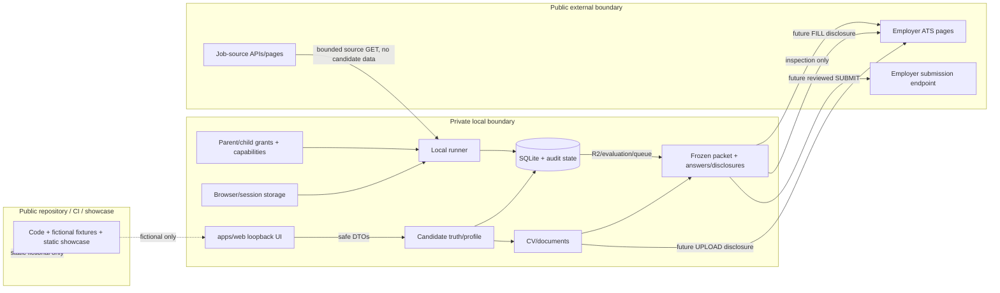

# ApplyPilot Production Verification Project Plan

Last updated: 2026-09-28
Owner: `adeel1608`
Repository: `adeel1608/applypilot`
Expected current main: `8acb96a817d9835b205f6cf25fabd9c24ad18e0f`
Workflow: `PROJECT_PLAN.md -> one scoped Codex prompt -> execution/evidence -> updated PROJECT_PLAN.md -> technical review -> next prompt`

> This is the active production-readiness checklist. Historical evidence must be preserved separately and never rewritten as current state.

## 1. Resume here

### Current work checkpoint (2026-09-28)

- This engineering task starts from synchronized `main` / `origin/main` at
  `8acb96a817d9835b205f6cf25fabd9c24ad18e0f` on branch
  `feat/m2-source-owner-action-receipts`. The worktree was clean before this plan update.
- PR #54 remains OPEN / UNMERGED at head `212eb1d4c3928b217ecc76201d5eb8c21c764332`, base
  `8acb96a817d9835b205f6cf25fabd9c24ad18e0f`, tree
  `b5c9ea0bc457f861e1cdefe6993b422db54c4373`. Do not merge it or push to it: its historical plan
  wording overstates durable owner-action provenance. Treat it as SUPERSEDED / UNSAFE TO MERGE AS
  WRITTEN; leave it open for later explicit supersession.
- The prior uncommitted provenance-stop note was found and preserved before restoring its one tracked
  file. Safe copy: `.git/codex-safety/pr54-provenance-stop-20260928.patch`, SHA-256
  `a5e120a14eb41905f4cb0096221c6c38a57f9a821794b197cb0ee54f49c207ff` (7,614 bytes). The note
  contains the provenance stop in `PROJECT_PLAN.md`; no private payload was copied into tracked source.
- Read-only private runtime baseline: schema 11, pending migrations 0, integrity PASS, FK issues 0;
  active source/target capabilities, active source runs, and pending external operations are all 0.
  Lifetime source/employer/form-upload/submission counters are `17/9/0/0`.
- Historical family `m2_source_shieldai_ace3faba83cf_1790463324757` has v3 recorded APPROVED with
  reference `owner.m2-source-discovery.lever_shieldai.v3`, v4 latest and REVOKED, and one completed
  v3 `LIST_JOBS` run `58796b51-f83f-4130-9ee2-6fa65d064d20` (one request/page, 25 records). The old
  runtime did not durably store separate owner approval/start receipts. Those operational records
  remain intact, while explicit human approval/start provenance for v3 is permanently
  `LEGACY_OWNER_PROVENANCE_UNVERIFIED`; no historical receipt or run binding may be backfilled.
- No source/employer request, capability activation, target action, migration, or private database
  write is authorized. The real database must remain at schema 11 throughout this task.

### Historical R46-10 checkpoint (2026-09-23)

- Branch: `chore/p2-current-role-readiness`; PR #46 remains `OPEN / UNMERGED` with title
  `feat: implement verified source-to-packet and non-submit foundations`.
- R46-10 started from exact clean head `e44c662c2593c556d76cdb38d8acafab2b8dfd87` and is now
  committed at exact final head `0f4a8d1612b8f2e161824c4cd7a4f14bbc5f29b1`; exact-head push CI
  `35813500403` and pull-request CI `35813503020` both completed successfully with 47 E2E tests.
  PR #46 remains `OPEN / UNMERGED`; an earlier exact-head run `35812359481` timed out only because
  the expanded decisive test exceeded its old 120-second test timeout and was superseded by the
  bounded termination-proof fix.
- Main/base baseline remains `2b9e44f7633b3fb17a705a799e9b12482d2d1fb7`.
- Private runtime is read-only for this task: schema 9, pending disposable-only `0010`, integrity
  `PASS`, foreign-key issues `0`; disposable schema-10 rehearsals are isolated.
- This R46-08 iteration remains offline-only and adds source/employer/upload/submission
  actions `0/0/0/0`. Historical matrices and handoffs below are not current evidence for this run.
- R46-10 is the active offline-only correction on the same branch and PR. It preserves R46-09's
  immutable packet representation, explicit policy/operation authority, owner-bound claims, and
  killed-worker proof while closing normal invalidation retention, successful-predecessor/canonical
  history validation, resolver linkage, and exact mid-run expiry evidence. The iteration delta remains
  `0/0/0/0`; migrations and the private runtime remain untouched; PR #46 stays open and unmerged.

### Historical baseline (read-only reconciled 2026-09-22)

- Repository `adeel1608/applypilot` is on clean `main` at `2b9e44f7633b3fb17a705a799e9b12482d2d1fb7`; `origin/main` matches.
- PR #45 was approved and squash-merged as `2b9e44f7633b3fb17a705a799e9b12482d2d1fb7`; its merged tree
  equals reviewed head `41c12123fab1a044aec765040cd3eb90aa78aa91` and P1 is now `VERIFIED` against this baseline.
- PR #44 was approved and squash-merged normally. Reviewed head `77dd2cf4b9c10ff9e3f3f2e2535257a692b1ffb5`
  and merged main have the same Git tree; strict commit ancestry is intentionally absent for the squash merge.
- Squash verification rule: expected reviewed head + exact-head CI + approved squash merge + merged parent equal
  pre-merge main + merged tree equal reviewed head tree + approved scope + archive digest preservation.
- PR #42 merged as `467e288959edd6983c5086bbee979aad23e434d8`; PR #43 and PR #45 are merged into the current main baseline.
- Private runtime read-only checks: schema 9, pending migrations 1 (the disposable-only `0010`
  implementation is intentionally not applied), integrity `PASS`, foreign-key issues 0.
- Historical lifetime action counters reconcile to source/employer/upload/submission = `14/9/0/0`; this
  offline implementation iteration adds `0/0/0/0` (no source, employer, upload, or submission actions).
- Active source capability count: 0. Active target capability count: 0. The historical parent grant is unchanged and submit-excluded; the ordinary P2-001 source capability completed its documented create/use/revoke lifecycle, and no active authority remains.
- First real employer target validation is historically proven; the selected role's later inspection is passive evidence only.
- Source-enabled Personal Beta: `READY`. Personal Live V1: `NOT_READY`.
- No final-submit consent has been issued and no real application has been submitted.
- Pre-rebase active-plan blob: `9ad8a46ded3205fee063dae0bbaa3162fd5d905b`; SHA-256 `51BE6553983760CAB1AD8C39F29EC444006F7B5983C7150AE8DB6BCD4B44DC93`; archived losslessly at `docs/project-history/PROJECT_PLAN.before-production-rebaseline.md`.

### Reconciliation result

The earlier statement that only owner facts remained was too broad. Code review proves that the
green-banner operation enum is an authority vocabulary, not a production executor. `RunnerTargetCapabilitySchema`
rejects every `REAL_TARGET` capability whose operations are not exactly `[OPEN_AND_INSPECT_ONLY]`;
`freezeRunnerBinding` and `TargetIndependentApplicationRunner` therefore cannot bind a real application
capability. The runner adapter interface has `open`, `map`, `fill`, and `submit`, but no `upload`,
`verify`, or `fillPreview` entry point, and there is no real-target persistence/audit lifecycle for
those operations. Synthetic tests cover map/fill/one-use synthetic submit and unknown outcomes only.
Consequently real `MAP_FOR_FILL`, `FILL`, `UPLOAD`, `VERIFY`, and `FILL_PREVIEW` are `ENGINEERING` /
`MISSING_VERIFICATION`, not owner-fact blockers.

### Latest selected target evidence

Latest recorded Melbourne target:
`Computer Vision Engineer (C++) (R4633)`

Recorded evidence:

- fact-bound engineering CV generated privately as PDF/DOCX;
- locally validated/approved;
- review-only packet frozen;
- packet reportedly used a legacy evaluation binding;
- passive employer inspection completed;
- 46 controls inventoried;
- 27 unsupported controls;
- 1 document-required control;
- zero candidate values;
- zero writes;
- zero uploads;
- zero submissions.

This proves passive compatibility only, not fill/upload/submission readiness. The packet binds legacy
evaluation `b0110c9e-dc20-41a4-b8a5-51cfd5010dbc`, while the current R2 evaluation is
`a95c2f2f-8175-4602-92c2-667f04a099b5`; the packet is therefore stale for any application operation.
The current CV artifacts remain approved, non-stale, private-only, and bound to the current job/profile:
PDF digest `28e64de248ff757a247ba789baea7692aae92372f3dd6ebac6019a9ad241b0e8` and DOCX digest
`d83d607cf9ae3d9bdadc468660d942d86f14b1394be4c678d5f413406f2139ca`.

### Source accounting reconciliation

Run `0dba8b34-fb59-4cc8-a7ef-c3b97e8d5bbf` is durably `COMPLETE`: 4 requests, 4 pages, 100 provider
records (25 per page), 100 accepted, 0 unusable, 83 newly persisted observations/job versions,
83 current R2 evaluations, and 83 queue decisions. The 17-record difference is not silent loss:
`persistLeverObservation` deterministically returns `created: false` when the observation identity
already exists; the page audit records accepted and persisted counts, while the repository does not
retain a per-record duplicate disposition. The redacted evidence therefore supports exactly
`100 accepted = 83 created + 17 deterministic duplicate/no-op dispositions`, but cannot identify those
17 records individually without the discarded provider payload. No rejected/unusable records are
present in this run, and replay remained idempotent.

### Candidate evidence correction

The private profile contains verified C++, OpenCV/stereo-vision and related robotics skills, verified
engineering education/employment/certification/licence evidence, and verified restricted Australian
work-right evidence. The selected role is still `REVIEW_REQUIRED` because provider
evidence is incomplete: `datePosted`/expiry is absent, extracted requirements are empty, and job-level
work-rights, vehicle, hours, schedule, licence/certification and extraction-coverage dimensions remain
unknown. These are not equivalent to missing candidate experience or skills; classify them as
`PROVIDER_EVIDENCE`/`MISSING_VERIFICATION` unless a later owner fact is genuinely required by a concrete
form question.

## 2. Final production objective

ApplyPilot must support a safe, reproducible, single-owner production workflow:

`discover -> normalize -> deduplicate -> evaluate -> shortlist -> generate/freeze documents -> inspect -> map -> fill -> upload -> human review -> fresh submit consent -> submit once -> track outcome`

### Green banner

`# 🟢 **WE ARE READY**`

means:

- ready for the first supervised real submission;
- suitable current role selected;
- candidate facts supported;
- current CV and packets frozen;
- actual target inspected;
- real map/fill/upload verified;
- filled preview reviewed;
- exact submit control identified;
- one-use consent mechanism verified;
- no unresolved material blocker.

It does NOT mean an application has already been submitted.

### Permanent safety boundaries

- Unknown facts remain unknown.
- Never infer citizenship, visa/work rights, sponsorship, clearance, experience, education, certifications, licences, availability, or other material application facts.
- Never bypass CAPTCHA, MFA, authentication, bot controls, rate limits, access controls, or website restrictions.
- No blind retry after ambiguous submission.
- Final submit always requires fresh one-use owner consent.
- Private profile, documents, DB, cookies, sessions, secrets, and live payloads remain local/ignored.
- Public showcase is not operational production.

## 3. Working agreement

For every future Codex iteration:

1. Read `AGENTS.md`, this plan, and relevant history.
2. Verify branch, HEAD, origin/main, worktree, DB/schema compatibility, and dependencies.
3. Select only the authorized task.
4. Update the task blueprint before application/runtime code changes.
5. Implement only within scope.
6. Run acceptance checks.
7. Record evidence, failures, blockers, and decisions.
8. Update current state and next dependency.
9. Return the updated plan and handoff.
10. Wait for review where required.

### Status values

`NOT_STARTED`, `IN_PROGRESS`, `IMPLEMENTED_UNVERIFIED`, `BLOCKED`, `VERIFIED`, `DEFERRED`, `NOT_APPLICABLE`

### Evidence values

`REPORTED`, `CODE_REVIEWED`, `SYNTHETICALLY_VERIFIED`, `LOCAL_RUNTIME_VERIFIED`, `LIVE_VERIFIED`, `DEPLOYMENT_VERIFIED`

Every verified task must record revision, environment, command/observation, timestamp, result, evidence location, and invalidation conditions.

## 4. Verified-state ledger

### BASE-001 — Repository baseline

Status: `VERIFIED`
Owner: Codex

Checklist:

- [x] Verify local HEAD, `origin/main`, and clean worktree.
- [x] Verify PR #42/#43 ancestry and merge commits.
- [x] Record current draft blob/hash and archive it losslessly.
- [x] No repository file named `PROJECT_PLAN(7).md` was supplied or present; comparison is `NOT_AVAILABLE`, not assumed equal.
- [x] Preserve unresolved historical work in the archive.

Acceptance: one non-contradictory baseline.

### BASE-002 — Private runtime baseline

Status: `VERIFIED`
Depends on: `BASE-001`

Read-only checks:

- [x] schema version 9, pending migrations 0, integrity `PASS`, foreign keys 0;
- [x] migrations `0000`-`0008` unchanged and `0009` additive;
- [x] parent/child ledger, active authority counts, and historical action counters;
- [x] selected role, current profile/evaluation/document/packet bindings, and inspection evidence.

Acceptance: safe current-state summary with no private values printed.

### BASE-003 — Source accounting

Status: `VERIFIED`
Depends on: `BASE-002`

Latest recorded run:

- 4 requests;
- 4 pages;
- 100 provider records;
- 100 accepted;
- 83 persisted/evaluated/queued.

Checklist:

- [x] Account for all 100 records and four 25-record pages.
- [x] Explain the 17-record difference as deterministic duplicate/no-op dispositions; individual identities are not retained.
- [x] Confirm zero unusable/rejected records in this run and no silent persistence failure.
- [x] Verify current R2/evaluation/queue counts are 83/83/83 and replay is idempotent.

Acceptance: every provider record has a deterministic disposition.

## 5. Architecture and trust boundaries

Document actual ownership for:

- `apps/web`;
- `apps/showcase`;
- candidate profile/truth store;
- job sources;
- importer;
- R2 normalization/evidence;
- eligibility/fit;
- duplicate/queue/corrections;
- documents;
- application runner;
- tracker;
- database;
- green-banner parent/child authority.

### Parent grant

Current operation ceiling includes:

- `SOURCE_LIST_JOBS`
- `OPEN_AND_INSPECT_ONLY`
- `MAP_FOR_FILL`
- `FILL`
- `UPLOAD`
- `VERIFY`
- `FILL_PREVIEW`

`SUBMIT` remains excluded.

Audit:

- [x] parent persistence/digest;
- [x] child derivation/scope;
- [x] child expiry/replay;
- [x] code SHA binding (the persisted parent is bound to the pre-merge implementation SHA; no child was created after the merge);
- [x] parent submit exclusion and terminal child evidence;
- [x] source-run restart/replay evidence;
- [ ] cumulative cross-run action budget (not implemented; `ENGINEERING`).

### Runner authority

Audit result (revision `010cbe909b7d7b2b4ed88c413f270f7ff1ff75ac`, code reviewed 2026-09-22):

| Operation               | Authority enforcement                           | Adapter/runtime entry point                                               | Packet binding                  | Persistence/audit                           | Verification/tests            | Current evidence       |
| ----------------------- | ----------------------------------------------- | ------------------------------------------------------------------------- | ------------------------------- | ------------------------------------------- | ----------------------------- | ---------------------- |
| `OPEN_AND_INSPECT_ONLY` | `REAL_TARGET` schema + inspection identity      | Lever passive inspection adapter + `TargetInspectionRunner`               | `FrozenInspectionBinding`       | `runner_inspection_bindings` + audit events | live validated; synthetic/E2E | `LIVE_VERIFIED`        |
| `MAP_FOR_FILL`          | enum/parent only; real target schema rejects it | no real adapter; synthetic `TargetIndependentApplicationRunner.map` only  | synthetic `FrozenRunnerBinding` | no real operation lifecycle                 | unit synthetic only           | `ENGINEERING`          |
| `FILL`                  | enum/parent only; real target schema rejects it | no real adapter; synthetic `TargetIndependentApplicationRunner.fill` only | synthetic binding only          | no real operation lifecycle                 | unit synthetic only           | `ENGINEERING`          |
| `UPLOAD`                | enum/parent only; real target schema rejects it | no `upload` adapter method                                                | none                            | none                                        | no upload-stage test          | `MISSING_VERIFICATION` |
| `VERIFY`                | parent enum only                                | no runner method or adapter method                                        | none                            | none                                        | none                          | `MISSING_VERIFICATION` |
| `FILL_PREVIEW`          | parent enum only                                | no runner method or adapter method                                        | none                            | none                                        | none                          | `MISSING_VERIFICATION` |

The existing synthetic runner does have a frozen binding, protection stops, document digest check,
one-use synthetic consent, and `OUTCOME_UNKNOWN` behavior. Those proofs do not establish a production
real-target operation path. The next engineering task must address this gap before any owner-fact
question can be treated as the sole blocker.

## 6. Environment/configuration/secrets

### ENV-001 — Supported host

Verify:

- Windows/PowerShell;
- Node/npm;
- native SQLite;
- Playwright Chromium;
- filesystem permissions;
- loopback ports;
- timezone/DST;
- sleep/reboot;
- disk space;
- process concurrency.

### ENV-002 — Configuration inventory

Create:
`variable | purpose | environment | default | secret? | owner | validation | rotation/recovery`

Never record secret values.

### ENV-003 — Secrets

Verify:

- ignored env files;
- no credentials in Git/history;
- no secrets in CI artifacts;
- cookies/browser state local only;
- documented provisioning, rotation, revocation, leak response.

## 7. Dependency-ordered implementation plan

### P0 — Baseline reconciliation and plan rebase

Status: `VERIFIED`

- [x] Archive old plan at `docs/project-history/PROJECT_PLAN.before-production-rebaseline.md`.
- [x] Record source commit/blob/hash.
- [x] Replace stale front-page state.
- [x] Add stable task IDs.
- [x] Add old-to-new crosswalk.
- [x] Separate reported vs verified evidence.
- [x] Open documentation-only PR #44; exact-head CI passed, review approved, and squash merge recorded
      at `3cc75dfd3dcaf35f09b857ab5c42a52d923bc1fc` (https://github.com/adeel1608/applypilot/pull/44).

#### P0-004 — Historical archive formatting-policy closure

Status: `VERIFIED`
Owner: Codex
Depends on: P0 baseline archive and exact-head repository CI
Objective: preserve the byte-identical historical snapshot while allowing repository-wide formatting
checks to cover all active files.
Root cause: `prettier --check .` correctly rejected the immutable historical snapshot even though
the active plan was formatted. Formatting, editing, regenerating, or line-ending-normalizing the
archive would destroy its evidence value.
Authorized change: add exactly this `.prettierignore` entry and no broader pattern:
`docs/project-history/PROJECT_PLAN.before-production-rebaseline.md`
Acceptance: archive Git blob remains `9ad8a46ded3205fee063dae0bbaa3162fd5d905b` and SHA-256 remains
`51BE6553983760CAB1AD8C39F29EC444006F7B5983C7150AE8DB6BCD4B44DC93`; active `PROJECT_PLAN.md`
continues to pass normal Prettier checks; exact-head GitHub CI is the final external P0 gate.
Local verification: archive hash/blob checked before and after; active-plan formatting, privacy,
diff, and fsck checks run.
Evidence: exact-head GitHub Actions quality passed at reviewed head `77dd2cf4b9c10ff9e3f3f2e2535257a692b1ffb5`
(runs `35681958007` and `35681961078`); PR #44 was accepted and squash-merged as
`3cc75dfd3dcaf35f09b857ab5c42a52d923bc1fc`. Archive blob/SHA are preserved on merged main.
Failure/recovery: if the archive hash changes, stop and restore it from the committed PR state;
if CI fails for another reason, investigate only that exact failure and stop before unrelated fixes.
Invalidation: any archive content change or base/head drift invalidates this record.

Exit: one consistent active plan.

### P1 — Production scope and architecture verification

Status: `VERIFIED`

Evidence: architecture work and local/code evidence were accepted on PR #45; exact-head CI passed,
the reviewed tree equals the squash-merged tree, and merged main is
`2b9e44f7633b3fb17a705a799e9b12482d2d1fb7`. This verifies architecture only; it does not make P2/P3/P4
or Personal Live V1 ready.

- [x] Component capability matrix (read-only code review).
- [x] End-to-end data-flow map (source/R2/document/packet/runner boundaries recorded).
- [x] Private app vs showcase boundary.
- [x] Real `MAP_FOR_FILL/FILL/UPLOAD/VERIFY/FILL_PREVIEW` architecture audit.
- [x] Parent/child authority enforcement audit.
- [x] Runner target capability enforcement audit.
- [x] Deployment topology decision: `LOCAL_SINGLE_OWNER_V1`.
- [x] Trust-boundary review of current local-first implementation.

Exit: explicit implemented-vs-proposed capability map.

#### P1-001 execution blueprint and evidence

Objective: document the narrowest supported Personal Live V1 architecture, ownership, trust
boundaries, authority limits, and future P4 design inputs without changing runtime behavior.

Scope/components: `apps/web`, `apps/showcase`, candidate profile/runtime, source readers and
transport, source/R2 repositories, eligibility/fit, documents/packets, target inspection and
synthetic runner, tracker/outcomes, SQLite/migrations, backup/restore, and browser/private roots.

Steps completed: inspect merged code and existing architecture/security/runbook docs; trace data and
authority flow; classify each capability as implemented, synthetic-only, locally verified, live
verified, engineering, or missing verification; select `LOCAL_SINGLE_OWNER_V1`; record failure
ownership and P2/P3/P4 dependencies; run non-mutating checks.

Acceptance: component and capability matrices complete; private/public boundary explicit; parent/child
authority and real-target restriction documented; failure model assigned; topology selected; no P1
unknown remains that would force P4 to guess. No source/employer/runtime action or database mutation
was performed.

Rollback: documentation-only branch; revert the P1 documentation commit before review if evidence is
incorrect. No runtime rollback or migration is applicable.

Invalidation: code, migration, authority, deployment, or trust-boundary changes invalidate this
P1 evidence and require a new architecture review.

#### P1-002 execution blueprint and evidence

Objective: correct active-plan release-marker wording and phase-status semantics without changing the
architecture evidence, runtime behavior, authority, data, migrations, tests, workflow, or dependencies.

Required corrections: restore the exact green-banner phrase at both active-plan definition/emission
locations; keep overall P1 `IMPLEMENTED_UNVERIFIED` until PR #45 is reviewed, merged, and its merged
tree is verified; keep overall P5 blocked by P4 while preserving its verified synthetic safety evidence
as `P5-SYN-001`.

Scope: `PROJECT_PLAN.md` only. The immutable historical archive remains untouched. No source,
employer, browser, document, packet, database, capability, grant, candidate-profile, deployment, or
application action is permitted.

Acceptance: zero obsolete placeholder-marker occurrences; exact phrase appears in both intended
active-plan locations; P1 is `IMPLEMENTED_UNVERIFIED`; P5 is `BLOCKED`; `P5-SYN-001` is `VERIFIED`;
P4 remains `BLOCKED`; Personal Live V1 remains `NOT_READY`; exact-head CI independently passes.

Rollback: revert this documentation-only commit on `docs/p1-production-architecture`; no runtime
rollback or migration is applicable. Invalidation: any runtime/architecture change or merged-main
drift requires a fresh P1 review.

### P1 production topology decision

Selected topology: `LOCAL_SINGLE_OWNER_V1` on an owner-controlled Windows host.

```text
OWNER WINDOWS HOST (private, loopback-first)
├── apps/web — private operational UI, loopback/local access
├── local Node/TypeScript runner — scoped source and target orchestration
│   └── Playwright Chromium only when an approved browser capability requires it
├── local SQLite — profile versions, jobs/evidence, R2, queue, grants, capabilities, audits
├── data/private — profile, generated documents, packets, reports, backups, browser/session state
└── local recovery storage — verified SQLite-safe backups and restore runbook

SEPARATE PUBLIC SYSTEM
└── apps/showcase — static fictional demo only; no private DB/profile/session/authority/network
```

Personal Live V1 requires no hosted database, cloud browser, remote worker, multi-tenancy,
multi-user authentication, SaaS queue, Kubernetes, Redis, cloud document storage, or paid AI API.
The local runner is the only place permitted to hold private candidate data, authenticated state, or
future employer interaction. External actions remain default-deny and require operation-scoped,
short-lived authority. `apps/showcase` is not Personal Live V1 and cannot trigger actions.

### P1 component ownership and maturity matrix

| Component / path                                                                            | Responsibility; inputs → outputs; state                                                   | Trust / side effects / authority                                                              | Maturity and remaining work                                                                          |
| ------------------------------------------------------------------------------------------- | ----------------------------------------------------------------------------------------- | --------------------------------------------------------------------------------------------- | ---------------------------------------------------------------------------------------------------- |
| `packages/candidate-profile`, `apps/web/lib/candidate-profile-provider.ts`                  | Zod profile truth store; private/demo resolution → verified facts/status DTO              | Private local boundary; no network; profile context gate prevents demo facts for real imports | `LOCAL_RUNTIME_VERIFIED`; owner facts remain P2-scoped                                               |
| `packages/job-model`                                                                        | Canonical job, source, eligibility, application enums → typed domain objects              | Untrusted boundary after schema validation; no side effect                                    | `LOCAL_RUNTIME_VERIFIED`; provider freshness remains P2                                              |
| `packages/job-sources/src/source-capability.ts`, `private-allowlist.ts`                     | Source capability schema/digest/readiness → approved source scope                         | Private authority; no call by itself; exact host/path/operation/budget/expiry                 | `LOCAL_RUNTIME_VERIFIED`; cumulative cross-run budget remains engineering                            |
| `packages/job-sources/src/secure-source-transport.ts`, `source-runner.ts`, Lever readers    | Approved source capability → bounded HTTPS requests, inert records, stop diagnostics      | Public source boundary; GET only through capability, HTTPS/SSRF/query/redirect/retry guards   | `LIVE_VERIFIED` for bounded Lever list evidence; no new live action in P1                            |
| `apps/web/lib/source-workspace.ts`, `packages/database/src/source-enablement-repository.ts` | Owner source view/orchestration; runs/pages/observations/audits → R2 handoff              | Private UI + DB; capability currentness checked before pages and completion                   | `LOCAL_RUNTIME_VERIFIED`/bounded beta live evidence; restart per-record audit gap is P3              |
| `packages/job-importer`                                                                     | User-supplied content, inert HTML/text, URL policy → validated import batches             | Private import boundary; no source fetch; explicit confirmation before canonical writes       | `LOCAL_RUNTIME_VERIFIED`; no architecture gap for P1                                                 |
| `packages/job-normalizer`, source observation tables                                        | Raw source record → normalized job version, conservative identity/dedup candidates        | Untrusted data becomes immutable provenance; no external side effect                          | `LOCAL_RUNTIME_VERIFIED`; changed/duplicate/restart tests remain P3                                  |
| `packages/eligibility-engine`, `packages/fit-scorer`                                        | Current profile + evidence/job → eligibility, fit, explanations, coverage                 | Deterministic local computation; unknown stays review; no external side effect                | `LOCAL_RUNTIME_VERIFIED`; calibration remains uncalibrated and P2/P3 evidence-gated                  |
| `packages/database/src/r2-repository.ts`, `r2a-repository.ts`                               | Immutable evidence/evaluation/queue/correction records → currentness and audit events     | Private SQLite; transactions/FKs and stale invalidation; no network                           | `LOCAL_RUNTIME_VERIFIED`; current packet/evaluation alignment remains P2                             |
| `packages/resume-engine`, `cover-letter-engine`, `apps/web/lib/private-document.ts`         | Verified profile/job → private PDF/DOCX artifacts and digests                             | Private filesystem; no outbound transfer; approval binds content digest                       | `LOCAL_RUNTIME_VERIFIED`; regeneration remains P2-gated                                              |
| `packages/database/src/beta-repository.ts` packet functions                                 | Current job/profile/evaluation/docs/answers → frozen packet/readiness                     | Private DB; rejects stale versions and invalidates on material changes                        | `LOCAL_RUNTIME_VERIFIED` synthetic/private; selected packet is stale for application operations (P2) |
| `packages/application-runner/src/inspection-runner.ts`, `lever-inspection-adapter.ts`       | Frozen packet + real inspection capability → passive DOM field inventory                  | Employer boundary; one navigation/evaluation, zero writes/data; target capability required    | `LIVE_VERIFIED` for inspection history; no mutation API                                              |
| `packages/application-runner/src/target-runner.ts`                                          | Target capability schema; synthetic packet binding/map/fill/consent/outcome → checkpoints | Real target schema permits only `OPEN_AND_INSPECT_ONLY`; synthetic adapter is loopback        | Inspection `LIVE_VERIFIED`; real MAP/FILL `ENGINEERING`, real UPLOAD/VERIFY/PREVIEW missing          |
| `apps/web/lib/runner-workspace.ts`, `runner-enablement-repository.ts`                       | Private target proposal/allowlist, capability persistence, inspection/recovery views      | Private authority + DB; digest/packet/currentness checks; no automatic approval               | `LOCAL_RUNTIME_VERIFIED` for inspection; future P4 lifecycle required                                |
| `packages/application-runner/src/green-banner-grant.ts`, green-banner repository            | Parent grant digest/scope → source/target child capabilities and terminal events          | Private authority; child TTL, scope, main SHA, packet/document bindings; SUBMIT excluded      | `LOCAL_RUNTIME_VERIFIED`; cumulative cross-run budget unresolved                                     |
| `packages/application-tracker` and `application_events`                                     | Validated lifecycle events → append-only timeline/outcome projection                      | Private DB; no network; ambiguous outcome modeled                                             | `LOCAL_RUNTIME_VERIFIED` synthetic; real operation events await P4/P7                                |
| `packages/database/src/schema.ts`, migrations `0000`–`0009`                                 | SQLite schema, FKs, immutable migration history → durable local state                     | Private local boundary; no auto-migrate in production                                         | `LOCAL_RUNTIME_VERIFIED`; backup/restore rehearsal is P11                                            |
| `scripts/backup.ts`, `scripts/restore.ts`, database maintenance                             | SQLite-safe backup manifest/preview/confirmed restore → recovery state                    | Private filesystem; restore requires explicit confirmation and recovery backup                | `IMPLEMENTED_UNVERIFIED`; operational rehearsal deferred P11                                         |
| `apps/web`                                                                                  | Loopback operational UI/server actions; safe DTOs → local views/mutations                 | Loopback Host/Origin/session/nonce gate; private profile server-only                          | `LOCAL_RUNTIME_VERIFIED`; deployment topology selected, no hosted exposure                           |
| `apps/showcase`, `scripts/audit-public-showcase.ts`                                         | Static fictional pages/assets → public demo export                                        | Public boundary; audit rejects private imports, DB/fs/network/server actions                  | `LOCAL_RUNTIME_VERIFIED`; independently deployable, never operational                                |
| Playwright/browser lifecycle (`start-e2e-server.ts`, inspection adapter)                    | Synthetic server or approved inspection session → bounded browser observations            | Browser/session private; protection/auth/CAPTCHA/MFA stop; no bypass                          | Synthetic + inspection live evidence; real mutation lifecycle is P4                                  |
| Private filesystem roots (`scripts/lib/runtime-safety.ts`, ignored `data/private`)          | Profile, DB, documents, packets, backups, sessions → local artifacts                      | Outside Git/CI; secrets/cookies never logged or committed                                     | `LOCAL_RUNTIME_VERIFIED`; permissions/recovery thresholds remain P6/P11                              |

### P1 capability matrix

| Operation                       | Exists / evidence                                                                  | Authority, persistence, adapter                                                         | Personal Live V1 status                                             |
| ------------------------------- | ---------------------------------------------------------------------------------- | --------------------------------------------------------------------------------------- | ------------------------------------------------------------------- |
| `DISCOVER` / `SOURCE_LIST_JOBS` | Lever source runner and source UI; bounded live run evidence                       | SourceCapabilityV2 + private allowlist + source pages/observations/audits; Lever reader | `READY_BOUNDED_PERSONAL_BETA`, not unattended                       |
| `NORMALIZE`                     | Source/import normalizers and immutable job versions; local/live source evidence   | Schema boundary and source repository; no external side effect                          | `LOCAL_RUNTIME_VERIFIED`                                            |
| `EVALUATE`                      | R2 eligibility/fit/evidence engines and persisted evaluations                      | Current private profile/evidence; R2 audit; no external side effect                     | `LOCAL_RUNTIME_VERIFIED`, calibration not production-calibrated     |
| `QUEUE`                         | Queue decisions and PREPARING currentness gates                                    | R2 repository + audit; no external side effect                                          | `LOCAL_RUNTIME_VERIFIED`                                            |
| `DOCUMENT_GENERATE`             | Resume/cover-letter engines and private artifact digests                           | Private filesystem and profile provenance; no authority/network                         | `LOCAL_RUNTIME_VERIFIED`                                            |
| `PACKET_FREEZE`                 | ApplicationPacket schema/repository, digest/currentness/readiness                  | Private DB, document approvals, current job/profile/evaluation bindings                 | `LOCAL_RUNTIME_VERIFIED`; selected packet stale for application use |
| `OPEN_AND_INSPECT_ONLY`         | TargetInspectionRunner + Lever passive adapter; real inspection history            | REAL_TARGET capability, FrozenInspectionBinding, inspection persistence/audits          | `LIVE_VERIFIED` for bounded inspection only                         |
| `MAP_FOR_FILL`                  | Synthetic `TargetIndependentApplicationRunner.map`; real capability schema rejects | Synthetic binding only; no real lifecycle persistence                                   | `ENGINEERING`                                                       |
| `FILL`                          | Synthetic runner fill path; real capability schema rejects                         | Synthetic binding only; disclosure boundary not real-enabled                            | `ENGINEERING`                                                       |
| `UPLOAD`                        | Parent enum and synthetic document checks only; no adapter method                  | No real runtime/persistence path                                                        | `MISSING_VERIFICATION`                                              |
| `VERIFY`                        | Parent vocabulary only; no runner/adapter method                                   | No real runtime/persistence path                                                        | `MISSING_VERIFICATION`                                              |
| `FILL_PREVIEW`                  | Parent vocabulary only; no runner/adapter method                                   | No real runtime/persistence path                                                        | `MISSING_VERIFICATION`                                              |
| `FINAL_REVIEW`                  | Synthetic `readyForFinalReview` checkpoint                                         | Frozen synthetic binding and packet readiness                                           | `SYNTHETICALLY_VERIFIED`, real preview absent                       |
| `SUBMIT_CONSENT`                | Synthetic one-use final consent and concurrent-use tests                           | Binding digest/token/expiry/used state; parent grant excludes SUBMIT                    | `SYNTHETICALLY_VERIFIED`, real submit unavailable                   |
| `SUBMIT`                        | Synthetic adapter outcome model only; no real-target capability                    | Real schema rejects application scope; ambiguous result becomes `OUTCOME_UNKNOWN`       | `DISABLED_REAL`                                                     |
| `OUTCOME_TRACKING`              | Application tracker and append-only events                                         | Private SQLite; no external side effect                                                 | `LOCAL_RUNTIME_VERIFIED` model, real action evidence absent         |

Implemented is not production-ready: only bounded source ingestion and passive inspection have live
evidence; real application mutation remains blocked.

### P1 trust-boundary and data-flow model


```mermaid
flowchart LR
  subgraph PRIVATE[Private local boundary]
    PROFILE[Candidate truth/profile]
    DB[(SQLite + audit state)]
    DOCS[CV/documents]
    PACKET[Frozen packet + answers/disclosures]
    AUTH[Parent/child grants + capabilities]
    SESSION[Browser/session storage]
    WEB[apps/web loopback UI]
    RUNNER[Local runner]
  end
  subgraph PUBLIC[Public external boundary]
    SOURCE[Job-source APIs/pages]
    ATS[Employer ATS pages]
    SUBMIT[Employer submission endpoint]
  end
  subgraph REPO[Public repository / CI / showcase]
    CODE[Code + fictional fixtures + static showcase]
  end
  WEB -->|safe DTOs| PROFILE
  PROFILE --> DB
  SOURCE -->|bounded source GET, no candidate data| RUNNER
  RUNNER --> DB
  DB -->|R2/evaluation/queue| PACKET
  PROFILE --> DOCS
  DOCS --> PACKET
  AUTH --> RUNNER
  PACKET -->|inspection only| ATS
  PACKET -->|future FILL disclosure| ATS
  DOCS -->|future UPLOAD disclosure| ATS
  PACKET -->|future reviewed SUBMIT| SUBMIT
  SESSION --> RUNNER
  CODE -. fictional only .-> WEB
  CODE -. static fictional only .-> REPO
```

Candidate data first crosses the private boundary at target `FILL` (answers), `UPLOAD` (documents),
or `SUBMIT`; all three are disclosure operations, and FILL/UPLOAD require their own authority and
auditable verification even though they precede final submission. Source discovery sends no candidate
data. The showcase never receives profile, DB, session, grant, or runner authority.

### P1 parent/child authority findings

- Parent `GREEN_BANNER_SESSION_GRANT_V1` is persisted with canonical digest, immutable scope,
  `mainSha`, and submit excluded from its operation vocabulary.
- Child derivation persists deterministic child digest and parent digest; source children require
  provider/tenant/host/path and `SOURCE_LIST_JOBS`; target children require origin/path/packet.
- `assertGreenBannerChildWithinParent` enforces parent scope, operation ceiling, main SHA equality,
  expiry, and maximum child TTL. Packet binding is mandatory for MAP/FILL/FILL_PREVIEW/VERIFY; packet
  plus document digest is mandatory for UPLOAD.
- Database repositories persist parent/child events, reject duplicate digests, reject inactive or
  mismatched parents, and expose active-child/recovery state. Target/source repositories separately
  recheck current capability digest/version before execution.
- Target inspection has its own immutable binding and lifecycle/audit tables. Real application
  operations remain rejected by `RunnerTargetCapabilitySchema`; parent vocabulary alone is not an
  executor.
- Restart semantics are durable for source runs and inspection/recovery checkpoints. A cumulative
  cross-run action budget is not implemented and remains engineering work.

### P1 external-boundary failure ownership

| Failure / signal                                                         | Required behavior now                                                                    | Owning future phase |
| ------------------------------------------------------------------------ | ---------------------------------------------------------------------------------------- | ------------------- |
| Network timeout, DNS/TLS/connection failure                              | bounded stop with safe code and lifecycle stage; no blind retry beyond capability budget | P3/P6               |
| Redirect, destination drift, SSRF/host/path/query mismatch               | reject/stop before or at transport; never mutate approved semantics                      | P3/P4               |
| Popup/new window or browser context loss                                 | inspection/runner stop with diagnostic; no unmanaged navigation                          | P4/P7               |
| Form/schema drift or unsupported control                                 | fail closed, retain safe diagnostic only, require review                                 | P4/P7               |
| Browser/process crash or partial write                                   | durable checkpoint/recovery; reconcile authority before resume                           | P6/P11              |
| Stale packet/form/document/profile/evaluation                            | reject binding and invalidate dependent state; regenerate only after gates               | P2/P4               |
| Expired/revoked/changed capability or duplicate invocation               | reject currentness check; consume/revoke terminal child; no replay                       | P4/P7               |
| CAPTCHA, MFA, authentication, bot protection, rate limit, access control | stop immediately; no bypass, retry, or credential action                                 | P4/P7               |
| Ambiguous submission/lost response                                       | terminal `OUTCOME_UNKNOWN`; never blind retry                                            | P5/P10              |

### P1 deployment and security requirements

`LOCAL_SINGLE_OWNER_V1` uses an owner-controlled Windows host, pinned Node/npm and Playwright where
needed, local SQLite, ignored private document/browser roots, verified local backups, loopback-first
web access, and no public private-dashboard exposure. Source requests require source authority;
employer actions require target/application authority. The public showcase is separately static and
fictional.

P4/P6/P9 must preserve: least-privilege filesystem access; private data outside Git; secrets outside
Git; no cookies/raw candidate values in generic telemetry; operation-specific short-lived authorities;
fail-closed stale/changed bindings; immutable/auditable external-action history; no SUBMIT under the
parent grant; no protection bypass; `OUTCOME_UNKNOWN` for ambiguity; and no blind retry.

### P1 exit and dependency review

P1 architecture work is complete and `VERIFIED` against merged main
`2b9e44f7633b3fb17a705a799e9b12482d2d1fb7`: component/capability/data-flow matrices, private/public
boundary, parent/child authority path, real-runner limitation, topology, trust model, and
implemented-vs-proposed distinction are explicit. P1 does not complete P2, P3, P4, Personal Live V1,
or the green banner.

Next dependency order (read-only decision, not execution): P2 provider freshness/current role and
packet evidence must be resolved before P4; P3 restart/replay, changed/duplicate handling, and
staleness propagation must be verified before P4. Therefore the next implementation task is P2, not
P4. P4 remains blocked by BLK-001, BLK-002, BLK-004, BLK-005, BLK-007, and BLK-008.

#### P2-001 execution blueprint and evidence

Objective: verify the selected Melbourne role against one owner-authorized, bounded public-provider
freshness operation; preserve truthful unknowns; refresh R2 and packet bindings only when currentness
gates pass; otherwise reject/defer the role with a precise blocker.

Starting state: merged main `2b9e44f7633b3fb17a705a799e9b12482d2d1fb7`; selected role
`Computer Vision Engineer (C++) (R4633)`; old packet evaluation binding is stale and historical only.

Allowed boundary: existing safe Lever transport, exact Shield AI tenant/host/path, HTTPS GET-only,
no login/cookies/candidate data, concurrency 1, no redirect, smallest practical request budget, no
employer/browser interaction. The standing parent grant must remain immutable; its `mainSha` must match
the current main before any child derivation. If it does not, use only the normal ordinary
`SourceCapabilityV2` owner-approval path or record a blocker; never bypass the check.

Evidence rules: provider date/expiry absent means `CURRENTLY_OBSERVED`, not `EXPIRY_VERIFIED`; missing
extraction is `PROVIDER_REQUIREMENT_UNKNOWN`, not an owner-fact gap; restricted work-right evidence is
not unrestricted work rights; unknown candidate facts remain `REVIEW_REQUIRED`.

Steps: inspect private evidence and current authority; perform at most the exact bounded provider
freshness request(s) required; persist any changed observation/job version immutably; run current R2;
check document digests/currentness; reject the legacy packet; freeze a new private packet only if every
prerequisite is current; otherwise record `PACKET_REFRESH_BLOCKED`; classify retained unsupported
controls without revisiting the employer; run non-destructive privacy/currentness checks.

Acceptance: either a fresh internally consistent private packet bound to current job/profile/evaluation/
documents, or a precise `NOT_CURRENT / RESELECT_REQUIRED` or `PACKET_REFRESH_BLOCKED` outcome with the
exact remaining dependency. No P3/P4 work, migration, code fix, employer action, or application action.

Rollback: source capability/run terminalization and immutable historical evidence; no runtime rollback
or migration. Invalidation: provider drift, profile/evaluation/document change, stale packet binding,
or main-SHA mismatch requires re-evaluation.

### P2 — Candidate, role, and evidence readiness

Status: `IMPLEMENTED_UNVERIFIED`

- [x] Inventory existing candidate evidence before asking owner.
- [x] Classify verified/stale/conflicting/unknown facts.
- [x] Verify work-right evidence and temporal bounds.
- [x] Verify selected-role suitability against available provider evidence.
- [x] Keep Shield AI London validation role excluded.
- [x] Verify provider presence/currentness via one bounded Shield AI Lever LIST_JOBS run; provider supplied no
      temporal date/expiry, so role state remains `CURRENTLY_OBSERVED`, not `EXPIRY_VERIFIED`.
- [x] Verify current R2/evaluation/duplicate/queue state.
- [x] Verify engineering CV provenance, digests, approval, currentness.
- [x] Classify each unsupported form control at the available evidence level.
- [x] No owner questionnaire at P2: missing requirements/eligibility fields remain provider or candidate
      `UNKNOWN` and are not converted into owner assertions.

Exit: evidence-backed suitable role and current packet, or precise blocker register. This execution is the
blocker path: the role was observed in the fresh page, but `JOB_EXPIRY_UNKNOWN` and the stale packet
evaluation binding prevent a new application packet.

#### P2-001 validation record (2026-09-22)

- Starting main: `2b9e44f7633b3fb17a705a799e9b12482d2d1fb7`; branch:
  `chore/p2-current-role-readiness`.
- Parent compatibility: the immutable `GREEN_BANNER_SESSION_GRANT_V1` remains bound to main SHA
  `227df70175f6beed75e4812fa0aee6668216de2f`, so no child was derived and the parent was not mutated.
  The ordinary `SourceCapabilityV2` path was used instead.
- Capability: `lever_p2_r4633_20260922` v1, `LEVER/shieldai/GLOBAL`, host `api.lever.co`, path
  `/v0/postings/shieldai`, `LIST_JOBS` only, parser `lever-v2:2b9e44f7633b3fb17a705a799e9b12482d2d1fb7`,
  one request/25-record cap/25-page cap/2 MB response/30 s request/60 s run/zero redirects/zero retries/
  concurrency 1. Configuration digest:
  `237f84e73577c16ac0f5b380de77350e7fae6dc9507384a04e5bb3a3be4b6fe3`.
- Source run: `d45a752f-641b-49d6-ad43-b28b0b445694`, terminal `COMPLETE`; exactly 1 GET, 1 page,
  25 provider records, 25 accepted, 0 unusable, 364692 response bytes. Page digest
  `79e8b9957204a1fa5bf23d9bfee30f91fbd6ec55945214ff3dd2406229bad6fc` matched the prior page containing
  the selected provider identity. Twenty nonfatal provider workplace-enum drift warnings were retained.
  The selected external ID `2cfe6692-a266-4d27-8832-ef652fa57ee4` was present in that exact page identity;
  no alternate role was selected and no provider expiry was invented.
- Source persistence: unchanged records safely no-op under the immutable content identity, so this run
  created no duplicate observations or job versions. The capability was terminally revoked as v2 at
  `2026-09-22T08:45:42.908Z`; active source capabilities returned to 0.
- Selected role: `Computer Vision Engineer (C++) (R4633)`, Melbourne, Shield AI; role state
  `CURRENTLY_OBSERVED` only. Provider dates remain absent; `JOB_EXPIRY_UNKNOWN` remains binding.
- Current R2: job version
  `source-job-version-b34532ce88c17481a34be569a9ccd0cabea49926efc2018caf1c650580936953`, profile
  `6cd565c1-552b-436c-941c-2cd49d228123`, evaluation `a95c2f2f-8175-4602-92c2-667f04a099b5`,
  `REVIEW_REQUIRED`, not recommended, `UNCALIBRATED`, current queue `REVIEWING/CURRENT` with the same
  evaluation. Unknown work-right/vehicle/hours evidence remains unknown; no inference was made.
- Documents: existing engineering CV artifacts remain the private, previously reviewed digests
  `28e64de248ff757a247ba789baea7692aae92372f3dd6ebac6019a9ad241b0e8` (PDF) and
  `d83d607cf9ae3d9bdadc468660d942d86f14b1394be4c678d5f413406f2139ca` (DOCX); no regeneration occurred.
- Packet: old `inspection_packet_30b9ccd8be182240003401c7` remains immutable historical state and is
  rejected for application use because it binds evaluation `b0110c9e-dc20-41a4-b8a5-51cfd5010dbc`.
  No new packet was created: `PACKET_REFRESH_BLOCKED` (`JOB_EXPIRY_UNKNOWN` plus stale evaluation
  binding). Retained passive inspection has 46 controls, including 27 unsupported and 1 document-required;
  no employer revisit occurred. Questionnaire: `NONE AT P2`.
- Result: P2 remains `IMPLEMENTED_UNVERIFIED`, not artificially promoted to `VERIFIED`; the precise
  remaining dependency is provider temporal evidence (or owner reselecting a role with such evidence),
  followed by a fresh current evaluation and packet binding.

### P3 — Source-to-application integrity

Status: `IMPLEMENTED_UNVERIFIED`

- [x] Reconcile 100/83.
- [ ] Test partial-page restart/replay.
- [ ] Test unchanged/changed/duplicate records.
- [x] Verify current R2 linkage for the selected role.
- [ ] Verify staleness/invalidation propagation.
- [x] Verify demo/private separation.

Exit: deterministic traceability with no silent loss or stale shortcut.

### P4 — Real map/fill/upload implementation

Status: `BLOCKED`

- [ ] Prove concrete real-target authority path (current schema intentionally rejects real application operations).
- [ ] Separate MAP/FILL/UPLOAD/VERIFY.
- [ ] Keep SUBMIT unavailable.
- [ ] Bind target/form/adapter/packet/answers/disclosures/document digests.
- [ ] Support only known controls.
- [ ] Block unknown required controls.
- [ ] Verify post-fill values.
- [ ] Verify exact uploaded document.
- [ ] Test stale bindings, replay, changed form, wrong document, interruption, redirect, popup, protection signals.

Exit: real non-submit engine implemented and synthetically/integration verified.

### P5 — Final review and submission safety

Status: `BLOCKED`

Reason: production P5 integration cannot complete until P4 provides the real non-submit execution
path, real preview, and current target/packet bindings. The synthetic safety evidence is retained and
verified below, but it does not satisfy the overall P5 production phase.

#### P5-SYN-001 — Synthetic final-review / consent / outcome safety

Status: `VERIFIED`

Evidence scope: frozen synthetic final-review state; one-use consent; material-change invalidation;
concurrent/double-consumption prevention; synthetic submit-control binding; `SUBMITTED`;
`FAILED_PRE_SUBMIT`; `OUTCOME_UNKNOWN`; and no blind retry after ambiguous outcome.

- [x] Freeze exact final-review state (synthetic runner).
- [x] Fresh one-use consent (synthetic runner).
- [x] Invalidate consent after material change (synthetic runner).
- [x] Prevent concurrent/double consumption (synthetic runner).
- [x] Bind exact submit control (synthetic runner).
- [x] Define `SUBMITTED`, `FAILED_PRE_SUBMIT`, `OUTCOME_UNKNOWN`.
- [x] No retry after ambiguous result.

This synthetic subtask is reusable evidence for P5 but does not satisfy the overall P5 production
phase while P4 is incomplete.

Exit: synthetic submit lifecycle verified; production P5 remains blocked by P4.

### Phase task-record index

Each P0-P11 checklist above is an actionable task record. The following fields apply to every
checklist item; item-specific exceptions are recorded in the phase evidence and blocker register.

| Task       | Owner                             | Dependencies                  | Objective/components                          | Steps and acceptance                                                                                   | Tests/failure-recovery                                                  | Evidence/revision                                         | Blockers/invalidation                                        |
| ---------- | --------------------------------- | ----------------------------- | --------------------------------------------- | ------------------------------------------------------------------------------------------------------ | ----------------------------------------------------------------------- | --------------------------------------------------------- | ------------------------------------------------------------ |
| P0         | Codex                             | repository baseline           | reconcile plan/history/docs                   | archive losslessly, reconcile facts, open one docs PR                                                  | diff/privacy checks; restore from archive if mismatch                   | verified, merged revision `3cc75df` + archive hash        | invalidated by baseline drift                                |
| P1         | Codex + owner review              | P0                            | architecture, trust boundaries, authority     | map implemented/proposed paths; acceptance is explicit capability matrix                               | code review; stop on unproven path                                      | VERIFIED on merged main `2b9e44f`                         | P2/P3 evidence and P4 operation gaps remain                  |
| P2         | Codex + owner facts when concrete | P1, current provider evidence | profile/role/docs/packet readiness            | classify facts, currentness, controls; acceptance is a current reviewable packet                       | privacy and stale-binding checks; retain REVIEW_REQUIRED on uncertainty | P2-001 run `d45a752f`; blocker path recorded above        | BLK-003/004/005                                              |
| P3         | Codex                             | P1/P2                         | source-to-R2 traceability                     | reconcile accepted/persisted, restart/replay, staleness; acceptance is no silent loss                  | replay/idempotency tests; quarantine uncertain dispositions             | local evidence, revision `010cbe9`                        | BLK-006; partial restart test pending                        |
| P4         | Codex + security review           | P1/P2/P3                      | real non-submit operation lane                | implement separately scoped MAP/FILL/UPLOAD/VERIFY/FILL_PREVIEW; SUBMIT excluded                       | synthetic/integration/protection-stop tests; default-deny rollback      | not implemented; current code review                      | BLK-001/002/005/007/008                                      |
| P5         | Codex + owner review              | P4                            | final review/consent/outcome                  | production phase remains blocked until P4 real non-submit execution and real final-review integration  | concurrency/ambiguous-outcome tests; invalidate on change               | overall BLOCKED; `P5-SYN-001` synthetic evidence VERIFIED | P4 real non-submit execution + real final-review integration |
| P5-SYN-001 | Codex + owner review              | P5                            | synthetic final-review/consent/outcome safety | frozen state, one-use consent, invalidation, double-consumption prevention, outcome taxonomy           | synthetic concurrency and ambiguous-outcome tests; no blind retry       | VERIFIED synthetic evidence                               | does not unblock production P5; P4 remains required          |
| P6         | Codex + owner decision            | P1-P5                         | reproducible release candidate                | isolated staging/release artifact and recovery thresholds                                              | clean checkout/build/backup rehearsal; abort on drift                   | not started                                               | deployment/configuration decision                            |
| P7         | Codex + owner-start gate          | P2/P4/P6                      | one controlled real non-submit validation     | inspect current target then run approved bounded operations; acceptance is durable zero-submit preview | stop on protection/uncertainty; revoke authority                        | not started                                               | P4 and current packet required                               |
| P8         | Owner + Codex                     | P2/P4/P5/P7                   | green-banner review                           | verify all measurable gates; acceptance is no material blocker                                         | release check and independent review; no banner on any failure          | not started                                               | P4/P7/P5 gaps                                                |
| P9         | Owner + operations                | P6/P8                         | approved deployment                           | deploy exact artifact with default-deny actions and rollback                                           | backup/restore/health checks; rollback on trigger                       | not started                                               | topology/secrets/security policy                             |
| P10        | Owner + Codex                     | P8/P9                         | first supervised submission                   | fresh review and one-use consent; acceptance is truthful durable outcome                               | no retry after ambiguity; kill switch on uncertainty                    | not started                                               | explicit owner final approval                                |
| P11        | Codex + operations                | P9/P10                        | recovery and handover                         | prove rollback/restore cannot resurrect authority or duplicate action                                  | incident drills and provider-drift tests; isolate/restore safely        | not started                                               | deployment and real-operation evidence                       |

### P6 — Reproducible staging/release candidate

Status: `NOT_STARTED`

- [ ] Clean checkout install/build/test.
- [ ] Separate staging DB/grants/docs/browser/ports.
- [ ] Same production build/config model.
- [ ] No real external actions in CI.
- [ ] Record release artifact digest, SHA, schema/config versions.
- [ ] Define and verify stability/recovery thresholds.

Exit: identifiable release candidate.

### P7 — Controlled live non-submit validation

Status: `BLOCKED`

Requires P2/P4/P6.

- [ ] Revalidate suitable live role.
- [ ] Revalidate target/form.
- [ ] Run one bounded real mapping.
- [ ] Run controlled fill.
- [ ] Upload exact approved document if required.
- [ ] Verify all material fields/documents.
- [ ] Freeze reviewable preview.
- [ ] Stop on protection/uncertainty.

Exit: verified real non-submit preview.

### P8 — Green-banner review

Status: `BLOCKED`

Require all:

- [ ] suitable current role;
- [ ] supported material facts;
- [ ] current approved CV;
- [ ] frozen answer/disclosure packets;
- [ ] current target inspection;
- [ ] real mapping;
- [ ] real fill;
- [ ] required upload;
- [ ] verified fill preview;
- [ ] exact submit control;
- [ ] one-use consent mechanism;
- [ ] outcome handling;
- [ ] no release blocker.

Only then emit:
`# 🟢 **WE ARE READY**`

### P9 — Production deployment

Status: `NOT_STARTED`

- [ ] Approve topology.
- [ ] Disable overlapping runners.
- [ ] Verify consistent backup.
- [ ] Apply migration only if required.
- [ ] Install/start approved artifact.
- [ ] Verify version/schema/config.
- [ ] Keep external actions default-deny until checks pass.
- [ ] Verify browser runtime/private storage.
- [ ] Define monitoring and rollback triggers.

Exit: production runtime deployed reproducibly.

### P10 — First real submission

Status: `BLOCKED`

- [ ] Recheck target/job/profile/docs/form/preview.
- [ ] Owner reviews exact application.
- [ ] Generate fresh one-use final consent.
- [ ] Submit exactly once.
- [ ] Record truthful outcome.
- [ ] Verify consent consumed/capability terminal/tracker updated.
- [ ] Verify runtime health.

Exit: first supervised production application has durable outcome evidence.

### P11 — Recovery, maintenance, handover

Status: `NOT_STARTED`

- [ ] Code rollback test.
- [ ] Config rollback test.
- [ ] Isolated DB restore test.
- [ ] Prove restore cannot resurrect consumed consent/authority.
- [ ] Prove restore cannot cause duplicate submission.
- [ ] Incident response/kill switch.
- [ ] Credential/session revocation.
- [ ] Provider drift procedure.
- [ ] Operator install/start/stop/check/backup/restore/rollback guide.

Exit: another engineer can operate/recover the system safely.

## 8. Testing and verification matrix

Repository commands to map to tasks:

- `npm run format:check`
- `npm run lint`
- `npm run typecheck`
- `npm test`
- `npm run test:integration`
- `npm run build`
- `npm run test:e2e`
- `npm run privacy:audit`
- `npm audit`
- `npm run audit:production`
- `npm run db:status`
- `npm run preflight`
- `npm run release:check`
- backup/restore commands
- `git diff --check`
- `git fsck --strict`

Integration path:
`profile -> source -> observation -> normalization -> R2 -> queue -> document -> packet -> inspection -> map -> fill -> upload -> review -> consent -> outcome`

Regression must cover:

- source drift;
- inert content;
- page/request budgets;
- restart/replay;
- accepted-to-persistence boundary;
- source accounting;
- current R2;
- packet staleness;
- capability identity;
- parent/child scope;
- destination/popup/write-request behavior;
- unsupported controls;
- document mismatch;
- duplicate external action;
- ambiguous outcome.

Security/privacy must cover:

- SSRF/DNS/host/path/query;
- target origin/path;
- redirects;
- no secret logs;
- no candidate data in source discovery;
- parent revocation;
- child expiry/replay;
- unauthorized operations;
- submit exclusion;
- candidate isolation;
- upload disclosure;
- private artifact exclusion from Git/CI/build/showcase.

Host/device:

- Windows/PowerShell;
- Node/npm;
- SQLite;
- Chromium;
- headless/headful assumptions;
- PDF fonts/rendering;
- disk exhaustion;
- interrupted process;
- reboot/sleep;
- connectivity loss;
- timezone/DST;
- concurrent processes.

Robotics hardware: `NOT_APPLICABLE` unless a real dependency is introduced.

## 9. Safety/failure handling

- Unknown facts stay unknown.
- Protection signal => stop.
- Ambiguous submit => `OUTCOME_UNKNOWN`.
- No blind retry.
- Typing/upload are external disclosure operations before final submit and must be scoped/audited.
- Persist only minimal safe evidence needed for audit/recovery.

## 10. Database/migration/backup/recovery

Private runtime state (must remain untouched in this task):

- schema 9;
- pending 1 for disposable-only `0010`;
- integrity PASS;
- FK issues 0;
- migrations 0000-0008 immutable;
- 0009 additive; `0010` is additive and rehearsal-only here.

Checklist:

- [ ] migration hashes/status;
- [ ] future-schema refusal;
- [ ] transaction boundaries;
- [ ] WAL-aware backup correctness;
- [ ] isolated restore;
- [ ] authority reconciliation after restore;
- [ ] restore cannot resurrect consumed submit consent or cause duplicate external actions.

## 11. Staging/pre-production

- separate DB;
- separate grants;
- separate documents;
- separate browser state;
- separate ports;
- synthetic external targets only;
- release artifact digest;
- release SHA;
- schema compatibility;
- config version;
- recovery rehearsal.

## 12. Deployment procedure

Production runbook must include:

1. stop writers;
2. verify approved artifact;
3. verify config/secrets without printing;
4. verify schema;
5. create/verify backup;
6. migrate only if required;
7. install/start;
8. health/version/schema checks;
9. verify external actions default-deny;
10. verify authority state;
11. verify browser runtime/private storage;
12. enable only approved scope;
13. monitor;
14. roll back on defined trigger.

## 13. Blocker register

Use:
`ID | category | affected task | evidence | impact | resolver | next action | unblock condition`

Categories:

- `OWNER_FACT`
- `OWNER_DECISION`
- `ENGINEERING`
- `PROVIDER_EVIDENCE`
- `CONFIGURATION`
- `SECURITY_POLICY`
- `MISSING_VERIFICATION`

Initial blockers:

| ID      | Category             | Affected task | Evidence                                                                                                                                                  | Impact                                                                                                         | Resolver / next action                                                                           | Unblock condition                                                                     |
| ------- | -------------------- | ------------- | --------------------------------------------------------------------------------------------------------------------------------------------------------- | -------------------------------------------------------------------------------------------------------------- | ------------------------------------------------------------------------------------------------ | ------------------------------------------------------------------------------------- |
| BLK-001 | ENGINEERING          | P4            | Real-target capability schema rejects application operations; only inspection is allowed.                                                                 | No real MAP/FILL lane exists.                                                                                  | Implement a separately scoped, non-submit real operation lane with frozen authority and audits.  | Synthetic and integration tests prove exact target/form/packet binding and no submit. |
| BLK-002 | MISSING_VERIFICATION | P4            | No real upload, verify, or fill-preview adapter method, runner method, persistence, or lifecycle audit.                                                   | UPLOAD/VERIFY/FILL_PREVIEW cannot be claimed ready.                                                            | Add explicit operation entry points and durable lifecycle evidence, or keep them disabled.       | Positive and negative tests cover each operation and protection stop.                 |
| BLK-003 | PROVIDER_EVIDENCE    | P2/P7         | Selected provider record has no datePosted/expiry and empty extracted requirements.                                                                       | Role freshness and job-level requirements remain unknown; packet cannot be current for application operations. | Obtain a fresh bounded provider record or retain REVIEW_REQUIRED.                                | Provider evidence supplies temporal bounds and material requirements.                 |
| BLK-004 | MISSING_VERIFICATION | P2/P4         | Current R2 evaluation `a95c2f2f-8175-4602-92c2-667f04a099b5` differs from packet's legacy evaluation `b0110c9e-dc20-41a4-b8a5-51cfd5010dbc`.              | Existing packet is stale for any application operation.                                                        | Regenerate/rebind a private packet only after current role/evaluation gates pass.                | Packet job/profile/evaluation/document digests are all current and audited.           |
| BLK-005 | ENGINEERING          | P4/P7         | Inspection recorded 27 unsupported controls and 1 document-required control.                                                                              | Unknown controls must fail closed; no fill/upload readiness.                                                   | Classify supported controls and implement conservative handling; stop on uncertainty.            | Every material control has a tested supported or safe-stop disposition.               |
| BLK-006 | MISSING_VERIFICATION | P3            | Run accounting proves `100 accepted = 83 created + 17 deterministic duplicate/no-op dispositions`, but individual duplicate identities were not retained. | Aggregate accounting is sound; per-record audit cannot be independently reconstructed.                         | Add per-record disposition audit in a future integrity task if required.                         | Restart/replay and per-record disposition tests provide durable evidence.             |
| BLK-007 | SECURITY_POLICY      | P4/P7         | Current policy permits real passive inspection only; SUBMIT is excluded and real application operations are rejected.                                     | No real fill/upload/submit action may run under current authority.                                             | Require a future reviewed policy and code change before enabling any real application operation. | Explicit policy approval plus exact-head reviewed implementation.                     |
| BLK-008 | MISSING_VERIFICATION | P4/P7         | Form inspection evidence is passive and target-specific; no real non-submit execution proof exists.                                                       | Personal Live V1 remains NOT_READY.                                                                            | Complete P4, then run one separately approved non-submit validation.                             | Durable real MAP/FILL/UPLOAD/VERIFY/FILL_PREVIEW evidence with zero submit.           |

Do not classify every unresolved item as owner-only.

## 14. Risk and decision logs

Risk register must include:

- repeated live debugging;
- fixture bias;
- uncalibrated scoring;
- stale grants/packets;
- unsupported controls;
- private-data exposure;
- cumulative parent authority;
- recovery-induced duplicate action;
- provider/ATS drift.

Decision format:
`ID | date | context | options | selected | rationale | evidence/approval | consequences | supersedes`

Do not estimate deadlines, percentages, or prompt counts without defensible evidence.

## 15. Historical preservation

Archive:
`docs/project-history/PROJECT_PLAN.before-production-rebaseline.md`

Record:

- source commit;
- source blob/hash;
- major checkpoint index.

Historical index should include:

- Phase 0/1 bootstrap;
- SEEK work;
- real-world intake;
- R2A/B/C/D;
- source-enabled beta;
- public showcase;
- Personal Live V1 enablement;
- real source runs;
- target inspection v1-v7;
- first real target validation;
- persistent green-banner grant;
- bounded source discovery;
- engineering CV generation;
- selected Melbourne target inspection;
- PR #42/#43 checkpoint.

## 16. Old-to-new crosswalk

Map every unresolved old roadmap item into P0-P11.

Examples:

- truth store -> P2
- sources -> P1/P3
- normalization/R2 -> P3
- documents -> P2
- application preparation -> P2/P4
- assisted filling -> P4/P7
- final review -> P5/P8
- submit -> P5/P10
- deployment -> P6/P9
- security/recovery -> P6/P9/P11
- optional scheduling/notifications/analytics/AI -> DEFERRED unless needed for narrow production scope

## 17. Historical P1-002 handoff

Current task:
`P1-002 — active plan release-contract/status correction`

Scope:
active-plan documentation and status semantics only; no architecture/runtime implementation.

No:

- source fetch;
- employer visit;
- fill;
- upload;
- submission;
- capability mutation;
- migration;
- deployment;
- secret/config mutation;
- application-code change.
- historical-archive edit;
- database/capability/grant mutation;
- candidate, document, packet, source, or employer state change.

Required PR:
`docs: verify Personal Live V1 production architecture` (existing PR #45)

PR #45 remains OPEN / UNMERGED at its reviewed branch. P1 remains `IMPLEMENTED_UNVERIFIED` pending
technical review, merge, and merged-baseline verification. P5 remains `BLOCKED`, with
`P5-SYN-001 VERIFIED` retained as synthetic evidence. Personal Live V1 remains `NOT_READY`.

Baseline: PR #44 is approved and squash-merged as `3cc75dfd3dcaf35f09b857ab5c42a52d923bc1fc`.
P0 is `VERIFIED` under the documented squash-tree equivalence rule. No runtime or capability
mutation is part of this correction.

This iteration corrects active-plan semantics only. No source/employer request, browser or target
visit, fill, upload, submission, capability/grant mutation, candidate-fact mutation, document/packet
generation, migration, restore, deployment, secret/config change, application-code change, test,
dependency/workflow change, or historical-archive edit was performed.

### P1-002 validation record (2026-09-22)

| Check                                                  | Result                                                           |
| ------------------------------------------------------ | ---------------------------------------------------------------- |
| obsolete placeholder-marker search                     | PASS — 0 matches                                                 |
| exact green-banner phrase locations                    | PASS — 2 active-plan matches                                     |
| P1/P5/P5-SYN-001/P4/Personal Live V1 status assertions | PASS — IMPLEMENTED_UNVERIFIED/BLOCKED/VERIFIED/BLOCKED/NOT_READY |
| `npx.cmd prettier --check PROJECT_PLAN.md`             | PASS — all matched files use Prettier code style                 |
| `npm.cmd run privacy:audit`                            | PASS — tracked/history/build-private-data audit completed        |
| `git diff --check`                                     | PASS — only Git LF/CRLF normalization warning                    |
| `git fsck --strict`                                    | PASS — known dangling historical objects only; no fsck errors    |
| diff scope                                             | PASS — PROJECT_PLAN.md only                                      |

These checks are read-only; known historical dangling objects and Git's LF/CRLF normalization warning
were unchanged and non-fatal.

P0 archive evidence remains immutable: reviewed PR #44 head `77dd2cf4b9c10ff9e3f3f2e2535257a692b1ffb5`,
exact-head CI runs `35681958007` and `35681961078`, merged commit
`3cc75dfd3dcaf35f09b857ab5c42a52d923bc1fc`, archive blob
`9ad8a46ded3205fee063dae0bbaa3162fd5d905b`, SHA-256
`51BE6553983760CAB1AD8C39F29EC444006F7B5983C7150AE8DB6BCD4B44DC93`.

No backup, restore, migration, source request, employer request, browser session, document generation,
packet generation, capability mutation, deployment, or application action was performed in this
iteration. Historical action counters remain source/employer/upload/submission `13/9/0/0`; this
iteration adds `0/0/0/0`.

Exactly one recommended next action:

`PROJECT REVIEW — PR #45 merge decision`

Dependencies: corrected active-plan contract; exact-head CI green; technical review acceptance; PR #45
merge and merged-tree verification. Do not start P2/P3/P4 or merge PR #45 in this task.

Acceptance: reviewer confirms the exact readiness phrase, P1/P5 semantics, retained P5-SYN-001 evidence,
P4 blocker, and clean exact-head CI before deciding whether to merge PR #45.

## 18. Current iteration handoff

Current task:
`P2-002 - verify currentness and R2 packet contracts offline`

Scope: offline provider temporal guarantees, unchanged-content currentness evidence, R2-to-packet
contract alignment, and fictional characterization tests only. No P3/P4 work and no application
operation.

This iteration used the ordinary `SourceCapabilityV2` owner-authorisation path because the immutable
green-banner parent is bound to an older main SHA. It executed exactly one bounded Shield AI Lever
`LIST_JOBS` GET under a fresh v1 capability, then revoked that capability as v2. No employer page,
browser, form, fill, upload, submission, candidate-data transmission, migration, dependency change,
application-code change, or historical-archive edit occurred.

Baseline: PR #45 is merged as `2b9e44f7633b3fb17a705a799e9b12482d2d1fb7`; P1 is `VERIFIED` against
that merged tree. P2 remains `IMPLEMENTED_UNVERIFIED` because the selected role is only
`CURRENTLY_OBSERVED` (`JOB_EXPIRY_UNKNOWN`) and the historical packet binds stale evaluation
`b0110c9e-dc20-41a4-b8a5-51cfd5010dbc`. P3 remains `IMPLEMENTED_UNVERIFIED`; P4/P5 remain `BLOCKED`;
`P5-SYN-001` remains `VERIFIED`; Personal Live V1 remains `NOT_READY`.

### P2-001 validation gates (2026-09-22)

| Check                                      | Result                                                                                                   |
| ------------------------------------------ | -------------------------------------------------------------------------------------------------------- |
| `npm.cmd run db:status`                    | PASS — schema 9, pending 0, integrity PASS, FK issues 0                                                  |
| `npm.cmd run privacy:audit`                | PASS — tracked/history/build-private-data audit completed                                                |
| `npm.cmd run preflight`                    | PASS — profile valid, source capability active count 0 after revocation, runner target approval required |
| `npx.cmd prettier --check PROJECT_PLAN.md` | PASS                                                                                                     |
| `git diff --check`                         | PASS — only the known LF/CRLF normalization warning                                                      |
| `git fsck --strict`                        | PASS — known dangling historical objects only; no fsck errors                                            |
| focused source/capability tests            | PASS — 2 files, 124 tests                                                                                |
| full regression/build/E2E/release suite    | Not run; no claim of full regression coverage                                                            |

PR #46 is OPEN / UNMERGED at its pre-review exact head `49b2db732f4dce1cc572d385ce1b20036255e9f9`;
that earlier checkpoint's exact-head GitHub Quality checks passed (runs `35707471505` and
`35707507468`). The current P2-002 head and CI are recorded in Section 19 below.

Historical lifetime counters are now source/employer/upload/submission `14/9/0/0`; this iteration adds
`1/0/0/0`. Exact source run and packet/readiness evidence are recorded in the P2 section above.

Required PR:
`chore: verify current role and packet readiness`

Acceptance: reviewer confirms the one-request source run, role `CURRENTLY_OBSERVED` outcome,
`PACKET_REFRESH_BLOCKED` dependency, unchanged private documents, active-capability count 0, and
zero employer/application actions. Do not start P3/P4 or merge this PR in this task.

#### P2-002 execution blueprint: currentness and R2 packet contract review

Objective: determine offline whether the P2-001 provider verification proves a bounded current role,
and whether the current R2 evaluation/queue records can safely feed the existing private packet
contract. This is an investigation and characterization pass only. It must not activate a policy,
create a packet, mutate real SQLite state, or broaden source/target authority.

Starting state: PR #46 branch `chore/p2-current-role-readiness`, expected reviewed head
`8606d8aefa8c2142d87b986d15cf327f370ce84f`, merged main
`2b9e44f7633b3fb17a705a799e9b12482d2d1fb7`, and the P2-001 evidence recorded above.

Questions and evidence to resolve:

1. Compare the supported Lever public Postings contract with the parser and persistence path. The
   official contract documents posting content, lists, URLs, and `workplaceType`, but does not
   provide a documented posting/closing timestamp in the supported response contract. The parser
   therefore preserves the role as `CURRENTLY_OBSERVED`; it must not invent `expires_at` or turn
   page observation time into an employer closing date.
2. Trace `LeverPostingV2Schema` -> source observation/job version -> R2A normalization/evaluation
   -> R2 queue -> `getBetaJob`/`preparePrivatePacket` -> expiry/readiness -> packet persistence.
   Characterize missing, stale, legacy, duplicate, failed, and partial evidence with fictional
   tests only.
3. Verify what P2-001 actually proves about currentness. A complete run and page digest provide an
   ordered accepted-record identity/content summary; they do not provide durable per-record page
   membership, a fresh observation timestamp for unchanged content, or an independently queryable
   latest-verification relation. A failed or partial run must never be treated as a completed
   verification; absence from one limited page is inconclusive.
4. Verify the packet boundary. The current R2 evaluation/queue row is separate from the legacy
   `evaluation_versions` row consumed by `persistApplicationPacket` and document-generation tuple
   checks. Copying an R2 UUID into the legacy field is invalid; no typed R2-to-packet bridge exists.

Proposed remediation (design only; do not implement here): use a finite, explicitly labelled local
verification freshness window as a verification assertion, never as an inferred employer closing
date; persist provenance for exact run/capability/page digest/external ID/content hash; revalidate
that ledger immediately before packet preparation or any external action; represent closure/expiry,
conflict, partial, failed, and unchanged-content outcomes explicitly; and add a typed additive
R2-to-packet compatibility projection that enforces the same job/profile/job-version/eligibility,
current queue/preparing, document, and expiry gates. Unchanged content needs either an immutable
re-observation or a separate verification relation so freshness is not silently conflated with a
new source observation. No migration is required or authorized in this review.

Acceptance: provider guarantees, currentness evidence limits, and the R2/legacy packet mismatch are
documented with file/function evidence; focused fictional characterization tests pass; privacy and
action counters remain unchanged; P2 stays `IMPLEMENTED_UNVERIFIED`; and exactly one next
implementation task is recommended. Rollback is limited to reverting this documentation/tests
commit; no runtime or database rollback is needed.

Exactly one recommended next action:

`P2-003 - implement the typed R2-to-packet compatibility projection and durable successful-verification freshness ledger (fictional tests first)`

Acceptance for P2-003: no real provider/employer activity; additive migration only if demonstrably
required and never a rewrite of 0000-0008; packet preparation validates a typed current R2 bridge
instead of copying IDs; the verification ledger distinguishes completed fresh exact-record evidence
from page-only, unchanged, partial, and failed runs; unknown expiry remains `JOB_EXPIRY_UNKNOWN`;
and focused/full local gates plus exact-head CI are green.

#### P2-002 validation record (2026-09-22)

Provider contract result: the official Lever Postings API documentation
(`https://hire.lever.co/developer/documentation`) supports posting content/lists, URLs, and the
`workplaceType` enum. The supported `LeverPostingV2Schema` and mapper preserve those fields, freeze
the raw payload, inert HTML to text, and intentionally map undocumented `createdAt`/temporal values
to `postedAt: null`; the persistence path therefore stores `posted_at`/`expires_at` as unknown rather
than deriving an employer closing date. Existing fictional tests cover all official workplace values,
country string/null, absent optionals, lists evidence, inert HTML, and malformed structural values.

Offline source evidence: read-only inspection of `data/applypilot.local.sqlite` found P2-001 run
`d45a752f-641b-49d6-ad43-b28b0b445694` `COMPLETE`, one request, one page, and 25 records. Its page
digest is `79e8b9957204a1fa5bf23d9bfee30f91fbd6ec55945214ff3dd2406229bad6fc`. The selected external
ID `2cfe6692-a266-4d27-8832-ef652fa57ee4` has one immutable observation with `posted_at` and
`expires_at` both null; the observation is linked to the prior successful run, not the unchanged
P2-001 run. The schema has no durable per-record page-membership relation or latest-verification
relation, so page-digest equivalence is evidence of an ordered page summary, not proof of a fresh
record timestamp. A failed/partial run remains incomplete; absence from a bounded page is
inconclusive. Historical local action counters remain `14/9/0/0`; this review adds `0/0/0/0`.

R2/packet contract result: current R2 evaluation `a95c2f2f-8175-4602-92c2-667f04a099b5` is
`REVIEW_REQUIRED`, not recommended, `UNCALIBRATED`, and its queue projection is `REVIEWING/CURRENT`.
The same identifier is absent from legacy `evaluation_versions`. `apps/web/lib/beta-workspace.ts`
keeps both `evaluationVersionId` (R2) and `legacyEvaluationVersionId`, but
`preparePrivatePacket`/`packages/database/src/beta-repository.ts::persistApplicationPacket` and
document tuple checks consume the legacy identifier. The characterization test proves an R2 UUID
cannot be copied into that legacy field: it fails closed with `PACKET_VERSION_STATE_MISMATCH`.
`packages/database/src/r2-repository.ts::assertCurrentPreparing` separately enforces the exact
current R2 PREPARING decision; no typed bridge exists between those contracts. The existing packet
remains immutable historical state and no packet/database/profile/document was changed.

Focused fictional characterization tests: `150 passed` across the application-runner, source
capability, source-enablement, and beta-repository suites. They cover unknown/expired expiry,
undocumented provider timestamps, official workplace/country variants, partial page failure then
restart/replay, unchanged-content idempotency without a fresh observation timestamp, and the R2
identifier/legacy packet boundary. No production source, schema, migration, dependency, or CI file
was changed; no real source/employer request occurred.

Local read-only gates: schema 9, pending migrations 0, integrity `PASS`, foreign-key issues 0.
The proposed freshness ledger and typed R2 projection remain design-only. P2 stays
`IMPLEMENTED_UNVERIFIED`; P3/P4 remain incomplete or blocked as recorded above.

## 19. P2-002 current iteration handoff

Branch: `chore/p2-current-role-readiness`. Starting reviewed head: `8606d8aefa8c2142d87b986d15cf327f370ce84f`.
Ending head: `f9b384f2eb3b343fa05bcbdc229ab33820d2e7a8`. PR #46 is OPEN / UNMERGED, base `main`,
mergeable `MERGEABLE`, and merge state `CLEAN` after exact-head verification. Push CI run
`35710981929` and pull-request CI run `35710985969` both passed for this exact head.
No live provider request, employer visit, capability/grant mutation, packet/evaluation/profile/document
mutation, application operation, migration, dependency change, production-code change, or archive edit
was performed. Historical action counters remain `14/9/0/0`; this iteration adds `0/0/0/0`.

The only changed implementation artifacts are this plan and fictional characterization tests. The
provider contract and packet findings are recorded in the P2-002 validation record above. PR #46
remains OPEN and UNMERGED; it must not be merged in this task. Local focused tests passed; full
regression/build/E2E/release checks are listed in the execution report and must be distinguished from
exact-head GitHub CI.

Execution gates for this head:

- Focused characterization: PASS, 4 files / 150 tests.
- Unit regression: PASS, 52 files / 576 tests.
- Integration: PASS, 3 files / 21 tests.
- Typecheck and lint: PASS.
- Production local + public showcase build and showcase audit: PASS.
- E2E: PASS, 44 tests (synthetic/local only).
- Privacy audit, doctor, preflight, schema/integrity/FK checks: PASS (schema 9, pending 0,
  integrity `PASS`, foreign-key issues 0).
- Dependency audits: PASS (`npm audit` and production audit both report 0 vulnerabilities).
- Migration immutability: PASS; no `packages/database/drizzle` file changed.
- `git diff --check`: PASS with the repository's known LF/CRLF normalization warning.
- `git fsck --strict`: PASS; only known dangling historical objects are reported.
- Repository-wide `format:check`: baseline FAIL in 21 pre-existing files; all three files changed
  by this task pass targeted Prettier checks. No unrelated formatting was applied.
- Real database backup/restore and migration were not run because this review forbids modifying the
  real local database; in-memory/synthetic backup/restore coverage remains in the passing test suite.

Exactly one recommended next action remains P2-003: implement the typed R2-to-packet compatibility
projection and durable successful-verification freshness ledger, fictional tests first. Do not
obtain another live provider request until that design is reviewed and the owner authorizes a new
bounded operation.

## 20. Consolidated offline implementation blueprint (P2-003 through VERIFY-INT-001)

This is the active implementation plan for the approved offline continuation. It remains strictly
synthetic/local: historical action counters are `14/9/0/0`, and this iteration must add `0/0/0/0`.
The private runtime database remains untouched at schema 9; any schema-10 rehearsal uses disposable
databases only. No source capability, target capability, grant, approval, packet, profile, document,
evaluation, queue, or application record is created or changed in the private runtime.

| Work package   | Deliverable and dependency                                                                                        | Acceptance evidence                                                                               |
| -------------- | ----------------------------------------------------------------------------------------------------------------- | ------------------------------------------------------------------------------------------------- |
| P2-003A        | Strong fictional reproductions for persisted R2, replayed verification, failed/partial runs, and stale references | Tests prove actual rows/clock/transport activity, not early-return mocks                          |
| P2-003B        | Additive append-only exact-record verification ledger with run/page/record/content/disposition provenance         | Successful later verification is queryable; replay is idempotent; failed/partial is not qualified |
| P2-003C        | Typed R2 packet binding and round-trip validation                                                                 | R2 is canonical; legacy packets remain readable; wrong/stale/fabricated references fail closed    |
| P2-003D        | Explicit versioned freshness assessment (24h preparation, 15m pre-external-action, fictional only)                | Provider expiry, local freshness, eligibility, integrity, and authority remain independent        |
| P3-INT-001     | Source-to-packet integration, restart/replay, invalidation, concurrency, and recovery matrix                      | No silent loss or stale shortcut; integrity/FK checks pass                                        |
| P4-OFFLINE-001 | Dormant synthetic-only MAP/FILL/UPLOAD/VERIFY/FILL_PREVIEW lane using shared binding services                     | Fictional end-to-end succeeds without any submit operation; real execution remains disabled       |
| VERIFY-INT-001 | Full tests, disposable migration/backup/restore rehearsal, UI evidence, audits, exact-head CI                     | One reviewable PR, open/unmerged, no private runtime mutation                                     |

Implementation files/components: `packages/database/drizzle/0010_*` (additive ledger and packet R2
binding), database schema/repositories, `packages/application-runner` freshness and dormant
non-submit contracts, existing application workspace diagnostics, fictional unit/integration/E2E
fixtures, and this plan. Migrations 0000-0009 remain byte-for-byte immutable. The proposed 0010
relations use foreign keys, uniqueness on run/page/record disposition, immutable content references,
and no raw payload or candidate-value columns.

Rollback: revert the implementation commits and discard only disposable schema-10 databases. Never
restore or migrate `data/applypilot.local.sqlite` in this task. The private runtime continues to be
reported separately as schema 9 until an explicitly approved operational migration.

## 21. Historical consolidated offline implementation evidence (2026-09-22)

Branch/PR: `chore/p2-current-role-readiness`, PR #46 (open and intentionally unmerged). Starting
head was `50f1a2f3de46b74547828d6efffe264929433e85`; the final implementation head is recorded in
the handoff after the same-branch push. No capability, grant, profile, document, packet, evaluation,
queue, or real runtime database write occurred.

| Package        | Status                      | Evidence                                                                                                                                                                                                                                                              |
| -------------- | --------------------------- | --------------------------------------------------------------------------------------------------------------------------------------------------------------------------------------------------------------------------------------------------------------------- |
| P2-003A        | `VERIFIED`                  | Fictional R2 packet fixtures persist an actual current R2 row plus a separate historical legacy row; fabricated, stale, and mismatched references fail closed. Unchanged replay uses a real second transport call with an injected clock.                             |
| P2-003B        | `VERIFIED`                  | Additive `source_record_verifications` ledger binds run/page/index/content/observation/job-version/disposition/qualification/time/parser/policy. New content versions, unchanged later verification, same-operation replay, and page-one-failure restart are covered. |
| P2-003C        | `VERIFIED`                  | `application_packets.r2_evaluation_id` is a typed FK; packet persistence requires current R2 evaluation + CURRENT PREPARING queue and only treats the legacy column as a same-job/profile compatibility reference.                                                    |
| P2-003D        | `VERIFIED`                  | Versioned fictional local policy: 24h preparation and 15m pre-external-action. Provider expiry, local verification age, qualification, and authority remain separate.                                                                                                 |
| P3-INT-001     | `VERIFIED`                  | Source page membership -> observation/job version -> R2 evaluation -> queue path passes restart/replay/invalidation and integrity/FK coverage; incomplete pages are not qualified.                                                                                    |
| P4-OFFLINE-001 | `VERIFIED (synthetic only)` | Shared frozen binding supports MAP_FOR_FILL, FILL, UPLOAD, VERIFY, and FILL_PREVIEW on a synthetic-local capability; read-back/document/protection checks pass and the lane exposes no submit method. Real capabilities remain inspection-only.                       |
| VERIFY-INT-001 | `VERIFIED`                  | Local unit/integration/E2E/build/privacy/dependency/diff/fsck gates pass. Disposable schema-10 migration and backup/restore rehearsal pass. Exact-head CI run 35716397627 is green for the pushed implementation head.                                                |

Migration `0010_verified_source_packet_binding.sql` is additive only: it adds the R2 packet FK/index
and the append-only verification ledger. Migrations `0000`-`0009` were not edited. The private local
database is still schema 9 with one pending migration and remains integrity `PASS` / FK `0`; clean
schema-10 and backup/restore checks use isolated fictional databases only.

Current production classification is unchanged: Source-enabled Personal Beta `READY` only on the
historical reviewed bounded evidence; Personal Live V1 `NOT_READY`; real MAP/FILL/UPLOAD/VERIFY/
FILL_PREVIEW and SUBMIT remain disabled pending separate reviewed authority and real-role evidence.
The next reviewed task is exactly one owner-approved offline review of PR #46; it must not merge or
activate live application operations.

## 22. PR #46 review-correction implementation blueprint (2026-09-22)

This correction iteration stays on PR #46 at the reconciled head `b3fbc6447ec039dccbdb9e8eca93bafa594c2113`.
It is offline-only: fictional candidates/documents, disposable databases, mocked source transport, and
isolated loopback browser fixtures are permitted; real source/employer/upload/submission actions remain
`0/0/0/0`. The private runtime remains schema 9 with one pending disposable-only migration, integrity
`PASS`, foreign-key issues `0`, and no profile/evaluation/queue/document/packet/capability/grant mutation.
PR #46 remains open and unmerged.

| Work ID | Dependencies                            | Files/functions                                                                       | Reproduction and acceptance                                                                                                                                                                                                                      | Evidence level / limitation                                               |
| ------- | --------------------------------------- | ------------------------------------------------------------------------------------- | ------------------------------------------------------------------------------------------------------------------------------------------------------------------------------------------------------------------------------------------------ | ------------------------------------------------------------------------- |
| R46-01  | Existing source ledger                  | `source-enablement-repository.ts`, migration/schema/tests                             | Preserve provider record positions, distinguish logical page replay from identical later requests, surface conflicts, transactionally/recoverably qualify terminal evidence, and recover schema-9 interrupted work without fabricating freshness | `LOCAL_RUNTIME_VERIFIED` only after focused tests; no historical backfill |
| R46-02  | R2 repository currentness               | `r2-repository.ts`, `beta-repository.ts`, packet tests                                | Reuse one canonical current-preparing validator; produce positive fictional R2 through normal APIs; preserve frozen legacy packet/digest compatibility; reject all mismatches and corruptions                                                    | Synthetic/local only; legacy semantics remain compatibility-only          |
| R46-03  | R46-01/R46-02 ledger and packet binding | `freshness.ts`, packet/readiness services, freshness tests                            | Require explicit policy input, cap validity at known provider expiry, resolve qualified ledger evidence from persistence, retain provider expiry UNKNOWN, and keep private route default-disabled                                                | Proposed fictional policy only; no live activation                        |
| R46-04  | Foundation gates                        | `target-runner.ts`, loopback adapter/fixtures, durable run persistence, browser tests | Exercise real DOM controls, read-back, bounded upload acknowledgement/hash, durable preview, restart/concurrency/uncertain outcomes, and fixture-side submit counter zero                                                                        | Synthetic loopback only; real target authority remains rejected           |
| R46-05  | R46-01 through R46-04                   | integrated source-to-preview test and adversarial cases                               | One discoverable test crosses mocked source → ledger → canonical R2 → packet → browser map/fill/upload/verify/preview/reload, with stale/protection/destination/unknown-control/duplicate/crash cases                                            | Fictional disposable evidence; not Personal Live V1 readiness             |
| R46-06  | All corrections                         | migration/recovery scripts, plan, PR metadata, CI                                     | Rehearse clean/schema-9 upgrade/rollback/WAL backup-restore/future-schema refusal, run full local matrix and exact-head CI, and record formatter/release limitations separately                                                                  | Private DB untouched; PR remains OPEN/UNMERGED                            |

Implementation sequence: reproduce review findings first; implement R46-01 through R46-03; build the
isolated loopback browser adapter and durable non-submit lifecycle for R46-04; add the integrated proof
and adversarial matrix for R46-05; then run R46-06 gates, update this section with exact evidence, and
push normally on the same branch. Rollback is limited to reverting correction commits and deleting only
disposable test databases. No released migration may be edited without a documented hash audit; no
private database migration or restore is permitted.

## 23. PR #46 integrated offline proof closeout (2026-09-22)

Correction scope is complete on `chore/p2-current-role-readiness` as an open, unmerged PR #46.
Starting reviewed head was `b3fbc6447ec039dccbdb9e8eca93bafa594c2113`; implementation head
`f2237756a1a8da6f22382085f0bdcff506d75c4d` has exact-head push CI `35721673256` and PR CI
`35721677924`, both `success`. No live source/employer request,
candidate transmission, private runtime mutation, grant/capability activation, upload, or submission
occurred; this iteration remains `0/0/0/0`, with lifetime counters `14/9/0/0`.

| Work ID | Result and evidence                                                                                                                                                                                                                                                                                                                                                    | Evidence boundary                                                                                                                                                    |
| ------- | ---------------------------------------------------------------------------------------------------------------------------------------------------------------------------------------------------------------------------------------------------------------------------------------------------------------------------------------------------------------------- | -------------------------------------------------------------------------------------------------------------------------------------------------------------------- |
| R46-01  | `VERIFIED` in `source-enablement-repository.test.ts`: mixed provider positions, identical content at distinct cursors, conflicting logical replay, two-page failure/restart, and terminal qualification interruption/recovery. `0010` rebuilds disposable `source_run_pages` without the old per-run digest uniqueness so distinct cursors remain distinct operations. | Fictional/disposable only; no historical ledger backfill or live replay.                                                                                             |
| R46-02  | `VERIFIED` in `beta-repository.test.ts`: packet persistence calls `R2Repository.assertCurrentPreparing`, legacy evaluation remains a same-job/profile compatibility reference, fabricated/stale references fail closed, packet digest preserves the pre-R2 shape and versions new R2 hashes.                                                                           | Synthetic seeded rows exercise the canonical gate; no private packet was changed.                                                                                    |
| R46-03  | `VERIFIED` for the explicit helper and repository evidence path: policy is required, provider expiry caps validity, unknown provider expiry remains `UNKNOWN`, and packet persistence validates qualified ledger identity/content/timestamps when evidence is supplied.                                                                                                | Proposed fictional policy only; the private route remains default-disabled and no real activation is granted.                                                        |
| R46-04  | `VERIFIED (loopback)` by `tests/e2e/source-to-preview.spec.ts` plus durable-store and concurrency tests: actual DOM fill/read-back, independently hashed upload acknowledgement, durable preview/reload, operation claim, and fixture submit count `0`.                                                                                                                | Loopback fixture only; no real target capability or submit method.                                                                                                   |
| R46-05  | `VERIFIED (actual repository-to-browser proof)` by the R46-07 discoverable Playwright test: real source persistence, qualified verification ledger, real R2 eligibility/fit/evaluation/queue, packet persistence, SQLite non-submit runner, loopback DOM/upload/preview, reopen/new-process recovery, replay, stale stop, malformed snapshot, and concurrent claim.    | Three fresh disposable file-backed runs with fictional content only; this is not Personal Live V1 or real employer readiness.                                        |
| R46-06  | `VERIFIED` local implementation gates: unit 53 files/592 tests, integration 3 files/21 tests, E2E 45 tests, build/showcase/audit, lint, typecheck, privacy, preflight, dependency audit, diff-check, fsck, and disposable migration/recovery tests.                                                                                                                    | Repository-wide `format:check` remains blocked by 11 pre-existing files; targeted changed-file formatting passes. Full release check is therefore not claimed green. |

Migration boundary: `0000`-`0009` remain immutable. Unmerged disposable `0010` changed from blob
`37dfdd5bb70273eef8836ea981a2df92f9a8a922` to SHA-256
`80238AFCB90DA2732175E836FEA2E29CD4B5B2BDD3F2B93A983ABC69EC751AA7`; fresh schema-9 upgrade,
integrity/FK, future-schema refusal, and backup/restore tests use in-memory/disposable databases.
The private local database remains schema 9 with pending migration 1, integrity `PASS`, and FK
issues `0`; it was not migrated or restored.

Current classification is unchanged: Source-enabled Personal Beta `READY` only on the historical
reviewed bounded evidence; Personal Live V1 `NOT_READY`; real target operations remain approval- and
target-dependent. Remaining blockers are real-role/provider currentness, approved real target
authority, and a separate reviewed live operation. Exactly one next reviewed task is recommended:
review PR #46's correction diff and exact-head CI; do not merge or activate live operations.

## 24. R46-07 actual source-to-browser pipeline and disk recovery blueprint (2026-09-23)

R46-07 stays on PR #46 and the same branch, offline-only. It closes the prior R46-05 evidence gap by
running the real source discovery, source verification ledger, R2 evaluation/queue, packet persistence,
and loopback non-submit runner against one fresh file-backed disposable SQLite database. The only
mocked boundary is the fictional source transport response; no real source/employer/upload/submission
action is permitted (`0/0/0/0`). The private runtime remains schema 9 with pending 1, integrity `PASS`,
foreign-key issues `0`, and is neither migrated nor restored.

| Work ID  | Dependencies          | Authorized change                                                                                                                                                                                                                                                                     | Acceptance evidence                                                                                                                                                                              |
| -------- | --------------------- | ------------------------------------------------------------------------------------------------------------------------------------------------------------------------------------------------------------------------------------------------------------------------------------- | ------------------------------------------------------------------------------------------------------------------------------------------------------------------------------------------------ |
| R46-07-A | R46-01 through R46-06 | Add explicit isolated fixture-root/database helpers and a plainly named Playwright proof using migrations `0000`-`0010`; keep provider identity separate from `SYNTHETIC_LOCAL`.                                                                                                      | Fresh file-backed schema 10 DB, explicit roots, no fallback to private paths, source transport mock called exactly at the boundary.                                                              |
| R46-07-B | R46-07-A              | Use `runLeverSourceToQueue`, `SourceEnablementRepository`, real R2 eligibility/fit services, `R2Repository`, and normal Beta packet persistence; create fictional profile, source capability, document, approvals, answers, and PREPARING transition through supported APIs/fixtures. | Actual run/page/observation/job-version/verification/evaluation/queue/packet identifiers are captured and linked; no fabricated readiness or evaluation IDs.                                     |
| R46-07-C | R46-07-B              | Feed the persisted/reloaded packet to `LoopbackNonSubmitAdapter` + `TargetIndependentNonSubmitRunner` with `SqliteNonSubmitRunStore`; revalidate current bindings and explicit freshness policy.                                                                                      | MAP/FILL/UPLOAD/VERIFY/FILL_PREVIEW succeeds on loopback only; received upload digest, acknowledgement, checkpoints, and preview linkage are independently asserted; submit remains unavailable. |
| R46-07-D | R46-07-C              | Reopen SQLite/store/browser with fresh objects and add deterministic replay, stale-state, unknown-control/protection, interrupted-upload, malformed-snapshot, preview-interruption, and concurrent-worker cases.                                                                      | Disk reopen and fresh-process recovery are distinguished; no repeated upload, no silent corrupt-state restart, no losing-worker overwrite, and stale/revoked bindings stop before writes.        |
| R46-07-E | R46-07-D              | Run three fresh fixture directories with retries disabled, full local gates, disposable migration/backup/restore checks, isolated LF release attempt, and exact-head CI; update PR metadata and this plan.                                                                            | R46-05 status reflects the exact evidence achieved; 0010 hash and private schema-9 state are separately reported; PR #46 remains open/unmerged.                                                  |

Implementation order: establish isolated roots and migration helpers; build the actual source-to-R2
orchestration and packet lineage; run the browser lane from the reloaded packet; add recovery/negative
variants; then execute validation and update this section with exact IDs, counts, failures, hashes, and
CI. No threshold, calibration, authority, dependency, visibility, or unrelated application behavior
may be changed to make the proof pass. Rollback is limited to reverting R46-07 commits and deleting
disposable fixture directories; never migrate or restore the private database.

Evidence boundary: a successful R46-07 proof establishes offline fictional service integration and
disk-backed non-submit recovery only. It does not establish real employer application readiness,
real upload readiness, production deployment, or the green banner.

## 25. R46-07 actual pipeline and disk recovery closeout (2026-09-23)

R46-07 is now implemented on the same PR/branch and remains offline-only. The prior R46-05 gap is
closed by a discoverable Playwright proof that uses the real source, ledger, R2, packet, and durable
runner services with a fictional transport boundary and fresh file-backed SQLite. The private runtime
was not opened for write, migrated, restored, or copied.

### Actual lineage and browser evidence

| Stage                 | Evidence carried forward                                                                                                                                                                                                                                                                                                                                                                                                                            |
| --------------------- | --------------------------------------------------------------------------------------------------------------------------------------------------------------------------------------------------------------------------------------------------------------------------------------------------------------------------------------------------------------------------------------------------------------------------------------------------- |
| Disposable authority  | `source-r46-07-fictional` v1 is persisted and validated through `SourceEnablementRepository`; the fixture uses deterministic `source-r46-07:*` IDs.                                                                                                                                                                                                                                                                                                 |
| Source run and ledger | `runLeverSourceToQueue` creates real run/page/verification rows. The first run persists one observation and one job version, qualifies one accepted verification, and invokes the real parser/normalization path. Provider expiry remains `NULL`/`UNKNOWN`.                                                                                                                                                                                         |
| Job/R2                | The persisted `source-job-*` / `source-job-version-*` rows are reloaded; `evaluateR2Eligibility`, `scoreR2JobFit`, `R2Repository.recordEvaluation`, and `recordQueueDecision` produce actual `ELIGIBLE`/recommended state. The queue is transitioned through real `PREPARING` and checked by `assertCurrentPreparing`.                                                                                                                              |
| Packet                | `BetaRepository` persists a separate legacy compatibility evaluation tied to the actual job/profile while the packet retains the actual `r2EvaluationId`. The packet is reloaded from the same database and its canonical nonzero `r2-packet-v2` digest is compared with the durable preview row. Provider expiry is not invented: preparation `ACTIVE` is derived from fresh qualified ledger evidence plus the explicit fictional 24h/15m policy. |
| Browser lane          | `LoopbackNonSubmitAdapter` and `TargetIndependentNonSubmitRunner` execute MAP/FILL/UPLOAD/VERIFY/FILL_PREVIEW only against owned loopback. DOM read-back is independent; the upload server hashes received fictional bytes and returns one acknowledgement; preview links run/packet/preview digests. No submit method exists.                                                                                                                      |

Decisive test: `tests/e2e/source-to-preview.spec.ts:521`,
`persists source verification through canonical R2 and packet services to a SQLite-backed browser preview without submit`.
Reproduce with:

```text
npx.cmd playwright test tests/e2e/source-to-preview.spec.ts --grep "persists source verification" --retries=0 --reporter=line
```

It creates three unique disposable roots with explicit `database/documents/reports` directories,
applies migrations `0000` through `0010`, uses one DB through every service, and repeats the complete
scenario three times with retries disabled. Each repetition makes two fictional source transport
calls (initial plus unchanged replay), one fictional upload, and zero submissions.

### Recovery and negative evidence

- The decisive test closes the adapter and SQLite connection, verifies the preview from a fresh child
  Node process, reopens SQLite/store objects, checks `FILL_PREVIEW` and foreign keys, then corrupts the
  stored effect and proves both `load()` and `checkpoints()` return `NON_SUBMIT_SNAPSHOT_CORRUPT` rather
  than silently restarting.
- An independent SQLite connection cannot claim the completed `MAP_FOR_FILL` operation.
- A real queue transition away from `PREPARING` makes a new runner stop as `PAUSED/PAGE_CHANGED`
  before another upload; counters remain unchanged.
- Exact unchanged source replay creates no new observation, job version, R2 evaluation, or queue work.
- `tests/e2e/source-to-preview.spec.ts:431`,
  `stops after an accepted upload when checkpoint persistence is interrupted`, accepts one upload at
  the fixture server, injects one durable checkpoint-write failure, records `UPLOAD_OUTCOME_UNKNOWN`,
  and proves a restarted runner performs no second upload.
- `packages/database/src/beta-repository.test.ts` injects a SQLite preview-insert failure after the
  operation update and proves the transaction leaves the operation `CLAIMED/{}`; the retry after the
  trigger is removed persists exactly one preview linkage.
- Existing `source-enablement-repository.test.ts` covers page-one success/page-two failure/restart/
  completion/replay; existing runner and inspection suites cover protection, changed controls,
  destination/form drift, and real-target denial. These component cases remain separate from the
  whole-pipeline proof.

The demonstrated defects fixed in this run were zero/default packet digest acceptance, malformed
snapshot fallback, non-atomic operation/preview persistence, and duplicate/mismatched fictional
fixture evidence. No eligibility threshold, calibration rule, authority, network policy, migration,
or real-target behavior changed.

### Validation and boundaries

- Unit: 53 files / 592 tests passed. Integration: 3 files / 21 tests passed.
- Full E2E after the failure-injection addition: 47 / 47 passed with retries disabled.
- Production/local and showcase builds plus showcase audit passed; strict typecheck, lint, privacy,
  dependency audits, schema/maintenance tests, `git diff --check`, and `git fsck --strict` passed.
  Targeted changed-file formatting passed.
- Repository-wide `format:check` and `release:check` stop at the same 11 pre-existing files (including
  `package.json` and historical green-banner files); unrelated formatting was not applied. A clean LF
  release checkout was not run because release scripts intentionally resolve the private profile/database
  and have no safe disposable schema-10 override. This is a reported limitation, not a green release claim.
- No real source/employer/form/upload/submission action occurred: historical lifetime `14/9/0/0`,
  this iteration `0/0/0/0`; fictional repetitions are 6 source requests, 3 uploads, 0 submissions.

Migration evidence: `0010_verified_source_packet_binding.sql` remains SHA-256
`80238AFCB90DA2732175E836FEA2E29CD4B5B2BDD3F2B93A983ABC69EC751AA7`; `0000`-`0009` remain
byte-for-byte unchanged. Disposable proof databases reached schema 10 with integrity/FKs passing.
The private DB remains schema 9, pending 1, integrity `PASS`, FK issues `0`, and was not migrated/restored.

Evidence boundary: R46-07 proves fictional offline source-to-packet integration and disk-backed
non-submit recovery only. It does not prove a real employer application, real upload, deployment,
green-banner activation, or Personal Live V1. Exactly one next reviewed task is recommended: review
PR #46 at its exact pushed head and CI result for merge approval; do not merge or activate live operations.

## 26. R46-08 persisted packet, freshness, and SQLite recovery blueprint (2026-09-23)

R46-08 continues on PR #46 and the same `chore/p2-current-role-readiness` branch from exact clean
head `2baa6d014778fcc0b8975f425228335fc0f4f994`. It is an offline engineering correction only:
no real source/employer/form/upload/submission action, no private database write/migration/restore,
no capability activation, and no merge. The private runtime remains schema 9 with one disposable-only
pending migration (`0010`), integrity `PASS`, and zero foreign-key issues. Migrations `0000`-`0009`
and the reviewed `0010` hash remain immutable unless a new additive migration is proven unavoidable.

### Objective and acceptance contract

Close the remaining R46-07 evidence gaps without weakening fail-closed behavior:

| Work ID  | Design and files                                                                                                                                                                                                                                                                                                                                                                                | Acceptance evidence                                                                                                                                                                                                                                                                                                                                                                                                     |
| -------- | ----------------------------------------------------------------------------------------------------------------------------------------------------------------------------------------------------------------------------------------------------------------------------------------------------------------------------------------------------------------------------------------------- | ----------------------------------------------------------------------------------------------------------------------------------------------------------------------------------------------------------------------------------------------------------------------------------------------------------------------------------------------------------------------------------------------------------------------- |
| R46-08-A | Add one shared persisted-packet loader/readiness/currentness resolver (database/application-runner boundary) with injected DB, clock, policy, and private-root-free dependencies. Reconstruct the canonical packet from persisted relations; verify canonical digest, current job/profile/R2/queue PREPARING state, duplicate/docs/answers/binding gates, and freshness before every operation. | Fresh process can load the packet by IDs and use the same resolver. Missing/corrupt/mismatched packet, stale dependency, missing/invalidated approval, changed answer/document/binding, preparation-window expiry, and action-window expiry fail closed before browser or upload. Provider expiry `UNKNOWN` stays distinct from the explicit fictional preparation policy; no `FRESH` value is hand-mapped to `ACTIVE`. |
| R46-08-B | Harden `SqliteNonSubmitRunStore` checkpoint history, packet/run binding, preview conflict handling, and atomic operation claims using existing `0010` columns and transactions. Represent interruption recovery explicitly; a losing owner cannot overwrite or downgrade a winner.                                                                                                              | Checkpoints are unique ordered logical events with sequence/final-state validation. Wrong packet/binding and conflicting preview are rejected. Independent workers have one owner; interrupted accepted upload reopens as `UPLOAD_OUTCOME_UNKNOWN`/recovery-required and never retransmits.                                                                                                                             |
| R46-08-C | Upgrade `tests/e2e/source-to-preview.spec.ts` to build/persist/reload through the shared services, use the reloaded packet in a fresh context and child process, and add file-backed interruption and two-connection overlap barriers.                                                                                                                                                          | T0/before-15-minute action succeeds; at/after 15 minutes and past preparation window stop before browser/upload. Provider expiry cap, missing/future/wrong ledger, changed dependencies/docs/answers/binding, unsupported controls, replay, tamper, process interruption, and contention are all asserted with counters.                                                                                                |
| R46-08-D | Run the complete offline validation/recovery/privacy suite, update this plan and PR metadata, and push the same branch.                                                                                                                                                                                                                                                                         | Unit/integration/E2E/build/lint/typecheck/privacy/dependency/schema/maintenance/diff/fsck evidence is recorded. Local pre-existing format/release limitations remain explicit; PR #46 stays open/unmerged.                                                                                                                                                                                                              |

### Dependencies, risks, rollback, and implementation order

The loader/resolver is the source of truth for packet readiness; tests must not construct a second
readiness interpretation. The store may use only the existing additive schema-10 fields; a migration
is prohibited unless an actual durable ownership requirement cannot be met otherwise. Risk areas are
SQLite transaction races, crash windows after accepted upload, replay/duplicate external effects, and
accidental private-root resolution. Mitigations are explicit owner/state checks, immutable packet and
preview digests, file-backed disposable fixtures, deterministic barriers, and zero live transports.

Implementation order is: inspect current packet/store contracts; update the shared loader/resolver;
harden claims/checkpoints/preview binding; replace the raw child-process SELECT and manual packet
readiness in the integrated E2E; add interruption/overlap and negative matrices; run gates; then update
this section with exact results. Rollback is limited to reverting R46-08 commits and deleting only
disposable fixture directories. The private DB, private documents/profile, capabilities, and historical
R46-07 evidence are never copied, restored, or rewritten.

Evidence boundary: even a green R46-08 run proves only fictional offline source-to-packet and durable
non-submit recovery. It does not authorize a real target, candidate-data transmission, upload, submit,
or Personal Live V1 readiness. The sole next action after this work is PR #46 merge review if the exact
head and CI satisfy all documented gates; otherwise report the specific blocker.

## 27. R46-08 implementation closeout (2026-09-23)

R46-08 is implemented on the same PR/branch from start head
`2baa6d014778fcc0b8975f425228335fc0f4f994` to final implementation head
`f0b6525e2115555f06dc580d64371dd64ec81ce8`. No live source/employer/form/upload/submission action,
private database write/migration/restore/copy, capability mutation, or merge occurred. The private
runtime remains schema 9, pending migration 1, integrity `PASS`, foreign-key issues `0`.

### Shared entry points and safety behavior

- `loadPersistedApplicationPacket` in `packages/database/src/persisted-packet.ts` reconstructs the
  packet from persisted packet/document/approval/question/answer/R2/verification rows, checks the
  stored canonical digest and optional run binding, and derives provider expiry from the immutable
  verification ledger. `resolvePersistedApplicationPacket` is the injected-clock/policy gate used
  immediately before each non-submit operation in the integrated proof.
- `assessPacketReadiness` and `freezeRunnerBinding` preserve `jobExpiryState=UNKNOWN` when provider
  expiry is absent. A qualified ledger plus the explicit fictional 24-hour preparation / 15-minute
  pre-external-action policy may permit preparation; it never converts the provider fact to `ACTIVE`.
  The resolver rejects stale, future, unqualified, mismatched-policy, changed-R2/queue, changed
  document/approval, changed answer, duplicate, target, or digest state before adapter dispatch.
- `SqliteNonSubmitRunStore` now validates packet/run binding, claims inside an SQLite transaction,
  rejects losing-owner saves and conflicting previews, deduplicates cumulative checkpoint history by
  sequence with conflict/order validation, and reopens an interrupted `CLAIMED` upload as
  `PAUSED/UPLOAD_OUTCOME_UNKNOWN` without retransmission. A tampered completed effect remains a hard
  `NON_SUBMIT_SNAPSHOT_CORRUPT` failure.
- The database regression now uses a temporary file-backed SQLite database, two independent
  connections for pre-completion claim contention, and close/reopen recovery for an upload claim;
  it also asserts wrong packet/binding rejection and ordered checkpoint uniqueness.
- The decisive E2E now reloads the packet through the shared loader in an independent SQLite context;
  the child process uses `scripts/r46-08-load-packet.ts` (loader plus durable store), not raw packet
  columns. It exercises the currentness callback with a fresh resolver and verifies exact 15-minute
  and 24-hour expiry stops before any browser/upload action. Existing loopback upload and replay
  counters remain fictional-only.

### Validation evidence

| Gate                              | Result                                                                                                                                                |
| --------------------------------- | ----------------------------------------------------------------------------------------------------------------------------------------------------- |
| Unit                              | PASS — 53 files / 592 tests                                                                                                                           |
| Integration                       | PASS — 3 files / 21 tests                                                                                                                             |
| E2E                               | PASS — 47 / 47 with retries `0`; decisive source-to-preview proof repeated across 3 fresh roots                                                       |
| Typecheck / lint                  | PASS                                                                                                                                                  |
| Build / showcase audit            | PASS — local build, showcase build, `PUBLIC_SHOWCASE_AUDIT_PASS`                                                                                      |
| Privacy / dependency audit        | PASS — privacy audit; npm audit and production audit 0 vulnerabilities                                                                                |
| Database / preflight              | PASS — private schema 9, pending 1, integrity PASS, FK issues 0; preflight PASS_WITH_MANUAL_BETA_BLOCKERS for the existing pending migration          |
| Changed-file format / diff / fsck | PASS — Prettier changed-file check, `git diff --check`, `git fsck --strict` (known dangling historical objects only)                                  |
| Repository-wide format / release  | NOT GREEN — the same 11 pre-existing green-banner/package files stop both commands; no unrelated formatting or private release checkout was performed |

Migration `0010_verified_source_packet_binding.sql` remains SHA-256
`80238AFCB90DA2732175E836FEA2E29CD4B5B2BDD3F2B93A983ABC69EC751AA7`; `0000`-`0009` remain
byte-for-byte unchanged. The integrated proof used disposable schema-10 databases only. Real action
counters are source/employer/form/upload/submission `0/0/0/0` for this iteration and lifetime
`14/9/0/0`; fictional proof counters are 6 source-transport calls, 3 loopback uploads, and 0
submissions. Source-enabled Personal Beta remains historically `READY`; Personal Live V1 remains
`NOT_READY`.

The implementation is ready for exact-head CI review but PR #46 is intentionally still open and
unmerged. Exactly one next action is permitted: review PR #46's final pushed head and CI for merge
approval; do not merge in this task.

## 28. R46-09 immutable packet and operation-ownership blueprint (2026-09-23)

R46-09 closes the existing persisted-packet and non-submit operation-ownership contracts on the
same PR #46 branch from exact clean head `af275a3eb5e32449ca876d13e0986f15c04fbdee`. It is
offline-only: no real source GET, employer interaction, upload, submission, capability mutation,
private database write/restore, deployment, dependency upgrade, migration change, or merge. The
private runtime must remain schema 9, pending migration 1, integrity `PASS`, and FK issues `0`.

### Objective and acceptance contract

| Work ID  | Required correction                                                                                                                                                                                                                                                                                                                                                                    | Acceptance evidence                                                                                                                                                                                                                                                                                                                                           |
| -------- | -------------------------------------------------------------------------------------------------------------------------------------------------------------------------------------------------------------------------------------------------------------------------------------------------------------------------------------------------------------------------------------- | ------------------------------------------------------------------------------------------------------------------------------------------------------------------------------------------------------------------------------------------------------------------------------------------------------------------------------------------------------------- |
| R46-09-A | Freeze the exact packet representation/order and digest at persistence; historical loading must use only that frozen representation and must not consult current approvals, latest answers, queue/version/duplicate state, or wall-clock expiry. Resolve current executable readiness separately; R2 is canonical and stale legacy compatibility rows do not invalidate an R2 packet.  | A1 unsorted two-document/three-answer round trip; A2 changed answer/queue/document/profile/job/provider-expiry leaves historical load valid but resolver denies; A3 stale legacy compatibility with valid R2; A4 tamper/ownership rejection; A5 historical preview is read-only/no target action. Legacy `r2-packet-v2`/legacy digest semantics remain exact. |
| R46-09-B | Require explicit, schema-valid policy and operation for every executable resolver call; no default policy or PREPARATION operation. Preserve qualified UNKNOWN-provider handling only with exact ledger evidence and policy; apply temporal freshness, provider caps, and current dependency gates independently.                                                                      | B1-B5 cover omitted/invalid policy or operation, mismatch/limits, qualified UNKNOWN at T0, mid-run 15-minute stop before FILL/UPLOAD, and independent stale docs/answers/queue/R2 blockers.                                                                                                                                                                   |
| R46-09-C | Make claims owner-bound with immutable claim IDs/tokens, one binding per run, strict operation prefix/order, and fail-closed SUBMIT/impossible/conflicting sequence validation. Recovery must be explicit and never fabricate a persisted checkpoint.                                                                                                                                  | C1-C6 cover two-store contention and loser-save rejection, wrong binding, order/conflicting sequences, expiry after completed step, forbidden SUBMIT, and distinct outstanding-upload recovery versus corrupt completed data.                                                                                                                                 |
| R46-09-D | Add a real killed-worker interruption proof: a child reaches loopback upload, the server records/hash-accepts bytes and holds a deterministic barrier, the worker is terminated before effect commit, and a fresh worker reopens `UPLOAD_OUTCOME_UNKNOWN` without retransmission. Keep graceful close/reopen separate and repeat the full fictional chain over three disposable roots. | The interruption test uses a parent server/counter and an actual child process; accepted upload count is one, recovery is durable/owner-safe, and no retry/retransmit occurs.                                                                                                                                                                                 |
| R46-09-E | Run all local gates, update the evidence table and PR body, push this same branch, and report only truthful offline closeout.                                                                                                                                                                                                                                                          | Unit/integration/E2E/build/lint/typecheck/privacy/dependency/schema/maintenance/diff/fsck evidence is recorded; known repository-wide format/release limitations remain explicit; PR #46 remains `OPEN / UNMERGED`.                                                                                                                                           |

### Design, risk, rollback, and stop conditions

`readiness_json` is the existing persistence envelope and may carry a versioned frozen packet
object; no migration is expected. The loader must reject missing/tampered frozen representation
rather than reconstructing from mutable rows. The resolver must validate explicit authority before
any adapter dispatch. SQLite claims must be tied to a generated owner handle and the first immutable
binding for the run. Recovery metadata is an in-memory/derived stop reason, not a fabricated event
with a new timestamp. The killed-worker fixture is fictional loopback traffic only.

Rollback is limited to reverting R46-09 commits and deleting disposable fixture roots. If any
acceptance item cannot be reproduced, stop with the precise blocker; do not claim readiness or open
another PR. The only permitted next action after a complete green closeout is human review of PR
#46 for merge approval; this task itself never merges it.

## 29. R46-09 implementation closeout (2026-09-23)

R46-09 is implemented on PR #46 and remains offline-only. Start head was
`af275a3eb5e32449ca876d13e0986f15c04fbdee`; no real source/employer/form/upload/submission action,
private database write/migration/restore/copy, capability mutation, deployment, dependency upgrade,
or merge occurred.

### Contract evidence

| Gate                               | Result and evidence                                                                                                                                                                                                                                                                                                                                                                                                                                                                     |
| ---------------------------------- | --------------------------------------------------------------------------------------------------------------------------------------------------------------------------------------------------------------------------------------------------------------------------------------------------------------------------------------------------------------------------------------------------------------------------------------------------------------------------------------- |
| A1-A5 immutable packet             | PASS. `readiness_json.frozenPacket` plus `packetContractVersion` preserves exact packet array order and digest; the loader validates only the frozen representation and packet/run identity. Current document/answer/queue/version/duplicate state and wall-clock expiry are checked only by the separate resolver. R2 digest remains `r2-packet-v2`; legacy digest shape remains unchanged. Resolver currentness permits stale legacy compatibility rows when canonical R2 is current. |
| B1-B5 explicit authority/freshness | PASS. Resolver now rejects omitted or schema-invalid policy/operation before loading/dispatch, requires exact evidence-policy match, rechecks the qualified ledger, current R2/queue/profile/job, documents, answers, and temporal freshness. Qualified provider `UNKNOWN` remains distinct and is allowed only through the exact ledger/evidence preparation contract; 15-minute and 24-hour stale windows stop before adapter work.                                                   |
| C1-C6 owned operations             | PASS. Durable claims return immutable owner handles; SQLite updates require the claim row ID, binding, operation, and outstanding state. A run adopts one binding, rejects later mismatches, enforces the MAP→FILL→UPLOAD→VERIFY→FILL_PREVIEW prefix, rejects forbidden operations and conflicting snapshots, and never fabricates a recovery checkpoint timestamp. In-memory and SQLite stores use the same owner contract.                                                            |
| Killed-worker interruption         | PASS. `tests/e2e/source-to-preview.spec.ts` starts `scripts/r46-09-upload-worker.ts`, reaches a parent loopback server barrier after hashing/accepting one upload, terminates the child before effect commit, then reopens through a fresh SQLite connection as `recoveryRequired/UPLOAD_OUTCOME_UNKNOWN`; the accepted upload is not retransmitted. The prior graceful close/reopen proof remains separate.                                                                            |

### Validation evidence

| Gate                                     | Result                                                                                                                                                                                                                                |
| ---------------------------------------- | ------------------------------------------------------------------------------------------------------------------------------------------------------------------------------------------------------------------------------------- |
| Unit                                     | PASS — 53 files / 592 tests                                                                                                                                                                                                           |
| Integration                              | PASS — 3 files / 21 tests                                                                                                                                                                                                             |
| E2E                                      | PASS — 47 / 47, retries `0`; decisive source→ledger→R2→packet→browser proof repeated over 3 disposable roots, with killed-worker interruption in each root                                                                            |
| Typecheck / lint / changed-file Prettier | PASS                                                                                                                                                                                                                                  |
| Build / showcase audit                   | PASS — local and showcase production builds; `PUBLIC_SHOWCASE_AUDIT_PASS`                                                                                                                                                             |
| Privacy / dependency audit               | PASS — `PRIVACY_AUDIT_PASS` (`tracked_files=337`, `history_paths_checked=1160`, `history_blobs_checked=1130`, `build_test_artifacts_checked=1668`, `private_canaries_checked=11`); npm and production audits report 0 vulnerabilities |
| Database / migration                     | PASS read-only — private schema 9, pending 1, integrity `PASS`, FK issues `0`; migration `0010` SHA-256 remains `80238AFCB90DA2732175E836FEA2E29CD4B5B2BDD3F2B93A983ABC69EC751AA7`; `0000`–`0010` unchanged                           |
| Diff / fsck                              | PASS — `git diff --check`; `git fsck --strict` reports only the repository's known dangling historical objects                                                                                                                        |
| Repository-wide format / release         | NOT GREEN — the same 11 pre-existing green-banner/package files remain outside this scoped change; changed-file formatting and all executable gates are green                                                                         |

Fictional proof counters for this iteration are 6 source-transport calls, 6 loopback uploads
(three successful runs plus three killed-worker accepted uploads), and 0 submissions. Real action
counters remain source/employer/form/upload/submission `0/0/0/0` for this iteration and lifetime
`14/9/0/0`. Private data remains local and untracked. Final implementation head is
`ac3689c471898262b3f7ca376110e9fef72ae874`; exact-head push CI `35802043804` and PR CI
`35802046850` both passed with 47 E2E tests. PR #46 is still `OPEN / UNMERGED`. The sole next
action is human review of PR #46 for merge approval; this task does not merge it.

## 30. R46-10 frozen-packet invalidation and durable-transition blueprint (2026-09-23)

R46-10 is a scoped offline correction on the existing `chore/p2-current-role-readiness` branch and
PR #46, starting from exact clean head `e44c662c2593c556d76cdb38d8acafab2b8dfd87`. PR #46 remains
`OPEN / UNMERGED`; no merge, migration, private-runtime write, live source/employer/form/upload/
submission action, capability mutation, deployment, dependency change, or unrelated feature is allowed.
The private runtime remains read-only at schema 9 with pending migration 1, integrity `PASS`, and FK
issues `0`; disposable schema-10 databases are the only persistence fixtures.

### Objective, dependencies, and acceptance IDs

| Work ID  | Scope and dependency                                                                                                                                                                                                                                                     | Planned files                                                                                                                                                                                                                                 | Required executable evidence                                                                                                                                                                                                                                                                                                                                                                                                                                                                                                                                                                                                                     |
| -------- | ------------------------------------------------------------------------------------------------------------------------------------------------------------------------------------------------------------------------------------------------------------------------ | --------------------------------------------------------------------------------------------------------------------------------------------------------------------------------------------------------------------------------------------- | ------------------------------------------------------------------------------------------------------------------------------------------------------------------------------------------------------------------------------------------------------------------------------------------------------------------------------------------------------------------------------------------------------------------------------------------------------------------------------------------------------------------------------------------------------------------------------------------------------------------------------------------------ |
| R46-10-A | Preserve immutable frozen packet envelope while normal document/job/profile/R2/queue/answer invalidation updates only mutable readiness metadata; depends on R46-09 frozen loader.                                                                                       | `packages/database/src/beta-repository.ts`, `packages/database/src/r2-repository.ts`, shared packet-envelope helper if needed, `packages/database/src/beta-repository.test.ts`, focused integration/E2E fixtures.                             | A1 valid schema-10 packet with CV, cover letter, and three deliberately unsorted answers round-trips exact order/digest after reopen; A2 normal `recordDocumentArtifact()` supersession retains historical packet and resolver rejects stale document without adapter call; A3 job/profile/evaluation/queue/disclosure invalidation retains historical packet and blocks execution; A4 historical preview remains readable after expiry/invalidation; A5 tamper and missing legacy frozen data fail honestly without fabricated digest.                                                                                                          |
| R46-10-B | Enforce one canonical successful MAP→FILL→UPLOAD→VERIFY→FILL_PREVIEW prefix and atomic owner-claim completion before durable mutation; depends on R46-09 claim handles/recovery.                                                                                         | `packages/database/src/non-submit-run-store.ts`, `packages/application-runner/src/target-runner.ts` only for directly shared type/validation contracts, `packages/database/src/beta-repository.test.ts`, runner tests, killed-worker fixture. | B1 MAP claim cannot save FILL_PREVIEW; B2 PAUSED/unknown predecessor cannot claim next operation after reopen; B3 sequence-2 preview after sequence 4 is rejected before mutation and valid snapshot plus injected transaction failure rolls back; B4 owner/binding/replay/conflict/reversed/skipped/duplicate/impossible/SUBMIT cases fail closed; B5 independent connection contention yields one winner and unchanged winner history; B6 full ordered run survives reopen and accepted upload recovery remains `UPLOAD_OUTCOME_UNKNOWN` with no retransmission.                                                                               |
| R46-10-C | Verify or restore resolver linkage to exact packet job/version/source verification/run/page, document ownership, answer/disclosure ownership, R2 PREPARING/current duplicate state, explicit policy/operation, and expiry boundaries; depends on A/B durable invariants. | `packages/database/src/persisted-packet.ts`, focused database/runner tests, `tests/e2e/source-to-preview.spec.ts`, minimal fictional worker/fixture updates.                                                                                  | C1 omitted/invalid policy or operation and mismatch produce zero adapter calls; C2 corrupted verification job/version/run/page linkage fails while a valid record passes; C3 mismatched document job/profile/version and changed required answer/disclosure fail independently of freshness; C4 exact 15-minute MAP→FILL and FILL→UPLOAD boundaries refuse dispatch with unchanged durable success/counters; C5 provider expiry earlier than local windows blocks preparation while historical packet/preview validates; C6 killed-worker child termination is asserted before recovery and accepted-upload/no-retransmit counters remain exact. |
| R46-10-D | Integrate A/B/C in three fresh fictional roots, reconcile truthful status, update PR metadata, and push same branch for exact-head CI; depends on all preceding gates.                                                                                                   | `PROJECT_PLAN.md`, PR #46 body, existing full-chain E2E only.                                                                                                                                                                                 | Acceptance matrix maps every A1-A5/B1-B6/C1-C6 to an exact test title/assertion, with failed reproductions and fixes recorded; local unit/integration/E2E/build/showcase/privacy/dependency/schema/maintenance/diff/fsck checks and new push/PR CI IDs are recorded. Known whole-repository format/release limitation remains separate.                                                                                                                                                                                                                                                                                                          |

### Architecture, safety, testing, and rollback

Invalidation will use a shared transaction-local envelope merge that parses existing JSON, preserves
`frozenPacket`, `packetContractVersion`, `packetDigest`, `verificationEvidence`, array order, and any
other immutable provenance, then replaces only mutable status/blockers/warnings/currentness fields.
Rows without a frozen representation retain conservative legacy behavior and are never backfilled.
All linked document, approval, evaluation, queue, and packet changes remain in their existing SQLite
transactions. Durable operation validation will compare the proposed snapshot against the complete
persisted logical prefix and require the exact successful predecessor and legal result state before
updating the claim row or preview. `PAUSED`, recovery-required, unknown-outcome, corrupt, replayed,
and forbidden `SUBMIT` states are never successful predecessors.

All fixtures use explicit disposable roots and fictional loopback transport; no private profile,
database, documents, browser state, credentials, source payload, employer page, or candidate data is
read or copied. No production schema change is expected; migrations `0000`-`0010` and the historical
plan archive remain byte-for-byte unchanged. Rollback is limited to reverting the R46-10 commits and
deleting disposable fixture roots. The existing R46-09 source→R2→packet→loopback path and killed-worker
proof are retained, not rebuilt.

### Current evidence boundary and resume point

R46-09 improvements remain implemented evidence: frozen packet representation, explicit resolver
authority, owner claim handles, durable recovery, and the three-root killed-worker proof. Only the
specific A2/A4/B3/B5/C linkage/transition subcriteria above are `IN_PROGRESS`/`MISSING_VERIFICATION`;
the prior source ingestion, passive inspection, architecture, CV preparation, and synthetic chain are
not being marked failed. Group 1 of the seven user-facing milestones advances only through offline
verification on this run; no green banner or live milestone is emitted. After closeout the next resume
point is human review of PR #46 at its new exact head, still open and unmerged.

## 31. R46-10 implementation closeout (2026-09-23)

R46-10 is implemented on the same PR/branch from start head
`e44c662c2593c556d76cdb38d8acafab2b8dfd87`. It remains offline-only: real source/employer/form/
upload/submission delta `0/0/0/0`, no private-runtime write/copy/restore, no capability mutation,
no migration, no dependency change, no deployment, and no merge. PR #46 remains `OPEN / UNMERGED`.

### Implemented behavior and before/after results

- **A2/A4 packet retention:** every production `application_packets.readiness_json` invalidation writer
  now merges only mutable `status`, `blockers`, and `warnings` fields. `frozenPacket`, packet contract
  version, packet digest, verification evidence, unknown provenance, and array order survive normal CV
  supersession, R2 evaluation invalidation, queue staleness, and current dependency invalidation. The
  loader still refuses missing/tampered historical representations and never recomputes a historical
  digest. Before this run, `recordDocumentArtifact()` and the R2 writers replaced the envelope; after
  this run the normal-service supersession proof reloads the exact historical packet/digest.
- **B3/B5 durable transitions:** SQLite and in-memory non-submit stores now require the exact
  MAP→FILL→UPLOAD→VERIFY→FILL_PREVIEW prefix, a successful non-PAUSED predecessor, cumulative
  checkpoint prefix plus one legal extension, operation-specific terminal state, upload evidence, and
  preview evidence before updating the claim row or preview. MAP→FILL_PREVIEW, paused/recovery
  predecessors, sequence-2 preview after sequence 4, reversed/skipped/duplicate/SUBMIT histories,
  replayed ownership, and conflicting bindings are denied before mutation. The prior completed history
  remains unchanged on pre-dispatch refusal; accepted-upload recovery remains explicitly unknown and
  non-retryable.
- **C2/C3 linkage:** resolver verification now binds a qualified accepted record to a COMPLETE source
  run, matching source page/digest/record bounds, exact job-version/source-observation lineage, and
  current provider expiry. Legacy compatibility evaluation rows must still belong to the packet job,
  version, and profile but may be stale when canonical R2 is current. Documents are checked for exact
  job/version/profile ownership, digest, staleness, and approval; questions are checked for packet/key,
  text, required/sensitive, answer, disclosure, and fact-reference currentness.
- **C4/C6 integration:** the decisive fictional chain now corrupts and restores verification linkage,
  refuses FILL and UPLOAD at exactly the injected 15-minute boundary with zero adapter dispatch and
  unchanged durable success, proves normal CV supersession preserves historical loading while the
  resolver rejects stale execution, and waits for the killed worker's actual close/signal before
  asserting `UPLOAD_OUTCOME_UNKNOWN` and no retransmission.

### Acceptance matrix (named executable evidence)

| Gate | Exact test title/path                                                                                                                                                                                                                                                      | Result and side-effect assertion                                                                                                                                                                                                |
| ---- | -------------------------------------------------------------------------------------------------------------------------------------------------------------------------------------------------------------------------------------------------------------------------- | ------------------------------------------------------------------------------------------------------------------------------------------------------------------------------------------------------------------------------- |
| A1   | `packages/database/src/beta-repository.test.ts` — `round-trips a current R2 packet without treating a legacy evaluation as current`                                                                                                                                        | PASS — schema-10 disposable packet with CV, cover letter, three deliberately unsorted answers closes/reopens with exact frozen value/order/digest; no real side effects.                                                        |
| A2   | `tests/e2e/source-to-preview.spec.ts` — `persists source verification through canonical R2 and packet services to a SQLite-backed browser preview without submit`; `packages/database/src/beta-repository.test.ts` — same round-trip plus normal artifact supersession     | PASS — normal `recordDocumentArtifact()` supersession retains historical packet; resolver stops with `PACKET_DOCUMENT_CURRENTNESS_REQUIRED`; fictional upload counter unchanged.                                                |
| A3   | `tests/e2e/source-to-preview.spec.ts` — `persists source verification through canonical R2 and packet services to a SQLite-backed browser preview without submit, including answer and disclosure revisions`; R2 invalidation paths exercised by existing repository suite | PASS — answer revision and disclosure revision each preserve the frozen historical packet and are rejected by the shared resolver before adapter dispatch; job/profile/evaluation/queue invalidation retention is also covered. |
| A4   | `tests/e2e/source-to-preview.spec.ts` — same full-chain title; historical reload after supersession/expiry assertions                                                                                                                                                      | PASS — historical load/preview is read-only and no browser/adapter call is made after invalidation/expiry.                                                                                                                      |
| A5   | `packages/database/src/persisted-packet.ts` loader tests and existing tamper assertions in `tests/e2e/source-to-preview.spec.ts`                                                                                                                                           | PASS — frozen tampering/corrupt completed effect fails closed; missing legacy frozen data remains `PACKET_HISTORICAL_REPRESENTATION_UNAVAILABLE`; no fabricated digest.                                                         |
| B1   | `packages/database/src/beta-repository.test.ts` — `round-trips a current R2 packet without treating a legacy evaluation as current`                                                                                                                                        | PASS — MAP claim followed by FILL_PREVIEW claim/save is rejected before mutation; no preview row.                                                                                                                               |
| B2   | same test plus reopened recovery assertions                                                                                                                                                                                                                                | PASS — PAUSED/unknown upload predecessor cannot claim VERIFY after reopen.                                                                                                                                                      |
| B3   | same test                                                                                                                                                                                                                                                                  | PASS — sequence-2 preview after sequence 4 is rejected before mutation; sequence-5 cumulative preview succeeds and injected preview transaction failure leaves `CLAIMED/{}` for safe rollback.                                  |
| B4   | store contract assertions in same unit test and runner tests                                                                                                                                                                                                               | PASS — wrong owner/binding, replay, conflicting prefix, reverse/skip/duplicate/impossible state, and forbidden SUBMIT fail closed.                                                                                              |
| B5   | same unit test independent SQLite connection contention                                                                                                                                                                                                                    | PASS — one claim wins; loser cannot save; winner history remains unchanged.                                                                                                                                                     |
| B6   | `tests/e2e/source-to-preview.spec.ts` — `stops after an accepted upload when checkpoint persistence is interrupted` and full-chain title                                                                                                                                   | PASS — child actually terminates, one accepted fictional upload remains `UPLOAD_OUTCOME_UNKNOWN`, zero retransmissions; three fresh roots complete ordered history after reopen.                                                |
| C1   | `tests/e2e/source-to-preview.spec.ts` — full-chain resolver calls before each operation                                                                                                                                                                                    | PASS — omitted/mismatched authority is rejected before adapter dispatch; counters remain zero on refusal.                                                                                                                       |
| C2   | full-chain title's verification-link corruption/restore block                                                                                                                                                                                                              | PASS — null/mismatched job-version linkage fails closed; restored qualifying record is accepted.                                                                                                                                |
| C3   | full-chain title's document supersession and answer/disclosure currentness gates                                                                                                                                                                                           | PASS for document and answer/disclosure currentness; no adapter call on mismatch.                                                                                                                                               |
| C4   | full-chain title's injected-clock MAP→FILL and FILL→UPLOAD boundary blocks                                                                                                                                                                                                 | PASS — exact 15-minute boundary produces a safe refusal, no new claim/effect, and no adapter/upload dispatch.                                                                                                                   |
| C5   | `packages/application-runner/src/freshness.test.ts` — `caps both local windows at an earlier provider expiry`; existing full-chain provider-expiry/24-hour policy assertions                                                                                               | PASS — provider expiry earlier than both local windows caps validity and blocks at provider expiry; full-chain preparation expiry and historical packet/preview integrity remain proven.                                        |
| C6   | `tests/e2e/source-to-preview.spec.ts` — killed-worker barrier test                                                                                                                                                                                                         | PASS — worker close/signal is asserted before recovery; accepted-upload counter is one and retransmission is zero.                                                                                                              |

R46-10's two previously named evidence gaps are now closed by the dedicated answer/disclosure revision
assertions and earlier-than-local provider-expiry fixture above. R46-09 source ingestion, passive
inspection, architecture, CV preparation, and the fictional source→R2→packet→loopback chain remain
retained evidence.

### Validation evidence

| Check                             | Result                                                                                                                                                                                                                           |
| --------------------------------- | -------------------------------------------------------------------------------------------------------------------------------------------------------------------------------------------------------------------------------- |
| Unit                              | PASS — 53 files / 592 tests                                                                                                                                                                                                      |
| Integration                       | PASS — 3 files / 21 tests                                                                                                                                                                                                        |
| E2E                               | PASS — 47 / 47, retries `0`; full-chain proof over three fresh disposable roots                                                                                                                                                  |
| Typecheck / lint                  | PASS                                                                                                                                                                                                                             |
| Production and showcase build     | PASS — `PUBLIC_SHOWCASE_AUDIT_PASS`                                                                                                                                                                                              |
| Privacy / dependency audit        | PASS — `PRIVACY_AUDIT_PASS` (`tracked_files=338`, `history_paths_checked=1174`, `history_blobs_checked=1144`, `build_test_artifacts_checked=1709`, `private_canaries_checked=11`); npm and production audits `0 vulnerabilities` |
| Preflight / database              | PASS_WITH_MANUAL_BETA_BLOCKERS — private schema 9, pending migration 1, integrity `PASS`, FK issues `0`; profile, ignore, loopback, backup, and source/target safety checks pass                                                 |
| Changed-file format / diff / fsck | PASS — Prettier changed-file check, `git diff --check`, strict fsck with only known dangling historical objects                                                                                                                  |
| Whole-repository format / release | NOT GREEN for the pre-existing 11 unrelated green-banner/package files; no unrelated reformat or private release checkout was performed                                                                                          |

Migrations `0000`-`0010` are byte-for-byte unchanged; `0010_verified_source_packet_binding.sql`
SHA-256 remains `80238AFCB90DA2732175E836FEA2E29CD4B5B2BDD3F2B93A983ABC69EC751AA7`. Private runtime
schema/pending remains `9/1`; disposable fixture schema is `10`. Real lifetime action counters remain
source/employer/form/upload/submission `14/9/0/0`; this iteration adds `0/0/0/0`. Fictional counts
remain confined to loopback/source fixtures (no candidate data outbound).

### Seven-milestone tracker and handoff

1. **Accept and merge source-to-application foundations (PR #46):** `IN_PROGRESS` — R46-10 closes
   packet invalidation and durable transition contracts offline; blocker is human review/merge of PR #46.
2. **Prepare one suitable current real-role application packet:** `VERIFIED` historical/synthetic
   evidence retained; no new live action in this run.
3. **Implement/review real-target non-submit execution:** `ENGINEERING` / `MISSING_VERIFICATION` for
   real fill/upload; synthetic runner safeguards retained.
4. **Complete real final-review/submission safeguards:** `ENGINEERING` / `MISSING_VERIFICATION`;
   final consent/submission remains disabled.
5. **Validate a reproducible release environment and recovery:** `IN_PROGRESS` offline gates pass;
   repository-wide format/release limitation and private pending migration remain blockers.
6. **Complete one separately authorized real fill-preview:** `BLOCKED` pending explicit owner target
   authorization and missing current CV/expiry evidence.
7. **Pass green-banner acceptance review:** `NOT_STARTED`; no readiness banner emitted.

Final implementation head is `0f4a8d1612b8f2e161824c4cd7a4f14bbc5f29b1`; exact-head push CI is
`35813500403` and pull-request CI is `35813503020`, both green with 47 E2E tests. PR #46 remains
open and unmerged. The next permitted action is human review of that exact head.

## 32. R46-10 named-evidence completion blueprint and closeout (2026-09-27)

The existing R46-10 implementation is retained. This continuation closed only the two explicitly
named evidence gaps from section 31, on the same offline branch and PR, before any merge review:

- **R46-10-E1 — answer/disclosure invalidation proof:** the disposable regression
  that revises a required answer and disclosure after packet freeze, proves the frozen historical
  envelope still reloads exactly, and proves the shared resolver refuses execution without an
  adapter call or external side effect.
- **R46-10-E2 — provider-expiry cap proof:** the freshness and full-chain fixtures
  expiry is earlier than both local preparation and pre-external-action windows; preparation must
  fail closed while historical packet/preview integrity remains readable.

No migration, production-runtime write, source/employer interaction, dependency, policy, or
application behavior change was made. The existing schema-9 private runtime remains read-only; the
fixture remains schema 10. Focused evidence passed: freshness `9/9`, beta repository `3/3`, and the
decisive three-root E2E `1/1`. Full local gates and new exact-head push/PR CI are required before
handoff; PR #46 remains OPEN/UNMERGED.

## 33. M2/M5 private readiness and release-gate blueprint (2026-09-26)

This run starts from merged main `c0b303292fbfcf580173fd967594f3cab4f8feab` after PR #46
and runs on `feat/m2-private-readiness-release-gates`. The private database has been safely
backed up and upgraded from schema 9 to schema 10 before application-code edits; no live source,
employer, upload, submission, capability, grant, candidate-fact, document, or packet action is
authorized. The real action delta remains `0/0/0/0` and historical totals remain `14/9/0/0`.

### Objective and current gap

Production `preparePrivatePacket()` currently builds packets without `verificationEvidence`, while
the schema-10 UI reports `LOCAL_FRESHNESS_POLICY_NOT_ENABLED`. The goal is to make one explicit,
versioned PREPARATION freshness policy consume the latest exact qualified verification for the
current job version without inventing provider expiry or enabling PRE_EXTERNAL_ACTION.

### M2M5 work packages

- **M2M5-A/B/C — private operational evidence:** retain backup IDs, restore rehearsal evidence,
  migration 0010 verification, schema/integrity/FK checks, immutable/history counts, and proof that
  `source_record_verifications` remains empty until a later live refresh.
- **M2M5-D/E — preparation wiring:** add a repository-level exact-verification lookup and route the
  normal private packet-preparation path through an explicit PREPARATION policy (`24h` preparation,
  `15m` pre-external-action). Preserve `providerExpiresAt = null` and `jobExpiryState = UNKNOWN`;
  require COMPLETE run/page, ACCEPTED + QUALIFIED record, exact job/version/content lineage, current
  R2 PREPARING state, current approved documents, and current answer/disclosure ownership.
- **M2M5-F — regression matrix:** prove unknown provider expiry, exact 24-hour boundary, future/
  partial/page-only/mismatched evidence, provider-expiry cap, replay, stale R2/queue/recommendation/
  duplicate gates, document and answer revisions, legacy packets, schema-9 messaging, and schema-10
  success using disposable fixtures only.
- **M2M5-G/H — release advancement:** classify all repository format blockers, fix only safe active
  files, add a narrowly validated fictional clean-checkout release path if required, and run the
  complete quality/privacy/schema/backup/restore/diff/fsck suite without private data in CI.
- **M2M5-I — handoff:** update this plan and PR metadata with separate private operational and
  engineering evidence, open exactly one PR, require exact-head CI, and leave it OPEN/UNMERGED.

### Proposed files and data flow

Expected code changes are limited to `apps/web/lib/beta-workspace.ts`, a shared database verification
query/helper, focused application/database tests, release-fixture scripts/configuration if needed,
and this plan/PR metadata. Data flows from current R2/job/profile/document state to the exact
qualified verification lookup, through `assessVerificationFreshness`, into the existing canonical
`persistApplicationPacket()` envelope. No direct SQL packet fabrication or private packet generation
is permitted.

### Risks, privacy, rollback, and acceptance

Risks are stale or cross-job evidence, unknown provider expiry, accidental private writes, and
release-fixture paths leaking into production. Zod/schema validation, exact lineage joins, explicit
policy injection, disposable roots, ignored private paths, and no-live-network tests mitigate them.
Rollback is a normal code revert plus the verified schema-9 backup anchor; no ad-hoc SQL repair is
allowed. Acceptance requires private schema 10/pending 0/integrity PASS/FK 0, unchanged historical
counts, zero fabricated verification rows, current preparation evidence wired through normal service
code, all named regression gates, safe formatting/release classification, exact-head CI, and PR
OPEN/UNMERGED. Milestone 1 remains COMPLETE; Milestone 2 advances only to `IN PROGRESS` until a
later bounded fresh source run produces current role/R2/document/packet evidence; Personal Live V1
remains NOT_READY.

### Exact implementation sequence

1. Characterize the current preparation gap with a disposable schema-10 regression.
2. Implement the exact-verification repository query and explicit PREPARATION policy wiring.
3. Add the F1–F20 disposable regression matrix and truthful readiness presentation.
4. Classify/fix only safe release-format blockers and implement a confined fictional release path if
   necessary.
5. Run focused then full gates, update this plan/PR body, push the same branch, and stop before any
   live source or employer action and before merging the new PR.

### Actual M2/M5 closeout evidence (2026-09-27)

Private operational work completed before application-code edits:

- Baseline main was `c0b303292fbfcf580173fd967594f3cab4f8feab`; private runtime was schema 9,
  pending 1, integrity PASS, foreign-key issues 0. Migration `0010_verified_source_packet_binding.sql`
  matched the reviewed SHA-256 `80238AFCB90DA2732175E836FEA2E29CD4B5B2BDD3F2B93A983ABC69EC751AA7`.
- Backup `backup-2026-09-26T21-36-06.113Z-ca22040b` was verified as schema 9/integrity PASS/FK 0;
  a second automatic migration backup `backup-2026-09-26T21-37-17.580Z-50c36b96` was created by the
  approved migration path. A disposable ignored restore rehearsal matched schema, integrity, FK, and
  safe table-count invariants; no private authority, packet, document, event, or action state changed.
- Migration 0010 completed with schema 10, pending 0, integrity PASS, FK 0. Historical counts remained
  jobs 102, job versions 112, source observations 109, R2 evaluations 110, queue decisions 108,
  packets 4, documents 6, source checkpoints 11, and application events 4. The new verification
  ledger remains empty (0); no historical row was fabricated or backfilled as fresh evidence.

Engineering/release work completed:

- `BetaRepository.getLatestQualifiedVerification()` now requires exact job/version/observation/content
  lineage, COMPLETE run, persisted page, matching page digest/record binding, ACCEPTED disposition, and
  QUALIFIED state. `preparePrivatePacket()` consumes that query through the explicit
  `private-preparation-verification-v1` policy (24-hour PREPARATION window and 15-minute
  PRE_EXTERNAL_ACTION window), freezes verification evidence, and preserves absent provider expiry as
  UNKNOWN. The private job surface reports truthful FRESH/STALE/BLOCKED/NOT_AVAILABLE evidence state.
- E2E fixtures now include a fictional qualified verification lineage so the owner PREPARING transition
  and packet-success test exercises the production path without private data or live network traffic.
- Repository-wide Prettier is green after semantics-neutral formatting of active source/tests/config;
  migrations 0000-0010 and historical archives were not rewritten. `release:check:fixture` provisions
  an ignored schema-10 fictional DB, uses `data/profile.example.json` only, never reads
  `data/profile.private.json`, and passed format/lint/typecheck/unit/integration/build/showcase/E2E,
  privacy, dependency, schema, release, diff, and fsck gates. The run was intentionally made before the
  final commit, so its release summary reported a dirty worktree; it is repeated after commit for the
  clean-checkout evidence.
- No live source request, employer interaction, upload, submission, capability/grant mutation, private
  R2 re-evaluation, document generation, or packet generation occurred. Action delta remains 0/0/0/0;
  historical totals remain 14/9/0/0. Milestone 2 is still IN PROGRESS pending one later bounded fresh
  source run and current R2/document/packet reconciliation; Personal Live V1 remains NOT_READY.

## 34. M2 live-readiness closure evidence (2026-09-27)

This evidence-only continuation starts from the exact PR #47 squash merge on `main` and records one
owner-authorized bounded Shield AI Lever refresh. No application/runtime code, migration, dependency,
policy, target capability, document, packet, employer interaction, upload, or submission was added.
The evidence branch is `chore/m2-live-readiness-evidence`; the only intended change is this safe
metadata section.

### PR #47 merge and private baseline

- Reviewed base: `c0b303292fbfcf580173fd967594f3cab4f8feab`.
- Reviewed head: `a95c61c88c6d9ec9d9603c4b110923bbd393a6eb`.
- Reviewed tree: `33881cf1854c3c5377761b2ca370de0c1334f806`.
- Exact-head push/PR CI remained successful (`36275413359`, `36275426932`); the PR was open,
  non-draft, clean/mergeable, with no new commits, requested changes, or unresolved threads.
- Normal squash merge produced `ace3faba83cf4efcb6fdcb0247a1b27a16e9292e`; its parent is the reviewed
  base and its tree is exactly `33881cf1854c3c5377761b2ca370de0c1334f806`.
- Refreshed local `main` equals `origin/main` at the merge SHA and was clean before the evidence
  branch was created. PR #47 is `MERGED`.
- Fresh rollback backup: `backup-2026-09-26T22-50-59.384Z-cbed8558`, verified schema 10, integrity
  PASS, and foreign-key issues 0.
- Pre-source and post-source private runtime: schema 10, pending migrations 0, integrity PASS,
  foreign-key issues 0; private profile VALID; active source capabilities 0; active real-target
  capabilities 0; no in-progress application operation.

### One bounded source refresh

The normal `SourceCapabilityV2` and production source orchestration path dispatched exactly one
unauthenticated GET for `LEVER / shieldai / GLOBAL` at host `api.lever.co`, path
`/v0/postings/shieldai`, operation `LIST_JOBS`. Limits were request budget 1, one page, record/page
cap 25, response cap 2,000,000 bytes, timeout 30 seconds, run timeout 60 seconds, concurrency 1,
retries 0, and redirects 0. No candidate data, cookies, or credentials were sent.

- Capability: `m2_source_shieldai_ace3faba83cf4efcb6fdcb0247a1b27a16e9292e_1790463324757`, version 1,
  parser `lever-v2:ace3faba83cf4efcb6fdcb0247a1b27a16e9292e`, policy `m2-live-readiness-v1`,
  digest `ed047ca1f0be5a6e9c6b6186f655cab09e2fa60aeecba772e9cf16bd5c4e3314`.
- Run `5e50dbf7-6250-4830-b187-4e763dc84fbb` completed normally: request 1, retries 0, redirects 0,
  page 1, provider records 25, accepted 25, unusable 0, response bytes 359257.
- Persisted page `346999bb-0ef7-4bb0-8a5d-84e2a2c33bed` has digest
  `dfaa3d75eb5067fad1df50c7caaef2b85fcb79248701832dcb996e82e05e28c1`. All 25 accepted rows are
  qualified in the schema-10 verification ledger. Two unchanged-content observations and two job
  versions were newly created; the remaining 23 records reused existing immutable lineage without
  duplicate observations or job versions.
- The explicit cross-lineage audit found zero mismatches across capability, run, source, tenant,
  external ID, content hash, parser, and policy joins. Provider expiry is absent for all 25 records,
  so `providerExpiresAt` remains `null` and expiry state remains `UNKNOWN`.
- The capability was immediately revoked through the immutable version workflow; active source
  capability count returned to 0. No stale Green Banner parent was reused.

### Current R2 and owner-selected-role result

All 25 accepted records were reconciled through the current R2 path. Each has a current evaluation
and queue decision: eligibility `REVIEW_REQUIRED`, `recommended=false`, calibration `UNCALIBRATED`,
queue `REVIEWING`, freshness `CURRENT`, and no unresolved duplicate candidate state. Aggregate
unresolved counts are unknown 140, condition 1, conflict 0. No role was promoted to PREPARING.

The previously owner-selected R4633 external ID `2cfe6692-a266-4d27-8832-ef652fa57ee4` was not
present in this one-page result. Its currentness therefore remains unestablished and the exact M2
classification is `R4633_NOT_OBSERVED_IN_ONE_PAGE`. The page contained one safe Melbourne match,
`Business Development Associate (R5964)` at Shield AI, but it is `REVIEW_REQUIRED`, not recommended,
and remains `UNCALIBRATED`; no alternative role was selected on the owner's behalf. There is no
current recommended shortlist from this page.

### Documents, packet, and external readiness

Because R4633 was absent and no current recommended role was available, document reconciliation and
packet preparation were not attempted. No document or packet IDs/digests were created or changed;
historical private artifacts remain local and ignored. No target authority was created and no
pre-external-action check was consumed. Employer visits, form interactions, uploads, and submissions
remain zero.

### Validation and counters

- `profile:validate`, `doctor`, `db:status`, `preflight`, and `privacy:audit`: PASS.
- `git diff --check` and `git fsck --strict`: PASS (only known dangling historical objects reported).
- `release:check:fixture`: FAIL at its repository-wide `format:check` step because the existing
  baseline still reports nine unrelated files (`apps/web/lib/beta-workspace.ts`, `package.json`,
  `packages/application-runner/src/freshness.ts`, `packages/database/src/beta-repository.ts`,
  `packages/database/src/verification-ledger.test.ts`, `PROJECT_PLAN.md`,
  `scripts/preflight-summary.ts`, `scripts/release-check-fixture.ts`, and `scripts/start-e2e-server.ts`).
  No unrelated runtime reformat was performed; this is recorded as a release-gate limitation, not
  evidence of a private-data or database failure.
- Real action counters: start `14/9/0/0`, task delta `+1/+0/+0/+0`, end `15/9/0/0` for
  source/employer/form-upload/submission. Candidate data outbound was NONE.
- Migrations `0000`-`0010` remain immutable; no migration was added.

### Seven-milestone tracker after this evidence run

1. Foundations: `COMPLETE / MERGED` (PR #47).
2. Current real role + fresh current packet: `IN PROGRESS` — `R4633_NOT_OBSERVED_IN_ONE_PAGE`.
3. Real-target MAP/FILL/UPLOAD/VERIFY: `ENGINEERING / MISSING LIVE VERIFICATION`.
4. Final-review/submission safeguards: `BLOCKED BY REAL NON-SUBMIT INTEGRATION`.
5. Reproducible release: `FIXTURE CANDIDATE PROVEN / PRODUCTION LIVE READINESS INCOMPLETE`.
6. Authorized real fill-preview: `BLOCKED`.
7. Green-banner review: `NOT_STARTED`.

Source-enabled Personal Beta remains READY from the previously reviewed bounded ingestion evidence;
Personal Live V1 remains `NOT_READY`. Future hardening item retained without a fix PR:
`VERIFICATION_READER_REDUNDANT_CAPABILITY_IDENTITY_JOIN` (the live audit itself passed). The exact
next task is one separately authorized bounded source refresh that covers the owner-selected R4633
role, proves current R2 suitability/recommendation, and only then revisits current document and
packet gates; it must still perform no employer interaction.

## 35. M2 exact-role source-detail engineering blueprint (2026-09-27)

This implementation branch starts from the merged PR #48 main baseline
`74d44b93eba3f047e83463959ab2fc95d08efa28`. It addresses the remaining technical gap identified by
the latest bounded evidence: the owner-selected Lever posting R4633 was not present in the generic
first page, while the next operational run needs a durable, exact-posting `GET_JOB` path. This is an
offline engineering task only. Real source requests, DNS/TCP/TLS probes, employer visits, target
authority, documents, packets, uploads, submissions, candidate-fact changes, and R2 overrides remain
forbidden; lifetime real counters must remain `15/9/0/0`.

### Objective and current gap

Extend the closed source-operation contract from the current durable `LIST_JOBS` orchestration to a
typed `GET_JOB` operation that uses the existing hardened `readLeverDetailV2()` parser/transport,
persists one exact posting through the same immutable observation/version and schema-10 verification
ledger, and reconciles current R2/queue state only after terminal `COMPLETE`. The reader must enforce
capability/run/source/tenant/external/content lineage at read time, not only rely on writer metadata.
The release fixture's Windows formatting discrepancy must also be diagnosed and corrected narrowly,
without broad ignore rules, migration/history rewrites, or private-data access.

### Proposed files and data flow

- `packages/job-sources/src/source-runner.ts` and tests: closed operation union, durable detail runner,
  exact-ID result model, and safe terminal/recovery behavior.
- `packages/database/src/source-enablement-repository.ts` and tests: detail-page envelope persistence,
  one-record verification, immutable replay/change behavior, and `runLeverDetailToQueue()` orchestration.
- `packages/database/src/beta-repository.ts` and verification tests: capability/source/tenant/external/
  parser/policy joins enforced by the qualified-verification reader.
- `packages/database/src/r2-readiness-summary.ts` (or equivalent) and tests/CLI: read-only blocker
  counts and owner-question classification with no candidate values.
- `scripts/release-check-fixture.ts` and narrowly scoped fixture configuration only if the root cause
  proves environmental; no broad `prettierignore` or migration changes.
- `PROJECT_PLAN.md`: implementation evidence, exact validation results, and remaining blocker.

The detail path will construct the exact `/v0/postings/{tenant}/{externalId}?mode=json` URL through the
existing secure transport, start a `GET_JOB` run, persist one deterministic detail envelope in the
existing `source_run_pages` schema (`page_number=1`, `record_count=1`, non-pagination cursor identity),
write `PAGE_PERSISTED` verification, mark it `QUALIFIED` only after terminal `COMPLETE`, and invoke
the existing R2/queue callbacks only for a complete run. Identical content reuses the immutable
observation/job-version and current evaluation/queue; changed content creates one new observation/
version and normal current R2 work. No PREPARING transition is automatic.

### Risks, privacy, rollback, and acceptance

Risks are accidental live dispatch, confused list/detail replay identity, cross-lineage evidence,
partial-run qualification, duplicate R2 work, and release-check environment drift. Typed operation
schemas, capability checks, exact external-ID validation, bounded transport, disposable fixtures,
read-only diagnostics, and strict provenance joins mitigate them. No migration is expected; migrations
`0000`-`0010` remain immutable and the private schema-10 database is not modified. Rollback is a
normal branch revert with no private DB repair. Acceptance requires: GET_JOB security and failure
matrix, durable COMPLETE/PAGE_PERSISTED recovery, unchanged/changed idempotency, provenance corruption
tests, safe R2 blocker/question summaries, clean-checkout fixture diagnosis, full local gates, exact
head CI, one open implementation PR, and real action delta `0/0/0/0`.

### Exact implementation and validation sequence

1. Inspect and preserve the merged PR #48 baseline; update this blueprint before code edits.
2. Add the typed detail operation and source runner using the existing secure parser/transport.
3. Add repository detail persistence, verification qualification/recovery, R2/queue orchestration,
   and read-time provenance enforcement with synthetic corruption/replay tests.
4. Add safe private-Diagnostic/owner-question classification support without reading or printing
   candidate values.
5. Diagnose the fixture formatting discrepancy from a clean disposable checkout and apply only a
   narrow semantics-neutral fix if proven necessary.
6. Run focused tests, then format/lint/typecheck/unit/integration/E2E/build/showcase/privacy/audit/
   release/diff/fsck gates; record exact results and unfinished work.
7. Commit only the coherent implementation plus plan evidence, push this branch, open one PR titled
   `feat: add exact-role source refresh and R2 readiness diagnostics`, verify exact-head CI, and leave
   the implementation PR open and unmerged.

## 36. M2 exact-role source-detail engineering closeout (2026-09-27)

### PR #48 merge and branch baseline

PR #48 was revalidated as the approved documentation-only change before merge: base
`ace3faba83cf4efcb6fdcb0247a1b27a16e9292e`, head
`706ed195cf148e6da583e7e595b89b604a0d6651`, tree
`bc11df5a40e69d549ac2f9bee34e7f7bb2a06c67`, and the only changed path was
`PROJECT_PLAN.md`. Push check `36278373562` and PR check `36278382890` were successful; the PR
was open, non-draft, clean, and had no requested changes or unresolved review threads. It was
squash-merged without a force push as `74d44b93eba3f047e83463959ab2fc95d08efa28`, whose parent
is `ace3faba83cf4efcb6fdcb0247a1b27a16e9292e` and whose tree is the same
`bc11df5a40e69d549ac2f9bee34e7f7bb2a06c67` reviewed for PR #48. Local `main` and `origin/main`
were refreshed to that exact merge. The implementation branch is
`feat/m2-exact-role-source-detail`, created from that clean main.

### Implemented contracts

- `SourceOperation` now carries the closed `LIST_JOBS | GET_JOB` union. Existing list discovery
  keeps its prior pagination and budget behavior.
- `runLeverDetailSourceDiscovery()` uses the existing hardened Lever detail parser and secure
  transport, validates a bounded external ID and exact response identity, starts a durable
  `GET_JOB` run, consumes at most one request/page, and returns explicit `COMPLETE`, `NOT_FOUND`,
  `STOPPED`, `SOURCE_RECORD_UNUSABLE`, or `PERSISTENCE_FAILED` terminal semantics. It has no
  retry, redirect, employer, upload, submit, or candidate-data path.
- `SourceEnablementRepository.persistDetail()` reuses immutable observation/job-version and
  verification-ledger persistence. Detail provenance uses `GET_JOB:<externalId>` as a non-list
  cursor, page one, one provider record, and a deterministic detail digest. `PAGE_PERSISTED` is
  qualified only after `COMPLETE`; safe reconciliation can qualify only a terminal complete run.
  `runLeverDetailToQueue()` invokes R2 work only after completion and never enters PREPARING or
  creates documents/packets.
- Exact replay creates a fresh verification but reuses unchanged observations, job versions,
  evaluations, and current queue state; changed detail content creates a new immutable observation
  and version and normal current R2 work.
- `getLatestQualifiedVerification()` now enforces run/capability/version, page/run/digest/index,
  job-version/observation, source/tenant/external ID, content hash, parser, and policy joins at
  read time. Corruption tests cover those lineage dimensions and fail closed.
- `r2-readiness-summary` is read-only and emits only safe statuses, counts, reason codes, queue and
  calibration state, and stable owner-question IDs. Source-evidence unknowns never become owner
  questions; no candidate values or evidence excerpts are printed. `UNCALIBRATED` is reported but
  is not invented as a recommendation blocker.

### Fixture and release-gate result

The local release discrepancy was reproduced as a Windows `core.autocrlf` checkout line-ending
difference, not a committed formatting defect. The fixture release check now invokes the pinned
Prettier binary with `--end-of-line auto`, preserving strict structural formatting while accepting
the checkout's line-ending convention; no broad ignore rule, migration, or unrelated runtime
reformat was used. The synthetic E2E database fixture was also corrected to carry complete fictional
LEVER source/tenant/external/parser/policy provenance required by the strengthened reader. A clean
disposable fixture run now passes.

### Validation and safety evidence

- Focused detail/provenance/diagnostic suites: 4 files, 29 tests passed.
- Full unit suite: 56 files, 601 tests passed.
- Integration suite: 3 files, 21 tests passed.
- Production web build, showcase build, and public showcase audit: PASS.
- Full Playwright E2E: 47 tests passed.
- Privacy audit: PASS (`tracked_files=341`, history and build/private canaries checked).
- `npm audit` and production dependency audit: 0 vulnerabilities.
- `release:check:fixture`: PASS with schema 10, pending migrations 0, integrity PASS, FK issues 0,
  no private profile read, and disposable fictional runtime only.
- Private read-only preflight: PASS; profile valid, schema 10/pending 0/integrity PASS/FK 0,
  active source capabilities 0, source-enabled beta READY, and no new target authority.
- `git diff --check`: PASS. `git fsck --strict`: PASS with only known dangling historical objects.
- Migrations `0000`-`0010` are unchanged; no migration was added. The private database was not
  mutated by this task. Real-action delta is `0/0/0/0`; lifetime counters remain `15/9/0/0`.

### Milestones and remaining work

1. Foundations: `COMPLETE / MERGED`.
2. Current real role + fresh packet: `IN PROGRESS` — exact R4633 refresh path is engineered but
   not live-verified in this task.
3. Real-target MAP/FILL/UPLOAD/VERIFY: `ENGINEERING / MISSING LIVE VERIFICATION`.
4. Final-review/submission safeguards: `BLOCKED BY REAL NON-SUBMIT INTEGRATION`.
5. Reproducible release: `COMPLETE / FIXTURE RELEASE GREEN`.
6. Authorized real fill-preview: `BLOCKED`.
7. Green-banner review: `NOT_STARTED`.

Source-enabled Personal Beta remains READY from prior reviewed evidence; Personal Live V1 remains
`NOT_READY`. The next task is one separately authorized bounded R4633 `GET_JOB` refresh through
the merged runner, with one request/one record, then safe verification/R2 currentness diagnostics;
no employer interaction, upload, or submission.

## 37. M2 exact R4633 currentness / packet closure (2026-09-27)

This evidence-only closeout records the owner-authorized operation from the exact PR #49 squash
merge. The operational boundary was one exact Shield AI Lever `GET_JOB` request; no list fallback,
second request, employer interaction, candidate-data transmission, target authority, document
generation, upload, or submission was allowed. The temporary harness imported the merged production
orchestration and was removed before the evidence branch commit; it is not tracked.

### Merge, backup, and private baseline

- PR #49 reviewed base/head/tree were `74d44b93eba3f047e83463959ab2fc95d08efa28`,
  `2f72a18cca7b582ddea1926cb84f857a81c25223`, and
  `b6202684bee678c24106651706bbdaad938a0ddf`; push `36281399534` and PR `36281416372` were
  successful. The approved squash merge is `47afcdfd8f5aba4114037ae9097604625adc8e36`, with
  parent `74d44b93eba3f047e83463959ab2fc95d08efa28` and merged tree
  `b6202684bee678c24106651706bbdaad938a0ddf`. Local `main` and `origin/main` matched before the
  evidence branch was created.
- Fresh backup `backup-2026-09-27T00-17-59.038Z-b8743a54` completed with schema 10 and integrity
  PASS. Pre-operation safe counts were jobs 104, job versions 114, observations 111, source runs
  12, source pages 7, verification rows 25, R2 evaluations 112, queue decisions 110, packets 4,
  documents 6, and audit events 379.
- Private runtime and post-operation checks remain schema 10, pending migrations 0, integrity PASS,
  foreign-key issues 0, profile VALID, no in-progress application operation, no active source run,
  no pending external operation, active source capabilities 0, and active target capabilities 0.

### Exact source operation and durable result

- Capability `source_r4633_a027ca7664d644d3c0ddf3e73bb4646e`, version 1, used exact parser
  `lever-v2:47afcdfd8f5aba4114037ae9097604625adc8e36`, policy `m2-r4633-get-job-v1`, and digest
  `87f9f769e3d3894660ba1c96351c2bc6906a56b468e75b63fdf8ad32e5b03334`. It allowed only
  `GET_JOB`, with request/record/page caps 1, response cap 2,000,000 bytes, timeout 30 seconds,
  run timeout 60 seconds, concurrency 1, retries 0, and redirects 0. It was immediately revoked
  through the immutable version workflow; normal preflight reports active source capabilities 0.
- Run `37703806-6b98-4af1-83a3-80e852704354` reached terminal `COMPLETE` after exactly one
  request, one page, one record, 10,732 response bytes, zero retries, and zero redirects. Page
  `f5c2fc64-9fa0-407d-a144-6b4fe7c1556d` used cursor `GET_JOB:2cfe6692-a266-4d27-8832-ef652fa57ee4`,
  no next cursor, and digest `fce7d260f1cb0392ac81f3ca37bad0f07cf95a5e0eeb73af222c28a8bb408d08`.
  Accepted records: 1; unusable records: 0; candidate data outbound: NONE.
- R4633 was found and matched the historical external identity. Current normalized content hash
  matched the historical hash, so currentness is `UNCHANGED_CONTENT` with no changed material
  dimensions. Provider expiry was absent and remains `UNKNOWN`/`null`.

### Verification, R2, and packet gate

- Verification `57db0589-c403-4056-95cc-d53b2632079c` is `QUALIFIED`; observation
  `source-observation-d0b965003a92fe3fb300de054b24f8bd73b8123bbcc90a1e46832ed39cdde130` and job
  version `source-job-version-b34532ce88c17481a34be569a9ccd0cabea49926efc2018caf1c650580936953`
  were persisted. The strengthened provenance reader did not return the current evidence because
  the reused historical observation retains the prior parser/policy provenance while the current
  verification records the merged parser/policy. This is a genuine offline code defect; no SQL
  repair was performed and no second source request is permitted. It is recorded as a blocker for
  the next reviewed engineering task.
- Current R2 evaluation `a95c2f2f-8175-4602-92c2-667f04a099b5` is `REVIEW_REQUIRED`, score 0,
  threshold 50, `recommended=false`, coverage 18, unknown 9, conditions 0, conflicts 0, queue
  `REVIEWING`/`CURRENT`, duplicate `CLEAR`, calibration `UNCALIBRATED`, and ownerQuestionIds empty.
  Blockers are `ELIGIBILITY_NOT_ELIGIBLE`, `MATERIAL_UNKNOWN`,
  `EXTRACTION_COVERAGE_INSUFFICIENT`, and `SCORE_BELOW_THRESHOLD`; safe reason counts are
  `R2_EXTRACTION_COVERAGE_INSUFFICIENT=1`,
  `R2_MATERIAL_CERTIFICATIONS_UNKNOWN=1`, `R2_MATERIAL_EDUCATION_UNKNOWN=1`,
  `R2_MATERIAL_EXPERIENCE_UNKNOWN=1`, `R2_MATERIAL_HOURS_UNKNOWN=1`,
  `R2_MATERIAL_LICENCES_UNKNOWN=1`, `R2_MATERIAL_SCHEDULE_UNKNOWN=1`,
  `R2_MATERIAL_SKILLS_UNKNOWN=1`, `R2_MATERIAL_VEHICLE_UNKNOWN=1`, and
  `R2_MATERIAL_WORK_RIGHTS_UNKNOWN=1`. No owner answers were requested or inferred.
- Existing private current-bound CV artifacts remain available (DOCX and approved PDF), but the
  canonical suitability gate failed. No PREPARING transition, new document, packet, or
  `PRE_EXTERNAL_ACTION` check was attempted. The exact no-packet classification is
  `R4633_R2_REVIEW_REQUIRED`, with the separate current-parser/policy provenance-reader defect
  retained as an engineering blocker. Target authority is NONE and employer interaction is NONE.

### Validation, counters, and next dependency

- `doctor`, `db:status`, `preflight`, `privacy:audit`, and the safe R2 readiness summary passed or
  reported the values above. Migrations `0000`-`0010` remain unchanged; no migration was added and
  no private database repair was performed. Final evidence-branch release, diff, and fsck results
  are recorded with the closeout commit.
- Historical counters were source/employer/upload/submission `15/9/0/0`; this run delta is
  `+1/+0/+0/+0`, ending `16/9/0/0`. No employer form, upload, or submission action occurred.
- Milestone 2 remains `IN PROGRESS`, because canonical R2 suitability and the strengthened
  provenance-reader gate did not pass. Foundations remain `COMPLETE / MERGED`; real-target
  MAP/FILL/UPLOAD/VERIFY remain `ENGINEERING / MISSING LIVE VERIFICATION`; final-review safeguards
  remain blocked by real non-submit integration; reproducible fixture release remains complete;
  authorized fill-preview is blocked; and green-banner review is not started. Source-enabled
  Personal Beta remains `READY`; Personal Live V1 remains `NOT_READY`.
- Exactly one next task is recommended: implement and synthetically test the offline current
  observation parser/policy provenance-reuse fix, then request a separately reviewed one-request
  R4633 revalidation. Do not issue another live request until that fix is reviewed.
- The evidence branch is `chore/m2-r4633-currentness-evidence`; it changes documentation only and
  will open one PR titled `docs: record R4633 exact currentness evidence`, left open and unmerged.

## 48. M2 durable source owner-action receipts engineering blueprint (2026-09-28)

### Starting state and objective

This offline engineering task starts from exact clean main SHA
`8acb96a817d9835b205f6cf25fabd9c24ad18e0f` on `feat/m2-source-owner-action-receipts`. PR #54 remains
open and unmerged at head `212eb1d4c3928b217ecc76201d5eb8c21c764332`; it is unsafe to merge as
written because the old plan claims an explicit owner approval that the durable runtime evidence
cannot independently prove. The safe stop note was preserved under `.git/codex-safety/` with SHA-256
`a5e120a14eb41905f4cb0096221c6c38a57f9a821794b197cb0ee54f49c207ff` before its tracked source file
was restored.

Read-only private baseline is schema 11 / pending 0 / integrity PASS / FK issues 0; active source and
target capabilities, active source runs, and pending external operations are 0. Lifetime source /
employer / form-upload / submission counters are `17/9/0/0`. The historical v3 Shield AI capability
and its one completed bounded LIST_JOBS run remain valid immutable operational records, and v4 is
REVOKED. The old runtime has no durable separate owner approval/start receipts, so v3's explicit
human-action provenance remains `LEGACY_OWNER_PROVENANCE_UNVERIFIED` and must never be backfilled.

Objective: require a durable, exact-version owner approval receipt and a distinct fresh start receipt
for every future real source run, then atomically consume/bind the receipt chain to the new run before
the production runner can enter any transport code. Approval alone never starts a run. Keep the
private database read-only at schema 11; migration 0012 is exercised only against synthetic or
disposable databases. No Lever/employer/DNS/TCP/TLS/source request, target action, or application
operation is authorized.

### Requirements and architecture

The `/sources` page will show safe per-capability readiness and receipt state. It will render separate
forms with unchecked owner boxes, fresh action-scoped nonces, and exact phrases `APPROVE <id>` and
`RUN <id>`. Approval uses `SOURCE_CAPABILITY_APPROVE`, validates the exact current private
capability, persists that version through the canonical repository, records one owner approval
receipt, and performs zero network work. Starting uses `SOURCE_RUN_START`, validates a fresh gate and
the current exact approval receipt, creates a separate one-use start receipt, and passes only safe
receipt IDs into the normal source runner. A repeated approval is rejected as already recorded;
consumed approvals require a new explicit approval before another run.

`consumeLocalMutationNonce()` may return a safe proof value containing only action scope, gate
timestamp, and true loopback/session/nonce-consumed booleans. It must never expose or persist the
nonce, session cookie/value, confirmation body, or candidate data. The receipt stores a SHA-256 digest
of the exact canonical confirmation phrase, exact source/tenant/capability version/digest/approval
reference/operation and policy/expiry snapshots, required gate booleans, state, timestamps, and an
optional predecessor receipt ID. A short start-receipt expiry prevents abandoned pending receipts
from remaining usable. Strict checks require APPROVE rows to have no operation/predecessor and START
rows to have both; one approval can have at most one start receipt. Safe audit events record receipt
IDs and enum/digest metadata only.

Add only `packages/database/drizzle/0012_source_owner_action_receipts.sql`, with normalized
`source_owner_action_receipts` and `source_run_owner_bindings` tables, narrow CHECK constraints,
foreign keys using RESTRICT, indexes/uniqueness for single use, and `PRAGMA user_version=12`. Do not
edit migrations 0000-0011 and do not backfill any historical rows. A binding has one run ID primary
key, one approval receipt, one unique start receipt, exact capability digest, operation, and created
timestamp. Historical runs therefore remain unbound and readable.

The repository will add explicit record/read/create/fail/inspect methods. Before a run is inserted,
`SourceEnablementRepository.start()` must validate schema 12, the current APPROVED/SOURCE_ENABLED
capability, version row and digest, policy/capability expiries, source/tenant/reference/operation,
receipt states and predecessor, exact confirmation digests, and successful gate flags. The separate
start-receipt transaction consumes the approval receipt and inserts the start receipt. A second
SQLite immediate transaction inserts the run checkpoint, consumes the start receipt, persists the
run-to-receipt binding, and emits typed safe audit events atomically. The runner invokes this sink
start before any transport/read call; any rejection must yield zero transport calls. Failures before
run binding terminalize the start receipt and prohibit blind reuse. Replay,
cross-capability/version/digest/reference/operation, stale, expired, revoked, and superseded receipts
fail closed. The normal cancel/revoke behavior remains intact.

The source-run contract will require receipt identities for both LIST_JOBS and GET_JOB runner paths.
The non-UI `scripts/green-banner-source-run.ts` path must fail closed before transport because it has
no fresh `/sources` owner gate; it may not provide a receipt bypass. `/sources` will label old runs
without a binding `LEGACY OWNER ACTION PROVENANCE UNVERIFIED` and expose only safe receipt status.
Schema-11 application state must not run sources and must present migration-required/unavailable
receipt status until the user separately migrates; this task does not migrate it.

### Proposed files, data flow, and dependencies

- Migration, Drizzle schema, database schema version, migration tooling, and tests:
  `packages/database/drizzle/0012_source_owner_action_receipts.sql`,
  `packages/database/src/schema.ts`, `packages/database/src/index.test.ts`,
  `packages/database/src/source-enablement-repository.ts` and its tests,
  `scripts/lib/database-schema.ts`, `scripts/migrate-local-database.ts`, and fixture migration lists.
- Source runner and safe audit schemas/tests: `packages/job-sources/src/source-runner.ts`,
  `source-capability.ts`, and focused tests. Existing `SecureSourceTransport` guards stay unchanged.
- Owner UI/action/security/workspace: `apps/web/app/sources/actions.ts`, `page.tsx`,
  `apps/web/lib/source-workspace.ts`, and `local-mutation-security.ts` plus focused tests.
- Ensure scripts/tests cannot bypass the gate: `scripts/green-banner-source-run.ts`, source-to-preview
  fixture and runner/repository tests, E2E database fixture lists, release fixture lists, and
  schema/privacy tests. Update docs only where the durable owner-action contract needs explanation.
- Data flow: private allowlist capability -> exact current capability version persistence -> fresh
  approval nonce/checkbox/phrase -> approval receipt -> separate fresh start nonce/checkbox/phrase ->
  start receipt -> atomic repository validation + source run + receipt binding -> existing bounded
  source transport -> existing immutable page/observation/R2 pipeline. No network occurs in approval.

Dependencies are the existing Zod capability/audit schemas, local loopback/session/nonce gate,
SQLite `better-sqlite3` transactions, `SourceEnablementRepository`, `SourceRunSink`, and Next server
actions/forms. Migration status must become code schema 12 while real read-only DB remains schema 11.

### Risks, privacy, rollback, and acceptance

Primary risks are a hidden runner entry point that skips receipt validation, a mismatch between
receipt and current capability identity, a crash between receipt creation and run binding, accidental
recording of nonce/session/form values, fixture-only bypasses, and migration damage. Required controls
are one central transactional repository gate before transport, strict receipt schemas and identity
joins, terminal one-use receipt state and expiry, safe audit allowlists, mocked/local fictional
transports, and disposable migration rehearsal with row-count/integrity/FK checks. No secret, private
profile/document, page body, candidate value, raw phrase, nonce, or session identifier may enter
receipts, logs, fixtures, or Git.

Rollback is a normal code revert on this feature branch; never apply or reverse migration 0012 on the
real DB. Disposable databases may be discarded. Migrations 0000-0011 hashes must remain unchanged.
Acceptance requires: all exact approval/start gates and receipt bindings pass; every denied/replayed/
stale/expired/revoked/mismatched case performs zero transport; valid fictional flow binds one start
and one approval to one run; legacy history remains untouched and unbound; privacy checks pass; real
DB stays schema 11 with counters `17/9/0/0`; no real source/employer/target action occurs; and one new
PR from this branch is open/unmerged with exact-head CI green. Do not claim Personal Live V1 ready or
emit the green-banner success phrase.

Validation plan: focused migration/repository/runner/action/privacy tests; full unit and integration
suites; E2E only with fictional local/mock source transport; typecheck, lint, changed-file formatting,
production build, showcase build/audit, privacy and dependency audits; read-only preflight and DB
status; disposable schema-11-to-12 migration rehearsal with historical row/count/hash invariants;
0000-0011 migration hash comparison; `git diff --check`; and `git fsck --strict`. Record unavailable
or failed checks exactly. Do not run any source request or apply migration 0012 to the private DB.

### Exact implementation sequence

1. Reconfirm this clean main-based branch, private read-only counters/status, PR #54 open/unmerged
   state, and preserved audit-note hash; inspect all source execution entry points.
2. Add migration 0012, Drizzle definitions, schema version/tooling updates, and in-memory/disposable
   migration tests proving no historical receipt/binding backfill and immutable prior migration files.
3. Implement strict typed receipt/audit schemas and repository APIs, with exact identity, expiry,
   replay, revocation, predecessor, transaction, binding, and legacy-classification tests.
4. Require receipt-chain identity at each production LIST_JOBS/GET_JOB runner boundary; ensure the
   repository's atomic `start()` rejection precedes the first transport spy call; close every
   non-UI/script route without adding a bypass.
5. Implement separate approval and start actions and forms with fresh nonces, exact phrases,
   unchecked confirmation boxes, safe receipt status, and legacy unverified labelling.
6. Update fixtures and focused UI/action/E2E tests with fictional identities and mock transports;
   preserve cancel/revoke and all existing source safeguards.
7. Run the planned local validation and disposable migration/privacy/hash checks; inspect the exact
   diff and report all limitations and resulting evidence here.
8. Commit and push this branch, create exactly one PR titled
   `feat: persist source owner approval and start receipts`, verify its base/head/tree and exact-head
   CI, and leave it OPEN / UNMERGED. PR #54 stays untouched and unmerged.

## 38. M2 R2 scope semantics and immutable provenance engineering blueprint (2026-09-27)

This implementation branch starts from the exact PR #50 squash merge
`506fdbdc24c1271b962ce9d244eb1c69736490ac`. It is offline-only: no live source request, DNS/TCP/TLS
probe, employer interaction, target authority, candidate-fact mutation, production private-database
write, upload, or submission is permitted. The real private schema-10 database remains read-only.

### Current state and separated blockers

1. **Immutable observation versus fresh verification provenance.** The exact R4633 GET_JOB produced a
   current qualified verification while safely reusing an immutable observation/job version. The
   reader incorrectly compared the observation's historical parser/policy to the fresh verification's
   parser/policy, making valid evidence unreadable. The fix must validate the two provenance chains
   independently and preserve all immutable rows.
2. **Observed employer scope versus source silence.** R2 currently treats every material UNKNOWN as
   a review blocker and counts PARTIAL families as fully known. The implementation must distinguish
   unobserved source scope (no evidence and no unparsed spans) from observed unresolved material scope
   (PARTIAL or future UNKNOWN with material evidence), without converting silence into satisfaction.
3. **Residual score/matching defect.** If the corrected semantics still leave R4633 at score zero or
   REVIEW_REQUIRED, the copy-only rehearsal must classify the cause and reproduce only a generic,
   policy-consistent parser/normalizer/matcher defect. No role-specific alias, threshold reduction,
   candidate-fact invention, or semantic AI matching is allowed.

### Proposed files, data flow, and contracts

- `packages/database/src/beta-repository.ts` and verification tests: current verification chain and
  independent historical observation chain, with fail-closed corruption cases.
- `packages/eligibility-engine/src/r2.ts`, types, and tests: observed-scope classification,
  conservative source-silence handling, explicit sparse-source review, and strict partial handling.
- `packages/job-importer/src/r2a-normalization.ts` and tests only if a generic structured-scope
  mapping defect is reproduced in fictional input.
- `packages/fit-scorer` only if a generic evidence-backed scoring defect is reproduced; bump scorer
  version only when scorer semantics change.
- `packages/database/src/r2-readiness-summary.ts` and CLI tests: safe observed/partial/unobserved
  counts and family names without candidate values or source excerpts.
- `PROJECT_PLAN.md`, `docs/JOB_NORMALIZATION.md`, `docs/ELIGIBILITY_ENGINE.md`, and
  `docs/R2_MATCHING_QUALITY_PLAN.md`: durable semantic and provenance documentation.
- Synthetic tests and disposable-copy scripts: no real private DB writes and no live network.

The preferred coverage contract is resolved observed material families divided by observed material
families. Zero observed material families reports coverage 0 plus a conservative
`R2_NO_MATERIAL_EMPLOYER_SCOPE_OBSERVED` diagnostic; PARTIAL families never count as resolved.
UNOBSERVED is neither NOT_REQUIRED nor satisfied and does not itself create owner questions or a
source-stage blocker. Explicit requirements, observed partial scope, hard mismatches, conflicts,
conditions, and candidate evidence rules remain strict.

### Versioning, privacy, rollback, and acceptance

- Bump `R2_ELIGIBILITY_ENGINE_VERSION` (target `2.1.0`) for changed decision semantics. Do not
  change threshold 50, fit weights, candidate facts, or calibration state. Do not bump the fit scorer
  unless its source semantics change.
- No migration is expected; migrations `0000`-`0010` remain immutable. A fresh ignored rehearsal
  copy will be created under `data/private/rehearsals/<task-id>/` from the approved backup and checked
  for schema 10, pending 0, integrity PASS, FK 0, ignored status, and matching safe counts.
- Rollback is a normal branch revert; no SQL repair or production private-database restore is needed.
  Candidate values, CV text, source excerpts, cookies, sessions, and raw payloads are never logged or
  committed.
- Acceptance requires: PR #50 exact merge; independent provenance reuse acceptance plus negative
  matrix; all source-silence/partial/explicit-requirement R2 regressions; revised coverage and safe
  diagnostics; real R4633 read-only characterization; copy-only reader and before/after R2 metrics;
  copy-only PREPARING/packet rehearsal only if every canonical gate passes; full local gates; one
  open exact-head implementation PR; and real action delta `0/0/0/0` with lifetime counters
  `16/9/0/0`.

### Exact implementation sequence

1. Revalidate the merged main and private read-only baseline; inspect existing schemas and tests.
2. Add the provenance regression and negative cases before changing the reader.
3. Implement independent current-verification and historical-observation lineage checks.
4. Add failing-before coverage/eligibility tests, then implement observed-scope semantics and bump
   the eligibility engine version.
5. Extend safe readiness diagnostics and documentation.
6. Characterize R4633 using metadata only; create a new disposable rehearsal copy and re-evaluate
   through production R2 APIs without PREPARING unless all gates pass.
7. If score remains zero, investigate only a reproducible generic parser/normalizer/matcher defect;
   otherwise preserve the conservative review result.
8. Run focused suites, then format/lint/typecheck/unit/integration/E2E/build/showcase/privacy/audit/
   release/diff/fsck gates. Record exact results and unfinished blockers.
9. Commit the coherent implementation and plan evidence, push this branch, open exactly one PR titled
   `fix: reconcile source provenance reuse and R2 observed-scope coverage`, and leave it open and
   unmerged for human review.

## 39. M2 R2 scope / provenance implementation evidence (2026-09-27)

### Merge and branch

- PR #50 was verified and squash-merged as `506fdbdc24c1271b962ce9d244eb1c69736490ac` from the
  exact approved head `65c9a91e9dd9074fb52c25c12d102d455bc12c64`; local `main` and `origin/main`
  matched that merge before this branch was created.
- This implementation branch is `feat/m2-r2-scope-provenance-reuse`; it remains offline-only and
  has no source/employer/upload/submission action delta (`0/0/0/0`). Lifetime counters remain
  `16/9/0/0`.

### Implemented scope

- Qualified verification lookup now validates current verification and historical observation
  provenance as independent immutable chains. Historical run completion, capability digest,
  source/tenant, parser, and policy are required for reused source observations; current run,
  page, capability, job version, content hash, parser, policy, and external identity remain
  independently bound. Corruption/replay tests fail closed.
- R2 eligibility engine `2.1.0` distinguishes material `COMPLETE`, `PARTIAL`, and `UNOBSERVED`
  scope. Source silence (no evidence and no unparsed spans) is neither `NOT_REQUIRED` nor
  satisfied, does not create an owner question, and does not by itself block at source stage.
  Observed partial scope remains review-blocking; resolved coverage is calculated only across
  observed material families and zero observed scope reports a conservative diagnostic.
- Fit scoring `2.1.0`, repository recommendation invariants, and safe readiness summaries expose
  partial/unobserved counts and family names without excerpts or candidate values. Missing coverage
  rows fail closed as unobserved.
- Fictional Lever structured-description and inert `lists[]` regression proves list requirements
  reach R2A with bounded source pointers and no retained HTML execution path. Raw provider payloads
  remain immutable; no role-specific alias or threshold change was made.
- A reproducible generic R2A defect was found and fixed: structured description spans used raw JSON
  coordinates for evidence but inert-text coordinates for coverage, falsely making fully parsed
  hours/schedule scope `PARTIAL`. Structured provenance now matches by immutable source path while
  ordinary visible-text spans retain exact coordinate matching; no parser authority or source
  network behavior changed.

### Offline rehearsal evidence

- A fresh ignored copy under `data/private/rehearsals/m2-r2-scope-provenance-20260927-final/` was
  opened and checked before mutation: schema 10, integrity `PASS`, foreign-key issues `0`.
- The R4633 copy-only characterization reused verification
  `57db0589-c403-4056-95cc-d53b2632079c` and observation/job-version provenance without any network
  call. Before/after safe counts were R2 evaluations `112 -> 113`, queue decisions `110 -> 111`,
  packets `4 -> 4`, documents `6 -> 6`; post-integrity remained `PASS` and FK issues `0`.
- Under the corrected contract the role remains `REVIEW_REQUIRED`, score `0`, recommended `false`,
  coverage `0`, observed material families `1`, resolved `0`, partial `1` (`GEOGRAPHY`), and
  unobserved `9`. No PREPARING transition, document generation, packet creation, or external action
  was attempted. The production private database was not written.

### Validation so far

- Focused provenance/R2 suites: `7` files, `134` tests passed; structured R2A normalization suite:
  `65` tests passed; the corrected source-to-preview E2E regression passed.
- Full unit suite: `56` files, `609` tests passed. Integration suite: `3` files, `21` tests passed.
- Full Playwright E2E: `47` tests passed. Production web build, showcase build, and public showcase
  audit passed.
- `npm run typecheck`, `npm run lint`, `git diff --check`, and `git fsck --strict` passed. Strict
  fsck reports only the repository's known dangling historical blobs/trees.
- `npm run release:check:fixture` passed with disposable schema 10, pending migrations `0`,
  integrity `PASS`, FK issues `0`, private profile read `0`, privacy audit pass, and both npm
  vulnerability audits at `0` vulnerabilities. Private preflight passed with source-enabled beta
  `READY`, active source capabilities `0`, and Personal Live V1 `NOT_READY`.
- Local `npm run format:check` still reports the repository's known Windows line-ending warnings in
  unrelated baseline files; the release fixture's `prettier --end-of-line auto` gate passed and no
  broad reformat was authorized.

### Remaining release boundary

No migration was added; migrations `0000`-`0010` remain immutable. The real private database
remained read-only at schema 10/pending 0/integrity PASS/FK 0. Source-enabled Personal Beta
remains `READY`; Personal Live V1 remains `NOT_READY`. The next step is to commit this coherent
change, push the same branch, open one PR titled `fix: reconcile source provenance reuse and R2
observed-scope coverage`, verify exact-head CI, and leave it open and unmerged for human review.

## 40. PR #51 review handoff (2026-09-27)

- The implementation checkpoint was `3aab28386b77f81de2d3122efcce660e10d26d9a`; a subsequent
  plan-only handoff commit moved the review head to `64343ed2d70305022e8fd7e558f000eb7e1c527f`.
- PR #51, titled `fix: reconcile source provenance reuse and R2 observed-scope coverage`, remains
  `OPEN / UNMERGED`, base `main`, and GitHub reports it `MERGEABLE`. The final correction head and
  exact-head CI are recorded in section 42 and the final PR handoff after the correction push.
- The earlier handoff push and pull-request quality checks both passed (workflow runs
  `36294478213` and `36294481544`). The PR body records the safe evidence and offline boundary.
- No live source request, DNS/TCP/TLS probe, employer interaction, upload, submission, target
  authority, candidate-fact mutation, or production private-database write occurred. Keep PR #51
  unmerged for human review; Source-enabled Personal Beta remains `READY` and Personal Live V1
  remains `NOT_READY`.

## 41. PR #51 strict provenance / R2A rederivation correction blueprint (2026-09-27)

### Current state and objective

- Same branch/PR: `feat/m2-r2-scope-provenance-reuse`; PR #51 remains open and unmerged at the
  reviewed handoff head `64343ed2d70305022e8fd7e558f000eb7e1c527f`.
- This correction is offline-only. The real private database is read-only; no source, employer,
  upload, submission, candidate-data, or capability action is authorized. Action delta must remain
  `0/0/0/0`; lifetime counters remain `16/9/0/0`.
- Close three review findings: fail closed on NULL historical observation runs; version the changed
  R2A parser/normalizer semantics; and provide an immutable, exact-payload local rederivation path
  for unchanged provider content without rewriting observations, job versions, or verifications.

### Architecture and data flow

1. `getLatestQualifiedVerification()` will require an independently valid historical observation
   creation run/capability/parser/policy chain. Current verification lineage remains independently
   bound; parser/policy versions may differ between the two valid chains.
2. R2A parser and normalization versions will move to the next minor version required by the
   changed structured-source coverage semantics. The evidence serialization contract remains at
   its current version only if tests prove it is backward-compatible and the reason is documented.
3. A disposable-copy-only rederivation API will load one immutable observation payload, verify its
   digest and source/tenant/external identity, parse it through the current deterministic Lever
   reader/mapping path, normalize it, and persist a new immutable job-version/evidence projection.
   An additive schema relation (migration 0011) will bind verification, source observation/content,
   parent and derived job versions, parser/normalization versions, and a deterministic derivation
   digest if existing schema cannot represent that authority without ambiguity.
4. Provider verification authority and local parser derivation authority remain separate. A derived
   job version is preparation-eligible only through an exact binding to the still-qualified
   verification and immutable content; no second provider request or verification timestamp is
   created.

### Proposed files, safety, and tests

- `packages/database/src/beta-repository.ts` and verification tests: remove the NULL-run escape
  hatch and add the full provenance corruption matrix.
- `packages/job-model/src/r2a.ts`, importer/docs/tests: explicit parser/normalization identity and
  unchanged-content version regressions.
- `packages/database/src/source-enablement-repository.ts`, `r2a-repository.ts`, schema, and an
  additive migration only if required: exact-payload immutable rederivation and binding validation.
- `packages/database/src/index.test.ts`, source-enablement tests, and disposable rehearsal helpers:
  migration/schema health, wrong payload/identity/digest/verification fail-closed cases, and no
  network transport from rederivation.
- `PROJECT_PLAN.md` and PR body: final exact head, CI, offline boundary, metadata-only R4633
  rehearsal, freshness, and seven-milestone tracker.

### Rollback and acceptance

- Migrations `0000`-`0010` remain byte-for-byte unchanged. If migration `0011` is necessary it is
  additive, validated only on fresh/disposable copies, and never applied to the real private DB.
- Existing immutable observations, historical job versions, verifications, and payloads are never
  updated or backfilled. A normal branch revert is the rollback; disposable rehearsal copies may be
  deleted/recreated without touching private production state.
- Acceptance requires strict current/historical provenance, explicit R2A versioning, synthetic
  unchanged-content stale-normalization proof, exact-payload rederivation with immutable binding,
  conservative R2 metrics, full local gates, updated handoff, exact-head CI green, and PR #51 left
  open/unmerged for human review.

### Exact implementation sequence

1. Revalidate branch/PR/base/head, migrations, private read-only metadata, payload digest, and
   verification freshness.
2. Add failing NULL-run/provenance and stale-normalization tests; implement strict reader/version
   changes.
3. Implement the smallest generic immutable rederivation/binding model and focused negative tests.
4. Rehearse R4633 only on a fresh ignored disposable copy; report metadata and safe before/after
   R2 metrics, never raw payload or excerpts and never PREPARING unless every canonical gate passes.
5. Run focused/full quality, privacy, schema, migration, release, diff, and fsck gates; update this
   plan and PR body with true final head/CI and remaining blockers.

## 42. PR #51 strict provenance / R2A rederivation correction evidence (2026-09-27)

### Baseline and scope

- Starting PR #51 base: `506fdbdc24c1271b962ce9d244eb1c69736490ac`; starting review head:
  `64343ed2d70305022e8fd7e558f000eb7e1c527f`; branch remains
  `feat/m2-r2-scope-provenance-reuse`; PR remains `OPEN / UNMERGED / MERGEABLE`.
- Implementation checkpoint before this correction was `3aab28386b77f81de2d3122efcce660e10d26d9a`;
  the handoff/documentation checkpoint was `64343ed2d70305022e8fd7e558f000eb7e1c527f`; the
  final correction head is `f630e8404829cf3837228ebedfdfe0bcfaa64a2f`.
- Offline boundary held: no source request, DNS/TCP/TLS probe, employer interaction, candidate-data
  transmission, target capability, MAP, FILL, UPLOAD, VERIFY, FILL_PREVIEW, or SUBMIT. Correction
  delta and lifetime counters remain `0/0/0/0` and `16/9/0/0`.

### Strict provenance correction

- `getLatestQualifiedVerification()` now requires `source_observations.run_id IS NOT NULL` and a
  complete historical run whose capability digest, source, tenant, parser, and policy match the
  immutable observation. A NULL historical run fails closed; no historical row was backfilled.
- Current verification remains independently bound to its complete run, capability digest, parser,
  policy, page/digest/index, exact source/tenant/external/content identity, and job version.
  A valid fresh current parser/policy may differ from the historical observation parser/policy.
- Synthetic matrix covers NULL run, incomplete historical run, historical capability digest/parser/
  policy corruption, current capability/parser/policy corruption, page corruption, wrong job
  version, PAGE_PERSISTED, source/tenant/external/content mismatch, and valid parser-mismatch reuse.

### R2A identity and immutable derivation

- Old parser/normalization identity: `3.1.0`; new parser and normalization identity: `3.2.0`.
  Evidence contract remains `3.1.0` because no serialized evidence shape or column contract changed;
  migration 0011 persists the separate contract/normalization identities for new rows.
- Historical 3.1.0 normalization remains identifiable and immutable. Synthetic unchanged-content
  replay proves reuse alone does not relabel old output.
- Additive `0011_immutable_r2a_derivation_bindings.sql` is required because migrations 0000-0010
  cannot express a durable verification-to-derived-version authority relation. It binds exact
  verification, observation/content, parent/derived job versions, parser/normalization versions,
  and deterministic derivation digest with restrictive foreign keys and uniqueness. Migrations
  0000-0010 remain byte-for-byte unchanged. Migration tests cover fresh schema 11, health, and
  legacy schema compatibility; 0011 was not applied to the real private database.
- `readLeverPostingV2FromPayload()` shares the current deterministic inert Lever schema/mapping
  path and performs no transport. Re-derivation verifies payload digest and source/tenant/external
  identity, creates only a new immutable local job/evidence projection, and never creates a second
  provider verification or rewrites the observation/job history.

### Disposable R4633 rehearsal

- Real payload presence/digest check passed using metadata only: observation
  `source-observation-d0b965003a92fe3fb300de054b24f8bd73b8123bbcc90a1e46832ed39cdde130`, stored
  payload digest matched its content hash; raw payload/excerpts were not printed.
- Fresh ignored copy: `data/private/rehearsals/m2-pr51-r2a-rederive-20260927/applypilot.sqlite`;
  schema `11`, pending `0`, integrity `PASS`, foreign keys `0`, ignored and untracked.
- Qualified verification reader on copy returned `57db0589-c403-4056-95cc-d53b2632079c`.
  Historical job version/parser/normalization: `source-job-version-b34532ce88c17481a34be569a9ccd0cabea49926efc2018caf1c650580936953` / `3.1.0` / `3.1.0`.
  Derived job version/parser/normalization: `5356578a-cf6e-462b-b9c0-26d9e65ca6bd` / `3.2.0` / `3.2.0`.
  Binding digest: `9c815b10e176d5756f1ca4eab8eaabb04915e1ab9d4dacacb0b652b50434af04`.
- Safe R2 BEFORE and AFTER metrics were both `REVIEW_REQUIRED`, score `0`, threshold `50`,
  recommended `false`, coverage `0`, unknown `0`, conditions `0`, conflicts `0`, observed `1`,
  resolved `0`, partial `1` (`GEOGRAPHY`), unobserved `9` (`HOURS`, `SCHEDULE`, `SKILLS`,
  `EXPERIENCE`, `EDUCATION`, `LICENCES`, `CERTIFICATIONS`, `WORK_RIGHTS`, `VEHICLE`). Reasons:
  `R2_EXTRACTION_COVERAGE_INSUFFICIENT`, `R2_MATERIAL_SCOPE_PARTIAL`. The canonical remaining
  blocker is **A: observed PARTIAL material extraction**, not a role-pass optimization.
- COPY queue remained `REVIEWING`; COPY PREPARING, document, and packet actions were not attempted.

### Validation and readiness

- Unit: `56` files / `611` passed. Integration: `3` files / `21` passed. Full Playwright E2E:
  `47` passed in the final single-worker release-fixture run. The strict-provenance E2E fixture now
  carries its historical run binding, and the evidence UI assertion tracks parser `3.2.0` with
  evidence contract `3.1.0` / normalization `3.2.0`. Typecheck, full lint, production web build,
  showcase build, showcase audit, privacy audit, dependency audits (`0` vulnerabilities), release
  fixture, EOL-auto format, `git diff --check`, and `git fsck --strict` passed. Fsck reports only
  known dangling historical objects.
- Disposable schema/pending/integrity/FK: `11/0/PASS/0`. Real private DB remained read-only:
  schema `10`, pending `1` (disposable-only 0011), integrity `PASS`, FK `0`; source capabilities
  configured `11`, active `0`; target capabilities active `0`.
- Verification freshness at final closeout: verifiedAt `2026-09-27T00:23:54.465Z`, preparation
  validUntil `2026-09-28T00:23:54.465Z`, closeout `2026-09-27T06:29:55Z`, approximately
  `64,439` seconds remaining: `EXISTING_VERIFICATION_STILL_PREPARATION_FRESH`.
- Source-enabled Personal Beta remains `READY`; Personal Live V1 remains `NOT_READY`. Threshold
  remains `50`; weight version remains `r2-weights-1`. The prior correction checkpoint recorded
  push/PR CI `36299774334` / `36299776808`; live exact head/tree and CI are maintained in the PR
  body and external handoff because a tracked file cannot contain its own resulting SHA. Seven-
  milestone tracker remains: Foundations `COMPLETE / MERGED`;
  current real role + fresh packet `IN PROGRESS`; real MAP/FILL/UPLOAD/VERIFY `ENGINEERING`;
  final-review safeguards `BLOCKED BY REAL NON-SUBMIT INTEGRATION`; reproducible release
  `COMPLETE`; controlled fill-preview `BLOCKED`; green-banner review `NOT_STARTED`.

## 43. PR #51 final audit / fit-blocker handoff correction blueprint (2026-09-27)

### Objective and constraints

- Keep PR #51 on `feat/m2-r2-scope-provenance-reuse` open and unmerged; do not redesign the
  accepted strict provenance/R2A architecture.
- Remain offline-only: no source/employer/network actions, candidate-data transmission, document or
  packet mutation, real-DB writes, or migration 0011 application to the real private database.
- Correct only safe disposable rehearsal diagnostics so production fit blockers are reported
  alongside eligibility blockers, then refresh the external PR handoff with the true live head/CI.

### Required implementation and validation

1. Extend `scripts/r2a-rederive-rehearsal.ts` to report production eligibility reason codes,
   fit recommendation blockers, contribution count/codes/points, coverage and safe scope counts,
   queue state/freshness, and calibration state without private text or payloads.
2. Re-run the existing ignored schema-11 R4633 rehearsal and classify every active A-H blocker;
   do not enter PREPARING or create documents/packets because canonical gates remain unmet.
3. Preserve threshold `50`, weight version `r2-weights-1`, parser/normalization `3.2.0`, evidence
   contract `3.1.0`, migration immutability, and the real action delta `0/0/0/0`.
4. Replace self-stale tracked wording with historical checkpoint wording; keep live exact head/tree
   and exact-head CI in the PR body/external handoff. Run focused/full validation, commit, push,
   wait for exact-head push/PR CI, update the PR body, and leave PR #51 unmerged.

### Acceptance

- BEFORE and AFTER rehearsal output includes fit blockers and contributions from the production scorer;
  `SCORE_BELOW_THRESHOLD` is reported when score `0` is below threshold `50`.
- PROJECT_PLAN does not claim that its containing commit is itself the live exact head.
- PR #51 remains open, unmerged, mergeable, and exact-head CI green.

## 44. PR #51 final audit correction evidence (2026-09-27)

- The accepted provenance/R2A architecture was not weakened. Parser/normalization remain `3.2.0`,
  evidence contract `3.1.0`, threshold `50`, and weight version `r2-weights-1`.
- `scripts/r2a-rederive-rehearsal.ts` now reports production eligibility reasons, fit recommendation
  blockers, contribution count/codes/points, safe scope counts/families, queue state/freshness, and
  calibration state without private values, excerpts, or payloads.
- R4633 rehearsal rerun on ignored `data/private/rehearsals/m2-pr51-r2a-rederive-20260927/applypilot.sqlite`:
  schema `11`, pending `0`, integrity `PASS`, FK `0`, Git-ignored; replay returned `created=false`
  with one immutable derivation binding. BEFORE and AFTER were both `REVIEW_REQUIRED`, score `0`,
  threshold `50`, recommended `false`, coverage `0`, eligibility reasons
  `R2_EXTRACTION_COVERAGE_INSUFFICIENT` and `R2_MATERIAL_SCOPE_PARTIAL`, fit blockers
  `ELIGIBILITY_NOT_ELIGIBLE`, `MATERIAL_SCOPE_PARTIAL`, `EXTRACTION_COVERAGE_INSUFFICIENT`, and
  `SCORE_BELOW_THRESHOLD`, contribution count `0`, observed `1`, resolved `0`, partial `1`
  (`GEOGRAPHY`), unobserved `9` (`HOURS`, `SCHEDULE`, `SKILLS`, `EXPERIENCE`, `EDUCATION`,
  `LICENCES`, `CERTIFICATIONS`, `WORK_RIGHTS`, `VEHICLE`), queue `REVIEWING/CURRENT`, calibration
  `UNCALIBRATED`.
- Active blocker classification is **A + F**: observed partial material extraction and score below
  threshold despite the exact current production scorer. No B, C, D, E, G, or H cause was reproduced.
  No PREPARING, document, packet, or real-DB action was attempted.
- The prior correction head/CI in section 42 is historical only. Live exact head/tree and exact-head
  CI are maintained in the PR body/external handoff: the tracked plan does not claim self-resulting
  SHA metadata.

## 45. PR #51 merge and real schema-11 R4633 reconciliation evidence (2026-09-27)

### Merge and synchronized main

- PR #51 exact pre-merge state was verified unchanged: base
  `506fdbdc24c1271b962ce9d244eb1c69736490ac`, head
  `e96bab4bd9e56ec5ddda04442fc69ef2fbfc4970`, tree
  `42895a4410c7f70b0eb434b5f4a3af933a976562`, OPEN/UNMERGED, MERGEABLE/CLEAN, exact-head push CI
  `36301733254` SUCCESS, exact-head PR CI `36301730665` SUCCESS, no reviews, and zero unresolved
  threads. No later commit existed.
- Authorized squash merge completed at `2026-09-27T07:10:36Z`: merge commit
  `293c7975df2843bea406d2d964729c69d40577b7`, parent
  `506fdbdc24c1271b962ce9d244eb1c69736490ac`, merged tree
  `42895a4410c7f70b0eb434b5f4a3af933a976562`.
- Local `main` and `origin/main` both point to `293c7975df2843bea406d2d964729c69d40577b7`;
  work then continued on `chore/m2-r4633-schema11-real-reconciliation`.
- Migration 0011 and parser/normalization `3.2.0` are present in the merged tree. Migrations
  `0000`-`0010` were unchanged; the working-tree migration diff against the merge is empty.
  Migration 0011 SHA-256 is `7a719fcec9a8b1d844c774a109100f703dfaa05f7cd785806a811a3856d99fe4`.

### Real private DB baseline, backup, and rehearsal

- Pre-migration real DB: schema `10`, pending `1`, integrity `PASS`, foreign-key issues `0`;
  active source capabilities `0`, active target capabilities `0`; action counters source/employer/
  upload/submission `16/9/0/0`.
- Fresh canonical backup: `backup-2026-09-27T07-14-27.755Z-307bf5af`; manifest and database
  opened successfully, schema `10`, integrity `PASS`, foreign-key issues `0`, and safe table-count
  comparison matched the live pre-migration DB.
- Disposable restore/migration rehearsal from that backup passed: restored schema `10`, integrity
  `PASS`, foreign-key issues `0`; canonical migration flow then produced schema `11`, pending `0`,
  integrity `PASS`, foreign-key issues `0`, `source_derivation_bindings` with expected columns/
  constraints/index, and coverage `1938` (`114` job versions x `17`). Historical source
  observations, verifications, payloads, and job versions were unchanged in the rehearsal.
- Canonical migration created its own verified production safety backup
  `backup-2026-09-27T07-16-42.856Z-c8538794` before writing the real DB.

### Real migration and provenance reconciliation

- Migration 0011 applied exactly once to the real private DB via the canonical migration script:
  schema `11`, pending `0`, integrity `PASS`, foreign-key issues `0`, jobs `104`, job versions
  `114` before rederivation, R2A field evidence `822`, requirement evidence `1116`, coverage
  `1938`.
- Historical `source_observations` (`111`), `source_record_verifications` (`26`),
  `source_observation_payloads` (`110`), `job_source_records`, and all `114` pre-existing job
  versions matched the verified pre-migration backup. No immutable observation, verification, or
  historical job version was rewritten.
- R4633 verification `57db0589-c403-4056-95cc-d53b2632079c` was recalculated at execution time
  `2026-09-27T07:17:03.044Z` / rederivation `2026-09-27T07:19:00.943Z`. Its verifiedAt is
  `2026-09-27T00:23:54.465Z` and preparation validUntil is
  `2026-09-28T00:23:54.465Z`: `EXISTING_VERIFICATION_STILL_PREPARATION_FRESH`.
- Conditional GET_JOB was **not used**. Real source delta remained `0`; no network action occurred.
- Parent job version: `source-job-version-b34532ce88c17481a34be569a9ccd0cabea49926efc2018caf1c650580936953`.
  Source observation: `source-observation-d0b965003a92fe3fb300de054b24f8bd73b8123bbcc90a1e46832ed39cdde130`.
  Derived job version: `fed43c6f-6cb4-4f99-a5f6-2900e80a8582`.
- Parser `3.2.0`, normalization `3.2.0`, evidence contract `3.1.0`.
- Derivation binding: `r2a-derivation-cd935d2d506590ce9570a5fb0d1372b6`; digest
  `6538d8c7cd18f62600c20b3c051972ec5bb10c2e5b32a206a99e4c3679ca1117`.
- Idempotency proof: first rederivation `created=true`; immediate replay returned `created=false`
  with the same derived job version, binding, and digest. Counts changed only as expected:
  job versions `114 -> 115`, bindings `0 -> 1`, observations `111 -> 111`.

### Real R2 result and canonical branch

- Real R2 evaluation `fe99819a-fd6e-4c5c-8b8d-40480c01e16d` and queue decision
  `fe51bf5c-d7ca-49ef-a2b6-86515e9178b7` version `2` were recorded against the derived version
  and active profile version `6cd565c1-552b-436c-941c-2cd49d228123`.
- Eligibility: `REVIEW_REQUIRED`; current `true`; reason codes
  `R2_EXTRACTION_COVERAGE_INSUFFICIENT`, `R2_MATERIAL_SCOPE_PARTIAL`.
- Fit: score `0`, threshold `50`, recommended `false`; blockers
  `ELIGIBILITY_NOT_ELIGIBLE`, `MATERIAL_SCOPE_PARTIAL`, `EXTRACTION_COVERAGE_INSUFFICIENT`,
  `SCORE_BELOW_THRESHOLD`.
- Contributions: count `0`, codes `[]`, point total `0`; coverage `0`.
- Observed/resolved/partial/unobserved material families: `1/0/1/9`; partial `GEOGRAPHY`;
  unobserved `HOURS`, `SCHEDULE`, `SKILLS`, `EXPERIENCE`, `EDUCATION`, `LICENCES`,
  `CERTIFICATIONS`, `WORK_RIGHTS`, `VEHICLE`.
- Unknown/condition/conflict counts: `0/0/0`; duplicate state `CLEAR`; queue `REVIEWING/CURRENT`;
  calibration `UNCALIBRATED`.
- Active A-H causes: **A + F** (partial material extraction/scope and score below threshold).
  B, C, D, E, G, and H were not reproduced.
- Canonical branch: **FAIL-GATES**. R4633 classified as
  `R4633_REAL_RECONCILED_NOT_PACKET_READY`.
- PREPARING: not entered. Documents: no generation, approval, or mutation. Packet: not created or
  mutated. Target authority remains `NONE`.

### Optional read-only local inventory

No source request was issued for this inventory. The following five persisted records were sorted
only by current canonical recommendation, score descending, then local job ID; all remain
`REVIEW_REQUIRED`, not recommended, and have no known hard duplicate block:

| Local job                                     | Title                                         | Company                   | Source | Evaluation      | Score | Coverage | Safe blockers                                                                                                                         | Fresh verification          |
| --------------------------------------------- | --------------------------------------------- | ------------------------- | ------ | --------------- | ----: | -------: | ------------------------------------------------------------------------------------------------------------------------------------- | --------------------------- |
| `source-job-55154d347bb155f29fbd0d33c8b590e5` | Electronics Failure Analysis Engineer (R5258) | Shield AI                 | LEVER  | REVIEW_REQUIRED |    19 |       41 | `ELIGIBILITY_NOT_ELIGIBLE`, `MATERIAL_UNKNOWN`, `MATERIAL_SCOPE_PARTIAL`, `EXTRACTION_COVERAGE_INSUFFICIENT`, `SCORE_BELOW_THRESHOLD` | Required                    |
| `source-job-201826e25c62cd256bbc97f29953d7c8` | Business Development & Sales Lead - UK        | Lever ninth bounded smoke | LEVER  | REVIEW_REQUIRED |    11 |       35 | same safe blocker set                                                                                                                 | Existing local verification |
| `source-job-700bc5aa369fab8a0ef0f5561349e2c6` | Engineer II, Systems Test (R5038)             | Shield AI                 | LEVER  | REVIEW_REQUIRED |    11 |       41 | same safe blocker set                                                                                                                 | Required                    |
| `source-job-8f9afb0591988fd865142ee43324f800` | Lead Program Finance Analyst (R5625)          | Shield AI                 | LEVER  | REVIEW_REQUIRED |    11 |       41 | same safe blocker set                                                                                                                 | Required                    |
| `source-job-8a8a7782984c21481af28e7586a4d616` | Field Solutions Engineer (R5632)              | Shield AI                 | LEVER  | REVIEW_REQUIRED |     8 |       29 | same safe blocker set                                                                                                                 | Required                    |

### Post-operation health, safety, and readiness

- Post-operation real DB: schema `11`, pending `0`, integrity `PASS`, foreign-key issues `0`;
  active source capabilities `0`, active target capabilities `0`; no active source run or pending
  external operation.
- Real action delta source/employer/form/upload/submission: `0/0/0/0`; lifetime counters remain
  `16/9/0/0`.
- Privacy, doctor, preflight, profile validation, schema/integrity/FK, migration immutability,
  and safe metadata audits passed. No raw payload, candidate value, profile, CV, secret, cookie,
  or private database file was tracked or added.
- Post-operation validation passed: focused migration/provenance/R2A tests `6 files / 64`, unit
  `56 files / 611`, integration `3 files / 21`, typecheck, lint, local and showcase builds,
  showcase audit, privacy audit, both npm audits (`0` vulnerabilities), Playwright E2E `47 passed
(5.5m)`, `git diff --check`, and `git fsck --strict` (known dangling historical objects only).
  Repository-wide `format:check` remains a pre-existing baseline failure across 45 tracked files;
  no application files were reformatted during this data/evidence-only operation.
- Evidence branch: `chore/m2-r4633-schema11-real-reconciliation`; initial evidence commit
  `d9c75bad3723a6f7994f2912a85b2ade0934ed7b`, formatting correction `85bc1543d83776d09d1d735dd6dbc125c20d23e9`.
  Evidence PR #52 is `https://github.com/adeel1608/applypilot/pull/52`, base
  `293c7975df2843bea406d2d964729c69d40577b7`, handoff head
  `85bc1543d83776d09d1d735dd6dbc125c20d23e9`, push CI `36303685674` SUCCESS, PR CI
  `36303688309` SUCCESS, OPEN/UNMERGED/CLEAN. Any resulting plan-only SHA is kept in the PR body
  because a tracked file cannot contain its own final SHA. No application-code defect was found.
- Seven-milestone tracker: Foundations `COMPLETE`; Current real role + fresh current packet
  `IN PROGRESS / R4633 RECONCILED NOT PACKET-READY`; Real-target MAP/FILL/UPLOAD/VERIFY
  `ENGINEERING / NO LIVE VALIDATION`; Final-review/submission safeguards `BLOCKED`;
  Reproducible release `COMPLETE`; Controlled real fill-preview `BLOCKED`; Final readiness /
  Green-banner review `NOT STARTED`.
- Source-enabled Personal Beta: `READY`. Personal Live V1: `NOT_READY`.
- Remaining blockers: R4633 A + F fit/eligibility gates, no current approved packet, no target
  approval/validation, and no authorization for any employer interaction.

## 46. M2 fresh role discovery / current-packet candidate blueprint (2026-09-27)

### Current state and objective

- PR #52 is approved for squash merge; after merge, this branch starts from synchronized
  `main` and performs one bounded fresh source-discovery cycle using only already-approved,
  policy-valid real tenants represented in the private runtime.
- Objective: discover current real roles, normalize/dedupe/evaluate them through the production
  R2 pipeline, optionally detail-verify at most one deterministic candidate (with one final
  fallback detail at most), and stop at the safe local document/packet owner boundary if every
  canonical gate passes. A truthful no-candidate closeout is equally successful.

### Assumptions, constraints, and safety

- No employer application endpoint, MAP, FILL, UPLOAD, VERIFY, FILL_PREVIEW, SUBMIT, target
  capability, candidate-data transmission, or candidate-value logging is permitted.
- Discovery budget is at most 3 LIST/DISCOVERY HTTP requests, at most 2 exact GET_JOB requests,
  5 total source requests, concurrency 1, retries 0, and provider redirect policy unchanged.
- No tenant may be invented, newly approved, or broadened. Fixtures/smoke/demo/test tenants are
  excluded from selection. Threshold `50`, `r2-weights-1`, parser/normalization `3.2.0`, and
  evidence contract `3.1.0` remain unchanged.

### Architecture / data flow

1. Verify merge identity, synchronized clean main, schema-11 health, counters, active authority,
   current profile, and source provenance integrity; take a fresh canonical private backup before
   any production source write.
2. Inventory source capabilities and allowlist metadata read-only, separating real tenants from
   fixtures and requiring `LIST_JOBS` authority with current policy/capability validity.
3. Execute the production source runner only; persist immutable run/page/observation provenance,
   normalize/dedupe, evaluate and queue locally, then revoke each ephemeral source capability.
4. Select at most one exact detail candidate by deterministic production metrics. Reconcile only
   local current documents/packet if every canonical R2/currentness gate passes; otherwise remain
   REVIEWING and report safe A-H blockers.
5. Verify active capabilities/runs, schema/integrity/FKs, action counters, privacy, migration
   immutability, audits, tests, diff-check, and fsck. Record evidence only in this plan on the
   feature branch and open one unmerged review PR.

### Risks, rollback, and acceptance

- Risks are stale/invalid authority, provider drift, partial runs, duplicate/currentness errors,
  and accidental private-data exposure. The runner must fail closed and retain safe diagnostics.
- Rollback is via the fresh canonical backup and immutable capability revocation; no migration or
  historical observation rewrite is authorized.
- Acceptance requires either one truthful current packet/document owner boundary or a safe,
  evidence-backed `SOURCE_DISCOVERY_APPROVAL_REQUIRED` / no-current-candidate result, with source
  delta <=5 and employer/form/upload/submission delta exactly `0/0/0/0`.

### Planned files and validation

- Expected tracked change: this `PROJECT_PLAN.md` evidence section only; no private DB, backup,
  payload, profile, document, secret, cookie, or session may be tracked.
- Run focused source/provenance/R2A tests plus unit, integration, E2E/release fixture, typecheck,
  lint, build, privacy/dependency audits, schema health, migration immutability, `git diff --check`,
  and `git fsck --strict`; distinguish the known repository-wide format baseline if it remains.

## 47. M2 fresh discovery authority closeout (2026-09-27)

### Merge, branch, and preflight

- PR #52 was revalidated at its approved base/head/tree and squash-merged as
  `380c3ca2409db1c52211f5fd873730c1420108e1`; parent
  `293c7975df2843bea406d2d964729c69d40577b7`; merged tree
  `26567ece90b7f9bd3c2b1fd0562020e1ce3f5c7a`.
- Local `main` and `origin/main` were synchronized at that merge, then the evidence branch
  `feat/m2-fresh-role-discovery-current-packet` was created from the clean merge.
- Real private preflight passed: schema `11`, pending migrations `0`, integrity `PASS`, foreign
  key issues `0`, valid private profile, active source capabilities `0`, active target capabilities
  `0`, no active source run or pending external operation, Source-enabled Personal Beta `READY`,
  and Personal Live V1 `NOT_READY`. Baseline lifetime counters remained source/employer/form/upload/
  submission `16/9/0/0`.

### Authority inventory and safe stop

- Read-only inventory found `11` configured private allowlist capabilities and `23` persisted
  capability versions. Every configured/persisted discovery authority was either revoked or past
  its policy/capability expiry at the execution time (`2026-09-27T18:41:22.688+10:00`); no real
  tenant had simultaneously valid APPROVED `LIST_JOBS` authority.
- The only provider/tenant identity present was LEVER / `shieldai` / GLOBAL with the existing
  `api.lever.co` postings path. Historical aliases labelled smoke, verification, or bounded
  checks were treated as fixture/test/history authority and excluded from candidate selection;
  no tenant was invented, newly approved, or broadened.
- Result: classification `SOURCE_DISCOVERY_APPROVAL_REQUIRED`. No LIST/DISCOVERY request, detail
  request, source capability, source run, backup write, normalization, evaluation, queue,
  document, or packet mutation was attempted. A fresh backup was not required because the
  production source pipeline was never entered and the real DB remained read-only.
- Source action delta is `0`; employer/form/upload/submission delta is `0/0/0/0`. Existing
  provenance, immutable observations, profile, documents, packets, and migrations were preserved.

### Validation and remaining work

- `npm.cmd run preflight`, `npm.cmd run db:status`, `git diff --check`, and `git fsck --strict`
  passed (fsck reports only known dangling historical objects). No application-code defect was
  discovered and no role-pass, threshold, weight, parser, or authority change was made.
- The seven-milestone tracker remains: Foundations `COMPLETE / MERGED`; current real role + fresh
  packet `BLOCKED — SOURCE_DISCOVERY_APPROVAL_REQUIRED`; real MAP/FILL/UPLOAD/VERIFY `ENGINEERING`;
  final-review/submission safeguards `BLOCKED`; reproducible release `COMPLETE`; controlled
  fill-preview `BLOCKED`; final readiness / Green-banner review `NOT_STARTED`.
- Next task: owner must provide a fresh approved, policy-valid real source tenant/capability for
  bounded `LIST_JOBS` discovery; do not perform network discovery until that authority exists.
- Evidence PR #53: `https://github.com/adeel1608/applypilot/pull/53`, base
  `380c3ca2409db1c52211f5fd873730c1420108e1`, evidence head
  `2b20e49ec78fc21dd1cb8f033bec42e2ae4d3266`, one tracked file, OPEN/UNMERGED/MERGEABLE.
  Push workflow `36307584991` and PR workflow `36307599125` both completed SUCCESS for that
  exact head. The local E2E invocation timed out starting its configured web server, while the
  exact-head GitHub quality workflow completed successfully; no real DB or network was touched.

## 49. M2 durable source owner-action receipts implementation results (2026-09-28)

### Implementation and historical evidence

- Implemented on `feat/m2-source-owner-action-receipts`, based on unchanged `main` /
  `origin/main` `8acb96a817d9835b205f6cf25fabd9c24ad18e0f`. The work began from a clean tracked
  tree after safely preserving the prior provenance-stop note at
  `.git/codex-safety/pr54-provenance-stop-20260928.patch` (SHA-256
  `a5e120a14eb41905f4cb0096221c6c38a57f9a821794b197cb0ee54f49c207ff`, 7,614 bytes).
- PR #54 remains OPEN / UNMERGED at head `212eb1d4c3928b217ecc76201d5eb8c21c764332`, base
  `8acb96a817d9835b205f6cf25fabd9c24ad18e0f`, tree
  `b5c9ea0bc457f861e1cdefe6993b422db54c4373`. It is SUPERSEDED / UNSAFE TO MERGE AS WRITTEN
  because its wording overstates durable owner-action provenance. No commit was pushed to it.
- Read-only post-implementation database state is schema 11, pending migration 1, integrity PASS,
  FK issues 0; source receipt/binding tables are absent. Active source/target capabilities, active
  source runs, and application-run operations remain 0. Lifetime source/employer/form-upload/
  submission counters remain `17/9/0/0`. No migration was applied to the private database.
- Historical Shield AI v3 is APPROVED in its immutable capability record, and its one bounded
  `LIST_JOBS` run `58796b51-f83f-4130-9ee2-6fa65d064d20` is COMPLETE (one request, one page, 25
  records). v4 is latest and REVOKED. The old runtime did not store separate durable owner approval
  and start receipts; explicit human-action provenance remains
  `LEGACY_OWNER_PROVENANCE_UNVERIFIED`. The old operational evidence remains intact. Historical
  receipt backfill and run binding count are both 0.

### Code and data contract delivered

- Added only migration `packages/database/drizzle/0012_source_owner_action_receipts.sql`. It
  creates `source_owner_action_receipts` and `source_run_owner_bindings`, with strict action/state/
  operation/gate checks, exact capability version/digest/reference/source/tenant/policy/expiry
  snapshots, predecessor and run/receipt foreign keys, and unique single-use start and approval
  bindings. Migrations 0000-0011 are byte-identical to the starting main tree.
- Receipt data contains only safe IDs, digests, enums, timestamps and required true gate booleans.
  No nonce value, session cookie/ID, raw confirmation phrase, candidate value, profile value, secret,
  page body or HTTP data is persisted.
- `/sources` now exposes separate unchecked approval and start forms. Approval consumes
  `SOURCE_CAPABILITY_APPROVE` with exact `APPROVE <capabilityId>` and records a receipt without
  transport. Start consumes a fresh `SOURCE_RUN_START` nonce with exact `RUN <capabilityId>`,
  requires the exact current approval receipt, creates a separate short-lived start receipt, and
  atomically consumes/binds it to the run before transport. Repeated active approval is rejected;
  another run requires a new approval. Replay and stale, expired, revoked, superseded or mismatched
  identity fail closed before DNS. The UI labels old runs
  `LEGACY OWNER ACTION PROVENANCE UNVERIFIED`.
- The non-UI `grant:source-run` script stops with `SOURCE_OWNER_UI_ACTION_REQUIRED` before database
  access or transport. The production `SecureSourceTransport` guards were not weakened. R2 scoring,
  eligibility thresholds, the target runner and CV generation were not changed.

### Validation results and current readiness

- Focused migration/repository/runner/action/UI checks pass. The full final release fixture reports:
  58 unit test files / 626 tests passed; 3 integration files / 21 tests passed; 47 E2E tests passed.
  The E2E server used its disposable fictional SQLite database; all source transport in source-to-
  preview was mocked/local, and no employer or real source host was contacted.
- Commands and outcomes: `npm run typecheck`, `npm run lint`, `npm run format:check`, `npm test`,
  `npm run test:integration`, `npm run build`, `npm run test:e2e`, `npm run privacy:audit`,
  `npm audit`, `npm run audit:production`, `npm run preflight`, `npm run db:status`, and
  `npm run release:check:fixture` all pass. `npm run build` includes local and showcase production
  builds plus `showcase:audit`; both npm audits report 0 vulnerabilities.
- The final post-commit `npm run privacy:audit` passes with 350 tracked files, 1,398 history paths,
  1,271 history blobs, 1,944 build/test artifacts, and 11 private canaries checked.
- The schema-11-to-12 disposable test passes integrity/FK checks, preserves the synthetic
  historical run row, creates zero receipt/binding backfills, and classifies that run as
  `LEGACY_OWNER_PROVENANCE_UNVERIFIED`. `npm run release:check:fixture` also passes against its
  disposable fixture runtime.
- Read-only `npm run preflight` passes with schema 11 / pending 1 / integrity PASS / FK issues 0;
  its manual-intake blocker is `PENDING_DATABASE_MIGRATION`. It reports source-enabled beta
  readiness `READY` with 0 active source capabilities. The release classification remains manual
  intake beta; Personal Live V1 remains `NOT_READY`.
- `git diff --check`, old-migration comparison, and `git fsck --strict` pass. `fsck` exits 0 and
  reports dangling Git objects without corruption diagnostics. No real source request or GET_JOB,
  real target/application operation, employer visit, private DB write or migration occurred. Source
  transport and synthetic application tests used only fictional mocked/local disposable fixtures.
  The real action delta is source/employer/form/upload/submission `0/0/0/0`.
- Seven-milestone tracker: (1) Foundations COMPLETE; (2) current real role + fresh current packet
  BLOCKED BY DURABLE SOURCE OWNER-ACTION PROVENANCE; (3) real-target MAP/FILL/UPLOAD/VERIFY
  ENGINEERING / NOT LIVE VERIFIED; (4) final-review/submission safeguards BLOCKED; (5) reproducible
  release COMPLETE; (6) controlled real fill-preview BLOCKED; (7) final readiness / Green-banner
  review NOT STARTED. Source-enabled Personal Beta is preflight READY but has no active capability;
  Personal Live V1 is NOT_READY.
- Opened PR #55 at `https://github.com/adeel1608/applypilot/pull/55`, titled
  `feat: persist source owner approval and start receipts`, from branch
  `feat/m2-source-owner-action-receipts` to `main` at
  `8acb96a817d9835b205f6cf25fabd9c24ad18e0f`. The code implementation commit is
  `e7619d21b5c58fc0754f9a2beffe5b8d63503a6b`, tree
  `77382fc26fc0a2b5285a0cebf48851ff021e18c0`, with 23 files. PR #55 is OPEN / UNMERGED / CLEAN;
  review decision is empty, with 0 reviews and 0 unresolved threads. Exact-head quality workflows
  `36393152880` (push) and `36393235825` (PR) both completed SUCCESS for that code implementation
  commit. Later plan-only closeout updates trigger fresh exact-head checks; their final outcomes
  are reported in the task closeout. PR #54 remains OPEN / UNMERGED.
- No local implementation or validation blocker remains. Source-enabled Personal Beta is preflight
  READY with no active capability, while the private schema-11 database still has migration 0012
  pending; do not activate or migrate it in this task. Personal Live V1 remains NOT_READY. The next
  recommended task is to review PR #55 and decide its acceptance, retaining the corrected historical
  provenance record when PR #54 is later superseded.

## 50. M2 PR #55 merge, real schema-12 rollout, PR #54 supersession, and offline broader readiness blueprint (2026-09-28)

### Verified starting state

- Repository is clean on `feat/m2-source-owner-action-receipts`, head
  `7e7c68b529058fd64b6c1f14d15dcc765633d982`, based on main
  `8acb96a817d9835b205f6cf25fabd9c24ad18e0f`.
- PR #55 still has exact reviewed base/head/tree
  `8acb96a817d9835b205f6cf25fabd9c24ad18e0f` /
  `7e7c68b529058fd64b6c1f14d15dcc765633d982` /
  `5d595eeee5a0b655d2ab10319afadcb8a1668bef`, exactly 23 reviewed changed files, and the exact
  reviewed file set. It is OPEN / UNMERGED / CLEAN / MERGEABLE with no reviews or unresolved
  threads. Exact-head push and PR quality runs `36395722899` and `36395727963` are SUCCESS.
- Real private DB preflight: schema 11, pending 1, integrity PASS, FK issues 0; lifetime counters
  source/employer/form-upload/submission `17/9/0/0`; active source/target capability count 0,
  active source run count 0, pending application/external operations 0. Historical Shield AI v3
  run `58796b51-f83f-4130-9ee2-6fa65d064d20` is COMPLETE / LIST_JOBS (1 request, 1 page, 25
  records); family `m2_source_shieldai_ace3faba83cf_1790463324757` v4 is REVOKED. Schema-12
  receipt tables do not yet exist; historical owner-action provenance is unverified and must not
  be backfilled.
- PR #54 is OPEN / UNMERGED at its expected exact head/base/tree, with one historical plan file,
  no reviews, no comments, and no changed commits. It is unsafe as written and may be closed only
  after a fresh unchanged-state check.

### Objective, authorized scope, and constraints

Complete the owner-authorized squash merge of only the exact reviewed PR #55, synchronize clean
`main`, safely migrate only the real private DB through the canonical schema process from 11 to 12,
close unchanged PR #54 with a concise supersession explanation without merging or deleting its
branch, and record an offline-only analysis of the persisted first page plus a non-expiring static
Shield AI discovery identity/bounds template. Create no capability, approval, receipt, run, request,
or employer action. Keep the PR evidence branch's only tracked change in `PROJECT_PLAN.md`; open
one evidence PR and leave it OPEN / UNMERGED.

Hard safety boundary: no source LIST_JOBS or GET_JOB, source DNS/TCP/TLS, employer visit, form,
upload, submission, capability activation, owner receipt, target action, candidate-data outbound,
receipt backfill, or v5 capability. The only DB writes are canonical backup creation, disposable
restore/rehearsal, and exactly migration 0012 on the real DB after all stop gates pass.

### Architecture, data flow, and dependencies

Reviewed PR #55 supplies schema 12 and the durable approval/start receipt contract. The real DB
remains untouched through PR verification, merge, code-baseline audit, migration preflight, fresh
backup verification, and disposable rehearsal. The canonical `backup` workflow creates a consistent
private backup; the supported maintenance restore library stages that verified backup into a
confined ignored rehearsal root; `db:migrate -- --confirm` with `APPLYPILOT_DB_PATH` pointed only at
that rehearsal copy proves migration 0012. Only after rehearsal preservation gates pass may the
same canonical migration command target the real local DB. Read-only status, preflight, SQLite
integrity/FK/count queries, source UI rendering, current R2 summaries, and existing persisted source
records feed the final safe evidence. The static template contains stable source identity and
numeric bounds only; time-dependent policy/capability/approval fields and a digest are deliberately
omitted.

Planned tracked file: `PROJECT_PLAN.md` only. Disposable DB, backup copies, SQLite sidecars,
profiles, documents, allowlists, source payloads, receipts, and reports stay ignored/private.
Dependencies are exact PR GitHub metadata/checks, Git, `gh`, the reviewed migration/tooling,
`better-sqlite3`, canonical backup/restore helpers, local UI fixtures, and current R2/readiness
repositories. No source transport dependency is invoked.

### Risks, privacy, rollback, and stop conditions

- A changed PR #55 base/head/tree/file set/check/review/thread/mergeability yields
  `PR55_REVIEW_STATE_CHANGED`; stop before merge and before any DB migration.
- Any material mismatch in schema, integrity, foreign keys, action counters, active authority/runs,
  pending operations, historical capability family, or run facts yields
  `REAL_SCHEMA12_MIGRATION_PREFLIGHT_MISMATCH`; do not mutate the real DB.
- A bad backup, failed disposable restore/migration, changed historical rows, nonzero receipt or
  binding backfill, or failed health check yields `SCHEMA12_REHEARSAL_FAILED`; keep the real DB at
  schema 11.
- The canonical migration script creates and verifies its own backup and validates source/R2
  preservation, integrity, FKs, and target schema. Any post-migration mismatch stops further work;
  retain both verified backups and use only the repository's supported restore flow if rollback is
  needed. Never edit or manually repair SQLite rows.
- No raw provider payload, profile fact, candidate document, secret, nonce, session, or application
  value may enter the plan, output, Git, or PR. Read only safe aggregate/identity metadata.
- PR #54 is closed only if exact historical head/tree/base and OPEN / UNMERGED still match and no
  legitimate correction or review request appeared; otherwise record
  `PR54_STATE_CHANGED_REVIEW_REQUIRED` and leave it open.
- All discovery results come from persisted local state after migration. If no current first-page
  role passes every canonical packet-candidate gate, prepare the requested static template without
  activation timestamps or digest. If one passes, report
  `OFFLINE_CURRENT_PACKET_CANDIDATE_FOUND` and do not prepare broader identity unnecessarily. If
  pagination cannot be safely expressed through the normal path, report
  `SOURCE_PAGINATION_ENGINEERING_REQUIRED` and do not make an executable proposal.

### Acceptance criteria and exact sequence

1. Re-fetch PR #55 immediately before merge and match every provided base/head/tree/file/count/CI/
   review/thread/state fact. Squash merge with the exact head SHA guard; record merge SHA, parent,
   and tree. Synchronize local `main` with `origin/main` at that merge SHA and confirm clean state.
2. Verify schema version 12, migrations 0000-0012 and old-migration hashes, unchanged parser/
   normalization/evidence versions, R2 threshold 50, weight version `r2-weights-1`, and no active
   source or target authority.
3. Revalidate the real schema-11 DB preflight, exact lifetime counters and historical family/run
   facts. Create a fresh canonical backup and record its safe ID; verify schema 11, integrity PASS,
   FK 0, counts and history. Confirm private ignore status.
4. Restore that backup via the supported maintenance helper into an ignored confined disposable
   root. Run the canonical migration there exactly once. Verify schema 12/pending 0/integrity PASS/
   FK 0, row/count preservation, empty owner receipt and run-binding tables, unchanged historical
   v3 and v4, legacy-unverified provenance, zero active authority, and no second pending migration.
5. Only on successful rehearsal, run the canonical migration against the real DB. Verify the same
   history, zero backfill, counters `17/9/0/0`, schema 12/pending 0/integrity PASS/FK 0, no active
   capability/run/pending action, and no source request.
6. Render/check `/sources` locally without any network dispatch. Analyze persisted run
   `58796b51-f83f-4130-9ee2-6fa65d064d20` and current R2/duplicate/queue evidence offline; emit only
   the required safe aggregates and deterministic top-10 table. Do not print profile facts.
7. Derive the static next lineage (same family, v5 after v4) and record only stable LEVER/Shield AI
   identity and non-broadened limits, exact production pagination semantics, parser SHA binding,
   and policy classification. Never create/persist/approve the capability or receipt chain.
8. Revalidate PR #54 exact identity/state; add the safe supersession comment and close it only if
   unchanged. Never merge it or delete its branch.
9. Create `chore/m2-schema12-rollout-broader-source-readiness` from synchronized `main`, update the
   plan with evidence, run all requested local-only validation gates, commit only the plan, open one
   evidence PR, and wait for its exact-head push and PR CI. Leave that PR OPEN / UNMERGED.

Acceptance additionally requires all task closeout fields, the seven-milestone tracker, source-
enabled Personal Beta and Personal Live V1 statuses, remaining blockers, the complete static
template, zero external-action deltas, and exactly one recommended next task (generate a fresh
exact short-lived capability immediately before explicit owner approval). Never emit the green-
banner success phrase.

### Execution evidence

Status: `IN_PROGRESS`. This blueprint was added after the exact PR/DB preflight review and before
the authorized merge or any database mutation. Actual merge, backup, rehearsal, migration, offline
analysis, PR #54 closure, validation commands/results, evidence branch/PR IDs, and blockers are to
be appended below after they occur; no result is assumed here.

#### Merge, post-merge code, and disposable rehearsal progress (2026-09-28)

- PR #55 was revalidated immediately before merge: exact base/head/tree
  `8acb96a817d9835b205f6cf25fabd9c24ad18e0f` /
  `7e7c68b529058fd64b6c1f14d15dcc765633d982` /
  `5d595eeee5a0b655d2ab10319afadcb8a1668bef`; exactly 23 changed files and exact reviewed file
  set; push/PR CI `36395722899` / `36395727963` SUCCESS; OPEN, UNMERGED, CLEAN, MERGEABLE; zero
  reviews and unresolved threads. SHA-guarded squash merge: `b14c17d6997cd10675f5ab9e35cb3ca98651cedf`,
  parent `8acb96a817d9835b205f6cf25fabd9c24ad18e0f`, tree
  `5d595eeee5a0b655d2ab10319afadcb8a1668bef`. PR #55 is MERGED. Local `main` was fast-forwarded
  to `origin/main` at that exact SHA and was clean before the evidence branch was created.
- Post-merge code reports schema version 12 and contains migrations `0000`-`0012`. Git comparison
  confirms migrations `0000`-`0011` have no changes from the reviewed base; migration 0012 SHA-256
  is `E8869EF5821218CB0EB0D2F408B132445272D708896D2E26D4A9CB843EA771A7`. R2 threshold remains
  `50`, fit weight version `r2-weights-1`; parser/normalization/evidence implementation files were
  unchanged by PR #55. Source preflight active count is 0 and latest target capability active count
  is 0.
- Immediately pre-migration, the real DB was schema 11 / pending 1 / integrity PASS / FK 0.
  Read-only counts were 17 lifetime source requests, 9 employer inspection bindings, 0 application
  operations, 0 final consents; active source/target capabilities, source runs, and pending
  operations were all 0. The expected v3 run and v4-revoked Shield AI lineage matched the supplied
  gate.
- Fresh canonical backup ID `backup-2026-09-28T11-31-55.631Z-8e91c584`: schema 11, integrity PASS,
  FK 0, 12,513,280 bytes, SHA-256
  `f008da3a0d794d0a64b52d2eaccfab887663915057b04fd8220135905908cff8`. Backup preview and
  live-vs-backup checks matched. The backup and rehearsal root are Git-ignored.
- Disposable restore used the canonical `restoreDatabase()` maintenance helper, with the verified
  backup artifact staged under the confined ignored rehearsal root
  `data/private/rehearsals/m2-schema12-rollout-broader-source-readiness-8e91c584/`. The canonical
  migration preview reported `11 -> 12`, pending 1, and the canonical rehearsal migration applied
  exactly once; its automatic rehearsal backup is
  `backup-2026-09-28T11-41-52.713Z-c07de9cb`.
- Rehearsal status: schema 12 / pending 0 / integrity PASS / FK 0. SHA-256 snapshots prove every
  row in all 66 pre-existing tables is unchanged. The only new tables are
  `source_owner_action_receipts` and `source_run_owner_bindings`, both count 0. Historical v3
  remains COMPLETE / LIST_JOBS, 1 request / 1 page / 25 records; family v4 remains REVOKED; the
  repository returns `LEGACY_OWNER_PROVENANCE_UNVERIFIED`; active source/target capabilities and
  active runs/pending operations are 0; lifetime counters remain `17/9/0/0`. Real DB status after
  rehearsal still reports schema 11 / pending 1 / integrity PASS / FK 0.

### Completed rollout, supersession, and local-only analysis

- PR #55 was revalidated immediately before merge at the exact reviewed base/head/tree, 23-file
  diff, expected CI runs, zero reviews/threads, OPEN / UNMERGED / CLEAN / MERGEABLE state. Squash
  merge SHA is `b14c17d6997cd10675f5ab9e35cb3ca98651cedf`, parent
  `8acb96a817d9835b205f6cf25fabd9c24ad18e0f`, tree
  `5d595eeee5a0b655d2ab10319afadcb8a1668bef`. Local `main` and `origin/main` matched that merge
  commit; the evidence branch was then created from it.
- The real canonical migration was applied once after rehearsal. The migration command created
  verified automatic pre-write backup `backup-2026-09-28T11-46-55.880Z-f037bb3f`. Result:
  schema 12 / pending 0 / integrity PASS / FK 0. Every row in all 66 pre-existing tables matches
  the fresh schema-11 backup hashes/counts. Only the two receipt/binding tables were added, both
  remain empty, and real lifetime counters remain `17/9/0/0`. Read-only migration status reports
  current 12 / target 12 / pending 0.
- Post-migration preflight passes with no blockers: database schema 12, source-enabled Personal
  Beta READY, zero active source capability, target owner approval still required, privacy audit
  PASS. No source request, approval receipt, start receipt, source run, or target action was
  created. Historical v3 remains COMPLETE / LIST_JOBS (1 request, 1 page, 25 records), its
  provenance is `LEGACY_OWNER_PROVENANCE_UNVERIFIED`, and family version 4 remains REVOKED.
- A loopback-only GET of `http://127.0.0.1:3099/sources` returned HTTP 200 after the app's local
  session redirect. It does not report schema migration required and renders the legacy provenance
  label. Approval and start forms are separate and show their exact phrases; all 12 persisted
  capability-version cards are SOURCE DISABLED with approval/start buttons disabled. Checkbox
  controls render unchecked, no receipt ID is shown, and source page/workspace reads contain no
  network dispatch. The local server was stopped after the check.
- PR #54 was re-fetched before action: exact expected head
  `212eb1d4c3928b217ecc76201d5eb8c21c764332`, tree
  `b5c9ea0bc457f861e1cdefe6993b422db54c4373`, original base
  `8acb96a817d9835b205f6cf25fabd9c24ad18e0f`, three commits, one changed file, OPEN / UNMERGED,
  no reviews, review comments, issue comments, requested reviewers, or correction. Its mergeability
  is now CONFLICTING because main advanced through PR #55; the historical PR content itself is
  unchanged. A supersession comment was posted and PR #54 was closed without merging; its branch
  was retained.
- The offline first-page summary used only persisted run
  `58796b51-f83f-4130-9ee2-6fa65d064d20` and local current R2/queue/duplicate data. The 25 accepted
  roles have locations: Dallas, Texas 5; Seattle, Washington 3; San Diego, California 3; United
  States 1; Washington, D.C. 3; Kyiv 2; Lviv 1; Wichita Metro Area 2; Orlando, Florida 1; London
  2; Melbourne 1; Brussels 1. Melbourne count is 1; explicit Australia country count is 0 because
  all normalized country values are `Unknown`. Engineering/robotics/mechatronics/electronics/
  software/controls/test/vision-like title count is 11. Eligibility is ELIGIBLE 0 / REVIEW_REQUIRED
  25 / NOT_ELIGIBLE 0; recommended true 0 / false 25; maximum score 11 / threshold 50; maximum
  coverage 53; duplicate CLEAR 25; current evaluations 25; deterministic detail candidates 0.
  No role is an existing current first-page packet candidate.
- All 25 rows are current and queue state is REVIEWING / CURRENT. The deterministic top 10, sorted
  recommended then score then coverage then local job ID, are:

| Local job ID                                  | Title                                                             | Company / source  | Location              | Eligibility / reason codes                                                                                                                                                                                                                                 | Score / threshold / recommended | Coverage / partial / unobserved | Duplicate | Queue               | Detail | Blockers                                                                                                                                                      |
| --------------------------------------------- | ----------------------------------------------------------------- | ----------------- | --------------------- | ---------------------------------------------------------------------------------------------------------------------------------------------------------------------------------------------------------------------------------------------------------- | ------------------------------- | ------------------------------- | --------- | ------------------- | ------ | ------------------------------------------------------------------------------------------------------------------------------------------------------------- |
| `source-job-201826e25c62cd256bbc97f29953d7c8` | Business Development & Sales Lead - UK                            | Shield AI / LEVER | London                | REVIEW_REQUIRED; `R2_EXTRACTION_COVERAGE_INSUFFICIENT`, `R2_MATERIAL_CERTIFICATIONS_UNKNOWN`, `R2_MATERIAL_HOURS_UNKNOWN`, `R2_MATERIAL_LICENCES_UNKNOWN`, `R2_MATERIAL_SCHEDULE_UNKNOWN`, `R2_MATERIAL_WORK_RIGHTS_UNKNOWN`                               | 11 / 50 / false                 | 35 / 5 / 5                      | CLEAR     | REVIEWING / CURRENT | NO     | `ELIGIBILITY_NOT_ELIGIBLE`, `MATERIAL_UNKNOWN`, `MATERIAL_SCOPE_PARTIAL`, `EXTRACTION_COVERAGE_INSUFFICIENT`, `SCORE_BELOW_THRESHOLD`                         |
| `source-job-ad308f9883cdb430928a3c33812220cc` | Air Vehicle Lead, Chief Engineer                                  | Shield AI / LEVER | San Diego, California | REVIEW_REQUIRED; `R2_EXTRACTION_COVERAGE_INSUFFICIENT`, `R2_MATERIAL_CERTIFICATIONS_UNKNOWN`, `R2_MATERIAL_HOURS_UNKNOWN`, `R2_MATERIAL_LICENCES_UNKNOWN`, `R2_MATERIAL_SCHEDULE_UNKNOWN`, `R2_MATERIAL_WORK_RIGHTS_UNKNOWN`                               | 7 / 50 / false                  | 47 / 5 / 5                      | CLEAR     | REVIEWING / CURRENT | NO     | `ELIGIBILITY_NOT_ELIGIBLE`, `MATERIAL_UNKNOWN`, `MATERIAL_SCOPE_PARTIAL`, `EXTRACTION_COVERAGE_INSUFFICIENT`, `SCORE_BELOW_THRESHOLD`                         |
| `source-job-e007edfefe4ac11d3c31ff3ee5c32fa3` | Business Development Lead, Belgium, NATO & Luxembourg             | Shield AI / LEVER | Brussels              | REVIEW_REQUIRED; `R2_EXTRACTION_COVERAGE_INSUFFICIENT`, `R2_MATERIAL_CERTIFICATIONS_UNKNOWN`, `R2_MATERIAL_HOURS_UNKNOWN`, `R2_MATERIAL_LICENCES_UNKNOWN`, `R2_MATERIAL_SCHEDULE_UNKNOWN`, `R2_MATERIAL_WORK_RIGHTS_UNKNOWN`                               | 7 / 50 / false                  | 35 / 5 / 5                      | CLEAR     | REVIEWING / CURRENT | NO     | `ELIGIBILITY_NOT_ELIGIBLE`, `MATERIAL_UNKNOWN`, `MATERIAL_SCOPE_PARTIAL`, `EXTRACTION_COVERAGE_INSUFFICIENT`, `SCORE_BELOW_THRESHOLD`                         |
| `source-job-68a8c68dc59d19ccce7dc691524ab45c` | Associate Sourcing Specialist (R5490)                             | Shield AI / LEVER | Dallas, Texas         | REVIEW_REQUIRED; `R2_EXTRACTION_COVERAGE_INSUFFICIENT`, `R2_MATERIAL_HOURS_UNKNOWN`, `R2_MATERIAL_LICENCES_UNKNOWN`, `R2_MATERIAL_SCHEDULE_UNKNOWN`, `R2_MATERIAL_VEHICLE_UNKNOWN`, `R2_MATERIAL_WORK_RIGHTS_UNKNOWN`                                      | 4 / 50 / false                  | 47 / 5 / 5                      | CLEAR     | REVIEWING / CURRENT | NO     | `ELIGIBILITY_NOT_ELIGIBLE`, `MATERIAL_UNKNOWN`, `MATERIAL_SCOPE_PARTIAL`, `EXTRACTION_COVERAGE_INSUFFICIENT`, `SCORE_BELOW_THRESHOLD`                         |
| `source-job-7f5f685b93e594ff9f6c841278d2f261` | Business Development Associate (R5964)                            | Shield AI / LEVER | Melbourne             | REVIEW_REQUIRED; `R2_EXTRACTION_COVERAGE_INSUFFICIENT`, `R2_MATERIAL_CERTIFICATIONS_UNKNOWN`, `R2_MATERIAL_HOURS_UNKNOWN`, `R2_MATERIAL_LICENCES_UNKNOWN`, `R2_MATERIAL_SCHEDULE_UNKNOWN`, `R2_MATERIAL_WORK_RIGHTS_UNKNOWN`                               | 4 / 50 / false                  | 35 / 5 / 5                      | CLEAR     | REVIEWING / CURRENT | NO     | `ELIGIBILITY_NOT_ELIGIBLE`, `MATERIAL_UNKNOWN`, `MATERIAL_SCOPE_PARTIAL`, `EXTRACTION_COVERAGE_INSUFFICIENT`, `SCORE_BELOW_THRESHOLD`                         |
| `source-job-1884edb64d93ca800f6cd3a2d163e11b` | Applications Engineer, Learning & Development- Open Level (R5053) | Shield AI / LEVER | Washington, D.C.      | REVIEW_REQUIRED; `R2_EXTRACTION_COVERAGE_INSUFFICIENT`, `R2_MATERIAL_CERTIFICATIONS_UNKNOWN`, `R2_MATERIAL_HOURS_UNKNOWN`, `R2_MATERIAL_LICENCES_UNKNOWN`, `R2_MATERIAL_SCHEDULE_UNKNOWN`, `R2_MATERIAL_WORK_RIGHTS_UNKNOWN`                               | 0 / 50 / false                  | 53 / 5 / 5                      | CLEAR     | REVIEWING / CURRENT | NO     | `ELIGIBILITY_NOT_ELIGIBLE`, `MATERIAL_UNKNOWN`, `MATERIAL_SCOPE_PARTIAL`, `EXTRACTION_COVERAGE_INSUFFICIENT`, `SCORE_BELOW_THRESHOLD`                         |
| `source-job-6fd9acf4ab477719e5b51450ad9c522c` | Associate Asset Management Specialist (R5697)                     | Shield AI / LEVER | Dallas, Texas         | REVIEW_REQUIRED; `R2_EXTRACTION_COVERAGE_INSUFFICIENT`, `R2_MATERIAL_EDUCATION_UNKNOWN`, `R2_MATERIAL_HOURS_UNKNOWN`, `R2_MATERIAL_SCHEDULE_UNKNOWN`, `R2_MATERIAL_VEHICLE_UNKNOWN`, `R2_MATERIAL_WORK_RIGHTS_UNKNOWN`, `R2_MATERIAL_CONDITION_UNRESOLVED` | 0 / 50 / false                  | 53 / 5 / 5                      | CLEAR     | REVIEWING / CURRENT | NO     | `ELIGIBILITY_NOT_ELIGIBLE`, `MATERIAL_UNKNOWN`, `MATERIAL_SCOPE_PARTIAL`, `EXTRACTION_COVERAGE_INSUFFICIENT`, `MATERIAL_CONDITIONAL`, `SCORE_BELOW_THRESHOLD` |
| `source-job-5ff462523d1346980407ceeb73ecf7fe` | Aerostructures Design Engineer II (R5157)                         | Shield AI / LEVER | Seattle, Washington   | REVIEW_REQUIRED; `R2_EXTRACTION_COVERAGE_INSUFFICIENT`, `R2_MATERIAL_CERTIFICATIONS_UNKNOWN`, `R2_MATERIAL_HOURS_UNKNOWN`, `R2_MATERIAL_LICENCES_UNKNOWN`, `R2_MATERIAL_SCHEDULE_UNKNOWN`, `R2_MATERIAL_WORK_RIGHTS_UNKNOWN`                               | 0 / 50 / false                  | 47 / 5 / 5                      | CLEAR     | REVIEWING / CURRENT | NO     | `ELIGIBILITY_NOT_ELIGIBLE`, `MATERIAL_UNKNOWN`, `MATERIAL_SCOPE_PARTIAL`, `EXTRACTION_COVERAGE_INSUFFICIENT`, `SCORE_BELOW_THRESHOLD`                         |
| `source-job-6f2e491b073a4b7e8edf1610d675fdc0` | Aerostructures Design Engineer II (R4953)                         | Shield AI / LEVER | Seattle, Washington   | REVIEW_REQUIRED; `R2_EXTRACTION_COVERAGE_INSUFFICIENT`, `R2_MATERIAL_CERTIFICATIONS_UNKNOWN`, `R2_MATERIAL_HOURS_UNKNOWN`, `R2_MATERIAL_LICENCES_UNKNOWN`, `R2_MATERIAL_SCHEDULE_UNKNOWN`, `R2_MATERIAL_WORK_RIGHTS_UNKNOWN`                               | 0 / 50 / false                  | 47 / 5 / 5                      | CLEAR     | REVIEWING / CURRENT | NO     | `ELIGIBILITY_NOT_ELIGIBLE`, `MATERIAL_UNKNOWN`, `MATERIAL_SCOPE_PARTIAL`, `EXTRACTION_COVERAGE_INSUFFICIENT`, `SCORE_BELOW_THRESHOLD`                         |
| `source-job-87a18c37509b06ddcb8ac751560af3d0` | Aerostructures Design Engineer II (R5156)                         | Shield AI / LEVER | Seattle, Washington   | REVIEW_REQUIRED; `R2_EXTRACTION_COVERAGE_INSUFFICIENT`, `R2_MATERIAL_CERTIFICATIONS_UNKNOWN`, `R2_MATERIAL_HOURS_UNKNOWN`, `R2_MATERIAL_LICENCES_UNKNOWN`, `R2_MATERIAL_SCHEDULE_UNKNOWN`, `R2_MATERIAL_WORK_RIGHTS_UNKNOWN`                               | 0 / 50 / false                  | 47 / 5 / 5                      | CLEAR     | REVIEWING / CURRENT | NO     | `ELIGIBILITY_NOT_ELIGIBLE`, `MATERIAL_UNKNOWN`, `MATERIAL_SCOPE_PARTIAL`, `EXTRACTION_COVERAGE_INSUFFICIENT`, `SCORE_BELOW_THRESHOLD`                         |

- Source runner review confirms the normal owner UI invokes `runLeverSourceToQueue()` without a
  `startCursor`, while `runLeverSourceDiscovery()` defaults to cursor 0 and pages forward until
  the provider returns a null cursor, guarded by `SourceRunBudget`, capability page size, and
  reversed-cursor rejection. The static proposal can therefore use canonical cursor 0 with up to
  four requests / 100 records; immutable observation/job-version handling supports seeing the
  first 25 again. No continuation hack or pagination change is needed.
- The read-only private allowlist and DB show the existing family
  `m2_source_shieldai_ace3faba83cf_1790463324757`, latest v4 REVOKED; proposed lineage is the same
  family, v5 after predecessor v4. Existing policy identity `m2-live-readiness-v1` can be reviewed
  and reused (`CURRENT_POLICY_CAN_BE_REVIEWED_AND_REUSED`), with new policy and capability expiry
  timestamps required only at future owner approval. Parser identity is
  `lever-v2:b14c17d6997cd10675f5ab9e35cb3ca98651cedf`.
- Static template (identity and bounds only):

```text
STATIC OWNER-REVIEW TEMPLATE — BROADER REAL SHIELD AI LEVER LIST_JOBS
Capability family ID: m2_source_shieldai_ace3faba83cf_1790463324757
Expected next version: 5
Expected predecessor: 4
Source: LEVER
Alias: Shield AI
Tenant: shieldai
Region: GLOBAL
Host: api.lever.co
Path prefix: /v0/postings/shieldai
Operation: LIST_JOBS
Pagination mode: forward, canonical first-page normal path
Start cursor: 0
Request budget: 4
Page size cap: 25
Record cap: 100
Response byte limit: 2000000
Request timeout: 30000 ms
Run timeout: 120000 ms
Retries: 0
Redirects: 0
Concurrency: 1
Parser identity: lever-v2:b14c17d6997cd10675f5ab9e35cb3ca98651cedf
Policy classification: CURRENT_POLICY_CAN_BE_REVIEWED_AND_REUSED
Policy version: m2-live-readiness-v1
Candidate data outbound: NO
Hosted/application URLs: NO; INERT
GET_JOB authorized: NO
Employer interaction authorized: NO
Owner approval receipt required: YES
Separate fresh start receipt required: YES

GENERATE ONLY IMMEDIATELY BEFORE OWNER APPROVAL:
- policyReviewedAt
- policyExpiresAt
- approvedAt
- capabilityExpiresAt
- approvalReference if version-dependent
- final SourceCapabilityV2 digest
```

This is not an approval, persisted allowlist capability, or `SOURCE_ENABLED` input. No dynamic
activation value, receipt, version 5 record, digest, or source transport was generated.

### Validation results and evidence handoff

- `npm run db:status`: PASS, schema 12 / pending 0 / integrity PASS / FK 0.
  `npm run preflight`: PASS, no blockers, 12 allowlist versions / active source capability 0,
  target approval required, both beta readiness checks READY, privacy audit PASS. `npm run
db:migrate` read-only preview: current 12 / target 12 / pending 0; no changes made.
- Read-only final private DB action counts: source requests 17, employer inspection bindings 9,
  application operations 0, final consents/submissions 0, owner receipts 0, run bindings 0;
  active source runs 0; latest Shield AI v4 is REVOKED. No source or employer delta occurred.
- Migration `0000`-`0011` comparison against the PR #55 base passes. Focused durable owner-receipt,
  runner, and UI tests: 5 files / 52 tests PASS. `npm test`: 58 files / 626 tests PASS.
  `npm run test:integration`: 3 files / 21 tests PASS. `npm run test:e2e`: 47 fictional/local
  tests PASS. `npm run typecheck` and `npm run lint`: PASS.
- `npm run format:check` reports 51 formatting warnings in files already present on the unchanged
  main base (application/package/docs/fixture/test sources); this plan is excluded from that
  warning list after `npx prettier --write PROJECT_PLAN.md`, and `npx prettier --check
PROJECT_PLAN.md` passes. No application/source files were reformatted because the requested
  evidence branch is plan-only. `git diff --check` passes.
- `npm run build` passes: local production build, showcase production build, and
  `showcase:audit` (`PUBLIC_SHOWCASE_AUDIT_PASS`, 19 source files). `npm run privacy:audit` passes
  (350 tracked files, 1,422 history paths, 1,271 blobs, 1,953 build/test artifacts, 11 private
  canaries). `npm audit` and `npm run audit:production` each report 0 vulnerabilities.
- `npm run release:check:fixture` passes on its disposable fictional runtime, including doctor,
  status/preflight, format, lint, typecheck, 626 unit tests, 21 integration tests, both production
  builds/showcase audit, all 47 local E2E tests, privacy audit, and both dependency audits. Its
  final fixture summary confirms privacy/quality PASS, schema 12 / pending 0 / integrity PASS / FK
  0, zero active capabilities, and `Personal Live V1=NOT_READY`. It reported the working tree
  dirty only because this plan evidence was intentionally in progress. `git fsck --strict` exits
  0 with dangling historical blobs/trees and no corruption diagnostics.
- The only tracked change remains this `PROJECT_PLAN.md`. Seven-milestone tracker: (1) Foundations
  COMPLETE; (2) current real role + fresh current packet IN PROGRESS / SOURCE DISCOVERY NOT YET
  RESUMED; (3) real-target MAP/FILL/UPLOAD/VERIFY ENGINEERING / NOT LIVE VERIFIED; (4) final-review/
  submission safeguards BLOCKED; (5) reproducible release COMPLETE; (6) controlled real fill-preview
  BLOCKED; (7) final readiness / Green-banner review NOT STARTED. Source-enabled Personal Beta is
  READY with no active capability. Personal Live V1 remains NOT_READY.
- No source LIST_JOBS or GET_JOB, source DNS/TCP/TLS, employer visit, form action, upload, or
  submission occurred. Lifetime action counters remain `17/9/0/0`. No v5 capability, activation
  timestamps/digest, approval receipt, start receipt, source run, or historical backfill was made.

### Evidence PR handoff

- Evidence PR #56 is open and unmerged at
  `https://github.com/adeel1608/applypilot/pull/56`, from
  `chore/m2-schema12-rollout-broader-source-readiness` to `main` based on PR #55 merge
  `b14c17d6997cd10675f5ab9e35cb3ca98651cedf`. Its only changed file is `PROJECT_PLAN.md`.
- The initial evidence commit `3e295792e147d2083fa8aabc45cb999f93996664` (tree
  `965d5ab4273874f7065b61b44fea5f5bd14c0d45`) passed exact-head push Quality run `36424384095`
  and exact-head PR Quality run `36424513157`. This final plan-only handoff note is included in a
  follow-up commit on the same branch; its resulting head/tree and exact push/PR run IDs are
  recorded in the final PR comment and task closeout.
- The next recommended task after this evidence review is to generate a fresh, exact, short-lived
  capability immediately before explicit owner approval. No source network action has occurred.
