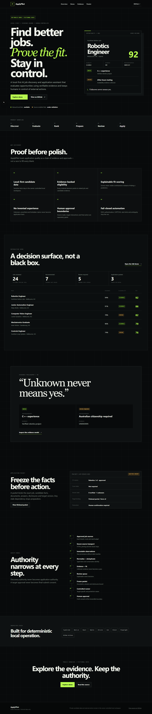
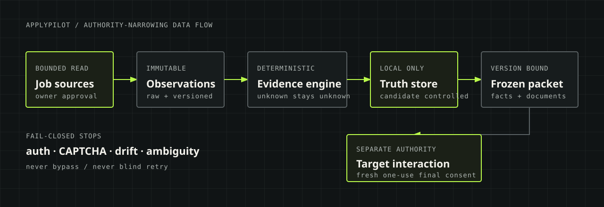
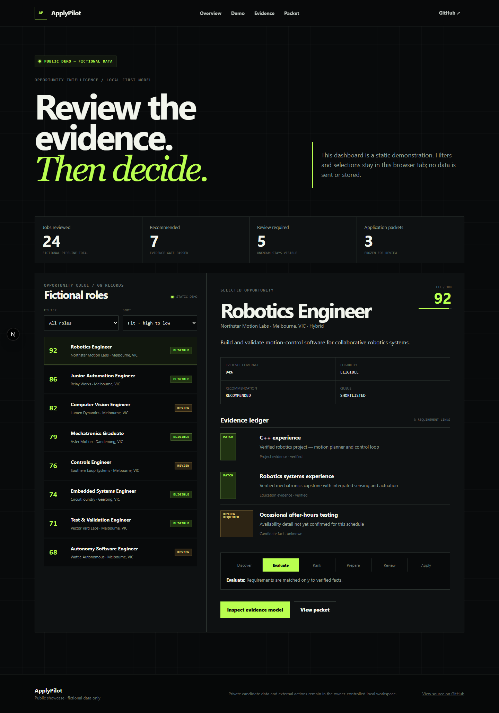
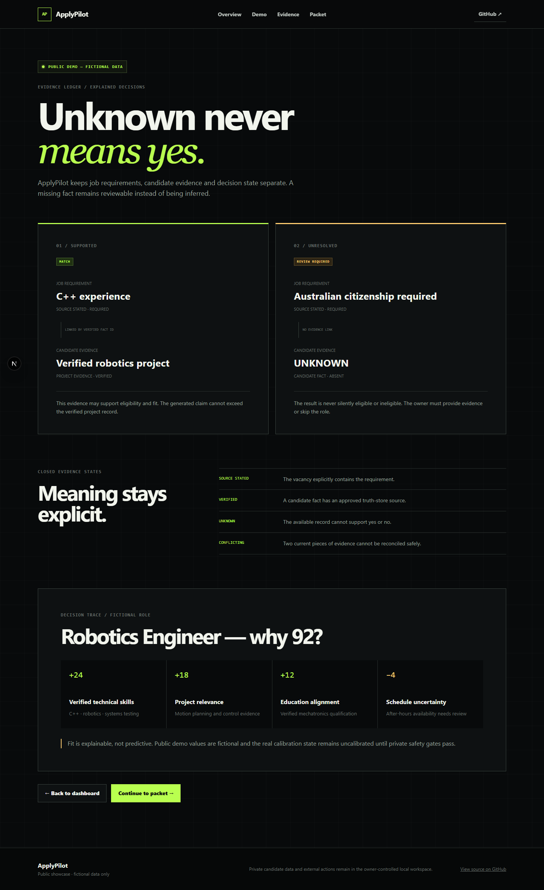
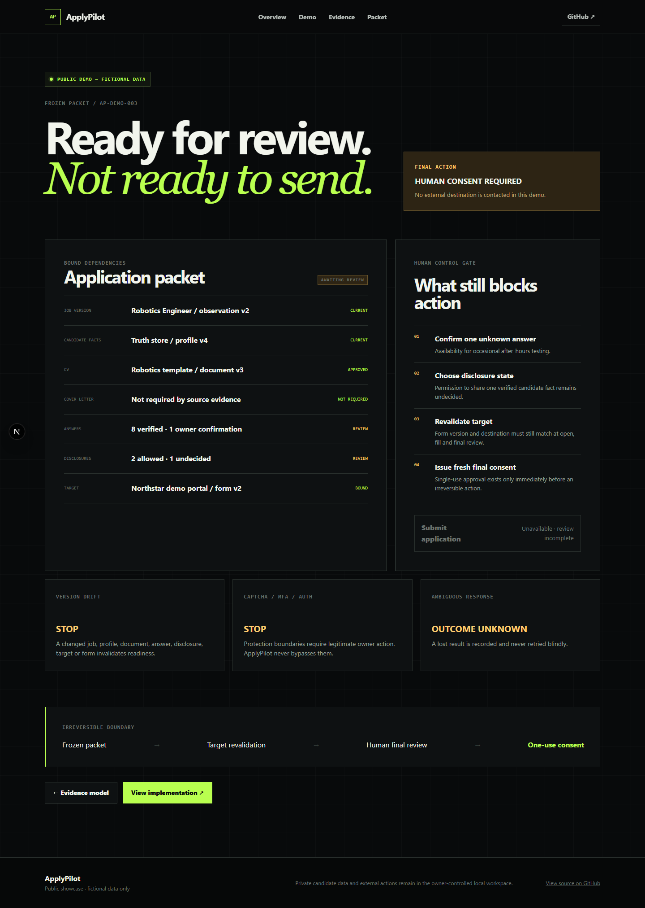

# ApplyPilot

[](https://github.com/adeel1608/applypilot/actions/workflows/ci.yml)


**A local-first AI job discovery and application assistant that proves the fit with evidence and keeps people in control of external actions.**

ApplyPilot turns a fragmented job search into a traceable workflow: discover opportunities, normalise them, test requirements against verified candidate facts, explain the ranking, prepare fact-bound documents, freeze an application packet, and stop at an explicit human approval boundary.

> The repository is public; candidate data is not. Real profiles, databases, vacancy inputs, generated documents, credentials, browser state, and runtime packets stay in ignored local storage.



## See the product

- [Live public showcase](https://applypilot.qss-ai-robot-7121.chatgpt.site)
- [Explore the static fictional demo](apps/showcase) locally with `npm run dev:showcase`
- [Inspect the evidence model](docs/CANDIDATE_TRUTH_STORE.md)
- [Read the architecture](ARCHITECTURE.md)
- [Review the safety model](SECURITY.md)

The public showcase is a separate static export with invented companies, roles, candidate evidence, and metrics. It has no database, server actions, source adapters, credentials, profile access, or application runner. See [docs/PUBLIC_SHOWCASE.md](docs/PUBLIC_SHOWCASE.md) for its boundary and validation model.

## What makes ApplyPilot different

| Principle                   | Product behaviour                                                                                          |
| --------------------------- | ---------------------------------------------------------------------------------------------------------- |
| Local-first candidate data  | Sensitive facts and generated artifacts remain in the owner-controlled workspace.                          |
| Evidence-backed eligibility | Material decisions link stated requirements to verified facts; missing evidence becomes `REVIEW_REQUIRED`. |
| Explainable matching        | Fit scores retain visible positive and negative contributions instead of hiding a prediction.              |
| No invented experience      | Unknown, unverified, and forbidden claims never become application facts.                                  |
| Narrow authority            | Source reads, target interactions, disclosures, and final submission use separate approvals.               |
| Fail-closed automation      | Drift, authentication, CAPTCHA, MFA, rate limits, bot controls, and ambiguous outcomes stop the run.       |

## Workflow

```text
Discover -> Normalise -> Evaluate -> Rank -> Prepare -> Review -> Apply
   |                         |                    |          |
bounded read          verified evidence      frozen     one-use human
authority             + visible unknowns     packet     final consent
```



The data path preserves immutable source observations and versioned decisions. Discovery authority never implies employer-form authority, and target authority never implies final-submit consent.

## Fictional product tour

| Opportunity dashboard                                         | Evidence decision                                    |
| ------------------------------------------------------------- | ---------------------------------------------------- |
|  |  |



Every screenshot and value above is fictional. The showcase deliberately demonstrates both supported facts and unresolved evidence so the safety model is visible, not merely described.

## Current readiness

- **Manual-intake Personal Beta:** ready for supervised local owner use.
- **Source-enabled Personal Beta:** not ready. Seven bounded source requests have occurred. The first two stopped before a usable response; later attempts reached accepted JSON and failed closed at response or persistence boundaries. The sixth exposed only a value-free non-critical `workplaceType` enum-drift diagnostic. The seventh passed the then-current response parser with 25 records, then rolled back atomically at persistence; no page or real job was persisted. No private provider value or payload was inspected. Offline hardening now keeps provider-contract failures page-fatal while accounting local product unusability per record, so valid siblings can persist and only accepted records reach R2/queue. This does not claim the inaccessible seventh-response cause or prove live ingestion. Any later live verification requires fresh exact owner approval.
- **Real employer interaction:** target approval required; no real target is configured.
- **Final submission:** always requires fresh exact human consent.
- **Hosted production application:** not ready. The static fictional showcase is not the private application.

Schema v7 and migrations `0000`–`0007` support immutable source capabilities, bounded source runs, evidence-aware matching, packet bindings, runner checkpoints, protection stops, and unknown-outcome recovery. The default mode remains deterministic and does not require a paid model or API.

## Repository map

```text
apps/
  showcase/                 static, fictional public product showcase
  web/                      local Next.js owner dashboard
packages/
  candidate-profile/        validated facts and forbidden-claim rules
  job-sources/              bounded adapters and source capabilities
  job-importer/             inert extraction, identity, and provenance
  eligibility-engine/       conservative blocker/review decisions
  fit-scorer/               explainable weighted ranking
  resume-engine/            fact-bound CV and DOCX/PDF generation
  application-runner/       frozen bindings, stops, and consent gates
  database/                 SQLite schema, repositories, migrations
docs/                       runbooks, threat model, product blueprints
tests/                      unit, integration, security, and browser gates
```

## Run the public showcase

Requirements: Node.js 24+, npm, and Git.

```bash
npm install
npm run dev:showcase
```

Open `http://localhost:3000`. Build and audit the deployable static files with:

```bash
npm run build:showcase
npm run showcase:audit
```

Only `apps/showcase/out` is deployable as the public showcase. Do not deploy the local application or any workspace/runtime data.

## Run the local application

The private local workflow additionally uses SQLite and Playwright Chromium:

```bash
npm install
npx playwright install chromium
npm run db:migrate
npm run db:migrate -- --confirm
npm run dev
```

Open `http://localhost:3000`. The first migration command previews the operation; the confirmed command creates and verifies an ignored backup before applying additive migrations. The server never auto-migrates a real database.

Only the fictional `data/profile.example.json` is committed. A real `data/profile.private.json` is ignored, server-only, and required for real local evaluations. Never add candidate values to Git. See [private profile setup](docs/PRIVATE_PROFILE_SETUP.md) and the [release runbook](docs/RELEASE_RUNBOOK.md).

On Windows PowerShell systems that block `npm.ps1`, use `npm.cmd` and `npx.cmd`.

## Quality gates

```bash
npm run format:check
npm run lint
npm run typecheck
npm test
npm run test:integration
npm run build
npm run test:e2e
npm run privacy:audit
npm run release:check
```

The root production build includes both the local application and the audited static showcase. Browser tests exercise the two surfaces separately.

## Safety guarantees

- Candidate-facing claims require verified truth-store provenance.
- Unknown or ambiguous eligibility evidence never silently becomes eligible.
- Private profiles, databases, generated documents, browser sessions, and credentials are excluded from Git.
- Untrusted source content is bounded, validated, and converted to inert text before display.
- CAPTCHA, MFA, authentication, access controls, rate limits, bot detection, and site drift are stop conditions.
- A lost or ambiguous submission response becomes `OUTCOME_UNKNOWN`, never a blind retry.
- Final application submission always requires fresh explicit human confirmation.

Read [SECURITY.md](SECURITY.md), the [threat model](docs/THREAT_MODEL_V1.md), and the [go-live checklist](docs/GO_LIVE_CHECKLIST.md) before handling real data or authority.

## Contributing

ApplyPilot is plan-first. Material changes begin in [PROJECT_PLAN.md](PROJECT_PLAN.md), use a focused branch, include proportional tests, and preserve every privacy and approval boundary. Start with [AGENTS.md](AGENTS.md) and [CONTRIBUTING.md](CONTRIBUTING.md).

Security reports must not include candidate data or secrets. Follow the private-reporting guidance in [SECURITY.md](SECURITY.md).

## Licence

No open-source licence has been selected. All rights are reserved until the owner chooses one.
